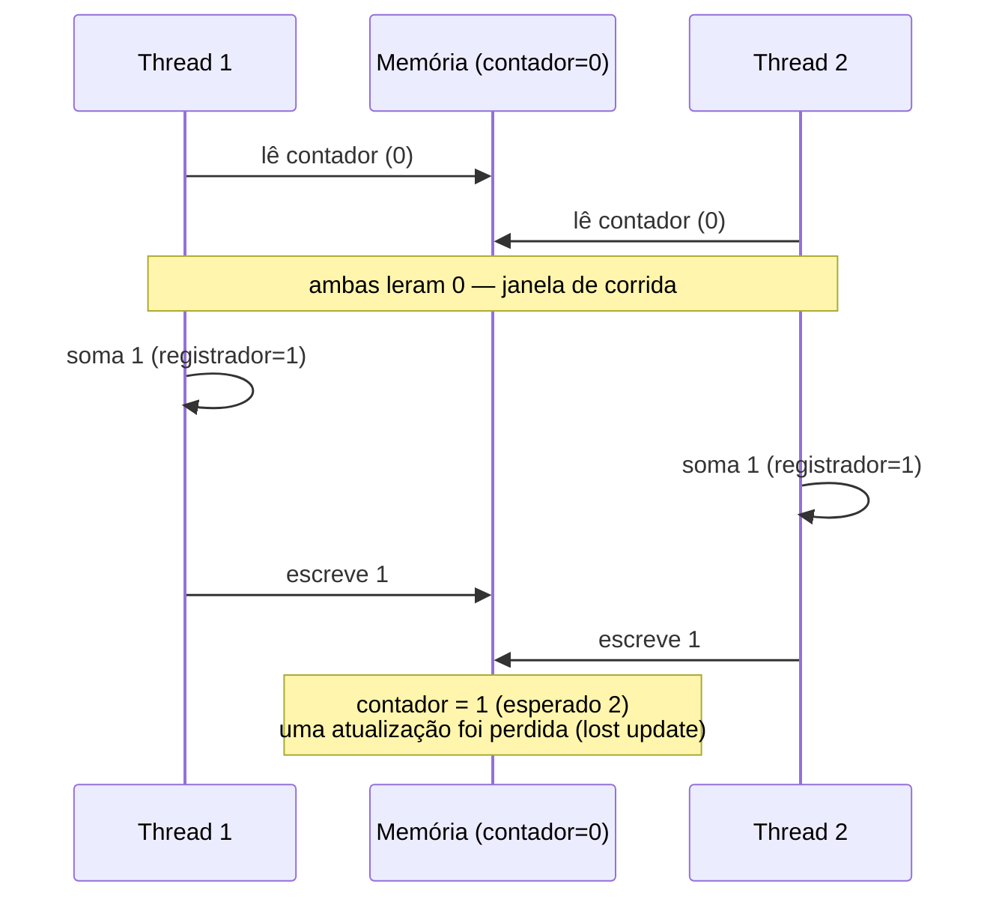
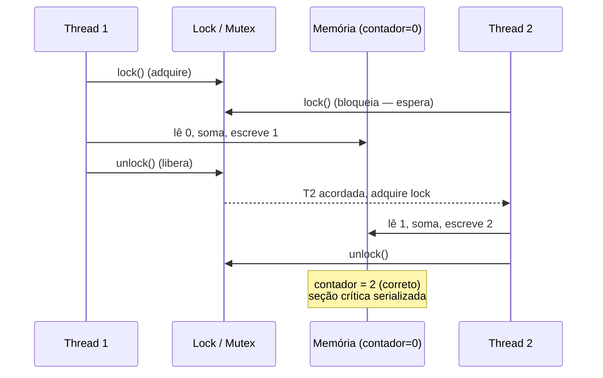

# Race Condition e Critical Section

> **Bloco:** Concorrência e paralelismo · **Nível:** Avançado · **Tempo de leitura:** ~22 min

## TL;DR

Uma **race condition** (condição de corrida) ocorre quando o **resultado** de um programa concorrente depende da **ordem (timing/intercalação) não controlada** em que múltiplas threads acessam um estado compartilhado — de modo que a mesma entrada pode produzir resultados diferentes em execuções diferentes, dependendo de "quem ganha a corrida". O caso canônico é o **lost update** (atualização perdida): duas threads leem o mesmo valor, ambas o incrementam e ambas escrevem de volta — uma das atualizações some, porque a operação `valor = valor + 1` **não é atômica** (é um read-modify-write composto por *ler*, *somar*, *escrever*, e o escalonador pode intercalar entre esses passos). A **critical section** (seção crítica) é o trecho de código que acessa esse estado compartilhado e onde a intercalação importa — é o local onde a race condition mora. A prevenção tem dois grandes caminhos: **eliminar o compartilhamento** (não compartilhar estado mutável: imutabilidade, confinamento de thread, mensageria/cópia) ou, quando há compartilhamento inevitável, **garantir exclusão mútua** na seção crítica (mutex/lock, `synchronized`, semáforos, monitores) ou usar **operações atômicas / CAS** (lock-free). Race conditions são insidiosas porque são **não-determinísticas e dependentes de timing**: passam em testes e em dev (baixa concorrência), e só se manifestam em produção sob carga — daí ferramentas de detecção como *race detectors* (`go test -race`, ThreadSanitizer) e revisão disciplinada de todo acesso a estado mutável compartilhado serem essenciais. Atenção à pegadinha: a race não é só do *write* concorrente; o **memory model** garante visibilidade e atomicidade só sob sincronização adequada — sem ela, há *data race* (comportamento indefinido) mesmo que "pareça" funcionar.

## O problema que resolve

Em sistemas concorrentes, múltiplas linhas de execução (threads, goroutines, processos) frequentemente precisam acessar o **mesmo estado** — um contador, um saldo, uma estrutura de dados, um cache. O escalonador do SO pode **intercalar** a execução dessas threads em qualquer ponto (preempção), e em hardware multinúcleo elas rodam **de fato em paralelo**. O problema central: **operações que parecem indivisíveis no código-fonte não são indivisíveis na execução**.

Tome a inocente linha `contador++`. Em alto nível, parece um único passo. Na realidade, ela compila para três operações de máquina:

1. **Ler** o valor de `contador` da memória para um registrador.
2. **Incrementar** o registrador.
3. **Escrever** o registrador de volta na memória.

Se duas threads executam `contador++` "ao mesmo tempo" e o escalonador as intercala assim — T1 lê (0), T2 lê (0), T1 soma (1) e escreve (1), T2 soma (1) e escreve (1) — o resultado final é **1**, não **2**. Uma das incrementações foi **perdida**. E o resultado depende inteiramente de *quando* o escalonador trocou as threads, algo que muda de execução para execução. Esse é o **lost update**, o arquétipo da race condition.

A pergunta que o tema responde: **"Como garantir que o resultado de um programa concorrente seja correto e determinístico, independentemente da ordem em que o escalonador intercala as threads que acessam estado compartilhado?"** A resposta passa por identificar *onde* está o estado compartilhado mutável (a seção crítica) e *como* coordenar o acesso — seja eliminando o compartilhamento, seja serializando o acesso à seção crítica.

A insídia está em três propriedades que tornam race conditions o pesadelo do depurador:

- **Não-determinismo:** o bug não acontece sempre; depende do timing exato da intercalação, que varia a cada execução.
- **Sensibilidade à carga:** em dev/teste, com pouca concorrência, a janela de intercalação é estreita e o bug raramente dispara; em produção, sob alta concorrência, ele aparece — frequentemente como dado corrompido silencioso, não como crash.
- **Heisenbug:** adicionar logging ou rodar no debugger muda o timing e pode fazer o bug "sumir", dificultando a reprodução.

## O que é (definição aprofundada)

### Race condition

Na definição de Jenkov, *"uma race condition é um problema de concorrência que pode ocorrer dentro de uma seção crítica; quando o resultado de múltiplas threads executando a seção crítica difere dependendo da sequência em que as threads executam, diz-se que a seção crítica contém uma race condition."* O nome vem da metáfora: as threads "correm" através da seção crítica, e o resultado da corrida afeta o resultado da execução.

É crucial distinguir dois subtipos clássicos:

- **Read-modify-write (lost update):** o caso do `contador++`. Threads leem um valor, computam um novo com base nele, e escrevem de volta; intercalações fazem atualizações se perderem. Exige atomicidade do conjunto ler-modificar-escrever.
- **Check-then-act:** uma thread *verifica* uma condição e depois *age* com base nela, mas entre a verificação e a ação outra thread muda o estado, invalidando a verificação. Exemplo: `if (instance == null) instance = new Singleton();` — duas threads veem `null` e criam duas instâncias. Lazy initialization, "criar se não existe", "checar saldo e debitar" são todos check-then-act.

### Data race vs race condition

Uma distinção fina mas importante (cobrada em entrevistas sênior):

- **Data race** é um conceito do **memory model**: ocorre quando dois acessos concorrentes à *mesma posição de memória*, sendo *pelo menos um deles uma escrita*, não estão ordenados por nenhuma relação de sincronização (*happens-before*). Em linguagens como Go, C++ e Java, um data race é **comportamento indefinido** (o compilador e a CPU podem reordenar, e a leitura pode "rasgar" — ver valor parcial). O Go memory model define data race precisamente nesses termos.
- **Race condition** é um conceito mais **semântico/de correção**: o resultado do programa depende do timing. Pode haver race condition *sem* data race (ex.: dois acessos atômicos individuais que, combinados em check-then-act, ainda produzem resultado errado) e data race que "não causa bug visível" (mas continua sendo comportamento indefinido).

Na prática, eliminar data races (com sincronização) é necessário mas **não suficiente**: você também precisa garantir que a *lógica* (a seção crítica como um todo) seja atômica em relação aos invariantes do negócio.

### Critical section (seção crítica)

A **seção crítica** é, na definição de Jenkov, *"uma seção de código executada por múltiplas threads e onde a sequência de execução das threads faz diferença no resultado."* É o trecho que toca o estado compartilhado mutável e precisa de proteção. As propriedades que uma solução de seção crítica deve garantir (formuladas classicamente em SO):

- **Exclusão mútua (mutual exclusion):** no máximo uma thread executa a seção crítica por vez.
- **Progresso (progress):** se nenhuma thread está na seção e alguma quer entrar, a decisão de quem entra não pode ser adiada indefinidamente (sem impasse).
- **Espera limitada (bounded waiting):** há um limite para quantas vezes outras threads entram antes de uma thread que está esperando conseguir entrar (sem starvation).

Manter a seção crítica **a menor possível** é um princípio de projeto: tudo dentro dela é serializado (vira fração serial da Lei de Amdahl) e contende; quanto menor e mais rápida, menor a contenção e melhor a escalabilidade.

### Atomicidade, visibilidade e ordenação

Três garantias que a sincronização correta fornece (e cuja ausência causa bugs):

- **Atomicidade:** a operação composta (read-modify-write) acontece como uma unidade indivisível — ninguém vê estados intermediários. `synchronized`, locks e operações atômicas (`AtomicInteger.incrementAndGet`) fornecem isso.
- **Visibilidade:** uma escrita feita por uma thread torna-se visível para outra. Sem sincronização (ou `volatile`/atômicos), uma thread pode **nunca ver** a atualização de outra (o valor pode ficar cacheado em registrador/cache de núcleo). Esse é um bug separado do lost update — é o de *visibilidade*.
- **Ordenação (ordering):** compilador e CPU podem **reordenar** instruções para otimizar; sem barreiras de memória, uma thread pode observar escritas de outra em ordem diferente da do código. O memory model define quais reordenamentos são permitidos e como `happens-before` os restringe.

## Como funciona

A correção de um programa concorrente com estado compartilhado se resolve por uma de duas estratégias (ou combinação):

**Caminho 1 — Eliminar o compartilhamento mutável.** Se não há estado mutável compartilhado, não há race. Técnicas:

- **Imutabilidade:** objetos imutáveis podem ser compartilhados livremente entre threads sem sincronização (ninguém pode mudá-los). Substituir mutação por criação de novos valores.
- **Confinamento de thread (thread confinement):** o estado é acessado por uma única thread (ex.: `ThreadLocal`, ou o modelo de ator onde cada ator processa suas mensagens sequencialmente). Não há acesso concorrente, logo não há race.
- **Troca de mensagens / cópia:** em vez de compartilhar memória, threads se comunicam passando cópias (CSP/canais em Go — *"don't communicate by sharing memory; share memory by communicating"*; modelo de atores em Erlang/Akka). A posse do dado se transfere; não há acesso simultâneo.

**Caminho 2 — Serializar o acesso à seção crítica.** Quando o compartilhamento mutável é inevitável:

- **Exclusão mútua (locks):** envolver a seção crítica com um lock (`synchronized`, `ReentrantLock`, mutex). Ao entrar, a thread adquire o lock; outras que tentem entrar bloqueiam até ele ser liberado. Garante atomicidade *e*, nos modelos de memória corretos, visibilidade/ordenação (a liberação do lock estabelece *happens-before* com a próxima aquisição).
- **Operações atômicas / CAS:** para operações simples (incrementar, trocar, comparar-e-trocar), classes atômicas (`AtomicInteger`, `sync/atomic` em Go) fornecem read-modify-write atômico em hardware, sem bloquear — lock-free. Resolve o lost update do contador sem lock.
- **Estruturas concorrentes prontas:** `ConcurrentHashMap`, filas concorrentes etc. encapsulam a sincronização correta; reusar em vez de reinventar.

O mecanismo de hardware por trás de tudo são as **instruções atômicas** da CPU (compare-and-swap, fetch-and-add, test-and-set) e as **barreiras de memória** (memory fences) que impõem ordenação. Locks e atômicos são construídos sobre elas. O memory model da linguagem (Java JMM, Go memory model) é o contrato que define quais garantias você obtém ao usar cada construção.

### Identificando race conditions

Como caçar a seção crítica e a race antes que a produção a encontre:

- **Inventário de estado mutável compartilhado:** liste toda variável/estrutura acessível por mais de uma thread e mutável. Cada uma é um candidato. Campos `static`, singletons, caches, contadores e coleções compartilhadas são suspeitos clássicos.
- **Procure read-modify-write e check-then-act:** `x++`, `x = x + 1`, `if (x == null) x = ...`, "verificar e então agir", "ler-calcular-gravar". São os padrões que exigem atomicidade composta.
- **Race detectors (dinâmicos):** `go test -race`, **ThreadSanitizer** (C/C++/Go), Java Helgrind/Java Flight Recorder, .NET concurrency analyzers. Instrumentam acessos a memória e detectam acessos não-ordenados em tempo de execução — essenciais porque race conditions escapam de testes funcionais.
- **Análise estática e revisão:** revisão de código focada em "este campo é tocado por mais de uma thread? está protegido?"; anotações como `@GuardedBy` (de *Java Concurrency in Practice*) documentam qual lock protege qual estado.
- **Testes de estresse / fuzzing de concorrência:** rodar com alta concorrência, muitas iterações, e ferramentas que introduzem atrasos aleatórios para ampliar a janela de intercalação.

## Diagrama de fluxo

O primeiro diagrama (sequenceDiagram) mostra o **lost update** clássico: duas threads incrementando o mesmo contador sem proteção, perdendo uma atualização. O segundo mostra como a exclusão mútua serializa o acesso à seção crítica, eliminando a corrida.





## Exemplo prático / caso real

O exemplo de manual em fintech: **dois débitos concorrentes no mesmo saldo**. Considere uma carteira digital brasileira onde o cliente tem saldo de R$ 100. Em um instante, chegam **duas requisições simultâneas** de débito de R$ 80 cada (ex.: cliente clica duas vezes no botão de pagar, ou duas integrações disparam ao mesmo tempo). A lógica ingênua é um **check-then-act** clássico:

```
// VULNERÁVEL A RACE CONDITION (check-then-act + lost update)
saldo = lerSaldo(conta)          // ambas leem 100
if (saldo >= valor) {            // ambas veem 100 >= 80 -> verdadeiro
    saldo = saldo - valor        // ambas calculam 100 - 80 = 20
    gravarSaldo(conta, saldo)    // ambas gravam 20
}
```

Sem proteção e sob intercalação, **ambas** as transações leem R$ 100, ambas verificam que há saldo suficiente, ambas calculam R$ 20 e ambas gravam R$ 20. Resultado: o cliente debitou **R$ 160** de uma conta que tinha **R$ 100**, e o saldo final é R$ 20 (deveria ter ficado negativo / a segunda transação deveria ter sido recusada). A instituição perdeu dinheiro por uma race condition — exatamente o tipo de bug que rende incidente sério e auditoria.

**Correções, do mais simples ao mais robusto:**

1. **Lock na seção crítica (in-process):** envolver ler-verificar-debitar-gravar com um lock por conta (`synchronized(conta)` / `ReentrantLock`). Serializa os dois débitos: o primeiro debita (saldo→20), o segundo, ao adquirir o lock depois, relê 20, vê que 20 < 80 e **recusa**. Correto — mas só funciona se ambas as requisições passam pela *mesma* instância da aplicação. Em um sistema distribuído (várias réplicas do serviço), um lock em memória não basta.
2. **Operação atômica no banco (a abordagem real):** delegar a atomicidade ao banco, que serializa por transação e bloqueio de linha. Um `UPDATE` condicional atômico resolve em uma só instrução:

   ```sql
   UPDATE contas SET saldo = saldo - 80
   WHERE id = :conta AND saldo >= 80;   -- atômico: verifica e debita juntos
   -- se rowcount = 0, saldo insuficiente -> recusa
   ```

   O banco garante que apenas uma das duas transações concorrentes terá sucesso; a outra verá `saldo >= 80` falso (ou bloqueará e relerá). Aqui o **check-then-act virou uma única operação atômica** no nível do banco — eliminando a janela de corrida.
3. **Optimistic locking (controle de versão):** adicionar uma coluna `versao`; o `UPDATE` só aplica se a versão não mudou (`WHERE versao = :lida`), e incrementa a versão. Se duas transações concorrem, a segunda falha (versão mudou) e reexecuta a lógica com o saldo atualizado. Útil quando a lógica é complexa demais para um único `UPDATE`.

A lição para o arquiteto: a seção crítica "ler saldo, verificar, debitar, gravar" precisa ser **atômica em relação ao invariante** "saldo nunca fica negativo". Em sistema distribuído, essa atomicidade vive no **banco** (locks de linha, transações, optimistic locking) ou num **lock distribuído** (Redis/ZooKeeper) — locks em memória local não cobrem múltiplas réplicas. E **chaves de idempotência** complementam: se o cliente clicou duas vezes, a mesma chave faz a segunda requisição ser reconhecida como duplicata e descartada.

## Quando usar / Quando evitar

Estas não são tecnologias opcionais — são *obrigações* sempre que há estado mutável compartilhado. As diretrizes:

**Prefira eliminar o compartilhamento** sempre que possível: imutabilidade, confinamento de thread e troca de mensagens são as soluções mais robustas porque removem a *possibilidade* da race, não apenas a serializam. Use-as como primeira opção.

**Use exclusão mútua (locks)** quando o compartilhamento mutável é inevitável e a seção crítica envolve múltiplas operações que precisam ser atômicas em conjunto (invariantes que abrangem vários campos). Mantenha a seção crítica **mínima**. **Evite** locks de granularidade grossa que serializam demais (matam a escalabilidade) e múltiplos locks aninhados sem ordem definida (risco de deadlock).

**Use operações atômicas / CAS** para operações simples e isoladas (contadores, flags, swap de referência) — são mais rápidas que locks e não bloqueiam. **Evite** quando a operação composta abrange múltiplas variáveis que precisam mudar juntas (um atômico só cobre uma posição; aí precisa de lock).

**Em sistemas distribuídos, evite confiar em locks de memória local** — a seção crítica precisa ser protegida onde o estado de fato vive (banco, com transações/optimistic locking, ou lock distribuído). Combine com **idempotência** para tolerar duplicatas.

**Sempre rode race detectors** (`-race`, ThreadSanitizer) em CI para código concorrente — não confie em testes funcionais para pegar races.

## Anti-padrões e armadilhas comuns

- **Achar que `x++` é atômico.** O erro fundamental. É read-modify-write; sob concorrência, perde atualizações. Use `AtomicInteger`/`sync/atomic` ou proteja com lock.
- **Check-then-act sem atomicidade.** `if (!existe) cria()`, `if (saldo >= v) debita()`, lazy init `if (inst == null) inst = new()`. A verificação e a ação precisam ser uma unidade atômica; senão, outra thread muda o estado no meio.
- **Confundir visibilidade com atomicidade.** `volatile` (Java) garante *visibilidade* e ordenação, mas **não** atomicidade de read-modify-write — `volatileInt++` ainda tem race. Para incrementar, precisa de atômico ou lock.
- **Proteger só *algumas* das acessos.** Se um campo é escrito sob lock mas lido sem lock (ou vice-versa), ainda há data race. *Todos* os acessos ao estado compartilhado devem usar a mesma disciplina de sincronização.
- **Seção crítica grande demais.** Colocar I/O, chamadas de rede ou trabalho pesado dentro do lock serializa tudo, mata a escalabilidade e prolonga a contenção. Mantenha a seção mínima — só o acesso ao estado compartilhado.
- **"Funciona na minha máquina / passou nos testes".** Race conditions são não-determinísticas; ausência de falha em teste de baixa concorrência **não** prova ausência de race. Use race detectors e testes de estresse.
- **Lock em objeto errado / lock por instância quando o estado é estático.** Sincronizar em `this` quando o estado compartilhado é `static` (compartilhado entre instâncias) não protege nada — cada instância tem seu próprio lock, mas o estado é único.
- **Lock local em sistema distribuído.** `synchronized`/mutex protegem dentro de um processo; com várias réplicas do serviço, a race persiste no recurso compartilhado (banco). Use a atomicidade do banco ou lock distribuído.
- **Double-checked locking quebrado.** A tentativa clássica de otimizar lazy init (`if(inst==null){ synchronized{ if(inst==null) inst=new() }}`) é sutilmente **incorreta sem `volatile`** no campo, por causa de reordenamento na publicação do objeto (outra thread pode ver a referência antes do construtor terminar). É o exemplo de manual de por que entender o memory model importa.

## Relação com outros conceitos

- **Concorrência vs paralelismo:** concorrência (acesso intercalado a estado compartilhado) é a precondição da race condition; paralelismo real amplia a janela e a frequência das corridas.
- **Primitivas de sincronização (Mutex/Semaphore/Monitor):** são as ferramentas para impor exclusão mútua na seção crítica; a escolha entre elas depende da semântica (posse, contagem, condições).
- **Atomic / CAS / lock-free:** a alternativa sem bloqueio para resolver o lost update e check-then-act simples, construída sobre instruções atômicas de hardware.
- **Memory model:** define os conceitos de data race, *happens-before*, visibilidade e ordenação — o contrato que torna a sincronização correta; double-checked locking e `volatile` só fazem sentido sob ele.
- **Idempotência:** complementa a proteção contra duplicatas (cliente que clica duas vezes) — torna seguro repetir a operação mesmo que a deduplicação na seção crítica falhe.
- **Optimistic locking (banco):** a versão distribuída/persistente da proteção de seção crítica, resolvendo lost update no nível do registro com controle de versão.
- **Deadlock/Livelock/Starvation:** o uso de locks para proteger seções críticas introduz o risco desses problemas — o remédio da race pode trazer outras doenças se mal aplicado.

## Referências

- [Race Conditions and Critical Sections — Jenkov](https://jenkov.com/tutorials/java-concurrency/race-conditions-and-critical-sections.html)
- [Synchronization (The Java Tutorials) — Oracle](https://docs.oracle.com/javase/tutorial/essential/concurrency/sync.html)
- [Intrinsic Locks and Synchronization (The Java Tutorials) — Oracle](https://docs.oracle.com/javase/tutorial/essential/concurrency/locksync.html)
- [Atomic Access (The Java Tutorials) — Oracle](https://docs.oracle.com/javase/tutorial/essential/concurrency/atomic.html)
- [The Go Memory Model (definição de data race) — go.dev](https://go.dev/ref/mem)
- [Race condition — Wikipedia](https://en.wikipedia.org/wiki/Race_condition)
- [Operating Systems: Three Easy Pieces — Concurrency, Arpaci-Dusseau](https://pages.cs.wisc.edu/~remzi/OSTEP/)
