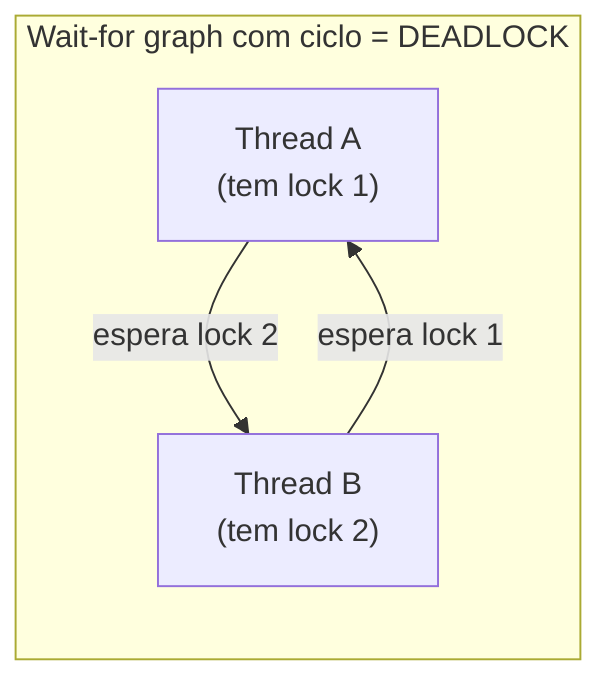
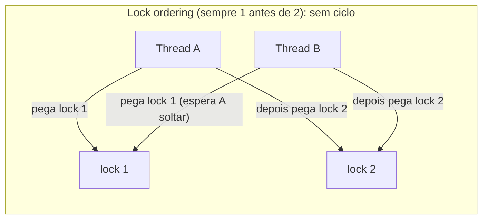
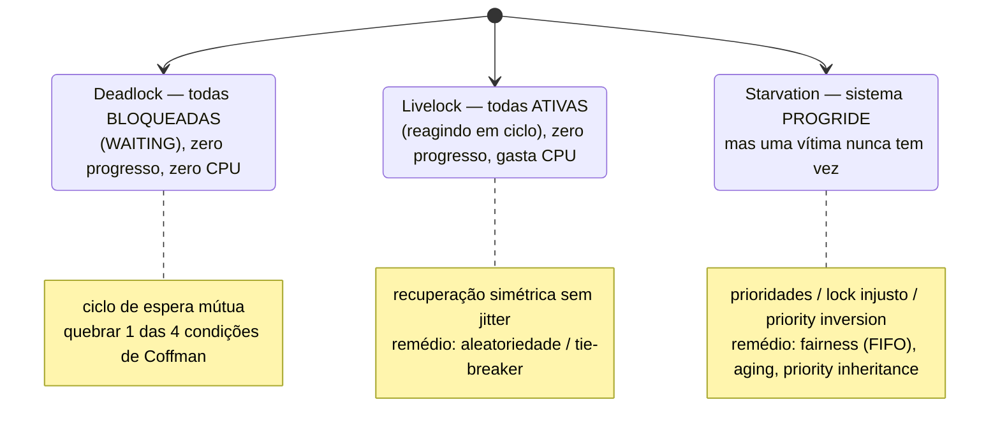

# Deadlock, Livelock e Starvation

> **Bloco:** Concorrência e paralelismo · **Nível:** Avançado · **Tempo de leitura:** ~24 min

## TL;DR

São três patologias de **liveness** (vivacidade) — falhas em que threads deixam de fazer progresso, mesmo sem erro lógico. **Deadlock** (impasse) é o travamento total: um conjunto de threads fica **bloqueado para sempre**, cada uma esperando um recurso que outra do grupo segura, num ciclo. Coffman, Elphick e Shoshani (1971) provaram que um deadlock só ocorre se **quatro condições** valem simultaneamente: **(1) exclusão mútua** (recurso não-compartilhável), **(2) hold-and-wait** (segura um recurso e espera outro), **(3) no preemption** (recurso só é liberado voluntariamente) e **(4) circular wait** (cadeia circular de esperas). Quebrar **qualquer uma** das quatro previne o deadlock — a prevenção mais usada na prática é eliminar o circular wait via **ordenação global de locks** (sempre adquirir locks na mesma ordem) ou eliminar o hold-and-wait via **lock timeout + backoff**. **Livelock** é mais sutil: as threads **não estão bloqueadas** (estão ativas, executando), mas ficam reagindo umas às outras em ciclo e **nenhuma progride** — como duas pessoas num corredor que desviam para o mesmo lado repetidamente. **Starvation** (inanição) é quando uma thread específica **nunca consegue** os recursos de que precisa porque outras (mais "gulosas" ou de maior prioridade) sempre passam na frente — o remédio é **fairness** (FIFO/justiça no acesso, ex.: `ReentrantLock(true)`). Pegadinhas de entrevista: deadlock ≠ livelock (bloqueado vs ocupado-sem-progresso); a estratégia de detecção (wait-for graph) vs prevenção (Coffman) vs evitação (banker's algorithm); e *priority inversion* como causa de starvation.

## O problema que resolve

Resolver race conditions com **locks** (exclusão mútua) elimina um problema mas abre a porta para outro: agora as threads *competem* por locks, e essa competição pode travar o progresso de formas que não são erros de lógica, mas erros de **coordenação**. O programa não "calcula errado" — ele simplesmente **para de avançar** ou avança de forma injusta. São falhas de *liveness* (a propriedade de que "algo bom eventualmente acontece"), em contraste com falhas de *safety* (a propriedade de que "nada ruim acontece", como race conditions corromperem dados).

A pergunta central: **"Ao usar locks e recursos compartilhados para garantir correção, como evitar que as threads se travem mutuamente (deadlock), fiquem ocupadas reagindo em ciclo sem progredir (livelock), ou que alguma nunca consiga sua vez (starvation)?"**

O cenário clássico de deadlock é simples e devastador: a thread A adquire o lock 1 e quer o lock 2; ao mesmo tempo, a thread B adquire o lock 2 e quer o lock 1. A espera B; B espera A. Ninguém solta nada. As duas threads ficam **bloqueadas para sempre** — e, num servidor, isso significa que as duas conexões (e, com o esgotamento do pool, eventualmente *todas*) param de responder. O serviço "trava" sem nenhum erro nos logs, sem stack trace de exceção — apenas threads paradas em `WAITING`. É um dos incidentes mais difíceis de diagnosticar em produção porque não há crash, só silêncio.

Livelock e starvation são variações do mesmo tema (falta de progresso) com mecanismos diferentes: no livelock, as threads gastam CPU "tentando" mas se anulam; na starvation, o sistema *funciona*, mas uma vítima específica é eternamente preterida. Entender os três — e suas distinções — é essencial para projetar coordenação correta e para diagnosticar incidentes onde "o sistema travou mas não deu erro".

## O que é (definição aprofundada)

### Deadlock e as quatro condições de Coffman

**Deadlock** é um estado em que um conjunto de threads está permanentemente bloqueado, cada uma esperando por um recurso que outra thread *do mesmo conjunto* mantém, de modo que nenhuma jamais prossegue. Coffman, Elphick e Shoshani (1971) demonstraram que o deadlock ocorre **se e somente se** as quatro condições a seguir valem **ao mesmo tempo** (são *necessárias*; juntas, *suficientes*):

1. **Exclusão mútua (mutual exclusion):** ao menos um recurso é não-compartilhável — só uma thread pode usá-lo por vez. Se todos os recursos pudessem ser compartilhados livremente, ninguém esperaria.
2. **Hold and wait (segurar e esperar):** uma thread segura pelo menos um recurso *e* espera por outro recurso que está sendo segurado por outra thread (sem soltar o que já tem).
3. **No preemption (sem preempção):** um recurso não pode ser tomado à força de quem o segura — só é liberado **voluntariamente** pela thread que o detém, quando ela termina.
4. **Circular wait (espera circular):** existe uma cadeia circular de threads {T1, T2, ..., Tn} em que T1 espera um recurso que T2 segura, T2 espera um que T3 segura, ..., e Tn espera um que T1 segura. O ciclo se fecha.

A força desse teorema é prática: **basta quebrar UMA das quatro condições** para tornar o deadlock impossível. As estratégias de **prevenção** atacam, cada uma, uma condição:

- **Quebrar mutual exclusion:** usar recursos compartilháveis quando possível (ex.: estruturas lock-free, recursos somente-leitura, copy-on-write). Nem sempre é possível (alguns recursos são intrinsecamente exclusivos).
- **Quebrar hold-and-wait:** adquirir **todos** os locks de uma vez no início (all-or-nothing) — se não conseguir todos, não segura nenhum; ou nunca segurar um lock enquanto espera outro. Reduz concorrência (segura recursos por mais tempo) e exige saber de antemão todos os recursos necessários.
- **Quebrar no-preemption:** permitir tomar recursos à força ou, mais comum na prática, usar **lock com timeout** (`tryLock(timeout)`): se a thread não consegue todos os locks no prazo, **libera os que tem**, espera um tempo aleatório (backoff com jitter) e tenta de novo. Quebra o impasse, mas pode causar livelock se mal feito (sem jitter).
- **Quebrar circular wait (a mais usada):** impor uma **ordem global total** sobre os locks e exigir que toda thread os adquira **sempre na mesma ordem** (lock ordering). Se A e B sempre pegam o lock 1 antes do lock 2, é impossível formar o ciclo "A tem 1 quer 2 / B tem 2 quer 1". Esta é a técnica mais prática e barata; o desafio é disciplina (todo o código precisa respeitar a ordem) e a definição de uma ordem consistente.

Além da prevenção, há duas outras famílias de estratégia:

- **Evitação (avoidance):** o sistema concede recursos só se a concessão mantém o estado "seguro" (não pode levar a deadlock). O exemplo clássico é o **algoritmo do banqueiro (banker's algorithm)** de Dijkstra: exige conhecer de antemão a demanda máxima de cada thread e simula a alocação para garantir que sempre exista uma sequência de finalização. É elegante na teoria, mas raro na prática (exige conhecimento prévio das demandas; caro).
- **Detecção e recuperação (detection & recovery):** permitir que deadlocks ocorram, **detectá-los** (ex.: construir periodicamente o **wait-for graph** — grafo de espera — e procurar ciclos) e **recuperar** (abortar uma das threads/transações da vítima, fazer rollback e reiniciar). É o que **bancos de dados** fazem: o SGBD detecta deadlocks entre transações e mata uma (a "vítima de deadlock") com rollback, deixando a outra prosseguir.

### Livelock

**Livelock** é uma falha de liveness em que as threads **não estão bloqueadas** — elas estão *ativas*, mudando de estado e consumindo CPU — mas **nenhuma faz progresso útil**, porque cada uma reage continuamente à ação da outra num ciclo que se auto-perpetua. A metáfora canônica (de Jenkov / Oracle): duas pessoas se cruzam num corredor estreito; cada uma desvia para o mesmo lado para deixar a outra passar; percebem que continuam bloqueando e desviam para o outro lado — ao mesmo tempo — e seguem nesse balé indefinidamente, sempre se movendo, nunca passando.

Em software, livelock surge tipicamente de **mecanismos ingênuos de recuperação de deadlock**: threads que, ao detectar que não conseguiram todos os locks, **liberam tudo e tentam de novo imediatamente** — e, se todas fazem isso em sincronia, ficam num ciclo de "pegar-desistir-pegar-desistir" sem que ninguém complete. A diferença crucial para o deadlock: no deadlock as threads estão **paradas** (bloqueadas, em `WAITING`); no livelock estão **ocupadas** (queimando CPU), o que pode até parecer "o sistema está trabalhando" no monitoramento, mas sem throughput. O remédio é introduzir **aleatoriedade (jitter)** nos backoffs, de modo que as threads não retentem em uníssono — quebrando a simetria que perpetua o ciclo.

### Starvation (inanição)

**Starvation** ocorre quando uma thread específica **nunca consegue** acesso aos recursos de que precisa para progredir, porque outras threads sempre são escolhidas na frente dela. Diferente do deadlock (onde *todo* o grupo trava) e do livelock (onde *ninguém* progride), na starvation **o sistema progride** — mas à custa de uma vítima eternamente preterida. Causas comuns (de Jenkov):

- **Prioridades:** threads de alta prioridade monopolizam a CPU, e as de baixa prioridade nunca rodam (CPU starvation).
- **Locks injustos (não-fair):** quando muitas threads disputam o mesmo lock e a política de concessão não garante ordem, threads "azaradas" podem ser sistematicamente passadas para trás, esperando indefinidamente para entrar numa seção `synchronized`.
- **Priority inversion (inversão de prioridade):** uma causa traiçoeira — uma thread de **baixa** prioridade segura um lock de que uma thread de **alta** prioridade precisa; mas threads de prioridade *média* preemptam a de baixa, que então nunca solta o lock, deixando a de alta prioridade "starved" indiretamente. (Famoso por ter causado resets no rover Mars Pathfinder.) A solução é **herança de prioridade (priority inheritance)**: a thread que segura o lock herda temporariamente a prioridade da mais alta que o espera.

O remédio geral para starvation é **fairness (justiça)**: garantir que toda thread eventualmente tenha sua vez. Locks justos (fair locks) atendem as requisições em ordem **FIFO** — `ReentrantLock(true)` em Java força essa ordem, eliminando a starvation no acesso ao lock (ao custo de menor throughput, porque a justiça impede otimizações de barganha). Filas justas e escalonadores com aging (aumentar a prioridade de quem espera há muito) são outras formas.

## Como funciona

A prevenção de deadlock por **lock ordering** funciona assim, conceitualmente: atribua a cada lock um identificador numérico único (uma ordem total). A regra: uma thread só pode adquirir um lock cujo ID seja **maior** que o do lock de maior ID que ela já segura. Com isso, é impossível formar um ciclo: para fechar o ciclo, alguma thread teria que esperar por um lock de ID *menor* que um que já segura, o que a regra proíbe. No exemplo A/B: se ambos sempre pegam `lock(1)` antes de `lock(2)`, então quem tem o `lock(2)` já passou por `lock(1)` (ou nunca o quis) — nunca ocorre "A tem 1 espera 2 enquanto B tem 2 espera 1".

A prevenção por **lock timeout + backoff** funciona dinamicamente: a thread tenta adquirir os locks de que precisa com `tryLock(timeout)`. Se não consegue todos dentro do prazo, ela **libera todos os que conseguiu**, espera um tempo **aleatório** (jitter — para não re-sincronizar com as outras) e tenta de novo do zero. Isso quebra o hold-and-wait (não fica segurando indefinidamente) e o no-preemption (efetivamente abre mão dos recursos). O risco é livelock se o backoff não for aleatório; o jitter resolve.

A **detecção** via wait-for graph funciona assim: o sistema mantém (ou constrói periodicamente) um grafo direcionado onde cada nó é uma thread/transação e há uma aresta T1→T2 se T1 espera um recurso que T2 segura. Um **ciclo** nesse grafo *é* um deadlock. Detectado o ciclo, escolhe-se uma **vítima** (geralmente a de menor custo de rollback ou a mais nova) e a aborta, quebrando o ciclo; a vítima reexecuta. Bancos de dados (PostgreSQL, MySQL/InnoDB, Oracle) fazem exatamente isso entre transações, retornando um erro de "deadlock detected" para a transação vítima.

Para **livelock**, a "solução" é projetar a recuperação para **não ser simétrica**: backoff aleatório (jitter), prioridades/tie-breakers que decidam deterministicamente quem cede, ou um coordenador. Para **starvation**, a solução é tornar a política de concessão **justa** (FIFO/aging) e usar herança de prioridade contra priority inversion.

## Diagrama de fluxo

O primeiro diagrama é o **wait-for graph** clássico de um deadlock entre duas threads (ciclo). O segundo mostra como o **lock ordering** elimina o ciclo. O terceiro contrasta os três fenômenos (deadlock/livelock/starvation) quanto a estado e progresso.







## Exemplo prático / caso real

**Deadlock clássico: transferência entre contas (fintech).** Um serviço de transferência banco a banco trava recursos por conta para evitar race conditions no saldo. A operação "transferir de A para B" adquire o lock da conta origem e depois o da conta destino:

```
// VULNERÁVEL A DEADLOCK
void transferir(Conta origem, Conta destino, valor) {
    lock(origem);          // adquire lock da conta origem
    lock(destino);         // depois o da conta destino
    origem.debita(valor);
    destino.credita(valor);
    unlock(destino); unlock(origem);
}
```

Agora considere **duas transferências concorrentes em sentidos opostos**: a transação T1 transfere de **João → Maria** (pega lock de João, quer o de Maria); ao mesmo tempo, T2 transfere de **Maria → João** (pega lock de Maria, quer o de João). T1 segura João e espera Maria; T2 segura Maria e espera João. **Deadlock** — as quatro condições de Coffman estão presentes (locks exclusivos, hold-and-wait, sem preempção, espera circular). Os dois clientes ficam com a transferência travada para sempre, e as threads do serviço presas em `WAITING`; sob carga, o pool esgota e o serviço inteiro para de responder.

**Correção por lock ordering (quebrando circular wait):** adquirir os locks **sempre na mesma ordem global**, por exemplo por ID da conta (sempre o menor ID primeiro), independentemente de qual é origem ou destino:

```
// SEGURO: ordenação global de locks por ID
void transferir(Conta origem, Conta destino, valor) {
    Conta primeira  = min(origem, destino, by=id);  // sempre o menor ID primeiro
    Conta segunda   = max(origem, destino, by=id);
    lock(primeira);
    lock(segunda);
    origem.debita(valor); destino.credita(valor);
    unlock(segunda); unlock(primeira);
}
```

Agora T1 e T2, mesmo em sentidos opostos, pegam os locks na *mesma* ordem (digamos João tem ID menor que Maria: ambas pegam João primeiro). Uma delas adquire João, a outra **espera** por João (sem segurar Maria ainda) — não há ciclo, sem deadlock. Esta é a correção mais limpa e a resposta esperada em entrevista.

**Alternativa por timeout (quebrando no-preemption):** usar `tryLock(timeout)`; se não conseguir o segundo lock no prazo, **libera o primeiro**, espera um tempo **aleatório** e retenta. Funciona, mas é mais frágil: se o jitter for esquecido e ambas as transações retentarem em sincronia, vira **livelock** (pegam o primeiro lock, falham no segundo, soltam, retentam juntas, repetem) — gastando CPU sem progredir. O jitter é o que quebra essa simetria.

**Starvation no pool de conexões.** Num serviço sob carga, o pool de conexões com o banco tem 20 slots. Threads de relatórios pesados seguram conexões por longos períodos; threads de requisições rápidas de checkout disputam as conexões restantes. Sem fairness na fila do pool, sob contenção alta, algumas requisições de checkout podem ser sistematicamente preteridas e **timeoutar esperando conexão** (starvation), mesmo que o sistema "esteja funcionando" para os relatórios. A correção é uma fila **justa (FIFO)** de espera por conexão e/ou particionar o pool (bulkhead) por classe de tráfego, garantindo que checkout não seja eternamente passado para trás.

**Detecção pelo banco.** Quando o lock ordering não é viável (lógica complexa, locks pegos em ordens diferentes por código legado), bancos como PostgreSQL/InnoDB **detectam** o deadlock entre transações automaticamente (via wait-for graph interno), abortam uma transação vítima com erro `deadlock detected` e fazem rollback. A aplicação deve então **capturar esse erro e reexecutar** a transação (com backoff). É uma estratégia de detecção+recuperação válida quando a prevenção é cara demais.

## Quando usar / Quando evitar

Estas são estratégias de *coordenação*, escolhidas conforme o contexto:

**Prevenção por lock ordering:** use sempre que você controla a ordem de aquisição e consegue definir uma ordem global consistente (por ID, por endereço, por nível). É a técnica padrão, barata e robusta para deadlocks de múltiplos locks. **Evite** quando a ordem dos recursos não é conhecida de antemão ou é imposta por bibliotecas/legado que você não controla.

**Prevenção por lock timeout + backoff (jitter):** use quando lock ordering não é factível (recursos descobertos dinamicamente). **Evite sem jitter** — backoff síncrono vira livelock. Aceite que adiciona latência e retries.

**Evitação (banker's algorithm):** raramente usada na prática (exige conhecer a demanda máxima de cada thread e é cara). Conceito importante para entrevista, mas evite em sistemas reais.

**Detecção e recuperação:** use quando prevenir é caro/inviável e o sistema tolera abortar-e-reexecutar — é o modelo dos **bancos de dados** (deadlock detection + rollback da vítima). A aplicação deve capturar o erro e retentar. **Evite** em operações não-idempotentes sem cuidado (a reexecução precisa ser segura).

**Fairness (contra starvation):** use fair locks/filas FIFO quando a starvation é um risco real (alta contenção, classes de tráfego desiguais) e a latência da cauda (p99) importa. **Evite fairness por padrão em tudo**: ela reduz o throughput (impede otimizações de barganha); use onde a justiça é necessária, não em toda parte.

**Herança de prioridade:** use em sistemas com prioridades de thread reais (tempo real, RTOS) para evitar priority inversion. Em sistemas de aplicação típicos com escalonamento justo do SO, raramente é uma preocupação direta.

## Anti-padrões e armadilhas comuns

- **Adquirir locks em ordens inconsistentes.** A causa nº 1 de deadlock. Funções diferentes que pegam os mesmos dois locks em ordens opostas formam o ciclo. Imponha e documente uma ordem global de locks.
- **Confundir deadlock com livelock (pegadinha de entrevista).** No deadlock as threads estão **bloqueadas/paradas** (`WAITING`, sem CPU); no livelock estão **ativas e gastando CPU** mas sem progredir. Diagnóstico difere: deadlock aparece como threads paradas num thread dump; livelock como CPU alta sem throughput.
- **Recuperação simétrica sem jitter (causa livelock).** Threads que detectam contenção, liberam tudo e retentam **imediatamente e em uníssono** ficam num ciclo eterno. Sempre adicione backoff **aleatório**.
- **`tryLock` sem liberar os locks já obtidos.** Se a thread falha em pegar o segundo lock mas **não libera** o primeiro antes de retentar, mantém o hold-and-wait e o deadlock persiste. Libere tudo no caminho de falha.
- **Lock aninhado / nested monitor lockout.** Esperar por uma condição (`wait()`) enquanto se segura um lock externo de que outra thread precisa para sinalizar a condição — trava as duas. Cuidado com a interação entre locks aninhados e variáveis de condição.
- **Segurar lock durante I/O ou chamada externa.** Manter um lock durante uma operação lenta/bloqueante (rede, disco) prolonga a janela de contenção e pode levar a starvation ou cascata; mantenha a seção crítica curta e nunca chame código externo desconhecido segurando um lock.
- **Ignorar deadlocks de banco e não retentar.** Bancos abortam a vítima com erro de deadlock; código que não captura e reexecuta esse erro propaga uma falha que era recuperável. Trate `deadlock detected` como transitório e retente (com backoff).
- **Achar que fairness não tem custo.** Fair locks (`ReentrantLock(true)`) eliminam starvation mas reduzem o throughput; usá-los em toda parte por precaução degrada a performance. Use onde a justiça é necessária.
- **Priority inversion não tratada.** Em sistemas com prioridades, uma thread de baixa prioridade segurando um lock crítico pode "starvar" indiretamente uma de alta prioridade. Use herança de prioridade onde isso importa.
- **Confiar em `Thread.sleep` para "resolver" contenção.** Dormir um tempo fixo para "evitar" deadlock/livelock é frágil e dependente de timing — não é solução, é mascaramento que falha sob carga diferente.

## Relação com outros conceitos

- **Race Condition e Critical Section:** locks resolvem races protegendo seções críticas, mas introduzem o risco de deadlock/livelock/starvation; é o trade-off central — o remédio da safety pode trazer doenças de liveness.
- **Primitivas de sincronização (Mutex/Semaphore/Monitor):** são os recursos cuja aquisição em ordens conflitantes causa deadlock; fair locks e variáveis de condição são as ferramentas contra starvation e para coordenação correta.
- **Optimistic locking (banco):** uma alternativa que *evita* locks pessimistas (e seus deadlocks) usando controle de versão e retry — trocando bloqueio por detecção de conflito na escrita.
- **Padrões de resiliência (Retry com backoff + jitter):** o mesmo jitter que evita retry storms em sistemas distribuídos é o que evita livelock na recuperação de contenção de locks — o princípio (quebrar simetria com aleatoriedade) é idêntico.
- **Bulkhead / Thread pools:** particionar pools por classe de tráfego previne que uma classe "starve" outra ao monopolizar recursos compartilhados.
- **Atomic / CAS / lock-free:** algoritmos lock-free eliminam deadlock por construção (não há locks para travar mutuamente), embora ainda possam sofrer starvation (lock-free garante progresso do sistema, não de cada thread; wait-free garante o de cada thread).

## Referências

- [Deadlock — Jenkov](https://jenkov.com/tutorials/java-concurrency/deadlock.html)
- [Deadlock Prevention (lock ordering, timeout) — Jenkov](https://jenkov.com/tutorials/java-concurrency/deadlock-prevention.html)
- [Starvation and Fairness — Jenkov](https://jenkov.com/tutorials/java-concurrency/starvation-and-fairness.html)
- [Starvation and Livelock (The Java Tutorials) — Oracle](https://docs.oracle.com/javase/tutorial/essential/concurrency/starvelive.html)
- [Deadlock (computer science) — Wikipedia (condições de Coffman)](https://en.wikipedia.org/wiki/Deadlock_(computer_science))
- [Operating Systems: Three Easy Pieces — Deadlock, Arpaci-Dusseau](https://pages.cs.wisc.edu/~remzi/OSTEP/)
- [ReentrantLock (fair lock) — Oracle Java SE 21](https://docs.oracle.com/en/java/javase/21/docs/api/java.base/java/util/concurrent/locks/ReentrantLock.html)
