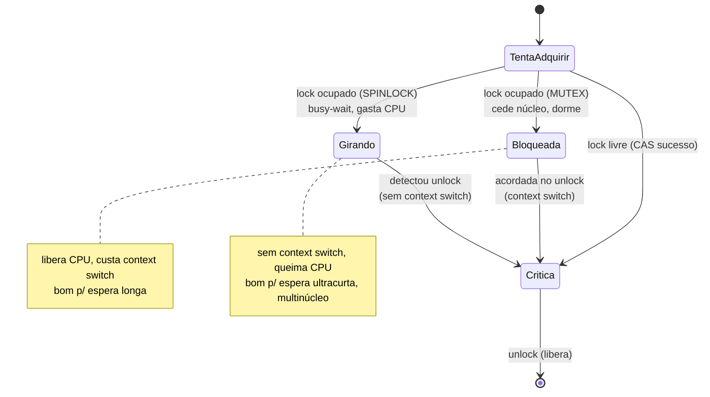

# Primitivas de Sincronização: Mutex, Semaphore, Monitor, Spinlock

> **Bloco:** Concorrência e paralelismo · **Nível:** Avançado · **Tempo de leitura:** ~24 min

## TL;DR

São as quatro primitivas fundamentais que coordenam o acesso de múltiplas threads a recursos compartilhados, e a entrevista cobra a diferença precisa entre elas. **Mutex** (mutual exclusion lock) garante **exclusão mútua** — só uma thread por vez na seção crítica — e tem **posse (ownership)**: só a thread que o adquiriu (lock) pode liberá-lo (unlock). É um "banheiro com uma chave única". **Semaphore** (semáforo) é um **contador de permits**: inicia com N permissões, `acquire()` decrementa (bloqueia se zero), `release()` incrementa; permite **até N threads** simultâneas e **não tem posse** (qualquer thread pode dar release) — serve para **limitar/sinalizar** (pool de N conexões, controle de fluxo entre produtor/consumidor). Um semáforo binário (N=1) parece um mutex, mas não é: falta-lhe a posse e a semântica de exclusão mútua estrita. **Monitor** é uma construção de **alto nível** que encapsula o estado compartilhado *junto* com o lock implícito e **variáveis de condição** (`wait`/`notify`), de modo que o lock é adquirido/liberado automaticamente ao entrar/sair de métodos sincronizados — é o `synchronized` do Java e o "objeto thread-safe" idiomático. **Spinlock** é um lock que, em vez de **bloquear** (ceder o núcleo e dormir) quando não consegue o lock, faz **busy-wait** (fica num laço apertado testando até conseguir — "spinning"), gastando CPU mas evitando o custo de um context switch; é eficiente **só** quando a seção crítica é curtíssima e a espera esperada é menor que o custo de dormir+acordar. Regra prática: mutex/monitor para exclusão mútua geral; semáforo para limitar concorrência ou sinalizar; spinlock só em seções ultracurtas (kernel, lock-free auxiliar) onde dormir custaria mais que girar.

## O problema que resolve

As seções anteriores estabeleceram *o quê* (race conditions na seção crítica) e *os riscos* (deadlock/livelock/starvation). Esta trata do *como*: as ferramentas concretas que o SO, a linguagem e as bibliotecas oferecem para **coordenar** threads. A pergunta: **"Que mecanismo escolher para proteger esta seção crítica ou coordenar este acesso, dado o número de threads permitidas, a necessidade de posse, a presença de condições de espera e o custo de bloquear vs girar?"**

Cada primitiva responde a um sub-problema diferente, e usá-las trocadas gera bugs ou ineficiência:

- Se preciso garantir que **exatamente uma** thread acesse um recurso por vez, com posse clara (quem trava, destrava) → **mutex** (ou monitor).
- Se preciso permitir **até N** acessos simultâneos (um pool de N recursos), ou **sinalizar** entre threads (produtor avisa consumidor) → **semáforo**.
- Se quero **encapsular** o estado compartilhado com sua sincronização de forma idiomática e de alto nível, incluindo **esperar por condições** ("espere até a fila não estar vazia") → **monitor** (`synchronized` + `wait/notify`, ou `ReentrantLock` + `Condition`).
- Se a seção crítica é **curtíssima** e a contenção é breve, e pagar um context switch (dormir+acordar) seria mais caro que ficar girando → **spinlock**.

Subjacente a tudo está uma decisão de baixo nível com grande impacto: ao não conseguir o lock, a thread deve **bloquear** (ceder o núcleo, ser colocada para dormir pelo SO, e ser acordada depois — custa context switch, mas libera a CPU) ou **girar** (busy-wait, queimando CPU, mas pronta para entrar no instante em que o lock liberar — sem context switch)? Mutexes/monitores tipicamente bloqueiam; spinlocks giram. Híbridos (adaptive mutex) giram um pouquinho e então bloqueiam. Entender esse trade-off — context switch vs CPU desperdiçada — é o cerne da escolha.

## O que é (definição aprofundada)

### Mutex (Mutual Exclusion lock)

Um **mutex** é um lock de **exclusão mútua** com **posse**. Tem dois estados (livre/travado) e duas operações: `lock()` (adquire; bloqueia se já travado) e `unlock()` (libera). A característica definidora, frequentemente cobrada: **ownership** — apenas a thread que travou o mutex pode destravá-lo. Isso permite recursos importantes:

- **Detecção de erro:** destravar um mutex que você não possui é um erro (em muitas implementações, lançado/UB).
- **Reentrância (recursive/reentrant mutex):** a thread dona pode re-adquirir o mutex que já segura sem se autobloquear (útil quando um método sincronizado chama outro). `ReentrantLock` e `synchronized` em Java são reentrantes.
- **Priority inheritance:** porque o mutex sabe quem o detém, pode aplicar herança de prioridade contra priority inversion.

O mutex tipicamente **bloqueia** (sleep) quando contestado: a thread que não consegue o lock é colocada na fila de espera do lock e o SO a tira da CPU, acordando-a quando o lock libera. Isso custa context switches, mas não desperdiça CPU durante a espera. Em Java, `ReentrantLock` é o mutex explícito; `synchronized` usa o lock intrínseco (monitor) implicitamente.

### Semaphore (semáforo)

Um **semáforo** é um **contador inteiro não-negativo** com duas operações atômicas (terminologia original de Dijkstra: P/V; moderna: `acquire`/`release` ou `wait`/`signal`):

- `acquire()` / `P()` / `wait()`: se o contador > 0, decrementa e prossegue; se for 0, **bloqueia** até alguém liberar.
- `release()` / `V()` / `signal()`: incrementa o contador, potencialmente acordando uma thread bloqueada.

O semáforo é inicializado com **N permits** (permissões), representando "N unidades do recurso disponíveis". Permite que **até N threads** prossigam simultaneamente. Dois usos canônicos:

- **Counting semaphore (N > 1):** limitar concorrência a N — exatamente o caso de um **pool de N conexões/recursos**: o semáforo inicia com N; cada thread que pega um recurso faz `acquire`; ao devolver, `release`. A (N+1)-ésima thread bloqueia até alguém devolver. (A doc da Oracle descreve precisamente isso: *"semáforos são frequentemente usados para restringir o número de threads que podem acessar algum recurso físico ou lógico"*.)
- **Binary semaphore (N = 1) / sinalização:** com um permit, age como sinalizador entre threads — produtor faz `release` quando há item, consumidor faz `acquire` para consumir; ou coordenação de ordem entre threads.

A diferença crucial para o mutex: o semáforo **não tem posse**. Qualquer thread pode chamar `release()`, não só a que fez `acquire()` — e isso é *intencional* (no padrão produtor/consumidor, o produtor sinaliza, o consumidor consome). Por isso um semáforo binário **não é** um mutex: falta-lhe a posse, a reentrância e a herança de prioridade. Usar semáforo binário onde se queria exclusão mútua com posse é uma armadilha (qualquer thread pode liberar, mascarando bugs).

### Monitor

Um **monitor** é uma construção de **alto nível** que combina, num único objeto, três coisas: (1) o **estado compartilhado** (campos), (2) um **lock implícito** (mutex) que protege esse estado, e (3) **variáveis de condição** para esperar/sinalizar condições. O lock é adquirido **automaticamente** ao entrar num método/bloco do monitor e liberado ao sair (inclusive em exceção) — o programador não chama lock/unlock manualmente. É o modelo idiomático de "objeto thread-safe".

Em **Java**, todo objeto tem um **monitor intrínseco**: `synchronized(obj)` adquire o monitor de `obj` ao entrar e libera ao sair; os métodos `wait()`, `notify()` e `notifyAll()` (chamados *com* o monitor adquirido) implementam as variáveis de condição. O padrão clássico é o **guarded block**: uma thread espera (`wait()`) enquanto uma condição não é satisfeita (ex.: fila vazia), liberando o lock enquanto dorme; outra thread, ao mudar o estado, chama `notify()`/`notifyAll()` para acordá-la. A versão explícita e mais flexível usa `ReentrantLock` + objetos `Condition` (`await()`/`signal()`), permitindo múltiplas condições por lock.

Há duas semânticas históricas de monitor (importante para entender `wait` em laço): **Hoare** (a thread sinalizada roda imediatamente) e **Mesa** (a thread sinalizada apenas vira "pronta" e compete pelo lock — usada por Java). Na semântica Mesa, entre o `notify` e o reagendamento, outra thread pode ter mudado o estado — por isso `wait()` **deve sempre ser chamado num laço** que reverifica a condição (`while(!condicao) wait();`, nunca `if`).

### Spinlock

Um **spinlock** é um lock que, ao encontrar a seção crítica ocupada, **não bloqueia** (não cede o núcleo nem dorme) — em vez disso, executa um **laço apertado** (busy-wait / spin) testando repetidamente se o lock liberou, até conseguir adquiri-lo. É tipicamente implementado com uma instrução atômica como **test-and-set** ou **compare-and-swap** sobre uma flag.

O trade-off é puramente sobre o **custo de esperar**:

- **Spinlock (girar):** gasta ciclos de CPU enquanto espera, mas **evita o context switch** (não entra no kernel, não perde a localidade de cache). Vantajoso quando a espera esperada é **muito curta** — menor que o custo combinado de dormir e acordar (que, com poluição de cache/TLB, pode ser milhares de ciclos). Ideal em ambientes multinúcleo onde a thread que segura o lock roda em *outro* núcleo e vai liberar logo.
- **Mutex bloqueante (dormir):** paga o context switch (caro), mas **libera a CPU** para trabalho útil durante a espera. Vantajoso quando a espera pode ser **longa** ou indeterminada.

Regra crítica: spinlock em **um único núcleo** é quase sempre um erro — a thread que gira está consumindo o único núcleo que a thread *dona do lock* precisaria para terminar a seção crítica e liberar; ela gira inutilmente até ser preemptada. Spinlocks fazem sentido principalmente em **multinúcleo** e para seções **ultracurtas** (código de kernel, estruturas de dados de baixo nível). Implementações maduras usam variantes: **TTAS (test-and-test-and-set)** para reduzir tráfego de coherence no barramento, **backoff** exponencial no spin, ou **adaptive locks** que giram por um tempo e então bloqueiam.

### Tabela comparativa

| Primitiva | Threads simultâneas | Posse (ownership) | Espera ao contestar | Nível | Uso típico |
|---|---|---|---|---|---|
| **Mutex** | 1 | **Sim** (quem trava destrava) | Bloqueia (dorme) | Baixo/médio | Exclusão mútua geral |
| **Semaphore** | até N | **Não** (qualquer um libera) | Bloqueia (dorme) | Baixo | Limitar a N / sinalizar |
| **Monitor** | 1 (lock implícito) | Sim (lock implícito) | Bloqueia + condições | Alto | Objeto thread-safe idiomático |
| **Spinlock** | 1 | Geralmente sim | **Gira** (busy-wait) | Muito baixo | Seção ultracurta, multinúcleo |

## Como funciona

**Mutex:** internamente, `lock()` tenta uma operação atômica (CAS/test-and-set) para marcar o lock como tomado. Se conseguir, prossegue. Se não (já tomado), a thread é colocada na **fila de espera** do lock e o SO a **bloqueia** (futex no Linux: chamada que dorme a thread eficientemente). `unlock()` libera a flag e **acorda** uma thread da fila. A posse é rastreada (qual thread detém), permitindo reentrância (contador de aquisições) e checagem de unlock indevido.

**Semáforo:** mantém um contador e uma fila de espera. `acquire()` faz uma operação atômica: se contador > 0, decrementa e prossegue; senão, enfileira a thread e bloqueia. `release()` incrementa atomicamente e, se houver threads na fila, acorda uma. A ausência de posse significa que não há rastreamento de "quem adquiriu" — release é só "incrementar o contador".

**Monitor (Java):** ao entrar num bloco `synchronized(obj)`, a thread adquire o lock intrínseco de `obj` (bloqueando se ocupado). `wait()` **libera o lock** e coloca a thread na *wait set* do monitor (dorme); ela só volta a competir pelo lock após um `notify()`/`notifyAll()` e deve **rechecar a condição em laço** (semântica Mesa). `notify()` move uma thread da wait set para a fila de entrada; ela readquire o lock quando a sinalizadora sair. Ao sair do bloco (normal ou por exceção), o lock é liberado automaticamente.

**Spinlock:** `lock()` é um laço: `while (!compareAndSet(flag, LIVRE, TOMADO)) { /* spin */ }`. A thread fica testando a flag atomicamente até conseguir trocá-la de LIVRE para TOMADO. `unlock()` só seta a flag de volta para LIVRE. Não há fila, não há sleep, não há kernel — por isso é rápido quando funciona, e desastroso quando a espera é longa (gira queimando CPU). O TTAS otimiza lendo a flag (cache local, sem coherence traffic) antes de tentar o CAS caro: `while (flag == TOMADO) {} ; if(!CAS(...)) retry;`.

O fio comum: todas as primitivas se constroem sobre **instruções atômicas de hardware** (CAS, test-and-set, fetch-and-add) e **barreiras de memória** que garantem que as escritas dentro da seção crítica fiquem visíveis (a aquisição do lock tem *acquire semantics*, a liberação tem *release semantics* — estabelecendo o *happens-before* que dá visibilidade entre threads).

## Diagrama de fluxo

O primeiro diagrama (stateDiagram) mostra a aquisição de um mutex bloqueante (dorme ao contestar) vs um spinlock (gira ao contestar). O segundo mostra o padrão monitor com variável de condição (guarded block produtor/consumidor).



```mermaid
sequenceDiagram
    participant P as Produtor
    participant M as Monitor (fila + lock + condição)
    participant C as Consumidor
    C->>M: synchronized { while(fila vazia) wait() }
    Note over C: libera lock e dorme na wait set
    P->>M: synchronized { fila.add(item); notify() }
    Note over P: insere e sinaliza
    M-->>C: consumidor acordado, readquire lock
    C->>M: rechega condição (laço), consome item
    Note over C: while garante recheck (semântica Mesa)
```

## Exemplo prático / caso real

**Semáforo limitando um pool de conexões (o uso de manual).** Um serviço de e-commerce brasileiro acessa um sistema de pagamento legado que suporta **no máximo 10 conexões simultâneas** (limite do fornecedor). Sob a carga da Black Friday, centenas de threads de checkout querem chamar esse sistema ao mesmo tempo. Sem controle, abririam conexões além do limite e o fornecedor recusaria/derrubaria tudo. A solução é um **counting semaphore** com 10 permits:

```
// Java — Semaphore limitando concorrência a 10
Semaphore conexoes = new Semaphore(10);   // 10 permits = 10 slots

void chamarPagamento(Pedido p) {
    conexoes.acquire();                   // bloqueia se 10 já em uso
    try {
        gatewayLegado.autorizar(p);       // no máximo 10 threads aqui ao mesmo tempo
    } finally {
        conexoes.release();               // devolve o permit (mesmo em erro)
    }
}
```

A 11ª thread bloqueia em `acquire()` até alguma das 10 devolver com `release()`. O semáforo aplica **back-pressure** natural: a concorrência fica limitada à capacidade real do recurso. Note que aqui **não há posse**: a thread que pega o permit é a que o devolve por convenção (try/finally), mas o semáforo não impõe isso — é o programador que garante o pareamento. Usar mutex aqui estaria errado (mutex permite só 1, não 10).

**Mutex/monitor protegendo o saldo (exclusão mútua com posse).** Para o débito de saldo (do capítulo de race condition), o que se quer é **exatamente uma** thread por conta na seção crítica, com posse clara:

```
// Java — monitor (synchronized) garantindo exclusão mútua
synchronized (conta) {                    // adquire o lock intrínseco da conta
    if (conta.saldo >= valor)             // seção crítica: 1 thread por vez
        conta.saldo -= valor;
}                                         // lock liberado automaticamente ao sair
```

Aqui o monitor é a escolha idiomática: lock implícito, liberação automática (mesmo em exceção), posse (só quem entrou sai). Um semáforo binário "funcionaria" mas seria semanticamente errado (sem posse — qualquer thread poderia dar release, escondendo bugs).

**Variável de condição: fila produtor/consumidor.** Um buffer compartilhado entre threads que produzem pedidos e threads que os processam usa o padrão monitor + condição: o consumidor `wait()` enquanto a fila está vazia (liberando o lock e dormindo, sem busy-wait); o produtor, ao inserir, faz `notify()`. O `wait()` fica num **laço** (`while (fila.isEmpty()) wait();`) por causa da semântica Mesa do Java — entre o notify e o reagendamento, outro consumidor pode ter esvaziado a fila.

**Spinlock onde dormir custaria mais.** No *kernel* do SO (ou numa estrutura lock-free de altíssima performance), uma seção crítica que atualiza um contador interno leva poucos nanossegundos. Bloquear (dormir+acordar) custaria milhares de ciclos de context switch — muito mais que a própria seção. Aqui um **spinlock** numa máquina multinúcleo é a escolha certa: a thread gira pouquíssimos ciclos até a dona (rodando em outro núcleo) liberar. Em **espaço de usuário de aplicação típica**, porém, spinlock raramente se justifica — as seções são maiores e o risco de girar inutilmente (especialmente se a dona for preemptada) é alto; prefira mutex/monitor.

## Quando usar / Quando evitar

**Mutex / Monitor:** use para **exclusão mútua** geral — proteger qualquer seção crítica onde só uma thread pode entrar por vez. Prefira o **monitor** (`synchronized`) pela simplicidade e liberação automática; use **`ReentrantLock`** quando precisar de recursos extras (tryLock com timeout, fairness, múltiplas condições, lock interrompível, lock não-bloqueante). **Evite** segurar o lock durante I/O/chamadas lentas (prolonga contenção); evite locks de granularidade grossa que serializam demais.

**Semaphore:** use para **limitar a concorrência a N** (pools de recursos, rate limiting in-process, bulkhead semafórico) ou para **sinalização/coordenação** entre threads (produtor/consumidor sem buffer, ordenação). **Evite** usar semáforo binário onde você quer exclusão mútua com posse — use mutex/monitor (a falta de posse esconde bugs de "release sem acquire").

**Variáveis de condição (wait/notify, Condition):** use para **esperar por condições** ("espere até a fila ter espaço", "até o recurso ficar pronto") sem busy-wait. **Sempre em laço** (`while`, não `if`). **Evite** `notify()` quando há múltiplas condições distintas esperando no mesmo monitor (pode acordar a thread errada) — use `notifyAll()` ou `ReentrantLock` com múltiplos `Condition`.

**Spinlock:** use **apenas** quando a seção crítica é **ultracurta**, a contenção é **breve**, você está em **multinúcleo**, e o custo de um context switch superaria a espera (kernel, lock-free de baixo nível, hot paths medidos). **Evite** em espaço de usuário de aplicação comum, em sistemas de único núcleo, e para qualquer seção que faça I/O, alocação ou trabalho não-trivial. Quando em dúvida, use mutex (ou adaptive mutex, que gira-então-dorme).

## Anti-padrões e armadilhas comuns

- **Confundir semáforo binário com mutex (pegadinha clássica).** Parecem iguais (1 thread por vez), mas o semáforo **não tem posse**: qualquer thread pode dar `release`, e não há reentrância nem priority inheritance. Para exclusão mútua, use mutex/monitor; semáforo é para contagem/sinalização.
- **`wait()` com `if` em vez de `while`.** Na semântica Mesa (Java), a thread acordada deve **rechecar** a condição num laço — entre o `notify` e o reagendamento o estado pode ter mudado (ou houve *spurious wakeup*). `if (vazia) wait();` é um bug; `while (vazia) wait();` é correto.
- **Esquecer `try/finally` ao liberar lock/permit.** Se a seção crítica lança exceção e o `unlock()`/`release()` não está num `finally`, o lock/permit **vaza** — fica preso para sempre, causando deadlock ou esgotamento do pool. `synchronized` libera automaticamente; `ReentrantLock`/`Semaphore` exigem `finally` explícito.
- **Spinlock em único núcleo.** A thread que gira monopoliza o único núcleo que a dona do lock precisa para terminar e liberar — gira inutilmente até ser preemptada. Spinlock só faz sentido em multinúcleo.
- **Spinlock em seção longa.** Se a seção crítica (ou a espera) é longa, o spinlock queima CPU sem fazer nada por todo esse tempo — pior que bloquear. Spinlock é só para esperas ultracurtas.
- **Busy-wait manual em vez de variável de condição.** Fazer `while (!condicao) {}` (polling) para esperar um evento queima CPU; use `wait()`/`await()` (a thread dorme e é acordada por `notify`/`signal`), que não desperdiça ciclos.
- **`notify()` quando deveria ser `notifyAll()`.** Com múltiplas threads esperando condições diferentes no mesmo monitor, `notify()` pode acordar a "errada" (que rechega, vê a condição falsa e volta a dormir), deixando a certa presa. Use `notifyAll()` ou múltiplos `Condition`.
- **Lock não reentrante chamado recursivamente.** Um mutex não-reentrante re-adquirido pela própria thread dona causa **auto-deadlock**. Use locks reentrantes (`ReentrantLock`, `synchronized` são reentrantes) quando há chamadas aninhadas.
- **Aquisição de múltiplos locks em ordens inconsistentes.** Vale para todas as primitivas: pegar dois mutexes/semáforos em ordens opostas em caminhos diferentes → deadlock. Imponha ordem global (ver capítulo de deadlock).
- **Granularidade grossa demais.** Um único lock global protegendo tudo serializa o programa inteiro (mata a escalabilidade — Lei de Amdahl). Prefira locks de granularidade fina (por bucket, por conta), com cuidado para não introduzir deadlock.

## Relação com outros conceitos

- **Race Condition e Critical Section:** estas primitivas são as ferramentas que impõem exclusão mútua na seção crítica, eliminando a race; a escolha depende da semântica (posse, contagem, condição).
- **Deadlock/Livelock/Starvation:** o uso de locks introduz esses riscos; fair locks (`ReentrantLock(true)`) combatem starvation; ordem de aquisição evita deadlock; o monitor encapsula a disciplina de lock.
- **Atomic / CAS / lock-free:** todas as primitivas bloqueantes se constroem *sobre* instruções atômicas; algoritmos lock-free usam CAS diretamente para evitar os locks (e seus deadlocks/context switches) por completo.
- **Memory model:** a aquisição de lock tem *acquire semantics* e a liberação tem *release semantics*, estabelecendo o *happens-before* que garante visibilidade — sem as primitivas (ou `volatile`/atômicos), não há garantia de visibilidade entre threads.
- **Concorrência vs paralelismo / context switching:** o trade-off mutex-bloqueia vs spinlock-gira é exatamente sobre o custo do context switch; em alta concorrência, evitar bloqueios pesados é o que motiva corrotinas e lock-free.
- **Bulkhead / pools (resiliência):** um semáforo é o mecanismo por trás do *semaphore bulkhead* (limitar chamadas concorrentes a uma dependência) e dos pools de recursos.

## Referências

- [Locks in Java — Jenkov](https://jenkov.com/tutorials/java-concurrency/locks.html)
- [Semaphore (Java SE 21) — Oracle](https://docs.oracle.com/en/java/javase/21/docs/api/java.base/java/util/concurrent/Semaphore.html)
- [ReentrantLock (Java SE 21) — Oracle](https://docs.oracle.com/en/java/javase/21/docs/api/java.base/java/util/concurrent/locks/ReentrantLock.html)
- [Intrinsic Locks and Synchronization (monitor, wait/notify) — Oracle](https://docs.oracle.com/javase/tutorial/essential/concurrency/locksync.html)
- [Guarded Blocks (wait/notify) — Oracle Java Tutorials](https://docs.oracle.com/javase/tutorial/essential/concurrency/guardmeth.html)
- [Mutex vs Semaphore — GeeksforGeeks](https://www.geeksforgeeks.org/operating-systems/mutex-vs-semaphore/)
- [Operating Systems: Three Easy Pieces — Locks / Condition Variables / Semaphores, Arpaci-Dusseau](https://pages.cs.wisc.edu/~remzi/OSTEP/)
- [java.util.concurrent.locks (package summary) — Oracle](https://docs.oracle.com/en/java/javase/21/docs/api/java.base/java/util/concurrent/locks/package-summary.html)
