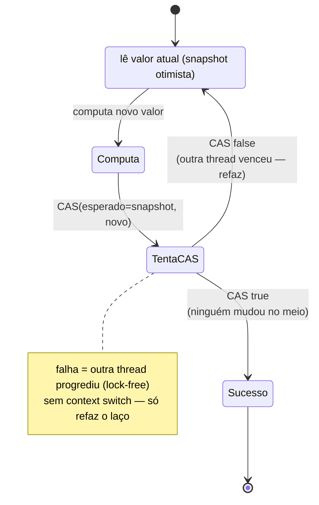
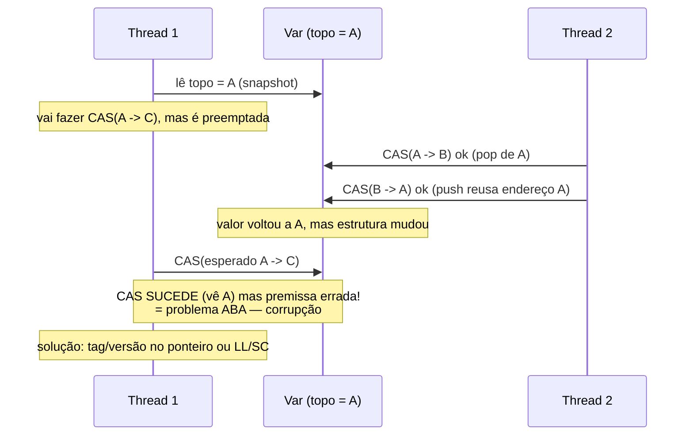

# Operações Atômicas, CAS, Algoritmos Lock-Free e Wait-Free

> **Bloco:** Concorrência e paralelismo · **Nível:** Avançado · **Tempo de leitura:** ~25 min

## TL;DR

São as técnicas para coordenar threads **sem locks** (non-blocking), construídas sobre instruções atômicas de hardware. Uma **operação atômica** é indivisível: executa por completo ou nem começa, sem que outra thread observe estado intermediário (ex.: `incrementAndGet` de um `AtomicInteger` resolve o lost update do contador sem mutex). A primitiva universal é o **CAS (Compare-And-Swap)**: uma instrução de hardware que, **atomicamente**, lê uma posição de memória, compara com um valor *esperado* e, **só se forem iguais**, escreve um *novo* valor, reportando sucesso/falha. CAS é a base de quase todo algoritmo não-bloqueante, tipicamente usado num **CAS loop** (laço de tentativa-otimista): leia o valor atual, compute o novo, tente publicar com CAS; se outra thread mudou no meio (CAS falha), releia e tente de novo. **Lock-free** e **wait-free** são *garantias de progresso* (de Herlihy & Shavit), não sinônimos de "sem lock": um algoritmo é **lock-free** se **pelo menos uma** thread sempre faz progresso no sistema como um todo (não há deadlock; mas uma thread individual *pode* ficar girando indefinidamente se sempre perde a corrida do CAS — starvation possível); é **wait-free** (garantia mais forte) se **toda** thread completa sua operação num número **finito e limitado** de passos, independentemente das outras (sem starvation, latência limitada). Hierarquia de força: wait-free ⊂ lock-free ⊂ obstruction-free. Vantagens do non-blocking: sem deadlock, sem context switch de lock, resiliência a thread suspensa/morta segurando recurso. Pegadinhas de entrevista: o **problema ABA** (o CAS vê o mesmo valor A mas ele mudou A→B→A no meio — "engana" o CAS; solução: ponteiro com tag/versão ou hazard pointers); que lock-free **não** garante progresso de cada thread (só do sistema); e que lock-free é difícil de acertar (memory ordering, reclamação de memória) — use bibliotecas testadas.

## O problema que resolve

Locks (mutex/monitor) resolvem races corretamente, mas têm custos e riscos intrínsecos: **deadlock** (quando mal ordenados), **context switch** (a thread bloqueada dorme e acorda — caro, polui cache), **convoy effect** (threads se enfileiram atrás de uma seção lenta), **priority inversion** e, o pior, **fragilidade a falhas**: se uma thread morre, é suspensa pelo SO ou sofre um GC pause **segurando o lock**, *todas* as outras que esperam esse lock ficam travadas indefinidamente — o progresso do sistema depende daquela thread em particular voltar.

A pergunta central: **"Como coordenar o acesso concorrente a estado compartilhado garantindo progresso e correção *sem* depender de bloqueio mútuo — eliminando deadlock, evitando context switches caros e sendo resiliente a uma thread que pare segurando um recurso?"**

A resposta vem das **instruções atômicas de hardware**, que permitem ler-modificar-escrever indivisivelmente. Sobre elas constroem-se algoritmos **não-bloqueantes (non-blocking)**: estruturas e operações em que nenhuma thread precisa *esperar* outra liberar um lock. Em vez de "pegar o lock, mexer, liberar", o padrão vira otimista: "leia o estado, compute a mudança, tente aplicá-la atomicamente; se alguém mudou no meio, refaça". Isso troca o **pessimismo** do lock (assumir conflito e bloquear preventivamente) pelo **otimismo** do CAS (assumir que não há conflito e detectar/refazer se houver) — análogo exato ao optimistic locking de bancos de dados, mas no nível de uma palavra de memória.

O ganho não é só performance (embora em baixa contenção lock-free seja mais rápido por evitar context switches). O ganho conceitual é a **garantia de progresso independente de bloqueio**: como ninguém segura um lock, uma thread suspensa/morta não trava as outras — o sistema continua progredindo. Esse é o motivo de estruturas lock-free serem usadas em código de baixa latência, kernels, GCs e onde pausas imprevisíveis são inaceitáveis.

## O que é (definição aprofundada)

### Operações atômicas

Uma **operação atômica** é aquela que o resto do sistema observa como **instantânea e indivisível**: ou aconteceu inteira, ou não aconteceu — nunca pela metade. Em hardware, instruções como `LOCK XADD`, `LOCK CMPXCHG` (x86) garantem isso. As classes atômicas das linguagens (`AtomicInteger`, `AtomicLong`, `AtomicReference` em Java; `sync/atomic` em Go; `std::atomic` em C++) expõem operações atômicas comuns:

- **Leitura/escrita atômica** (de uma palavra alinhada) — sem "rasgar" o valor (torn read).
- **Fetch-and-add / incrementAndGet** — incrementar e retornar atomicamente (resolve o lost update do contador sem lock).
- **Compare-and-swap (CAS)** — o coração de tudo (abaixo).
- **getAndSet, exchange** — trocar valor retornando o anterior.

Crucial: a atomicidade cobre **uma única posição** de memória. Operações que precisam mudar **várias** variáveis consistentemente *não* são resolvidas por um único atômico — exigem lock, ou empacotar tudo numa estrutura referenciada por um único `AtomicReference` (e trocar a referência inteira via CAS).

### CAS (Compare-And-Swap)

O **CAS** é a operação atômica universal e a base do non-blocking. Sua assinatura conceitual:

```
boolean CAS(endereco, esperado, novo):
    atomicamente {
        if (*endereco == esperado) {
            *endereco = novo;
            return true;       // sucesso: troquei
        }
        return false;          // falha: o valor não era o esperado (alguém mudou)
    }
```

Tudo isso — ler, comparar, condicionalmente escrever — acontece como **uma instrução atômica de hardware**. A documentação da Oracle resume: `compareAndSet` *"seta atomicamente o valor para `novo` se o valor atual == `esperado`, reportando true em sucesso"*, e *"aplica-se apenas quando as atualizações críticas de um objeto se confinam a uma única variável"*.

O CAS é tipicamente usado num **CAS loop** (retry otimista), o padrão que aparece em praticamente todo algoritmo lock-free:

```
// CAS loop: incremento lock-free de um contador
do {
    atual = contador.get();          // 1. lê o valor atual
    novo  = atual + 1;               // 2. computa o novo (trabalho especulativo)
} while (!contador.compareAndSet(atual, novo));  // 3. tenta publicar; refaz se mudou
```

A lógica: leio o valor (`atual`), faço meu trabalho assumindo que ele não vai mudar, e tento publicar com CAS comparando contra `atual`. Se **outra thread alterou** `contador` entre a leitura e o CAS, o valor não é mais `atual`, o CAS **falha** (retorna false), e o laço **recomeça** relendo o valor novo. Se ninguém alterou, o CAS sucede e saio. O resultado é **atômico** (a publicação foi indivisível) e **lock-free** (não bloqueei ninguém; se falhei, foi porque *outra* thread teve sucesso — o sistema progrediu). É exatamente o que `AtomicInteger.incrementAndGet()` faz internamente.

Variantes relacionadas: **LL/SC (Load-Linked/Store-Conditional)** (ARM, RISC-V, PowerPC) — uma alternativa ao CAS que não sofre do problema ABA por design (o SC falha se *qualquer* escrita tocou a posição entre o LL e o SC, mesmo que o valor seja o mesmo). **Double-CAS / DCAS** e **multi-word CAS** existem mas raramente em hardware.

### Garantias de progresso: lock-free, wait-free, obstruction-free

Esta é a parte conceitualmente mais importante e a mais cobrada em entrevista. "Lock-free" e "wait-free" **não** são apenas "sem locks" — são **garantias formais de progresso** definidas por Herlihy & Shavit (*The Art of Multiprocessor Programming*). Hierarquia, do mais fraco ao mais forte:

- **Obstruction-free (sem obstrução):** uma thread completa sua operação num número finito de passos **se rodar isolada** (sem interferência das outras). É a garantia mais fraca; sob contenção, pode haver livelock (threads se atrapalhando mutuamente sem progredir).
- **Lock-free (sem trava):** em qualquer momento, **pelo menos uma** thread (de todas que tentam) faz progresso num número finito de passos. Garante que o **sistema como um todo** sempre avança — **não há deadlock nem livelock**. Mas **não** garante que *cada* thread progrida: uma thread "azarada" pode falhar o CAS repetidamente (porque outras sempre vencem a corrida) e ficar girando — **starvation individual é possível**. O CAS loop simples é lock-free: se meu CAS falhou, foi porque outra thread teve sucesso (alguém progrediu).
- **Wait-free (sem espera):** **toda** thread completa sua operação num número **finito e limitado** de passos, **independentemente** da velocidade ou do comportamento das outras. É a garantia mais forte: **sem starvation**, **latência limitada (bounded)** para *cada* thread. Não há corrida que uma thread possa perder indefinidamente. É o ideal para sistemas de tempo real / baixa latência determinística — mas wait-free é **muito mais difícil** de implementar e frequentemente mais lento no caso médio (paga overhead para garantir o pior caso).

A relação de inclusão: **wait-free ⊂ lock-free ⊂ obstruction-free**. Todo algoritmo wait-free é lock-free; nem todo lock-free é wait-free. Resumo prático da diferença que cai em entrevista: **lock-free garante progresso do *sistema*; wait-free garante progresso de *cada thread*.**

### O problema ABA

A armadilha clássica do CAS. O CAS verifica se o valor **é** o esperado, mas **não** detecta se o valor *mudou e voltou* ao esperado no meio-tempo. Cenário:

1. Thread 1 lê o valor `A` (ex.: um ponteiro para o topo de uma pilha lock-free) e se prepara para um CAS de `A` para `C`.
2. Antes do CAS de T1, a Thread 2 muda o valor de `A` para `B` (ex.: faz pop, A é removido) e depois de volta para `A` (ex.: faz push de um *novo* nó que, por reuso de memória, calhou no mesmo endereço `A`) — mas o estado da estrutura mudou (o `A` agora é semanticamente outro, ou os nós seguintes mudaram).
3. T1 executa o CAS: vê o valor `A` (o esperado!), conclui que "nada mudou" e o CAS **sucede** — mas a premissa de T1 estava errada; a estrutura foi alterada. Resultado: corrupção (ex.: a pilha aponta para um nó liberado/errado).

O ABA é especialmente perigoso com **ponteiros e reuso de memória** (free lists, pilhas/filas lock-free). Soluções:

- **Ponteiro com tag/versão (tagged pointer / version counter):** anexar um contador de modificações ao valor; cada modificação incrementa o contador. O CAS compara `(ponteiro, versão)` — mesmo que o ponteiro volte a `A`, a versão mudou, e o CAS falha corretamente. (Como descreve a Wikipedia: usar bits extras de "tag" que contam quantas vezes o ponteiro foi modificado; o próximo CAS falha mesmo com o mesmo endereço porque os bits de tag não batem.)
- **LL/SC:** por design, o Store-Conditional falha se *qualquer* escrita tocou a posição, mesmo voltando ao mesmo valor — imune ao ABA.
- **Safe memory reclamation (hazard pointers, epoch-based reclamation, RCU):** garantir que um nó/endereço não seja reusado enquanto alguma thread ainda pode referenciá-lo — resolve o ABA na raiz (o `A` nunca reaparece como outro objeto). Em ambientes com **garbage collector** (Java, Go, C#), o GC já impede o reuso prematuro de endereços, o que *mitiga* (mas não elimina em todos os casos) o ABA — uma das razões de lock-free ser mais palatável em linguagens gerenciadas.

## Como funciona

O fluxo de um algoritmo lock-free típico (ex.: push numa pilha lock-free de Treiber) ilustra o padrão CAS-loop sobre referências:

1. **Snapshot:** leia o estado atual relevante (ex.: o ponteiro `topo` da pilha) numa variável local — uma "foto" otimista.
2. **Trabalho especulativo:** prepare a mudança com base nessa foto (ex.: crie um novo nó cujo `next` aponta para o `topo` lido).
3. **Publicação atômica via CAS:** tente trocar o estado de "o que li" para "o que computei" (`CAS(topo, lidoTopo, novoNo)`).
4. **Decisão:** se o CAS **sucede**, terminei (publiquei atomicamente, ninguém viu estado intermediário). Se **falha**, significa que outra thread alterou `topo` entre os passos 1 e 3 — **volte ao passo 1** (releia e recompute). Como a falha implica que *outra* thread teve sucesso, o sistema progrediu (propriedade lock-free).

Essa estrutura — snapshot, computar, CAS-ou-refaz — é o esqueleto de filas (Michael-Scott queue), pilhas (Treiber stack), contadores, e do próprio `AtomicReference.updateAndGet`. A diferença para o lock é que o "conflito" é **detectado na publicação** (e refeito), não **evitado por bloqueio prévio**.

Dois ingredientes invisíveis mas essenciais para a correção:

- **Memory ordering / barreiras:** num CAS loop, o compilador e a CPU não podem reordenar as leituras/escritas de forma a quebrar a semântica. Operações atômicas carregam ordenação (em Java, atômicos têm semântica `volatile`/`acquire-release`; em C++, você escolhe `memory_order_*`). A leitura do snapshot precisa de *acquire* e a publicação de *release* para estabelecer o *happens-before* que dá visibilidade às outras threads. Acertar isso é onde lock-free fica difícil — a maioria dos bugs lock-free são de ordenação de memória, não de lógica.
- **Reclamação de memória segura:** em linguagens sem GC, liberar um nó que outra thread ainda pode estar lendo (depois de seu snapshot) causa use-after-free; daí hazard pointers/epochs/RCU. Em linguagens com GC, o coletor cuida disso (mais um motivo para lock-free ser mais comum em Java/Go que em C++ "na mão").

Por que evitar o context switch importa: num lock contestado, a thread perdedora **dorme** (context switch de ida) e é **acordada** depois (de volta) — milhares de ciclos com poluição de cache. No CAS loop, a thread perdedora apenas **refaz o laço** (algumas instruções) e tenta de novo, **sem sair da CPU**. Em baixa/média contenção, isso é dramaticamente mais barato. Em **altíssima** contenção, porém, muitos CAS falham e refazem (desperdício), e às vezes um lock (ou redução de contenção, ex.: `LongAdder` que particiona o contador) vence — lock-free não é universalmente mais rápido.

## Diagrama de fluxo

O primeiro diagrama (stateDiagram) mostra o CAS loop: lê, computa, tenta publicar, e refaz se outra thread venceu. O segundo (sequenceDiagram) mostra o problema ABA, onde o valor volta a A e engana o CAS de T1.





## Exemplo prático / caso real

**Contador lock-free de métricas (alta concorrência).** Um serviço de e-commerce conta, em tempo real, quantos pedidos foram criados por segundo — um contador global incrementado por **centenas de threads** de requisição concorrentes. Usar um lock (`synchronized`) viraria gargalo: toda thread serializaria no mesmo monitor, e em pico de Black Friday a contenção no lock dominaria a latência. A solução natural é um **`AtomicLong`** com incremento lock-free:

```
// Java — contador lock-free; incrementAndGet usa CAS loop internamente
AtomicLong pedidos = new AtomicLong();

void onPedidoCriado() {
    pedidos.incrementAndGet();   // atômico, sem lock, sem bloqueio
}
```

`incrementAndGet()` é, por dentro, o CAS loop que vimos: lê, soma 1, tenta publicar com CAS, refaz se outra thread venceu. Nenhuma thread bloqueia; se duas colidem, uma refaz o laço (microssegundos), sem context switch. É lock-free: sempre há progresso do sistema.

**Quando lock-free perde — o caso da altíssima contenção.** Sob *centenas* de threads martelando o **mesmo** `AtomicLong`, os CAS começam a falhar muito (todas disputam a mesma linha de cache — *cache line ping-pong*), e o retry vira desperdício. A própria JDK reconhece isso e oferece **`LongAdder`**: em vez de um único contador, mantém **várias células** (uma por thread sob contenção), cada thread incrementa a sua (sem colidir), e a soma total é calculada sob demanda. É a lição de que lock-free não é mágica: sob contenção extrema, **reduzir o compartilhamento** (particionar) bate "martelar o mesmo átomo". A escolha `AtomicLong` vs `LongAdder` é exatamente essa: baixo conflito → `AtomicLong`; altíssimo conflito de escrita → `LongAdder`.

**Troca atômica de configuração (AtomicReference + CAS de referência).** Um serviço mantém uma tabela de roteamento imutável que é recarregada periodicamente. Threads de requisição leem a tabela atual; uma thread de admin a substitui por uma nova versão. Em vez de lock (que bloquearia leitores durante a troca), usa-se um **`AtomicReference<Tabela>`**: leitores fazem `ref.get()` (sem lock, sempre veem uma versão consistente *inteira*, porque a tabela é imutável); o admin faz `ref.compareAndSet(antiga, nova)` para publicar atomicamente. Como a tabela é **imutável**, não há risco de leitor ver estado parcial — a troca é a substituição atômica de uma referência. Isso combina **imutabilidade** + **CAS** para um padrão *copy-on-write* lock-free, comum em caches e roteamento de altíssima leitura.

**Onde o ABA morderia.** Se em vez de trocar a referência inteira o código tentasse um CAS sobre um ponteiro de nó numa estrutura mutável com reuso de memória (ex.: uma pilha lock-free em C sem GC), o ABA seria um risco real: um nó liberado e re-alocado no mesmo endereço enganaria o CAS. Em Java/Go, o **GC** evita que o endereço seja reusado enquanto há referências vivas, mitigando o ABA — e, quando ele ainda importa, usa-se `AtomicStampedReference` (referência + selo/versão), a materialização do "ponteiro com tag" da JDK.

A lição para o arquiteto: **operações atômicas e CAS são a ferramenta certa para coordenação de *uma única variável* sob concorrência** (contadores, flags, troca de referência imutável), entregando non-blocking sem deadlock e sem context switch. Para mais que isso (estruturas lock-free completas, multi-variável), **use bibliotecas testadas** (`java.util.concurrent`, estruturas concorrentes prontas) em vez de escrever lock-free na mão — a chance de errar memory ordering e ABA é altíssima.

## Quando usar / Quando evitar

**Use operações atômicas / CAS** para coordenar uma **única variável** sob concorrência: contadores, flags/estado, geradores de sequência, troca de referência (especialmente de objeto imutável). É a escolha de melhor custo-benefício — non-blocking, sem deadlock, sem context switch, mais rápido que lock em baixa/média contenção. **Evite** quando a operação precisa modificar **múltiplas variáveis** consistentemente (um CAS cobre só uma posição) — aí use lock ou empacote o estado num objeto imutável trocado por um único `AtomicReference`.

**Use estruturas lock-free prontas** (`ConcurrentLinkedQueue`, `ConcurrentHashMap`, `LongAdder`) quando precisa de coleções concorrentes de alta performance. **Evite escrever as suas próprias** estruturas lock-free a menos que seja absolutamente necessário e você domine memory ordering e reclamação de memória — é uma das áreas mais sutis e propensas a bugs da computação. Prefira as testadas.

**Considere lock-free** onde pausas imprevisíveis são inaceitáveis (baixa latência, tempo real soft) e onde uma thread suspensa/morta não pode travar as outras (resiliência). **Evite** sob **contenção extrema de escrita** na mesma posição (CAS falha muito; particionar/reduzir compartilhamento — `LongAdder`, sharding — ou até um lock pode ser melhor) e quando a simplicidade importa mais que o último grão de performance (um lock claro é mais fácil de raciocinar e manter).

**Almeje wait-free** apenas em nichos com requisito de **latência limitada por thread** (tempo real duro, certos sistemas de trading) — é difícil de implementar e geralmente mais lento no caso médio; lock-free atende a maioria dos casos de alta performance.

## Anti-padrões e armadilhas comuns

- **Ignorar o problema ABA.** Assumir que "o CAS viu o mesmo valor, então nada mudou" — quando o valor pode ter ido A→B→A. Crítico com ponteiros e reuso de memória. Use ponteiro com versão/tag (`AtomicStampedReference`), LL/SC ou reclamação segura (hazard pointers). GC mitiga, mas não em todos os casos.
- **Confundir lock-free com "garante progresso de toda thread".** Lock-free garante progresso do **sistema** (alguém avança), **não** de cada thread — uma thread pode sofrer **starvation** falhando o CAS indefinidamente. Só **wait-free** garante progresso de cada thread. Saber essa distinção é o ponto da pergunta de entrevista.
- **Achar que lock-free é sempre mais rápido.** Em contenção extrema na mesma posição, os CAS falham e refazem em massa (cache line ping-pong), e a vazão despenca; particionar (`LongAdder`, sharding) ou até um lock pode vencer. Meça antes de assumir.
- **CAS para operação multi-variável.** Um CAS é atômico sobre **uma** posição. Tentar coordenar duas variáveis com dois CAS separados reintroduz races (entre os dois CAS, o estado pode ficar inconsistente). Empacote num objeto imutável e troque a referência, ou use lock.
- **Memory ordering errado em lock-free manual.** A maioria dos bugs lock-free é de **ordenação/visibilidade**, não de lógica: faltou um *acquire*/*release*, o compilador reordenou, outra thread viu estado parcial. Em C++, escolher `memory_order` errado; em Java, esquecer que precisa de visibilidade. Por isso: use bibliotecas testadas.
- **`volatile` ≠ atômico.** `volatile` (Java) dá visibilidade/ordenação, mas `volatileVar++` ainda tem race (não é read-modify-write atômico). Para incrementar atomicamente, use `AtomicInteger`/CAS.
- **CAS loop sem limite em hot path crítico.** Em raríssimos casos patológicos de contenção, um CAS loop pode girar muito; em sistemas que exigem latência limitada, isso viola o requisito (é por isso que existe wait-free). Monitore e, se necessário, mude de estratégia.
- **Escrever sua própria fila/pilha lock-free.** Tentador, quase sempre errado. ABA, memory ordering e reclamação de memória tornam isso um campo minado. Use `ConcurrentLinkedQueue` e cia.
- **Esquecer que GC muda o jogo.** Argumentos de C++ sobre reclamação de memória (hazard pointers) não se aplicam diretamente a Java/Go (o GC cuida), e vice-versa: copiar um algoritmo lock-free de C++ para C sem GC sem adicionar reclamação segura introduz use-after-free.

## Relação com outros conceitos

- **Race Condition e Critical Section:** atômicos/CAS resolvem o lost update e o check-then-act de **uma variável** sem lock, sendo a alternativa não-bloqueante à proteção de seção crítica.
- **Primitivas de sincronização (Mutex/Semaphore/Monitor/Spinlock):** todas se constroem *sobre* CAS/test-and-set; lock-free usa o CAS diretamente para *evitar* essas primitivas (e seus deadlocks e context switches). Spinlock é, ele próprio, um CAS loop sobre uma flag.
- **Deadlock/Livelock/Starvation:** lock-free elimina deadlock (não há locks para travar mutuamente) mas **não** elimina starvation individual (só wait-free); o CAS loop pode sofrer livelock em obstruction-free puro.
- **Memory model:** atômicos só funcionam corretamente sob as garantias de ordenação/visibilidade (*acquire/release*, *happens-before*) que o memory model define; lock-free é a aplicação mais exigente do memory model.
- **Optimistic locking (banco):** o CAS é o "optimistic locking de uma palavra de memória" — mesma filosofia (assumir não-conflito, detectar na escrita, refazer) que o controle de versão otimista no nível do registro.
- **Imutabilidade:** combinar imutabilidade com `AtomicReference` + CAS dá *copy-on-write* lock-free seguro (leitores nunca veem estado parcial), padrão comum em caches e roteamento de altíssima leitura.

## Referências

- [An Introduction to Lock-Free Programming — Preshing](https://preshing.com/20120612/an-introduction-to-lock-free-programming/)
- [You Can Do Any Kind of Atomic Read-Modify-Write Operation (CAS loops) — Preshing](https://preshing.com/20150402/you-can-do-any-kind-of-atomic-read-modify-write-operation/)
- [Acquire and Release Semantics — Preshing](https://preshing.com/20120913/acquire-and-release-semantics/)
- [Compare-and-swap — Wikipedia](https://en.wikipedia.org/wiki/Compare-and-swap)
- [ABA problem — Wikipedia](https://en.wikipedia.org/wiki/ABA_problem)
- [java.util.concurrent.atomic (package summary) — Oracle](https://docs.oracle.com/en/java/javase/17/docs/api/java.base/java/util/concurrent/atomic/package-summary.html)
- [AtomicInteger (compareAndSet) — Oracle Java SE](https://docs.oracle.com/javase/8/docs/api/java/util/concurrent/atomic/AtomicInteger.html)
- [Atomic Variables (The Java Tutorials) — Oracle](https://docs.oracle.com/javase/tutorial/essential/concurrency/atomicvars.html)
- [Non-blocking algorithm (lock-free, wait-free) — Wikipedia](https://en.wikipedia.org/wiki/Non-blocking_algorithm)
- [The Go Memory Model (sync/atomic) — go.dev](https://go.dev/ref/mem)
