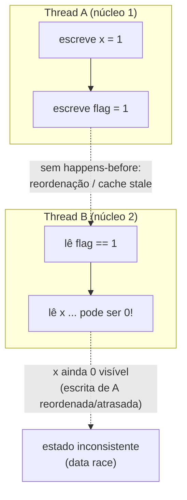
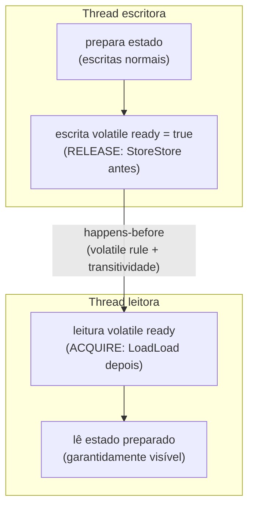
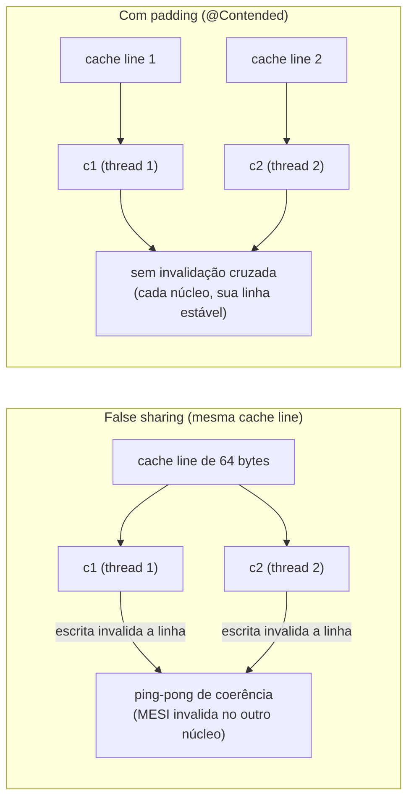

# Memory model: happens-before, volatile, memory barriers, reordering e false sharing

> **Bloco:** Concorrência e paralelismo · **Nível:** Avançado · **Tempo de leitura:** ~32 min

## TL;DR

Em hardware multicore moderno, **não existe "uma única memória compartilhada coerente e instantânea"** do ponto de vista de um programa concorrente. Compiladores reordenam instruções, CPUs executam fora de ordem e especulativamente, e cada núcleo tem caches privados (L1/L2) cujas escritas só ficam visíveis para os outros núcleos em algum momento futuro indeterminado. O **memory model** (modelo de memória) de uma linguagem é o contrato formal que define **quais reordenações são permitidas** e **sob quais condições uma escrita feita por uma thread se torna garantidamente visível para a leitura de outra thread**. O conceito central é a relação **happens-before**: uma ordem parcial entre ações tal que, se `A` *happens-before* `B`, então os efeitos de `A` (incluindo escritas em memória) são garantidamente visíveis e ordenados antes de `B`. Crucialmente, happens-before **não é ordem temporal** — é uma relação *causal/de visibilidade*. Programas sem nenhuma relação happens-before entre acessos concorrentes a uma variável compartilhada têm uma **data race**, e o comportamento é indefinido (no C/C++) ou pelo menos não garante visibilidade (Java/Go). As ferramentas para *estabelecer* happens-before são as primitivas de sincronização: locks (unlock happens-before lock subsequente do mesmo monitor), `volatile`/atomics (escrita volátil happens-before leitura volátil subsequente da mesma variável), channels em Go (send happens-before receive), start/join de threads. `volatile` em Java garante **visibilidade e ordenação** (não atomicidade composta — `i++` continua errado). No nível de hardware, essas garantias são implementadas por **memory barriers/fences** (LoadLoad, StoreStore, LoadStore, StoreStore) que impedem reordenações específicas. Por fim, **false sharing** é a armadilha de performance em que duas variáveis *independentes* caem na mesma **cache line** (tipicamente 64 bytes); quando núcleos diferentes escrevem em cada uma, o protocolo de coerência de cache (MESI) invalida a linha inteira a cada escrita, serializando o que deveria ser paralelo — o "silent performance killer" descrito por Martin Thompson. A correção é **padding/alinhamento** para separar as variáveis em cache lines distintas (em Java, `@Contended`).

## O problema que resolve

A intuição ingênua de um programador é a do **modelo sequencialmente consistente** (sequential consistency, formalizado por Leslie Lamport): todas as threads veem todas as operações de memória numa única ordem global, e essa ordem respeita a ordem do programa de cada thread. É como se houvesse uma única memória RAM e cada acesso fosse instantâneo e visível a todos. Sob esse modelo, raciocinar sobre concorrência seria comparativamente simples.

O problema: **nenhum hardware ou compilador moderno oferece sequential consistency por padrão**, porque ela seria proibitivamente lenta. Três camadas conspiram contra a intuição:

1. **O compilador reordena.** Para otimizar, o compilador (ou o JIT, na JVM) reordena instruções, mantém valores em registradores (não relê da memória), elimina leituras "redundantes" e funde operações. Do ponto de vista de *uma* thread isolada, essas transformações preservam a semântica (a regra *as-if-serial*). Mas para *outra* thread observando, a ordem aparente das escritas pode ser totalmente diferente da ordem do código-fonte.

2. **A CPU reordena e executa fora de ordem.** Processadores modernos têm execução out-of-order, pipelines, store buffers e prefetch. Uma escrita em memória pode ficar parada no **store buffer** do núcleo antes de chegar ao cache compartilhado; enquanto isso, leituras subsequentes podem prosseguir. O resultado é que o núcleo A pode ter escrito `x = 1` e `y = 1` nessa ordem, mas o núcleo B pode observar `y == 1` *antes* de ver `x == 1`. Cada arquitetura tem um modelo de memória de hardware diferente: **x86/x86-64 é relativamente forte** (TSO — Total Store Order, só permite reordenar store→load), enquanto **ARM e POWER são fracamente ordenados** (permitem quase todas as reordenações), o que faz bugs de concorrência aparecerem em ARM que nunca apareciam em x86.

3. **Caches são privados e a coerência é assíncrona.** Cada núcleo tem caches L1/L2 privados. Uma escrita feita pelo núcleo A vive no cache de A até o protocolo de coerência (MESI: Modified/Exclusive/Shared/Invalid) propagá-la. A visibilidade entre núcleos não é instantânea.

Sem um contrato formal, o programador não teria como saber *quando* uma escrita de uma thread fica visível para outra, nem *quais* reordenações esperar — e o código seria não-portável (funcionaria em x86, quebraria em ARM) e impossível de raciocinar. O **memory model** resolve isso definindo o contrato mínimo: ele não promete sequential consistency para código comum (rápido), mas promete que **se você estabelecer happens-before via sincronização, a visibilidade e a ordenação são garantidas**. A pergunta central que ele responde: **"Quando uma escrita feita por uma thread está garantidamente visível para a leitura feita por outra thread, e em que ordem?"**

Um segundo problema, ortogonal mas igualmente ligado à arquitetura multicore, é de **performance, não correção**: mesmo com sincronização correta, o layout dos dados na memória pode destruir a escalabilidade. O **false sharing** é o exemplo canônico — variáveis logicamente independentes que, por azar de layout, compartilham uma cache line e passam a se invalidar mutuamente. É um problema invisível no código (a lógica está certa) mas devastador no profiler.

## O que é (definição aprofundada)

### Happens-before: a relação central

**Happens-before** é uma **ordem parcial** sobre as ações de um programa (leituras, escritas, locks, unlocks, etc.). A garantia: se uma ação `A` *happens-before* `B`, então:

- os efeitos de memória de `A` (todas as escritas que `A` fez ou que aconteceram antes de `A`) são **visíveis** para `B`;
- `A` é **ordenado antes** de `B` — o compilador e a CPU não podem reordená-los de forma que `B` veja um estado anterior a `A`.

Três esclarecimentos críticos, frequentemente cobrados em entrevista:

- **Happens-before NÃO é ordem temporal (wall-clock).** `A` pode happens-before `B` mesmo que, no relógio, executem "ao mesmo tempo"; e duas ações podem executar em momentos diferentes sem nenhuma relação happens-before entre si. É uma relação *causal*, não cronológica.
- **Happens-before é transitiva.** Se `A` hb `B` e `B` hb `C`, então `A` hb `C`. Isso permite encadear garantias através de sincronização.
- **Ausência de happens-before = data race.** Se duas threads acessam a mesma variável, pelo menos um acesso é escrita, e **não há relação happens-before entre eles**, o programa tem uma *data race*. Em Java, o resultado é que a leitura pode ver valores "rasgados" ou stale; em C/C++, é **undefined behavior** puro (o compilador pode assumir que races não existem e otimizar agressivamente).

### Regras que estabelecem happens-before (Java Memory Model, JSR-133)

O JMM (capítulo 17 da JLS, redesenhado pela JSR-133 em Java 5) define as fontes de happens-before:

- **Program order rule:** cada ação numa thread happens-before toda ação subsequente *na mesma thread*. (Isto é o que dá a ilusão de ordem sequencial dentro de uma thread.)
- **Monitor lock rule:** um `unlock` de um monitor happens-before todo `lock` subsequente do *mesmo* monitor. (É por isso que o que você escreve dentro de um `synchronized` fica visível para a próxima thread que entrar no bloco.)
- **Volatile variable rule:** uma escrita numa variável `volatile` happens-before toda leitura subsequente *dessa mesma* variável volátil.
- **Thread start rule:** `Thread.start()` happens-before qualquer ação da thread iniciada.
- **Thread join rule:** qualquer ação de uma thread happens-before o retorno de `join()` sobre ela.
- **Transitividade:** a composição das regras acima.

### volatile: visibilidade e ordenação, não atomicidade composta

Em Java, `volatile` faz três coisas:

1. **Garante visibilidade:** toda leitura de uma variável volátil lê o valor mais recente escrito por *qualquer* thread (vai à memória, não ao registrador/cache stale).
2. **Estabelece happens-before:** a escrita volátil hb a leitura volátil subsequente — o que significa que *tudo* que a thread escritora fez **antes** da escrita volátil fica visível para a thread leitora **depois** de ler a volátil (efeito de "publicação seguro").
3. **Proíbe reordenações** ao redor do acesso volátil (insere barreiras): o compilador/CPU não move operações através do acesso volátil de forma observável.

O que `volatile` **NÃO** faz: garantir **atomicidade de operações compostas**. `contador++` é leitura-modificação-escrita (três passos); marcar `contador` como `volatile` garante que cada leitura/escrita isolada é visível, mas duas threads podem ler o mesmo valor, incrementar e escrever de volta — perdendo um incremento (lost update). Para isso é preciso `AtomicInteger`/CAS ou lock. Regra prática: `volatile` é para **flags de sinalização** (`volatile boolean running`) e **publicação segura de referências imutáveis**, não para contadores ou invariantes que envolvem múltiplas variáveis.

### Memory barriers / fences

No nível de hardware (e do bytecode/JIT), as garantias do memory model são implementadas por **memory barriers** (também chamados de *fences*) — instruções que impedem categorias específicas de reordenação. As quatro categorias clássicas (terminologia de Doug Lea):

- **LoadLoad:** garante que loads anteriores à barreira completem antes de loads posteriores.
- **StoreStore:** garante que stores anteriores fiquem visíveis antes de stores posteriores.
- **LoadStore:** loads anteriores antes de stores posteriores.
- **StoreLoad:** stores anteriores visíveis antes de loads posteriores. É a **mais cara** (geralmente um `mfence` em x86) e a única reordenação que o x86/TSO permite por padrão — daí ser a única que precisa de barreira explícita lá.

As semânticas **acquire** e **release** (detalhadas por Jeff Preshing) são a forma de alto nível: uma operação **release** (como uma escrita volátil ou um unlock) impede que operações de memória *anteriores* a ela sejam reordenadas para *depois* dela; uma operação **acquire** (leitura volátil, lock) impede que operações *posteriores* sejam reordenadas para *antes* dela. Usadas em par (release na escritora, acquire na leitora da mesma variável), elas constroem exatamente a relação happens-before. Uma escrita volátil em Java age como release; uma leitura volátil, como acquire.

### O Go Memory Model

Go define happens-before de forma análoga (documento oficial `go.dev/ref/mem`), como o fecho transitivo da união de *sequenced before* (ordem do programa dentro de uma goroutine) e *synchronized before* (estabelecida por primitivas). As fontes principais:

- **Channels:** um `send` num channel happens-before o `receive` correspondente completar. O `close` de um channel happens-before um receive que retorna zero por canal fechado. Para channels não-bufferizados, o receive happens-before o send completar.
- **Mutex:** para um `sync.Mutex`, a n-ésima chamada de `Unlock()` happens-before a m-ésima chamada de `Lock()` retornar, para `n < m`.
- **`sync/atomic`** e `sync.Once` também estabelecem ordens.

O lema cultural do Go: *"Don't communicate by sharing memory; share memory by communicating"* — preferir channels (que carregam happens-before embutido) a memória compartilhada com locks. Go tem um **race detector** (`go test -race`) que instrumenta o binário e detecta data races em tempo de execução.

### False sharing e cache lines

A memória é transferida entre RAM e caches em blocos chamados **cache lines** — tipicamente **64 bytes** em x86-64. O protocolo de coerência (MESI) opera por linha, não por byte: quando um núcleo escreve em *qualquer* byte de uma linha, ele precisa obter posse exclusiva (estado Modified) daquela linha, **invalidando** a cópia da linha em todos os outros caches.

**False sharing** ocorre quando duas (ou mais) variáveis *logicamente independentes* — acessadas por threads diferentes em núcleos diferentes — residem na **mesma cache line**. Mesmo que a thread 1 só toque a variável `a` e a thread 2 só toque a variável `b`, se `a` e `b` estão na mesma linha de 64 bytes, cada escrita de uma invalida a linha no cache da outra. O resultado: um *ping-pong* constante da linha entre os caches dos núcleos (cache line bouncing), com cada acesso pagando o custo de buscar a linha de volta — transformando acesso a L1 (~1ns) em tráfego de coerência (dezenas de ns). É o "silent performance killer": o código está logicamente correto e livre de races (as variáveis são independentes), mas a performance despenca e não escala com o número de núcleos.

A correção é **padding/alinhamento**: garantir que variáveis escritas por threads distintas fiquem em cache lines separadas, inserindo bytes de preenchimento. Em Java moderno, a anotação `@jdk.internal.vm.annotation.Contended` (ou `@sun.misc.Contended`, com `-XX:-RestrictContended`) faz o padding automaticamente; o `LongAdder` e estruturas internas da JDK já são padded por dentro. Em C/C++, usa-se `alignas(64)`. O custo é memória extra (uma linha inteira por variável "quente"), justificado apenas para variáveis de altíssima contenção (contadores, ponteiros de filas lock-free).

### Glossário rápido

- **Memory model:** contrato que define reordenações permitidas e condições de visibilidade entre threads.
- **Sequential consistency:** modelo ideal (uma ordem global; ordem do programa por thread) — caro, não ofertado por padrão.
- **Happens-before:** ordem parcial causal; se A hb B, efeitos de A são visíveis e ordenados antes de B.
- **Data race:** dois acessos concorrentes à mesma variável, ao menos um escrita, sem happens-before entre eles.
- **volatile (Java):** visibilidade + ordenação (acquire/release) + proibição de reordenação; NÃO atomicidade composta.
- **Memory barrier / fence:** instrução que impede uma categoria de reordenação (LoadLoad/StoreStore/LoadStore/StoreLoad).
- **Acquire/release:** semânticas de meio-fence que, em par, constroem happens-before.
- **TSO (x86):** modelo de hardware forte; só permite reordenar store→load.
- **Cache line:** unidade de transferência cache↔RAM, tipicamente 64 bytes.
- **False sharing:** variáveis independentes na mesma cache line invalidando-se mutuamente.
- **MESI:** protocolo de coerência de cache (Modified/Exclusive/Shared/Invalid).
- **Padding/@Contended:** preenchimento para isolar variáveis em cache lines distintas.

## Como funciona

O fluxo conceitual de uma comunicação correta entre threads, ancorado em happens-before, é o de **publicação segura**: a thread produtora prepara um estado (escreve vários campos) e então **publica** uma referência através de uma operação de sincronização (escrita volátil, unlock, send em channel); a thread consumidora **observa** essa publicação através da operação de acquire correspondente (leitura volátil, lock, receive) e, por transitividade do happens-before, enxerga *todo* o estado preparado, na ordem correta.

Concretamente, o padrão clássico do **flag de sinalização** com `volatile`:

1. A thread A escreve dados em campos normais: `config = parseConfig(); dataReady = ...`.
2. A thread A escreve `volatile boolean ready = true` (operação **release**: insere uma StoreStore antes, garantindo que todas as escritas anteriores fiquem visíveis *antes* do `true` aparecer).
3. A thread B faz `while (!ready) {}` lendo a volátil (operação **acquire**: insere LoadLoad depois).
4. Quando B observa `ready == true`, a regra volatile + transitividade garante que B vê `config` e os dados com os valores que A escreveu — **sem** a volátil, B poderia ver `ready == true` mas `config` ainda nulo (reordenação) ou nunca ver `ready` mudar (cache stale / valor mantido em registrador).

No nível de hardware, o que acontece sob o capô:

1. A escrita volátil de A força o **store buffer** de A a ser drenado e a linha a ser propagada (coerência), e emite os fences que impedem que a CPU adie a escrita para depois de leituras posteriores.
2. A leitura volátil de B é forçada a ir buscar a versão coerente (não usar valor em cache stale nem em registrador), e os fences impedem que a CPU prefetch-eie leituras dependentes para antes.

Para **false sharing**, o "como funciona" da patologia: dois contadores `long c1` e `long c2` (8 bytes cada) declarados adjacentes caem na mesma linha de 64 bytes. Thread 1 incrementa `c1` num núcleo, thread 2 incrementa `c2` em outro. A cada incremento de `c1`, o núcleo 1 marca a linha como Modified e invalida a cópia do núcleo 2; quando o núcleo 2 vai incrementar `c2`, sofre um cache miss, busca a linha de volta (e invalida a do núcleo 1). Esse ping-pong se repete a cada operação. A correção com padding insere ~56 bytes entre `c1` e `c2`, jogando-os em linhas separadas — agora cada núcleo tem sua linha em estado Modified estável e não há invalidação cruzada.

## Diagrama de fluxo

O primeiro diagrama mostra a reordenação observável entre duas threads (sem sincronização) que viola a intuição sequencial; o segundo mostra a publicação segura via happens-before (volatile como release/acquire); o terceiro contrasta false sharing (mesma cache line) com o layout corrigido por padding.







## Exemplo prático / caso real

Cenário: um serviço de **processamento de pedidos** de um e-commerce brasileiro, em Java, com um worker que precisa ser desligado graciosamente (graceful shutdown) e um conjunto de contadores de métricas por thread atualizados em alta frequência.

**Caso 1 — flag de shutdown que "não funcionava".** O time escreveu o loop do worker como:

```java
class Worker implements Runnable {
    private boolean running = true;            // BUG: sem volatile
    public void stop() { running = false; }    // chamado por outra thread (handler de SIGTERM)
    public void run() {
        while (running) { processarProximoPedido(); }
    }
}
```

Em staging (JVM em modo interpretado/menos otimizado) funcionava. Em produção, com o JIT ativo, o worker **nunca parava** ao receber o sinal de shutdown. Causa: o JIT, vendo que `running` não é modificado *dentro* do loop, içou a leitura para fora (hoisting) e transformou `while(running)` em `if(running) while(true)`, mantendo o valor em registrador. Sem happens-before entre o `stop()` (thread do handler) e a leitura no loop (thread do worker), o JMM **permite** essa otimização. A correção: `private volatile boolean running = true`. A leitura volátil força reler a memória a cada iteração e a escrita volátil em `stop()` estabelece o happens-before que torna a mudança visível. (Alternativa idiomática: usar `Thread.interrupt()` + `Thread.currentThread().isInterrupted()`.)

**Caso 2 — contador de pedidos que perdia incrementos.** Para contar pedidos processados por todas as threads, alguém usou `volatile long totalPedidos` e fazia `totalPedidos++`. Sob carga, o número ficava *menor* que o real. Causa: `volatile` não torna `++` atômico — duas threads liam o mesmo valor, incrementavam e escreviam de volta, perdendo updates. A correção: `AtomicLong` (CAS) ou, sob altíssima contenção, `LongAdder` (que internamente espalha o contador em várias células *padded* justamente para evitar **false sharing** entre os núcleos que incrementam).

**Caso 3 — false sharing num array de contadores por thread.** Para evitar contenção, o time deu a cada uma das 16 threads workers um slot num `long[16]` para contar seu próprio throughput. Esperavam escalabilidade linear; o profiler mostrou estagnação e altíssimo tráfego de coerência. Causa: 16 `long` × 8 bytes = 128 bytes; cada cache line de 64 bytes guarda **8 slots adjacentes**, então 8 threads escreviam slots na *mesma* linha, num ping-pong constante de invalidação. Correção possível: padding (espaçar os slots de modo que cada um ocupe sua própria linha — ex.: `long[16 * 8]` usando só os índices múltiplos de 8, ou um array de objetos `@Contended`). Depois do padding, a escalabilidade voltou a ser quase linear. Esse é exatamente o cenário que Martin Thompson descreve no Mechanical Sympathy.

Pseudocódigo da publicação segura (padrão recomendado em vez de flags soltas):

```
// Publicação segura de configuração imutável via volatile
volatile Config configAtual;          // referência volátil

// thread de reload
Config nova = parse(arquivo);          // monta objeto IMUTÁVEL completo
configAtual = nova;                    // RELEASE: publica de uma vez

// threads de request
Config c = configAtual;                // ACQUIRE: lê referência
usar(c);                               // vê o objeto totalmente construído
```

## Quando usar / Quando evitar

**Raciocinar em happens-before:** sempre que houver acesso concorrente a estado mutável compartilhado. É o modelo mental obrigatório — antes de escrever ou revisar código concorrente, pergunte "qual relação happens-before garante que esta thread veja o que aquela escreveu?". Se a resposta for "nenhuma", há uma data race.

**volatile:** use para **flags de sinalização** (shutdown, ready), **publicação de referências imutáveis** e o padrão *double-checked locking* (com volatile no campo). **Evite** para contadores/acumuladores (use atomics), para invariantes envolvendo múltiplas variáveis (use lock) e como substituto preguiçoso de sincronização real.

**Memory barriers explícitos:** raramente em código de aplicação — são detalhe de implementação de bibliotecas de baixo nível (filas lock-free, estruturas concorrentes). Use as abstrações de alto nível (`java.util.concurrent`, `VarHandle` com modos acquire/release, atomics de Go); só desça a fences manuais se estiver escrevendo a primitiva você mesmo, com benchmarks.

**Padding contra false sharing:** use **apenas** para variáveis comprovadamente quentes e de alta contenção entre núcleos, *depois* de medir no profiler (cache misses, tráfego de coerência). **Evite** padding profilático em tudo — desperdiça memória e cache, e na maioria das variáveis não há false sharing. É otimização guiada por dados, não por intuição.

## Anti-padrões e armadilhas comuns

- **Variável compartilhada sem volatile/lock (a flag que nunca muda).** O caso clássico do loop `while(running)` sem `volatile`: o JIT hasteia a leitura e a thread nunca vê a mudança. Toda flag lida numa thread e escrita em outra precisa de happens-before.
- **Confundir visibilidade com atomicidade.** Marcar `contador` como `volatile` e fazer `contador++` perde incrementos — `volatile` não torna leitura-modificação-escrita atômica. Use atomics/CAS ou lock.
- **Assumir que "funcionou no meu x86, então está correto".** x86/TSO é fortemente ordenado e *esconde* muitos bugs de reordenação que explodem em ARM (Apple Silicon, Graviton, mobile). Código sem happens-before correto pode passar anos em x86 e quebrar ao migrar para ARM.
- **Double-checked locking sem volatile.** O idioma clássico de lazy init quebra se o campo do singleton não for `volatile`: outra thread pode ver a referência publicada antes do construtor terminar (objeto parcialmente construído). Foi o bug que motivou o redesenho do JMM (JSR-133).
- **Publicar `this` no construtor.** Registrar um listener ou colocar `this` numa coleção compartilhada dentro do construtor expõe um objeto não-totalmente-construído a outras threads, sem publicação segura.
- **Achar que happens-before é ordem temporal.** Leva a raciocínios errados como "a thread A rodou primeiro no relógio, então B vê o que A fez" — falso sem uma aresta de sincronização.
- **Padding profilático em todo lugar.** Aplicar `@Contended` ou padding manual em variáveis que não têm contenção real infla o uso de cache/memória e pode *piorar* a performance (menos dados por linha). Meça antes.
- **False sharing escondido em frameworks.** Estruturas como `HashMap` redimensionado, arrays de contadores, ou campos adjacentes de objetos hot podem sofrer false sharing silencioso. Quando a escalabilidade não cresce com os núcleos apesar de lógica "sem contenção", suspeite de false sharing e meça cache misses.
- **Ignorar o race detector.** Em Go, não rodar `go test -race` (ou em Java, ferramentas como o jcstress/ThreadSanitizer) deixa data races latentes que só aparecem sob carga em produção, de forma não-determinística.
- **`Atomic` em loop sem backoff sob altíssima contenção.** CAS num único `AtomicLong` muito disputado vira ping-pong de cache line (mesmo problema de coerência); `LongAdder` resolve espalhando em células padded.

### Por que x86 esconde bugs que ARM revela

Vale aprofundar este ponto porque é uma armadilha de portabilidade cada vez mais relevante (cloud em Graviton/ARM, Macs Apple Silicon). O modelo x86 (TSO) garante que stores não são reordenados entre si e loads não são reordenados entre si — só permite que um store seja adiado para depois de um load posterior (via store buffer). Isso significa que muitos padrões de código *incorretos* (sem as barreiras/volatile adequadas) **acidentalmente funcionam** em x86 porque o hardware já fornece quase toda a ordenação que falta. Em ARM/POWER (fracamente ordenados), o hardware reordena livremente stores e loads, então a ausência da barreira correta se manifesta como bug real. A lição: **confie no memory model da linguagem, não no comportamento observado de uma arquitetura**. O JMM/Go MM são abstrações *acima* do hardware exatamente para que código correto pelo modelo da linguagem seja portável entre x86 e ARM.

## Relação com outros conceitos

- **Primitivas de sincronização (locks, monitores, semáforos):** são os mecanismos que *estabelecem* happens-before (unlock hb lock). O memory model é a teoria; as primitivas, a prática que a implementa.
- **Atomics e CAS:** operações atômicas (`AtomicInteger`, `compare-and-swap`) têm semântica de memória definida (geralmente sequential consistency ou acquire/release configurável via `VarHandle`); são a base de estruturas lock-free e a forma correta de contadores compartilhados.
- **Connection pooling, thread pooling, async I/O e reactive** (ver `07-performance-e-escalabilidade/05`): toda estrutura de pool e fila concorrente depende de publicação segura e do memory model para ser thread-safe; `volatile`/atomics aparecem na implementação de qualquer pool.
- **Backpressure e reactive:** as filas e buffers que conectam produtores e consumidores em pipelines reactive são estruturas concorrentes cuja corretude depende do memory model subjacente.
- **Lei de Amdahl / Universal Scalability Law** (ver `07-performance-e-escalabilidade/06`): false sharing e contenção de cache são uma forma concreta do termo de *coerência/crosstalk* da USL — o motivo pelo qual adicionar núcleos pode *piorar* a performance em vez de melhorar. O memory model explica o porquê físico desse teto de escalabilidade.
- **Producer-Consumer / Readers-Writers** (ver `14-concorrencia-e-paralelismo/07`): a corretude desses padrões clássicos depende inteiramente de happens-before entre o produtor que enfileira e o consumidor que desenfileira.

## Modelo mental para o arquiteto

Três ideias para carregar:

1. **Não existe "memória compartilhada instantânea".** Há caches privados, store buffers e reordenações em três camadas (compilador, CPU, cache). A visibilidade entre threads só é garantida onde você *estabelece* happens-before com uma primitiva de sincronização. Toda variável compartilhada mutável sem essa aresta é uma data race.
2. **happens-before é causal, não temporal — e `volatile` dá visibilidade/ordenação, não atomicidade.** Raciocine sempre em "qual aresta de sincronização torna esta escrita visível para aquela leitura". `volatile` publica seguramente uma referência imutável e sinaliza flags; para contadores e invariantes compostas, use atomics/locks.
3. **Correção é uma questão do memory model; performance multicore é uma questão de cache lines.** Mesmo código correto pode não escalar por false sharing e contenção de coerência. Meça (profiler de cache misses) antes de aplicar padding, e confie no modelo da linguagem em vez do comportamento de um x86 específico — o bug que ele esconde explode em ARM.

## Pontos para fixar (revisão)

- **Memory model** = contrato de quais reordenações são permitidas e quando uma escrita fica visível para outra thread; existe porque compilador, CPU e caches reordenam/atrasam para serem rápidos.
- **happens-before** é ordem parcial **causal** (não temporal), transitiva; se A hb B, efeitos de A são visíveis e ordenados antes de B. Ausência dela entre acessos concorrentes = **data race**.
- Fontes de happens-before (Java): program order, unlock→lock do mesmo monitor, escrita→leitura da mesma volátil, start/join. Em Go: send→receive de channel, Unlock→Lock, atomics.
- **volatile** = visibilidade + ordenação (release/acquire) + proibição de reordenação; **NÃO** torna `++` atômico.
- **Memory barriers** (LoadLoad/StoreStore/LoadStore/StoreLoad) implementam as garantias; **StoreLoad** é a mais cara e a única que x86/TSO exige explicitamente.
- **x86 (TSO) é forte e esconde bugs**; **ARM/POWER são fracos** e os revelam — confie no modelo da linguagem, não na arquitetura observada.
- **Cache line** ~64 bytes; **false sharing** = variáveis independentes na mesma linha invalidando-se via MESI (ping-pong de coerência) — o "silent performance killer".
- Corrija false sharing com **padding/`@Contended`**, mas só após **medir**; `LongAdder` já é padded por dentro.

## Referências

- [Chapter 17. Threads and Locks — Java Language Specification (JLS, JMM)](https://docs.oracle.com/javase/specs/jls/se8/html/jls-17.html)
- [JSR-133 (Java Memory Model) FAQ — Jeremy Manson & Brian Goetz](https://www.cs.umd.edu/~pugh/java/memoryModel/jsr-133-faq.html)
- [The Go Memory Model — go.dev/ref/mem](https://go.dev/ref/mem)
- [Mechanical Sympathy: False Sharing — Martin Thompson](https://mechanical-sympathy.blogspot.com/2011/07/false-sharing.html)
- [Acquire and Release Semantics — Jeff Preshing (preshing.com)](https://preshing.com/20120913/acquire-and-release-semantics/)
- [Memory Reordering Caught in the Act — Jeff Preshing (preshing.com)](https://preshing.com/20120515/memory-reordering-caught-in-the-act/)
- [Memory Barriers Are Like Source Control Operations — Jeff Preshing](https://preshing.com/20120710/memory-barriers-are-like-source-control-operations/)
- [Synchronization and the Java Memory Model — Doug Lea](https://gee.cs.oswego.edu/dl/cpj/jmm.html)
- [Close Encounters of The Java Memory Model Kind — Aleksey Shipilëv](https://shipilev.net/blog/2016/close-encounters-of-jmm-kind/)
