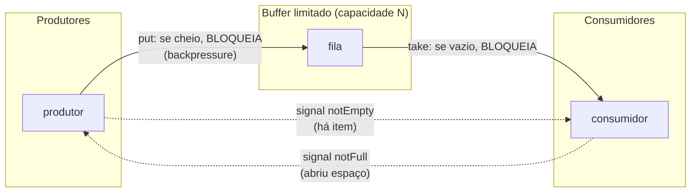
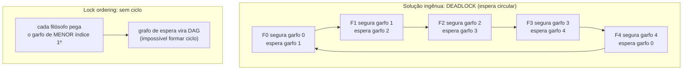

# Problemas clássicos de concorrência: Producer-Consumer, Readers-Writers e Dining Philosophers

> **Bloco:** Concorrência e paralelismo · **Nível:** Avançado · **Tempo de leitura:** ~30 min

## TL;DR

Três problemas clássicos, formulados em grande parte por **Edsger Dijkstra** nos anos 1960-70, condensam quase todos os desafios da programação concorrente e servem como vocabulário compartilhado em entrevistas e em design real. **Producer-Consumer** (também chamado *bounded buffer*) trata da coordenação entre threads que *produzem* trabalho e threads que o *consomem*, mediadas por um **buffer limitado**: os produtores não podem inserir num buffer cheio e os consumidores não podem retirar de um buffer vazio. A solução exige sinalização (esperar e acordar) e exclusão mútua sobre o buffer; é o coração do desacoplamento de produtor/consumidor, do **backpressure** e das filas de mensageria. **Readers-Writers** trata do acesso a um recurso compartilhado em que **múltiplos leitores podem ler simultaneamente** (leituras não conflitam), mas um **escritor precisa de acesso exclusivo** (escrita conflita com tudo). O desafio central não é a corretude e sim a **política de justiça**: priorizar leitores leva à *starvation* (inanição) de escritores e vice-versa; daí os locks de leitura/escrita reais oferecerem variantes (fair/unfair). **Dining Philosophers** (jantar dos filósofos, Dijkstra, 1965) é a metáfora canônica do **deadlock** e da **starvation**: cinco filósofos, cinco garfos, cada um precisa dos dois garfos vizinhos para comer; se todos pegam o garfo da esquerda ao mesmo tempo, ninguém consegue o da direita e o sistema **trava** (deadlock por espera circular). As soluções (ordenação de recursos, "filósofo canhoto", limitar comensais com semáforo, garçom/árbitro) ilustram diretamente como quebrar as quatro condições de Coffman do deadlock. Dominar os três é dominar exclusão mútua, sinalização condicional, justiça, deadlock, starvation e backpressure — os fundamentos sobre os quais toda a engenharia concorrente é construída.

## O problema que resolve

Programação concorrente correta é difícil porque os bugs são **não-determinísticos**: dependem do escalonamento (timing) das threads, raramente reproduzem em teste e explodem em produção sob carga. Em vez de cada engenheiro redescobrir os mesmos erros, a literatura (Dijkstra, Hoare, Courtois) destilou **problemas-modelo** que isolam, cada um, uma classe de dificuldade. Eles funcionam como *katas*: resolvê-los ensina a reconhecer o padrão subjacente em problemas reais.

Cada um responde a uma pergunta de design recorrente:

- **Producer-Consumer:** *"Como threads que geram trabalho em ritmo variável se coordenam com threads que o consomem em ritmo variável, sem que uma sobrecarregue a outra nem fiquem ocupando CPU à toa esperando?"* Aparece em toda fila de tarefas, pipeline de processamento, buffer de I/O, sistema de mensageria e thread pool (a fila do pool **é** um producer-consumer).
- **Readers-Writers:** *"Como permitir o máximo de concorrência num recurso que é lido com muito mais frequência do que escrito, sem corromper dados durante a escrita e sem deixar nenhuma das partes esperando para sempre?"* Aparece em caches, estruturas de configuração lidas por muitas threads e escritas raramente, índices, e qualquer estado compartilhado read-heavy.
- **Dining Philosophers:** *"Como múltiplas threads que precisam adquirir vários recursos compartilhados simultaneamente evitam travar em deadlock (espera circular) e evitam que alguma thread nunca consiga seus recursos (starvation)?"* É o modelo de qualquer cenário em que threads adquirem **múltiplos locks** — transações que travam várias linhas, transferências bancárias entre contas, alocação de recursos.

A razão de fundo é sempre a tensão entre **segurança** (não corromper estado, não violar invariantes) e **vivacidade** (liveness — o sistema continua progredindo: não trava, não deixa ninguém faminto). As soluções ingênuas tendem a sacrificar uma pela outra: garantir segurança com locks grosseiros mata a concorrência; maximizar concorrência sem cuidado abre deadlock e races. Os três clássicos ensinam a equilibrar.

## O que é (definição aprofundada)

### Producer-Consumer (bounded buffer)

**Definição:** uma ou mais threads **produtoras** geram itens e os depositam num **buffer compartilhado de capacidade limitada**; uma ou mais threads **consumidoras** retiram itens do buffer e os processam. As invariantes a manter:

- **Exclusão mútua** sobre o buffer (inserir/remover não pode corromper a estrutura).
- **Buffer cheio:** um produtor que encontra o buffer cheio deve **bloquear/esperar** até abrir espaço (não pode sobrescrever nem estourar).
- **Buffer vazio:** um consumidor que encontra o buffer vazio deve **bloquear/esperar** até haver item (não pode consumir lixo).

O ponto crucial é a **espera eficiente**: a thread deve **dormir** (liberando a CPU) e ser **acordada** quando a condição mudar — nunca *busy-waiting* (girar num loop checando, queimando CPU). As ferramentas clássicas:

- **Semáforos** (Dijkstra): dois semáforos contadores — `empty` (inicia em N, conta espaços livres) e `full` (inicia em 0, conta itens) — mais um mutex para o buffer. O produtor faz `wait(empty); lock; insere; unlock; signal(full)`; o consumidor, `wait(full); lock; remove; unlock; signal(empty)`. A ordem importa: adquirir o semáforo de contagem **antes** do mutex evita deadlock.
- **Monitores / variáveis de condição:** um lock + condições `notFull` e `notEmpty`. O produtor: `lock; while(cheio) notFull.await(); insere; notEmpty.signal(); unlock`. O `while` (não `if`) ao redor do `await` é essencial por causa de **spurious wakeups** e da reverificação da condição após acordar.
- **Filas concorrentes prontas:** em Java, `BlockingQueue` (`ArrayBlockingQueue` limitada, `LinkedBlockingQueue`) encapsula tudo isso — `put()` bloqueia se cheia, `take()` bloqueia se vazia. Em Go, um **channel bufferizado** *é* literalmente um bounded buffer producer-consumer com happens-before embutido.

A capacidade limitada do buffer é o que dá **backpressure**: se os produtores são mais rápidos que os consumidores, o buffer enche e os produtores são naturalmente desacelerados (bloqueados), em vez de a memória crescer sem limite (o que aconteceria com buffer ilimitado — risco de OOM).

### Readers-Writers

**Definição:** um recurso compartilhado (uma estrutura de dados, um arquivo) é acessado por **leitores** (que apenas leem) e **escritores** (que modificam). A política de concorrência permitida:

- **Múltiplos leitores simultâneos:** como leituras não modificam o estado, várias podem ocorrer em paralelo sem conflito.
- **Escritor exclusivo:** um escritor precisa de acesso **exclusivo** — nenhum outro escritor *e* nenhum leitor pode estar ativo enquanto ele escreve (senão leria estado parcialmente modificado / corromperia).

A corretude (exclusão mútua entre escritor e todos os outros) é a parte fácil. O problema interessante é a **política de prioridade / justiça**, e há três variantes clássicas (Courtois et al., 1971):

- **Readers-preference (primeiro problema):** assim que houver um leitor ativo, novos leitores entram livremente; um escritor só passa quando *não há nenhum* leitor. Maximiza throughput de leitura, mas pode causar **starvation de escritores** — num sistema com leitores chegando continuamente, o escritor pode esperar para sempre.
- **Writers-preference (segundo problema):** se um escritor está esperando, novos leitores são barrados até o escritor passar. Evita starvation de escritores, mas pode causar **starvation de leitores** sob carga de escrita.
- **Fair / sem starvation (terceiro problema):** atende na ordem de chegada (ou alterna), garantindo que ninguém espere indefinidamente, ao custo de menos concorrência de leitura.

Na prática, usa-se **`ReadWriteLock`** (Java: `ReentrantReadWriteLock`, com modos fair/unfair; o read lock é compartilhado, o write lock é exclusivo) ou **`sync.RWMutex`** (Go). Há ainda o **`StampedLock`** (Java 8), que adiciona um modo de **leitura otimista** sem bloqueio (lê e depois valida que nenhum escritor passou nesse meio-tempo) — excelente para cargas read-heavy onde escritas são raras.

### Dining Philosophers

**Definição (Dijkstra, 1965; formulação atual de Hoare):** cinco filósofos sentam-se ao redor de uma mesa circular, alternando entre **pensar** e **comer**. Entre cada par de filósofos vizinhos há **um garfo** (cinco garfos no total). Para comer, um filósofo precisa pegar os **dois garfos vizinhos** (esquerda e direita). Os garfos são recursos compartilhados que exigem exclusão mútua (dois filósofos não usam o mesmo garfo ao mesmo tempo).

A solução ingênua — *"cada filósofo pega o garfo da esquerda, depois o da direita"* — leva a **deadlock**: se todos pegarem o garfo da esquerda **simultaneamente**, cada um segura um garfo e espera eternamente pelo da direita, que está na mão do vizinho. Ninguém solta, ninguém come: o sistema trava. Este é o exemplo didático perfeito das **quatro condições de Coffman**, todas necessárias para um deadlock:

1. **Exclusão mútua:** um garfo só pode ser usado por um filósofo por vez.
2. **Hold and wait (segurar e esperar):** cada filósofo segura um garfo e espera pelo outro sem soltar o que tem.
3. **No preemption (sem preempção):** não se pode tomar à força um garfo de outro filósofo.
4. **Circular wait (espera circular):** forma-se um ciclo de dependências (F1 espera F2, que espera F3, ..., que espera F1).

Quebrar **qualquer uma** das quatro elimina o deadlock. As soluções clássicas:

- **Ordenação total de recursos (quebra circular wait):** numerar os garfos e exigir que cada filósofo pegue sempre o garfo de **menor número primeiro**. Isso quebra o ciclo: o último filósofo, em vez de pegar o garfo "da esquerda", pega o de menor número, criando uma assimetria que impede a espera circular. É a solução mais usada na prática (lock ordering).
- **Filósofo canhoto / assimetria (quebra circular wait):** fazer um filósofo pegar os garfos na ordem inversa dos demais (direita-depois-esquerda). Mesma ideia da assimetria.
- **Limitar comensais com semáforo (quebra hold-and-wait coletivo):** permitir no máximo **N-1 filósofos** (4 de 5) tentando comer ao mesmo tempo, via um semáforo de capacidade 4. Com no máximo 4 disputando 5 garfos, sempre sobra um garfo para alguém completar o par — sem ciclo.
- **Garçom / árbitro (quebra hold-and-wait):** um árbitro central concede permissão para pegar garfos; um filósofo só tenta pegar ambos sob autorização, tornando a aquisição dos dois "atômica". Simples, mas serializa e vira gargalo.
- **Tentar e recuar (quebra no-preemption, via `tryLock`):** pegar o primeiro garfo; tentar pegar o segundo com timeout; se falhar, **soltar o primeiro** e recuar (com backoff aleatório). Evita deadlock mas reintroduz risco de **livelock** (todos recuam e tentam de novo em sincronia, repetidamente) — daí o backoff aleatório, análogo ao jitter dos retries.

A distinção **deadlock × livelock × starvation** é central:

- **Deadlock:** threads bloqueadas para sempre, esperando umas pelas outras; **nenhum progresso, nenhuma CPU consumida** (todas dormindo).
- **Livelock:** threads ativas, reagindo umas às outras, mas **sem progresso efetivo** (consomem CPU girando — o caso de "dois pedestres desviando para o mesmo lado repetidamente").
- **Starvation (inanição):** uma thread específica **nunca** consegue o recurso porque outras sempre têm prioridade — o sistema progride, mas aquela thread fica "faminta". É o que a política de Readers-Writers mal-feita causa, e o que pode acontecer com um filósofo azarado.

### Tabela síntese

| Problema | Conceito central que ensina | Recurso / mecanismo | Risco principal | Solução real |
|---|---|---|---|---|
| **Producer-Consumer** | Sinalização + backpressure | Buffer limitado, semáforos/condições | Busy-wait; buffer ilimitado → OOM | `BlockingQueue`, channel bufferizado |
| **Readers-Writers** | Concorrência de leitura vs exclusão de escrita; justiça | `ReadWriteLock` (shared/exclusive) | Starvation de leitor ou escritor | `ReentrantReadWriteLock` (fair), `StampedLock`, `RWMutex` |
| **Dining Philosophers** | Deadlock (4 condições de Coffman) e starvation | Múltiplos locks por thread | Deadlock (circular wait); livelock | Lock ordering; limitar a N-1; `tryLock`+backoff |

### Glossário rápido

- **Bounded buffer:** buffer de capacidade fixa que conecta produtores e consumidores; fonte de backpressure.
- **Busy-wait / spin:** esperar girando num loop consumindo CPU (anti-padrão para esperas longas).
- **Variável de condição:** primitiva para dormir até uma condição mudar e ser acordada (`await`/`signal`).
- **Spurious wakeup:** acordar de um `await` sem que a condição tenha mudado — exige reverificar em `while`.
- **Backpressure:** mecanismo pelo qual um consumidor lento desacelera um produtor rápido (buffer cheio → produtor bloqueia).
- **ReadWriteLock:** lock com modo compartilhado (leitura) e exclusivo (escrita).
- **Deadlock:** travamento mútuo permanente; ninguém progride, todos dormem.
- **Livelock:** threads ativas reagindo umas às outras sem progresso.
- **Starvation:** uma thread nunca obtém o recurso por prioridade perpétua de outras.
- **Condições de Coffman:** exclusão mútua, hold-and-wait, no-preemption, circular wait (todas necessárias p/ deadlock).
- **Lock ordering:** adquirir locks sempre numa ordem global fixa para evitar circular wait.

## Como funciona

**Producer-Consumer com variáveis de condição** (padrão mais instrutivo). O buffer tem um lock e duas condições. O produtor adquire o lock, e *enquanto* (while) o buffer estiver cheio, faz `notFull.await()` — o que **libera o lock e dorme**. Quando um consumidor remove um item, sinaliza `notFull`, acordando o produtor, que **reacquire o lock**, reverifica a condição (por isso `while`), insere o item e sinaliza `notEmpty`. Simétrico para o consumidor. A elegância: nenhuma thread queima CPU esperando; o lock é liberado durante o sono; o `while` protege contra spurious wakeups e contra o caso de outra thread ter "roubado" o item entre o signal e o reacquire.

**Readers-Writers com `ReadWriteLock`.** O lock mantém um contador de leitores ativos e um flag de escritor. Quando uma thread pede o read lock e não há escritor ativo nem (na variante writer-preference/fair) escritor esperando, o contador de leitores incrementa e ela prossegue — vários leitores fazem isso em paralelo. Quando pede o write lock, ela espera até o contador de leitores zerar e nenhum outro escritor estar ativo, então toma posse exclusiva. A variante **fair** mantém uma fila de chegada e não deixa novos leitores "furarem" a fila na frente de um escritor que espera, prevenindo starvation.

**Dining Philosophers com lock ordering.** Numeram-se os garfos 0..4. Cada filósofo, ao querer comer, pega primeiro o garfo de **menor índice** entre seus dois, depois o de maior. O filósofo 4 (entre garfos 4 e 0) então pega o garfo 0 primeiro (menor), invertendo sua ordem em relação aos demais. Essa quebra de simetria torna **impossível** a espera circular: não pode existir um ciclo de threads cada uma esperando a próxima, porque todas adquirem em ordem crescente de índice — o grafo de espera vira um DAG, e DAG não tem ciclo.

A ordem das aquisições em Producer-Consumer com semáforos também precisa de cuidado: o produtor faz `wait(empty)` **antes** de `lock(mutex)`. Se invertesse (lock antes de wait(empty)), um produtor poderia segurar o mutex e bloquear em `wait(empty)` com o buffer cheio, enquanto o consumidor não consegue o mutex para liberar espaço — deadlock. A regra geral: **adquira recursos sempre na mesma ordem** (lock ordering), exatamente a lição dos filósofos aplicada aqui.

## Diagrama de fluxo

O primeiro diagrama mostra o ciclo produtor-consumidor com buffer limitado e as condições de bloqueio; o segundo, o deadlock por espera circular dos filósofos e a quebra via lock ordering.





## Exemplo prático / caso real

Cenário: a plataforma de um marketplace brasileiro, em Java, durante a Black Friday.

**Producer-Consumer — pipeline de processamento de pedidos.** O serviço de checkout recebe pedidos num pico de milhares por segundo, mas o processamento de cada pedido (cálculo de frete, reserva de estoque, antifraude) é mais lento. Usar um `ArrayBlockingQueue` de capacidade limitada (ex.: 10.000) entre o *receiver* (produtor) e um pool de *workers* (consumidores) resolve três coisas de uma vez: (1) desacopla o ritmo de chegada do ritmo de processamento; (2) dá **backpressure** — se a fila enche, o `put()` bloqueia o receiver, que por sua vez aplica backpressure ao cliente (responde 429/503) em vez de aceitar carga que não consegue processar e estourar a memória; (3) os workers consomem com `take()`, dormindo eficientemente quando não há trabalho. Erro comum evitado: usar `LinkedBlockingQueue` **ilimitada** — sob o pico, a fila cresceria indefinidamente até `OutOfMemoryError`, transformando um problema de latência num crash. A capacidade limitada é justamente o que protege.

**Readers-Writers — cache de configuração de feature flags.** As regras de promoção (quais produtos têm desconto, percentuais) são lidas por **milhares de threads de request por segundo** e atualizadas **raramente** (quando o time de marketing publica uma mudança). Usar um lock exclusivo comum serializaria todas as leituras, matando o throughput. Com `ReentrantReadWriteLock`, milhares de requests adquirem o **read lock** em paralelo (leituras concorrentes), e a atualização rara adquire o **write lock** exclusivo por alguns milissegundos. Para o caso extremo (leituras dominam quase 100%), `StampedLock` com **leitura otimista** elimina até o custo do read lock no caminho feliz: lê os campos, valida o stamp, e só cai para read lock bloqueante se um escritor passou no meio. Cuidado de justiça: configurar o lock como **fair** se houver risco de o escritor (publicação de promoção) nunca conseguir passar sob a enxurrada de leitores.

**Dining Philosophers — transferência entre contas (deadlock real).** O serviço de carteira faz transferências travando a conta origem e a conta destino. A versão ingênua: `lock(origem); lock(destino); transferir`. Sob concorrência, a transferência A→B trava A e espera B, enquanto a transferência B→A (simultânea) trava B e espera A — **deadlock** (exatamente os filósofos). A correção é **lock ordering**: sempre travar primeiro a conta de **menor ID** (`lock(min(a,b)); lock(max(a,b))`), independentemente da direção da transferência. Isso quebra a espera circular e elimina o deadlock. Alternativa defensiva: `tryLock` com timeout e retry com backoff aleatório, registrando métrica de tentativas frustradas para observabilidade.

Pseudocódigo — bounded buffer com condições:

```
// Producer-Consumer com lock + variáveis de condição
put(item):
    lock.lock()
    try:
        while (count == capacity): notFull.await()   // while, não if
        buffer.add(item); count++
        notEmpty.signal()
    finally: lock.unlock()

take():
    lock.lock()
    try:
        while (count == 0): notEmpty.await()
        item = buffer.remove(); count--
        notFull.signal()
        return item
    finally: lock.unlock()
```

Pseudocódigo — transferência sem deadlock (lock ordering):

```
transferir(a, b, valor):
    first  = (a.id < b.id) ? a : b      // menor ID primeiro
    second = (a.id < b.id) ? b : a
    lock(first); lock(second)
    try: a.debita(valor); b.credita(valor)
    finally: unlock(second); unlock(first)
```

## Quando usar / Quando evitar

**Producer-Consumer (bounded buffer):** use sempre que houver descompasso de ritmo entre quem gera e quem processa trabalho — pipelines, thread pools, ingestão de eventos, I/O bufferizado. **Prefira filas prontas** (`BlockingQueue`, channels) a implementar do zero. **Sempre limite a capacidade** (backpressure); evite buffers ilimitados, que trocam latência por risco de OOM. **Evite** quando o trabalho precisa ser síncrono (resposta na hora) sem desacoplamento possível.

**Readers-Writers (`ReadWriteLock`):** use em estado compartilhado **read-heavy** (leituras >> escritas), onde a exclusão de um lock comum desperdiçaria concorrência de leitura. **Evite** quando escritas são frequentes (o overhead do RW lock supera o ganho — um lock simples ou estrutura concorrente/imutável é melhor) ou quando a estrutura já é lock-free/imutável (cópia-na-escrita, `CopyOnWriteArrayList` para coleções muito mais lidas que escritas). Escolha a variante **fair** se starvation for risco real.

**Dining Philosophers / lock ordering:** a *lição* (lock ordering, evitar circular wait) aplica-se a **todo** código que adquire múltiplos locks. **Sempre** estabeleça e documente uma ordem global de aquisição de locks. Use `tryLock`+timeout+backoff quando uma ordem global não for viável (locks descobertos dinamicamente). **Evite** segurar múltiplos locks quando puder reduzir a granularidade (um lock só, ou estruturas concorrentes que dispensam locks compostos).

## Anti-padrões e armadilhas comuns

- **Busy-waiting (spin) em vez de dormir.** Esperar girando `while(buffer.isEmpty()) {}` queima 100% de uma CPU sem fazer nada e ainda atrasa quem deveria preencher o buffer. Use variáveis de condição / filas bloqueantes que dormem e acordam.
- **`if` em vez de `while` ao redor de `await`.** Reverificar a condição com `if` ignora **spurious wakeups** e o caso de outra thread ter consumido o item entre o `signal` e o reacquire do lock — a thread prossegue com a condição falsa e corrompe estado. **Sempre `while`.**
- **Buffer ilimitado "para não bloquear".** Trocar a fila limitada por uma ilimitada elimina o backpressure e, sob produtor mais rápido que consumidor, leva a crescimento de memória até OOM. O bloqueio é uma *feature*, não um bug.
- **Lock ordering inconsistente (a causa nº 1 de deadlock real).** Travar (A, B) num caminho e (B, A) noutro é exatamente o jantar dos filósofos. Defina uma ordem global (por ID, por hash, por nome) e respeite-a em todos os caminhos.
- **`tryLock`+retry sem backoff aleatório → livelock.** Todos recuam e tentam de novo em sincronia, colidindo repetidamente sem progresso. Adicione backoff aleatório (jitter), como nos retries de rede.
- **Política de Readers-Writers que causa starvation.** Readers-preference puro com leitores chegando continuamente nunca deixa o escritor passar (config nunca atualiza); writers-preference sob escrita pesada mata os leitores. Use variante fair ou writer-preference consciente conforme a carga.
- **Usar RW lock onde escritas são frequentes.** O overhead de coordenação do RW lock só compensa em cargas dominadas por leitura; com escritas frequentes, ele é mais lento que um lock simples.
- **Signal perdido (lost wakeup).** Sinalizar uma condição sem segurar o lock associado, ou sinalizar antes de a outra thread chegar ao `await`, pode perder o acordar. Sinalize sempre com o lock segurado e use `while` para reverificar.
- **`notify()` em vez de `notifyAll()` quando há múltiplas condições no mesmo monitor.** Acordar uma única thread que pode ser a "errada" (ex.: acordar um produtor quando só consumidores deveriam acordar) leva a deadlock por wakeup perdido. Prefira condições separadas (`Condition`) ou `notifyAll`.
- **Achar que deadlock e starvation são a mesma coisa.** Deadlock trava tudo (ninguém progride, todos dormem); starvation é local (o sistema progride, uma thread específica nunca é atendida); livelock é "ativo mas sem progresso". Diagnósticos e correções diferentes.

### Por que esses três cobrem quase tudo

Vale notar a economia conceitual: praticamente qualquer problema concorrente real é uma combinação ou variação destes três. Uma **fila de mensageria** é producer-consumer com persistência. Um **thread pool** é producer-consumer (a work queue) com workers fixos. Um **cache concorrente** é readers-writers. Uma **transação que trava várias linhas** é o jantar dos filósofos. Um **connection pool** é producer-consumer (conexões disponíveis) com semáforo de capacidade. Reconhecer "isto é um producer-consumer" ou "isto é o jantar dos filósofos disfarçado" instantaneamente traz o catálogo de soluções e armadilhas conhecidas — é exatamente por isso que eles são cobrados em entrevista: não pela mesa de filósofos em si, mas pela capacidade de reconhecer o padrão e raciocinar sobre deadlock, backpressure e justiça.

## Relação com outros conceitos

- **Primitivas de sincronização (mutex, semáforo, variável de condição, monitor):** são as ferramentas com que os três problemas são resolvidos; os clássicos são os exercícios canônicos para aprendê-las.
- **Memory model e happens-before** (ver `14-concorrencia-e-paralelismo/06`): a corretude de qualquer dessas soluções depende de happens-before entre quem produz/escreve e quem consome/lê — o `put`/`take` de uma `BlockingQueue` carrega essa garantia embutida.
- **Atomics e CAS:** filas e estruturas concorrentes lock-free (que evitam os locks dos clássicos) são construídas com CAS; resolvem producer-consumer sem bloqueio.
- **Thread pools e tuning** (ver `14-concorrencia-e-paralelismo/08`): o pool é literalmente um producer-consumer (work queue + workers); o dimensionamento da fila é a escolha do bounded buffer.
- **Backpressure e reactive** (ver `07-performance-e-escalabilidade/05`): backpressure é o producer-consumer generalizado para pipelines assíncronos; o buffer limitado é a sua manifestação síncrona.
- **Padrões de resiliência (bulkhead, rate limiting)** (ver `04-sistemas-distribuidos/10`): o bulkhead por semáforo é o "limitar a N comensais"; o rate limiting é backpressure na borda.
- **Connection pooling:** um pool de conexões é producer-consumer com semáforo de capacidade — adquirir uma conexão é pegar de um buffer limitado; devolver é repor.

## Modelo mental para o arquiteto

Três ideias para carregar:

1. **Reconheça o padrão por trás do problema real.** Antes de inventar, pergunte: "isto é producer-consumer (ritmos diferentes + buffer), readers-writers (muita leitura, pouca escrita) ou jantar dos filósofos (múltiplos locks por operação)?". Reconhecer traz o catálogo pronto de soluções e armadilhas.
2. **Segurança e vivacidade estão sempre em tensão.** Locks grosseiros garantem segurança matando concorrência; concorrência agressiva abre deadlock/race. As soluções clássicas são receitas balanceadas — buffer limitado (backpressure), RW lock (leitura paralela + escrita exclusiva), lock ordering (sem deadlock). Escolha conscientemente onde pagar.
3. **Deadlock se previne com disciplina de aquisição, não com sorte.** A regra de ouro contra deadlock é **ordem global de aquisição de locks** (a lição dos filósofos). Quando isso não é viável, `tryLock`+timeout+backoff. E sempre distinga deadlock (trava tudo), livelock (ativo sem progresso) e starvation (local) — cada um tem diagnóstico e cura diferentes.

## Pontos para fixar (revisão)

- **Producer-Consumer** = produtores + consumidores + **buffer limitado**; o limite dá **backpressure** (produtor bloqueia se cheio) e evita OOM. Use `BlockingQueue`/channels; nunca busy-wait; reverifique condição em `while`.
- **Readers-Writers** = muitos leitores simultâneos, escritor exclusivo; o problema real é a **justiça** (starvation de leitor ou escritor). Use `ReadWriteLock` (fair se preciso), `StampedLock` (leitura otimista) para cargas read-heavy.
- **Dining Philosophers** = metáfora do **deadlock** via **circular wait**; as 4 condições de Coffman (exclusão mútua, hold-and-wait, no-preemption, circular wait) são todas necessárias — quebre uma.
- A solução prática contra deadlock é **lock ordering** (sempre adquirir locks em ordem global fixa, ex.: por ID); alternativas: limitar a N-1, `tryLock`+backoff, árbitro.
- **Deadlock** (todos travados, dormindo) ≠ **livelock** (ativos sem progresso) ≠ **starvation** (uma thread nunca atendida) — diagnósticos distintos.
- Quase todo problema concorrente real é uma variação destes três (fila = PC, thread pool = PC, cache = RW, transação multi-lock = filósofos).
- Sinalize sempre com o lock segurado; prefira condições separadas a `notify()` ambíguo; `tryLock`+retry exige **backoff aleatório** contra livelock.

## Referências

- [Edsger W. Dijkstra — EWD310: Hierarchical Ordering of Sequential Processes (origem dos Dining Philosophers)](https://www.cs.utexas.edu/~EWD/transcriptions/EWD03xx/EWD310.html)
- [Dining philosophers problem — Wikipedia](https://en.wikipedia.org/wiki/Dining_philosophers_problem)
- [Readers–writers problem — Wikipedia](https://en.wikipedia.org/wiki/Readers%E2%80%93writers_problem)
- [Producer–consumer problem — Wikipedia](https://en.wikipedia.org/wiki/Producer%E2%80%93consumer_problem)
- [BlockingQueue (Java Platform SE 8) — Oracle](https://docs.oracle.com/javase/8/docs/api/java/util/concurrent/BlockingQueue.html)
- [ReentrantReadWriteLock (Java Platform SE 8) — Oracle](https://docs.oracle.com/javase/8/docs/api/java/util/concurrent/locks/ReentrantReadWriteLock.html)
- [StampedLock (Java Platform SE 8) — Oracle](https://docs.oracle.com/javase/8/docs/api/java/util/concurrent/locks/StampedLock.html)
- [Deadlock — The Java Tutorials (Oracle)](https://docs.oracle.com/javase/tutorial/essential/concurrency/deadlock.html)
- [System of sequential processes — Coffman conditions / Deadlock (Wikipedia)](https://en.wikipedia.org/wiki/Deadlock)
