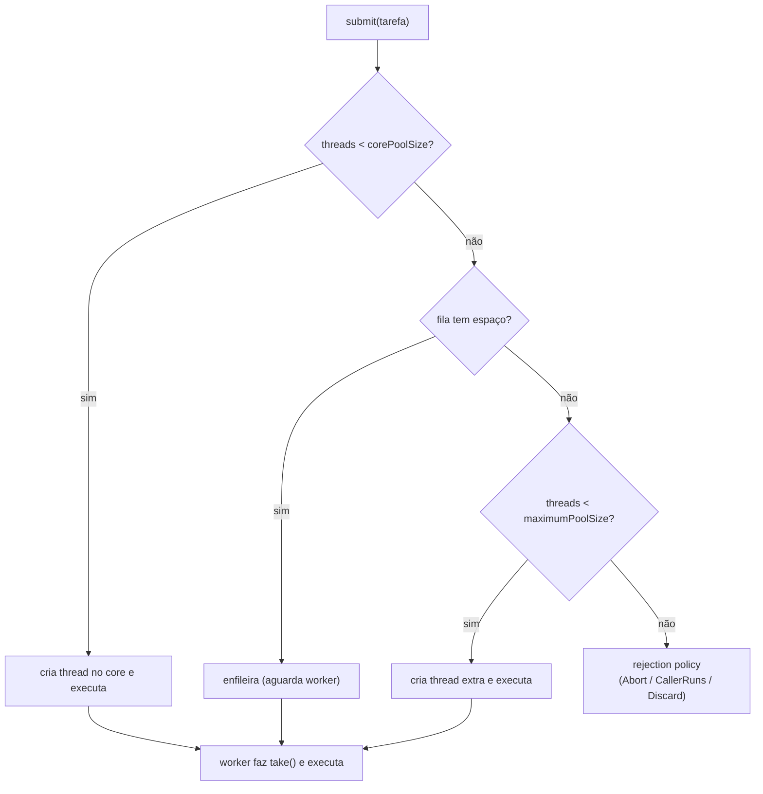
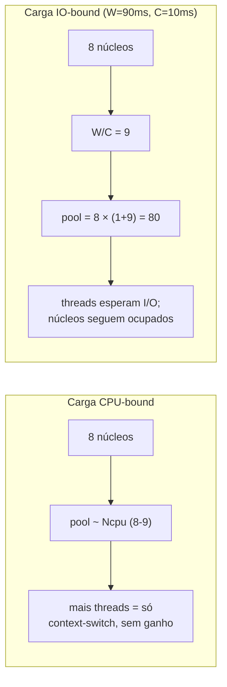

# Thread pools e tuning: tamanho ótimo, filas, CPU-bound vs IO-bound

> **Bloco:** Concorrência e paralelismo · **Nível:** Avançado · **Tempo de leitura:** ~30 min

## TL;DR

Criar uma thread por tarefa não escala: cada thread de plataforma custa memória (stack ~512KB–1MB), o número de threads do SO é finito, e o **context-switch** entre milhares de threads degrada o desempenho mais do que ajuda. O **thread pool** resolve isso reusando um conjunto fixo (ou limitado) de **worker threads** que consomem tarefas de uma **fila de trabalho** — é, no fundo, um **producer-consumer**: quem submete tarefas é o produtor, os workers são os consumidores, a work queue é o bounded buffer. O parâmetro mais cobrado é o **tamanho ótimo do pool**, e a resposta depende da **natureza da carga**. Para tarefas **CPU-bound** (que passam quase todo o tempo computando), o pool ideal é próximo do **número de núcleos** (`Ncpu` ou `Ncpu+1`) — mais threads que núcleos só adiciona context-switch sem ganho, porque não há paralelismo físico extra. Para tarefas **IO-bound** (que passam a maior parte do tempo *esperando* rede/disco/banco), o pool pode e deve ser **muito maior**, porque enquanto uma thread espera I/O o núcleo fica livre para outra. A fórmula de **Brian Goetz** (Java Concurrency in Practice) formaliza: `Nthreads = Ncpu × Ucpu × (1 + W/C)`, onde `W/C` é a razão entre tempo de espera e tempo de computação — para CPU-bound `W/C≈0` (pool ≈ Ncpu), para IO-bound `W/C` é grande (pool muito maior). A escolha da **fila** importa tanto quanto o tamanho: fila **ilimitada** (`newFixedThreadPool` default) esconde sobrecarga e arrisca OOM; fila **limitada** dá backpressure mas exige uma **rejection policy** (o que fazer quando enche: rejeitar, `CallerRunsPolicy`, descartar). O `ThreadPoolExecutor` do Java expõe `corePoolSize`, `maximumPoolSize`, `keepAliveTime`, `workQueue` e `RejectedExecutionHandler` — e sua dinâmica é contraintuitiva (só cria threads acima do core *depois* que a fila enche). A regra de ouro: **separe pools por tipo de carga** (um pool CPU-bound, outro IO-bound; um pool por dependência crítica — bulkhead), **dimensione com dados** (Lei de Little e medição, não achismo) e **nunca compartilhe um pool entre cargas heterogêneas**. Virtual threads (Java 21+, Project Loom) e Goroutines mudam o cálculo para I/O ao tornar threads baratíssimas, mas o raciocínio sobre o recurso limitante permanece.

## O problema que resolve

A abordagem mais ingênua de concorrência é **thread-per-task**: para cada requisição/tarefa, criar uma `new Thread()`. Isso tem três problemas fatais sob carga:

1. **Custo de criação e memória.** Cada thread de plataforma (mapeada 1:1 a uma thread do SO) reserva uma stack — tipicamente 512KB a 1MB. Mil threads = ~1GB só de stacks. Criar e destruir threads também tem custo de syscall não-trivial.
2. **Número finito de threads.** O SO limita o número total de threads; ultrapassá-lo causa `OutOfMemoryError`/falha de criação. Não há limite natural em thread-per-task — uma rajada de requisições cria threads sem teto.
3. **Context-switch e contenção.** Com muito mais threads runnable que núcleos, o escalonador do SO gasta tempo trocando o contexto entre elas (salvar/restaurar registradores, invalidar caches/TLB). Acima de certo ponto, **adicionar threads piora o throughput** — o sistema passa mais tempo trocando que trabalhando (thrashing). É uma manifestação direta da Universal Scalability Law: o termo de coerência cresce e a curva de escalabilidade *desce*.

O **thread pool** resolve os três: reusa um número **controlado** de threads (sem custo de criação por tarefa, sem estouro), enfileira tarefas quando todas as threads estão ocupadas (limite natural de concorrência), e mantém o número de threads runnable próximo do que o hardware comporta (minimizando context-switch). A pergunta de design central torna-se: **"Quantas threads o pool deve ter, e o que fazer com as tarefas que chegam quando todas estão ocupadas?"** — e a resposta depende criticamente de a carga ser CPU-bound ou IO-bound.

Há um segundo problema, mais sutil, que o pool *bem configurado* resolve e o mal configurado *causa*: **isolamento de falha**. Se um único pool atende tanto consultas rápidas quanto chamadas lentas a uma dependência externa, uma dependência lenta pode prender todas as threads do pool e derrubar tudo — exatamente a falha em cascata. Separar pools por tipo de carga (bulkhead) é tão importante quanto dimensioná-los.

## O que é (definição aprofundada)

### Anatomia de um thread pool

Um thread pool tem três componentes essenciais:

- **Worker threads:** um conjunto de threads de longa duração que ficam em loop, retirando tarefas da fila e executando-as. Não morrem ao terminar uma tarefa — voltam a buscar a próxima.
- **Work queue (fila de trabalho):** onde as tarefas submetidas aguardam até haver um worker livre. É o "bounded buffer" do producer-consumer.
- **Política de submissão/rejeição:** o que acontece quando se submete uma tarefa — vai direto a um worker, à fila, cria-se uma thread nova, ou rejeita-se.

No Java, o `ThreadPoolExecutor` parametriza isso explicitamente:

- **`corePoolSize`:** número de threads mantidas vivas mesmo ociosas (o "núcleo" do pool).
- **`maximumPoolSize`:** número máximo de threads que o pool pode criar.
- **`keepAliveTime`:** tempo que threads acima do core ficam ociosas antes de serem destruídas.
- **`workQueue`:** a `BlockingQueue` onde tarefas aguardam.
- **`RejectedExecutionHandler`:** o que fazer quando não há como aceitar a tarefa (pool cheio E fila cheia).

### A dinâmica contraintuitiva do ThreadPoolExecutor

A ordem de decisão do `ThreadPoolExecutor` ao receber uma tarefa surpreende muita gente e é pegadinha de entrevista:

1. Se há **menos** threads que `corePoolSize`, **cria uma nova thread** (mesmo que outras estejam ociosas — para chegar ao core).
2. Se o core está cheio, **tenta enfileirar** a tarefa na work queue.
3. Só se a **fila estiver cheia** é que cria threads adicionais até `maximumPoolSize`.
4. Se fila cheia **e** `maximumPoolSize` atingido, aciona a **rejection policy**.

A consequência prática crítica: com uma fila **ilimitada** (o caso de `Executors.newFixedThreadPool`, que usa `LinkedBlockingQueue` sem limite), o passo 3 **nunca acontece** — a fila nunca enche, então `maximumPoolSize` é irrelevante e o pool nunca cresce além do core. Pior: a fila ilimitada cresce indefinidamente sob sobrecarga, escondendo o problema até estourar a memória. Por isso pools de produção sérios usam **fila limitada** + `maximumPoolSize` significativo + rejection policy explícita.

### As factory methods do `Executors` (e suas armadilhas)

- **`newFixedThreadPool(n)`:** `core = max = n`, fila **ilimitada**. Simples, mas a fila ilimitada é um risco de OOM sob rajada.
- **`newCachedThreadPool()`:** `core = 0`, `max = Integer.MAX_VALUE`, fila `SynchronousQueue` (capacidade zero — toda tarefa exige um worker imediato). Cria threads sem limite sob rajada → pode esgotar o SO. Bom para cargas leves e esporádicas, perigoso sob carga.
- **`newSingleThreadExecutor()`:** uma thread, fila ilimitada. Garante execução sequencial.
- **`newWorkStealingPool()` / `ForkJoinPool`:** pool com **work-stealing** — cada worker tem sua própria deque; quando fica ocioso, "rouba" tarefas da deque de outro worker. Excelente para tarefas recursivas/divide-and-conquer (fork/join) e é o pool por trás de `parallelStream()` e `CompletableFuture` por default (o `commonPool`).

Brian Goetz e a documentação Oracle recomendam, para controle real, **construir o `ThreadPoolExecutor` manualmente** com parâmetros explícitos em vez de usar as factories, justamente para escolher fila limitada e rejection policy.

### CPU-bound vs IO-bound: o eixo que define o tamanho

A natureza da tarefa é o fator dominante no dimensionamento:

- **CPU-bound (compute-bound):** a tarefa passa quase todo o tempo usando a CPU (cálculo, serialização pesada, compressão, processamento de imagem). Enquanto roda, ela **ocupa** um núcleo. Mais threads que núcleos não dá paralelismo extra (não há núcleos livres) — só adiciona context-switch e contenção de cache. **Pool ideal ≈ Ncpu** (ou `Ncpu + 1` para cobrir uma falha de página/pausa ocasional, recomendação de Goetz). Exemplo: 8 núcleos → ~8-9 threads.

- **IO-bound:** a tarefa passa a maior parte do tempo **bloqueada esperando** I/O (chamada de rede, query de banco, leitura de disco). Durante a espera, o núcleo fica **livre** para outra thread. Logo, podem-se ter **muito mais threads que núcleos**, mantendo os núcleos ocupados enquanto a maioria das threads espera. **Pool >> Ncpu.** Exemplo: tarefa que gasta 90ms esperando e 10ms computando, em 8 núcleos → dezenas de threads.

A fórmula de **Brian Goetz** (Java Concurrency in Practice, seção 8.2) torna isso quantitativo:

```
Nthreads = Ncpu × Ucpu × (1 + W/C)
```

onde:

- **Ncpu** = número de núcleos (`Runtime.getRuntime().availableProcessors()`).
- **Ucpu** = utilização-alvo de CPU, entre 0 e 1 (ex.: 0.8 para deixar folga).
- **W/C** = razão entre tempo de **espera** (Wait) e tempo de **computação** (Compute) por tarefa.

Interpretação:

- **CPU-bound:** `W≈0`, logo `W/C≈0`, e `Nthreads ≈ Ncpu × Ucpu` ≈ Ncpu. Confirma "pool ≈ núcleos".
- **IO-bound:** `W/C` grande. Ex.: W=90ms, C=10ms → `W/C=9`, e com Ucpu=1, Ncpu=8 → `Nthreads = 8 × 1 × (1+9) = 80`. Oitenta threads para oito núcleos — porque 90% do tempo estão esperando.

Essa fórmula é a manifestação prática da **Lei de Little** aplicada ao pool: o número de threads em execução concorrente que mantém os núcleos no nível de utilização desejado é função da razão espera/computação.

### Filas e rejection policies

A escolha da `workQueue` é uma decisão de arquitetura:

- **`SynchronousQueue` (capacidade 0):** nenhum buffer — toda tarefa exige um worker disponível imediatamente, senão cria thread (até max) ou rejeita. Sem acúmulo escondido.
- **`ArrayBlockingQueue(n)` (limitada):** buffer de tamanho fixo. Dá backpressure: quando enche, o pool cria threads até max; quando max também esgota, rejeita. **A escolha recomendada para produção.**
- **`LinkedBlockingQueue` (ilimitada por default):** acumula sem limite — esconde sobrecarga e arrisca OOM. Pode ser limitada passando capacidade.
- **`PriorityBlockingQueue`:** tarefas ordenadas por prioridade.

As **rejection policies** (`RejectedExecutionHandler`) quando o pool e a fila estão cheios:

- **`AbortPolicy` (default):** lança `RejectedExecutionException`. Falha rápido e explícito.
- **`CallerRunsPolicy`:** a **própria thread que submeteu** executa a tarefa. Isso desacelera o produtor (ele para de submeter enquanto executa) — uma forma elegante de **backpressure** que retarda a fonte em vez de descartar.
- **`DiscardPolicy`:** descarta a tarefa silenciosamente (perigoso — perda silenciosa).
- **`DiscardOldestPolicy`:** descarta a tarefa mais antiga na fila e tenta de novo.

### Virtual threads / Goroutines: mudando o cálculo de IO

O modelo tradicional acima assume **threads de plataforma** caras. Project Loom (Java 21+) introduz **virtual threads**: threads leves gerenciadas pela JVM, multiplexadas sobre poucas threads de plataforma (carrier threads). Custam ~poucos KB, e milhões delas cabem. Quando uma virtual thread bloqueia em I/O, ela é **desmontada** da carrier thread, liberando-a para rodar outra virtual thread. Isso torna o estilo **thread-per-request bloqueante** viável de novo para cargas IO-bound massivas — sem precisar dimensionar pools nem migrar para reactive. As **Goroutines** do Go fazem o mesmo há mais tempo (multiplexadas sobre threads de SO via o scheduler M:N). O raciocínio CPU vs IO não desaparece: para **CPU-bound**, virtual threads não ajudam (o gargalo continua sendo os núcleos físicos — Loom inclusive usa um `ForkJoinPool` dimensionado por núcleos para as carriers); para **IO-bound**, elas eliminam a necessidade de pools enormes.

### Glossário rápido

- **Thread pool:** conjunto reusável de workers consumindo uma fila de tarefas (producer-consumer).
- **Worker thread:** thread de longa duração que executa tarefas da fila em loop.
- **CPU-bound:** tarefa limitada por computação (ocupa o núcleo); pool ≈ Ncpu.
- **IO-bound:** tarefa limitada por espera de I/O (libera o núcleo); pool >> Ncpu.
- **Fórmula de Goetz:** `Nthreads = Ncpu × Ucpu × (1 + W/C)`.
- **corePoolSize / maximumPoolSize:** threads mantidas vivas / teto de threads.
- **Work queue:** fila de tarefas pendentes; limitada (backpressure) ou ilimitada (risco OOM).
- **Rejection policy:** ação quando pool+fila cheios (Abort, CallerRuns, Discard).
- **CallerRunsPolicy:** submitter executa a tarefa → backpressure no produtor.
- **Work-stealing:** workers ociosos roubam tarefas de outros (ForkJoinPool).
- **Context-switch:** custo de o SO trocar a thread em execução num núcleo.
- **Virtual thread / Goroutine:** thread leve multiplexada (M:N), barata para I/O.

## Como funciona

O ciclo de vida de uma tarefa num `ThreadPoolExecutor` com fila limitada:

1. **Submissão.** `executor.submit(tarefa)`. O executor decide: se há < `corePoolSize` threads, cria uma e roda; senão, tenta enfileirar.
2. **Enfileiramento.** A tarefa entra na `workQueue` (limitada). Se a fila tem espaço, a tarefa aguarda ali.
3. **Crescimento.** Se a fila está **cheia** e há < `maximumPoolSize` threads, cria uma thread adicional (até o max) para drenar.
4. **Rejeição.** Se a fila está cheia **e** já há `maximumPoolSize` threads, dispara a rejection policy (ex.: `CallerRunsPolicy` → o submitter executa, aplicando backpressure).
5. **Execução.** Um worker livre retira a tarefa da fila (`take()` — bloqueia se vazia) e a executa.
6. **Encolhimento.** Threads acima do core que ficam ociosas por `keepAliveTime` são destruídas (o pool volta ao tamanho do core).

O ponto que liga tudo ao producer-consumer: a `workQueue` é o **bounded buffer**, os submitters são **produtores** e os workers são **consumidores** que fazem `take()` bloqueante (dormindo eficientemente quando não há trabalho). O **dimensionamento** é onde a Lei de Little entra: se você sabe a **taxa de chegada** de tarefas (λ) e o **tempo de serviço** por tarefa (que inclui W de espera + C de computação), a concorrência necessária para não acumular fila é `L = λ × (W+C)` (número médio de tarefas "em voo"); o pool precisa de threads suficientes para sustentar esse L sem que a fila cresça sem limite — e a fórmula de Goetz refina isso pela utilização de CPU alvo.

O **tuning** na prática é iterativo: começar pela fórmula (estimativa de W/C a partir de medições), aplicar, **medir** sob carga real (utilização de CPU, profundidade da fila, latência p99, throughput), e ajustar. Sinais de pool **pequeno demais**: fila sempre crescendo, latência alta, CPUs ociosas (em carga IO-bound). Sinais de pool **grande demais**: alto context-switch, contenção de locks/cache, throughput estagnado ou caindo apesar de mais threads (USL em ação).

## Diagrama de fluxo

O primeiro diagrama mostra a árvore de decisão do `ThreadPoolExecutor` ao submeter uma tarefa; o segundo contrasta o dimensionamento CPU-bound vs IO-bound.





## Exemplo prático / caso real

Cenário: o backend de **checkout** de um e-commerce brasileiro, em Java, na Black Friday.

**O incidente do pool único.** Originalmente, o serviço tinha **um único** `newFixedThreadPool(50)` para tudo: render da página (CPU-bound, montar JSON), chamadas ao serviço de `pricing` (IO-bound, ~150ms de rede) e chamadas ao gateway de `pagamentos` (IO-bound, ~400ms, dependência externa instável). Quando o gateway de pagamentos degradou (subiu para 8s por chamada), as tarefas de pagamento foram **prendendo as 50 threads** uma a uma; em segundos, o pool inteiro estava ocupado esperando pagamentos, e até as requisições que só precisavam renderizar a página (rápidas, sem I/O externo) **ficaram presas na fila ilimitada**, que crescia rumo ao OOM. Um serviço inteiro caiu por causa de uma dependência lenta — falha em cascata clássica.

**A correção — separar pools por carga (bulkhead) e dimensionar.** O time quebrou em três pools:

- **Pool de CPU** (render/serialização): `ThreadPoolExecutor` com `core = max = Ncpu+1 = 9`, fila limitada de 1000, `CallerRunsPolicy`. CPU-bound → ~núcleos.
- **Pool de pricing** (IO-bound, W/C medido ≈ 150ms/15ms = 10): pela fórmula, `9 × 0.8 × (1+10) ≈ 79`; arredondaram para 80, fila limitada de 500, `CallerRunsPolicy`.
- **Pool de pagamentos** (IO-bound, mas **dependência crítica e instável**): pool dedicado de 40 com fila pequena (200) e timeout agressivo. Por ser isolado (bulkhead), quando o gateway degradou de novo, **só este pool** saturou; render e pricing continuaram normais, e o checkout degradou *graciosamente* (mensagem "tente novamente o pagamento") em vez de cair inteiro.

**A descoberta do CallerRunsPolicy como backpressure.** No pico, o pool de pricing encheu fila e threads. Com `CallerRunsPolicy`, a thread que submetia (a thread de request) passou a **executar a chamada ela mesma**, o que naturalmente **desacelerou a aceitação de novas requisições** (a thread está ocupada, não aceita a próxima) — propagando backpressure até o load balancer, que começou a ver respostas mais lentas e parou de mandar tanto tráfego. Em vez de descartar trabalho ou estourar memória, o sistema se autorregulou.

**Tuning guiado por dados, não por achismo.** O número 80 não foi chutado: mediram W e C reais em produção (tracing distribuído deu o tempo de espera vs CPU por tarefa), aplicaram a fórmula de Goetz como **ponto de partida**, e então observaram utilização de CPU, profundidade de fila e p99 sob carga, ajustando. Notaram que acima de ~100 threads de pricing o throughput **parava de crescer** (USL: contenção e context-switch dominando), confirmando que o ótimo estava na faixa prevista.

Pseudo-configuração (Java, pool dimensionado explicitamente):

```
// Pool IO-bound dimensionado pela fórmula de Goetz, com backpressure
int ncpu = Runtime.getRuntime().availableProcessors();   // 8
double ucpu = 0.8;
double wc = 10.0;                                         // W/C medido (espera/cpu)
int n = (int)(ncpu * ucpu * (1 + wc));                    // ~80

ExecutorService pricingPool = new ThreadPoolExecutor(
    n, n, 60, SECONDS,
    new ArrayBlockingQueue<>(500),                        // fila LIMITADA → backpressure
    new ThreadFactoryBuilder().setNameFormat("pricing-%d").build(),
    new ThreadPoolExecutor.CallerRunsPolicy());           // submitter executa = backpressure
```

Ferramentas/realidade: em Java, `ThreadPoolExecutor`/`Executors`, `ForkJoinPool` (work-stealing, base de `parallelStream`/`CompletableFuture`), e virtual threads (Loom, Java 21+) para IO-bound massivo; em Go, o runtime scheduler M:N com goroutines (`GOMAXPROCS` controla os núcleos para CPU-bound); em .NET, o `ThreadPool` e `Task`; em Node.js, o event loop single-thread + `libuv` thread pool para I/O de disco/DNS.

## Quando usar / Quando evitar

**Thread pool:** use praticamente sempre que houver tarefas concorrentes recorrentes — é o default sobre thread-per-task. **Evite** thread-per-task (`new Thread()` por requisição) em qualquer sistema sob carga (não escala, sem limite, OOM).

**Pool ≈ Ncpu (CPU-bound):** use para cálculo intensivo, processamento de dados, compressão, serialização pesada. **Evite** inflar além de Ncpu+1 — só adiciona context-switch.

**Pool >> Ncpu (IO-bound):** use para tarefas dominadas por espera de rede/banco/disco. Dimensione pela fórmula de Goetz com W/C medido. **Evite** o exagero cego — acima de certo ponto, a contenção (locks, conexões, USL) limita; meça onde o throughput para de crescer.

**Fila limitada + rejection policy:** use **sempre** em produção (backpressure, sem OOM). **Evite** fila ilimitada (`newFixedThreadPool` default), que esconde sobrecarga até estourar.

**Pools separados por carga (bulkhead):** use **sempre** que houver cargas heterogêneas (CPU vs IO) ou múltiplas dependências (uma lenta não pode prender as threads de todas). **Evite** o pool único compartilhado — é a receita da cascata.

**Virtual threads / Goroutines:** use para cargas **IO-bound** de altíssima concorrência (milhares de conexões), eliminando a necessidade de pools enormes. **Evite** esperar que ajudem em **CPU-bound** (o gargalo continua sendo os núcleos); e cuidado com `synchronized` que "pina" virtual threads à carrier (use `ReentrantLock`).

## Anti-padrões e armadilhas comuns

- **Pool único para CPU e IO (e para tudo).** Mistura cargas com tamanhos ótimos opostos; uma dependência IO lenta prende as threads que deveriam servir tarefas CPU rápidas — cascata. **Separe pools por tipo de carga e por dependência (bulkhead).**
- **Fila ilimitada escondendo sobrecarga.** `newFixedThreadPool` usa `LinkedBlockingQueue` ilimitada; sob rajada, a fila cresce rumo ao OOM e o `maximumPoolSize` nunca é usado. Use fila limitada + rejection policy.
- **Dimensionar por achismo.** Chutar "100 threads porque parece bastante" ignora a natureza da carga. Use a fórmula de Goetz com **W/C medido** como ponto de partida e ajuste com dados (utilização, p99, profundidade de fila).
- **Pool grande demais em CPU-bound.** 200 threads para 8 núcleos numa carga de cálculo só adiciona context-switch e contenção de cache — throughput igual ou pior, latência maior.
- **Pool pequeno demais em IO-bound.** 8 threads para 8 núcleos numa carga que espera 90% do tempo deixa os núcleos ociosos esperando I/O; o throughput fica muito abaixo do possível.
- **Ignorar a rejection policy (deixar `AbortPolicy` sem tratar).** Tarefas rejeitadas viram exceção não-tratada e trabalho perdido silenciosamente. Decida conscientemente: `CallerRunsPolicy` (backpressure) é o default sensato para a maioria.
- **`CallerRunsPolicy` num pool cuja thread submitter é crítica.** Se quem submete é a thread de I/O do servidor (ex.: event loop), fazê-la executar a tarefa bloqueia o aceite de novas conexões. Avalie o contexto.
- **Tarefas que bloqueiam dentro de um pool dimensionado para CPU.** Submeter uma chamada de rede bloqueante a um `ForkJoinPool`/`commonPool` (que tem ~Ncpu threads) trava as poucas threads disponíveis e degrada `parallelStream`/`CompletableFuture` de toda a aplicação. Nunca bloqueie no commonPool.
- **Thread starvation por dependência interna do pool.** Tarefas no pool que **submetem outras tarefas ao mesmo pool e esperam o resultado** podem deadlockar: todas as threads ficam esperando subtarefas que não têm thread para rodar. Use pools separados ou work-stealing com cuidado.
- **`synchronized` pinando virtual threads.** Em Loom, bloquear dentro de um bloco `synchronized` (ou método nativo) impede o desmonte da virtual thread, prendendo a carrier — anula o benefício. Prefira `ReentrantLock` em código que rodará em virtual threads.
- **Não nomear as threads do pool.** Threads anônimas dificultam diagnóstico em thread dumps e profilers. Use uma `ThreadFactory` que nomeie por pool.

### Por que mais threads não significa mais velocidade (USL)

Vale aprofundar a intuição que conecta tuning à Universal Scalability Law. Adicionar threads aumenta o throughput **enquanto** houver recurso ocioso para elas usarem: em IO-bound, há núcleos livres durante a espera, então mais threads = mais paralelismo útil, até o ponto em que os núcleos ficam saturados ou outro recurso (conexões de banco, largura de rede) se torna o gargalo. A partir daí, mais threads só adicionam **contenção** (disputa por locks, conexões) e **coerência** (context-switch, invalidação de cache, sincronização) — os termos α e β da USL — e a curva de throughput **achata e depois desce**. É por isso que existe um *ponto ótimo* e não "quanto mais, melhor": o pool deve ter threads suficientes para saturar o recurso limitante (núcleos em CPU-bound; o tempo de espera em IO-bound) e **nenhuma a mais**. Medir onde o throughput para de crescer é encontrar empiricamente o joelho da curva USL.

## Relação com outros conceitos

- **Producer-Consumer** (ver `14-concorrencia-e-paralelismo/07`): o thread pool **é** um producer-consumer — submitters produzem, workers consomem, a work queue é o bounded buffer. As armadilhas (fila ilimitada → OOM, backpressure) são as mesmas.
- **Lei de Little e Lei de Amdahl / USL** (ver `07-performance-e-escalabilidade/06`): Little's Law dimensiona a concorrência necessária (`L = λ × T`); a fórmula de Goetz é sua aplicação ao pool; a USL explica por que existe um teto e o throughput pode decrescer com threads em excesso.
- **Connection pooling, async I/O e reactive** (ver `07-performance-e-escalabilidade/05`): o connection pool é dimensionado pelo mesmo raciocínio (Little); reactive e async I/O são a alternativa ao pool grande para IO-bound (poucas threads, não-bloqueante).
- **Bulkhead / padrões de resiliência** (ver `04-sistemas-distribuidos/10`): separar pools por dependência é literalmente o bulkhead — contém o dano de uma dependência lenta a um compartimento.
- **Memory model** (ver `14-concorrencia-e-paralelismo/06`): a work queue e o estado compartilhado do pool dependem de happens-before para serem thread-safe; submeter uma tarefa publica seguramente seu estado para o worker.
- **Async/await, Futures e Reactive Streams** (ver `14-concorrencia-e-paralelismo/09`): `CompletableFuture` roda no `ForkJoinPool.commonPool` por default; entender o pool subjacente evita bloquear o commonPool.

## Modelo mental para o arquiteto

Três ideias para carregar:

1. **A natureza da carga define o tamanho.** CPU-bound → pool ≈ núcleos (mais threads só dá context-switch). IO-bound → pool muito maior, proporcional a quanto a tarefa *espera* (fórmula de Goetz `Ncpu × Ucpu × (1+W/C)`). Nunca dimensione sem saber se a carga computa ou espera.
2. **A fila e a rejeição são tão importantes quanto o tamanho.** Fila ilimitada esconde sobrecarga e arrisca OOM; fila limitada + rejection policy (`CallerRunsPolicy` para backpressure) protege o sistema. O pool é um producer-consumer — trate a fila como bounded buffer.
3. **Separe pools e dimensione com dados.** Um pool por tipo de carga e por dependência crítica (bulkhead) contém falhas em cascata. E o tamanho ótimo vem de **medir** (W/C real, utilização, p99, joelho da curva de throughput), não de chutar — a fórmula é ponto de partida, a medição é a verdade.

## Pontos para fixar (revisão)

- **Thread pool** reusa workers consumindo uma work queue — é um **producer-consumer**; evita o custo, o estouro e o context-switch do thread-per-task.
- **CPU-bound → pool ≈ Ncpu (ou Ncpu+1)**; mais threads só adiciona context-switch sem ganho (não há núcleos livres).
- **IO-bound → pool >> Ncpu**; enquanto a thread espera I/O, o núcleo serve outra. Dimensione pela **fórmula de Goetz: `Nthreads = Ncpu × Ucpu × (1 + W/C)`**.
- `ThreadPoolExecutor`: cria até `corePoolSize`, **depois enfileira**, e só cria até `maximumPoolSize` **quando a fila enche** — por isso fila ilimitada nunca usa o max.
- **Fila limitada + rejection policy** (use `CallerRunsPolicy` para backpressure) em produção; fila ilimitada (`newFixedThreadPool` default) arrisca OOM.
- **Separe pools por carga e por dependência (bulkhead)** — pool único compartilhado entre CPU e IO, ou entre dependências, propaga falha em cascata.
- A **USL** explica o teto: mais threads ajudam até saturar o recurso limitante; além disso, contenção e coerência fazem o throughput **achatar e cair**. Há um ótimo, não "quanto mais melhor".
- **Virtual threads (Loom) e Goroutines** tornam threads baratas para **IO-bound** (thread-per-request volta a escalar), mas não ajudam CPU-bound; cuidado com `synchronized` pinando virtual threads.

## Referências

- [ThreadPoolExecutor (Java SE 17) — Oracle](https://docs.oracle.com/en/java/javase/17/docs/api/java.base/java/util/concurrent/ThreadPoolExecutor.html)
- [Executors (Java SE 21) — Oracle](https://docs.oracle.com/en/java/javase/21/docs/api/java.base/java/util/concurrent/Executors.html)
- [Thread Pools — The Java Tutorials (Oracle)](https://docs.oracle.com/javase/tutorial/essential/concurrency/pools.html)
- [Sizing Thread Pools — Java Concurrency in Practice (Goetz et al., cap. 8.2)](https://flylib.com/books/en/2.558.1/sizing_thread_pools.html)
- [How to set an ideal thread pool size — Zalando Engineering Blog](https://engineering.zalando.com/posts/2019/04/how-to-set-an-ideal-thread-pool-size.html)
- [ForkJoinPool (Java SE 21) — Oracle (work-stealing)](https://docs.oracle.com/en/java/javase/21/docs/api/java.base/java/util/concurrent/ForkJoinPool.html)
- [JEP 444: Virtual Threads (Project Loom) — OpenJDK](https://openjdk.org/jeps/444)
- [Java Concurrency in Practice — Brian Goetz et al.](https://jcip.net/)
