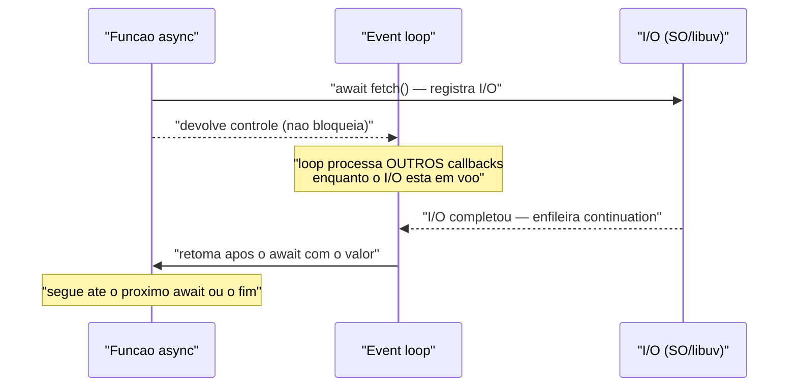
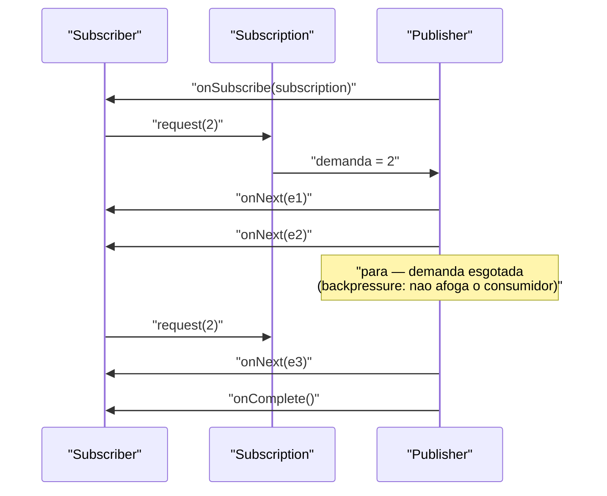

# Async/await, Futures/Promises e Reactive Streams

> **Bloco:** Concorrência e paralelismo · **Nível:** Avançado · **Tempo de leitura:** ~30 min

## TL;DR

São os modelos para escrever código **assíncrono não-bloqueante** — coordenar trabalho que *espera* (I/O de rede, banco, disco) sem prender uma thread parada na espera. O ponto de partida é a oposição **síncrono-bloqueante × assíncrono-não-bloqueante**: no modelo bloqueante, a thread chama uma operação de I/O e *dorme* até ela retornar (uma thread por requisição em voo — caro sob alta concorrência, ver thread pools); no modelo não-bloqueante, a operação é **registrada** e a thread fica livre para fazer outra coisa, sendo **notificada** quando o resultado chega. O mecanismo que orquestra essa notificação é o **event loop**: um laço de thread única (ou poucas) que tira tarefas/callbacks de uma fila e os executa um a um até completar — base do Node.js, do navegador e de runtimes reactive. A **escada evolutiva** da abstração é o coração do tema: começou em **callbacks** (passar uma função "me chame quando pronto"), que escalam mal e produzem o *callback hell* (aninhamento profundo, erro propagado na mão); evoluiu para **Futures/Promises** — um objeto que representa **um valor que ainda não existe** (um resultado futuro), componível via `then`/`map`/`flatMap` em vez de aninhar; e culminou em **async/await**, que é **açúcar sintático sobre Promises/continuations** — escrever código que *parece* síncrono (`await x`) mas que o compilador transforma em continuations que não bloqueiam a thread. Para fluxos de **múltiplos valores ao longo do tempo** (0..N, não apenas um), Future não basta: entram os **Reactive Streams**, um padrão (e especificação JVM) com quatro interfaces — `Publisher`, `Subscriber`, `Subscription`, `Processor` — cuja inovação central é o **backpressure via `request(n)`**: o consumidor pede explicitamente quantos elementos consegue processar, e o produtor nunca envia mais que isso, evitando que um produtor rápido afogue um consumidor lento (push-pull dinâmico). Implementações: **Project Reactor** (`Mono`=0..1, `Flux`=0..N — base do Spring WebFlux) e **RxJava** (`Observable` sem backpressure, `Flowable` com). Distinção fina cobrada: **cold streams** (cada assinante dispara a execução do zero — preguiçoso, como uma requisição HTTP) × **hot streams** (emitem independentemente de assinantes — como eventos de mouse ou um tópico Kafka). Comparação que fecha o tema: **Future/Promise = um valor (0..1) futuro**; **Reactive Stream = 0..N valores com backpressure**. E o contexto atual: **virtual threads (Project Loom, Java 21+) e coroutines/goroutines** trazem de volta o estilo bloqueante *que parece síncrono mas escala* — questionando quando o custo cognitivo de reactive ainda compensa.

## O problema que resolve

Imagine um endpoint que, para responder, precisa chamar três serviços: estoque, preço e frete. No modelo **síncrono-bloqueante** ingênuo, a thread faz a chamada ao estoque e **bloqueia** (dorme) até a resposta chegar — digamos 100ms; depois bloqueia 100ms no preço; depois 100ms no frete. Total: 300ms de parede, e durante **todo** esse tempo a thread está parada, consumindo memória (stack de ~1MB) e ocupando um slot do pool **sem fazer nada útil** — só esperando bytes na rede. Para servir 10.000 requisições concorrentes assim, você precisaria de ~10.000 threads bloqueadas, e o número de threads do SO é finito; o context-switch entre elas degrada tudo (ver `08-thread-pools-e-tuning.md`). O recurso desperdiçado é gritante: a CPU está **ociosa** e mesmo assim o sistema não escala, porque o limite é o número de threads que podem ficar dormindo esperando I/O.

A pergunta central é: **"Como atender altíssima concorrência de operações dominadas por espera (I/O) sem dedicar uma thread bloqueada a cada operação em voo — e como compor várias dessas operações de forma legível, sem virar um emaranhado de callbacks?"**

A resposta tem duas faces. A primeira é **não bloquear**: em vez de a thread dormir esperando o I/O, ela **registra interesse** (no event loop ou no sistema operacional via `epoll`/`kqueue`/IOCP) e segue trabalhando; quando o resultado chega, um callback é agendado. Com isso, **uma única thread** pode ter milhares de operações de I/O em voo simultaneamente — ela só executa código quando há resultado para processar, nunca enquanto espera. A segunda face é **composição legível**: callbacks crus resolvem o "não bloquear" mas tornam o código ilegível (o *callback hell*); Futures/Promises e depois async/await dão uma forma de **encadear e combinar** operações assíncronas que se lê quase como código sequencial, com tratamento de erro unificado.

Há ainda um terceiro problema, que Futures **não** resolvem e que motiva os Reactive Streams: muitos cenários não produzem *um* valor, mas **uma sequência de valores ao longo do tempo** (linhas de um arquivo gigante, mensagens de um tópico, eventos de UI, resultados paginados de um banco). E quando o produtor é mais rápido que o consumidor, é preciso um mecanismo para o consumidor **dizer quanto aguenta** — caso contrário buffers crescem sem limite (OOM) ou mensagens são perdidas. Esse é o problema do **backpressure** (ver `../06-mensageria-e-streaming/03-backpressure.md`), e é exatamente o que a especificação Reactive Streams formaliza com `request(n)`.

## O que é (definição aprofundada)

### Síncrono-bloqueante vs assíncrono-não-bloqueante

São dois eixos que frequentemente se confundem, mas é útil separá-los:

- **Bloqueante × não-bloqueante** descreve o que acontece com a *thread chamadora* durante uma operação de I/O. **Bloqueante:** a thread fica suspensa até a operação completar (`InputStream.read()` clássico, JDBC). **Não-bloqueante:** a chamada retorna imediatamente (ou registra um callback) e a thread segue; o resultado vem depois por notificação.
- **Síncrono × assíncrono** descreve *quando* você obtém o resultado em relação à chamada. **Síncrono:** o resultado volta no retorno da função. **Assíncrono:** o resultado volta depois, por callback/Future/evento.

Na prática, o par que importa para escalabilidade de I/O é **assíncrono-não-bloqueante**: nenhuma thread fica dormindo esperando o I/O. É o oposto do **síncrono-bloqueante** (thread-por-requisição que dorme na espera). O ganho é direto pela natureza IO-bound da carga: como a tarefa passa a maior parte do tempo *esperando*, liberar a thread durante a espera permite que **pouquíssimas threads** sustentem **enorme concorrência** de I/O.

### Event loop

O **event loop** é o motor que torna o não-bloqueante viável com poucas threads. É um laço (tipicamente de thread única, como em JavaScript/Node, ou poucas threads como nos *event loops* do Netty/Reactor) que:

1. Pega a próxima tarefa/callback de uma **fila** (a *message queue* / *task queue*).
2. **Executa essa tarefa por completo** (run-to-completion — nada a interrompe no meio).
3. Volta a buscar a próxima.

Operações de I/O não são feitas *dentro* do loop bloqueando-o; são delegadas ao SO (ou a um pool de I/O), e quando completam, **enfileiram um callback** para o loop processar. Em JavaScript, há ainda a distinção entre **macrotasks** (a *task queue*) e **microtasks** (a fila de callbacks de Promise, drenada *integralmente* entre cada macrotask, com prioridade maior). O modelo run-to-completion tem uma propriedade valiosa — enquanto um callback roda, **nada o preempta**, o que elimina muitas races *dentro* do loop — e um perigo correspondente: se um callback faz trabalho **CPU-bound longo** ou uma chamada **bloqueante**, ele **trava o loop inteiro** (nenhum outro evento é processado), derrubando a vazão de tudo. A regra de ouro do event loop é: **nunca bloqueie o loop**.

### A escada evolutiva: callbacks → Futures/Promises → async/await

**Callbacks.** A forma mais primitiva de assincronia: você passa para a função uma outra função a ser chamada quando o resultado estiver pronto.

```
// JS — callback
buscaEstoque(id, function(err, estoque) {
    if (err) return trata(err);
    buscaPreco(id, function(err, preco) {            // aninhado
        if (err) return trata(err);
        buscaFrete(id, function(err, frete) {        // mais aninhado
            if (err) return trata(err);
            responde(estoque, preco, frete);         // "callback hell"
        });
    });
});
```

O problema é duplo: o **aninhamento** cresce em "pirâmide" (callback hell), e o **tratamento de erro** tem de ser repetido manualmente em cada nível (não há propagação automática). Compor ("faça A e B em paralelo, depois C") vira código manual e frágil.

**Futures/Promises.** Um **Future** (ou **Promise**) é um objeto que representa **um valor que ainda não existe** — o resultado futuro de uma computação assíncrona. Tem três estados: *pendente* (ainda computando), *resolvido/cumprido* (com um valor) ou *rejeitado/falho* (com um erro). A inovação é que ele é um **valor de primeira classe**: você pode passá-lo adiante e, sobretudo, **encadear** transformações sobre ele *antes* de o valor existir. Os combinadores principais:

- **`then` / `map`:** aplica uma função ao valor quando ele chegar, produzindo um novo Future. `map` transforma `Future<A>` em `Future<B>`.
- **`flatMap` / `thenCompose`:** quando a função em si retorna *outro* Future (uma operação assíncrona dependente), `flatMap` "achata" `Future<Future<B>>` em `Future<B>` — é a composição **sequencial** de etapas assíncronas dependentes.
- **Combinadores de junção:** `thenCombine` (Java) / `Promise.all` (JS) / `zip` — esperam **dois ou mais** Futures e combinam seus resultados; permitem disparar operações **em paralelo** e juntar quando todas terminam.
- **Tratamento de erro componível:** `exceptionally`/`handle` (Java), `.catch` (JS) — o erro **propaga pela cadeia** automaticamente, sem `if (err)` em cada nível.

```
// JS — Promises: linear, erro unificado
buscaEstoque(id)
    .then(estoque => buscaPreco(id).then(preco => ({estoque, preco})))
    .then(({estoque, preco}) => buscaFrete(id).then(frete => responde(estoque, preco, frete)))
    .catch(trata);   // um único ponto de erro para toda a cadeia
```

Em Java, o `CompletableFuture` materializa isso com `thenApply` (map), `thenCompose` (flatMap), `thenCombine` (junção) e `exceptionally`.

**async/await.** É **açúcar sintático sobre Promises/continuations**. A palavra-chave `await` *suspende* a função assíncrona naquele ponto até a Promise resolver, **sem bloquear a thread** — o compilador transforma o que vem *depois* do `await` numa **continuation** (um callback) registrada na Promise. Você escreve código que *se lê* como sequencial e bloqueante, mas que por baixo é exatamente a cadeia de `then` de antes:

```
// JS — async/await: lê como síncrono, executa como Promises
async function checkout(id) {
    try {
        const [estoque, preco, frete] = await Promise.all([   // em paralelo
            buscaEstoque(id), buscaPreco(id), buscaFrete(id)
        ]);
        return responde(estoque, preco, frete);
    } catch (e) { trata(e); }                                 // try/catch normal
}
```

O ganho é cognitivo: erro com `try/catch` comum, fluxo linear, sem pirâmide. Mas é crucial entender que **`await` não bloqueia a thread** — ele *cede o controle ao event loop*, que processa outros eventos enquanto a Promise não resolve. Tratar `await` como "espera bloqueante" leva a erros de desempenho (serializar coisas que poderiam ser paralelas) e, em alguns runtimes, a deadlocks.

### Reactive Streams: Publisher, Subscriber, Subscription, Processor

Futures/Promises modelam **um** valor futuro. Mas e quando há **0..N valores ao longo do tempo** com necessidade de controle de fluxo? Entram os **Reactive Streams** — uma especificação (padrão na JVM desde o Java 9, como `java.util.concurrent.Flow`) que define um contrato de **processamento de streams assíncrono com backpressure não-bloqueante**. Quatro interfaces:

- **`Publisher<T>`:** a fonte. Produz uma sequência potencialmente ilimitada de elementos, **de acordo com a demanda** recebida de seus `Subscriber`s. Tem um método: `subscribe(Subscriber)`.
- **`Subscriber<T>`:** o consumidor. Recebe os callbacks do ciclo de vida: `onSubscribe(Subscription)` (uma vez, ao se inscrever), depois zero ou mais `onNext(T)` (cada elemento), e termina com **`onComplete()`** (fim normal) **ou** `onError(Throwable)` (falha) — nunca ambos, nunca depois de cancelar.
- **`Subscription`:** representa o vínculo um-a-um entre um `Subscriber` e um `Publisher`. Tem dois métodos: **`request(long n)`** — sinaliza que o subscriber está pronto para receber *até `n`* elementos — e `cancel()` — encerra o fluxo e libera recursos.
- **`Processor<T,R>`:** é ao mesmo tempo `Subscriber<T>` e `Publisher<R>` — um estágio intermediário que consome de um upstream e produz para um downstream (a peça de transformação no meio do pipeline).

O protocolo de sinais é estrito: `onSubscribe` sempre primeiro, seguido de um número (limitado pela demanda) de `onNext`, terminando com `onError` **ou** `onComplete`, enquanto a `Subscription` não for cancelada.

### Backpressure via `request(n)`

Esta é **a** inovação dos Reactive Streams e o que os distingue de um simples stream de callbacks. Num modelo *puramente push*, o `Publisher` emitiria `onNext` o mais rápido que pudesse; se o `Subscriber` for mais lento (ex.: grava em banco), os elementos se acumulam num buffer que cresce sem limite até estourar a memória — ou são descartados. O Reactive Streams resolve invertendo o controle: **nenhum elemento é enviado até que o `Subscriber` peça**, via `subscription.request(n)`. O `Subscriber` declara explicitamente "estou pronto para *n* elementos"; o `Publisher` envia **no máximo** *n* `onNext` e então espera o próximo `request`. É um modelo **push-pull dinâmico**: o consumidor *puxa* a demanda (controle de fluxo), o produtor *empurra* os dados dentro do limite concedido. Assim o consumidor lento **nunca é afogado** — ele dita o ritmo. (Demanda cumulativa de `Long.MAX_VALUE` é tratada como "ilimitada", efetivamente desligando o backpressure quando o consumidor declara que aguenta tudo.)

### Project Reactor e RxJava

As implementações que dão ergonomia ao contrato cru:

- **Project Reactor** (base do Spring WebFlux): expõe dois tipos reativos compostos sobre `Publisher` — **`Mono<T>`** (0..1 elemento — o "Future reativo") e **`Flux<T>`** (0..N elementos). Oferece um vocabulário riquíssimo de **operadores** (`map`, `flatMap`, `filter`, `zip`, `merge`, `buffer`, `window`, `retry`, `timeout`, `onErrorResume`…), cada um envolvendo o `Publisher` anterior num novo (a analogia da "linha de montagem" de estações de trabalho).
- **RxJava** (Reactive Extensions para a JVM): distingue **`Observable`** (sem backpressure — para sequências curtas, eventos de UI) de **`Flowable`** (com backpressure, implementando Reactive Streams). Estratégias quando o produtor excede a demanda: `onBackpressureBuffer`, `onBackpressureDrop`, `onBackpressureLatest`.

### Cold streams vs hot streams

Distinção sutil e cobrada:

- **Cold stream (frio):** a produção é **preguiçosa e por assinante** — começa do zero a cada `subscribe`, e cada assinante recebe a sequência **completa e independente**. Exemplo canônico: um `Mono`/`Flux` que representa uma requisição HTTP ou uma query — nada acontece até alguém assinar, e dois assinantes disparam duas execuções. Cold streams casam **naturalmente com o backpressure pull**.
- **Hot stream (quente):** emite **independentemente** de haver assinantes, e assinantes recebem apenas o que for emitido **a partir do momento** em que se inscreveram (perdem o passado). Exemplos: eventos de mouse/teclado, preços de ações, um tópico Kafka, um `Sink`/`Subject` compartilhado. Hot streams lidam mal com pull puro (a fonte não controla seu ritmo — o mundo externo gera os eventos) e exigem outras estratégias de fluxo (buffer, drop, sampling).

### Future vs Reactive Stream: a comparação que fecha o tema

| Aspecto | Future / Promise | Reactive Stream (`Flux`/`Flowable`) |
|---|---|---|
| Quantidade de valores | **um** (0..1) | **muitos** (0..N, ao longo do tempo) |
| Disparo | geralmente já em execução (eager) | tipicamente preguiçoso (cold) — só ao assinar |
| Backpressure | não tem (um valor só) | **sim**, via `request(n)` |
| Cancelamento | limitado (`cancel` em alguns) | `subscription.cancel()` de primeira classe |
| Composição | `then`/`map`/`flatMap`/junção | operadores ricos (map, filter, zip, window…) |
| Caso de uso | uma chamada assíncrona, agregar N chamadas | streaming, eventos contínuos, paginação infinita |

Regra mnemônica: **Future é um `Optional` assíncrono; Reactive Stream é um `Stream` assíncrono com controle de fluxo.**

### Virtual threads e coroutines: o contexto atual

O modelo reactive nasceu para resolver o custo das threads de plataforma bloqueadas. **Virtual threads** (Project Loom, Java 21+) e **coroutines/goroutines** (Kotlin, Go) atacam o mesmo problema por outro ângulo: tornam as threads **baratíssimas** e fazem o *bloqueio parecer bloqueio* (código síncrono linear) enquanto, por baixo, **desmontam** a thread leve da carrier durante o I/O — entregando a escalabilidade do não-bloqueante com a ergonomia do síncrono. Isso reabre a pergunta: se eu posso escrever `var x = chamaServico()` bloqueante e mesmo assim ter milhões de "threads" em voo, **quando o custo cognitivo de async/await e Reactor ainda compensa?** A resposta atual: reactive continua imbatível para **streaming com backpressure de ponta a ponta (0..N)** e operadores ricos de composição de fluxos; para o caso comum de **agregar chamadas e responder (0..1) sob alta concorrência**, virtual threads/coroutines oferecem uma alternativa muito mais simples de ler e depurar.

### Glossário rápido

- **Bloqueante × não-bloqueante:** se a thread dorme durante o I/O ou é liberada.
- **Síncrono × assíncrono:** se o resultado vem no retorno ou depois (callback/Future/evento).
- **Event loop:** laço run-to-completion que processa callbacks de uma fila; não pode ser bloqueado.
- **Callback hell:** aninhamento profundo de callbacks, com erro tratado na mão.
- **Future/Promise:** objeto que representa **um** valor futuro (0..1); componível por `then`/`map`/`flatMap`.
- **async/await:** açúcar sintático sobre Promises/continuations; `await` suspende sem bloquear a thread.
- **Reactive Streams:** contrato `Publisher`/`Subscriber`/`Subscription`/`Processor` para 0..N com backpressure.
- **`request(n)`:** o subscriber pede *n* elementos; o publisher nunca envia mais que isso (backpressure).
- **Mono / Flux:** Reactor — 0..1 e 0..N. **Observable / Flowable:** RxJava — sem/com backpressure.
- **Cold × hot:** produção preguiçosa por assinante × emissão independente de assinantes.
- **Virtual thread / coroutine:** thread leve que bloqueia parecendo síncrona, mas escala como não-bloqueante.

## Como funciona

O fluxo de uma operação **async/await sobre event loop** (estilo Node/navegador):

1. **Chamada não-bloqueante.** A função assíncrona executa até o primeiro `await fetch(...)`. A operação de I/O é registrada (delegada ao SO/libuv), e a função **devolve o controle ao event loop** — a thread não dorme.
2. **Loop livre.** O event loop processa **outros** callbacks/eventos enquanto o I/O está em voo. Uma única thread mantém centenas de operações pendentes.
3. **Conclusão do I/O.** Quando a resposta chega, um callback (a **continuation** registrada pelo `await`) é enfileirado (na microtask queue, no caso de Promise).
4. **Retomada.** O loop, ao drenar a fila, executa a continuation: a função assíncrona **retoma** exatamente após o `await`, com o valor resolvido, e segue até o próximo `await` ou o fim.

O fluxo de um **pipeline Reactive Streams com backpressure**:

1. **Assinatura.** `publisher.subscribe(subscriber)`. O publisher chama `subscriber.onSubscribe(subscription)`, entregando o controle de demanda.
2. **Demanda.** O subscriber chama `subscription.request(n)` — "estou pronto para *n* elementos". **Antes disso, nada é emitido.**
3. **Emissão limitada.** O publisher emite **no máximo *n*** `onNext(elemento)`. Se tem mais para enviar, **espera** o próximo `request`.
4. **Ritmo do consumidor.** Conforme processa, o subscriber chama `request(n)` de novo, ditando o ritmo. Um consumidor lento simplesmente pede menos/mais devagar — o produtor desacelera junto (backpressure de ponta a ponta).
5. **Término.** Ao esgotar a fonte, o publisher chama `onComplete()`; em caso de falha, `onError(e)`. O subscriber pode encerrar antes com `subscription.cancel()`.

O ponto que liga os dois: tanto o `await` quanto o `onNext`/`request` são **callbacks agendados** — a thread nunca fica parada esperando. A diferença é a **cardinalidade e o controle de fluxo**: async/await orquestra **um** resultado (ou um conjunto fixo, via `Promise.all`); Reactive Streams orquestra **uma sequência** com o consumidor regulando o ritmo. E ambos vivem sobre o mesmo princípio do `08-thread-pools-e-tuning.md`: para carga **IO-bound**, liberar a thread durante a espera é o que permite escalar com poucas threads.

## Diagrama de fluxo

O primeiro diagrama mostra o event loop processando uma operação async/await sem bloquear a thread; o segundo mostra o pipeline Publisher→Subscriber com backpressure via `request(n)`, `onNext` e `onComplete`.





## Exemplo prático / caso real

Cenário: a página de **checkout** de um e-commerce brasileiro, em Java/Spring, que ao montar o resumo do pedido precisa consultar três serviços — **estoque** (~80ms), **preço/promoções** (~120ms) e **frete** (~150ms) — todos por HTTP.

**O ponto de partida bloqueante.** A versão original, com `RestTemplate` síncrono numa thread do pool do Tomcat, fazia as três chamadas em sequência: ~80 + 120 + 150 = **350ms** de parede, com a thread **bloqueada e ociosa** durante quase todo esse tempo (é I/O de rede). Na Black Friday, com milhares de checkouts concorrentes, o pool de threads do Tomcat esgotou: cada requisição prendia uma thread por 350ms sem fazer trabalho de CPU, e o servidor passou a recusar conexões mesmo com a CPU em 20%. O recurso limitante eram **threads bloqueadas**, não computação.

**Correção 1 — agregar em paralelo com CompletableFuture (0..1).** O time disparou as três chamadas **concorrentemente** e combinou os resultados, transformando 350ms sequenciais em ~150ms (o tempo da mais lenta):

```
// Java — agrega 3 chamadas em paralelo, sem bloquear; junta com thenCombine
CompletableFuture<Estoque> fe = clienteEstoque.buscarAsync(id);   // dispara já
CompletableFuture<Preco>   fp = clientePreco.buscarAsync(id);     // em paralelo
CompletableFuture<Frete>   ff = clienteFrete.buscarAsync(id);     // em paralelo

CompletableFuture<Resumo> resumo = fe
    .thenCombine(fp, (e, p) -> new Parcial(e, p))                 // junta estoque+preco
    .thenCombine(ff, (parcial, f) -> montaResumo(parcial, f))    // + frete
    .exceptionally(ex -> resumoDegradado(ex));                   // erro propaga p/ um lugar
```

Com um cliente HTTP **não-bloqueante** por baixo (`WebClient`), nenhuma thread fica dormindo na espera: as três operações ficam em voo registradas no event loop, e a continuation (`thenCombine`) roda quando ambas resolvem. Poucas threads de I/O sustentam milhares de checkouts. Note a **composição**: `thenCombine` para junção paralela, `exceptionally` como ponto único de erro — nada de callback hell.

**Correção 2 — quando vira streaming (0..N com backpressure).** Numa segunda fase, o catálogo de uma página de categoria passou a transmitir **milhares de produtos** vindos do banco para o cliente conforme são lidos, em vez de carregar tudo na memória. Aqui Future não serve — é uma **sequência** (0..N). Usaram `Flux` (Reactor) com um driver de banco reativo (R2DBC):

```
// Java/Reactor — stream de produtos com backpressure de ponta a ponta
Flux<Produto> produtos = repositorio.streamPorCategoria(catId)   // cold: so executa ao assinar
    .map(p -> aplicaPromocao(p))                                 // operador de transformacao
    .filter(Produto::disponivel);
// O cliente (WebFlux) faz request(n) conforme consome; se a rede do cliente
// esta lenta, o request desacelera, o driver puxa menos linhas do banco,
// e nada estoura a memoria do servidor — backpressure ate o banco.
```

O `Flux` é **cold**: nada acontece até o WebFlux assinar a resposta HTTP. Conforme o cliente consome (e seu `request(n)` reflete o quanto a rede dele aguenta), o Reactor propaga a demanda **até o banco**, que lê linhas no ritmo do consumidor mais lento. Um cliente em 3G lento simplesmente faz o pipeline inteiro desacelerar, sem buffers crescendo no servidor.

**A armadilha que quase voltou.** Num PR, alguém, acostumado ao estilo bloqueante, escreveu `produto.block()` no meio do pipeline Reactor para "pegar o valor logo" — bloqueando uma das poucas threads do event loop e anulando todo o ganho (sob carga, travaria o loop e derrubaria a vazão). O code review barrou: **nunca `.block()`/`.get()` dentro de um pipeline reactive**.

Realidade por stack: em **JavaScript/Node**, `async/await` sobre o event loop do libuv é o default; em **Java**, `CompletableFuture` (0..1) e Project Reactor/`Flux` (0..N, base do Spring WebFlux), com RxJava como alternativa; em **Go**, o estilo é o oposto — goroutines bloqueantes baratas (`go chamaServico()` + channels) entregam concorrência sem async/await explícito, com o scheduler M:N liberando a thread do SO no I/O; em **Kotlin**, coroutines (`suspend fun`) dão async/await estrutural.

## Quando usar / Quando evitar

**Assíncrono-não-bloqueante (em geral):** use para cargas **IO-bound** de alta concorrência (gateways, agregadores, proxies, serviços que orquestram muitas chamadas externas) — escala com poucas threads. **Evite** para cargas **CPU-bound** (cálculo pesado): assincronia não cria paralelismo de CPU, e código CPU-bound no event loop **trava o loop**; aí o que importa é pool ≈ núcleos (ver `08-thread-pools-e-tuning.md`).

**Futures/Promises + async/await (0..1):** use quando há **um** resultado assíncrono ou um **conjunto fixo** de chamadas a agregar (o caso do checkout). É o default legível para "chame N serviços e combine". **Evite** quando o resultado é uma **sequência contínua/ilimitada** com necessidade de controle de fluxo — Future não tem backpressure.

**Reactive Streams (0..N com backpressure):** use para **streaming** (resultados que chegam ao longo do tempo), pipelines de transformação ricos, e quando produtor e consumidor têm **ritmos diferentes** e você precisa de controle de fluxo de ponta a ponta (banco → servidor → cliente). **Evite** quando o caso é simplesmente 0..1 — a complexidade de operadores e o modelo mental reativo não se pagam; e **evite** misturar com chamadas bloqueantes no meio do pipeline.

**Virtual threads / coroutines / goroutines:** use como **alternativa mais simples** ao reactive para o caso 0..1 de alta concorrência IO-bound — código linear que escala. **Evite** assumir que resolvem o caso de **streaming com backpressure** (não substituem Reactive Streams nesse ponto) ou que ajudam em **CPU-bound** (o gargalo continua sendo os núcleos).

## Anti-padrões e armadilhas comuns

- **Bloquear (`.get()`/`.block()`/`join`) dentro de um pipeline reactive ou no event loop.** Anula todo o benefício: prende uma das poucas threads de I/O, e sob carga **trava o loop** e derruba a vazão de tudo. Nunca `.block()` no meio de um `Flux`/`Mono`; nunca chamada bloqueante num callback do event loop. Se precisa integrar código bloqueante, isole-o num pool dedicado (`subscribeOn(Schedulers.boundedElastic())`).
- **Callback hell.** Aninhar callbacks em pirâmide com tratamento de erro manual em cada nível. Resolva subindo a escada: Promises com `then`/`catch`, ou async/await com `try/catch`.
- **Ignorar backpressure.** Tratar um stream como push puro (emitir o mais rápido possível para um consumidor lento) faz buffers crescerem sem limite (OOM) ou descarta dados silenciosamente. Use `request(n)` / `Flowable` / estratégias `onBackpressure*` e pense no controle de fluxo de ponta a ponta (ver `../06-mensageria-e-streaming/03-backpressure.md`).
- **Assumir paralelismo onde só há concorrência.** Um event loop de thread única dá **concorrência** (muitas operações em voo), **não paralelismo de CPU** (uma instrução por vez). `async/await` não acelera cálculo; só evita bloquear na espera de I/O (ver `01-concorrencia-vs-paralelismo-e-context-switching.md`).
- **`await` em série quando poderia ser paralelo.** `await a(); await b(); await c();` espera uma de cada vez (soma os tempos). Se são independentes, dispare em paralelo e junte: `Promise.all([a(), b(), c()])` / `thenCombine`. Tratar `await` como "bloqueio sequencial" desperdiça a oportunidade de paralelizar I/O.
- **CPU-bound no event loop.** Um cálculo pesado (parse de payload gigante, criptografia, loop longo) num callback bloqueia o loop inteiro — todos os outros eventos esperam. Delegue a um worker/pool (Worker Threads no Node, `boundedElastic` no Reactor).
- **Confundir cold e hot stream.** Esperar que um `Flux` cold "já esteja rodando" (não está — só ao assinar) ou que um hot stream "entregue o histórico" a um assinante tardio (não entrega — só o que vier depois). Saber qual é qual evita bugs de "não recebi nada" / "recebi duas vezes".
- **Vazar `Subscription` / não cancelar.** Esquecer de `cancel()` (ou de gerenciar o ciclo de vida da assinatura) em streams hot/ilimitados causa vazamento de recursos e processamento desnecessário.
- **Engolir erros assíncronos.** Promise sem `.catch` (unhandled rejection), `Flux` sem `onError`, `CompletableFuture` sem `exceptionally`/`handle` — o erro some silenciosamente. Sempre termine a cadeia com tratamento de erro.
- **Mexer em estado compartilhado mutável de vários callbacks.** O event loop run-to-completion protege *dentro* de um callback, mas estado compartilhado entre callbacks/threads de I/O ainda exige cuidado de visibilidade/atomicidade (ver `05-atomic-cas-lock-free-wait-free.md`).

### Por que async não é paralelismo (e por que isso importa)

Vale fixar a confusão mais comum. **Concorrência** é *lidar com* muitas coisas ao mesmo tempo (estruturar o programa em tarefas independentes que progridem intercaladas); **paralelismo** é *executar* muitas coisas ao mesmo tempo (em múltiplos núcleos). O modelo async/await sobre event loop entrega **concorrência massiva de I/O com uma única thread** — milhares de operações *em voo*, mas o código JavaScript roda **uma instrução por vez**. Isso é perfeito para IO-bound (a thread só trabalha quando há resultado; o resto do tempo o I/O acontece no SO), mas **não acelera computação**: dois cálculos pesados num event loop de thread única rodam um após o outro, e o segundo *bloqueia o loop* enquanto o primeiro não termina. Para paralelismo de CPU é preciso múltiplas threads/processos (pool ≈ núcleos). A consequência arquitetural: escolha o modelo pela **natureza da carga** — assíncrono-não-bloqueante e poucas threads para IO-bound; pool dimensionado por núcleos para CPU-bound; e **nunca** misture trabalho CPU-bound longo dentro do event loop.

## Relação com outros conceitos

- **Thread pools e tuning** (ver `08-thread-pools-e-tuning.md`): async/reactive é a **alternativa** ao pool grande para IO-bound — em vez de muitas threads bloqueadas, poucas threads não-bloqueantes; o raciocínio "natureza da carga define a estratégia" (CPU vs IO) é o mesmo, e o `CompletableFuture` roda no `ForkJoinPool.commonPool` por default (não o bloqueie).
- **Concorrência vs paralelismo e context-switching** (ver `01-concorrencia-vs-paralelismo-e-context-switching.md`): o event loop é o exemplo máximo de **concorrência sem paralelismo** (uma thread, muitas tarefas em voo); confundir os dois leva a esperar que async acelere CPU.
- **Backpressure** (ver `../06-mensageria-e-streaming/03-backpressure.md`): `request(n)` é a materialização *in-process* do mesmo conceito que governa o controle de fluxo em mensageria/streaming — o consumidor regulando o produtor para não ser afogado.
- **Connection pooling, async I/O e reactive** (ver `../07-performance-e-escalabilidade/05-connection-pooling-thread-pooling-async-io-reactive.md`): este conceito é o "como" do async I/O e do reactive ali apresentados como estratégias de escalabilidade; o pool de conexões também precisa ser reativo/não-bloqueante para o pipeline não bloquear nele.
- **Leis de Little, Amdahl e USL** (ver `../07-performance-e-escalabilidade/06-leis-little-amdahl-universal-scalability-law.md`): a Lei de Little explica por que liberar a thread durante a espera (reduzir o tempo que cada thread fica "ocupada") aumenta a concorrência sustentável; Amdahl lembra que async não paraleliza a parte serial/CPU-bound.

## Modelo mental para o arquiteto

Três ideias para carregar:

1. **A natureza da carga escolhe a ferramenta.** IO-bound de alta concorrência → assíncrono-não-bloqueante (libere a thread durante a espera). CPU-bound → pool ≈ núcleos; **nunca** ponha cálculo pesado no event loop, que o trava. Async dá **concorrência**, não **paralelismo** — não acelera computação.
2. **Cardinalidade decide o modelo.** **Um** valor futuro (ou um conjunto fixo a agregar) → Future/Promise + async/await, com `then`/`map`/`flatMap` e junção (`Promise.all`/`thenCombine`). **0..N ao longo do tempo com controle de fluxo** → Reactive Streams (`request(n)`, `Flux`/`Flowable`). Future é um `Optional` assíncrono; Reactive Stream é um `Stream` assíncrono com backpressure.
3. **Não bloqueie o que foi feito para não bloquear.** `.block()`/`.get()` num pipeline reactive ou uma chamada bloqueante no event loop anulam todo o benefício e podem derrubar a vazão. E pondere o contexto atual: **virtual threads/coroutines** trazem de volta o código linear que escala — para o caso 0..1, frequentemente a escolha mais simples; reactive permanece soberano para streaming com backpressure de ponta a ponta.

## Pontos para fixar (revisão)

- **Síncrono-bloqueante** prende uma thread dormindo na espera de I/O (não escala sob alta concorrência); **assíncrono-não-bloqueante** libera a thread e a notifica depois — poucas threads sustentam enorme concorrência IO-bound.
- O **event loop** é run-to-completion (um callback por vez, nada o preempta); **nunca o bloqueie** com I/O bloqueante ou CPU-bound longo.
- Escada da abstração: **callbacks** (callback hell) → **Futures/Promises** (um valor futuro, componível por `then`/`map`/`flatMap`/junção) → **async/await** (açúcar sobre Promises/continuations; `await` suspende **sem bloquear** a thread).
- **Reactive Streams** = `Publisher`/`Subscriber`/`Subscription`/`Processor` para **0..N com backpressure**; a chave é **`request(n)`** — o consumidor pede quanto aguenta, o produtor nunca envia mais (push-pull dinâmico).
- **Reactor:** `Mono` (0..1) / `Flux` (0..N). **RxJava:** `Observable` (sem backpressure) / `Flowable` (com).
- **Cold** = preguiçoso e por assinante (executa ao assinar, cada um recebe tudo); **hot** = emite independente de assinantes (assinante tardio perde o passado).
- **Future = um valor (0..1), sem backpressure**; **Reactive Stream = 0..N valores com backpressure**. Future é um `Optional` assíncrono; stream reativo é um `Stream` assíncrono com controle de fluxo.
- **Async ≠ paralelismo:** entrega concorrência de I/O numa thread, não acelera CPU; **virtual threads/coroutines/goroutines** dão o estilo bloqueante que escala (alternativa ao reactive para o caso 0..1).

## Referências

- [async function — MDN Web Docs](https://developer.mozilla.org/en-US/docs/Web/JavaScript/Reference/Statements/async_function)
- [await — MDN Web Docs](https://developer.mozilla.org/en-US/docs/Web/JavaScript/Reference/Operators/await)
- [JavaScript execution model (event loop) — MDN Web Docs](https://developer.mozilla.org/en-US/docs/Web/JavaScript/Event_loop)
- [Reactive Streams Specification for the JVM — GitHub](https://github.com/reactive-streams/reactive-streams-jvm)
- [Publisher (reactive-streams 1.0.3 API) — reactive-streams.org](https://www.reactive-streams.org/reactive-streams-1.0.3-javadoc/org/reactivestreams/Publisher.html)
- [Subscription (reactive-streams 1.0.4 API) — reactive-streams.org](https://www.reactive-streams.org/reactive-streams-1.0.4-javadoc/org/reactivestreams/Subscription.html)
- [Introduction to Reactive Programming — Reactor Core Reference Guide](https://projectreactor.io/docs/core/release/reference/reactiveProgramming.html)
- [Backpressure — RxJava (ReactiveX) docs](https://github.com/ReactiveX/RxJava/blob/3.x/docs/Backpressure.md)
- [CompletableFuture (Java SE 21 & JDK 21) — Oracle](https://docs.oracle.com/en/java/javase/21/docs/api/java.base/java/util/concurrent/CompletableFuture.html)
- [Effective Go — Concurrency (goroutines) — go.dev](https://go.dev/doc/effective_go#concurrency)
- [The Reactive Manifesto — reactivemanifesto.org](https://www.reactivemanifesto.org/)
