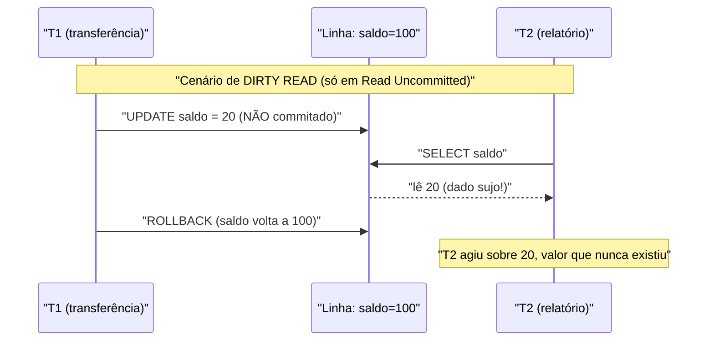
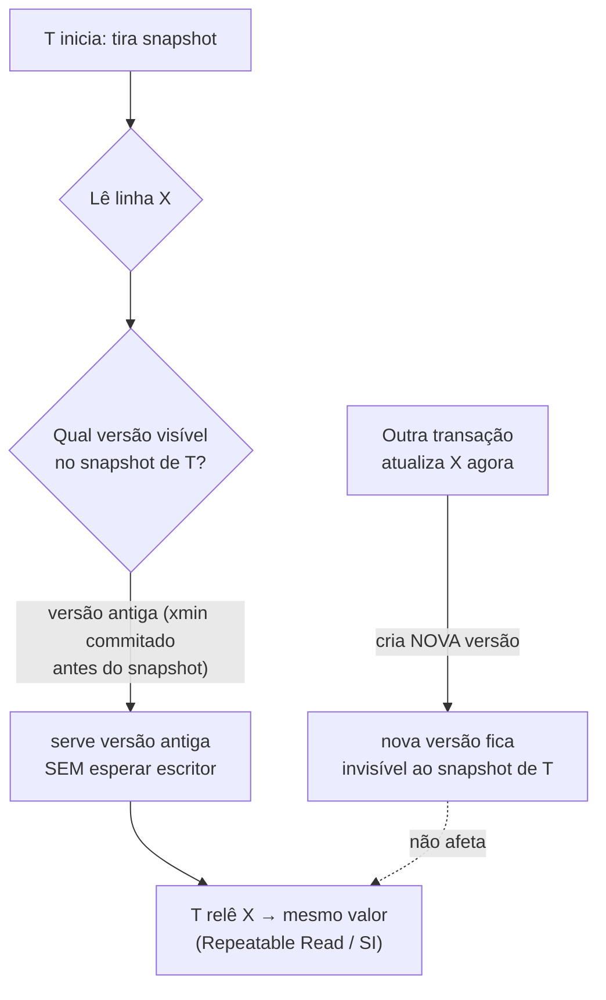

# Níveis de Isolamento e Anomalias: Read Uncommitted, Read Committed, Repeatable Read, Serializable, MVCC e Snapshot Isolation

> **Bloco:** Banco de dados · **Nível:** Intermediário/Avançado · **Tempo de leitura:** ~28 min

## TL;DR

O **I** de ACID — **Isolation** — não é binário: ele é um **espectro de garantias** que negocia o quanto transações concorrentes podem enxergar (ou atrapalhar) umas às outras. O padrão ANSI SQL define quatro níveis — **Read Uncommitted**, **Read Committed**, **Repeatable Read** e **Serializable** — em ordem crescente de isolamento e decrescente de concorrência, originalmente caracterizados por quais **anomalias (fenômenos)** cada um *permite*: **dirty read** (ler dado não commitado), **non-repeatable read** (a mesma linha muda de valor entre duas leituras na mesma transação) e **phantom read** (uma nova linha aparece/some num conjunto que satisfaz um predicado). Serializable é o único que garante o resultado equivalente a alguma execução serial; os demais trocam corretude por desempenho. O problema é que essa caracterização clássica é incompleta: o paper seminal *A Critique of ANSI SQL Isolation Levels* mostrou que os níveis baseados em fenômenos não capturam bem as implementações reais — em particular as baseadas em **MVCC (Multiversion Concurrency Control)**, que servem leituras de **snapshots versionados** sem bloquear escritores, e introduziram o **Snapshot Isolation (SI)**, um nível poderoso mas que sofre de uma anomalia própria: **write skew**. Na prática, o default de PostgreSQL e Oracle é Read Committed; o "Repeatable Read" do PostgreSQL é, na verdade, Snapshot Isolation. O arquiteto precisa saber *qual anomalia cada nível permite*, *o que o seu banco realmente entrega sob cada rótulo* (os nomes mentem) e *quando pagar o preço do Serializable*.

## O problema que resolve

Transações isoladas e seriais (uma após a outra) são triviais de raciocinar: nenhuma vê o trabalho parcial de outra, e o resultado é sempre correto. Mas serializar tudo joga fora o paralelismo — num banco que serve milhares de transações por segundo, executar uma de cada vez é inviável. A concorrência é obrigatória para desempenho, e a concorrência **descontrolada** produz resultados errados.

O dilema central do controle de concorrência é: **como deixar transações rodarem ao mesmo tempo, extraindo throughput, sem que elas corrompam os dados umas das outras?** Quando duas transações tocam os mesmos dados ao mesmo tempo, podem surgir interleavings (intercalações de operações) que produzem estados que *nenhuma execução serial produziria*. Esses interleavings patológicos são as **anomalias de isolamento**.

Considere o exemplo canônico: dois caixas eletrônicos sacando da mesma conta de R$ 100 ao mesmo tempo. Ambos leem saldo 100, ambos checam que 80 ≤ 100, ambos debitam 80, ambos gravam 20. Resultado: R$ 160 sacados de uma conta de R$ 100. Esse é o **lost update** (atualização perdida) — uma transação sobrescreve o efeito da outra como se ela nunca tivesse existido. O controle de concorrência existe para impedir exatamente esse tipo de corrupção.

A questão é que **impedir todas as anomalias custa caro** (locks, abortos, retries, latência). Por isso o SQL não oferece um único modo "correto": oferece **níveis**, deixando o desenvolvedor escolher *quanto* isolamento comprar para cada transação. A pergunta de engenharia é: "para *esta* operação, quais anomalias eu posso tolerar em troca de mais concorrência, e quais me custariam dinheiro/corrupção?". Saldo bancário não tolera lost update; um contador de visualizações de página tolera quase tudo. Calibrar isolamento por transação é uma decisão arquitetural — e, como veremos, os rótulos do padrão são uma armadilha porque cada banco os implementa diferente.

(O contexto ACID amplo — o que são atomicidade, consistência, durabilidade e o trade-off com BASE/CAP — está coberto em `../05-dados-e-persistencia/09-acid-vs-base.md`. Aqui aprofundamos especificamente o **I**.)

## O que é (definição aprofundada)

### As anomalias (fenômenos)

O isolamento é definido em função de quais **fenômenos** ele previne. Os três clássicos do ANSI SQL, mais os que o *Critique* acrescentou:

- **Dirty write:** uma transação sobrescreve um dado que outra transação ainda não commitou. É tão perigoso que *nenhum* nível de isolamento o permite — quebraria o rollback (qual versão restaurar?).
- **Dirty read (leitura suja):** uma transação lê um valor escrito por outra que ainda **não commitou**. Se a outra fizer rollback, você leu um dado que "nunca existiu". Ex.: ler um saldo intermediário de uma transferência que será desfeita.
- **Non-repeatable read (leitura não-repetível):** dentro de uma mesma transação, você lê **a mesma linha duas vezes e obtém valores diferentes**, porque outra transação a alterou e commitou no meio. Quebra a premissa de que "o que li continua valendo".
- **Phantom read (leitura fantasma):** você executa uma **query com predicado** (ex.: `WHERE status = 'pendente'`) duas vezes na mesma transação e o **conjunto de linhas muda** — surgem ou somem linhas porque outra transação inseriu/removeu registros que satisfazem o predicado. Diferente do non-repeatable read (que é sobre *valores* de linhas existentes), o phantom é sobre *o conjunto* de linhas.
- **Lost update (atualização perdida):** o cenário do caixa eletrônico — duas transações leem-modificam-escrevem o mesmo dado e uma sobrescreve a outra. O ANSI clássico não o lista explicitamente, mas o *Critique* o formaliza (fenômeno P4).
- **Write skew (distorção de escrita):** duas transações leem um conjunto sobreposto, cada uma escreve em dados *diferentes* baseando-se no que leu, e juntas violam uma invariante que cada uma isoladamente preservaria. É a anomalia característica do Snapshot Isolation (detalhada adiante).

### Os quatro níveis ANSI

Em ordem crescente de isolamento:

- **Read Uncommitted:** o mais fraco. Permite até dirty reads — você enxerga escritas não commitadas de outras transações. Raramente útil; alguns bancos (PostgreSQL) nem o implementam de verdade, tratando-o como Read Committed.
- **Read Committed:** você só lê dados **commitados**. Elimina dirty reads, mas cada *statement* vê um snapshot do momento em que **ele** começou — então duas leituras na mesma transação podem divergir (non-repeatable read permitido) e phantoms também. É o **default** de PostgreSQL, Oracle e SQL Server (no modo padrão).
- **Repeatable Read:** garante que, se você ler uma linha, relê-la dentro da mesma transação dará o mesmo valor (non-repeatable read prevenido). No ANSI clássico, ainda permite phantoms. Importante: o que cada banco entrega sob esse nome varia muito (ver adiante).
- **Serializable:** o mais forte. Garante que o resultado das transações concorrentes é **equivalente a alguma execução serial** delas — como se tivessem rodado uma de cada vez, em alguma ordem. Previne todas as anomalias, incluindo write skew. O preço: mais contenção, mais abortos por conflito de serialização (o app precisa estar preparado para **retry**).

### MVCC — Multiversion Concurrency Control

A pergunta-chave: como o banco serve Read Committed e níveis mais altos **sem fazer leitores esperarem escritores**? A resposta moderna é **MVCC**. Em vez de sobrescrever um dado in-place (forçando leitores a esperar o lock do escritor), o MVCC mantém **múltiplas versões** de cada linha, cada uma marcada com identificadores de transação (xmin/xmax no PostgreSQL). Quando uma transação atualiza uma linha, cria-se uma **nova versão**; a versão antiga continua visível para transações que começaram antes.

Cada transação enxerga um **snapshot consistente** do banco — o conjunto de versões que eram visíveis no instante relevante (início do statement, para Read Committed; início da transação, para Repeatable Read/SI). O efeito prático, citando o lema clássico: **leitores não bloqueiam escritores e escritores não bloqueiam leitores**. Isso é o que torna PostgreSQL, Oracle e MySQL/InnoDB capazes de alta concorrência de leitura. O custo é o **bloat**: versões antigas precisam ser limpas depois (o `VACUUM` no PostgreSQL, o purge no InnoDB).

### Snapshot Isolation (SI)

**Snapshot Isolation** é o nível que o MVCC viabiliza naturalmente: a transação opera sobre um **snapshot tirado no seu início** e enxerga esse estado congelado até o fim, independentemente do que outras transações commitam no meio. Leituras são sempre consistentes entre si (sem dirty/non-repeatable/phantom reads), e a escrita usa a regra **first-committer-wins**: se duas transações tentam atualizar a *mesma* linha, a segunda a commitar detecta o conflito e aborta (prevenindo lost update).

O ponto sutil, demonstrado no *Critique* (que cunhou o termo): SI **não é Serializable**. Ele previne dirty/non-repeatable/phantom reads e lost update, mas permite **write skew**, porque as transações escrevem em linhas *diferentes* (não há conflito de escrita para detectar), embora suas leituras de um conjunto comum tornem o resultado conjunto inconsistente. É por isso que o "Repeatable Read" do PostgreSQL — que na verdade implementa SI — **é mais forte que o Repeatable Read do ANSI** (previne phantoms) mas **mais fraco que Serializable** (permite write skew). Os nomes mentem; o comportamento, não.

## Como funciona

A primeira tabela é o coração do tema em entrevista: a **matriz de níveis × anomalias permitidas** (conforme o padrão ANSI/SQL-92). "Sim" = a anomalia *pode* ocorrer nesse nível.

| Nível de isolamento | Dirty read | Non-repeatable read | Phantom read | Lost update | Write skew |
|---|---|---|---|---|---|
| **Read Uncommitted** | Sim | Sim | Sim | Sim | Sim |
| **Read Committed** | Não | Sim | Sim | Sim | Sim |
| **Repeatable Read (ANSI)** | Não | Não | Sim | Não* | Sim |
| **Snapshot Isolation** | Não | Não | Não | Não | **Sim** |
| **Serializable** | Não | Não | Não | Não | Não |

\* O ANSI não trata lost update explicitamente; implementações de Repeatable Read baseadas em locking ou SI o previnem na prática.

A segunda tabela mostra **o que cada banco realmente entrega** sob cada rótulo — a parte que mais derruba candidato em entrevista, porque o nome é o mesmo mas a semântica difere:

| Banco | "Read Committed" | "Repeatable Read" | "Serializable" |
|---|---|---|---|
| **PostgreSQL** | RC com MVCC (snapshot por statement) | Na prática **Snapshot Isolation** (previne phantoms; permite write skew) | **Serializable Snapshot Isolation (SSI)** — verdadeiramente serializável, com abortos |
| **Oracle** | RC com MVCC (default) | *Não existe* como nível separado | "Serializable" é, na prática, **Snapshot Isolation** (permite write skew) |
| **MySQL/InnoDB** | RC com MVCC | **Default**; previne phantoms via **next-key locking** (gap locks) — mais forte que ANSI RR | Serializable via locking (converte SELECT em locking reads) |

Pontos cruciais que essa tabela revela:

- O **default difere**: PostgreSQL/Oracle/SQL Server usam Read Committed; **MySQL/InnoDB usa Repeatable Read** por padrão. A mesma aplicação portada entre bancos muda de comportamento de isolamento silenciosamente.
- "Serializable" **não significa o mesmo** em todo lugar: no Oracle (pré-versões recentes) ele é Snapshot Isolation e permite write skew; no PostgreSQL ele é SSI e é genuinamente serializável (ao custo de abortos). Confiar no rótulo sem saber a implementação é um bug à espera.
- O InnoDB previne phantoms já no Repeatable Read via **next-key locks** (combinação de lock de registro + gap lock no intervalo), o que o ANSI não exige nesse nível.

### Como o MVCC decide a visibilidade

O mecanismo concreto no PostgreSQL: cada linha-versão carrega `xmin` (a transação que a criou) e `xmax` (a que a deletou/atualizou, se houver). Cada transação tem um **snapshot** = um conjunto de IDs de transações consideradas "ainda em andamento ou futuras". Uma versão é visível se seu `xmin` já commitou *e* está antes do snapshot, e seu `xmax` ou está vazio ou pertence a uma transação não-commitada do ponto de vista do snapshot. Em Read Committed, um novo snapshot é tirado **a cada statement** (por isso non-repeatable reads ocorrem). Em Repeatable Read/SI, o snapshot é tirado **uma vez, no primeiro statement**, e congelado (por isso as leituras são repetíveis).

### Como Serializable é implementado

Há duas famílias:

- **Two-Phase Locking (2PL) / locking estrito:** adquire locks de leitura e escrita e os mantém até o commit; para prevenir phantoms, usa **predicate/gap locks**. É o modelo histórico, com alta contenção. O Serializable do MySQL e o modo bloqueante seguem essa linha.
- **Serializable Snapshot Isolation (SSI):** roda sobre MVCC/SI (sem bloquear leituras) mas **monitora dependências entre transações** procurando padrões que poderiam violar a serializabilidade (especificamente, ciclos com "dangerous structures" de read-write). Ao detectar um, **aborta** uma das transações. É o modelo do PostgreSQL desde a versão 9.1 — alta concorrência, mas exige que o app **trate o erro de serialização (SQLSTATE 40001) com retry**.

## Diagrama de fluxo

O primeiro diagrama mostra a timeline de um **dirty read** (e por que ele é perigoso) versus uma leitura sob Read Committed. O segundo mostra como o MVCC serve um snapshot sem bloqueio.





## Exemplo prático / caso real

**Cenário 1 — Lost update num e-commerce (baixa de estoque).** Dois pedidos simultâneos do último item em estoque (`quantidade = 1`):

```sql
-- Padrão LEITURA-MODIFICAÇÃO-ESCRITA ingênuo (BUGADO sob Read Committed)
-- T1 e T2 rodam quase ao mesmo tempo:
SELECT quantidade FROM estoque WHERE produto_id = 42;  -- ambos leem 1
-- app decide: 1 >= 1, pode vender
UPDATE estoque SET quantidade = 0 WHERE produto_id = 42;  -- ambos gravam 0
-- Resultado: 2 unidades vendidas, estoque tinha 1. Lost update.
```

Sob **Read Committed** isso quebra. Três formas corretas de resolver:

```sql
-- Opção A: UPDATE atômico condicional (resolve no próprio comando)
UPDATE estoque SET quantidade = quantidade - 1
 WHERE produto_id = 42 AND quantidade >= 1;
-- checar "linhas afetadas": se 0, não havia estoque. Sem race.

-- Opção B: locking pessimista (SELECT ... FOR UPDATE) — ver 02-locking
SELECT quantidade FROM estoque WHERE produto_id = 42 FOR UPDATE;

-- Opção C: subir o isolamento para Repeatable Read/SI ou Serializable
-- (SI ainda exige tratar conflito de escrita; Serializable exige retry)
```

**Cenário 2 — Write skew num sistema de plantão hospitalar.** Invariante: *pelo menos um médico de plantão*. Dois médicos de plantão (`Alice` e `Bob`) decidem sair ao mesmo tempo. Cada transação verifica "há outro de plantão?" — ambas leem o snapshot inicial, ambas veem o *outro* ainda de plantão, ambas concluem "posso sair":

```sql
-- T1 (Alice) e T2 (Bob), ambos sob Snapshot Isolation:
SELECT count(*) FROM plantao WHERE de_plantao = true;  -- ambos leem 2
-- cada um conclui: 2 > 1, posso sair
UPDATE plantao SET de_plantao = false WHERE medico = 'Alice';  -- T1
UPDATE plantao SET de_plantao = false WHERE medico = 'Bob';    -- T2
-- COMMIT ambos: escreveram em LINHAS DIFERENTES → sem conflito de escrita
-- Resultado: ZERO médicos de plantão. Invariante violada. Write skew.
```

SI **não detecta** isso (as escritas não colidem). As correções: usar **Serializable** (no PostgreSQL, SSI detecta o ciclo read-write e aborta uma delas, exigindo retry); ou materializar a contenção com `SELECT ... FOR UPDATE` numa linha-pivô; ou um lock explícito. Esse é o exemplo clássico para mostrar em entrevista que "Repeatable Read do Postgres = SI ≠ Serializable".

**Caso real de portabilidade.** Um time migra de MySQL (default Repeatable Read, que previne phantoms via gap locks) para PostgreSQL (default Read Committed). Queries que dependiam implicitamente do snapshot estável da transação inteira passam a ver dados mudando entre statements — bugs sutis de relatório com totais inconsistentes. A lição: o nível de isolamento default **faz parte do contrato** e muda entre bancos.

## Quando usar / Quando evitar

- **Read Uncommitted:** praticamente nunca. O ganho de concorrência sobre Read Committed é marginal no MVCC, e dirty reads quase sempre são bug. Vários bancos sequer o implementam fielmente.
- **Read Committed (default):** a escolha pragmática para a maioria das transações OLTP curtas, especialmente quando você protege as atualizações com `UPDATE` atômico condicional, `FOR UPDATE` ou versionamento otimista pontual. Evite quando uma transação faz **múltiplas leituras relacionadas** que precisam ser consistentes entre si (relatórios, agregações, leitura-decisão-escrita longa).
- **Repeatable Read / Snapshot Isolation:** use quando a transação precisa de uma **visão estável e consistente** do banco do começo ao fim (relatórios consistentes, exportações, leituras múltiplas correlacionadas). Cuidado: previne phantoms (no PG/Oracle) mas **não** write skew — não confie nele para invariantes que dependem de leitura de um conjunto.
- **Serializable:** use quando a corretude depende de **invariantes entre linhas/conjuntos** que SI não protege (write skew real: plantão, reservas que somam capacidade, double-booking, regras "no máximo N"). Aceite que precisará de **retry** em conflitos de serialização. Evite como default global "por segurança" — a contenção e os abortos podem derrubar o throughput sem necessidade.

## Anti-padrões e armadilhas comuns

- **Confiar no rótulo do nível em vez da implementação.** "Serializable" no Oracle (clássico) é SI e permite write skew; "Repeatable Read" no PostgreSQL é SI e previne phantoms; no MySQL previne phantoms via gap locks. Sempre saiba *o que o seu banco específico entrega* sob cada rótulo.
- **Subir tudo para Serializable "por segurança".** Serializable não é grátis: aumenta contenção (2PL) ou gera abortos (SSI) que o app **precisa** tratar com retry. Usado como default sem necessidade, vira gargalo. Isolamento é por transação, calibrado ao risco real.
- **Esquecer o padrão leitura-modificação-escrita.** Ler um valor, decidir na aplicação e escrever de volta é o caminho clássico do lost update sob Read Committed. Use `UPDATE` atômico condicional, `FOR UPDATE` ou versionamento otimista.
- **Assumir que SI previne write skew.** Não previne. Invariantes que dependem de ler um *conjunto* e escrever em *linhas diferentes* (plantão, contagem máxima, reservas) precisam de Serializable ou materialização do conflito.
- **Não tratar o erro de serialização (40001).** Quem usa Serializable (SSI) ou SI com first-committer-wins **deve** capturar o conflito e **retentar a transação inteira**. Código que assume que o commit sempre passa quebra sob carga concorrente.
- **Ignorar o custo do MVCC (bloat).** Versões antigas acumulam e precisam de limpeza (`VACUUM`/purge). Transações **longas** mantêm snapshots vivos, impedem a limpeza e causam inchaço de tabela e degradação. Transações devem ser curtas.
- **Tratar Read Uncommitted como "mais rápido".** No MVCC, leitores já não bloqueiam; o ganho é ilusório e o risco (dirty read) é real.

## Relação com outros conceitos

- **ACID vs BASE:** isolamento é o **I** do ACID; este documento aprofunda exatamente esse pilar, enquanto a visão geral de ACID e o trade-off com consistência eventual estão em `../05-dados-e-persistencia/09-acid-vs-base.md`.
- **Locking pessimista vs otimista:** os níveis altos de isolamento são *implementados* com locking (2PL) ou com detecção de conflito (SSI/otimista); `FOR UPDATE` (pessimista) e versionamento (otimista) são as ferramentas para resolver lost update sem subir o isolamento global. Ver `02-locking-pessimista-vs-otimista.md`.
- **Read Replicas / replication lag:** réplicas de leitura introduzem uma forma de "leitura stale" análoga em espírito ao trade-off de isolamento, mas entre nós. Ver `../05-dados-e-persistencia/03-read-replicas-sharding-particionamento.md`.
- **Optimistic locking ↔ CAS / concorrência:** o first-committer-wins do SI e o version-check otimista são primos do **Compare-And-Swap (CAS)** atômico — todos detectam conflito no momento da escrita. Ver bloco de concorrência.
- **CAP / consistência distribuída:** isolamento é consistência *dentro* de um nó transacional; em sistemas distribuídos o problema se generaliza para serializabilidade global vs disponibilidade. Ver `../04-sistemas-distribuidos/`.

## Modelo mental para o arquiteto

Três ideias para carregar:

1. **Isolamento é um espectro, não um interruptor.** Você compra corretude com concorrência. Escolha o nível *por transação*, ancorado em quais anomalias custam dinheiro/corrupção naquele caso específico — não um default global "por via das dúvidas".
2. **Os nomes mentem; conheça a implementação.** "Repeatable Read" e "Serializable" significam coisas diferentes em PostgreSQL, MySQL e Oracle. O default difere (RC vs RR). Saber *o que o seu banco realmente faz* sob cada rótulo é o que separa o sênior do júnior nesse tema.
3. **MVCC mudou o jogo, mas tem custo.** Leitores não bloqueiam escritores — daí a alta concorrência moderna — mas ao preço de versões acumuladas (bloat) que transações longas agravam. E o MVCC viabiliza SI, que é ótimo mas **permite write skew**: para invariantes entre conjuntos, você precisa de Serializable de verdade (e tratar retries).

O fio condutor: o inimigo não é a concorrência (ela é necessária), é o *interleaving patológico*. Cada anomalia é um interleaving específico; cada nível é um conjunto de interleavings que ele promete impedir. Saber mapear "esta operação pode sofrer qual anomalia?" para "qual nível (e qual lock/versionamento) impede exatamente essa?" é o cerne do controle de concorrência.

## Pontos para fixar (revisão)

- As três anomalias ANSI: **dirty read** (lê não-commitado), **non-repeatable read** (mesma linha muda de valor), **phantom read** (conjunto de linhas muda). Mais **lost update** e **write skew**.
- Ordem crescente: **Read Uncommitted → Read Committed → Repeatable Read → Serializable**. Quanto mais alto, menos anomalias e menos concorrência.
- **Default difere:** PostgreSQL/Oracle/SQL Server = Read Committed; **MySQL/InnoDB = Repeatable Read**.
- **MVCC** = múltiplas versões por linha; leitores não bloqueiam escritores. Custo: bloat (VACUUM/purge), agravado por transações longas.
- **Snapshot Isolation** = transação opera sobre snapshot do seu início; previne dirty/non-repeatable/phantom reads e lost update, mas **permite write skew**.
- O "**Repeatable Read**" do **PostgreSQL** é, na prática, **Snapshot Isolation** (mais forte que ANSI RR, mais fraco que Serializable).
- "**Serializable**" varia: PostgreSQL = **SSI** (genuíno, com abortos); Oracle clássico = SI (permite write skew). Conheça a implementação, não o nome.
- Quem usa Serializable/SSI **deve tratar o erro 40001 com retry** da transação inteira.
- O **write skew** (plantão, reservas, "no máximo N") é o exemplo de entrevista que prova que SI ≠ Serializable.

## Referências

- [PostgreSQL: 13.2. Transaction Isolation (documentação oficial)](https://www.postgresql.org/docs/current/transaction-iso.html)
- [A Critique of ANSI SQL Isolation Levels — Berenson, Bernstein, Gray, Melton, O'Neil, O'Neil (PDF, CMU)](https://www.cs.cmu.edu/~15721-f24/papers/Critique_of_ANSI_Isolation_Levels.pdf)
- [A Critique of ANSI SQL Isolation Levels — arXiv (cs/0701157)](https://arxiv.org/abs/cs/0701157)
- [Snapshot isolation — Wikipedia](https://en.wikipedia.org/wiki/Snapshot_isolation)
- [Multiversion concurrency control (MVCC) — Wikipedia](https://en.wikipedia.org/wiki/Multiversion_concurrency_control)
- [MySQL :: 17.7.2.1 Transaction Isolation Levels (InnoDB)](https://dev.mysql.com/doc/refman/8.4/en/innodb-transaction-isolation-levels.html)
- [PostgreSQL: SET TRANSACTION (documentação oficial)](https://www.postgresql.org/docs/current/sql-set-transaction.html)
- [Designing Data-Intensive Applications — Martin Kleppmann (site oficial)](https://dataintensive.net/)
