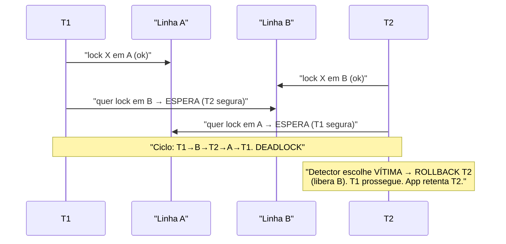
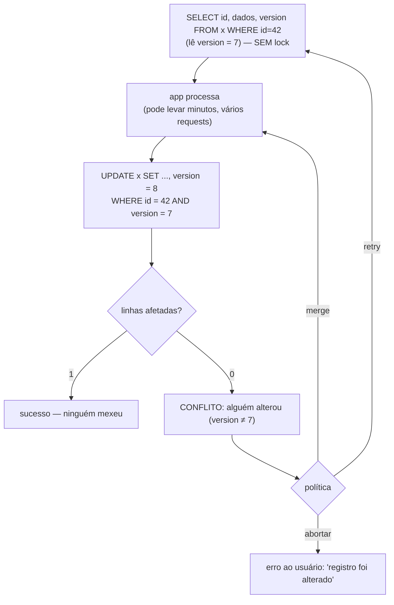

# Locking: Pessimista vs Otimista, Granularidade (Row-level vs Table-level) e Deadlocks

> **Bloco:** Banco de dados · **Nível:** Intermediário/Avançado · **Tempo de leitura:** ~26 min

## TL;DR

Quando duas transações disputam o mesmo dado, o banco precisa de uma estratégia para impedir corrupção (lost update, principalmente). Há duas filosofias opostas. O **locking pessimista** assume que o conflito é **provável** e **bloqueia o dado antes de usá-lo** (`SELECT ... FOR UPDATE`): quem chegar depois espera (ou recebe erro). Garante exclusividade, mas serializa o acesso, reduz concorrência e abre a porta para **deadlocks** e esperas longas. O **locking otimista** assume que o conflito é **raro** e **não bloqueia nada**: deixa todos trabalharem livremente e, na hora de gravar, **verifica se o dado mudou desde que foi lido** (via uma coluna `version` ou timestamp); se mudou, a escrita falha e o cliente decide (retry, merge, erro). Não há lock mantido, então a concorrência é alta — mas sob contenção real, os retries se acumulam. A escolha depende da **probabilidade de conflito** e do **custo de refazer o trabalho**. Ortogonal a isso está a **granularidade do lock** — row-level (uma linha), table-level (a tabela inteira), além de page/gap locks — que negocia overhead de gerenciamento contra concorrência. E o fenômeno que assombra o locking pessimista é o **deadlock**: duas transações esperando uma pela outra em ordem circular, que o banco resolve **detectando o ciclo e abortando uma vítima**.

## O problema que resolve

O padrão mais perigoso da concorrência é **leitura-modificação-escrita** (read-modify-write): uma transação lê um valor, decide algo com base nele e grava de volta. Se duas transações fazem isso ao mesmo tempo sobre o mesmo dado, uma sobrescreve a outra — o **lost update** detalhado em `01-niveis-de-isolamento-e-anomalias.md`. O exemplo canônico: dois pedidos baixando o último item de estoque, ambos leem `quantidade = 1`, ambos gravam `0`, e duas unidades são vendidas de uma que existia.

Subir o nível de isolamento (Serializable) resolve, mas é um instrumento global e caro. Frequentemente o que se quer é **proteger uma operação específica** sem pagar o preço de Serializable em toda a transação. É aí que entram as estratégias de **locking explícito**, e a decisão central é *quando pagar o custo da exclusividade*:

- **Pagar adiantado (pessimista):** bloqueio o dado *antes* de usá-lo. Ninguém mais mexe enquanto seguro o lock. Custo: serialização, espera, risco de deadlock. Benefício: nunca refaço trabalho — quando consigo o lock, sei que vou conseguir gravar.
- **Pagar no final, só se necessário (otimista):** não bloqueio nada; trabalho livremente e, no commit, *verifico* se alguém mexeu. Custo: posso ter feito trabalho em vão e ter que refazer (retry). Benefício: nenhuma espera no caminho feliz, concorrência máxima quando conflitos são raros.

A pergunta de engenharia: **"qual é a probabilidade de dois clientes disputarem este dado, e quanto custa refazer o trabalho se houver conflito?"** Conflito raro + trabalho barato de refazer → otimista. Conflito frequente + trabalho caro de refazer (ou efeitos colaterais externos) → pessimista. Essa é a decisão arquitetural que organiza todo o assunto.

## O que é (definição aprofundada)

### Locking pessimista

O **locking pessimista** adquire um lock sobre o dado **no momento da leitura** e o mantém até o fim da transação (commit/rollback), impedindo que outras transações o modifiquem (e, dependendo do tipo de lock, até que o leiam). A premissa é "vou colidir, então protejo antes".

No SQL, materializa-se com **locking reads**:

- **`SELECT ... FOR UPDATE`:** adquire um lock **exclusivo** nas linhas lidas — outras transações não podem atualizá-las, deletá-las, nem fazer `FOR UPDATE`/`FOR SHARE` sobre elas; ficam **bloqueadas esperando** (ou recebem erro com `NOWAIT`/`SKIP LOCKED`). É o lock para "vou modificar isto".
- **`SELECT ... FOR SHARE`** (MySQL) / **`FOR SHARE`** (PostgreSQL): lock **compartilhado** — outros podem ler, mas ninguém pode modificar. É o lock para "preciso que isto não mude enquanto leio, mas outros leitores são OK".

Tipos de lock subjacentes:

- **Shared lock (S, leitura):** vários podem segurar simultaneamente; bloqueia escritores.
- **Exclusive lock (X, escrita):** apenas um pode segurar; bloqueia todos os outros (leitores e escritores que pedem lock).

O modelo formal por trás é o **Two-Phase Locking (2PL)**: a transação adquire locks numa fase de "crescimento" e os libera numa fase de "encolhimento" (na prática, todos no commit — *strict 2PL*). 2PL garante serializabilidade, ao custo de contenção.

### Locking otimista

O **locking otimista** (também *optimistic concurrency control*, OCC) **não adquire lock algum** durante a leitura e o processamento. Em vez disso, anexa um **token de versão** ao dado — tipicamente uma coluna `version` (inteiro incrementado) ou `updated_at` (timestamp). O fluxo:

1. **Leio** a linha junto com sua versão atual (ex.: `version = 7`).
2. **Trabalho** com o dado (na aplicação, possivelmente por segundos ou minutos — sem segurar nada).
3. **Gravo** com uma condição: `UPDATE ... SET ..., version = 8 WHERE id = ? AND version = 7`.
4. Verifico **linhas afetadas**: se for **1**, ninguém mexeu, sucesso. Se for **0**, alguém alterou a linha (a versão já não é 7) — **conflito detectado**; aborto e decido (retry, merge, mensagem ao usuário).

A premissa é "provavelmente não vou colidir, então não pago o custo do lock; só verifico no fim". É exatamente o padrão **Compare-And-Swap (CAS)** aplicado a banco: comparo o valor esperado, troco atomicamente, falho se mudou. Martin Fowler o catalogou como **Optimistic Offline Lock** em *Patterns of Enterprise Application Architecture*. ORMs como Hibernate/JPA implementam-no nativamente com a anotação `@Version`.

O ganho decisivo: **funciona mesmo em "transações de negócio" longas que atravessam várias requisições HTTP** (ex.: um usuário abre um formulário de edição, vai almoçar e salva 40 min depois) — algo que o lock pessimista não consegue, pois não dá para segurar um lock de banco por 40 minutos.

### Granularidade do lock

Independente de pessimista/otimista, o lock incide sobre um **escopo**, e quanto menor o escopo, maior a concorrência (mas maior o overhead de gerenciar muitos locks):

- **Row-level lock (linha):** bloqueia apenas as linhas afetadas. Máxima concorrência (transações em linhas diferentes não se atrapalham). É o default do InnoDB e do PostgreSQL para DML. Custo: o banco gerencia muitos locks.
- **Page-level lock (página):** bloqueia uma página de disco (várias linhas). Meio-termo; usado por alguns bancos.
- **Table-level lock (tabela):** bloqueia a tabela inteira. Mínima concorrência (uma escrita trava todos), mínimo overhead. Usado para DDL (`ALTER TABLE`), alguns bulk operations, ou `LOCK TABLE` explícito.
- **Gap lock / next-key lock (InnoDB):** bloqueia o **intervalo entre índices** (não só linhas existentes), para impedir inserções que criariam **phantoms**. É como o InnoDB previne phantoms em Repeatable Read. Também é fonte frequente de deadlocks surpreendentes.

Bancos modernos fazem **lock escalation/de-escalation** e escolhem a granularidade automaticamente, mas o engenheiro precisa entender que um `UPDATE` sem índice adequado pode escalar para varredura com locks amplos, derrubando a concorrência.

### Deadlocks

Um **deadlock** ocorre quando duas (ou mais) transações formam um **ciclo de espera**: T1 segura o lock de A e quer B; T2 segura o lock de B e quer A. Nenhuma cede, nenhuma progride — esperariam para sempre. Os bancos relacionais resolvem com **detecção de deadlock**: mantêm um *wait-for graph* (grafo de "quem espera por quem"); ao detectar um ciclo, **escolhem uma vítima** (geralmente a transação que desfez menos trabalho) e a **abortam** com erro (ex.: `ERROR 1213` no MySQL, `40P01` no PostgreSQL), liberando seus locks. A aplicação **deve tratar esse erro e retentar** a transação.

Deadlocks são fenômeno do **locking pessimista** — o otimista não os causa (não há locks mantidos para formar ciclo), embora possa sofrer *livelock* (retries repetidos que nunca progridem sob contenção extrema).

## Como funciona

A tabela central do tema, contrastando as duas filosofias:

| Aspecto | Locking pessimista | Locking otimista |
|---|---|---|
| **Premissa** | Conflito é provável | Conflito é raro |
| **Quando age** | Bloqueia *antes* de usar o dado | Verifica *no momento de gravar* |
| **Mecanismo** | `SELECT ... FOR UPDATE`, locks S/X, 2PL | Coluna `version`/timestamp + `WHERE version = ?` (CAS) |
| **Concorrência** | Baixa (serializa o acesso ao dado) | Alta (ninguém espera no caminho feliz) |
| **Custo no conflito** | Espera (outros bloqueados) | Retry (refaz o trabalho) |
| **Risco característico** | **Deadlock**, esperas longas, lock leak | **Retry storm** / livelock sob alta contenção |
| **Transações longas / multi-request** | Inviável (não segure lock por minutos) | **Funciona** (versão sobrevive entre requests) |
| **Efeitos colaterais externos** | Seguro (exclusividade garantida) | Cuidado (pode ter agido e depois abortar) |
| **Implementação típica** | Banco / SQL explícito | ORM (`@Version`), app-level, REST (ETag/If-Match) |

A tabela de granularidade:

| Granularidade | Concorrência | Overhead de locks | Uso típico |
|---|---|---|---|
| **Row-level** | Alta | Alto (muitos locks) | DML normal (default InnoDB/PostgreSQL) |
| **Page-level** | Média | Médio | Alguns SGBDs, compromisso |
| **Table-level** | Baixa | Baixo | DDL, bulk, `LOCK TABLE` explícito |
| **Gap/next-key** | Variável | Médio | Prevenção de phantom (InnoDB RR) |

### Como evitar e tratar deadlocks (recomendações dos manuais)

A documentação do InnoDB é explícita sobre redução de deadlocks:

- **Ordem consistente de aquisição.** Se todas as transações sempre travam recursos na **mesma ordem** (ex.: sempre a conta de menor id antes da de maior id numa transferência), não há ciclo possível. Esta é a defesa mais eficaz.
- **Transações curtas e pequenas.** Quanto menos tempo segurando locks e menos linhas tocadas, menor a janela de colisão.
- **Índices adequados.** Um `UPDATE`/`DELETE` sem índice varre e trava mais linhas/gaps do que o necessário, multiplicando a chance de deadlock. Bons índices reduzem o escopo do lock.
- **Isolamento mais baixo quando possível.** O InnoDB recomenda usar Read Committed (em vez de Repeatable Read) com locking reads, pois reduz gap locks e, com eles, deadlocks.
- **Sempre tratar o erro e retentar.** Deadlock é esperado sob concorrência; a aplicação deve capturar o código de erro e **refazer a transação inteira** (com backoff/jitter para não recolidir — ver padrões de resiliência).

## Diagrama de fluxo

O primeiro diagrama mostra o ciclo de espera de um deadlock clássico. O segundo, o fluxo do locking otimista (CAS via coluna de versão).





## Exemplo prático / caso real

**Cenário 1 — Baixa de estoque na Black Friday (pessimista).** Disputa **alta e frequente** pelo último item; refazer o trabalho repetidamente (otimista) geraria retry storm. Locking pessimista serializa o acesso à linha:

```sql
BEGIN;
-- Bloqueia a linha do produto; concorrentes esperam aqui
SELECT quantidade FROM estoque WHERE produto_id = 42 FOR UPDATE;
-- app: 1 >= 1, pode vender
UPDATE estoque SET quantidade = quantidade - 1 WHERE produto_id = 42;
INSERT INTO pedido_item (...) VALUES (...);
COMMIT;  -- libera o lock; o próximo concorrente prossegue
```

Sob contenção extrema (todos disputando 1 item), considere `SELECT ... FOR UPDATE SKIP LOCKED` para padrões de fila/worker, ou um `UPDATE` atômico condicional sem lock explícito (`SET quantidade = quantidade - 1 WHERE produto_id = 42 AND quantidade >= 1`), que é o mais enxuto para esse caso.

**Cenário 2 — Edição de cadastro de produto pelo seller (otimista).** O vendedor abre o formulário de edição (lê `version = 12`), edita por vários minutos e salva. Conflito é **raro** (só se dois admins editarem o mesmo produto ao mesmo tempo), e segurar lock de banco por minutos é inviável:

```sql
-- Salvamento:
UPDATE produto
   SET nome = 'Notebook X', preco = 3499.00, version = 13
 WHERE id = 77 AND version = 12;
-- se 0 linhas afetadas: outro admin salvou no meio-tempo →
-- "Este produto foi alterado por outra pessoa. Recarregue e tente de novo."
```

Com **Hibernate/JPA**, isso é automático: anotar o campo com `@Version` faz o ORM gerar o `WHERE version = ?` e lançar `OptimisticLockException` no conflito. No mundo REST, o mesmo padrão aparece como **ETag + `If-Match`** (HTTP 412 Precondition Failed no conflito).

**Cenário 3 — Deadlock numa transferência bancária (e a cura).** Duas transferências cruzadas:

```sql
-- T1: transfere de conta A para B    -- T2: transfere de conta B para A
UPDATE conta SET saldo=saldo-100 WHERE id='A';  -- T1 trava A
                                                 -- T2 trava B (saldo-50 id='B')
UPDATE conta SET saldo=saldo+100 WHERE id='B';  -- T1 quer B → espera
                                                 -- T2 quer A → espera → DEADLOCK
```

O banco detecta o ciclo, aborta uma (vítima), a outra completa, e o app **retenta a vítima**. A **cura preventiva**: sempre travar as contas em **ordem canônica** (ex.: ordenar por id) — `id='A'` antes de `id='B'` em *ambas* as transações elimina o ciclo. Esta é a recomendação número um do manual do InnoDB.

## Quando usar / Quando evitar

**Locking pessimista — usar quando:**

- A **probabilidade de conflito é alta** (hotspot disputado por muitos: estoque de item escasso, contador quente).
- Refazer o trabalho é **caro** ou tem **efeitos colaterais externos** (chamou um gateway de pagamento, enviou e-mail) — você não quer descobrir o conflito *depois* de agir.
- A operação é **curta** e cabe numa única transação de banco. **Evite** segurar locks por operações longas ou que esperam I/O externo (você bloqueia outros e arrisca deadlock).

**Locking otimista — usar quando:**

- O **conflito é raro** (a maioria dos casos CRUD de UI).
- A operação é **longa ou multi-request** (formulário web, transação de negócio que atravessa telas) — onde o pessimista é inviável.
- Você quer **máxima concorrência** e pode tolerar retries ocasionais. **Evite** quando a contenção é tão alta que os retries dominam (vira livelock) ou quando refazer o trabalho é proibitivamente caro.

**Granularidade:** prefira **row-level** (default) para DML de alta concorrência. Use table-level conscientemente para DDL e bulk. Atente para que `UPDATE`/`DELETE` sem índice não escalem o escopo do lock.

## Anti-padrões e armadilhas comuns

- **Locking pessimista para transações longas / multi-request.** Segurar `FOR UPDATE` enquanto se espera input do usuário ou I/O externo bloqueia concorrentes por tempo indefinido e convida deadlocks. Para esses casos, otimista (versão) é a resposta.
- **Não tratar o erro de deadlock.** Deadlock é **esperado** sob concorrência, não excepcional. Código que não captura e retenta a vítima falha intermitentemente em produção sob carga.
- **Ordem de aquisição de lock inconsistente.** A causa raiz da maioria dos deadlocks evitáveis. Travar recursos em ordem canônica (por id, por nome) elimina o ciclo. Negligenciar isso é o erro nº 1.
- **Optimistic locking sem retry/merge.** Detectar o conflito (0 linhas afetadas) e simplesmente engolir o erro silenciosamente perde a atualização — pior que o lost update original. Sempre haja uma política explícita: retry, merge ou erro ao usuário.
- **Esquecer de incrementar a versão.** Optimistic locking só funciona se *toda* escrita incrementa `version` e *toda* leitura-modificação-escrita verifica. Um caminho de escrita que ignora a versão fura a proteção.
- **`UPDATE`/`DELETE` sem índice adequado.** Força varredura com locks amplos (muitas linhas/gaps travados), derrubando a concorrência e multiplicando deadlocks. Indexe as colunas do `WHERE`.
- **Confundir locking otimista com "sem controle de concorrência".** Otimista *é* controle de concorrência — só que verificado na escrita. Não usar nem lock nem versão é o que gera lost update.
- **Gap locks surpresa (InnoDB Repeatable Read).** Deadlocks aparecem "do nada" por causa de gap/next-key locks em ranges. Entender o nível de isolamento e, quando apropriado, baixar para Read Committed reduz a superfície.
- **Lock leak / transação que não fecha.** Esquecer commit/rollback (ou uma exceção não tratada) deixa locks pendurados, bloqueando o sistema. Use transações com escopo bem definido (try/finally, gerenciadores de transação).

## Relação com outros conceitos

- **Níveis de isolamento e anomalias:** locking é *como* os níveis altos são implementados (2PL/strict 2PL) e *como* se resolve lost update sem subir o isolamento global. `FOR UPDATE` e versão são as ferramentas táticas. Ver `01-niveis-de-isolamento-e-anomalias.md`.
- **CAS / concorrência (atomicidade de hardware):** o locking otimista *é* o padrão Compare-And-Swap aplicado a uma linha — comparar versão, trocar, falhar se mudou. A mesma ideia do CAS em memória/concorrência de threads. Ver bloco de concorrência.
- **Padrões de resiliência (retry com backoff):** o retry após deadlock/conflito otimista deve usar **backoff exponencial + jitter** para não recolidir em massa. Ver `../04-sistemas-distribuidos/10-padroes-de-resiliencia.md`.
- **Idempotência:** retentar uma transação (após deadlock ou conflito) exige que a operação seja segura de repetir — caso contrário o retry duplica efeitos. Ver bloco de mensageria/resiliência.
- **Optimistic Offline Lock / Pessimistic Offline Lock (Fowler):** os padrões de aplicação para concorrência em transações de negócio longas, base do `@Version` dos ORMs.
- **ACID:** locking é o mecanismo que materializa o **I** (isolamento) do ACID. Ver `../05-dados-e-persistencia/09-acid-vs-base.md`.

## Modelo mental para o arquiteto

Três ideias para carregar:

1. **A escolha é sobre quando pagar o custo do conflito.** Pessimista paga adiantado (espera, exclusividade) supondo que vai colidir; otimista paga no fim, só se colidir (retry). Mapeie pela **probabilidade de conflito** × **custo de refazer**. Hotspot disputado e efeito colateral caro → pessimista; CRUD de UI raro e longo → otimista.
2. **Deadlock é problema do pessimista e é gerenciável.** Não é falha rara e misteriosa: é consequência de ordem de aquisição inconsistente. Trave recursos em ordem canônica, mantenha transações curtas e indexadas, e **sempre trate o erro com retry**. O banco já detecta e aborta a vítima por você.
3. **Granularidade é o terceiro eixo.** Row-level dá concorrência; table-level dá simplicidade ao custo dela. `UPDATE` sem índice transforma row-level em quase-table-level silenciosamente. Saber o escopo real dos seus locks é parte de projetar concorrência.

O fio condutor: o inimigo é o **lost update** (e, mais amplamente, qualquer interleaving que corrompa o read-modify-write). Pessimista o impede com exclusividade prévia; otimista o detecta com verificação posterior. Ambos são corretos — o que muda é o perfil de desempenho. Escolher errado não gera bug (ambos protegem); gera *gargalo* (pessimista onde sobraria otimista) ou *retry storm* (otimista onde faltava pessimista).

## Pontos para fixar (revisão)

- **Pessimista:** bloqueia antes (`SELECT ... FOR UPDATE`), supõe conflito provável; baixa concorrência, risco de **deadlock**.
- **Otimista:** não bloqueia, verifica na escrita (`WHERE version = ?` — um **CAS**), supõe conflito raro; alta concorrência, risco de **retry**.
- Locks **S (shared/leitura)** coexistem; **X (exclusive/escrita)** é único e bloqueia todos.
- **Granularidade:** row-level (alta concorrência, default) → table-level (baixa, DDL/bulk); gap/next-key locks previnem phantoms no InnoDB.
- **Deadlock** = ciclo de espera; o banco detecta (wait-for graph), **aborta uma vítima** (erro 1213/40P01); o app **deve retentar**.
- Cura nº 1 de deadlock: **ordem canônica e consistente** de aquisição de locks. Mais: transações curtas, índices adequados, isolamento mais baixo.
- Otimista é a única opção viável para **transações longas / multi-request** (formulário web); o pessimista não segura lock por minutos.
- ORMs implementam otimista com **`@Version`**; REST com **ETag/If-Match** (HTTP 412).
- **Sempre** tenha política de conflito (retry/merge/erro) e use **backoff + jitter** nos retries.

## Referências

- [MySQL :: 17.7.2.4 Locking Reads (SELECT ... FOR UPDATE / FOR SHARE)](https://dev.mysql.com/doc/refman/8.4/en/innodb-locking-reads.html)
- [MySQL :: 17.7.1 InnoDB Locking (shared/exclusive, gap, next-key)](https://dev.mysql.com/doc/refman/8.4/en/innodb-locking.html)
- [MySQL :: 17.7.5 Deadlocks in InnoDB](https://dev.mysql.com/doc/refman/8.4/en/innodb-deadlocks.html)
- [MySQL :: 17.7.5.3 How to Minimize and Handle Deadlocks](https://dev.mysql.com/doc/refman/9.7/en/innodb-deadlocks-handling.html)
- [PostgreSQL: 13.3. Explicit Locking (documentação oficial)](https://www.postgresql.org/docs/current/explicit-locking.html)
- [Optimistic concurrency control — Wikipedia](https://en.wikipedia.org/wiki/Optimistic_concurrency_control)
- [Optimistic Offline Lock — Martin Fowler (P of EAA)](https://martinfowler.com/eaaCatalog/optimisticOfflineLock.html)
- [Pessimistic Offline Lock — Martin Fowler (P of EAA)](https://martinfowler.com/eaaCatalog/pessimisticOfflineLock.html)
