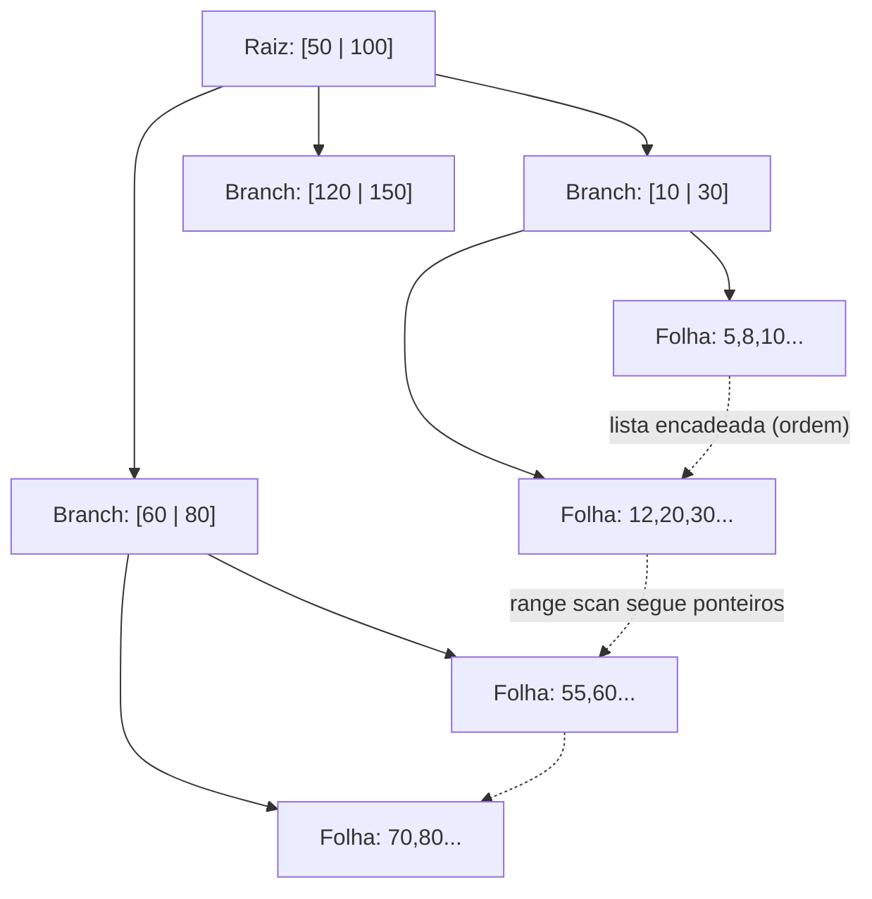
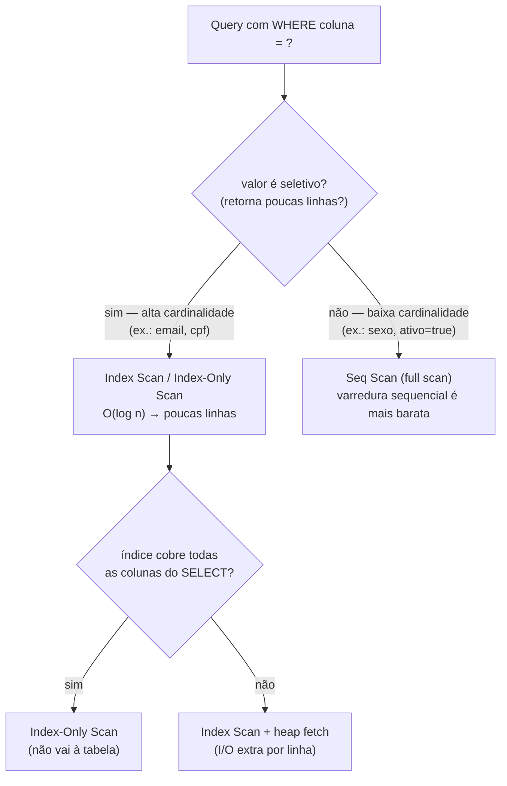

# Índices de Banco: B-Tree, Hash, Composite, Covering — Quando Ajudam, Quando Atrapalham e a Regra do Leftmost Prefix

> **Bloco:** Banco de dados · **Nível:** Intermediário/Avançado · **Tempo de leitura:** ~30 min

## TL;DR

Um **índice** é uma estrutura de dados auxiliar que o banco mantém para encontrar linhas **sem varrer a tabela inteira** — trocando espaço em disco e custo de escrita por velocidade de leitura. O tipo dominante é o **B-Tree** (na prática, **B+Tree**): uma árvore balanceada que mantém os dados **ordenados**, dando busca, range scan e ordenação em tempo logarítmico — ele serve `=`, `<`, `>`, `BETWEEN`, `LIKE 'prefixo%'` e `ORDER BY`. O **Hash index** dá lookup O(1) para igualdade exata, mas **não** serve ranges nem ordenação. Um **índice composto** (multicoluna, ex.: `(status, created_at)`) indexa a concatenação ordenada das colunas e é governado pela **regra do leftmost prefix**: ele só pode ser usado para filtrar a partir das colunas mais à esquerda — `(status, created_at)` serve `WHERE status = ?` e `WHERE status = ? AND created_at > ?`, mas **não** serve um `WHERE created_at > ?` isolado. Por isso a **ordem das colunas importa** e deve ser pensada à luz das queries reais. Um **covering index** inclui todas as colunas que a query precisa (no `WHERE`, `SELECT` e `ORDER BY`), permitindo um **index-only scan** que dispensa ir à tabela. Índices não são grátis: cada um **torna as escritas mais lentas**, ocupa espaço e pode ser ignorado pelo otimizador se mal projetado (baixa cardinalidade, função na coluna, type mismatch). O segredo, na lição de Markus Winand (*Use The Index, Luke!*), é projetar índices **para as queries**, não para as colunas.

## O problema que resolve

Sem índice, encontrar as linhas que satisfazem `WHERE email = 'joao@x.com'` exige um **full table scan**: ler *todas* as linhas da tabela, uma a uma, comparando. Numa tabela de 50 milhões de usuários, isso é dezenas de segundos de I/O para devolver uma linha — inaceitável. O custo é **O(n)**: linear no tamanho da tabela. Conforme a tabela cresce, toda query que filtra fica proporcionalmente mais lenta. Esse é o problema fundamental: **acesso a dados por busca linear não escala**.

Um índice resolve isso mantendo uma **estrutura ordenada e navegável** sobre uma (ou mais) colunas, de modo que localizar uma linha vire **O(log n)** — em vez de ler 50 milhões de linhas, navega-se por ~26 níveis de árvore. A analogia clássica de Winand é o **catálogo telefônico**: as entradas estão ordenadas por sobrenome, então achar "Silva" é instantâneo (você navega pela ordem); mas achar todos os "João" (primeiro nome) num catálogo ordenado por sobrenome é impossível sem ler tudo — exatamente a limitação do leftmost prefix.

A pergunta de engenharia que organiza o tema: **"quais queries este sistema executa com frequência, e qual estrutura de índice torna cada uma delas eficiente sem penalizar as escritas além do aceitável?"** Índice não é decoração de schema; é uma **decisão derivada das queries**. O erro mais comum (e mais caro) é indexar reativamente colunas isoladas em vez de projetar índices a partir dos padrões de acesso reais. Como Winand insiste: o índice é parte do código que serve a query, não um detalhe administrativo da tabela.

## O que é (definição aprofundada)

### B-Tree (B+Tree) — o índice de propósito geral

O B-Tree é a estrutura padrão de praticamente todo índice relacional. Tecnicamente, os bancos usam o **B+Tree**: uma árvore balanceada onde os **dados (chaves) ficam nas folhas**, e os nós internos (raiz e branches) servem apenas para **roteamento**. Duas estruturas combinadas, na descrição de Winand:

1. Uma **lista duplamente encadeada** das folhas, que mantém a **ordem lógica** das chaves (permitindo range scans eficientes: achei o início, sigo o ponteiro).
2. Uma **árvore de busca balanceada** por cima, que permite localizar a folha certa rapidamente (navegando da raiz pelos branches).

Propriedades que decorrem disso:

- **Busca por igualdade** (`= valor`): navega da raiz à folha em O(log n).
- **Range scan** (`>`, `<`, `BETWEEN`): acha o ponto inicial e percorre a lista encadeada das folhas. Eficiente.
- **Prefixo de string** (`LIKE 'abc%'`): é um range scan (`>= 'abc' AND < 'abd'`). **`LIKE '%abc'` não** — o curinga à esquerda quebra a ordenação, força full scan.
- **Ordenação** (`ORDER BY coluna`): o índice já está ordenado; o banco pode entregar as linhas na ordem **sem um sort explícito**.
- **Balanceamento:** a árvore se mantém balanceada em inserções/remoções, garantindo o O(log n) no pior caso. (A estrutura de dados em si é tratada no bloco de estruturas de dados; aqui o foco é o uso em banco.)

### Hash index

Um **hash index** aplica uma função de hash à chave e armazena ponteiros num hash table. Dá lookup de **igualdade em O(1)** — em teoria mais rápido que o B-Tree para `= valor` exato. Mas paga um preço severo: **não preserva ordem**. Consequências:

- **Não serve** range scans (`>`, `<`, `BETWEEN`), nem `ORDER BY`, nem `LIKE 'prefixo%'` — qualquer operação que dependa de ordenação.
- Só serve **igualdade exata** (`=`, `IN`).

Por isso o hash index é nicho: no PostgreSQL existe mas raramente vale a pena sobre um B-Tree (que também faz igualdade bem); no MySQL/InnoDB, índices explícitos são B-Tree, e o hash aparece no **Adaptive Hash Index** interno (automático, sobre o B-Tree). A documentação do MySQL resume: o B-Tree serve `=, >, >=, <, <=, BETWEEN` e `LIKE` com prefixo constante; o hash, só igualdade.

### Índice composto (multicoluna) e a regra do leftmost prefix

Um **índice composto** indexa **várias colunas como uma chave concatenada e ordenada**. Um índice em `(a, b, c)` ordena as entradas primeiro por `a`, depois (dentro de cada `a`) por `b`, depois por `c` — exatamente como um catálogo ordenado por (sobrenome, nome, telefone).

A consequência crítica é a **regra do leftmost prefix** (prefixo mais à esquerda): o índice só pode ser usado eficientemente para condições que começam pela coluna mais à esquerda e seguem sem "buracos". Um índice em `(a, b, c)` serve:

- `WHERE a = ?` ✅ (prefixo `a`)
- `WHERE a = ? AND b = ?` ✅ (prefixo `a, b`)
- `WHERE a = ? AND b = ? AND c = ?` ✅ (índice inteiro)
- `WHERE a = ? AND c = ?` ⚠️ usa só o prefixo `a` para o range; `c` é filtrado depois (não navega por ele)
- `WHERE b = ?` ❌ **não usa o índice** (não começa por `a`)
- `WHERE c = ?` ❌ **não usa o índice**

A regra refinada do PostgreSQL: *equality constraints* nas colunas iniciais, mais a *primeira inequality* na coluna seguinte, delimitam a porção do índice escaneada. Por isso a **ordem das colunas é a decisão de design mais importante** num índice composto, e ela deve refletir as queries: coloque mais à esquerda as colunas usadas em **igualdade** e que aparecem em mais queries; coloque por último as colunas de **range/ordenação**. Winand dedica um capítulo inteiro a "a ordem certa das colunas em índices multicoluna".

### Covering index (índice de cobertura) e index-only scan

Normalmente, o índice leva à linha, e o banco vai à **tabela (heap)** buscar as outras colunas do `SELECT` — um passo extra de I/O por linha (no PostgreSQL chamado *heap fetch*; em geral, *table access by index*). Um **covering index** é aquele que **contém todas as colunas que a query precisa** (filtro + projeção + ordenação), de modo que o banco responde **só com o índice**, sem tocar a tabela — um **index-only scan**. É a otimização mais poderosa para queries quentes de leitura.

Mecanismos:

- Colocar as colunas projetadas como **colunas-chave** do índice composto (se também ajudam no filtro/ordem).
- Usar a cláusula **`INCLUDE`** (PostgreSQL, SQL Server): adiciona colunas às **folhas** do índice apenas para cobertura, **sem** participarem da ordenação/navegação — ideal para colunas que só aparecem no `SELECT`, não no `WHERE`. Ex.: `CREATE INDEX ix ON pedido (cliente_id, status) INCLUDE (valor_total)`.

### Cardinalidade e seletividade — por que alguns índices são inúteis

A **cardinalidade** é o número de valores distintos numa coluna; a **seletividade** é quão bem um valor filtra (fração de linhas que ele seleciona). Um índice só ajuda se for **seletivo**: filtrar `sexo = 'F'` (cardinalidade 2) numa tabela retorna ~50% das linhas — usar o índice e depois buscar metade da tabela linha-a-linha é **mais lento** que um full scan sequencial. Por isso o otimizador **ignora** índices de baixa cardinalidade/seletividade: a varredura sequencial é mais barata. Índices brilham em colunas de **alta cardinalidade** (email, cpf, id) onde o filtro retorna pouquíssimas linhas.

## Como funciona

A tabela de tipos de índice × quando usar:

| Tipo | Suporta | Não suporta | Quando usar |
|---|---|---|---|
| **B-Tree (B+Tree)** | `=`, `<`, `>`, `BETWEEN`, `LIKE 'pre%'`, `ORDER BY`, range | `LIKE '%x'` (curinga à esquerda) | Propósito geral; **default e quase sempre a escolha** |
| **Hash** | `=`, `IN` (igualdade exata) | Ranges, `ORDER BY`, `LIKE` | Nicho: igualdade pura, raramente vence o B-Tree |
| **Composto `(a,b,c)`** | Prefixos à esquerda: `a`, `a,b`, `a,b,c` | Filtro que pula `a` (ex.: só `b` ou só `c`) | Queries que filtram por combinação fixa de colunas |
| **Covering / `INCLUDE`** | Index-only scan (sem ir à tabela) | — (é uma propriedade, não um tipo) | Queries de leitura quentes; evita heap fetch |
| **GIN / GiST / BRIN** (PostgreSQL) | Full-text, arrays, JSONB, geo, dados ordenados fisicamente | Igualdade simples (use B-Tree) | Casos especializados |

A regra do leftmost prefix, visualmente, para um índice `(status, created_at)`:

| Query | Usa o índice? | Como |
|---|---|---|
| `WHERE status = 'PAGO'` | Sim | prefixo `status` |
| `WHERE status = 'PAGO' AND created_at > '2026-01-01'` | Sim (ótimo) | `status` (igualdade) + range em `created_at` |
| `WHERE status = 'PAGO' ORDER BY created_at` | Sim (sem sort extra) | filtra por `status`, folhas já ordenadas por `created_at` |
| `WHERE created_at > '2026-01-01'` | **Não** | não começa por `status` |

Note como `(status, created_at)` é desenhado para a query "pedidos com status X ordenados/filtrados por data" — coloca a coluna de **igualdade** (`status`) à esquerda e a de **range/ordenação** (`created_at`) à direita. Inverter para `(created_at, status)` quebraria o filtro por status isolado e a maioria das queries reais.

### O lado escuro: por que índices atrapalham

Cada índice tem **custo de manutenção em toda escrita**:

- **`INSERT`:** precisa inserir a entrada em *cada* índice da tabela (e rebalancear a árvore). Uma tabela com 8 índices paga 8 atualizações de índice por insert.
- **`UPDATE`:** se a coluna indexada muda, atualiza o índice (remove + insere). No PostgreSQL, por causa do MVCC, um update pode criar nova versão da linha e tocar todos os índices (mitigado por HOT updates quando a coluna indexada não muda).
- **`DELETE`:** remove de cada índice.
- **Espaço:** índices podem ocupar tanto ou mais que a própria tabela.
- **Otimizador confuso:** índices demais aumentam o espaço de planos e o tempo de planejamento; índices redundantes (ex.: `(a)` quando já existe `(a,b)`) são puro custo sem benefício — o prefixo `(a,b)` já cobre `(a)`.

Por isso **over-indexing** (indexar tudo "por garantia") degrada a performance de escrita e desperdiça espaço sem necessariamente acelerar leituras. O equilíbrio é indexar **as queries que importam**, reaproveitando índices compostos (um `(a,b,c)` bem ordenado cobre vários prefixos), e remover índices não usados.

## Diagrama de fluxo

O primeiro diagrama mostra a estrutura de um B+Tree (nós internos roteiam, folhas encadeadas guardam dados ordenados). O segundo, a decisão do otimizador entre index scan e full scan baseada em seletividade.





## Exemplo prático / caso real

**Cenário — painel de pedidos de um e-commerce.** A query mais frequente do back-office lista pedidos por status, mais recentes primeiro:

```sql
SELECT id, cliente_id, valor_total
  FROM pedido
 WHERE status = 'PENDENTE'
 ORDER BY created_at DESC
 LIMIT 50;
```

Numa tabela de 80 milhões de pedidos, sem índice isso é um seq scan + sort: lentíssimo. O índice composto certo:

```sql
-- Igualdade (status) à esquerda; range/ordenação (created_at) à direita
CREATE INDEX ix_pedido_status_data ON pedido (status, created_at DESC);
```

Agora a query navega direto para `status = 'PENDENTE'`, e como as folhas já estão ordenadas por `created_at DESC`, o `ORDER BY` é satisfeito **sem sort** e o `LIMIT 50` lê só 50 folhas. Mas ainda há um heap fetch por linha para buscar `cliente_id` e `valor_total`. Transformando em **covering index**:

```sql
-- INCLUDE adiciona colunas só-projeção às folhas → index-only scan
CREATE INDEX ix_pedido_cover ON pedido (status, created_at DESC)
  INCLUDE (cliente_id, valor_total);
```

Agora o `EXPLAIN` mostra **Index Only Scan** — zero acesso à tabela.

**O leftmost prefix na prática.** Com `ix_pedido_status_data (status, created_at)`:

- `WHERE status = 'PAGO'` → usa o índice ✅
- `WHERE status = 'PAGO' AND created_at >= '2026-05-01'` → usa o índice plenamente ✅
- `WHERE created_at >= '2026-05-01'` (sem status) → **não usa** o índice; precisa de outro índice `(created_at)` ou reordenar. Esta é a pegadinha clássica de entrevista.

**Anti-exemplo de baixa cardinalidade.** Um índice em `pedido(status)` quando 95% dos pedidos têm `status = 'CONCLUIDO'`: a query `WHERE status = 'CONCLUIDO'` retorna 95% da tabela; o otimizador **ignora** o índice (seq scan é mais barato). O índice só ajuda para os valores *raros* (`PENDENTE`, `CANCELADO`) — caso em que um **índice parcial** (`WHERE status <> 'CONCLUIDO'`) é a solução elegante no PostgreSQL.

**Função na coluna mata o índice:**

```sql
-- NÃO usa índice em created_at (a função quebra a ordenação navegável):
WHERE EXTRACT(YEAR FROM created_at) = 2026
-- USA o índice (range sobre a coluna crua):
WHERE created_at >= '2026-01-01' AND created_at < '2027-01-01'
-- alternativa: índice de expressão  CREATE INDEX ... ((EXTRACT(YEAR FROM created_at)))
```

## Quando usar / Quando evitar

**Indexar quando:**

- A coluna aparece em `WHERE`, `JOIN`, `ORDER BY` ou `GROUP BY` de queries **frequentes** e é **seletiva** (alta cardinalidade).
- Há queries quentes de leitura que se beneficiariam de **covering** (index-only scan).
- Foreign keys (frequentemente esquecidas) — joins e checagens de integridade ficam lentos sem índice no lado "muitos".

**Evitar / cuidado:**

- **Baixa cardinalidade** (booleanos, status com poucos valores dominantes): o otimizador ignora; prefira índice parcial para os valores raros, ou nada.
- **Tabelas write-heavy** com leitura rara: cada índice penaliza inserts/updates; indexe só o essencial.
- **Colunas raramente filtradas:** índice que nunca é usado é puro custo (escrita + espaço).
- **Índices redundantes:** se existe `(a, b, c)`, não crie `(a)` nem `(a, b)` — o prefixo já cobre.
- **Tabelas pequenas:** full scan de uma tabela com centenas de linhas é instantâneo; o índice não compensa.

## Anti-padrões e armadilhas comuns

- **Over-indexing ("indexar tudo por garantia").** Cada índice torna escritas mais lentas, ocupa espaço e confunde o otimizador. Indexe as queries que importam; remova índices não usados (PostgreSQL: `pg_stat_user_indexes` mostra os ociosos).
- **Índice em coluna de baixa cardinalidade.** Será ignorado pelo otimizador (seq scan é mais barato). Use índice parcial para valores raros ou repense.
- **Ignorar a ordem das colunas no índice composto.** `(a, b)` ≠ `(b, a)`. A ordem deve seguir as queries (igualdade à esquerda, range/ordenação à direita). Errar a ordem deixa o índice inútil para metade das queries.
- **Esperar que o leftmost prefix funcione "ao contrário".** `(a, b, c)` **não** serve `WHERE b = ?` nem `WHERE c = ?`. Pular a coluna mais à esquerda invalida o uso do índice.
- **Função/transformação na coluna do `WHERE`.** `WHERE UPPER(nome) = ?`, `WHERE col + 0 = ?`, `WHERE data::date = ?` impedem o uso do índice (quebram a ordenação navegável). Reescreva como range sobre a coluna crua, ou crie índice de expressão.
- **Type mismatch / coerção implícita.** Comparar coluna `varchar` com um número, ou tipos diferentes, faz o banco coagir e pode descartar o índice. Garanta tipos compatíveis.
- **`LIKE '%termo%'` (curinga à esquerda).** Não usa B-Tree. Para busca textual/substring, use full-text (GIN/`tsvector`), `pg_trgm`, ou um motor de busca (Elasticsearch).
- **Índices redundantes/sobrepostos.** Manter `(a)` e `(a, b)` ao mesmo tempo: o primeiro é redundante. Desperdício de escrita e espaço.
- **Esquecer índice em foreign key.** Joins e deletes em cascata varrem sem ele; é a omissão silenciosa mais comum.
- **Não medir.** Criar índice sem confirmar via `EXPLAIN` que ele é usado, e sem checar o impacto nas escritas, é chutar no escuro. Ver `04-query-optimization-explain-e-n-mais-1.md`.

## Relação com outros conceitos

- **Query optimization / EXPLAIN:** o índice só ajuda se o **otimizador escolher usá-lo**; o `EXPLAIN` é a ferramenta para confirmar (Index Scan vs Seq Scan vs Index-Only Scan). Projetar índice e ler o plano andam juntos. Ver `04-query-optimization-explain-e-n-mais-1.md`.
- **B-Tree / B+Tree (estrutura de dados):** o índice é a aplicação prática da árvore balanceada; a estrutura, complexidade e balanceamento são tratados no bloco de estruturas de dados. Ver `../12-estruturas-de-dados/`.
- **Hash table (estrutura de dados):** o hash index é a aplicação do hash table; mesma vantagem (O(1) igualdade) e mesma limitação (sem ordem). Ver `../12-estruturas-de-dados/`.
- **Complexidade algorítmica:** índice transforma busca de O(n) em O(log n); a justificativa é a mesma análise assintótica do bloco de complexidade. Ver `../11-complexidade-algoritmica/`.
- **Normalização vs desnormalização:** a desnormalização (duplicar dados para evitar joins) é uma alternativa ao índice/join quando a leitura domina; ambas trocam custo de escrita por leitura. Ver `05-normalizacao-vs-desnormalizacao.md`.
- **Read replicas / sharding:** índices são por nó; em escala, somam-se a particionamento. Ver `../05-dados-e-persistencia/03-read-replicas-sharding-particionamento.md`.

## Modelo mental para o arquiteto

Três ideias para carregar:

1. **Índice é projetado para a query, não para a coluna.** A pergunta nunca é "que colunas devo indexar?", e sim "que queries este sistema executa, e qual índice (composto, na ordem certa, talvez covering) torna cada uma eficiente?". Winand resume: o índice faz parte do código que serve a query.
2. **A regra do leftmost prefix governa índices compostos.** Igualdade à esquerda, range/ordenação à direita; um índice bem ordenado cobre vários prefixos de uma vez (reduzindo o número de índices). Pular a coluna esquerda invalida o índice.
3. **Todo índice é uma dívida de escrita.** Leitura mais rápida custa escrita mais lenta, espaço e complexidade do otimizador. Over-indexing e índices de baixa cardinalidade são as patologias gêmeas. Indexe o que importa, meça com `EXPLAIN`, e remova o que não é usado.

O fio condutor: o índice é uma estrutura **ordenada** que transforma busca linear em logarítmica — daí ele servir naturalmente igualdade, range, prefixo e ordenação (tudo que depende de ordem), e *não* servir o que quebra a ordem (curinga à esquerda, função na coluna, leftmost prefix violado). Entender que "índice = ordem navegável" explica de uma vez todas as suas capacidades e limitações.

## Pontos para fixar (revisão)

- **B-Tree (B+Tree)** é o índice de propósito geral: serve `=`, ranges (`<`, `>`, `BETWEEN`), `LIKE 'pre%'` e `ORDER BY` porque mantém **ordem**. É quase sempre a escolha.
- **Hash index** dá O(1) só para **igualdade exata**; não serve ranges nem ordenação. Nicho.
- **Índice composto** indexa colunas concatenadas e ordenadas; a **ordem das colunas importa** (igualdade à esquerda, range/ordem à direita).
- **Leftmost prefix:** `(a,b,c)` serve `a`, `a,b`, `a,b,c`, mas **não** `b` sozinho nem `c` sozinho.
- **Covering index** (com `INCLUDE`) permite **index-only scan** — responde sem ir à tabela (sem heap fetch).
- Índice só ajuda em colunas **seletivas** (alta cardinalidade); em baixa cardinalidade o otimizador o **ignora** (seq scan é mais barato).
- **Over-indexing** penaliza escritas, espaço e o otimizador; remova índices não usados e redundantes (prefixos já cobertos).
- **Função na coluna**, **curinga à esquerda** (`LIKE '%x'`) e **type mismatch** matam o uso do índice.
- Sempre **indexe foreign keys** e **confirme com `EXPLAIN`** que o índice é usado.

## Referências

- [Anatomy of an SQL Index — Use The Index, Luke! (Markus Winand)](https://use-the-index-luke.com/sql/anatomy)
- [The Balanced Search Tree (B-Tree) — Use The Index, Luke!](https://use-the-index-luke.com/sql/anatomy/the-tree)
- [The Right Column Order in Multi-Column Indexes (concatenated keys / leftmost prefix) — Use The Index, Luke!](https://use-the-index-luke.com/sql/where-clause/the-equals-operator/concatenated-keys)
- [PostgreSQL: 11.3. Multicolumn Indexes (documentação oficial)](https://www.postgresql.org/docs/current/indexes-multicolumn.html)
- [PostgreSQL: 11.2. Index Types (documentação oficial)](https://www.postgresql.org/docs/current/indexes-types.html)
- [PostgreSQL: 11.9. Index-Only Scans and Covering Indexes](https://www.postgresql.org/docs/current/indexes-index-only-scans.html)
- [MySQL :: 10.3.9 Comparison of B-Tree and Hash Indexes](https://dev.mysql.com/doc/refman/8.4/en/index-btree-hash.html)
- [MySQL :: 10.3.1 How MySQL Uses Indexes (leftmost prefix)](https://dev.mysql.com/doc/refman/8.4/en/mysql-indexes.html)
