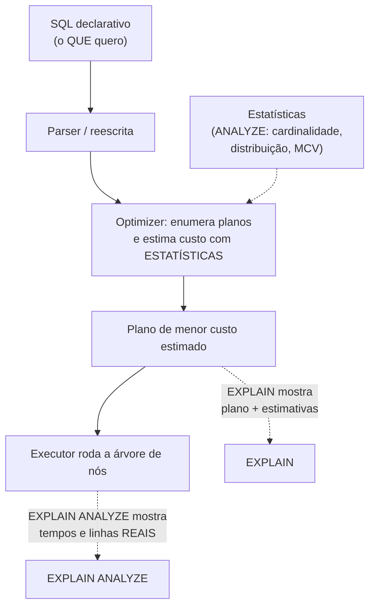
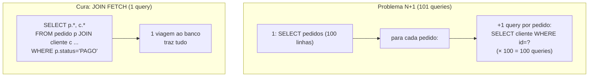

# Query Optimization: EXPLAIN / Plano de Execução e o Problema N+1

> **Bloco:** Banco de dados · **Nível:** Intermediário/Avançado · **Tempo de leitura:** ~28 min

## TL;DR

SQL é uma linguagem **declarativa**: você diz *o que* quer, não *como* obter. Quem decide o "como" é o **query optimizer (otimizador)**, que transforma a query num **plano de execução** — uma árvore de operações físicas (scans, joins, sorts) — escolhendo, com base em **estatísticas** sobre os dados, o plano de menor **custo estimado**. O **EXPLAIN** é a janela para esse plano: mostra como o banco *pretende* executar a query (que índices usa, que tipo de join, quantas linhas estima); o **EXPLAIN ANALYZE** *executa* de fato e mostra os números **reais** (tempo, linhas, loops). Ler o plano é a habilidade central de tuning: identificar o **Seq Scan** que deveria ser **Index Scan**, o **Nested Loop** sobre milhões de linhas, o **Sort** que estoura memória, e a divergência entre linhas estimadas e reais (sintoma de estatísticas desatualizadas). Do lado da aplicação, o anti-padrão mais frequente e custoso é o **problema N+1 query**: o ORM executa **1 query** para buscar uma lista de N entidades e depois **N queries** adicionais (uma por entidade) para carregar suas associações em lazy loading — 1 + N viagens ao banco onde 1 ou 2 bastariam. A cura é buscar tudo de uma vez (`JOIN FETCH`, eager seletivo, batch fetching, ou um `IN` único). Otimização de query é, no fim, **reduzir trabalho**: menos linhas lidas, menos viagens ao banco, índices certos, e medir sempre com o plano real em vez de adivinhar.

## O problema que resolve

Você escreve `SELECT ... FROM pedido p JOIN cliente c ON ... WHERE p.status = 'PAGO'`. Existem **dezenas de maneiras fisicamente diferentes** de o banco produzir esse resultado: varrer `pedido` inteiro e para cada linha buscar o cliente (nested loop)? Construir um hash de `cliente` e sondar (hash join)? Usar um índice em `status`? Ordenar e fazer merge join? Cada estratégia tem custo de I/O e CPU radicalmente diferente dependendo do **tamanho das tabelas, da seletividade dos filtros e da existência de índices**. Escolher errado pode significar a diferença entre 2ms e 2 minutos.

O **otimizador** existe para fazer essa escolha automaticamente. Ele enumera planos candidatos, estima o custo de cada um usando **estatísticas** (cardinalidade das tabelas, distribuição de valores, número de valores distintos) coletadas periodicamente (`ANALYZE`), e escolhe o de menor custo estimado. Quando funciona, o desenvolvedor escreve SQL declarativo e o banco acha o caminho rápido. O problema surge quando:

- As **estatísticas estão desatualizadas** (a tabela cresceu/mudou e o otimizador estima errado).
- **Faltam índices** que tornariam um plano muito melhor possível.
- A query está escrita de forma que **impede** o uso de índices (função na coluna, type mismatch — ver `03-indices`).
- A **aplicação** gera um padrão de acesso patológico (o N+1), independente de qualquer plano individual estar bom.

A pergunta de engenharia: **"o banco está executando esta query da forma mais eficiente possível, e a aplicação está fazendo o número certo de viagens ao banco?"** Responder à primeira parte exige **ler o plano de execução** (EXPLAIN). Responder à segunda exige reconhecer padrões de acesso da aplicação (N+1 à frente). Tuning sem ler o plano é adivinhação; e a query individual mais otimizada do mundo não salva uma aplicação que a executa 5.000 vezes quando deveria executá-la uma vez.

## O que é (definição aprofundada)

### O plano de execução

O plano é uma **árvore de nós**, executada de baixo (folhas) para cima. As folhas são **nós de scan** que leem linhas cruas das tabelas; os nós internos combinam, filtram, ordenam e agregam. Tipos de nó essenciais (terminologia PostgreSQL, análoga em outros bancos):

**Nós de acesso a tabela (scan):**

- **Seq Scan (sequential scan):** lê a tabela inteira, linha a linha. Ótimo quando precisa de muitas linhas (baixa seletividade) ou tabela pequena; péssimo quando precisa de poucas de uma tabela grande (deveria ser índice).
- **Index Scan:** usa um índice para localizar linhas, depois vai à tabela buscar as demais colunas (heap fetch). Bom para filtros seletivos.
- **Index Only Scan:** responde **só com o índice** (covering index), sem tocar a tabela. O ideal para leituras quentes.
- **Bitmap Heap/Index Scan:** meio-termo — usa índice para construir um bitmap de páginas e depois lê a tabela em ordem física. Bom para seletividade intermediária.

**Nós de join:**

- **Nested Loop:** para cada linha da tabela externa, busca correspondências na interna. Ótimo quando a externa tem **poucas** linhas e a interna tem índice; **catastrófico** (O(n×m)) quando ambas são grandes.
- **Hash Join:** constrói um hash da tabela menor e sonda com a maior. Ótimo para joins de igualdade em tabelas grandes sem índice útil.
- **Merge Join:** ordena ambas e funde. Bom quando as entradas já vêm ordenadas (por índice).

**Nós de operação:** Sort, Aggregate, Limit, etc. Um **Sort** que não cabe na memória (`work_mem`) faz spill para disco — gargalo comum.

Cada nó traz **estimativas** entre parênteses: `cost=início..total` (custo abstrato), `rows` (linhas estimadas), `width` (bytes por linha).

### EXPLAIN vs EXPLAIN ANALYZE

- **`EXPLAIN`** mostra o plano **escolhido** e as **estimativas** do otimizador, **sem executar** a query. Rápido e seguro (não roda a query). Útil para ver a estratégia e os números estimados.
- **`EXPLAIN ANALYZE`** **executa** a query de verdade e adiciona os **números reais**: tempo decorrido por nó (ms), `rows` realmente retornadas, número de `loops`. **Cuidado:** como executa, um `EXPLAIN ANALYZE` de um `UPDATE`/`DELETE`/`INSERT` **modifica os dados** (envolva em transação com rollback). Opções úteis: `BUFFERS` (mostra I/O de páginas — quão "cache-friendly" é), `FORMAT JSON` (saída estruturada para ferramentas).

A leitura mais valiosa do `EXPLAIN ANALYZE` é comparar **estimado vs real**: se o otimizador estimou `rows=10` e o real foi `rows=2.000.000`, as estatísticas estão erradas (rode `ANALYZE`) e o plano provavelmente é ruim por causa disso. Essa divergência é a pista número um.

### O papel das estatísticas

O otimizador não "vê" os dados; ele estima com base em **estatísticas** amostradas: número de linhas, valores distintos por coluna, valores mais comuns (MCV), histograma de distribuição, correlação física. Essas estatísticas são atualizadas pelo comando `ANALYZE` (no PostgreSQL, o **autovacuum** o roda automaticamente, mas pode ficar atrás em tabelas muito ativas). Estatísticas defasadas → estimativas erradas → planos ruins. É a causa raiz mais comum de "a query ficou lenta de repente sem mudar nada".

### O problema N+1 query

Este é o anti-padrão de **acesso a dados pela aplicação** mais comum em sistemas com ORM. Surge da combinação de **lazy loading** (carregar associações sob demanda) com **iteração sobre uma coleção**:

1. A aplicação executa **1 query** para buscar N entidades: `SELECT * FROM pedido WHERE status = 'PAGO'` → 100 pedidos.
2. A aplicação itera sobre os 100 pedidos e, para cada um, acessa uma associação lazy (ex.: `pedido.getCliente()` ou `pedido.getItens()`).
3. Cada acesso dispara **uma nova query**: `SELECT * FROM cliente WHERE id = ?` — repetida **100 vezes**, uma por pedido.

Total: **1 + 100 = 101 queries** onde **1 join** (ou 2 queries) resolveria. Cada query é um round-trip de rede ao banco (latência) + parsing + planejamento. Em produção, isso transforma um endpoint de 5ms num de 500ms+, e a contagem cresce com os dados (1 + N) — é uma bomba que só explode quando a coleção fica grande.

O N+1 é insidioso porque **cada query individual é trivial e rápida** (e o `EXPLAIN` de cada uma está ótimo); o problema é a **quantidade** delas. Não aparece num profiler de query única — aparece num **log de queries** (vendo 101 statements quase idênticos) ou numa ferramenta de APM/tracing que conta queries por request. Como nota a documentação do Hibernate/JPA: o padrão default é lazy, e mesmo declarar `EAGER` não resolve sozinho — sem um `JOIN FETCH` explícito, a JPA ainda dispara queries separadas.

## Como funciona

Tabela de nós de plano e o que sinalizam ao ler um EXPLAIN:

| Nó no plano | O que significa | Sinal de alerta quando... |
|---|---|---|
| **Seq Scan** | Varre a tabela inteira | ...sobre tabela grande com filtro seletivo (faltou índice) |
| **Index Scan** | Usa índice + busca na tabela | ...ok; vire Index-Only se possível |
| **Index Only Scan** | Responde só com o índice | (ótimo — objetivo de leitura quente) |
| **Nested Loop** | Loop externo × busca interna | ...ambas as entradas são grandes (O(n×m)) |
| **Hash Join** | Hash da menor + sonda | ...ok para tabelas grandes; cuidado com memória |
| **Sort** | Ordenação explícita | ...spill para disco (estourou work_mem); ou poderia vir ordenado por índice |
| **rows estimado ≠ real** | Estatística vs realidade | ...divergência grande → rodar ANALYZE |

Tabela das curas do N+1:

| Estratégia | Como funciona | Quando usar |
|---|---|---|
| **JOIN FETCH (JPQL/HQL)** | Um único `SELECT` com join carrega entidade + associação | Associação sempre necessária; cardinalidade controlada |
| **Eager fetch seletivo** | Marcar associação para carregar junto (entity graph) | Associação quase sempre usada |
| **Batch fetching (`@BatchSize`)** | Agrupa N lookups em poucos `IN (...)` (ex.: 1 + N/lote) | Coleções grandes; reduz 1+N para 1+(N/tamanho) |
| **Query única com `IN`** | Buscar todos os ids de uma vez: `WHERE cliente_id IN (...)` | Controle manual sem ORM, ou ajuste fino |
| **DTO projection / view** | Buscar só os campos necessários numa query plana | Leitura/relatório que não precisa do grafo de objetos |

### O ciclo de tuning na prática

1. **Identifique a query lenta:** logs de slow query, `pg_stat_statements`, APM. Não otimize às cegas.
2. **Rode `EXPLAIN ANALYZE`:** veja o plano real, tempos por nó, estimado vs real.
3. **Diagnostique o gargalo:** Seq Scan que deveria ser índice? Nested Loop sobre tabelas grandes? Sort em disco? Estatísticas defasadas (estimado ≠ real)?
4. **Aja:** criar/ajustar índice (ver `03-indices`); reescrever a query (remover função na coluna, simplificar); rodar `ANALYZE`; ajustar `work_mem`; ou — se for N+1 — corrigir a estratégia de fetch na aplicação.
5. **Meça de novo:** confirme a melhora com novo `EXPLAIN ANALYZE`. Otimização não medida não conta.

## Diagrama de fluxo

O primeiro diagrama mostra o pipeline declarativo→plano→execução do otimizador. O segundo contrasta o N+1 com a query única (JOIN FETCH).





## Exemplo prático / caso real

**Cenário 1 — lendo um plano ruim e corrigindo.** Painel de pedidos de e-commerce, query lenta:

```sql
EXPLAIN ANALYZE
SELECT * FROM pedido WHERE status = 'PENDENTE' AND created_at > '2026-05-01';
```

Saída (simplificada):

```text
Seq Scan on pedido  (cost=0.00..1850000 rows=12 width=240)
                    (actual time=4200ms..4205ms rows=12 loops=1)
  Filter: (status = 'PENDENTE' AND created_at > '2026-05-01')
  Rows Removed by Filter: 79999988
Planning Time: 0.2ms   Execution Time: 4205ms
```

Diagnóstico: **Seq Scan** removeu ~80 milhões de linhas para devolver 12 — falta índice. A estimativa (`rows=12`) bate com o real, então estatísticas estão ok; o problema é puramente ausência de índice. Cura (ver `03-indices`):

```sql
CREATE INDEX ix_pedido_status_data ON pedido (status, created_at);
-- novo EXPLAIN ANALYZE → Index Scan, actual time ~0.5ms
```

**Cenário 2 — N+1 num ORM (Hibernate/JPA).** Endpoint que lista pedidos com o nome do cliente:

```java
// Código que GERA N+1:
List<Pedido> pedidos = repo.findByStatus("PAGO");      // 1 query (100 pedidos)
for (Pedido p : pedidos) {
    out.add(p.getCliente().getNome());  // LAZY → +1 query POR pedido
}
// Log mostra: 1 + 100 = 101 statements quase idênticos
```

Cura com `JOIN FETCH`:

```java
// 1 única query traz pedido + cliente:
@Query("SELECT p FROM Pedido p JOIN FETCH p.cliente WHERE p.status = :s")
List<Pedido> findByStatusComCliente(@Param("s") String status);
```

Para coleções (ex.: `pedido.getItens()`), `JOIN FETCH` em **múltiplas** coleções gera produto cartesiano — aí prefira **`@BatchSize`** (agrupa os lookups em `IN (...)`, reduzindo 1+N para 1+poucos) ou duas queries separadas. A documentação do Hibernate alerta: `JOIN FETCH` é eficiente mas, abusado, traz dados demais (cartesiano) — use com critério.

**Caso real de regressão por estatística.** Uma query que rodava em 10ms degradou para 8s "sem mudar nada". `EXPLAIN ANALYZE` revelou estimado `rows=5`, real `rows=3.000.000` — após uma carga em massa, as estatísticas ficaram defasadas e o otimizador escolheu Nested Loop achando que a tabela era minúscula. `ANALYZE pedido;` recalculou as estatísticas, o otimizador voltou a escolher Hash Join, e a query voltou a 12ms. Lição: estimado ≠ real é a pista para estatísticas.

## Quando usar / Quando evitar

**EXPLAIN / EXPLAIN ANALYZE — usar quando:**

- Qualquer query lenta identificada (slow log, `pg_stat_statements`, APM): **sempre** comece lendo o plano antes de mudar qualquer coisa.
- Antes de criar um índice (confirmar que ajudaria) e depois (confirmar que é usado).
- Ao diagnosticar regressão de desempenho (estimado vs real).
- **Cuidado:** `EXPLAIN ANALYZE` em DML (`UPDATE`/`INSERT`/`DELETE`) executa de verdade — envolva em transação com `ROLLBACK` se não quiser persistir.

**Curas do N+1 — escolher pela cardinalidade:**

- **`JOIN FETCH`/eager seletivo:** associação `*-para-um` sempre usada (cliente do pedido). Evite múltiplos `JOIN FETCH` de coleções (cartesiano).
- **Batch fetching:** coleções grandes; reduz drasticamente o número de queries sem cartesiano.
- **DTO projection:** quando você não precisa do grafo de objetos completo, só de campos para uma tela/relatório — busca plana e enxuta.
- **Evite eager global ("sempre carregar tudo"):** o oposto do N+1, mas igualmente ruim — carrega grafos enormes desnecessários em toda query.

## Anti-padrões e armadilhas comuns

- **Otimizar sem ler o plano.** Criar índices "no chute", reescrever queries por intuição. Sempre comece pelo `EXPLAIN ANALYZE`; o gargalo raramente é onde você acha.
- **Problema N+1 não detectado.** Cada query é rápida, então passa despercebido em testes com pouco dado e explode em produção. Monitore **contagem de queries por request** (APM, logs, `hibernate.show_sql` em dev).
- **`SELECT *` indiscriminado.** Traz colunas que não usa (mais I/O, impede index-only scan, infla a rede). Selecione só o necessário.
- **Função/transformação na coluna do `WHERE`.** Mata o uso do índice (ver `03-indices`). O `EXPLAIN` mostra o Seq Scan resultante.
- **Estatísticas desatualizadas.** Causa raiz de "ficou lento sem mudar nada". Detecte por estimado ≠ real no `EXPLAIN ANALYZE`; cure com `ANALYZE` (e ajuste autovacuum em tabelas muito ativas).
- **Ignorar Nested Loop sobre tabelas grandes.** Pode ser O(n×m); muitas vezes indica falta de índice na tabela interna ou estatística ruim que enganou o otimizador.
- **Sort em disco.** `Sort Method: external merge Disk` no plano indica que `work_mem` é insuficiente ou que faltou um índice que entregaria a ordem. Ajuste ou indexe.
- **Confundir custo estimado com tempo.** O `cost` do EXPLAIN é uma unidade abstrata para comparar planos, **não** milissegundos. Tempo real só no `EXPLAIN ANALYZE`.
- **Resolver N+1 com eager global.** Carregar tudo sempre cria o problema oposto (grafos enormes). Fetch deve ser **seletivo por caso de uso**.
- **Cartesiano por múltiplos `JOIN FETCH` de coleções.** Dois `JOIN FETCH` de coleções multiplicam linhas (N×M). Use batch fetching ou queries separadas.

## Relação com outros conceitos

- **Índices:** o otimizador só usa um índice se ele existir, for seletivo e a query não o invalidar; ler o `EXPLAIN` é como se confirma. Projeto de índice e leitura de plano são inseparáveis. Ver `03-indices-de-banco-btree-hash-composite-covering.md`.
- **Níveis de isolamento:** o plano de uma query roda dentro de uma transação com um nível de isolamento que afeta a visibilidade (MVCC) e o locking. Ver `01-niveis-de-isolamento-e-anomalias.md`.
- **Normalização vs desnormalização:** desnormalizar reduz joins (e a chance de planos caros/N+1), ao custo de escrita/consistência. Ver `05-normalizacao-vs-desnormalizacao.md`.
- **Complexidade algorítmica:** Nested Loop O(n×m) vs Hash Join O(n+m) é análise assintótica aplicada a planos. Ver `../11-complexidade-algoritmica/`.
- **Observabilidade:** slow query logs, `pg_stat_statements`, tracing de queries por request (APM) são o que torna o N+1 e queries lentas visíveis. Ver `../09-observabilidade/`.
- **Cache patterns:** cachear resultados de queries quentes é alternativa/complemento ao tuning. Ver `../05-dados-e-persistencia/08-cache-patterns.md`.

## Modelo mental para o arquiteto

Três ideias para carregar:

1. **SQL é declarativo; o otimizador decide o como — leia o plano para entendê-lo.** Você não controla diretamente a execução; controla a query, os índices e as estatísticas que o otimizador usa. O `EXPLAIN ANALYZE` é a única verdade — tuning sem ele é adivinhação.
2. **A divergência estimado vs real é a pista mestra.** Se o otimizador estima muito errado, o plano será ruim, e a causa quase sempre é estatística defasada ou query que confunde a estimativa. Comece por aí.
3. **N+1 é problema de quantidade, não de qualidade.** Mil queries perfeitas ainda são mil round-trips. Otimização de banco vive em duas camadas: a query individual (plano/índice) **e** o padrão de acesso da aplicação (quantas queries por request). Ambas precisam estar certas.

O fio condutor: otimização de query é, no fundo, **reduzir trabalho** — menos linhas lidas (índices seletivos, filtros cedo), menos viagens ao banco (matar o N+1), menos ordenação/spill (índices que entregam ordem). E a régua de tudo é a **medição**: o plano real diz onde está o trabalho desperdiçado; sem ele, você está consertando o que não está quebrado.

## Pontos para fixar (revisão)

- SQL é **declarativo**; o **otimizador** escolhe o plano de menor custo estimado usando **estatísticas** (atualizadas por `ANALYZE`).
- **`EXPLAIN`** = plano + estimativas (não executa). **`EXPLAIN ANALYZE`** = executa e mostra tempos/linhas **reais** (cuidado com DML).
- Pista mestra: **estimado ≠ real** → estatísticas defasadas → rode `ANALYZE`.
- Nós-chave: **Seq Scan** (full table — alerta se seletivo), **Index/Index-Only Scan** (bom), **Nested Loop** (ruim se ambas grandes), **Hash/Merge Join**, **Sort** (alerta se vai a disco).
- O `cost` do EXPLAIN é **unidade abstrata**, não milissegundos.
- **N+1 query:** 1 query para N entidades + N queries para associações lazy = 1+N round-trips desnecessários.
- N+1 é invisível por query (cada uma é rápida); detecte por **contagem de queries por request**.
- Curas do N+1: **`JOIN FETCH`** (um-para-um), **batch fetching/`@BatchSize`** (coleções), **`IN` único**, **DTO projection**. Evite eager global e múltiplos `JOIN FETCH` de coleções (cartesiano).
- Ciclo: identificar lenta → `EXPLAIN ANALYZE` → diagnosticar → agir (índice/reescrever/ANALYZE/fetch) → **medir de novo**.

## Referências

- [PostgreSQL: 14.1. Using EXPLAIN (documentação oficial)](https://www.postgresql.org/docs/current/using-explain.html)
- [PostgreSQL: EXPLAIN (referência do comando)](https://www.postgresql.org/docs/current/sql-explain.html)
- [PostgreSQL: 14.2. Statistics Used by the Planner](https://www.postgresql.org/docs/current/planner-stats.html)
- [MySQL :: 10.8.1 Optimizing Queries with EXPLAIN](https://dev.mysql.com/doc/refman/8.4/en/using-explain.html)
- [N+1 query problem with Spring Data JPA and Hibernate — Baeldung](https://www.baeldung.com/spring-hibernate-n1-problem)
- [Use The Index, Luke! — SQL Indexing and Tuning (Markus Winand)](https://use-the-index-luke.com/)
- [Understanding EXPLAIN plans — GitLab Docs](https://docs.gitlab.com/development/database/understanding_explain_plans/)
