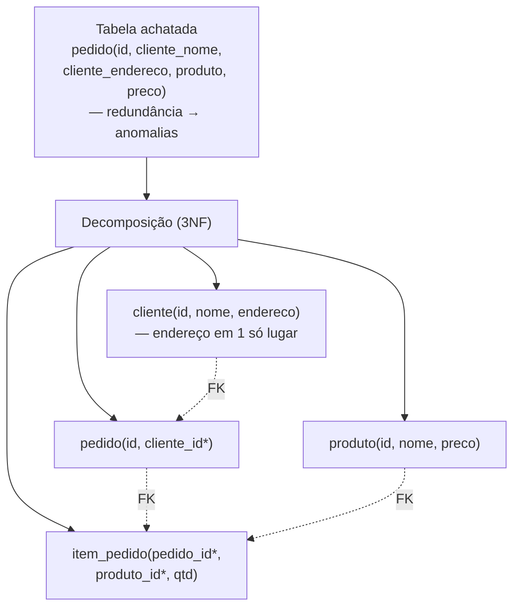
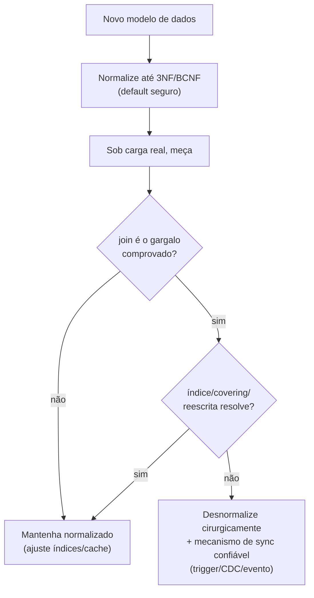

# Normalização (1NF, 2NF, 3NF, BCNF) vs Desnormalização

> **Bloco:** Banco de dados · **Nível:** Intermediário/Avançado · **Tempo de leitura:** ~28 min

## TL;DR

A **normalização** é um processo formal (Edgar Codd, anos 1970) de organizar tabelas relacionais para **eliminar redundância** e as **anomalias de modificação** (inserção, atualização e remoção) que dela decorrem. Avança por **formas normais** progressivamente mais estritas: **1NF** (valores atômicos, sem grupos repetidos), **2NF** (1NF + nenhuma coluna não-chave depende *apenas de parte* de uma chave composta — sem dependência parcial), **3NF** (2NF + nenhuma coluna não-chave depende de outra não-chave — sem dependência transitiva), **BCNF** (refinamento do 3NF: *todo* determinante é chave candidata). A ideia central é **uma única fonte da verdade para cada fato**: cada dado vive em um só lugar, então atualizá-lo é um único `UPDATE` e não há cópias divergentes. O preço é que ler dados relacionados exige **joins**. A **desnormalização** é o movimento inverso e deliberado: **reintroduzir redundância controlada** (duplicar colunas, pré-agregar, manter contadores) para **evitar joins caros** e acelerar leituras quentes — ao custo de ter que manter as cópias sincronizadas (e o risco de divergência). A regra de ouro: **normalize primeiro (é o default seguro e correto); desnormalize depois, com dados de performance na mão, apenas onde a leitura comprovadamente domina e o join é o gargalo.** Desnormalizar cedo demais é otimização prematura que troca corretude garantida por bugs de inconsistência.

## O problema que resolve

Imagine guardar pedidos numa única tabela "achatada", repetindo o nome e o endereço do cliente em **cada linha de pedido**:

| pedido_id | cliente_nome | cliente_endereco | produto | preco |
|---|---|---|---|---|
| 1 | João Silva | Rua A, 100 | Mouse | 50 |
| 2 | João Silva | Rua A, 100 | Teclado | 120 |
| 3 | João Silva | Rua A, 100 | Monitor | 800 |

O nome e endereço de João estão **duplicados** em três linhas. Isso gera as **anomalias de modificação** — o problema que a normalização resolve:

- **Anomalia de atualização:** João muda de endereço. Você precisa atualizar **todas** as linhas dele. Se esquecer uma, há duas "verdades" sobre o endereço de João — qual é a correta? Os dados ficam **inconsistentes**.
- **Anomalia de inserção:** quer cadastrar um cliente novo que ainda não fez pedido? Não consegue — a tabela exige um pedido. Você teria que inventar uma linha-fantasma ou deixar campos nulos.
- **Anomalia de remoção:** o único pedido de um cliente é cancelado e a linha apagada. Você **perde também** o nome e endereço dele — informação que queria manter.

A causa raiz dessas três anomalias é a **redundância**: o mesmo fato (endereço de João) armazenado em vários lugares. A normalização ataca a redundância decompondo a tabela em tabelas menores ligadas por chaves, de modo que **cada fato viva em exatamente um lugar**. A pergunta que organiza o tema: **"este dado tem uma única fonte da verdade, ou está duplicado de forma que pode divergir?"** Se está duplicado sem necessidade, há anomalias à espera.

O contraponto — a desnormalização — resolve um problema *diferente*: depois de normalizar, ler dados relacionados exige reuni-los com **joins**, que custam em tabelas grandes ou queries muito frequentes. A desnormalização troca a garantia de consistência (uma fonte da verdade) por **velocidade de leitura** (dados já reunidos), reintroduzindo redundância de forma *controlada e consciente*. As duas forças — integridade (normalizar) vs performance de leitura (desnormalizar) — são o eixo de toda modelagem relacional.

## O que é (definição aprofundada)

### As formas normais

Cada forma normal é uma condição sobre as **dependências funcionais** (quando o valor de uma coluna determina o de outra) entre colunas. Em ordem crescente de rigor:

**1NF — Primeira Forma Normal.** Cada célula contém um **valor atômico** (indivisível); não há **grupos repetidos** nem listas/arrays numa coluna. Cada linha é única (há chave primária). Exemplo de violação: uma coluna `telefones` contendo `"(11)9999, (11)8888"` — dois valores numa célula. Correção: uma tabela `telefone` separada, uma linha por telefone.

**2NF — Segunda Forma Normal.** Está em 1NF **e** nenhuma coluna não-chave depende **apenas de parte** de uma chave primária composta (eliminação de **dependências parciais**). Só é relevante quando a chave primária é **composta** (múltiplas colunas). Exemplo de violação: tabela `(pedido_id, produto_id, quantidade, nome_produto)` com chave `(pedido_id, produto_id)` — `nome_produto` depende só de `produto_id` (parte da chave), não da chave inteira. Correção: mover `nome_produto` para a tabela `produto`.

**3NF — Terceira Forma Normal.** Está em 2NF **e** nenhuma coluna não-chave depende de **outra coluna não-chave** (eliminação de **dependências transitivas**). Exemplo de violação: tabela `funcionario(id, nome, cep, cidade)` — `cidade` depende de `cep`, que não é chave; `cidade` depende transitivamente da chave através de `cep`. Correção: tabela separada `cep → cidade`. A regra mnemônica clássica: cada coluna não-chave depende "da chave, da chave inteira, e de nada além da chave" (the key, the whole key, and nothing but the key).

**BCNF — Boyce-Codd Normal Form.** Refinamento mais estrito do 3NF (Boyce e Codd, 1974): para **toda** dependência funcional `X → Y`, `X` deve ser uma **chave candidata** (superchave). O 3NF tolera certas anomalias residuais quando há múltiplas chaves candidatas sobrepostas; BCNF as elimina exigindo que *todo determinante* seja chave. Na prática, a maioria das tabelas em 3NF já está em BCNF; a diferença só aparece em esquemas com várias chaves candidatas compostas e sobrepostas. Para a maioria dos sistemas, **3NF é o alvo prático**, com BCNF como rigor adicional quando o caso exige.

(Há formas mais altas — 4NF, 5NF — que tratam dependências multivaloradas e de junção; raramente relevantes na prática de aplicação, citadas para completude.)

### Por que a normalização funciona

A normalização garante, por construção, **uma única fonte da verdade por fato**. O endereço de João vive numa única linha da tabela `cliente`; mudá-lo é um único `UPDATE`; nunca há cópias divergentes. As três anomalias somem porque sua causa (redundância) some. Integridade referencial (chaves estrangeiras) costura as tabelas de volta nas consultas. O custo é estrutural: dados que "andam juntos" agora estão em tabelas diferentes, e reuni-los exige **joins**.

### Desnormalização

A **desnormalização** reintroduz redundância de forma **deliberada e gerenciada**, partindo de um esquema normalizado, para otimizar leituras. Técnicas comuns:

- **Coluna duplicada / pré-junção:** copiar uma coluna de outra tabela para evitar o join (ex.: gravar `cliente_nome` na tabela `pedido` para listar pedidos sem juntar com `cliente`).
- **Pré-agregação / colunas calculadas:** manter `total_pedido`, `contador_de_itens`, `media_avaliacao` materializados em vez de recalcular com `SUM`/`COUNT`/`AVG` a cada leitura.
- **Materialized views:** projeções pré-computadas de queries caras, atualizadas periodicamente ou via trigger/CDC.
- **Tabelas de leitura (read models, CQRS):** uma representação separada e desnormalizada otimizada para consulta, alimentada por eventos do modelo de escrita normalizado.

O **trade-off explícito**: leitura mais rápida (sem join, dado já reunido) ao custo de **escrita mais complexa** (precisa atualizar todas as cópias) e **risco de inconsistência** (se uma cópia não for atualizada, diverge — exatamente a anomalia que a normalização eliminava, agora aceita conscientemente). A diferença entre desnormalização (boa) e modelo mal-normalizado (ruim) é **intencionalidade e controle**: você sabe que duplicou, sabe por quê, e tem um mecanismo confiável (trigger, CDC, evento) que mantém as cópias em sincronia.

## Como funciona

Tabela das formas normais — o que cada uma elimina:

| Forma | Exige | Elimina | Quando relevante |
|---|---|---|---|
| **1NF** | Valores atômicos, sem grupos repetidos | Listas/arrays em célula, linhas duplicadas | Sempre (base) |
| **2NF** | 1NF + sem dependência **parcial** da chave | Coluna que depende de *parte* de chave composta | Só com chave primária **composta** |
| **3NF** | 2NF + sem dependência **transitiva** | Coluna não-chave que depende de outra não-chave | **Alvo prático** da maioria dos esquemas |
| **BCNF** | Todo determinante é chave candidata | Anomalias residuais com chaves candidatas sobrepostas | Esquemas com múltiplas chaves candidatas |

Tabela do trade-off normalizar × desnormalizar:

| Dimensão | Normalizado (3NF/BCNF) | Desnormalizado |
|---|---|---|
| **Redundância** | Mínima (uma fonte da verdade) | Controlada/intencional |
| **Anomalias de modificação** | Eliminadas | Reintroduzidas (precisa sincronizar) |
| **Escrita** | Simples (1 lugar por fato) | Complexa (atualizar todas as cópias) |
| **Leitura** | Exige **joins** | Rápida (dado já reunido) |
| **Consistência** | Garantida por construção | Depende do mecanismo de sync |
| **Espaço** | Menor | Maior (cópias) |
| **Default recomendado** | **Sim — comece aqui** | Só onde a leitura comprovadamente domina |

### O caminho prático

A sequência sã de modelagem:

1. **Normalize até 3NF (ou BCNF) por padrão.** É o modelo correto, com integridade garantida e sem anomalias. Não é otimização prematura — é a base.
2. **Meça.** Coloque o sistema sob carga representativa. Identifique as queries lentas (slow log, `EXPLAIN ANALYZE` — ver `04-query-optimization`). O gargalo é mesmo o join?
3. **Tente otimizar dentro do modelo normalizado primeiro:** índices certos (ver `03-indices`), covering indexes, reescrita de query, cache. Frequentemente isso resolve sem desnormalizar.
4. **Desnormalize cirurgicamente** apenas onde (a) a leitura domina largamente a escrita, (b) o join é comprovadamente o gargalo, e (c) você tem um mecanismo confiável de sincronização. Documente *por que* duplicou.

O ponto-chave: a desnormalização é uma **decisão de último recurso baseada em medição**, não um ponto de partida. Bancos modernos juntam tabelas bem indexadas com extrema eficiência; o "join é lento" é frequentemente "join sem índice é lento".

## Diagrama de fluxo

O primeiro diagrama mostra a decomposição de uma tabela achatada (com anomalias) para 3NF. O segundo, o fluxo de decisão normalizar→medir→desnormalizar.





## Exemplo prático / caso real

**Cenário — e-commerce, do achatado ao normalizado.** Partindo da tabela achatada problemática:

```sql
-- RUIM: redundância → anomalias de update/insert/delete
CREATE TABLE pedido_flat (
  pedido_id INT, cliente_nome TEXT, cliente_endereco TEXT,
  produto_nome TEXT, produto_preco NUMERIC, quantidade INT
);
-- endereço do cliente repetido em toda linha de pedido
```

Normalizando até 3NF:

```sql
CREATE TABLE cliente (
  id INT PRIMARY KEY, nome TEXT, endereco TEXT     -- endereço em 1 lugar
);
CREATE TABLE produto (
  id INT PRIMARY KEY, nome TEXT, preco NUMERIC      -- preço em 1 lugar
);
CREATE TABLE pedido (
  id INT PRIMARY KEY, cliente_id INT REFERENCES cliente(id), criado_em TIMESTAMPTZ
);
CREATE TABLE item_pedido (
  pedido_id INT REFERENCES pedido(id),
  produto_id INT REFERENCES produto(id),
  quantidade INT,
  PRIMARY KEY (pedido_id, produto_id)
);
-- Mudar endereço do cliente: UPDATE cliente ... → 1 linha. Sem anomalia.
```

Note uma sutileza: o **preço do produto no momento da compra** *deve* ser copiado para `item_pedido` (ex.: `preco_unitario`). Isso parece desnormalização, mas **não é** — é capturar um **fato histórico**: o preço pago na época, que é semanticamente diferente do preço atual do produto (que pode mudar). Distinguir "redundância acidental" (anomalia) de "snapshot histórico intencional" (correto) é discernimento de modelagem sênior.

**Desnormalização justificada — contador de avaliações.** A tela de produto mostra "4,7 estrelas (1.832 avaliações)". Calcular `AVG(nota)` e `COUNT(*)` sobre milhões de avaliações **a cada exibição** da página (que é altíssima leitura) é caro. Desnormalização cirúrgica:

```sql
ALTER TABLE produto ADD COLUMN media_avaliacao NUMERIC, ADD COLUMN qtd_avaliacoes INT;
-- mantidos por trigger ou por evento ao inserir/atualizar avaliação:
-- toda nova avaliação atualiza os contadores no produto.
-- Leitura da página: 0 agregação, lê 2 colunas prontas.
```

Aqui a leitura domina massivamente, o cálculo é o gargalo, e há um mecanismo de sync (trigger/evento). A redundância é intencional e mantida — desnormalização legítima.

**Desnormalização para escala (NoSQL/wide-column).** Num feed de timeline (Cassandra), modela-se **por query**: duplica-se a postagem em cada timeline de seguidor (fan-out na escrita), aceitando enorme redundância para que ler a timeline seja um único acesso por chave, sem join (que nem existe nesse modelo). É desnormalização levada ao extremo, justificada por leitura massiva e escala horizontal — conecta com `06-sql-vs-nosql.md` e persistência poliglota.

## Quando usar / Quando evitar

**Normalizar (até 3NF/BCNF) — usar quando:**

- **Por padrão, sempre.** É o modelo correto para dados transacionais (OLTP): pedidos, contas, cadastros. Integridade garantida, anomalias eliminadas.
- A escrita é frequente e a consistência é crítica (uma fonte da verdade evita divergência).
- **Evite/relaxe** apenas quando medição comprovar que o join normalizado é o gargalo e as alternativas (índice, cache) não bastam.

**Desnormalizar — usar quando:**

- A **leitura domina massivamente** a escrita (read-heavy) e o **join/agregação é o gargalo comprovado** por medição.
- Há **pré-agregações caras** repetidas (contadores, médias, somas) que valem ser materializadas.
- Você tem um **mecanismo confiável de sincronização** (trigger, CDC, evento, materialized view) para manter as cópias coerentes.
- Em modelos NoSQL/colunar onde a modelagem é **orientada à query** e joins são inviáveis (Cassandra, DynamoDB).

**Evitar desnormalizar quando:**

- **Cedo demais**, sem dados de performance — otimização prematura que troca corretude por bugs.
- A escrita é frequente (cada escrita vira N escritas + risco de divergência).
- Não há mecanismo de sync — você está apenas criando anomalias de atualização disfarçadas.

## Anti-padrões e armadilhas comuns

- **Desnormalizar cedo demais (otimização prematura).** O erro mais comum. Trocar a corretude garantida do modelo normalizado por velocidade que você nem mediu precisar. Normalize primeiro; desnormalize com dados na mão.
- **Confundir "join é lento" com "join sem índice é lento".** Frequentemente o problema não é o join, é a falta de índice na FK. Tente índices/covering antes de desnormalizar. Ver `03-indices`.
- **Desnormalizar sem mecanismo de sync.** Duplicar uma coluna e atualizá-la manualmente "quando lembrar" recria exatamente a anomalia de atualização. Sem trigger/CDC/evento confiável, a redundância vira inconsistência.
- **Sub-normalizar por preguiça (não é desnormalização).** Deixar uma tabela achatada porque "dava trabalho normalizar" não é uma decisão de performance — é dívida técnica que causará anomalias. Desnormalização é *intencional e medida*; sub-normalização é descuido.
- **Confundir snapshot histórico com redundância.** Copiar o preço pago no momento da compra para `item_pedido` é capturar um fato histórico (correto), não desnormalizar. Distinga "valor na época" de "valor atual".
- **Normalizar ao extremo sem necessidade (over-normalization).** Decompor em dezenas de tabelas minúsculas pode tornar queries comuns um festival de joins sem benefício de integridade real. 3NF é o alvo prático; 4NF/5NF raramente compensam.
- **Esquecer índices nas foreign keys.** Joins em modelo normalizado dependem de índices nas FKs; sem eles, o join *realmente* fica lento — e aí culpa-se a normalização injustamente.
- **Achar que NoSQL "dispensa" o pensamento de normalização.** Em NoSQL você desnormaliza por design (modelagem por query), mas precisa entender *o que* está duplicando e como manter coerente — o raciocínio de fonte da verdade continua valendo.

## Relação com outros conceitos

- **Índices:** o "custo do join" do modelo normalizado é largamente mitigado por índices nas FKs e covering indexes; antes de desnormalizar, indexe. Ver `03-indices-de-banco-btree-hash-composite-covering.md`.
- **Query optimization / EXPLAIN:** a decisão de desnormalizar deve ser guiada por medição do plano (o join é o gargalo real?). Ver `04-query-optimization-explain-e-n-mais-1.md`.
- **SQL vs NoSQL:** NoSQL (documento, colunar) adota desnormalização/modelagem por query como padrão; SQL normaliza por padrão. A escolha de store influencia o grau de normalização. Ver `06-sql-vs-nosql.md`.
- **CQRS / Materialized Views:** read models desnormalizados alimentados por eventos do modelo de escrita normalizado são a forma arquitetural de desnormalizar com sync confiável. Ver `../05-dados-e-persistencia/04-materialized-views-e-projecoes.md`.
- **CDC (Change Data Capture):** o mecanismo de baixo acoplamento para manter cópias desnormalizadas/projeções em sincronia. Ver `../05-dados-e-persistencia/05-cdc-change-data-capture-debezium.md`.
- **Polyglot Persistence:** stores especializados (busca, colunar) são frequentemente projeções desnormalizadas de uma verdade relacional normalizada. Ver `../05-dados-e-persistencia/01-polyglot-persistence.md`.

## Modelo mental para o arquiteto

Três ideias para carregar:

1. **Normalização é sobre uma fonte da verdade por fato.** As três anomalias (insert/update/delete) têm uma causa única — redundância — e uma cura única — cada fato em um só lugar. 1NF→2NF→3NF→BCNF é a escada que progressivamente remove tipos de dependência que geram redundância.
2. **Normalize primeiro; desnormalize por medição.** O modelo normalizado é o default correto, não otimização prematura. A desnormalização é uma troca consciente (consistência por velocidade de leitura) que só se justifica com dados de performance e um mecanismo de sincronização confiável. Cedo demais é o anti-padrão clássico.
3. **Redundância controlada ≠ redundância acidental.** A diferença entre desnormalização (boa) e modelo mal-feito (ruim) é intencionalidade, justificativa medida e sincronização garantida. Sem isso, "desnormalizar" é só recriar as anomalias que a normalização eliminava.

O fio condutor: há duas forças em tensão — **integridade** (normalizar: uma verdade, sem anomalias, joins na leitura) e **performance de leitura** (desnormalizar: dado reunido, sem join, cópias para sincronizar). A engenharia madura começa pela integridade (segura por construção) e só cede performance onde a medição prova necessidade e há como manter a coerência. O preço da desnormalização nunca some — ele se transfere da leitura para a escrita e para o risco de divergência.

## Pontos para fixar (revisão)

- Normalização elimina **redundância** e, com ela, as **anomalias** de inserção, atualização e remoção.
- **1NF:** valores atômicos, sem grupos repetidos. **2NF:** 1NF + sem dependência **parcial** de chave composta. **3NF:** 2NF + sem dependência **transitiva** (não-chave → não-chave). **BCNF:** todo determinante é chave candidata.
- Mnemônico do 3NF: cada coluna não-chave depende "da chave, da chave inteira e de nada além da chave".
- **3NF é o alvo prático**; BCNF é rigor extra para esquemas com chaves candidatas sobrepostas; 4NF/5NF raramente importam.
- Modelo normalizado = **uma fonte da verdade por fato**; lê com **joins**.
- **Desnormalização** = reintroduzir redundância controlada para evitar joins/agregações caras; troca consistência por velocidade de leitura.
- Regra de ouro: **normalize primeiro (default); desnormalize por medição**, só onde leitura domina, o join é o gargalo e há mecanismo de sync (trigger/CDC/evento).
- Desnormalizar **cedo demais** é otimização prematura; desnormalizar **sem sync** recria as anomalias.
- **Snapshot histórico** (preço pago na compra) não é desnormalização — é capturar um fato no tempo.
- "Join lento" frequentemente é "join sem índice na FK"; **indexe antes de desnormalizar**.

## Referências

- [Database normalization — Wikipedia](https://en.wikipedia.org/wiki/Database_normalization)
- [Third normal form — Wikipedia](https://en.wikipedia.org/wiki/Third_normal_form)
- [Boyce–Codd normal form — Wikipedia](https://en.wikipedia.org/wiki/Boyce%E2%80%93Codd_normal_form)
- [Database Normalization: 1NF, 2NF, 3NF & BCNF Examples — DigitalOcean](https://www.digitalocean.com/community/tutorials/database-normalization)
- [Database normalization description — Microsoft Learn](https://learn.microsoft.com/en-us/troubleshoot/microsoft-365-apps/access/database-normalization-description)
- [Denormalization — Wikipedia](https://en.wikipedia.org/wiki/Denormalization)
- [Designing Data-Intensive Applications — Martin Kleppmann (site oficial)](https://dataintensive.net/)
