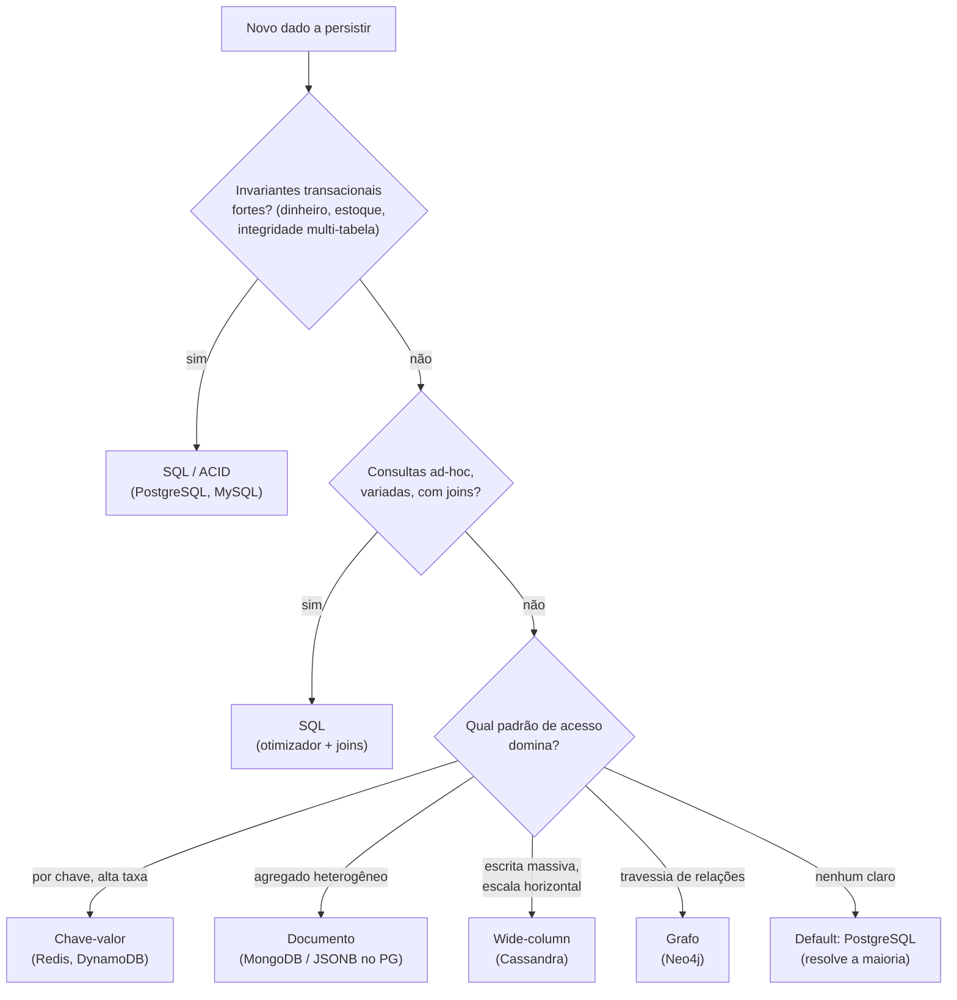

# SQL vs NoSQL: Quando Escolher Cada Um

> **Bloco:** Banco de dados · **Nível:** Intermediário/Avançado · **Tempo de leitura:** ~24 min

## TL;DR

**SQL** (bancos relacionais: PostgreSQL, MySQL, Oracle) organiza dados em **tabelas com schema rígido** definido a priori, oferece **joins** e **transações ACID** fortes, e escala primariamente na **vertical** (máquina maior). **NoSQL** é um guarda-chuva de famílias **não-relacionais** — **documento** (MongoDB), **chave-valor** (Redis, DynamoDB), **wide-column/colunar** (Cassandra) e **grafo** (Neo4j) — que trocam parte das garantias relacionais por **schema flexível**, **escala horizontal** (sharding nativo) e **modelagem orientada à query** (dados que são lidos juntos ficam juntos, sem join). A escolha **não é "qual é melhor"** — é **"qual modelo serve melhor este dado e este padrão de acesso"**, e raramente é exclusiva: sistemas reais usam vários stores (persistência poliglota). Para entrevista, o critério de decisão se resume a poucos eixos: **estrutura e estabilidade do schema** (estável e relacional → SQL; heterogêneo e evolutivo → documento), **necessidade de joins e queries ad-hoc** (sim → SQL), **força de consistência transacional** (invariantes críticas, multi-linha → ACID/SQL), **escala e padrão de escrita** (volume massivo, escrita distribuída, escala horizontal → NoSQL), e **padrão de acesso conhecido vs ad-hoc** (acesso por chave previsível → NoSQL; consultas variadas e imprevistas → SQL). O default pragmático: **comece com um relacional bem usado** (PostgreSQL resolve a maioria dos casos, incluindo JSONB, full-text e até vetores) e adote NoSQL onde uma característica específica (escala horizontal, schema flexível, acesso por chave, grafo) justificar o custo operacional.

## O problema que resolve

Por décadas, "banco de dados" era sinônimo de "relacional". O modelo relacional é uma maravilha de engenharia: schema declarado, integridade referencial, transações ACID, e uma linguagem (SQL) que permite consultas **ad-hoc** arbitrárias com joins — você modela os dados normalizados e o banco responde a perguntas que você nem antecipou. Isso é ideal quando os dados têm **estrutura estável e relacionamentos claros**, e quando você precisa de **consistência forte** e **flexibilidade de consulta**.

O modelo começou a ranger sob três pressões da era web/cloud:

- **Escala horizontal:** quando o volume excede o que uma máquina aguenta, o relacional escala mal horizontalmente — joins e transações ACID cross-node exigem coordenação cara (ver CAP/ACID vs BASE). Sharding relacional é possível mas trabalhoso.
- **Schema rígido vs dados heterogêneos/evolutivos:** um catálogo onde cada categoria de produto tem atributos diferentes, ou um sistema cujo modelo muda toda semana, sofre com `ALTER TABLE` e nulos esparsos.
- **Padrões de acesso específicos:** acesso por chave de altíssima taxa (sessões, cache), travessias de grafo (rede social, fraude), séries temporais massivas — casos em que um store especializado é ordens de magnitude melhor que tabelas genéricas.

O movimento **NoSQL** surgiu para atacar essas pressões, cada família otimizada para um padrão. Mas a narrativa de "NoSQL vai substituir SQL" envelheceu mal: relacionais incorporaram JSON, full-text e extensões; NoSQL amadureceu garantias; e surgiu o **NewSQL** (Spanner, CockroachDB) tentando ACID em escala horizontal. A questão real, para o arquiteto, **nunca foi tribal** — é de **adequação**: a pergunta que organiza tudo é *"este dado, com este padrão de acesso, é melhor servido por qual modelo, ao custo de quais trade-offs?"*. É a mesma pergunta da **persistência poliglota** (ver `../05-dados-e-persistencia/01-polyglot-persistence.md`), aplicada à decisão SQL vs NoSQL.

## O que é (definição aprofundada)

### SQL (relacional)

- **Modelo:** tabelas (relações) com colunas tipadas e linhas; relacionamentos via chaves estrangeiras.
- **Schema:** **rígido e declarado a priori** (schema-on-write) — a estrutura é validada na escrita. Mudanças exigem migração (`ALTER TABLE`).
- **Consultas:** **SQL** declarativo com **joins**, agregações, subqueries — consultas **ad-hoc** arbitrárias que o otimizador resolve (ver `04-query-optimization`).
- **Transações:** **ACID** forte, multi-linha e multi-tabela (ver `../05-dados-e-persistencia/09-acid-vs-base.md`).
- **Escala:** primariamente **vertical** (máquina maior). Horizontal exige read replicas (leitura) e sharding (escrita) com esforço.
- **Normalização:** padrão é normalizar (ver `05-normalizacao-vs-desnormalizacao.md`); joins reconstroem os dados.

### NoSQL — as quatro famílias

NoSQL ("Not Only SQL") não é uma coisa, são **famílias** com características distintas:

- **Documento (MongoDB, Couchbase):** dados em **documentos** JSON/BSON aninhados; um documento é um **agregado** (o pedido com seus itens embutidos). Schema flexível. Princípio: *dados acessados juntos ficam juntos* — sem joins. Bom para catálogos heterogêneos, perfis, conteúdo, agregados de domínio.
- **Chave-valor (Redis, DynamoDB):** mapa de chave → valor opaco; acesso **O(1) por chave**, latência mínima. Sem consultas complexas (você busca pela chave). Sessões, carrinhos, cache, contadores, rate limiting.
- **Wide-column / colunar (Cassandra, ScyllaDB, HBase):** linhas com colunas dinâmicas, particionadas por chave; **escrita massiva** e **escala horizontal linear**. Modelagem **orientada à query** (uma tabela por padrão de leitura, desnormalizada). Séries temporais, event logs, IoT, feeds.
- **Grafo (Neo4j, Neptune):** nós e arestas; otimizado para **travessias de relacionamento** (amigos de amigos, caminhos). Redes sociais, recomendação, detecção de fraude — casos em que joins recursivos em SQL seriam infernais.

Características comuns ao guarda-chuva NoSQL (com exceções por família): **schema flexível** (schema-on-read), **escala horizontal nativa** (sharding/partição embutido), e tendência a **consistência ajustável/eventual** (muitos seguem BASE — ver ACID vs BASE), trocando consistência forte por disponibilidade e latência.

### O ponto central: não é exclusivo

A decisão SQL vs NoSQL **raramente é "ou um ou outro" para o sistema inteiro**. É **por tipo de dado** dentro do mesmo sistema — exatamente a **persistência poliglota**. Um e-commerce típico usa PostgreSQL (pedidos/pagamentos ACID), Redis (sessões/cache), MongoDB (catálogo), Elasticsearch (busca) e Cassandra (eventos) **ao mesmo tempo**. Cada store é escolhido pela natureza do seu dado. Por isso o framing maduro não é "somos SQL" ou "somos NoSQL", e sim "este dado merece qual store?".

## Como funciona

A tabela de critérios de decisão — o coração da resposta de entrevista:

| Critério | Prefira **SQL** | Prefira **NoSQL** |
|---|---|---|
| **Estrutura do dado** | Estável, tabular, relacionamentos claros | Heterogênea, aninhada, evolutiva |
| **Schema** | Estável; integridade na escrita importa | Flexível; campos variam por registro/categoria |
| **Joins / queries ad-hoc** | Sim — consultas variadas e imprevistas | Não — acesso por chave/padrão conhecido |
| **Consistência transacional** | Forte (ACID multi-linha; dinheiro, estoque) | Eventual aceitável (feed, contador, cache) |
| **Escala** | Vertical basta; volume moderado | Horizontal massiva; escrita distribuída |
| **Padrão de escrita** | Moderado, transacional | Altíssimo throughput de escrita |
| **Caso especializado** | Genérico/transacional | Por chave (KV), grafo (graph), série temporal, busca |

A tabela das famílias NoSQL × caso de uso:

| Família | Acesso típico | Caso de uso | Exemplo |
|---|---|---|---|
| **Documento** | Por id de documento; agregado completo | Catálogo heterogêneo, perfis, conteúdo | MongoDB |
| **Chave-valor** | O(1) por chave | Sessão, cache, carrinho, contador | Redis, DynamoDB |
| **Wide-column** | Por partição + clustering key | Séries temporais, feeds, IoT, logs | Cassandra |
| **Grafo** | Travessia de nós/arestas | Rede social, recomendação, fraude | Neo4j |

### O critério prático condensado

Em entrevista, vale ter um **roteiro mental** de decisão:

1. **Os dados têm invariantes transacionais fortes** (dinheiro, estoque, integridade referencial multi-tabela)? → **SQL/ACID**. Não negocie consistência aqui.
2. **As consultas são ad-hoc, variadas e imprevistas** (BI, back-office, relatórios)? → **SQL** (joins + otimizador). NoSQL exige conhecer o padrão de acesso de antemão.
3. **O acesso é por chave previsível, em altíssima taxa** (sessão, cache, feed por usuário)? → **chave-valor / wide-column**.
4. **O schema é genuinamente heterogêneo/evolutivo** (atributos variam muito)? → **documento** (ou JSONB num relacional, antes de adotar Mongo).
5. **O problema é de relacionamento/travessia** (grafo social, caminhos)? → **grafo**.
6. **A escala excede uma máquina e a escrita é distribuída/massiva**? → **NoSQL horizontal** (aceitando BASE onde couber).
7. **Nenhum dos acima domina claramente?** → **comece com PostgreSQL** — ele faz JSONB (documento), full-text, `pg_trgm` (fuzzy), TimescaleDB (série temporal), `pgvector` (vetores) e até árvores; só saia dele com necessidade comprovada.

O fio: a decisão é **dirigida pelo padrão de acesso e pelas garantias necessárias**, não por moda. E o default conservador é o relacional, porque o custo operacional de cada store adicional (monitorar, fazer backup, tunar, ter expertise) é permanente.

## Diagrama de fluxo

Árvore de decisão SQL vs NoSQL por padrão de acesso e garantias.



## Exemplo prático / caso real

**Cenário — e-commerce brasileiro, decisão por tipo de dado (persistência poliglota).** O mesmo sistema usa vários stores, cada um justificado:

```text
Decisão por dado:
  pedidos, pagamentos, estoque  -> SQL (PostgreSQL)   -> ACID forte, joins, integridade
  sessão, carrinho, cache       -> KV (Redis)         -> O(1) por chave, TTL, latência mínima
  catálogo (atributos variáveis)-> Documento (MongoDB)-> schema flexível por categoria
  busca de produtos             -> Busca (Elastic)    -> full-text, relevância, facets
  eventos de navegação (bilhões)-> Wide-column (Cassandra) -> escrita massiva, escala horizontal
  "quem comprou também comprou" -> Grafo (Neo4j)      -> travessia de recomendação
```

Por que cada escolha:

- **Pedidos no PostgreSQL:** um pedido não pode ser parcialmente pago; precisa de transação ACID multi-tabela e integridade referencial. NoSQL eventual aqui causaria saldo/estoque inconsistente — bug caro.
- **Sessão no Redis:** acesso por chave (`session:abc`), TTL curto, milhões de leituras/s. Um relacional seria overkill e mais lento.
- **Catálogo no MongoDB:** um celular tem `armazenamento`, `cor`, `tela`; um livro tem `autor`, `paginas`. Schema heterogêneo modelado como documento. **Alternativa válida:** `JSONB` no PostgreSQL — se o volume e a heterogeneidade não justificam um Mongo separado, evite o store extra.
- **Eventos no Cassandra:** bilhões de eventos/dia, escrita massiva, escala horizontal linear, leitura por padrão conhecido. Relacional não aguentaria a escrita; aqui aceita-se BASE.

**Caso de decisão errada (anti-exemplo real).** Uma startup escolheu MongoDB "porque é moderno e flexível" para dados que eram **fortemente relacionais e transacionais** (pedidos, faturamento). Resultado: reimplementou joins na aplicação (lento, bugado), perdeu integridade referencial (pedidos órfãos), e teve que simular transações multi-documento manualmente. Migrou para PostgreSQL e os problemas sumiram. A lição: o critério é o **dado e o acesso**, não a modernidade do rótulo.

**Caso oposto (SQL forçado onde NoSQL cabia).** Um sistema guardava sessões de usuário numa tabela relacional com índices e transações ACID — overkill que gerava contenção e latência sob pico. Mover para Redis (chave-valor com TTL) resolveu. SQL onde KV bastaria também é erro.

## Quando usar / Quando evitar

**SQL — usar quando:**

- O dado tem **estrutura estável e relacionamentos claros**, e você precisa de **joins** e **consultas ad-hoc** variadas.
- A **consistência transacional forte** é requisito (dinheiro, estoque, integridade referencial multi-tabela).
- O volume cabe em escala vertical (ou com read replicas/sharding gerenciável).
- **Default seguro:** quando nenhuma característica especial domina, comece aqui — especialmente PostgreSQL, que cobre muitos casos "NoSQL" (JSONB, full-text, série temporal, vetores) sem store extra.

**SQL — evitar/cuidado:**

- Escala horizontal massiva de escrita que o relacional não acompanha sem sharding complexo.
- Schema genuinamente heterogêneo/altamente evolutivo (embora JSONB mitigue).
- Acesso por chave de altíssima taxa onde KV é ordens de magnitude melhor.

**NoSQL — usar quando:**

- O **padrão de acesso é conhecido e específico**: por chave (KV), agregado (documento), travessia (grafo), escrita massiva (wide-column).
- **Escala horizontal** e alto throughput de escrita são prioritários, e o dado **tolera consistência eventual** (BASE).
- O schema é flexível/evolutivo e os relacionamentos não exigem joins complexos.

**NoSQL — evitar quando:**

- O dado é **fortemente relacional e transacional** (vai te obrigar a reimplementar joins e transações na aplicação — anti-padrão).
- As consultas são **ad-hoc e imprevistas** (NoSQL exige modelar para o acesso conhecido).
- A consistência forte é inegociável e o store não a oferece bem.
- Você adotaria "por modismo" sem caso de uso real — cada store é dívida operacional permanente.

## Anti-padrões e armadilhas comuns

- **Escolher por moda, não por adequação (resume-driven development).** Adotar Mongo/Cassandra "porque é moderno" sem o padrão de acesso justificar. O critério é dado + acesso + garantias, não o hype.
- **NoSQL para dados fortemente relacionais/transacionais.** Acaba reimplementando joins e transações na aplicação — pior em tudo. Se há invariantes ACID multi-tabela, é SQL.
- **SQL para acesso por chave de altíssima taxa.** Tabela relacional com ACID para sessões/cache é overkill que gera contenção; KV (Redis) é a ferramenta.
- **Tratar NoSQL como "sem schema" de verdade.** O schema existe — ele só migrou para a aplicação (schema-on-read). Sem disciplina, vira documentos inconsistentes e bugs de campo ausente.
- **Assumir consistência forte de um banco BASE.** Codificar como se Cassandra/DynamoDB fossem ACID gera leituras stale e perda de escrita silenciosa. Ver ACID vs BASE.
- **Adotar um store novo antes de esgotar o PostgreSQL.** JSONB, full-text, `pg_trgm`, TimescaleDB, `pgvector` resolvem muitos casos "NoSQL" sem custo operacional de outro sistema. Prove a necessidade antes.
- **Ignorar o custo operacional de cada store.** Cada banco adicional é mais monitoramento, backup, tuning, on-call e expertise. Persistência poliglota não é grátis.
- **"SQL vs NoSQL" como decisão binária do sistema inteiro.** A decisão é **por dado**. Sistemas reais misturam (poliglota). Defender uma única tecnologia para tudo é o erro de framing.
- **Esquecer NewSQL.** Para quem precisa de ACID **e** escala horizontal global (Spanner, CockroachDB), o dilema clássico já tem um meio-termo — ao custo de latência (PACELC).

## Relação com outros conceitos

- **Polyglot Persistence:** a decisão SQL vs NoSQL **por tipo de dado** é a aplicação direta da persistência poliglota; este documento é o critério de decisão, aquele é a estratégia macro. Ver `../05-dados-e-persistencia/01-polyglot-persistence.md`.
- **ACID vs BASE / CAP / PACELC:** o eixo de consistência (forte ACID vs eventual BASE) é o critério mais decisivo entre SQL e muito NoSQL. Ver `../05-dados-e-persistencia/09-acid-vs-base.md`.
- **Normalização vs desnormalização:** SQL normaliza por padrão (joins); NoSQL desnormaliza/modela por query. A escolha de store determina o grau de normalização. Ver `05-normalizacao-vs-desnormalizacao.md`.
- **Read replicas / sharding:** como o relacional tenta alcançar a escala horizontal que o NoSQL traz nativamente. Ver `../05-dados-e-persistencia/03-read-replicas-sharding-particionamento.md`.
- **Índices e query optimization:** SQL depende de índices/otimizador para joins e ad-hoc; NoSQL evita o problema modelando por acesso. Ver `03-indices-de-banco-btree-hash-composite-covering.md` e `04-query-optimization-explain-e-n-mais-1.md`.
- **Database per Service:** em microsserviços, cada serviço pode escolher SQL ou NoSQL conforme seu dado — habilita a poliglota. Ver `../05-dados-e-persistencia/02-database-per-service.md`.

## Modelo mental para o arquiteto

Três ideias para carregar:

1. **A pergunta não é "qual é melhor", é "qual serve este dado".** SQL e NoSQL resolvem problemas diferentes. Decida por **padrão de acesso** (ad-hoc vs por chave vs travessia), **garantias** (ACID vs eventual) e **escala** (vertical vs horizontal) — não por tribo.
2. **A decisão é por dado, não por sistema.** Sistemas maduros são **poliglotas**: PostgreSQL para o transacional, Redis para o efêmero, Mongo/JSONB para o heterogêneo, Cassandra para o massivo, grafo para relações. "Somos SQL" ou "somos NoSQL" é framing imaturo.
3. **O default é o relacional bem usado.** PostgreSQL cobre uma fração enorme dos casos (incluindo muitos "NoSQL": JSONB, full-text, série temporal, vetores). Cada store adicional é dívida operacional permanente — adote NoSQL quando uma característica específica (escala horizontal, schema flexível, acesso por chave, grafo) **comprovadamente** justificar o custo.

O fio condutor: as garantias relacionais (schema, joins, ACID, ad-hoc) são poderosas e caras de escalar horizontalmente; o NoSQL troca parte delas por escala, flexibilidade e velocidade de um padrão específico. Saber **exatamente o que você está trocando** — e que a troca é por dado, não por sistema — é o que separa a decisão arquitetural da escolha por modismo.

## Pontos para fixar (revisão)

- **SQL:** schema rígido (schema-on-write), joins, **ACID** forte, consultas ad-hoc, escala **vertical**.
- **NoSQL:** guarda-chuva de famílias — **documento**, **chave-valor**, **wide-column**, **grafo** — com schema flexível, escala **horizontal** nativa, modelagem por query, tendência a **BASE**.
- Famílias NoSQL: **documento** (agregado heterogêneo), **KV** (O(1) por chave: sessão/cache), **wide-column** (escrita massiva: feed/IoT), **grafo** (travessia: rede/fraude).
- **Critério de decisão:** estrutura/estabilidade do schema, necessidade de joins/ad-hoc, força de consistência, escala/padrão de escrita, padrão de acesso (conhecido vs imprevisto).
- **ACID forte / invariantes multi-tabela (dinheiro, estoque)** → SQL, sempre.
- **Acesso por chave de alta taxa** → KV; **travessia** → grafo; **escrita massiva horizontal** → wide-column; **agregado heterogêneo** → documento.
- A decisão é **por dado, não por sistema**: sistemas reais são **poliglotas**.
- **Default pragmático:** comece com **PostgreSQL** (cobre JSONB, full-text, série temporal, vetores); adote NoSQL só com necessidade comprovada — cada store é dívida operacional.
- **Anti-padrões:** NoSQL para dado relacional/transacional (reimplementa joins), SQL para cache (overkill), escolher por moda, tratar NoSQL como "sem schema".
- **NewSQL** (Spanner, CockroachDB) busca ACID + escala horizontal, ao custo de latência (PACELC).

## Referências

- [What is NoSQL? Nonrelational Databases Explained — AWS](https://aws.amazon.com/nosql/)
- [Relational vs Nonrelational Databases — AWS](https://aws.amazon.com/compare/the-difference-between-relational-and-non-relational-databases/)
- [What Is NoSQL? NoSQL Databases Explained — MongoDB](https://www.mongodb.com/resources/basics/databases/nosql-explained)
- [NoSQL vs SQL Databases — MongoDB](https://www.mongodb.com/resources/basics/databases/nosql-explained/nosql-vs-sql)
- [SQL vs. NoSQL Databases: What's the Difference? — IBM](https://www.ibm.com/think/topics/sql-vs-nosql)
- [bliki: PolyglotPersistence — Martin Fowler](https://martinfowler.com/bliki/PolyglotPersistence.html)
- [Designing Data-Intensive Applications — Martin Kleppmann (site oficial)](https://dataintensive.net/)
