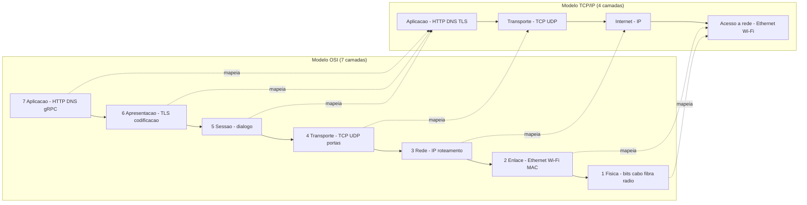

# Modelo OSI (7 camadas) e Modelo TCP/IP: Mapeamento, Encapsulamento e Onde Cada Protocolo Vive

> **Bloco:** Redes e protocolos · **Nível:** Intermediário/Avançado · **Tempo de leitura:** ~26 min

## TL;DR

Redes de computadores são organizadas em **camadas** porque o problema de "fazer dois processos em máquinas diferentes conversarem" é grande demais para uma solução monolítica. Cada camada resolve uma fatia do problema, oferece um serviço bem definido para a camada acima e consome os serviços da camada abaixo — sem precisar saber *como* essa camada funciona por dentro. Dois modelos de camadas dominam o vocabulário: o **modelo OSI** (Open Systems Interconnection, ISO), didático e com **7 camadas** (Física, Enlace, Rede, Transporte, Sessão, Apresentação, Aplicação), e o **modelo TCP/IP** (também chamado modelo da Internet), pragmático e com **4 camadas** (Acesso à rede/Link, Internet, Transporte, Aplicação), que é o que a Internet *de fato* implementa. O mapeamento aproximado: TCP/IP "Aplicação" agrupa OSI 5+6+7; TCP/IP "Transporte" = OSI 4; TCP/IP "Internet" = OSI 3; TCP/IP "Link" agrupa OSI 1+2. O mecanismo que faz tudo funcionar é o **encapsulamento**: cada camada envolve os dados da camada de cima com seu próprio cabeçalho (e às vezes trailer), formando a **PDU** daquela camada (segmento na L4, pacote/datagrama na L3, quadro/frame na L2). Na recepção, **desencapsula** na ordem inversa. O ponto arquitetural para o engenheiro: a **camada 7 (HTTP/gRPC/DNS)**, a **camada 4 (TCP/UDP)** e a **camada 3 (IP)** são onde quase todas as decisões de sistemas distribuídos acontecem — e confundir camadas (ex.: chamar de "load balancer L7" algo que só roteia por IP:porta, que é L4) é fonte clássica de erro de design. OSI é o vocabulário; TCP/IP é a implementação.

## O problema que resolve

Imagine que você precise projetar, do zero, como o navegador de um cliente em São Paulo abre a página de uma loja virtual hospedada num data center em Virginia. O escopo é assustador: há sinais elétricos/ópticos viajando por fibra, há um Wi-Fi doméstico com ruído e colisões, há roteadores espalhados pelo mundo que precisam decidir o próximo salto, há a possibilidade de pacotes se perderem ou chegarem fora de ordem, há a necessidade de identificar *qual* dos 200 processos abertos na máquina destino deve receber os dados, há criptografia, e há finalmente o significado da requisição ("me dê o HTML da home"). Resolver tudo isso num único bloco de software seria impossível de construir, testar, evoluir ou interoperar entre fabricantes.

A resposta da engenharia de redes é **decomposição em camadas** (layering). Cada camada tem uma responsabilidade única e expõe uma **interface** estável para a camada acima, escondendo sua implementação interna. Isso traz três benefícios decisivos:

1. **Abstração / separação de responsabilidades.** O HTTP (camada de aplicação) não precisa saber se os bytes viajam por fibra, Wi-Fi ou 5G — ele confia que a camada de transporte entrega um fluxo confiável de bytes. Quem escreve um servidor web nunca lida com retransmissão de pacotes ou roteamento.
2. **Interoperabilidade.** Como as interfaces entre camadas são padronizadas (por RFCs e padrões ISO/IEEE), equipamentos de fabricantes diferentes conversam. Um roteador Cisco encaminha pacotes IP gerados por um Linux que rodam HTTP servido por um Nginx.
3. **Evolução independente.** É possível trocar a tecnologia de uma camada sem mexer nas outras. A migração de IPv4 para IPv6 (camada 3) não exigiu reescrever o HTTP (camada 7). A chegada do Wi-Fi 6 (camada 1/2) não mexeu no TCP. Essa é a mesma lógica de **encapsulamento e baixo acoplamento** que orienta arquitetura de software — redes são, talvez, o exemplo mais bem-sucedido de modularização em camadas da história da computação.

O **modelo OSI** nasceu como tentativa da ISO de criar um padrão universal e neutro de fabricante. Ele acabou *não* sendo implementado literalmente (a pilha OSI completa fracassou comercialmente), mas seu **vocabulário de 7 camadas** venceu e é hoje a língua franca para falar de redes. O **modelo TCP/IP**, mais antigo e mais simples, é o que a Internet realmente roda — ele foi projetado de forma pragmática, "funcionando primeiro, padronizando depois". A pergunta que estes modelos respondem: **"como dividir a comunicação entre dois processos remotos em responsabilidades isoláveis, e em qual camada cada protocolo e cada decisão de arquitetura vive?"**

## O que é (definição aprofundada)

### O modelo OSI — 7 camadas (de cima para baixo)

O modelo OSI organiza a comunicação em sete camadas. Convém numerá-las de baixo (1, mais perto do meio físico) para cima (7, mais perto da aplicação), mas pensá-las de cima para baixo (a jornada de um dado saindo da aplicação) ajuda a fixar:

- **Camada 7 — Aplicação.** É onde os protocolos que a aplicação usa diretamente vivem: **HTTP, HTTPS, DNS, SMTP, FTP, gRPC, WebSocket**. Não é a aplicação em si (o navegador), mas o protocolo que ela fala. Define o *significado* da troca: "GET /produtos", "resolva loja.com.br".
- **Camada 6 — Apresentação.** Cuida da **representação** dos dados: serialização, codificação de caracteres (UTF-8), compressão e, classicamente, criptografia. Na prática moderna, o **TLS** é frequentemente situado aqui (ou entre 6 e 7) — é onde os bytes da aplicação são cifrados/decifrados.
- **Camada 5 — Sessão.** Gerencia o **diálogo** entre os dois lados: abertura, manutenção e encerramento de sessões, pontos de sincronização, retomada. Exemplos conceituais: controle de quem fala (half/full duplex), checkpoints. Na Internet real, essa responsabilidade é difusa (parte fica no TCP, parte na aplicação).
- **Camada 4 — Transporte.** Entrega **processo a processo** (host a host com identificação de porta). É onde vivem **TCP** (confiável, orientado a conexão, ordenado) e **UDP** (sem conexão, sem garantia de entrega/ordem). Cuida de **portas** (multiplexação de qual processo recebe), e — no caso do TCP — de **confiabilidade, ordenação, controle de fluxo e controle de congestionamento**. A PDU é o **segmento** (TCP) ou **datagrama** (UDP).
- **Camada 3 — Rede.** Entrega **host a host fim a fim atravessando redes diferentes** (inter-rede). É o domínio do **IP** (IPv4/IPv6), do **endereçamento lógico** (endereços IP) e do **roteamento** (decidir o próximo salto entre redes). Protocolos auxiliares: ICMP (ping), roteamento (BGP, OSPF). A PDU é o **pacote**/datagrama IP. Roteadores operam aqui.
- **Camada 2 — Enlace (Data Link).** Entrega **nó a nó dentro do mesmo segmento de rede local** (um salto). Usa **endereçamento físico (MAC)**, detecta/corrige erros do meio, controla acesso ao meio. Exemplos: **Ethernet, Wi-Fi (802.11), ARP** (resolve IP→MAC), switches. A PDU é o **quadro (frame)**.
- **Camada 1 — Física.** Transmite **bits crus** pelo meio: voltagens, pulsos de luz, ondas de rádio, conectores, pinagem. Cabos, fibra, rádio Wi-Fi, hubs. A "PDU" são bits.

Mnemônico clássico (de cima para baixo): *All People Seem To Need Data Processing* (Application, Presentation, Session, Transport, Network, Data link, Physical).

### O modelo TCP/IP — 4 camadas (o que a Internet roda)

O modelo TCP/IP é mais enxuto e foi desenhado em torno dos protocolos que já existiam e funcionavam:

- **Aplicação.** Agrupa o que o OSI separa em **Aplicação + Apresentação + Sessão** (camadas 7, 6, 5). Aqui vivem HTTP, DNS, TLS, gRPC, SMTP — toda a lógica "de cima" fica nas mãos da aplicação e suas bibliotecas.
- **Transporte.** Idêntico em escopo à **camada 4 do OSI**: TCP e UDP, portas, confiabilidade/ordenação (TCP).
- **Internet.** Corresponde à **camada 3 do OSI**: IP, endereçamento e roteamento entre redes. (O nome "Internet" aqui é a camada *inter-rede*, não "a Internet" como rede global.)
- **Acesso à rede / Link.** Agrupa **camadas 2 e 1 do OSI**: a tecnologia de enlace e o meio físico (Ethernet, Wi-Fi, etc.). Algumas versões chamam de "Link" ou "Host-to-network".

Existe também uma variante de **5 camadas** (muito usada em didática, ex.: Tanenbaum/Kurose) que separa Link em "Enlace" e "Física", ficando: Aplicação, Transporte, Rede, Enlace, Física. É o melhor dos dois mundos: o pragmatismo do TCP/IP com a granularidade física do OSI.

### O mapeamento entre os dois modelos

A tabela a seguir é a referência canônica. Memorize-a: ela responde "em que camada está X" em qualquer dos dois vocabulários.

| OSI (7 camadas) | TCP/IP (4 camadas) | PDU | Endereçamento | Exemplos de protocolos | Equipamentos |
|---|---|---|---|---|---|
| 7 Aplicação | Aplicação | dados/mensagem | — (nomes, URLs) | HTTP, HTTPS, DNS, gRPC, SMTP, WebSocket | (processos) |
| 6 Apresentação | Aplicação | dados | — | TLS/SSL, codificação, compressão | — |
| 5 Sessão | Aplicação | dados | — | (difusa: NetBIOS, RPC) | — |
| 4 Transporte | Transporte | segmento / datagrama | **porta** | **TCP, UDP**, QUIC* | (firewall L4, LB L4) |
| 3 Rede | Internet | pacote / datagrama IP | **endereço IP** | IP (v4/v6), ICMP, BGP, OSPF | **roteador** |
| 2 Enlace | Acesso à rede / Link | quadro (frame) | **MAC** | Ethernet, Wi-Fi 802.11, ARP, PPP | **switch**, bridge |
| 1 Física | Acesso à rede / Link | bit | — | cabo, fibra, rádio, USB, Bluetooth físico | hub, repetidor, cabo |

\* QUIC é um caso peculiar e instrutivo: roda *sobre* UDP (L4) mas implementa em espaço de usuário funções que tradicionalmente seriam de transporte (streams confiáveis, controle de congestionamento) — borrando as fronteiras de camada de propósito. Detalhado no arquivo de HTTP/3.

### Encapsulamento: como os dados descem e sobem a pilha

O mecanismo concreto que faz as camadas cooperarem é o **encapsulamento**. Quando um dado *desce* a pilha no emissor, **cada camada adiciona seu próprio cabeçalho** (header) — e a camada 2 adiciona também um trailer (para detecção de erro). O payload de uma camada é a PDU inteira (header + dados) da camada de cima:

1. A **aplicação** produz a mensagem (ex.: `GET /produtos HTTP/1.1\r\nHost: loja.com.br...`).
2. A **camada de transporte** (TCP) prefixa o **cabeçalho TCP** (portas de origem/destino, número de sequência, flags) → vira um **segmento**.
3. A **camada de rede** (IP) prefixa o **cabeçalho IP** (IP origem/destino, TTL) → vira um **pacote**.
4. A **camada de enlace** (Ethernet) prefixa o **cabeçalho Ethernet** (MAC origem/destino) e adiciona um **trailer** (FCS, checksum) → vira um **quadro**.
5. A **camada física** transmite os **bits** do quadro pelo meio.

No receptor, o processo é inverso — **desencapsulamento**: a camada física entrega os bits; o enlace lê e remove seu header/trailer e passa o pacote para cima; a camada de rede remove o header IP e passa o segmento; o transporte remove o header TCP e entrega a mensagem à aplicação. Cada camada só "enxerga" seu próprio cabeçalho — é a **regra de ouro do layering**: uma camada não inspeciona o conteúdo das camadas acima (com a exceção deliberada de dispositivos de inspeção profunda, como firewalls L7).

Uma consequência prática importante é o **overhead de cabeçalhos** e a **MTU** (Maximum Transmission Unit): cada camada adiciona bytes, e o quadro Ethernet tem tamanho máximo (tipicamente 1500 bytes de payload IP). Pacotes maiores são **fragmentados** — daí a relevância de conceitos como MSS (Maximum Segment Size) no TCP e Path MTU Discovery.

### Glossário rápido

- **PDU (Protocol Data Unit):** a unidade de dado de uma camada (bit, frame, packet, segment, message).
- **Encapsulamento:** envolver a PDU da camada superior com o header (e trailer) da camada atual.
- **Porta (port):** número (0–65535) que identifica o processo/serviço dentro de um host (L4).
- **Endereço IP:** identificador lógico de host na inter-rede (L3); roteável globalmente.
- **Endereço MAC:** identificador físico da interface de rede (L2); local ao segmento.
- **MTU/MSS:** tamanho máximo de quadro (L2) / de segmento TCP (L4).
- **Socket:** abstração (IP + porta + protocolo) que a aplicação usa para falar com a pilha de rede.
- **Roteamento (routing):** decisão de próximo salto entre redes (L3); **comutação/switching** é encaminhamento dentro do segmento (L2).

## Como funciona

A melhor forma de internalizar as camadas é seguir um dado real. Considere a aplicação `checkout` num servidor querendo enviar a resposta HTTP de volta ao navegador do cliente. Os dados **descem** a pilha no servidor, atravessam a rede (subindo e descendo a pilha parcialmente em cada roteador no caminho) e **sobem** a pilha no cliente.

No **emissor**, cada camada faz seu trabalho e delega para baixo:

- A **aplicação** decide *o quê* enviar (o corpo da resposta HTTP) e *para quem* em termos de nome/URL. Entrega ao transporte via socket.
- O **transporte** decide *como* enviar de forma confiável: o TCP quebra o stream em segmentos, numera cada byte (sequence number), e gerencia confirmações, retransmissão, controle de fluxo e congestionamento. Escolhe as **portas** (origem = porta do processo servidor, ex.: 443; destino = porta efêmera do navegador). É aqui que a confiabilidade vive — assunto do arquivo TCP vs UDP.
- A **rede** decide *por onde* ir: anexa IPs de origem e destino e entrega ao enlace. Cada roteador no caminho lê **apenas o header IP** (camada 3), consulta sua tabela de roteamento, decrementa o TTL e encaminha ao próximo salto — roteadores **não sobem** até a camada 4 ou 7 em operação normal (por isso são rápidos e "burros" quanto ao conteúdo).
- O **enlace** entrega ao *próximo nó físico*: resolve o IP do próximo salto em MAC (via ARP), monta o quadro e o coloca no meio.
- A **física** transmite os **bits**.

A observação arquitetural decisiva: **a comunicação é "horizontal" em cada camada (peer-to-peer lógico) mas "vertical" na implementação**. A camada de transporte do servidor "conversa" logicamente com a camada de transporte do cliente (mesmo número de sequência, mesmas portas), como se houvesse um canal direto entre elas — mas fisicamente os bytes descem toda a pilha, viajam, e sobem toda a pilha do outro lado. Cada camada mantém a *ilusão* de falar diretamente com sua par remota. Essa é a essência da abstração em camadas.

Outro ponto: **dispositivos diferentes operam em camadas diferentes**, e isso define o que cada um "entende":

- Um **switch** (L2) só lê endereços MAC — encaminha quadros dentro da LAN sem saber de IP ou HTTP.
- Um **roteador** (L3) lê IPs — decide rotas entre redes, mas não inspeciona o conteúdo HTTP.
- Um **load balancer L4** (ex.: AWS NLB) roteia por **IP:porta** (TCP/UDP) — rápido, mas cego ao conteúdo da requisição; não sabe se é `GET /api` ou `GET /imagens`.
- Um **load balancer L7** (ex.: AWS ALB, Nginx, Envoy) sobe até a camada de aplicação, **lê o HTTP** (path, headers, cookies) e pode rotear `/api/*` para um pool e `/static/*` para outro, fazer TLS termination, etc. — mais inteligente, porém com mais overhead.

Confundir L4 e L7 é um dos erros mais comuns em desenho de infraestrutura, e o modelo de camadas é exatamente a ferramenta para não errar: pergunte sempre "**que camada esse componente precisa ler para tomar sua decisão?**".

## Diagrama de fluxo

O primeiro diagrama mostra o mapeamento OSI ↔ TCP/IP lado a lado; o segundo mostra o encapsulamento (dados descendo a pilha no emissor e subindo no receptor, atravessando roteadores que só sobem até a L3).



```mermaid
sequenceDiagram
    participant App as "Aplicacao (L7)"
    participant TCP as "Transporte (L4)"
    participant IP as "Rede (L3)"
    participant Link as "Enlace/Fisica (L2/L1)"
    participant Router as "Roteador (so L3)"
    participant CLink as "Enlace cliente (L2/L1)"
    participant CIP as "Rede cliente (L3)"
    participant CTCP as "Transporte cliente (L4)"
    participant CApp as "Aplicacao cliente (L7)"

    App->>TCP: mensagem HTTP
    TCP->>IP: + header TCP (segmento)
    IP->>Link: + header IP (pacote)
    Link->>Router: + header Ethernet (quadro / bits)
    Router->>CLink: le so header IP, decide rota, encaminha
    CLink->>CIP: remove header Ethernet
    CIP->>CTCP: remove header IP
    CTCP->>CApp: remove header TCP, entrega mensagem
    Note over App,CApp: cada camada so le seu proprio cabecalho
```

## Exemplo prático / caso real

Vamos seguir o evento mais corriqueiro possível: **um cliente em Recife digita `loja.com.br` no navegador e aperta Enter** para abrir uma loja virtual. Esse único gesto aciona praticamente todas as camadas, e mapeá-lo é o melhor exercício de fixação. (Os arquivos subsequentes deste bloco detalham cada protocolo; aqui interessa *onde* cada um vive.)

1. **DNS (L7 sobre UDP/L4).** O navegador precisa traduzir `loja.com.br` em um IP. Dispara uma consulta **DNS** — protocolo de **aplicação (L7)** que tradicionalmente roda sobre **UDP (L4)** na porta 53. A resposta volta com, digamos, `200.147.x.x`. (Detalhado no arquivo de DNS.)
2. **TCP handshake (L4).** Com o IP em mãos, o navegador abre uma conexão **TCP** com `200.147.x.x:443`. O **3-way handshake** (SYN, SYN-ACK, ACK) acontece na **camada de transporte (L4)**, estabelecendo um canal confiável e ordenado. (Detalhado em TCP vs UDP.)
3. **IP e roteamento (L3).** Cada segmento TCP é encapsulado em pacotes **IP (L3)**. Os pacotes saem do Wi-Fi de Recife, passam pelo roteador doméstico, pelo provedor, por roteadores de backbone, e chegam ao data center — **roteadores ao longo do caminho leem só o header IP (L3)** para decidir o próximo salto. Eles não veem o HTTP, nem mesmo o TCP em si.
4. **Enlace e física (L2/L1).** Em cada salto, os pacotes IP viajam dentro de **quadros Ethernet/Wi-Fi (L2)** sobre o **meio físico (L1)** — fibra no backbone, rádio no Wi-Fi local. O **ARP (L2)** resolve, em cada rede local, qual MAC corresponde ao IP do próximo salto.
5. **TLS handshake (L6/L7).** Como é `https://`, antes do HTTP vem o **TLS handshake**, situado entre **apresentação (L6) e aplicação (L7)**: cliente e servidor negociam cifras e estabelecem chaves de sessão para criptografar tudo. (Detalhado em HTTPS/TLS.)
6. **HTTP (L7).** Só agora o navegador envia a requisição de **aplicação (L7)**: `GET / HTTP/2`. O servidor responde com o HTML. (Detalhado em HTTP/1.1 vs 2 vs 3.)

A sequência **DNS → TCP → TLS → HTTP** percorre L7→L4→L3→L2→L1 e de volta, milhares de vezes, para renderizar uma única página. Entender que cada etapa vive numa camada distinta é o que permite **diagnosticar problemas com precisão cirúrgica**: "a página não abre" pode ser falha de DNS (L7), de conectividade IP (L3 — testa-se com `ping`), de TCP (L4 — `telnet host 443`), de TLS (handshake/certificado), ou de aplicação (HTTP 5xx). Cada camada tem sua ferramenta de diagnóstico (`ping`/L3, `traceroute`/L3, `nslookup`/DNS, `openssl s_client`/TLS, `curl -v`/L7).

Um caso real de design: ao escolher um **load balancer** para a loja, a equipe decide entre um **NLB (L4)** — ultrarrápido, ideal para encaminhar conexões TCP brutas, TLS passthrough — e um **ALB (L7)** — que termina TLS, lê o path HTTP e roteia `/api/*` para o backend de pedidos e `/*` para o frontend. A decisão depende inteiramente de **qual camada precisa ser inspecionada** para rotear corretamente. (Ver Service Discovery & Load Balancing.)

## Quando usar / Quando evitar

Aqui "usar" significa "qual modelo/camada usar como referência mental e operacional", já que ninguém "escolhe" implementar OSI ou TCP/IP — a Internet já é TCP/IP.

**Use o vocabulário OSI (7 camadas)** para **comunicação e diagnóstico**: é a língua franca em entrevistas, documentação de fornecedores (firewalls "L3/L4/L7"), e troubleshooting. Dizer "o problema está na camada 4" é mais preciso e universal do que descrições vagas. É também superior didaticamente por separar claramente sessão, apresentação e aplicação.

**Use o modelo TCP/IP (4 camadas)** para **raciocinar sobre a Internet real**: é o que os sistemas de fato implementam. Quando você programa um socket, configura um firewall, ou desenha uma topologia de rede em nuvem, está pensando em TCP/IP (aplicação, transporte, IP, link).

**Evite** tratar o OSI como descrição literal da implementação: a pilha OSI completa **não** é o que roda na Internet, e as camadas 5 e 6 não têm correspondência limpa (estão "espalhadas" entre aplicação e bibliotecas como o TLS). Forçar TLS a ser "exatamente camada 6" ou procurar uma "camada de sessão" pura na pilha real leva a confusão — o consenso prático é que TLS opera *entre* L4 e L7, e que sessão/apresentação são responsabilidades da aplicação no mundo TCP/IP.

**Evite** também usar o modelo de camadas como dogma rígido em tecnologias que **deliberadamente cruzam camadas** por performance (QUIC implementa transporte em espaço de usuário sobre UDP; alguns protocolos fazem "cross-layer optimization"). O modelo é um mapa, não o território.

## Anti-padrões e armadilhas comuns

- **Confundir camada 4 e camada 7 em load balancers/firewalls.** Chamar de "balanceamento L7" algo que só distribui por IP:porta (que é L4), ou esperar que um LB L4 roteie por path HTTP (que ele não enxerga). Regra: pergunte *qual camada o dispositivo precisa ler* para decidir.
- **Assumir que roteadores leem o conteúdo da aplicação.** Roteadores operam na L3 (IP); não inspecionam HTTP nem TCP em operação normal. Esperar que um roteador "veja" a URL é erro conceitual (isso é trabalho de proxy/firewall L7).
- **Tratar TLS como uma camada fixa e única.** TLS não encaixa limpo numa camada OSI; está entre L4 e L7. Discutir interminavelmente "TLS é L5 ou L6?" é menos útil do que entender *o que* ele faz (cifra os bytes da aplicação sobre o transporte confiável).
- **Ignorar a MTU e o overhead de encapsulamento.** Cada camada adiciona cabeçalhos; pacotes maiores que a MTU são fragmentados ou descartados. Problemas de "conexão trava em arquivos grandes" frequentemente são MTU/MSS mal configurada (ex.: VPN/encapsulamento reduzindo a MTU efetiva).
- **Misturar endereçamento de camadas.** Confundir MAC (L2, local ao segmento) com IP (L3, roteável). MAC não atravessa roteadores; IP sim. Esperar "alcançar uma máquina por MAC" através da Internet é impossível.
- **Achar que "camada superior é melhor".** Camadas não são hierarquia de qualidade; são responsabilidades. Subir até a L7 (ler HTTP) custa CPU e latência — um LB L4 é mais rápido justamente por *não* subir. A escolha é trade-off, não "mais é melhor".
- **Tratar a numeração OSI como ordem de execução universal.** Nem toda comunicação usa as 7 camadas (uma comunicação puramente L2 numa LAN não envolve IP). E o modelo de 5 camadas (sem sessão/apresentação separadas) é frequentemente mais fiel à realidade.
- **Esquecer que QUIC/HTTP3 borra as fronteiras.** Tratar "transporte = TCP" como dogma faz perder de vista que QUIC roda transporte confiável *sobre* UDP em espaço de usuário — uma escolha arquitetural intencional de cruzar camadas (ver HTTP/3).

## Relação com outros conceitos

- **TCP vs UDP (camada 4):** os dois protagonistas da camada de transporte; toda decisão de confiabilidade vs latência mora na L4. Ver `16-redes-e-protocolos/02-tcp-vs-udp.md`.
- **HTTP/1.1, HTTP/2, HTTP/3 (camada 7):** os protocolos de aplicação mais usados; HTTP/3 (QUIC) é o caso onde a fronteira L4/L7 se borra. Ver `16-redes-e-protocolos/03-http1-http2-http3-quic.md`.
- **HTTPS/TLS (camadas 6/7):** segurança da comunicação, situada entre transporte e aplicação. Ver `16-redes-e-protocolos/04-https-tls-handshake-e-certificados.md`.
- **DNS (camada 7 sobre UDP):** o primeiro passo de quase toda comunicação; protocolo de aplicação que roda sobre transporte. Ver `16-redes-e-protocolos/05-dns-resolution.md`.
- **mTLS entre serviços:** autenticação mútua na camada de segurança (L6/L7), base de zero trust. Ver `08-seguranca-arquitetural/03-mtls-entre-servicos.md`.
- **Service Discovery & Load Balancing:** a distinção LB L4 vs L7 é diretamente um problema de "em que camada inspecionar". Ver `04-sistemas-distribuidos/07-service-discovery-e-load-balancing.md`.
- **Latência vs throughput e percentis:** o empilhamento de camadas (DNS+TCP+TLS+HTTP) soma latência; cada round-trip conta e aparece nos percentis. Ver `07-performance-e-escalabilidade/02-latencia-vs-throughput-percentis.md`.

## Modelo mental para o arquiteto

Três ideias para carregar:

1. **OSI é o vocabulário; TCP/IP é a implementação.** Fale em OSI para comunicar e diagnosticar (camada 3, 4, 7), pense em TCP/IP para raciocinar sobre a Internet real. Os dois mapeiam um no outro: aplicação(7+6+5) → transporte(4) → internet(3) → link(2+1).
2. **Pergunte sempre "que camada precisa ser lida".** É a chave para escolher entre LB L4 e L7, entender o que um firewall/roteador/switch faz, e diagnosticar onde uma falha mora. Camadas mais altas são mais expressivas mas mais caras; mais baixas são mais rápidas mas cegas ao conteúdo.
3. **Encapsulamento é o mecanismo, abstração é o ganho.** Cada camada envolve a de cima com seu cabeçalho e confia que a de baixo entrega. Isso permitiu IPv4→IPv6, Wi-Fi novo, TLS evoluindo — tudo sem reescrever as outras camadas. É a mesma lição de modularidade e baixo acoplamento que vale em arquitetura de software.

## Pontos para fixar (revisão)

- **OSI tem 7 camadas** (Física, Enlace, Rede, Transporte, Sessão, Apresentação, Aplicação); **TCP/IP tem 4** (Link, Internet, Transporte, Aplicação) — e é o que a Internet roda.
- Mapeamento: **App(7)+Apresentação(6)+Sessão(5) → Aplicação TCP/IP**; **Transporte(4) ↔ Transporte**; **Rede(3) ↔ Internet**; **Enlace(2)+Física(1) → Link**.
- **PDUs:** bit (L1) → quadro/frame (L2) → pacote (L3) → segmento (L4) → mensagem (L7).
- **Endereçamento:** MAC (L2, local), IP (L3, roteável), porta (L4, identifica processo).
- **Encapsulamento:** cada camada adiciona seu cabeçalho ao descer; desencapsula ao subir; cada camada lê só o próprio header.
- **Dispositivos por camada:** switch (L2), roteador (L3), LB/firewall L4 (IP:porta), LB/proxy L7 (lê HTTP).
- **TCP/UDP vivem na L4; IP na L3; HTTP/DNS na L7; TLS entre L6 e L7.**
- **QUIC borra fronteiras**: transporte confiável sobre UDP em espaço de usuário.
- Diagnóstico por camada: `ping`/`traceroute` (L3), `nslookup` (DNS), `telnet host:porta` (L4), `openssl s_client` (TLS), `curl -v` (L7).

## Referências

- [RFC 9293 — Transmission Control Protocol (TCP)](https://datatracker.ietf.org/doc/html/rfc9293)
- [RFC 1122 — Requirements for Internet Hosts (modelo de camadas TCP/IP)](https://datatracker.ietf.org/doc/html/rfc1122)
- [What is the OSI Model? — Cloudflare Learning Center](https://www.cloudflare.com/learning/ddos/glossary/open-systems-interconnection-model-osi/)
- [HTTP overview — MDN Web Docs](https://developer.mozilla.org/en-US/docs/Web/HTTP)
- [High Performance Browser Networking — Ilya Grigorik (livro online gratuito)](https://hpbn.co/)
- [What is the network layer? — Cloudflare Learning Center](https://www.cloudflare.com/learning/network-layer/what-is-the-network-layer/)
- [Internetworking with TCP/IP — overview RFC 1180 (A TCP/IP Tutorial)](https://datatracker.ietf.org/doc/html/rfc1180)
