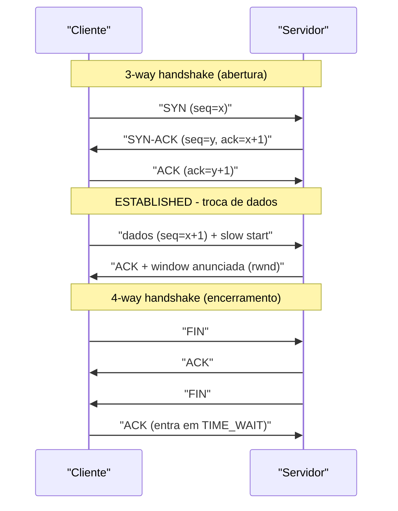
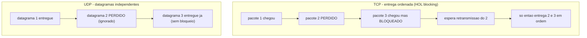

# TCP vs UDP: 3-Way Handshake, Controle de Fluxo, Controle de Congestionamento, Confiabilidade vs Latência

> **Bloco:** Redes e protocolos · **Nível:** Intermediário/Avançado · **Tempo de leitura:** ~30 min

## TL;DR

**TCP** e **UDP** são os dois protagonistas da **camada de transporte (L4)**, e a escolha entre eles é uma das decisões arquiteturais mais fundamentais — porque expressa um *trade-off irredutível entre confiabilidade e latência*. **TCP** (Transmission Control Protocol) é **orientado a conexão e confiável**: estabelece a conexão via **3-way handshake** (SYN → SYN-ACK → ACK), garante **entrega ordenada e sem perdas** (numeração de sequência + ACKs + retransmissão), implementa **controle de fluxo** (a *receive window*, para não afogar um receptor lento) e **controle de congestionamento** (slow start, congestion avoidance, fast retransmit/recovery — para não afogar a *rede*). O preço dessas garantias: **latência adicional** (1 RTT de handshake antes de qualquer dado; head-of-line blocking quando um pacote se perde) e estado por conexão. **UDP** (User Datagram Protocol) é **sem conexão e não confiável**: dispara datagramas independentes sem handshake, sem ACK, sem ordenação, sem retransmissão e sem controle de congestionamento — apenas um checksum opcional. Em troca, é **mínimo e de baixa latência**, ideal para tempo real (voz, vídeo, jogos), DNS (consultas pequenas) e como **base para protocolos que reimplementam confiabilidade em espaço de usuário** (QUIC/HTTP3). Regra mental: use **TCP quando entregar tudo na ordem certa importa mais que a latência** (web, APIs, transferência de arquivos, bancos); use **UDP quando dados atrasados são piores que dados perdidos** (streaming ao vivo, VoIP, jogos) ou quando você quer construir seu próprio transporte por cima.

## O problema que resolve

A camada de rede (IP, L3) entrega pacotes **best-effort**: faz o melhor que pode, mas **não promete nada**. Pacotes IP podem se **perder** (descartados por um roteador congestionado), chegar **fora de ordem** (rotas diferentes), serem **duplicados**, ou chegar **corrompidos**. Além disso, o IP só endereça *hosts* (máquinas), não *processos* — ele entrega o pacote à máquina certa, mas não sabe se é para o navegador, o cliente de e-mail ou o servidor de banco rodando ali.

A **camada de transporte** existe para fechar essa lacuna entre "o que o IP oferece" e "o que as aplicações precisam". Toda aplicação enfrenta duas perguntas:

1. **Endereçamento de processo:** "destes 300 processos na máquina destino, para qual entrego estes bytes?" — resolvido por **portas** (0–65535). A combinação (IP origem, porta origem, IP destino, porta destino, protocolo) — o **4-tuple/5-tuple** — identifica unicamente um fluxo.
2. **Que garantias eu preciso?** — e aqui as aplicações se dividem em dois mundos:
   - Algumas precisam de **confiabilidade absoluta e ordem**: uma transferência de arquivo, uma resposta HTTP, uma transação de banco *não podem* perder ou embaralhar bytes. Um byte faltando corrompe tudo. Para essas, vale pagar o preço de retransmitir e esperar.
   - Outras precisam de **latência mínima e dados frescos**, e toleram (ou preferem) perda: numa chamada de vídeo, retransmitir um quadro de áudio de 200ms atrás é inútil — quando ele chegar, a conversa já avançou; melhor *pular* e seguir. Para essas, a confiabilidade do TCP é não só desnecessária como **prejudicial** (a retransmissão e a entrega ordenada *aumentam* a latência percebida).

É por isso que existem **dois** protocolos de transporte dominantes, não um. TCP atende o primeiro mundo (confiabilidade); UDP, o segundo (latência/minimalismo). A pergunta central que este tópico responde: **"minha aplicação prefere esperar e receber tudo na ordem certa (TCP), ou prefere receber o que dá, na hora, mesmo que falte algo (UDP)?"** — e, num nível mais profundo, *como* o TCP entrega suas garantias (handshake, fluxo, congestionamento), porque entender o mecanismo é o que permite raciocinar sobre performance, latência de cauda e os limites do protocolo.

## O que é (definição aprofundada)

### TCP — orientado a conexão e confiável

**TCP** (RFC 9293, que consolidou o histórico RFC 793) oferece à aplicação a abstração de um **fluxo de bytes (byte stream) confiável, ordenado e bidirecional** entre dois processos. As propriedades que ele garante:

- **Orientado a conexão:** antes de trocar dados, os dois lados estabelecem uma conexão (handshake) e mantêm **estado** (números de sequência, janelas, buffers) durante toda a vida da conexão. Ao final, encerram ordenadamente.
- **Entrega confiável:** cada byte enviado é **numerado** (sequence number). O receptor confirma o recebimento com **ACKs** (acknowledgements). Se o emissor não recebe ACK dentro de um tempo (RTO, baseado no RTT estimado) ou detecta perda por ACKs duplicados, **retransmite**. Nenhum byte é perdido silenciosamente.
- **Entrega ordenada:** como os bytes são numerados, o receptor **reordena** pacotes que chegam fora de sequência e só entrega à aplicação na ordem correta. A aplicação nunca vê desordem.
- **Detecção de erro:** checksum no cabeçalho descarta segmentos corrompidos (que serão retransmitidos).
- **Controle de fluxo** e **controle de congestionamento** (detalhados adiante) — os dois mecanismos que impedem, respectivamente, afogar o *receptor* e afogar a *rede*.
- **Full-duplex:** dados fluem nos dois sentidos simultaneamente na mesma conexão.

O custo dessas garantias: **estado por conexão** (memória/CPU), **latência de setup** (handshake antes de qualquer dado), e o problema de **head-of-line blocking** — se um pacote no meio do stream se perde, todos os pacotes *posteriores* que já chegaram ficam **bloqueados no buffer** esperando o retransmitido, porque a entrega tem que ser ordenada. Esse é o calcanhar de Aquiles do TCP e a motivação central do QUIC/HTTP3.

### UDP — sem conexão e não confiável

**UDP** (RFC 768) é deliberadamente **minimalista**. Ele faz quase nada além do que o IP já faz, adicionando apenas o essencial:

- **Endereçamento de processo:** portas de origem e destino (a única função que o UDP *precisa* adicionar ao IP).
- **Checksum** (opcional em IPv4, obrigatório em IPv6) para detecção de corrupção.

E **não** oferece: conexão, handshake, ACKs, retransmissão, ordenação, controle de fluxo nem controle de congestionamento. Cada **datagrama** é independente — pode se perder, chegar fora de ordem ou duplicado, e o UDP não faz nada a respeito. A aplicação recebe os datagramas como chegam (ou não recebe).

Por que isso é *útil*, e não apenas "TCP incompleto"? Porque:

- **Latência mínima:** sem handshake, o primeiro datagrama pode sair imediatamente. Sem retransmissão/reordenação, não há espera por pacotes perdidos.
- **Sem estado / leve:** o servidor não mantém estado por cliente (escala melhor para muitos clientes esporádicos, como DNS).
- **Controle nas mãos da aplicação:** a aplicação decide *exatamente* o que fazer com perdas — pular (áudio/vídeo), reenviar seletivamente só o que importa, ou implementar sua *própria* confiabilidade sob medida (é exatamente o que QUIC faz). UDP é a "tela em branco" da camada de transporte.
- **Suporta multicast/broadcast** (TCP é estritamente ponto a ponto).

A frase que resume: **TCP é "entregue tudo, custe o tempo que custar"; UDP é "entregue o que der, agora"**.

### O 3-way handshake (estabelecimento de conexão TCP)

Antes de qualquer dado, o TCP estabelece a conexão num **handshake de três vias**, cujo propósito é **sincronizar os números de sequência iniciais (ISN)** dos dois lados e confirmar que ambos podem enviar *e* receber:

1. **SYN** — o cliente envia um segmento com a flag `SYN` e seu número de sequência inicial (`seq = x`). "Quero abrir conexão, começo a contar em x."
2. **SYN-ACK** — o servidor responde com `SYN` + `ACK`: confirma o do cliente (`ack = x+1`) e envia *seu* número de sequência inicial (`seq = y`). "Aceito, recebi seu x, começo a contar em y."
3. **ACK** — o cliente confirma o do servidor (`ack = y+1`). "Recebi seu y. Conexão estabelecida."

Após esses três segmentos, a conexão está **ESTABLISHED** e os dados podem fluir. O ponto de performance: o handshake custa **1 RTT** (round-trip time) antes de qualquer byte útil — em HTTPS, somam-se a isso os RTTs do TLS handshake (ver HTTPS/TLS), o que é a motivação central de otimizações como TLS 1.3 (1-RTT/0-RTT) e QUIC (handshake combinado). Para encerrar, há o **4-way handshake** (FIN/ACK em cada direção, já que a conexão é full-duplex e cada lado fecha o seu sentido), passando pelo estado `TIME_WAIT`.

Detalhe de segurança relevante: o **SYN flood** é um ataque DoS clássico que explora o handshake — o atacante envia muitos SYN sem completar o ACK final, esgotando a tabela de conexões meio-abertas do servidor. Mitigação: **SYN cookies**.

### Controle de fluxo (flow control) — não afogar o receptor

O **controle de fluxo** resolve um problema ponto a ponto: e se o **receptor** for mais lento que o emissor (CPU ocupada, buffer cheio)? Sem controle, o emissor mandaria dados mais rápido do que o receptor consegue processar, e o excesso seria descartado (e retransmitido — desperdício).

A solução do TCP é a **sliding window (janela deslizante)** com a **receive window (rwnd)**: em cada ACK, o receptor **anuncia quanto espaço livre tem no buffer** (campo *window size* no cabeçalho). O emissor nunca envia mais bytes não-confirmados do que a janela anunciada. Se o receptor está sobrecarregado e seu buffer enche, ele anuncia `window = 0`, e o emissor **pausa** até o receptor liberar espaço (e enviar uma atualização). É um mecanismo de **back-pressure** fim a fim — o receptor controla a vazão. (Conecta diretamente com back-pressure em sistemas; ver caching/pooling e mensageria.)

### Controle de congestionamento (congestion control) — não afogar a rede

O **controle de fluxo** protege o receptor; o **controle de congestionamento** protege a **rede** (os roteadores no caminho). É um problema *global*: se todos os emissores mandam o quanto querem, os buffers dos roteadores enchem, pacotes são descartados em massa, todos retransmitem, e a rede entra em **colapso de congestionamento** (congestion collapse) — vazão útil despenca enquanto a carga sobe. Foi o que quase derrubou a Internet em 1986, e a resposta (Van Jacobson) é o que mantém a Internet funcional até hoje.

O TCP infere o congestionamento *indiretamente* (não há sinal explícito da rede, salvo ECN): **perda de pacotes é interpretada como sinal de congestionamento**. O emissor mantém uma **congestion window (cwnd)** — limite de dados em voo — e a quantidade real que pode enviar é `min(rwnd, cwnd)`. As fases clássicas (TCP Reno/NewReno):

- **Slow start:** começa conservador (cwnd pequena, ex.: 10 segmentos) e **dobra a cwnd a cada RTT** (crescimento exponencial) — sondando rapidamente a capacidade disponível. "Devagar" no nome refere-se ao *ponto de partida*, não à taxa de crescimento.
- **Congestion avoidance:** ao atingir um limiar (`ssthresh`), passa a crescer **linearmente** (additive increase) — sondando capacidade com cautela.
- **Fast retransmit / fast recovery:** ao receber **3 ACKs duplicados** (indício de perda de *um* pacote, mas a rede ainda entrega os seguintes), retransmite imediatamente sem esperar o timeout, e **reduz a cwnd pela metade** (multiplicative decrease) em vez de zerar — porque uma perda isolada sugere congestionamento leve, não colapso.
- **Timeout (RTO):** se um ACK *não* chega no tempo (perda severa), o TCP é mais agressivo: reduz cwnd ao mínimo e volta ao slow start.

Esse padrão **AIMD (Additive Increase, Multiplicative Decrease)** — cresce devagar, recua bruscamente — é o que faz múltiplos fluxos TCP **convergirem para uma divisão justa** da banda e a rede permanecer estável. Algoritmos modernos vão além: **CUBIC** (padrão no Linux, otimizado para redes de alta banda e alto RTT) e **BBR** (Google, baseado em modelar banda × RTT em vez de só reagir a perdas) melhoram a vazão em cenários modernos.

A consequência arquitetural: numa conexão nova, o TCP **não usa toda a banda imediatamente** — o slow start "esquenta" ao longo de alguns RTTs. Por isso conexões persistentes (keep-alive) e o reuso de conexões TCP "aquecidas" (HTTP/2) são tão importantes para performance: cada nova conexão paga o custo de descobrir a capacidade do zero.

### Tabela síntese

| Dimensão | TCP | UDP |
|---|---|---|
| Conexão | Orientado a conexão (handshake) | Sem conexão (dispara e esquece) |
| Confiabilidade | Garantida (ACK + retransmissão) | Nenhuma (best-effort) |
| Ordenação | Garantida (reordena) | Nenhuma (chega como chega) |
| Controle de fluxo | Sim (receive window) | Não |
| Controle de congestionamento | Sim (slow start, AIMD, CUBIC/BBR) | Não (aplicação que cuide) |
| Latência de setup | 1 RTT (handshake) + TLS | Zero (1º datagrama já vai) |
| Head-of-line blocking | Sim (entrega ordenada) | Não (datagramas independentes) |
| Overhead de cabeçalho | 20+ bytes | 8 bytes |
| Estado no servidor | Por conexão | Mínimo / nenhum |
| Multicast/broadcast | Não (ponto a ponto) | Sim |
| Casos típicos | Web/HTTP, APIs, BD, e-mail, SSH, transferência | DNS, VoIP, vídeo ao vivo, jogos, QUIC, IoT, NTP |

### Glossário rápido

- **Segmento (TCP) / datagrama (UDP):** a PDU da camada de transporte.
- **Porta:** número que identifica o processo/serviço (L4).
- **3-way handshake:** SYN, SYN-ACK, ACK — estabelece a conexão e sincroniza ISNs.
- **ISN (Initial Sequence Number):** número de sequência inicial, escolhido aleatoriamente (segurança).
- **ACK / SACK:** confirmação; SACK (selective ACK) confirma blocos não-contíguos.
- **RTT / RTO:** round-trip time / retransmission timeout (derivado do RTT).
- **rwnd (receive window):** controle de fluxo — espaço livre no receptor.
- **cwnd (congestion window):** controle de congestionamento — limite do emissor inferido da rede.
- **AIMD:** Additive Increase, Multiplicative Decrease — núcleo do controle de congestionamento.
- **Head-of-line (HOL) blocking:** pacote perdido bloqueia os seguintes por exigência de ordem.
- **MSS / MTU:** Maximum Segment Size (L4) / Maximum Transmission Unit (L2).

## Como funciona

Juntando as peças, a vida de uma conexão **TCP** transferindo dados:

1. **Handshake (1 RTT):** SYN → SYN-ACK → ACK. Ambos os lados acordam os ISNs e entram em ESTABLISHED.
2. **Transferência com janela deslizante:** o emissor envia até `min(rwnd, cwnd)` bytes não-confirmados. Começa com cwnd pequena (**slow start**, dobrando por RTT). O receptor confirma com ACKs e anuncia sua rwnd a cada um.
3. **Reação a perda:** se chegam 3 ACKs duplicados, o emissor faz **fast retransmit** (reenvia o segmento perdido) e **fast recovery** (corta cwnd pela metade, segue em congestion avoidance). Se estoura o RTO (perda severa), volta ao slow start. Enquanto isso, segmentos posteriores que já chegaram ficam **bloqueados no buffer do receptor** (HOL blocking) até o retransmitido completar a sequência.
4. **Regime estável:** sem perdas, a cwnd cresce linearmente (congestion avoidance) buscando o máximo de banda que a rede tolera; ao detectar perda, recua — o serrilhado AIMD.
5. **Encerramento (4-way):** FIN → ACK em cada direção; o lado que fecha ativo passa por TIME_WAIT (espera ~2×MSL para garantir que segmentos atrasados não contaminem uma conexão futura na mesma porta).

A vida de uma troca **UDP** é trivial por comparação: a aplicação chama `sendto(datagrama)`, o UDP prefixa portas + checksum e entrega ao IP; do outro lado, o IP entrega ao UDP que entrega à aplicação via `recvfrom()` — **se** o datagrama chegou. Não há passos 1–5; toda a complexidade (se houver) é responsabilidade da aplicação.

### O dilema de latência: por que confiabilidade custa tempo

O ponto mais importante para o arquiteto é entender *por que* a confiabilidade do TCP **piora** a latência em alguns cenários — não é detalhe técnico, é a essência da escolha:

- **Latência de setup:** o handshake custa 1 RTT antes de qualquer dado. Numa rede com 100ms de RTT (móvel/internacional), são 100ms "perdidos" só para abrir a conexão (mais TLS por cima). UDP manda o primeiro byte de imediato.
- **Head-of-line blocking sob perda:** quando *um* pacote se perde, os pacotes seguintes — *que já chegaram fisicamente* — ficam presos no buffer esperando o retransmitido, porque o TCP precisa entregar **na ordem**. Em uma rede com 1% de perda, isso introduz "engasgos" de pelo menos 1 RTT. Para mídia ao vivo, esse atraso é fatal: o quadro retransmitido chega *depois* de já ser irrelevante.
- **Reação conservadora a perda:** o controle de congestionamento *reduz a vazão* ao detectar perda. Em redes com perda não-congestiva (Wi-Fi/móvel com interferência), o TCP interpreta erroneamente a interferência como congestionamento e desacelera — penalizando a vazão.

Para uma aplicação de **tempo real**, essas três características do TCP são defeitos, não qualidades. É racional escolher UDP e *aceitar* perda: um frame de vídeo perdido é melhor descartado (e talvez ocultado por interpolação) do que entregue atrasado bloqueando todos os frames seguintes. A aplicação implementa só a confiabilidade que *importa* (ex.: reenviar pacotes-chave de I-frame, mas não os de áudio velho). É também por isso que o **QUIC** (base do HTTP/3) escolheu rodar sobre UDP: para reimplementar confiabilidade *por stream* em espaço de usuário e **eliminar o HOL blocking do TCP**, mantendo a confiabilidade onde ela é necessária. (Ver HTTP/3.)

## Diagrama de fluxo

O primeiro diagrama mostra o 3-way handshake e o encerramento; o segundo ilustra o head-of-line blocking que distingue o comportamento de TCP e UDP sob perda.

## Exemplo prático / caso real

Cenários de uma plataforma de e-commerce/mídia brasileira, escolhidos para contrastar quando cada protocolo é a escolha certa.

**Por que a loja virtual usa TCP (web, APIs, checkout).** Quando o cliente carrega `loja.com.br`, faz login e finaliza um pedido, **tudo roda sobre TCP** (via HTTP/HTTPS). E tem que ser assim: o HTML, o JSON da API de produtos, a confirmação do pagamento — nenhum desses pode perder bytes ou chegar embaralhado. Um byte faltando no corpo da resposta corromperia o JSON; uma ordem trocada quebraria o protocolo HTTP. A latência extra do handshake (1 RTT) é aceitável porque a *integridade* é inegociável. Para mitigar o custo do setup repetido, a loja usa **keep-alive** (reusa conexões TCP "aquecidas", evitando re-pagar handshake e slow start) e **HTTP/2** (uma conexão TCP multiplexa muitas requisições). Aqui, a confiabilidade do TCP é exatamente o que se quer.

**Por que o atendimento por vídeo usa UDP (WebRTC).** A loja oferece atendimento por **chamada de vídeo** (consultoria de produto via WebRTC). O áudio e o vídeo trafegam sobre **UDP** (via RTP/SRTP). Por quê? Numa conversa ao vivo, **um pacote de áudio de 300ms atrás é lixo** — se chegasse retransmitido (como o TCP faria), ele atrasaria todo o áudio subsequente (HOL blocking) e a conversa ficaria "robótica" e dessincronizada. Com UDP, um pacote perdido é simplesmente **pulado** — o ouvido humano tolera um micro-corte muito melhor do que um atraso acumulado. O WebRTC implementa, *sobre* UDP, apenas a confiabilidade que faz sentido (controle de congestionamento próprio, FEC seletivo, ocultação de perdas) — sem a entrega ordenada total do TCP, que aqui seria contraproducente.

**Por que o DNS usa UDP (consultas pequenas e numerosas).** Toda navegação começa resolvendo nomes via **DNS sobre UDP** (porta 53). A consulta é minúscula (cabe num datagrama) e o ganho é claro: **sem handshake**, a resolução é 1 ida-e-volta em vez de 3+ (handshake TCP). Para um resolver que atende milhões de consultas, o estado-zero do UDP escala muito melhor. Se a resposta for grande demais (ex.: muitos registros, DNSSEC), o DNS faz fallback para TCP. (Ver DNS resolution.)

**Por que o jogo da promoção usa UDP.** Numa ação de marketing, a loja lança um mini-jogo multiplayer em tempo real. A posição dos jogadores é enviada via **UDP** dezenas de vezes por segundo. Se um pacote de posição se perde, **não adianta retransmiti-lo** — quando chegasse, a posição já estaria desatualizada; o próximo pacote (com a posição mais nova) o torna irrelevante. UDP permite "descartar o velho e usar o novo", priorizando *frescor* sobre *completude*. O jogo implementa sua própria lógica (interpolação, reconciliação) para lidar com perdas.

**Onde a fronteira se borra: HTTP/3 = HTTP sobre QUIC sobre UDP.** A própria loja, ao migrar para **HTTP/3**, passa a servir páginas sobre **QUIC**, que roda sobre **UDP** — mas reimplementa confiabilidade e controle de congestionamento *por stream* em espaço de usuário, eliminando o HOL blocking do TCP. É o melhor argumento de que "TCP vs UDP" não é uma dicotomia rígida: UDP serve de fundação para um transporte confiável *melhor* que o TCP em redes com perda. (Ver HTTP/3.)

## Quando usar / Quando evitar

**Use TCP quando:**

- A **integridade e a ordem dos dados são essenciais**: web/HTTP(S), APIs REST/gRPC, transferência de arquivos, e-mail (SMTP/IMAP), SSH, conexões com bancos de dados, replicação.
- A aplicação não pode tolerar perda silenciosa nem desordem, e a latência extra do handshake/retransmissão é aceitável.
- Você quer que a complexidade de confiabilidade/congestionamento seja resolvida *pela pilha do SO*, não pela sua aplicação.

**Evite TCP quando:**

- A aplicação é **tempo real e dados atrasados são piores que dados perdidos** (voz, vídeo ao vivo, jogos): o HOL blocking e a retransmissão *aumentam* a latência percebida.
- Você precisa de **multicast/broadcast** (TCP é ponto a ponto).
- O custo do handshake/estado por conexão domina (muitas trocas minúsculas e esporádicas — ex.: DNS, telemetria/IoT).

**Use UDP quando:**

- **Tempo real / baixa latência:** VoIP, videochamada (WebRTC/RTP), streaming ao vivo, jogos.
- **Trocas pequenas e numerosas sem necessidade de conexão:** DNS, NTP, SNMP, descoberta de serviços, telemetria/IoT.
- Você quer **construir seu próprio transporte** sob medida (QUIC é o exemplo máximo) com a confiabilidade exata que precisa.
- Precisa de **multicast**.

**Evite UDP quando:**

- A aplicação precisa de entrega garantida e ordenada e você teria que reimplementar (mal) o que o TCP já faz bem — não reinvente confiabilidade por capricho.
- O ambiente bloqueia UDP (muitos firewalls/NATs corporativos tratam UDP com desconfiança — um motivo real pelo qual HTTP/3 precisa de fallback para TCP).

## Anti-padrões e armadilhas comuns

- **Assumir ordem ou entrega em UDP.** O erro mais comum: escrever código UDP que pressupõe que os datagramas chegam, na ordem, sem duplicação. Não chegam garantidamente. Se você precisa disso, ou use TCP, ou implemente sequenciamento/ACK explicitamente — e, nesse caso, pergunte-se se TCP não seria melhor.
- **Reimplementar TCP "na mão" sobre UDP.** A menos que você seja o time do QUIC e tenha um motivo forte (HOL blocking), reconstruir confiabilidade, ordenação e controle de congestionamento sobre UDP é receita para bugs sutis e pior performance que o TCP otimizado do kernel.
- **Usar TCP para mídia em tempo real.** Forçar áudio/vídeo ao vivo por TCP gera engasgos e dessincronização sob qualquer perda (HOL blocking). É o anti-padrão inverso: confiabilidade demais prejudica.
- **Ignorar o custo do handshake em conexões curtas.** Abrir uma nova conexão TCP (+TLS) para cada requisição minúscula paga 2–3 RTTs de setup e slow start a cada vez. Use keep-alive, pooling de conexões e multiplexação (HTTP/2) para amortizar.
- **Esquecer o slow start em benchmarks.** Medir vazão numa conexão recém-aberta subestima a capacidade — a cwnd ainda está "esquentando". Conexões persistentes têm vazão muito superior. Aqueça antes de medir.
- **Não configurar timeouts/keep-alive corretamente.** Conexões TCP zumbis (half-open) consomem recursos; keep-alive mal configurado mantém conexões mortas ou derruba vivas. (Conecta com padrões de resiliência e connection pooling.)
- **Confundir controle de fluxo com controle de congestionamento.** São coisas diferentes: fluxo protege o **receptor** (rwnd); congestionamento protege a **rede** (cwnd). A vazão real é `min(rwnd, cwnd)`. Diagnosticar "lentidão" sem saber qual janela está limitando leva a conclusões erradas.
- **Ignorar perda não-congestiva em redes sem fio.** Em Wi-Fi/móvel, perda por interferência (não por congestionamento) faz o TCP recuar desnecessariamente. Algoritmos como BBR mitigam, mas é uma armadilha de performance frequentemente invisível.
- **Assumir que UDP "sempre passa" em qualquer rede.** Firewalls e NATs corporativos frequentemente bloqueiam ou limitam UDP. Protocolos sobre UDP (QUIC) precisam de **fallback para TCP** justamente por isso.
- **Esquecer a MTU/MSS e a fragmentação.** Datagramas UDP grandes (acima da MTU) fragmentam, e a perda de *um* fragmento descarta o datagrama inteiro. Mantenha datagramas dentro da MTU (Path MTU) quando possível.

## Relação com outros conceitos

- **Modelo OSI e TCP/IP:** TCP e UDP são a camada de transporte (L4); este tópico é o aprofundamento da L4 do modelo de camadas. Ver `16-redes-e-protocolos/01-modelo-osi-e-tcp-ip.md`.
- **HTTP/1.1, HTTP/2, HTTP/3:** HTTP/1.1 e HTTP/2 rodam sobre TCP (e sofrem com seu HOL blocking); HTTP/3 roda sobre QUIC sobre UDP justamente para eliminá-lo. Ver `16-redes-e-protocolos/03-http1-http2-http3-quic.md`.
- **HTTPS/TLS:** o TLS handshake roda *após* o TCP handshake, somando RTTs — motivação para TLS 1.3 e QUIC. Ver `16-redes-e-protocolos/04-https-tls-handshake-e-certificados.md`.
- **DNS:** roda primariamente sobre UDP (consultas pequenas), com fallback para TCP. Ver `16-redes-e-protocolos/05-dns-resolution.md`.
- **Latência vs throughput e percentis:** RTT, handshake, slow start e HOL blocking impactam diretamente latência de cauda (p99); o controle de congestionamento define o throughput sustentável. Ver `07-performance-e-escalabilidade/02-latencia-vs-throughput-percentis.md`.
- **Connection pooling / back-pressure:** a receive window do TCP é back-pressure fim a fim; pooling de conexões amortiza o custo de handshake/slow start. Ver `07-performance-e-escalabilidade/05-connection-pooling-thread-pooling-async-io-reactive.md`.
- **Padrões de resiliência:** timeouts de conexão/leitura, keep-alive e detecção de conexões mortas são parte do arsenal de resiliência sobre TCP. Ver `04-sistemas-distribuidos/10-padroes-de-resiliencia.md`.

## Modelo mental para o arquiteto

Três ideias para carregar:

1. **A escolha é um trade-off entre confiabilidade e latência, não "qual é melhor".** TCP entrega tudo na ordem, custe o tempo que custar; UDP entrega o que der, agora. Pergunte: *para esta aplicação, dado atrasado é pior que dado perdido?* Se sim, UDP; se não, TCP.
2. **As garantias do TCP têm um preço concreto: handshake (1 RTT) e head-of-line blocking sob perda.** Entender *por que* a confiabilidade custa latência é o que permite raciocinar sobre performance de cauda, escolher keep-alive/HTTP2, e entender por que QUIC/HTTP3 existe (eliminar o HOL blocking do TCP rodando sobre UDP).
3. **Controle de fluxo (rwnd, protege o receptor) e controle de congestionamento (cwnd, protege a rede) são mecanismos distintos e ambos limitam a vazão.** A vazão é `min(rwnd, cwnd)`; o slow start faz conexões novas começarem lentas; AIMD mantém a rede estável e justa. Esses mecanismos invisíveis explicam muito do comportamento de performance que você observa.

## Pontos para fixar (revisão)

- **TCP** = orientado a conexão, confiável, ordenado, com controle de fluxo e congestionamento — paga handshake e sofre HOL blocking. **UDP** = sem conexão, best-effort, mínimo, baixa latência.
- **3-way handshake:** SYN → SYN-ACK → ACK, custa **1 RTT** e sincroniza os ISNs. Encerramento é 4-way (FIN/ACK), com TIME_WAIT.
- **Controle de fluxo** = receive window (rwnd), protege o **receptor** lento (back-pressure fim a fim).
- **Controle de congestionamento** = congestion window (cwnd), protege a **rede**: slow start (exponencial), congestion avoidance (linear), fast retransmit/recovery, **AIMD**. Algoritmos modernos: CUBIC, BBR.
- Vazão efetiva = **min(rwnd, cwnd)**; conexões novas começam lentas (slow start "esquenta").
- **Head-of-line blocking** do TCP: um pacote perdido bloqueia os seguintes (entrega ordenada) — fatal para tempo real, motivação do QUIC.
- **UDP** brilha em: tempo real (VoIP/vídeo/jogos), DNS, NTP/telemetria, e como base do **QUIC/HTTP3**; suporta multicast.
- Nunca **assuma ordem/entrega em UDP**; nunca use **TCP para mídia ao vivo**; sempre **reuse conexões TCP** (keep-alive/pool) para amortizar handshake + slow start.

## Referências

- [RFC 9293 — Transmission Control Protocol (TCP)](https://datatracker.ietf.org/doc/html/rfc9293)
- [RFC 768 — User Datagram Protocol (UDP)](https://datatracker.ietf.org/doc/html/rfc768)
- [RFC 5681 — TCP Congestion Control (slow start, AIMD, fast recovery)](https://datatracker.ietf.org/doc/html/rfc5681)
- [Building Blocks of TCP — High Performance Browser Networking (Ilya Grigorik)](https://hpbn.co/building-blocks-of-tcp/)
- [Building Blocks of UDP — High Performance Browser Networking (Ilya Grigorik)](https://hpbn.co/building-blocks-of-udp/)
- [What is the difference between UDP and TCP? — Cloudflare Learning Center](https://www.cloudflare.com/learning/ddos/glossary/user-datagram-protocol-udp/)
- [Transmission Control Protocol (TCP) — MDN Web Docs Glossary](https://developer.mozilla.org/en-US/docs/Glossary/TCP)
