# HTTP/1.1 vs HTTP/2 (Multiplexing) vs HTTP/3 (QUIC sobre UDP): A Saga do Head-of-Line Blocking

> **Bloco:** Redes e protocolos · **Nível:** Intermediário/Avançado · **Tempo de leitura:** ~30 min

## TL;DR

A evolução do HTTP é, no fundo, **a história de uma única batalha: eliminar o head-of-line (HOL) blocking** em camadas cada vez mais profundas. **HTTP/1.1** (RFC 9112) usa **uma requisição por vez por conexão TCP**: a próxima resposta só começa quando a anterior termina (HOL blocking *na camada de aplicação*). Para contornar, os navegadores abrem **múltiplas conexões TCP paralelas** (tipicamente 6 por origem) e os sites recorrem a *gambiarras* (sprite sheets, concatenação de JS/CSS, sharding de domínios). **HTTP/2** (RFC 9113) resolve o HOL da aplicação com **multiplexing**: divide tudo em **frames binários** e permite **muitas streams concorrentes numa única conexão TCP**, intercaladas. Elimina o HOL da aplicação e mata as gambiarras — mas **expõe um HOL mais profundo: o do TCP**. Como todas as streams compartilham uma conexão TCP, *um* pacote TCP perdido bloqueia **todas** as streams (o TCP precisa entregar em ordem). **HTTP/3** (RFC 9114) ataca a raiz: troca o TCP pelo **QUIC** (RFC 9000), um transporte sobre **UDP** que implementa **streams independentes com controle de perda por stream** — uma perda numa stream **não** bloqueia as outras. QUIC também **combina os handshakes de transporte e TLS** (conexão em 1-RTT, ou 0-RTT em retomada), criptografa por padrão (TLS 1.3 embutido) e suporta **connection migration** (a conexão sobrevive à troca de Wi-Fi para 4G). O fio condutor: HTTP/1.1 → HOL na aplicação; HTTP/2 → resolve na aplicação, sofre HOL no TCP; HTTP/3 → resolve no transporte rodando sobre UDP. Multiplexing é o conceito-chave do 2; QUIC e o fim do HOL transport-level é o do 3.

## O problema que resolve

Uma página web moderna não é um arquivo — é **dezenas ou centenas de recursos**: o HTML, várias folhas de estilo, scripts, fontes, dezenas de imagens, chamadas de API. Carregar tudo isso rápido, sobre uma rede com **latência (RTT) que não diminui** (a velocidade da luz é fixa; um RTT Brasil↔EUA é ~120ms inevitáveis), é o problema central de performance web. E o gargalo dominante não é banda — é **latência e a forma como o protocolo a multiplica**.

O **HTTP/1.0** original abria uma conexão TCP, fazia *uma* requisição, recebia *uma* resposta e **fechava a conexão**. Para N recursos, N handshakes TCP (e TLS) — N×(vários RTTs) só de setup. Foi insustentável. O **HTTP/1.1** trouxe **conexões persistentes** (keep-alive: reutiliza a conexão para várias requisições) e tentou o **pipelining** (enviar várias requisições sem esperar as respostas). Mas o pipelining tinha um defeito fatal: as respostas tinham que voltar **na mesma ordem** das requisições. Se a primeira resposta fosse lenta (ex.: uma query pesada), todas as seguintes — *mesmo já prontas* — ficavam **bloqueadas atrás dela**. Esse é o **head-of-line blocking na camada de aplicação**: o "primeiro da fila" trava a fila inteira. O pipelining foi um fracasso prático (a maioria dos servidores/proxies o desabilitava) e os navegadores o abandonaram.

Sem multiplexing real, o HTTP/1.1 só conseguia paralelismo **abrindo várias conexões TCP em paralelo** — na prática, 6 por origem (hostname). Isso trouxe seus próprios problemas: cada conexão paga handshake (TCP+TLS) e **slow start** do zero, compete por banda de forma descoordenada, e 6 é pouco para 100 recursos. Os desenvolvedores responderam com **anti-padrões disfarçados de otimização**: concatenar todos os JS num arquivo gigante, fazer **sprites** de imagens (juntar 50 ícones numa imagem só), inline de assets em base64, e **domain sharding** (espalhar recursos por `static1.loja.com`, `static2.loja.com` para enganar o limite de 6 por origem). Tudo isso eram *workarounds* para uma limitação do protocolo, com custos próprios (cache pior, complexidade).

A pergunta que cada versão do HTTP tenta responder melhor: **"como entregar dezenas de recursos sobre uma rede de alta latência sem que uma requisição lenta bloqueie as outras, e sem pagar setup repetido?"** HTTP/2 responde com multiplexing sobre uma conexão; HTTP/3 responde eliminando o HOL que sobra no nível do transporte, trocando TCP por QUIC.

## O que é (definição aprofundada)

### HTTP/1.1 — texto, uma resposta por vez, conexões paralelas

O **HTTP/1.1** (atualmente especificado pela RFC 9112 para a sintaxe de mensagens; a semântica comum a todas as versões está na RFC 9110) é um protocolo **textual** e **request/response síncrono por conexão**:

- **Mensagens em texto:** cabeçalhos legíveis (`GET /produtos HTTP/1.1`, `Host:`, `Content-Type:` etc.), o que é simples de depurar mas verboso (cabeçalhos repetidos a cada requisição, sem compressão).
- **Conexões persistentes (keep-alive):** a conexão TCP é reutilizada para múltiplas requisições sequenciais — evita re-handshake, mas continua **uma de cada vez**.
- **HOL blocking na aplicação:** numa dada conexão, a resposta N+1 só começa depois da resposta N. Pipelining (tentar mandar várias requisições enfileiradas) falhou porque exigia respostas em ordem, recriando o HOL.
- **Paralelismo via múltiplas conexões:** o navegador abre ~6 conexões TCP por origem para baixar recursos "em paralelo" — caro (handshakes + slow start repetidos) e limitado.

### HTTP/2 — binário, multiplexing, uma conexão

O **HTTP/2** (RFC 9113, originado do SPDY do Google) **mantém a mesma semântica** do HTTP (métodos, status, headers — definidos na RFC 9110) mas muda radicalmente o **transporte da mensagem na conexão**:

- **Protocolo binário com framing:** a mensagem é dividida em **frames** binários (HEADERS, DATA, etc.). Mais eficiente e menos ambíguo de parsear que texto.
- **Multiplexing por streams:** este é o conceito central. Uma conexão TCP carrega **múltiplas streams** concorrentes; cada stream é uma requisição/resposta independente, identificada por um **stream ID**. Os frames de streams diferentes são **intercalados** na mesma conexão e remontados no destino. Resultado: **dezenas de requisições/respostas em voo simultaneamente numa única conexão TCP**, sem ordem fixa de resposta. Elimina o **HOL blocking da camada de aplicação**.
- **HPACK (compressão de cabeçalhos):** cabeçalhos repetidos (que em HTTP/1.1 eram reenviados verbatim a cada requisição) são comprimidos com uma tabela dinâmica — economia significativa, já que headers são muito redundantes.
- **Server push** (recurso que o servidor antecipa e envia sem o cliente pedir) e **priorização** de streams — ambos pouco usados na prática e o push acabou depreciado.

O ganho prático: como uma conexão basta, **as gambiarras do HTTP/1.1 viram contraproducentes**. Concatenar arquivos, sprites e domain sharding deixam de ajudar (e podem atrapalhar o cache): com multiplexing, baixar 100 arquivos pequenos numa conexão é eficiente. Menos conexões = menos handshakes, menos slow starts competindo, melhor uso de banda.

**Mas há um problema sutil e profundo: o HOL blocking do TCP.** HTTP/2 multiplexa as streams *acima* do TCP — mas o TCP, abaixo, é um **único fluxo de bytes ordenado**. O TCP não sabe que existem streams; para ele é um stream só. Se **um pacote TCP se perde**, o TCP **bloqueia a entrega de todos os bytes seguintes** (de *todas* as streams) até retransmitir o perdido, porque ele garante ordem. Ou seja: o multiplexing do HTTP/2 elimina o HOL na aplicação, mas **expõe** o HOL na camada de transporte. Em redes com perda (móvel, Wi-Fi ruim), HTTP/2 pode ser *pior* que HTTP/1.1 com múltiplas conexões — porque no /1.1 uma perda afeta só *uma* das 6 conexões, enquanto no /2 a única conexão afetada trava *tudo*. Esse é exatamente o problema que o HTTP/3 nasceu para resolver.

### HTTP/3 — sobre QUIC, sobre UDP

O **HTTP/3** (RFC 9114) mantém de novo a mesma semântica HTTP (RFC 9110), mas troca o transporte: em vez de TCP, roda sobre o **QUIC** (RFC 9000), que por sua vez roda sobre **UDP**. As propriedades-chave vêm do QUIC:

- **Streams independentes (fim do HOL transport-level):** o QUIC implementa multiplexing de streams **dentro do próprio transporte**, com **controle de perda e ordenação por stream**. Se um pacote que carrega dados da stream A se perde, **só a stream A** espera a retransmissão — as streams B, C, D continuam sendo entregues normalmente. Isso elimina o HOL blocking do TCP que afligia o HTTP/2. (No TCP, era impossível: o TCP é cego às streams; o QUIC, rodando em espaço de usuário sobre UDP, conhece as streams e isola a perda.)
- **Handshake combinado (transporte + criptografia em 1-RTT):** no HTTP/2-sobre-TLS, você paga o handshake TCP (1 RTT) *e depois* o handshake TLS (1-2 RTTs) — handshakes em série. O QUIC **funde** o handshake de transporte com o **TLS 1.3** num só, estabelecendo conexão *criptografada* em **1 RTT** — e, em retomada de conexão conhecida, em **0-RTT** (envia dados de aplicação no primeiro pacote). Latência de setup drasticamente menor, crucial em redes móveis de alto RTT.
- **Criptografia obrigatória:** QUIC embute TLS 1.3; **não existe QUIC em texto claro**. Inclusive boa parte dos *metadados de transporte* (números de pacote, parte do header) é cifrada, reduzindo a "ossificação" por middleboxes.
- **Connection migration:** a conexão QUIC é identificada por um **Connection ID** independente do 4-tuple (IP:porta). Por isso, quando o celular **troca de Wi-Fi para 4G** (mudando IP), a conexão **sobrevive** — não precisa refazer handshake. No TCP, mudar de rede quebra a conexão (o 4-tuple muda).
- **Roda sobre UDP por necessidade prática:** o QUIC é um transporte novo; implementá-lo *dentro* do kernel/como novo protocolo IP demoraria décadas para ser adotado (middleboxes/firewalls ossificados só conhecem TCP/UDP). Rodando sobre UDP — que já passa pela infraestrutura existente — e em **espaço de usuário** (não no kernel), o QUIC pode ser implementado e *atualizado* pela aplicação/biblioteca, evoluindo rápido. É a mesma lição de "UDP como tela em branco" do tópico TCP vs UDP.

### Tabela síntese da evolução

| Dimensão | HTTP/1.1 | HTTP/2 | HTTP/3 |
|---|---|---|---|
| Transporte | TCP | TCP | **QUIC sobre UDP** |
| Formato | Texto | Binário (frames) | Binário (frames) |
| Concorrência | 1 req/conexão (+ ~6 conexões paralelas) | **Multiplexing** de streams numa conexão | Multiplexing de streams numa conexão |
| HOL na aplicação | Sim (sério) | **Não** (multiplexing) | Não |
| HOL no transporte | (mitigado por múltiplas conexões) | **Sim** (TCP cego às streams) | **Não** (streams independentes no QUIC) |
| Compressão de headers | Não | HPACK | QPACK |
| Setup (com TLS) | TCP (1 RTT) + TLS (1-2 RTT) | TCP (1 RTT) + TLS (1-2 RTT) | **1 RTT combinado (0-RTT em retomada)** |
| Criptografia | Opcional (HTTPS) | Opcional (na prática sempre TLS) | **Obrigatória (TLS 1.3 embutido)** |
| Connection migration | Não | Não | **Sim (Connection ID)** |
| Workarounds necessários | sprites, concat, sharding | nenhum (e os antigos atrapalham) | nenhum |

### Glossário rápido

- **HOL blocking (head-of-line):** o primeiro item de uma fila bloqueia os demais; existe na *aplicação* (HTTP/1.1) e no *transporte* (TCP, sofrido pelo HTTP/2).
- **Multiplexing:** muitas streams concorrentes intercaladas numa única conexão.
- **Stream:** uma requisição/resposta lógica independente dentro de uma conexão multiplexada.
- **Frame:** unidade binária em que mensagens HTTP/2-3 são divididas (HEADERS, DATA...).
- **HPACK / QPACK:** compressão de cabeçalhos (HTTP/2 / HTTP/3).
- **QUIC:** transporte sobre UDP com streams independentes, TLS 1.3 embutido e connection migration (RFC 9000).
- **0-RTT / 1-RTT:** número de round-trips até poder enviar dados de aplicação.
- **Connection ID:** identificador da conexão QUIC, independente de IP:porta (habilita migration).
- **Connection coalescing:** reuso de uma conexão HTTP/2-3 para vários hostnames cobertos pelo mesmo certificado.
- **Ossificação:** middleboxes que só entendem protocolos antigos, travando a evolução — motivo de QUIC cifrar metadados e usar UDP.

## Como funciona

O caminho mental mais útil é ver **onde cada versão coloca o multiplexing e onde sobra HOL blocking**:

- **HTTP/1.1:** o multiplexing é "falso" — feito abrindo **N conexões TCP** físicas. Dentro de cada conexão, estrito request/response. Uma resposta lenta na conexão bloqueia as próximas *dela* (HOL na aplicação). Para 100 recursos com 6 conexões, há filas e ociosidade. Setup caro repetido.
- **HTTP/2:** o multiplexing é **real e lógico**, em **streams sobre uma conexão TCP**. Os frames de várias streams se intercalam; o servidor pode responder fora de ordem. Some o HOL da aplicação. **Mas**: como tudo trafega num único stream de bytes TCP, e o TCP entrega *em ordem*, a perda de um único segmento TCP segura **todos** os bytes posteriores — de todas as streams — até a retransmissão. O HOL "subiu" da aplicação para o transporte. Em rede limpa, HTTP/2 voa; em rede com perda, esse HOL machuca.
- **HTTP/3:** o multiplexing continua lógico (streams), mas agora o **transporte conhece as streams** (QUIC). Cada stream tem sua própria numeração e controle de perda. Um pacote perdido afeta só a(s) stream(s) cujos dados ele carregava; as demais seguem. O HOL transport-level **desaparece**. Além disso, o handshake é combinado (1-RTT) e a conexão migra entre redes.

Vale frisar a **estrutura em camadas** dessa evolução (conecta com o modelo OSI/TCP-IP): HTTP é **L7**; ele roda sobre um transporte **L4** (TCP ou QUIC/UDP). O que mudou de HTTP/2 para HTTP/3 não foi a *semântica* HTTP (métodos, status, headers — idêntica, RFC 9110), mas o **transporte sob ele**. Por isso "HTTP/3" é melhor entendido como "HTTP semântico mapeado sobre QUIC". A maior parte da inovação está no **QUIC** (transporte), não no HTTP em si.

Um detalhe operacional: HTTP/3 (UDP) é negociado via **Alt-Svc** (o servidor responde via HTTP/2 anunciando "também falo HTTP/3 nesta porta UDP"), e como muitas redes corporativas **bloqueiam ou limitam UDP**, há sempre **fallback gracioso para HTTP/2 sobre TCP**. Essa coexistência (servidor fala /1.1, /2 e /3; cliente escolhe o melhor disponível) é a realidade de produção — não é uma substituição abrupta.

## Diagrama de fluxo

O primeiro diagrama compara o multiplexing das três versões e onde o HOL blocking ocorre; o segundo mostra a economia de RTTs no handshake (TCP+TLS separados vs QUIC combinado).

```mermaid
flowchart TB
    subgraph H1["HTTP/1.1 - uma resposta por vez"]
        direction LR
        A1["req A"] --> RA["resp A"] --> B1["req B (espera A)"] --> RB["resp B"]
    end
    subgraph H2["HTTP/2 - multiplexing sobre 1 TCP (HOL no TCP)"]
        direction LR
        MUX["streams A B C intercaladas"] --> TCP1["1 conexao TCP (ordem unica)"]
        TCP1 --> LOSS["1 pacote TCP perdido"]
        LOSS --> BLK["bloqueia TODAS as streams ate retransmitir"]
    end
    subgraph H3["HTTP/3 - QUIC sobre UDP (sem HOL no transporte)"]
        direction LR
        QMUX["streams A B C independentes"] --> QUIC["QUIC: perda por stream"]
        QUIC --> LOSS2["pacote da stream A perdido"]
        LOSS2 --> ONLYA["so a stream A espera; B e C seguem"]
    end
```



```mermaid
sequenceDiagram
    participant C as "Cliente"
    participant S as "Servidor"
    Note over C,S: HTTP/2 - TCP + TLS em serie (>= 2-3 RTT)
    C->>S: "TCP SYN"
    S->>C: "TCP SYN-ACK"
    C->>S: "TCP ACK (1 RTT gasto)"
    C->>S: "TLS ClientHello"
    S->>C: "TLS ServerHello + cert"
    C->>S: "TLS Finished (mais 1-2 RTT)"
    C->>S: "enfim: GET /"
    Note over C,S: HTTP/3 - QUIC combina transporte + TLS 1.3 (1 RTT)
    C->>S: "QUIC Initial (ClientHello embutido)"
    S->>C: "QUIC handshake (ServerHello + cert)"
    C->>S: "Finished + GET / (1 RTT total; 0-RTT em retomada)"
```

## Exemplo prático / caso real

Cenário: a home de uma **loja virtual brasileira** com **120 recursos** (HTML, 4 CSS, 12 JS, 90 imagens de produto, fontes, chamadas de API), acessada por clientes em redes variadas (fibra, 4G, Wi-Fi de shopping lotado).

**HTTP/1.1 — o gargalo das 6 conexões.** Com HTTP/1.1, o navegador abre **6 conexões TCP** por origem e baixa 6 recursos por vez. Os outros 114 ficam **na fila**. Cada conexão paga handshake TCP + TLS e slow start. Resultado: o carregamento é serializado em ondas de 6, e uma imagem grande "segura" sua conexão. Para mitigar, o time da loja historicamente fez **sprites** (juntou 50 ícones numa imagem), **concatenou** os 12 JS num bundle único e fez **domain sharding** (`img1.loja.com.br`, `img2.loja.com.br`) para burlar o limite de 6. Funcionava, mas com custos: o bundle único invalidava o cache inteiro a cada mudança de 1 linha, e o sharding multiplicava handshakes.

**HTTP/2 — multiplexing e o fim das gambiarras.** Ao migrar para HTTP/2, a loja serve as 120 requisições **numa única conexão TCP**, multiplexadas. Não há mais fila de 6; tudo flui concorrente. As gambiarras viram contraproducentes: a loja **desfaz o sharding** (uma conexão é melhor que muitas) e **quebra o bundle** em módulos (cache granular volta a valer). Em rede de fibra limpa, o ganho é grande: menos handshakes, melhor uso de banda, headers comprimidos (HPACK). **Mas** no Wi-Fi lotado do shopping (com perda de pacotes), surge o sintoma do **HOL do TCP**: uma perda ocasional **congela momentaneamente o carregamento inteiro** (todas as streams esperam a retransmissão do TCP), porque tudo está na mesma conexão. Em alguns casos, clientes em rede ruim percebem o HTTP/2 como *menos* fluido que o /1.1 (onde a perda afetava só 1 das 6 conexões).

**HTTP/3 — resiliência em rede móvel e setup mais rápido.** A loja habilita HTTP/3 (QUIC). Agora, no Wi-Fi do shopping, **uma perda numa stream não trava as outras**: a imagem cuja perda ocorreu espera, mas o restante da página continua renderizando — a experiência em rede ruim melhora visivelmente. Além disso, o **handshake de 1-RTT** (vs TCP+TLS em série) reduz o tempo até o primeiro byte, especialmente no 4G de alto RTT — e em visitas repetidas, **0-RTT** manda o `GET /` no primeiro pacote. O detalhe que encanta o usuário: ao sair do Wi-Fi e cair no 4G no estacionamento, a **conexão QUIC migra** (Connection ID) e o download em andamento **não quebra** — algo impossível no TCP. Como nem toda rede deixa UDP passar, o servidor anuncia HTTP/3 via **Alt-Svc** e mantém **fallback para HTTP/2 sobre TCP** onde o UDP é bloqueado.

A moral arquitetural: **não há "melhor absoluto", há melhor por contexto de rede**. HTTP/2 é excelente em redes limpas; HTTP/3 brilha em redes com perda e mobilidade (móvel). Servir as três versões com negociação é a postura madura. (Cloudflare e Google reportaram ganhos consistentes de HTTP/3 justamente em conexões móveis e de alta perda.)

## Quando usar / Quando evitar

**HTTP/1.1:** use como **fallback universal** e para clientes/ferramentas simples (scripts, integrações legadas, proxies antigos). É onipresente e à prova de bala, mas sem multiplexing — evite como protocolo *principal* para páginas ricas em recursos.

**HTTP/2:** use como **padrão moderno** para a maioria das aplicações web e APIs sobre redes razoavelmente boas (data centers, fibra). Ganho claro de multiplexing e compressão. **Evite confiar nele em cenários de alta perda/mobilidade** sem ter HTTP/3 como complemento — o HOL do TCP penaliza redes ruins. Não reintroduza as gambiarras de /1.1 (sprites, sharding, mega-bundles) — elas atrapalham sob /2.

**HTTP/3:** habilite-o (junto com /2 como fallback) especialmente quando seu público tem forte presença **móvel / redes com perda / alta latência**, onde a eliminação do HOL transport-level e o setup de 1-RTT/0-RTT mais rendem. **Evite tratá-lo como obrigatório/exclusivo**: como roda sobre UDP, **redes corporativas e alguns firewalls bloqueiam**, então sempre mantenha o fallback para /2 sobre TCP. Também avalie o suporte da sua infra (CDN, balanceadores) — HTTP/3 ainda exige stack que o suporte.

Regra geral: **sirva as três versões com negociação** (TLS ALPN para /1.1 e /2; Alt-Svc para /3). O cliente escolhe; você cobre todos os cenários.

## Anti-padrões e armadilhas comuns

- **Manter as gambiarras do HTTP/1.1 sob HTTP/2/3.** Sprites, domain sharding e mega-bundles foram *workarounds* para a falta de multiplexing. Sob /2 e /3 eles **pioram** (sharding multiplica conexões e mata o connection coalescing; mega-bundle destrói granularidade de cache). Reverta-os ao migrar.
- **Achar que HTTP/2 elimina todo HOL blocking.** Ele elimina o HOL da *aplicação*, mas **expõe o HOL do TCP**: uma perda de pacote bloqueia todas as streams. Esquecer isso leva a surpresas negativas em redes móveis/com perda. É exatamente o que o HTTP/3 resolve.
- **Adotar HTTP/3 sem fallback.** UDP é bloqueado/limitado em muitas redes; HTTP/3 sem fallback gracioso para HTTP/2 sobre TCP deixa parte dos usuários sem acesso. Use Alt-Svc + fallback.
- **Confundir "HTTP/3" com "um HTTP novo".** A semântica HTTP (métodos, status, headers — RFC 9110) é a *mesma* nas três versões. A mudança de /2 para /3 é **o transporte** (TCP → QUIC/UDP), não o HTTP. A inovação mora no QUIC.
- **Esperar ganhos de HTTP/3 em rede perfeita.** Em rede limpa de data center (perda ~0), o HOL do TCP raramente dispara, e HTTP/2 já é ótimo — o ganho do /3 ali é marginal. Os ganhos do /3 aparecem em **perda/mobilidade/alto RTT**. Não prometa milagres em LAN.
- **Abrir muitas conexões HTTP/2.** Abrir várias conexões /2 "para paralelizar mais" anula o benefício (cada uma com slow start próprio, mais handshakes) e quebra a priorização. Uma conexão multiplexada é o desenho correto.
- **Ignorar a ossificação / middleboxes.** Firewalls e proxies que só entendem protocolos antigos quebram QUIC (UDP) e até HTTP/2 em alguns casos. É um motivo real para QUIC cifrar metadados e para sempre testar em redes reais, não só em laboratório.
- **Desligar TLS achando que ganha performance.** HTTP/2 na prática só roda sobre TLS (navegadores exigem), e HTTP/3 **exige** TLS 1.3 embutido. "HTTP/2 em texto claro" não é uma opção viável na web. (Ver HTTPS/TLS.)
- **Não medir com percentis em redes reais.** O benefício do /3 está justamente na **cauda** (p95/p99) em redes ruins. Medir só a média em rede boa esconde o ganho. (Ver latência/percentis.)

## Relação com outros conceitos

- **Modelo OSI e TCP/IP:** HTTP é L7; a mudança de /2 para /3 é uma troca do transporte L4 (TCP → QUIC/UDP) mantendo a semântica L7. Ver `16-redes-e-protocolos/01-modelo-osi-e-tcp-ip.md`.
- **TCP vs UDP:** o HOL blocking do TCP (entrega ordenada) é a razão de existir do QUIC/HTTP3; QUIC roda sobre UDP para ter streams independentes e evoluir fora do kernel. Ver `16-redes-e-protocolos/02-tcp-vs-udp.md`.
- **HTTPS/TLS:** QUIC embute TLS 1.3 e combina os handshakes (1-RTT/0-RTT); entender o handshake TLS é pré-requisito para entender o ganho de setup do HTTP/3. Ver `16-redes-e-protocolos/04-https-tls-handshake-e-certificados.md`.
- **DNS:** resolução de nomes precede qualquer conexão HTTP; HTTP/3 também depende de descobrir que o servidor fala /3 (Alt-Svc, e há registros HTTPS/SVCB no DNS). Ver `16-redes-e-protocolos/05-dns-resolution.md`.
- **Caching em múltiplas camadas:** a granularidade de cache (por que mega-bundles são ruins sob /2) e CDNs (que terminam HTTP/2/3 na borda) conectam diretamente. Ver `07-performance-e-escalabilidade/04-caching-em-multiplas-camadas.md`.
- **Latência vs throughput e percentis:** os ganhos de /2 e /3 são primariamente de **latência** (não banda) e aparecem na cauda (p95/p99) em redes ruins. Ver `07-performance-e-escalabilidade/02-latencia-vs-throughput-percentis.md`.
- **Load balancing (L7):** balanceadores/CDNs terminam HTTP/2 e /3 na borda e fazem fallback entre versões; a distinção L4/L7 é essencial aqui. Ver `04-sistemas-distribuidos/07-service-discovery-e-load-balancing.md`.

## Modelo mental para o arquiteto

Três ideias para carregar:

1. **A evolução do HTTP é a perseguição ao head-of-line blocking, camada por camada.** /1.1 sofre HOL na *aplicação* (uma resposta por vez); /2 resolve com multiplexing mas herda o HOL do *TCP* (uma perda trava todas as streams); /3 elimina o HOL no *transporte* trocando TCP por QUIC (streams independentes). Saber *onde* o HOL mora em cada versão é o cerne do tópico.
2. **Multiplexing (HTTP/2) e QUIC (HTTP/3) são os dois conceitos-chave.** Multiplexing = muitas streams numa conexão (acaba com as gambiarras do /1.1). QUIC = transporte sobre UDP com streams independentes, TLS 1.3 embutido (1-RTT/0-RTT) e connection migration. A semântica HTTP não muda; o transporte sob ela, sim.
3. **Não há "melhor absoluto" — há melhor por contexto de rede.** /2 brilha em redes limpas; /3 brilha em perda/mobilidade/alto RTT (móvel). A postura madura é servir as três versões com negociação e fallback (Alt-Svc, ALPN), medindo o ganho real na **cauda** (p99) em redes reais, não a média em LAN.

## Pontos para fixar (revisão)

- **HTTP/1.1:** texto, 1 resposta por vez por conexão (HOL na aplicação), paralelismo via ~6 conexões TCP; pipelining fracassou.
- **HTTP/2:** binário, **multiplexing** de streams numa conexão TCP, HPACK; elimina HOL da aplicação mas **sofre HOL do TCP** (1 perda trava todas as streams).
- **HTTP/3:** semântica HTTP sobre **QUIC sobre UDP**; streams **independentes** (sem HOL no transporte), TLS 1.3 embutido, handshake **1-RTT (0-RTT em retomada)**, **connection migration**, QPACK.
- A inovação de /2→/3 está no **transporte** (TCP→QUIC); a semântica HTTP (RFC 9110) é a mesma nas três versões.
- **Gambiarras** do /1.1 (sprites, concat, domain sharding) **atrapalham** sob /2 e /3 — reverta-as.
- QUIC roda sobre **UDP** para evoluir fora do kernel e atravessar middleboxes; por isso HTTP/3 precisa de **fallback para /2 sobre TCP** (UDP é bloqueado em muitas redes).
- Ganhos de /3 aparecem em **perda/mobilidade/alto RTT** (móvel) e na **cauda** (p99), não em LAN limpa.
- Sirva as três versões com **negociação** (ALPN para /1.1+/2, Alt-Svc para /3); o cliente escolhe.

## Referências

- [RFC 9114 — HTTP/3](https://datatracker.ietf.org/doc/html/rfc9114)
- [RFC 9113 — HTTP/2](https://datatracker.ietf.org/doc/html/rfc9113)
- [RFC 9110 — HTTP Semantics (semântica comum às três versões)](https://datatracker.ietf.org/doc/html/rfc9110)
- [RFC 9000 — QUIC: A UDP-Based Multiplexed and Secure Transport](https://datatracker.ietf.org/doc/html/rfc9000)
- [Connection management in HTTP/1.x — MDN Web Docs](https://developer.mozilla.org/en-US/docs/Web/HTTP/Guides/Connection_management_in_HTTP_1.x)
- [Evolution of HTTP — MDN Web Docs](https://developer.mozilla.org/en-US/docs/Web/HTTP/Guides/Evolution_of_HTTP)
- [What is HTTP/3? — Cloudflare Learning Center](https://www.cloudflare.com/learning/performance/what-is-http3/)
- [HTTP/2 — High Performance Browser Networking (Ilya Grigorik)](https://hpbn.co/http2/)
