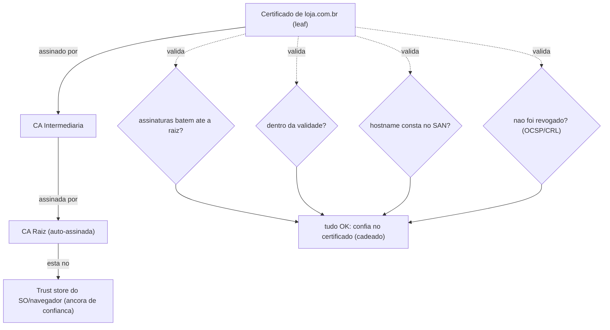

# HTTPS, TLS Handshake (1.2 vs 1.3) e Certificados: Cadeia de Confiança e a Anatomia da Conexão Segura

> **Bloco:** Redes e protocolos · **Nível:** Intermediário/Avançado · **Tempo de leitura:** ~30 min

## TL;DR

**HTTPS** é simplesmente **HTTP rodando dentro de um túnel TLS** — o HTTP não muda; o que muda é que os bytes da aplicação passam por uma camada de criptografia (entre L4 e L7). O **TLS** (Transport Layer Security) entrega três garantias: **confidencialidade** (ninguém no caminho lê o tráfego), **integridade** (ninguém altera os dados sem ser detectado) e **autenticação** (o cliente verifica que está mesmo falando com `loja.com.br`, e não com um impostor). Essas garantias são estabelecidas no **TLS handshake**, que combina **criptografia assimétrica** (para autenticar e trocar segredos com segurança, usando o **certificado X.509** do servidor) com **criptografia simétrica** (rápida, usada para cifrar os dados depois que uma **chave de sessão** foi acordada). A grande evolução prática é **TLS 1.2 vs TLS 1.3**: o 1.2 leva **2 RTTs** de handshake e ainda permite cifras legadas; o **1.3** (RFC 8446) reduz para **1 RTT** (e **0-RTT** em retomada de sessão), removeu algoritmos inseguros e tornou o **forward secrecy** obrigatório. A confiança no certificado vem da **cadeia de confiança (chain of trust)**: o certificado do servidor é assinado por uma **CA intermediária**, que é assinada por uma **CA raiz** que já está no **trust store** do sistema/navegador. Validar essa cadeia (assinaturas, validade, nome do host, revogação) é o que dá segurança ao "cadeado". O **mTLS** estende isso exigindo que **ambos** os lados apresentem certificado (ver `08/03`) — a base de identidade de workload em zero trust. Por fim, **TLS é a fundação de tudo**: HTTP/2 só roda sobre TLS na prática, e HTTP/3 (QUIC) **embute TLS 1.3** obrigatoriamente.

## O problema que resolve

A Internet é um meio **hostil e compartilhado**: entre o navegador do cliente e o servidor da loja há dezenas de saltos — o roteador Wi-Fi, o provedor, roteadores de backbone, possivelmente um proxy corporativo. Sem proteção, **qualquer** um desses pontos pode ler, modificar ou se passar pela outra ponta. Três ameaças concretas definem o problema:

1. **Eavesdropping (escuta):** alguém no caminho (Wi-Fi público, ISP, atacante) lê o tráfego em texto claro — vê a senha digitada, os dados do cartão, o conteúdo das páginas. HTTP puro é totalmente legível.
2. **Tampering (adulteração):** um intermediário **altera** os dados em trânsito — injeta scripts maliciosos numa página, troca o número da conta de destino numa transferência, insere anúncios. Sem integridade, não há como detectar.
3. **Impersonation / Man-in-the-Middle (falsificação de identidade):** um atacante se passa por `loja.com.br` (via DNS spoofing, ARP poisoning, rogue Wi-Fi) e intercepta tudo. Sem **autenticação**, o cliente não tem como saber que está falando com um impostor.

Criptografia sozinha não basta. Cifrar o canal resolve eavesdropping e tampering, **mas não impersonation**: de que adianta um canal perfeitamente cifrado se ele está cifrado *com o atacante*? Por isso o problema tem **três** dimensões inseparáveis — confidencialidade, integridade **e autenticação** — e é a autenticação (via certificados e cadeia de confiança) a parte mais sutil e a mais atacada.

Há ainda um problema de *desempenho* embutido: a criptografia robusta (assimétrica, RSA/ECDSA) é **cara computacionalmente**, e o handshake adiciona **round-trips** (latência) antes que qualquer dado útil trafegue. O design do TLS precisa, portanto, conciliar segurança forte com performance — e a história de TLS 1.2 → 1.3 é, em boa parte, a história de **reduzir RTTs e remover o que é inseguro**. A pergunta central: **"como estabelecer um canal confidencial, íntegro e autenticado entre duas partes que nunca se viram, sobre uma rede hostil, pagando o mínimo de latência?"**

## O que é (definição aprofundada)

### HTTPS = HTTP sobre TLS

**HTTPS** não é um protocolo novo: é **HTTP encapsulado em TLS**. A semântica HTTP (métodos, status, headers — ver HTTP/1.1-2-3) é idêntica; a diferença é que, antes de o HTTP trafegar, estabelece-se um **túnel TLS** e os bytes HTTP passam cifrados por ele. No modelo de camadas, o TLS senta **entre o transporte (L4, TCP/QUIC) e a aplicação (L7, HTTP)** — frequentemente associado às camadas de apresentação/sessão do OSI. A porta padrão é **443** (vs 80 do HTTP). Em HTTP/3, o TLS 1.3 é *embutido no QUIC*, não uma camada separada.

### As três garantias do TLS

- **Confidencialidade:** os dados são **cifrados** com criptografia **simétrica** (AES-GCM, ChaCha20-Poly1305) usando uma **chave de sessão** que só as duas pontas conhecem. Um espião vê apenas bytes embaralhados.
- **Integridade:** cada registro carrega um código de autenticação (MAC/AEAD) que detecta qualquer alteração; um byte trocado no caminho invalida o registro. As cifras modernas são **AEAD** (Authenticated Encryption with Associated Data), que unem confidencialidade e integridade num só algoritmo.
- **Autenticação:** o servidor prova sua identidade apresentando um **certificado X.509** assinado por uma CA confiável, e provando que possui a **chave privada** correspondente. (No mTLS, o cliente também.) É isso que impede o MITM.

### Simétrica + assimétrica: por que as duas

O TLS usa **criptografia híbrida**, e entender o porquê é central:

- **Criptografia assimétrica (chave pública/privada — RSA, ECDSA, Diffie-Hellman):** permite a duas partes que nunca trocaram segredos estabelecerem um, e permite **autenticar** (só quem tem a chave privada consegue provar a identidade do certificado). **Mas é lenta** — cara demais para cifrar todo o tráfego.
- **Criptografia simétrica (AES, ChaCha20):** usa **uma mesma chave** nos dois lados; é **muito rápida** (acelerada por hardware) — ideal para cifrar o volume de dados. **Mas** exige que ambos já compartilhem a chave secreta.

A solução: usa-se a **assimétrica no handshake** para **autenticar** e **acordar com segurança uma chave de sessão simétrica**; depois, todo o tráfego de dados usa a **simétrica** (rápida) com essa chave. O melhor dos dois mundos — segurança do estabelecimento + velocidade do transporte.

### Forward secrecy (PFS)

Um conceito decisivo: com **forward secrecy** (sigilo encaminhado), as chaves de sessão são geradas por um **Diffie-Hellman efêmero (ECDHE)** e **descartadas** após a sessão. Consequência: mesmo que a **chave privada do servidor seja comprometida no futuro**, o atacante **não consegue decifrar** sessões passadas que ele tenha gravado — porque a chave de sessão nunca foi transmitida nem derivada diretamente da chave privada. No TLS 1.2, forward secrecy era opcional (dependia da cifra escolhida; RSA key exchange *não* tinha PFS). No **TLS 1.3 é obrigatório** — todas as cifras usam ECDHE efêmero. Esse foi um dos maiores ganhos de segurança do 1.3.

### O TLS handshake — 1.2 vs 1.3

**TLS 1.2 (2 RTTs):**

1. **ClientHello** — o cliente envia versões de TLS suportadas, **cipher suites** (algoritmos) que aceita, e um random.
2. **ServerHello + Certificate + ServerKeyExchange + ServerHelloDone** — o servidor escolhe a cipher suite, envia seu **certificado** (a cadeia), os parâmetros de troca de chave e seu random.
3. **ClientKeyExchange + ChangeCipherSpec + Finished** — o cliente valida o certificado, contribui para a chave (ex.: ECDHE), e sinaliza que vai cifrar.
4. **ChangeCipherSpec + Finished** (servidor) — confirma. **Só então** os dados de aplicação fluem.

Isso são **2 round-trips** completos antes do primeiro byte HTTP — somados ao 1 RTT do handshake TCP, dá ~3 RTTs de setup. Em rede de alto RTT (móvel/internacional), é latência significativa. Além disso, o 1.2 ainda permitia muitas cifras antigas/fracas (RSA key exchange sem PFS, CBC, RC4, SHA-1), exigindo configuração cuidadosa para não ficar inseguro.

**TLS 1.3 (1 RTT, ou 0-RTT) — RFC 8446:**

O TLS 1.3 redesenhou o handshake para **1 RTT** e fez uma faxina de segurança:

1. **ClientHello** — agora o cliente já envia, *junto*, sua **chave pública efêmera (key share) ECDHE** e suas preferências (presumindo as cifras modernas comuns).
2. **ServerHello + Certificate + Finished** — o servidor responde já com seu key share, o certificado e o Finished; **a partir daqui o canal já está cifrado**, e os dados de aplicação podem ir no mesmo fluxo.

Resultado: **1 RTT** de handshake (vs 2 do 1.2). Em **retomada de sessão** (já se conectou antes, tem um PSK), o TLS 1.3 permite **0-RTT**: enviar dados de aplicação *já no primeiro pacote*. Além da latência, o 1.3 **removeu** algoritmos inseguros (RSA key exchange, CBC, RC4, MD5, SHA-1, renegociação, compressão TLS), **tornou forward secrecy obrigatório** e cifrou mais partes do handshake. É mais simples, mais rápido e mais seguro — adoção fortemente recomendada.

(Atenção ao **0-RTT**: ele é vulnerável a **replay attacks** — um atacante pode reenviar os dados 0-RTT capturados. Por isso só é seguro para requisições **idempotentes** (GET sem efeito colateral). Conecta diretamente com idempotência.)

### Certificados X.509 e a cadeia de confiança

O **certificado X.509** é o documento que **liga uma identidade (o domínio, ex.: `loja.com.br`) a uma chave pública**, e é **assinado** por uma autoridade. Campos relevantes: *subject* (a quem pertence), *SAN* (Subject Alternative Names — os domínios cobertos), chave pública, validade (não-antes/não-depois), emissor (a CA), e a **assinatura** da CA.

A **cadeia de confiança (chain of trust)** resolve "por que eu confiaria nesse certificado?". Funciona por delegação hierárquica:

- **CA Raiz (Root CA):** uma autoridade cujo certificado **auto-assinado** já está pré-instalado no **trust store** do sistema operacional/navegador (a lista de CAs em que confiamos por padrão — ex.: DigiCert, Let's Encrypt/ISRG, Sectigo). A raiz é a **âncora de confiança (trust anchor)**. Suas chaves privadas são guardadas offline, com extremo cuidado.
- **CA Intermediária:** a raiz **assina** certificados de CAs intermediárias, que ficam online e emitem os certificados de servidor do dia a dia. Esse nível existe para **proteger a raiz** (se uma intermediária for comprometida, revoga-se ela sem destruir a confiança em toda a raiz).
- **Certificado de servidor (leaf/end-entity):** o de `loja.com.br`, assinado por uma intermediária.

A validação que o navegador faz a cada conexão:

1. **Verifica a assinatura** de cada certificado pelo de cima: o leaf foi assinado pela intermediária? A intermediária pela raiz? Sobe a cadeia até chegar a uma **raiz no trust store**. Se chega, a cadeia é confiável; se não, erro.
2. **Verifica a validade** (datas não-antes/não-depois) de cada certificado — expirado = erro.
3. **Verifica o nome do host:** o domínio acessado (`loja.com.br`) consta nos **SAN** do certificado? Se não bate, erro (proteção contra usar um certificado válido de *outro* site).
4. **Verifica revogação:** o certificado não foi revogado (vazou a chave, foi mal emitido)? Mecanismos: **CRL** (lista de revogação) e **OCSP** (consulta online), com **OCSP stapling** (o servidor anexa a prova de não-revogação, evitando uma consulta extra do cliente).

Se tudo passa, o navegador confia no certificado, usa a chave pública dele para autenticar o servidor e seguir o handshake. É essa cadeia que o cadeado representa. Atalhos perigosos como "ignorar erro de certificado" ou "confiar em qualquer CA" quebram exatamente essa garantia.

### Glossário rápido

- **TLS / SSL:** Transport Layer Security; SSL é o nome antigo (SSL 2/3 obsoletos e inseguros).
- **HTTPS:** HTTP sobre TLS (porta 443).
- **Cipher suite:** conjunto de algoritmos negociados (troca de chave + cifra simétrica + hash). Ex.: `TLS_AES_128_GCM_SHA256`.
- **Handshake:** fase inicial que autentica e acorda a chave de sessão (2 RTT no 1.2, 1 RTT no 1.3).
- **Chave de sessão:** chave simétrica efêmera usada para cifrar os dados após o handshake.
- **AEAD:** cifra que une confidencialidade + integridade (AES-GCM, ChaCha20-Poly1305).
- **Forward secrecy (PFS):** chaves efêmeras (ECDHE); comprometer a chave do servidor não revela sessões passadas. Obrigatório no 1.3.
- **Certificado X.509 / SAN:** documento de identidade + domínios cobertos.
- **CA (raiz/intermediária):** autoridade que assina certificados; raiz é a âncora no trust store.
- **Cadeia de confiança:** sequência leaf → intermediária → raiz que valida a identidade.
- **CRL / OCSP / OCSP stapling:** mecanismos de revogação de certificados.
- **SNI:** Server Name Indication — o cliente diz no ClientHello *qual* host quer (permite vários domínios/certs no mesmo IP). **ESNI/ECH** cifra isso.
- **mTLS:** TLS mútuo — ambos os lados apresentam certificado (ver `08/03`).
- **ALPN:** negociação de protocolo de aplicação dentro do TLS (escolhe HTTP/2 vs /1.1).

## Como funciona

A vida de uma conexão HTTPS, juntando as peças (para `https://loja.com.br`):

1. **(Pré-requisito) DNS + TCP:** resolve-se o IP (DNS) e abre-se a conexão TCP (1 RTT). (Ver DNS e TCP. Em HTTP/3, TCP e TLS fundem-se no QUIC.)
2. **Handshake TLS:** cliente e servidor negociam a versão e a cipher suite, o servidor envia sua **cadeia de certificados**, o cliente **valida a cadeia** (assinaturas até a raiz, validade, hostname/SAN, revogação), e via **ECDHE** ambos derivam a mesma **chave de sessão** simétrica — sem nunca transmiti-la. No 1.3, isso é 1 RTT; no 1.2, 2 RTTs.
3. **Autenticação confirmada:** ao validar o certificado *e* o servidor provar posse da chave privada (implícito no handshake), o cliente sabe que fala com o `loja.com.br` legítimo. (No mTLS, o servidor também valida o cert do cliente.)
4. **Tráfego cifrado:** todo o HTTP subsequente trafega cifrado com a chave de sessão simétrica (AEAD). Espião vê só ruído; alteração é detectada.
5. **Retomada:** numa próxima conexão, **session resumption** (PSK no 1.3) evita refazer o handshake completo — possibilitando **0-RTT** (com a ressalva de replay para requisições não-idempotentes).

O ponto de performance que costura tudo: **cada RTT conta**. DNS (1 RTT) + TCP (1 RTT) + TLS (1-2 RTTs) **antes** do primeiro byte HTTP. Em rede de 100ms de RTT, isso pode somar 300-400ms só de setup. Daí o valor de: TLS **1.3** (corta 1 RTT do TLS), **session resumption/0-RTT**, **keep-alive** (amortiza setup em muitas requisições), e **QUIC/HTTP3** (funde TCP+TLS em 1 RTT). Otimizar HTTPS é, em grande parte, **reduzir round-trips de setup**.

Outro ponto operacional: **TLS termination**. Em produção, frequentemente um **load balancer/CDN/reverse proxy na borda** (ALB, Nginx, Cloudflare) **termina o TLS** (faz o handshake, decifra) e repassa o tráfego para os backends — que podem falar HTTP simples na rede interna *ou*, em zero trust, re-cifrar com **mTLS** entre serviços. Decidir *onde* o TLS termina (borda vs fim a fim) é uma escolha arquitetural com implicações de segurança e performance.

## Diagrama de fluxo

O primeiro diagrama mostra o handshake TLS 1.3 (1-RTT) e o contraste com o 1.2 (2-RTT); o segundo mostra a validação da cadeia de confiança.

```mermaid
sequenceDiagram
    participant C as "Cliente"
    participant S as "Servidor"
    Note over C,S: TLS 1.2 - 2 RTT
    C->>S: "ClientHello (cifras, random)"
    S->>C: "ServerHello + Certificate + KeyExchange"
    C->>S: "valida cert; ClientKeyExchange + Finished"
    S->>C: "Finished"
    Note over C,S: so agora dados de aplicacao (HTTP)
    Note over C,S: TLS 1.3 - 1 RTT
    C->>S: "ClientHello + key share ECDHE"
    S->>C: "ServerHello + key share + Certificate + Finished"
    C->>S: "Finished + ja envia HTTP (canal cifrado)"
    Note over C,S: 0-RTT em retomada (PSK) - cuidado com replay
```



## Exemplo prático / caso real

Cenário: o cliente acessa `https://loja.com.br` para comprar, e queremos seguir a segurança da conexão e suas decisões de arquitetura.

**O handshake e a validação que protegem o cartão.** Ao acessar a loja, o navegador, após DNS+TCP, inicia o **handshake TLS**. O servidor envia sua **cadeia de certificados** (leaf de `loja.com.br` + intermediária da CA, ex.: Let's Encrypt). O navegador **valida**: confere que a intermediária foi assinada pela raiz **ISRG Root X1** (que está no trust store), que o certificado está dentro da validade, que `loja.com.br` consta no **SAN**, e que não foi revogado. Só então deriva a chave de sessão (ECDHE, com forward secrecy) e exibe o cadeado. A partir daí, **os dados do cartão trafegam cifrados** — um atacante no Wi-Fi do café vê apenas ruído, não consegue alterar a requisição sem ser detectado, e não pode se passar pela loja (não tem a chave privada do certificado). Os três problemas — escuta, adulteração, impersonation — resolvidos.

**Ataque MITM que falha graças à autenticação.** Um atacante na mesma rede tenta um **man-in-the-middle**: envenena o ARP/DNS para que o tráfego de `loja.com.br` passe por ele, e apresenta ao cliente um **certificado próprio** dizendo ser a loja. A defesa funciona: o certificado do atacante **não é assinado por nenhuma CA do trust store** (ele não consegue forjar a assinatura de uma CA confiável sem a chave privada dela). O navegador exibe um **erro de certificado grande e assustador**, e o usuário não prossegue. É exatamente para isso que a cadeia de confiança e a autenticação existem — cifrar sem autenticar deixaria o canal "seguro com o atacante".

**TLS 1.3 cortando latência no celular.** O público da loja é majoritariamente **móvel** (4G, RTT alto ~80ms). Migrar de TLS 1.2 (2 RTT) para **TLS 1.3 (1 RTT)** corta um round-trip inteiro do setup — ~80ms a menos antes do primeiro byte, perceptível na sensação de rapidez. Em visitas repetidas, **session resumption** (0-RTT) acelera ainda mais (com cuidado: a loja só permite 0-RTT para requisições idempotentes como `GET`, nunca para o `POST` de finalização de pedido, por causa de replay). Migrar para **HTTP/3 (QUIC)** vai além, fundindo o handshake TCP+TLS em 1 RTT só. (Ver HTTP/3.)

**TLS termination na borda + mTLS interno.** Em produção, a loja **termina o TLS no CDN/load balancer da borda** (que faz o handshake pesado e decifra), aliviando os backends. Mas o tráfego **leste-oeste** entre os microsserviços internos (`checkout` → `payments` → `pricing`) não fica em texto claro: ele é re-cifrado com **mTLS** via service mesh, onde *ambos* os lados apresentam certificado de workload e se autenticam mutuamente — a base de zero trust. Assim, a borda otimiza performance externa e o mTLS garante identidade e cifragem internas. (Ver `08-seguranca-arquitetural/03-mtls-entre-servicos.md`.)

## Quando usar / Quando evitar

**Use HTTPS/TLS: sempre, sem exceção, para qualquer tráfego.** Não existe mais justificativa para HTTP em texto claro na Internet pública — navegadores marcam sites HTTP como "Não seguro", e até conteúdo "público" (notícias, blogs) merece integridade (impedir injeção de scripts/anúncios pelo caminho). Use **TLS 1.3** como padrão; mantenha 1.2 só para compatibilidade com clientes muito antigos; **desabilite** SSL 2/3, TLS 1.0/1.1 (inseguros). Use **certificados automatizados** (Let's Encrypt/ACME) para renovação sem dor.

**Use mTLS** para **tráfego serviço-a-serviço (leste-oeste)** em zero trust, onde a identidade do *workload* precisa ser provada criptograficamente — tipicamente via service mesh, que automatiza a PKI. (Ver `08/03`.) **Evite** mTLS para autenticar *usuários finais* em larga escala (gestão de certificados por usuário é impraticável; use tokens/OAuth para usuários, mTLS para serviços).

**Use 0-RTT (TLS 1.3)** para acelerar retomadas, **mas apenas para requisições idempotentes** (GET sem efeito colateral). **Evite** 0-RTT em operações que mudam estado (POST de pagamento) — o risco de replay attack é real.

**Evite** anti-práticas: desabilitar validação de certificado "para funcionar", confiar em CAs desnecessárias, certificados auto-assinados em produção pública, ou cifras/versões legadas por inércia. Cada uma dessas reabre exatamente os buracos que o TLS fecha.

## Anti-padrões e armadilhas comuns

- **Desabilitar a validação de certificado.** "Funcionava em dev com self-signed, então pus `verify=False`/`InsecureSkipVerify` em produção." Isso **anula a autenticação** e reabre o MITM — o canal fica cifrado *com o atacante*. Nunca desabilite validação; configure o trust store corretamente.
- **Confundir criptografia com autenticação.** Um canal cifrado sem autenticar a outra ponta é inútil contra MITM. As três garantias (confidencialidade, integridade, autenticação) são inseparáveis; a autenticação (cadeia de confiança) é a que pega o impostor.
- **Certificado expirado / cadeia incompleta.** Esquecer de renovar (expiração) ou **não enviar a intermediária** (o servidor manda só o leaf, e clientes sem a intermediária em cache falham) são as causas mais comuns de "erro de certificado em produção". Automatize a renovação (ACME) e configure a cadeia completa.
- **Hostname não bate (SAN errado).** Certificado emitido para `www.loja.com.br` mas acessado como `loja.com.br` (ou vice-versa), ou faltando o domínio no SAN. Inclua todos os nomes/wildcards corretos.
- **Usar versões/cifras legadas.** Manter SSL 3, TLS 1.0/1.1, RSA key exchange (sem forward secrecy), RC4, CBC por "compatibilidade". São vetores de ataques conhecidos (POODLE, BEAST, etc.). Use TLS 1.3 (ou 1.2 bem configurado), só cifras AEAD com PFS.
- **0-RTT em requisições não-idempotentes.** Usar 0-RTT do TLS 1.3 para um POST de pagamento permite **replay attack** (reenvio dos dados capturados). Restrinja 0-RTT a GETs idempotentes.
- **Ignorar revogação.** Não configurar OCSP stapling deixa o cliente fazer (ou pular) a checagem de revogação, ou aceitar certificados que deveriam estar revogados. Configure OCSP stapling.
- **Achar que TLS protege dados em repouso ou na aplicação.** TLS protege **em trânsito**, ponto. Não cifra dados no banco, não autoriza ações (isso é OAuth/RBAC), não protege contra XSS/SQLi. É uma peça, não a segurança inteira.
- **TLS termination sem repensar o tráfego interno.** Terminar TLS na borda e deixar o tráfego leste-oeste em **texto claro** dentro do cluster contraria zero trust (movimento lateral). Re-cifre com mTLS internamente. (Ver `08/03`.)
- **MTLS para usuários finais.** Tentar gerenciar certificados por usuário não escala. mTLS é para identidade de *serviço*; usuários autenticam com tokens/OAuth.
- **Esquecer o custo de RTT do handshake.** Tratar HTTPS como "de graça" ignora que cada conexão nova paga RTTs de DNS+TCP+TLS. Amortize com keep-alive, resumption, TLS 1.3 e HTTP/2-3. (Ver latência/percentis.)

## Relação com outros conceitos

- **mTLS entre serviços:** o mTLS estende o TLS exigindo certificado de *ambos* os lados, base de identidade de workload e zero trust; a PKI/cadeia de confiança aqui é a mesma mecânica. Ver `08-seguranca-arquitetural/03-mtls-entre-servicos.md`.
- **Modelo OSI e TCP/IP:** TLS senta entre L4 (transporte) e L7 (aplicação); HTTPS é HTTP encapsulado em TLS. Ver `16-redes-e-protocolos/01-modelo-osi-e-tcp-ip.md`.
- **TCP vs UDP:** o handshake TLS roda *após* o handshake TCP (RTTs somados); em QUIC, TLS 1.3 é embutido sobre UDP. Ver `16-redes-e-protocolos/02-tcp-vs-udp.md`.
- **HTTP/1.1, HTTP/2, HTTP/3:** HTTP/2 só roda sobre TLS na prática (ALPN negocia a versão); HTTP/3 **embute TLS 1.3 obrigatoriamente** no QUIC, fundindo handshakes. Ver `16-redes-e-protocolos/03-http1-http2-http3-quic.md`.
- **DNS:** a resolução de nomes (e DNSSEC) precede o handshake; o SNI revela o host no handshake (ECH/ESNI o cifra), e DoT/DoH cifram o próprio DNS com TLS. Ver `16-redes-e-protocolos/05-dns-resolution.md`.
- **Idempotência:** o 0-RTT do TLS 1.3 só é seguro para requisições idempotentes (risco de replay). Ver `04-sistemas-distribuidos/04-idempotencia-e-semanticas-de-entrega.md`.
- **Load balancing / TLS termination:** balanceadores/CDNs terminam o TLS na borda; a decisão borda vs fim a fim é arquitetural. Ver `04-sistemas-distribuidos/07-service-discovery-e-load-balancing.md`.
- **Secrets management:** chaves privadas de certificados são segredos críticos que precisam de gestão/rotação segura. Ver `08-seguranca-arquitetural/05-secrets-management-vault-kms.md`.

## Modelo mental para o arquiteto

Três ideias para carregar:

1. **TLS dá três garantias inseparáveis: confidencialidade, integridade e autenticação — e a autenticação é a que importa contra MITM.** Cifrar sem autenticar é cifrar *com o atacante*. A **cadeia de confiança** (leaf → intermediária → raiz no trust store) é o que prova "você está mesmo falando com `loja.com.br`". Nunca desabilite a validação.
2. **Híbrido por design: assimétrica para autenticar e acordar a chave, simétrica para cifrar os dados.** O handshake usa criptografia cara (assimétrica/ECDHE) só para estabelecer com segurança uma **chave de sessão** simétrica (rápida), que então cifra todo o tráfego. Forward secrecy (efêmero) protege sessões passadas mesmo se a chave do servidor vazar — obrigatório no TLS 1.3.
3. **A história de TLS 1.2 → 1.3 é reduzir RTTs e remover o inseguro.** 1.2 = 2 RTT e cifras legadas; 1.3 = 1 RTT (0-RTT em retomada), forward secrecy obrigatório, algoritmos fracos removidos. Otimizar HTTPS é, em grande parte, **cortar round-trips de setup** (1.3, resumption, keep-alive, HTTP/3).

## Pontos para fixar (revisão)

- **HTTPS = HTTP sobre TLS** (porta 443); o TLS senta entre L4 e L7.
- TLS garante **confidencialidade + integridade + autenticação**; a autenticação (cadeia de confiança) é a defesa contra **MITM**.
- **Híbrido:** assimétrica (RSA/ECDSA/ECDHE) autentica e acorda a **chave de sessão**; simétrica (AES-GCM/ChaCha20, AEAD) cifra os dados (rápida).
- **Forward secrecy** (ECDHE efêmero): comprometer a chave do servidor não revela sessões passadas. **Obrigatório no TLS 1.3.**
- **Handshake:** TLS 1.2 = **2 RTT**; TLS 1.3 = **1 RTT** (e **0-RTT** em retomada, só para requisições **idempotentes** por causa de replay). 1.3 removeu cifras inseguras.
- **Cadeia de confiança:** leaf (servidor) → CA intermediária → CA raiz (âncora no **trust store**). Validação = assinaturas até a raiz + validade + hostname/SAN + revogação (OCSP/CRL).
- **Nunca desabilite a validação de certificado**; sempre envie a **cadeia completa** (incluindo intermediária); automatize renovação (ACME/Let's Encrypt).
- **mTLS** = ambos os lados com certificado (identidade de workload, zero trust — ver `08/03`); **TLS termination** na borda + mTLS interno é o padrão comum.
- HTTP/2 só roda sobre TLS na prática; **HTTP/3 embute TLS 1.3 obrigatoriamente** no QUIC.

## Referências

- [RFC 8446 — The Transport Layer Security (TLS) Protocol Version 1.3](https://datatracker.ietf.org/doc/html/rfc8446)
- [What happens in a TLS handshake? — Cloudflare Learning Center](https://www.cloudflare.com/learning/ssl/what-happens-in-a-tls-handshake/)
- [What is Transport Layer Security (TLS)? — Cloudflare Learning Center](https://www.cloudflare.com/learning/ssl/transport-layer-security-tls/)
- [A Detailed Look at RFC 8446 (a.k.a. TLS 1.3) — Cloudflare Blog](https://blog.cloudflare.com/rfc-8446-aka-tls-1-3/)
- [Transport Layer Security (TLS) — MDN Web Docs](https://developer.mozilla.org/en-US/docs/Web/Security/Transport_Layer_Security)
- [Transport Layer Security (TLS) — High Performance Browser Networking (Ilya Grigorik)](https://hpbn.co/transport-layer-security-tls/)
- [What is an SSL certificate? — Cloudflare Learning Center](https://www.cloudflare.com/learning/ssl/what-is-an-ssl-certificate/)
