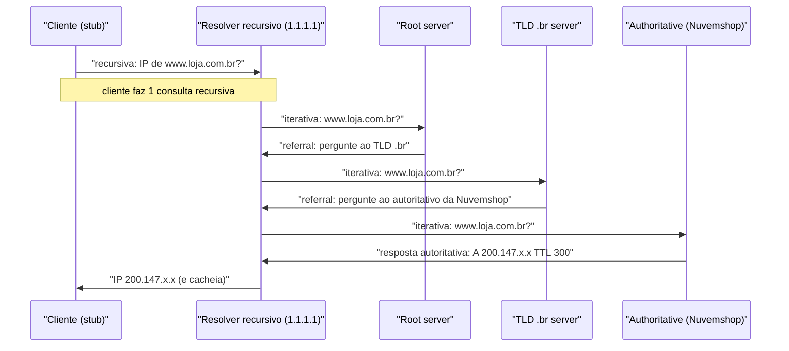
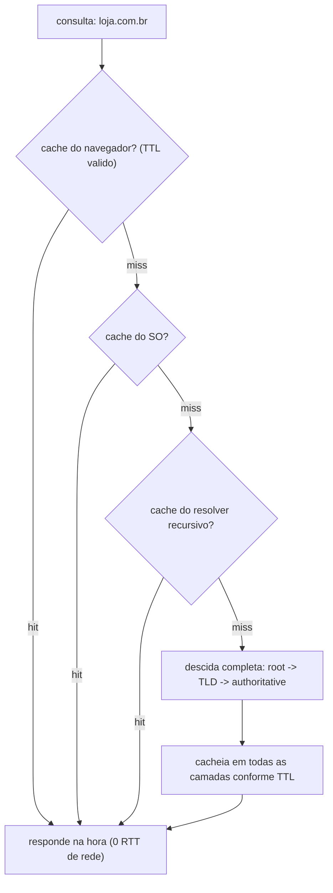

# DNS Resolution Passo a Passo: Recursivo/Iterativo, Root/TLD/Authoritative, Caching e TTL

> **Bloco:** Redes e protocolos · **Nível:** Intermediário/Avançado · **Tempo de leitura:** ~28 min

## TL;DR

O **DNS (Domain Name System)** é a "agenda de contatos da Internet": traduz nomes que humanos lembram (`loja.com.br`) nos endereços IP que as máquinas usam (`200.147.x.x`). É um **banco de dados hierárquico, distribuído e fortemente cacheado** — talvez o sistema distribuído mais bem-sucedido da história, resolvendo trilhões de consultas por dia. A resolução envolve quatro atores: o **resolver recursivo** (o "concierge", geralmente do seu ISP ou público como `8.8.8.8`/`1.1.1.1`, que faz o trabalho *por você*), os **root servers** (13 conjuntos, o topo da hierarquia, que apontam para o TLD certo), os **TLD servers** (`.com`, `.br`, `.org` — que apontam para o servidor autoritativo do domínio) e os **authoritative servers** (que têm a *resposta definitiva* daquele domínio). A distinção crucial é **recursivo vs iterativo**: o cliente faz uma única consulta **recursiva** ao resolver ("me dê a resposta final, resolva tudo"), e o resolver faz consultas **iterativas** mundo afora (root → TLD → authoritative), cada servidor respondendo "eu não sei, mas pergunte àquele ali". O que torna isso rápido e escalável é o **caching agressivo em todas as camadas** (navegador, SO, resolver), governado pelo **TTL (Time To Live)** — quanto tempo cada resposta pode ser reutilizada antes de reconsultar. O TTL é uma faca de dois gumes: alto reduz carga e latência mas **atrasa mudanças** (failover, troca de IP); baixo dá agilidade mas aumenta consultas. Entender DNS é entender o **primeiro passo de toda comunicação** (DNS → TCP → TLS → HTTP) e uma das fontes mais comuns — e mais traiçoeiras — de incidentes ("it's always DNS").

## O problema que resolve

Computadores se comunicam por **endereços IP** (`200.147.67.142`, ou um IPv6 ainda mais ilegível). Humanos não conseguem — e não deveriam — memorizar números para cada serviço que usam. Precisamos de **nomes**: `loja.com.br`, `google.com`, `api.empresa.com`. O problema, então, é mapear nomes legíveis em endereços roteáveis. Uma solução ingênua seria um **arquivo central** com todos os nomes e IPs (foi literalmente assim no início da ARPANET: um arquivo `HOSTS.TXT` distribuído manualmente). Isso não escala por razões óbvias:

1. **Escala:** com bilhões de nomes mudando o tempo todo, um arquivo/servidor central seria gigantesco, sempre desatualizado e um gargalo impossível.
2. **Administração descentralizada:** a Nuvemshop quer gerenciar os nomes sob `*.nuvemshop.com.br` **sem pedir permissão** a uma autoridade central a cada mudança. Cada organização precisa de autonomia sobre seu próprio espaço de nomes.
3. **Disponibilidade e latência:** o sistema não pode ter um ponto único de falha, e a tradução precisa ser **rápida** (acontece antes de *cada* conexão) e resiliente a falhas regionais.
4. **Atualização:** IPs mudam (migração de servidor, failover, escala em nuvem). O mapeamento precisa propagar mudanças — mas de forma controlada, sem reconsultar a origem a cada acesso.

A resposta do DNS é uma combinação elegante de três ideias: **hierarquia** (o espaço de nomes é uma árvore, delegável por níveis — raiz, TLD, domínio), **distribuição** (cada nível é servido por servidores diferentes, administrados por entidades diferentes — ninguém precisa saber tudo) e **caching com TTL** (respostas são reutilizadas por um tempo, reduzindo drasticamente a carga e a latência). É isso que permite ao DNS resolver volumes astronômicos de consultas com latência de milissegundos. A pergunta central: **"como traduzir, de forma escalável, descentralizada, rápida e atualizável, qualquer um dos bilhões de nomes da Internet no seu endereço IP atual?"** — e, para o arquiteto, *como o caching/TTL afeta failover, deploys e a latência da primeira conexão*.

## O que é (definição aprofundada)

### A hierarquia de nomes (a árvore invertida)

O espaço de nomes do DNS é uma **árvore hierárquica**, lida **da direita para a esquerda**. Em `www.loja.com.br.`:

- O **`.`** final (geralmente omitido) é a **raiz (root)** — o topo da árvore.
- **`br`** é o **TLD (Top-Level Domain)** — neste caso um ccTLD (country-code, Brasil); outros são gTLDs como `com`, `org`, `net`.
- **`com`** sob `br` é um domínio de segundo nível (no Brasil, `com.br` é gerido pelo Registro.br).
- **`loja`** é o domínio registrado (o que a empresa controla).
- **`www`** é um subdomínio/host dentro de `loja.com.br`.

Cada nível **delega autoridade** ao nível abaixo: a raiz delega `.br` ao Registro.br; este delega `loja.com.br` à Nuvemshop, que então gerencia tudo abaixo (`www`, `api`, `loja`...) livremente. Essa delegação é o que dá **autonomia administrativa** e permite o sistema escalar — ninguém precisa de uma visão global.

Uma **zona** é uma porção contígua da árvore sob administração de uma entidade, servida por seus **servidores autoritativos**.

### Os quatro atores da resolução

- **Resolver recursivo (recursive resolver / DNS recursor):** o intermediário que faz o trabalho **em nome do cliente**. Tipicamente fornecido pelo **ISP**, ou um público como **Google `8.8.8.8`** ou **Cloudflare `1.1.1.1`**. O cliente faz *uma* pergunta a ele ("qual o IP de `loja.com.br`?") e o resolver se vira para descobrir, consultando os servidores autoritativos e cacheando o resultado. É o "concierge" da resolução.
- **Root nameservers (servidores raiz):** o topo da hierarquia. Há **13 identidades** de servidores raiz (de `a.root-servers.net` a `m`), replicadas mundialmente via **anycast** em centenas de instâncias físicas. Eles **não conhecem o IP do seu site** — só sabem **para qual servidor TLD encaminhar** (sabem onde estão os servidores do `.br`, do `.com`, etc.). São a âncora: todo resolver já vem com os IPs dos roots embutidos.
- **TLD nameservers (servidores de TLD):** responsáveis por um top-level domain (`.com`, `.br`, `.org`). Também **não conhecem o IP final** — sabem **qual servidor autoritativo** é responsável por cada domínio sob aquele TLD (sabem que `loja.com.br` é servido pelos nameservers da Nuvemshop).
- **Authoritative nameservers (servidores autoritativos):** têm a **resposta definitiva** para a zona que administram. É o servidor que de fato guarda o registro "`loja.com.br` → `200.147.x.x`". A resposta dele é **autoritativa** (a fonte da verdade), não cacheada.

### Recursivo vs iterativo: a distinção que confunde todo mundo

Esta é a parte mais incompreendida do DNS, e a mais cobrada:

- **Consulta recursiva:** o cliente (navegador/SO, via *stub resolver*) pergunta ao **resolver recursivo** e espera **a resposta final completa** — "resolva tudo e me dê o IP". O cliente delega *todo* o trabalho. É uma única ida-e-volta da perspectiva do cliente.
- **Consultas iterativas:** é o que o **resolver recursivo faz por trás** para cumprir a consulta recursiva. Ele pergunta a cada servidor da hierarquia, um de cada vez, e cada um responde **"eu não sei, mas pergunte àquele outro ali"** (uma *referral*). O root diz "pergunte ao TLD `.br`"; o TLD `.br` diz "pergunte ao autoritativo da Nuvemshop"; o autoritativo finalmente responde o IP. O resolver **itera** descendo a hierarquia até obter a resposta.

A frase para fixar: **o cliente faz UMA consulta recursiva; o resolver faz VÁRIAS consultas iterativas em nome dele.** O resolver é quem carrega o fardo de percorrer a árvore — e é por isso que o caching nele é tão valioso (uma resolução cara feita uma vez serve milhares de clientes).

### Caching e TTL — o que faz o DNS escalar

Se cada consulta percorresse root → TLD → authoritative, o sistema (e especialmente os root servers) colapsaria sob a carga. O que salva é o **caching em todas as camadas**, governado pelo **TTL (Time To Live)**:

- Cada registro DNS tem um **TTL** (em segundos): por quanto tempo a resposta pode ser **cacheada e reutilizada** antes de precisar reconsultar a origem. Ex.: TTL 3600 = cacheie por 1 hora.
- O **cache acontece em várias camadas**, da mais perto à mais longe do cliente:
  - **Cache do navegador** (o Chrome mantém seu próprio).
  - **Cache do SO / stub resolver** (o resolvedor local da máquina).
  - **Cache do resolver recursivo** (o mais importante — serve todos os clientes do ISP/público). Cacheia inclusive respostas intermediárias (os NS dos TLDs, etc.).
- Enquanto o TTL não expira, a resposta vem do cache — **latência quase zero e nenhuma carga na hierarquia**. A vasta maioria das consultas é resolvida por cache; só uma fração chega aos autoritativos, e quase nada aos roots.

O **TTL é um trade-off central de arquitetura**, não um detalhe:

- **TTL alto** (horas/dias): menos consultas, menos carga, menor latência média (cache quente). **Mas**: mudanças demoram a propagar — se você trocar o IP do servidor (migração, failover), os clientes continuarão indo ao IP velho **até o TTL expirar** em todos os caches. Pode significar horas de tráfego indo para o lugar errado.
- **TTL baixo** (segundos/minutos): mudanças propagam rápido (bom para failover ágil, blue-green, balanceamento por DNS). **Mas**: muito mais consultas (cache "frio"), mais carga e latência. E há um limite: caches podem **não respeitar** TTLs muito baixos.

A regra prática: **baixe o TTL *antes* de uma mudança planejada** (migração, troca de IP) para que a propagação seja rápida, e suba de novo depois. TTL é a alavanca que governa a tensão entre **estabilidade/performance** e **agilidade de mudança**.

### Tipos de registro (records) essenciais

A resposta do DNS não é só "nome → IP"; há vários tipos de **resource records (RR)**:

- **A:** mapeia nome → endereço **IPv4**.
- **AAAA:** mapeia nome → endereço **IPv6**.
- **CNAME:** **alias** (apelido) — `www.loja.com.br` é um CNAME para `loja.com.br`; a resolução segue o alias. Útil para apontar para CDNs/serviços gerenciados.
- **NS:** indica os **nameservers autoritativos** de uma zona (é o que materializa a delegação).
- **MX:** servidores de **e-mail** do domínio (com prioridade).
- **TXT:** texto arbitrário — usado para SPF/DKIM/DMARC (e-mail), verificação de propriedade, etc.
- **SOA:** Start of Authority — metadados da zona (serial, TTLs padrão).
- **PTR:** DNS reverso (IP → nome).
- **CAA:** quais CAs podem emitir certificados para o domínio (segurança).
- **SVCB/HTTPS:** registros modernos que anunciam capacidades do serviço (ex.: suporte a HTTP/3, parâmetros de conexão) — conecta com a negociação de HTTP/3.

### Glossário rápido

- **DNS:** sistema hierárquico/distribuído que mapeia nomes em IPs (e outros records).
- **Resolver recursivo (recursor):** faz a resolução completa em nome do cliente; cacheia.
- **Stub resolver:** o cliente DNS leve no SO que apenas pergunta ao recursivo.
- **Root / TLD / authoritative:** os três níveis de servidores na hierarquia de resolução.
- **Recursivo vs iterativo:** cliente→resolver = recursivo (resolva tudo); resolver→hierarquia = iterativo (referrals).
- **Referral:** resposta "não sei, pergunte àquele servidor" (com registros NS).
- **Zona:** porção da árvore sob uma administração, servida por autoritativos.
- **TTL:** tempo que uma resposta pode ser cacheada antes de reconsultar.
- **Record types:** A, AAAA, CNAME, NS, MX, TXT, SOA, CAA, SVCB/HTTPS.
- **Anycast:** mesmo IP anunciado de vários lugares; a rede entrega ao mais próximo (resiliência/latência dos roots e resolvers).
- **DoT / DoH:** DNS over TLS / over HTTPS — DNS cifrado (privacidade).
- **DNSSEC:** assinaturas que garantem **integridade/autenticidade** das respostas DNS (contra spoofing).

## Como funciona

A resolução de `www.loja.com.br`, passo a passo, na primeira vez (cache frio em tudo):

1. **Cliente → resolver (recursiva):** o navegador/SO consulta seu **resolver recursivo** (ex.: `1.1.1.1`): "qual o IP de `www.loja.com.br`?". Antes, verifica os caches locais (navegador, SO) — se houver hit, responde na hora e nada disso acontece.
2. **Resolver → root (iterativa):** o resolver, sem cache, pergunta a um **root server**. O root responde: "não sei o IP, mas o TLD `.br` é servido por estes NS aqui" (referral para os servidores do `.br`).
3. **Resolver → TLD `.br` (iterativa):** o resolver pergunta ao **servidor TLD do `.br`**. Ele responde: "não sei o IP, mas `loja.com.br` é servido pelos autoritativos da Nuvemshop, aqui estão os NS deles" (referral).
4. **Resolver → authoritative (iterativa):** o resolver pergunta ao **servidor autoritativo** da Nuvemshop. Ele responde com a **resposta autoritativa**: "`www.loja.com.br` → `200.147.x.x` (record A), TTL 300".
5. **Resolver → cliente:** o resolver **cacheia** a resposta (e as intermediárias, conforme seus TTLs) e devolve o IP ao cliente.
6. **Caches preenchidos:** o navegador e o SO também cacheiam. Nas próximas consultas (dentro do TTL), a resposta vem do cache — **sem tocar a hierarquia**.

A observação de escala: o passo 2-4 (a "descida" completa) acontece **raramente**, porque o caching no resolver curtocircuita quase tudo. Milhões de clientes que usam o mesmo resolver `1.1.1.1` compartilham seu cache — a primeira pessoa a resolver `loja.com.br` paga a descida completa; as seguintes (dentro do TTL) pegam do cache. E os passos para a raiz são ainda mais raros: o resolver cacheia os NS dos TLDs por muito tempo, então quase nunca precisa perguntar a um root. Por isso os 13 roots aguentam a Internet inteira.

**Transporte:** o DNS roda primariamente sobre **UDP porta 53** — consultas e respostas são pequenas e cabem num datagrama, e a ausência de handshake torna a resolução rápida (1 ida-e-volta em vez dos 3 do TCP). Se a resposta for grande demais para um datagrama (muitos registros, DNSSEC), há **fallback para TCP** (também porta 53). Modernamente, **DoT (DNS over TLS, porta 853)** e **DoH (DNS over HTTPS, porta 443)** cifram o DNS para privacidade — historicamente o DNS era texto claro, e qualquer um no caminho via (e podia manipular) suas consultas. (Conecta com TCP/UDP e com TLS.)

**Onde a latência mora:** numa conexão "fria", a resolução DNS é o **primeiro custo de RTT** da jornada DNS → TCP → TLS → HTTP. Um cache miss que precise descer a hierarquia pode somar dezenas a centenas de ms. É por isso que a resolução aparece em ferramentas de performance (o "DNS lookup time" no waterfall do navegador) e por que técnicas como **DNS prefetch** (resolver nomes antecipadamente) existem.

## Diagrama de fluxo

O primeiro diagrama mostra a resolução completa (recursiva do cliente, iterativa do resolver); o segundo mostra o efeito do caching/TTL em consultas subsequentes.

## Exemplo prático / caso real

Cenário: a **Nuvemshop e uma loja virtual brasileira**, ilustrando tanto a resolução quanto as armadilhas operacionais do DNS — que são causa frequente de incidentes reais.

**A primeira coisa que acontece ao abrir a loja.** Quando o cliente digita `loja.com.br`, **antes de qualquer TCP, TLS ou HTTP**, o navegador resolve o nome via DNS. Se for cache hit (já visitou recentemente), é instantâneo. Se for miss, o resolver desce root → `.br` → autoritativo da loja, retornando o IP em (digamos) 40ms. Só então começa o handshake TCP, depois TLS, depois HTTP. Esse "DNS lookup" é o primeiro item do waterfall de carregamento — e um DNS lento (resolver ruim, TTL frio, autoritativo distante) atrasa *tudo* o que vem depois. Lojas com público global costumam usar DNS com **anycast** e baixa latência (Route 53, Cloudflare DNS) justamente para que esse primeiro passo seja rápido em qualquer região.

**O incidente clássico: TTL alto atrapalhando o failover.** A loja precisa **migrar de servidor** (trocar o IP de `200.147.x.x` para `54.x.x.x`). A equipe atualiza o record A no autoritativo, mas esquece um detalhe: o **TTL estava em 86400 (24h)**. Resultado: por até **24 horas**, resolvers e caches no mundo todo continuam entregando o **IP velho** — clientes vão para o servidor desativado e veem erro, *mesmo* com o DNS "já corrigido". O incidente se arrasta porque não há como "limpar" todos os caches da Internet; só resta esperar o TTL expirar. **A prática correta:** *dias antes* da migração, baixar o TTL para 60-300s; fazer a troca (que então propaga em minutos); e só depois restaurar o TTL alto. TTL é planejamento, não configuração esquecida.

**Balanceamento e failover por DNS.** A loja usa **DNS para distribuir carga**: o autoritativo retorna IPs diferentes para clientes diferentes (round-robin, ou geo-DNS que devolve o data center mais próximo, ou latency-based routing). Para **failover**, health checks no provedor de DNS (ex.: Route 53) **removem automaticamente** o IP de um servidor que caiu das respostas — mas a velocidade do failover é limitada pelo **TTL** (clientes com a resposta cacheada do IP morto só trocam quando o TTL expira). Por isso, para failover ágil via DNS, usa-se **TTL baixo** — aceitando o custo de mais consultas. (Conecta com load balancing: DNS é uma forma de LB de camada de nomes, complementar aos LBs L4/L7.)

**Por que DNS sobre UDP, e quando vira TCP.** As consultas da loja são pequenas e usam **UDP/53** — rápido, sem handshake, ideal para o volume. Mas quando a loja habilita **DNSSEC** (assinaturas que impedem spoofing/cache poisoning) ou tem muitos registros, as respostas podem exceder o tamanho de um datagrama UDP, e o DNS faz **fallback para TCP/53**. Além disso, para proteger a privacidade dos clientes, navegadores cada vez mais usam **DoH (DNS over HTTPS)**, cifrando as consultas — antes, o ISP via cada site que o cliente resolvia.

**"It's always DNS".** O bordão da operação tem fundo real: porque o DNS é o primeiro passo de tudo e é fortemente cacheado, problemas de DNS são **intermitentes e confusos** — funciona para uns (cache quente do IP certo) e falha para outros (cache do IP errado, ou resolver diferente), a propagação é lenta e desigual, e o sintoma ("site fora do ar") não aponta para a causa (DNS). Migrações com TTL alto, records mal configurados (CNAME apontando para o lugar errado, falta de registro AAAA quebrando IPv6), zona expirada, ou nameserver fora do ar derrubam serviços de formas difíceis de diagnosticar. Ferramentas: `dig`/`nslookup` (consultar diretamente um servidor específico, ver TTL restante), `dig +trace` (simular a descida iterativa), e checar TTL antes de qualquer mudança.

## Quando usar / Quando evitar

DNS não é "opcional" — toda comunicação por nome passa por ele. Aqui "quando usar" significa decisões de *como* usar DNS arquiteturalmente.

**Use TTL alto** (horas) para registros **estáveis** que raramente mudam (o IP fixo de um serviço de longa duração), maximizando cache e minimizando carga/latência. **Use TTL baixo** (segundos/minutos) quando precisar de **agilidade de mudança**: failover via DNS, balanceamento dinâmico, migrações iminentes, blue-green. Lembre da regra: **baixe o TTL antes de mudanças planejadas**.

**Use DNS para balanceamento/failover geográfico** (geo-DNS, latency-based, round-robin) quando quiser rotear clientes para o data center/região certa **antes mesmo da conexão** — complementar aos LBs L4/L7. **Evite** depender *só* de DNS para failover rápido: a granularidade do TTL e os caches que não o respeitam tornam o failover por DNS mais lento e menos preciso que um LB/health check no nível de conexão. Use DNS para roteamento grosso (região) e LBs para failover fino.

**Use DNSSEC** quando integridade/autenticidade das respostas importa (evitar cache poisoning/spoofing que redireciona usuários para servidores maliciosos) — especialmente em domínios sensíveis (bancos, governo). **Use DoT/DoH** para privacidade das consultas dos usuários.

**Evite** TTLs extremamente baixos como padrão (sobrecarregam resolvers e autoritativos, e muitos caches ignoram); **evite** cadeias longas de CNAME (cada salto é uma resolução extra, somando latência); **evite** tratar propagação de DNS como instantânea (ela é governada por TTLs em caches que você não controla).

## Anti-padrões e armadilhas comuns

- **TTL alto na hora de uma migração/failover.** O incidente clássico: trocar o IP com TTL de 24h faz o IP velho ser servido por até 24h, prolongando o outage. **Sempre baixe o TTL antes** de mudanças planejadas e restaure depois.
- **Achar que "propagação de DNS" é instantânea.** Mudanças não propagam na hora — elas propagam conforme os **TTLs expiram** em caches espalhados pelo mundo que você não controla. Planeje a janela de propagação com base no TTL anterior.
- **Tentar "limpar o cache da Internet".** Não existe. Você só controla seus caches locais (`ipconfig /flushdns`, etc.); os resolvers do mundo só atualizam quando o TTL expira. Por isso o TTL pré-mudança é a única alavanca real.
- **Cadeias de CNAME profundas.** Cada CNAME exige uma resolução adicional (seguir o alias), somando RTTs. CNAMEs aninhados (alias para alias para alias) degradam a latência da primeira conexão. Aplaine quando possível; use ALIAS/ANAME no apex se o provedor suportar.
- **CNAME no apex do domínio (zona).** O padrão DNS **proíbe** CNAME no apex (`loja.com.br` "puro", sem subdomínio), porque o apex precisa coexistir com SOA/NS. Usar errado quebra a zona; use registros ALIAS/ANAME (proprietários) ou A direto.
- **Esquecer registros AAAA (IPv6) ou MX.** Faltar AAAA pode quebrar clientes IPv6-only de forma intermitente; MX mal configurado derruba e-mail. Configure o conjunto completo de records.
- **Confundir recursivo com iterativo.** Em entrevista e em diagnóstico: o **cliente** faz consulta **recursiva** (ao resolver); o **resolver** faz consultas **iterativas** (à hierarquia). Inverter isso revela incompreensão do mecanismo.
- **Depender só de DNS para failover rápido.** O TTL e os caches que o ignoram tornam o failover por DNS lento e impreciso. Para failover de segundos, use LB/health checks no nível de conexão; reserve DNS para roteamento grosso (região).
- **DNS em texto claro como problema de privacidade/segurança ignorado.** Sem DoT/DoH, o ISP e qualquer um no caminho veem (e podem manipular) as consultas; sem DNSSEC, há risco de **cache poisoning** (resposta forjada que sequestra o domínio). Avalie DNSSEC/DoH em contextos sensíveis.
- **Resolver/nameserver como ponto único de falha.** Ter um único nameserver autoritativo, ou depender de um resolver instável, derruba *tudo* (DNS é pré-requisito de toda conexão). Use múltiplos nameservers autoritativos (idealmente em provedores/redes diferentes) e anycast.
- **Ignorar o custo de DNS na latência de cauda.** Um cache miss que desce a hierarquia adiciona dezenas/centenas de ms *antes* do TCP. Em p99, isso conta. Use DNS de baixa latência (anycast) e considere prefetch.

## Relação com outros conceitos

- **Modelo OSI e TCP/IP:** DNS é um protocolo de **aplicação (L7)** que roda sobre **UDP/TCP (L4)**; é o primeiro passo da jornada por camadas. Ver `16-redes-e-protocolos/01-modelo-osi-e-tcp-ip.md`.
- **TCP vs UDP:** DNS usa primariamente **UDP** (consultas pequenas, sem handshake), com fallback para **TCP** (respostas grandes/DNSSEC) — exemplo canônico de "por que UDP". Ver `16-redes-e-protocolos/02-tcp-vs-udp.md`.
- **HTTPS/TLS:** o SNI no handshake TLS revela o host; **DoT/DoH** cifram o DNS com TLS; registros **CAA** controlam quais CAs emitem certificados. Ver `16-redes-e-protocolos/04-https-tls-handshake-e-certificados.md`.
- **HTTP/3:** registros **SVCB/HTTPS** no DNS anunciam suporte a HTTP/3 e parâmetros de conexão, ajudando na negociação. Ver `16-redes-e-protocolos/03-http1-http2-http3-quic.md`.
- **Service Discovery & Load Balancing:** DNS é uma forma de **service discovery** (resolver nome → endereço) e de **balanceamento/failover** (geo-DNS, round-robin, health checks), complementar aos LBs L4/L7. Ver `04-sistemas-distribuidos/07-service-discovery-e-load-balancing.md`.
- **Caching em múltiplas camadas:** o DNS é o exemplo máximo de cache hierárquico com TTL; os mesmos trade-offs de invalidação/TTL valem aqui. Ver `07-performance-e-escalabilidade/04-caching-em-multiplas-camadas.md`.
- **Latência vs throughput e percentis:** a resolução DNS é o primeiro RTT da conexão fria e aparece na cauda (p99); cache hit a torna quase gratuita. Ver `07-performance-e-escalabilidade/02-latencia-vs-throughput-percentis.md`.
- **Padrões de resiliência:** múltiplos nameservers, anycast e health-check failover são resiliência aplicada ao DNS, que é pré-requisito de tudo. Ver `04-sistemas-distribuidos/10-padroes-de-resiliencia.md`.

## Modelo mental para o arquiteto

Três ideias para carregar:

1. **DNS é um banco de dados hierárquico, distribuído e fortemente cacheado — e o primeiro passo de toda comunicação.** A hierarquia (raiz → TLD → autoritativo) dá escala e administração descentralizada; o caching com TTL dá performance e protege a hierarquia da carga. Saber que DNS vem *antes* de TCP/TLS/HTTP é entender por que "site fora do ar" pode ser, no fundo, DNS.
2. **Recursivo (cliente→resolver) vs iterativo (resolver→hierarquia) é a distinção que define o mecanismo.** O cliente faz UMA consulta recursiva ("resolva tudo"); o resolver faz VÁRIAS iterativas, seguindo referrals "pergunte àquele ali" até o autoritativo. O resolver carrega o fardo e cacheia para milhares de clientes — por isso os 13 roots aguentam a Internet.
3. **TTL é a alavanca que governa a tensão entre estabilidade/performance e agilidade de mudança.** Alto = menos carga, mais latência para propagar mudanças (failover lento, migração arriscada). Baixo = mudança ágil, mais consultas. A disciplina operacional: **baixe o TTL antes de mudanças planejadas**, porque você não controla os caches do mundo — só o tempo que eles guardam a resposta. "It's always DNS" é meio piada, meio verdade operacional.

## Pontos para fixar (revisão)

- **DNS** = banco hierárquico, distribuído e cacheado que mapeia **nomes → IPs** (e outros records); roda em **UDP/53** (fallback TCP/53).
- **Quatro atores:** resolver **recursivo** (faz o trabalho e cacheia), **root** (aponta o TLD), **TLD** (aponta o autoritativo), **authoritative** (resposta definitiva).
- **Recursivo vs iterativo:** cliente faz **1 consulta recursiva** ao resolver; o resolver faz **N consultas iterativas** (referrals) descendo root → TLD → authoritative.
- **Caching em camadas** (navegador, SO, resolver) governado por **TTL** é o que faz o DNS escalar — a maioria das consultas nem toca a hierarquia.
- **TTL = trade-off:** alto (menos carga, propagação lenta de mudanças); baixo (ágil, mais consultas). **Baixe o TTL antes de migrações/failover.**
- **Propagação não é instantânea** nem "limpável": depende dos TTLs expirando em caches que você não controla.
- **Records:** A (IPv4), AAAA (IPv6), CNAME (alias, proibido no apex), NS (delegação), MX (e-mail), TXT (SPF/DKIM), CAA (CAs), SVCB/HTTPS (HTTP/3).
- DNS é **service discovery + balanceamento/failover** de camada de nomes (geo-DNS, round-robin, health checks) — complementar a LBs L4/L7.
- **Segurança/privacidade:** DNSSEC (integridade/anti-spoofing), DoT/DoH (consultas cifradas).
- Diagnóstico: `dig`/`nslookup`, `dig +trace` (simula a descida iterativa), checar TTL antes de mudar.

## Referências

- [RFC 1035 — Domain Names: Implementation and Specification](https://datatracker.ietf.org/doc/html/rfc1035)
- [RFC 1034 — Domain Names: Concepts and Facilities](https://datatracker.ietf.org/doc/html/rfc1034)
- [What is DNS? — Cloudflare Learning Center](https://www.cloudflare.com/learning/dns/what-is-dns/)
- [DNS server types (recursive, root, TLD, authoritative) — Cloudflare Learning Center](https://www.cloudflare.com/learning/dns/dns-server-types/)
- [What is recursive DNS? — Cloudflare Learning Center](https://www.cloudflare.com/learning/dns/what-is-recursive-dns/)
- [Time to Live (TTL) — Cloudflare DNS Docs](https://developers.cloudflare.com/dns/manage-dns-records/reference/ttl/)
- [DNS — MDN Web Docs Glossary](https://developer.mozilla.org/en-US/docs/Glossary/DNS)
- [What every web developer should know about DNS (Primer on Latency and Bandwidth) — High Performance Browser Networking](https://hpbn.co/primer-on-latency-and-bandwidth/)
