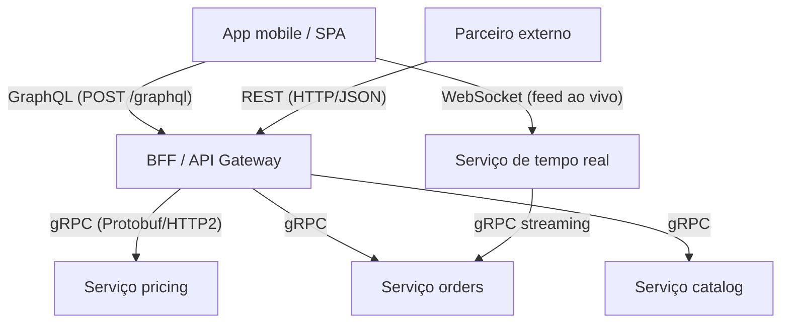
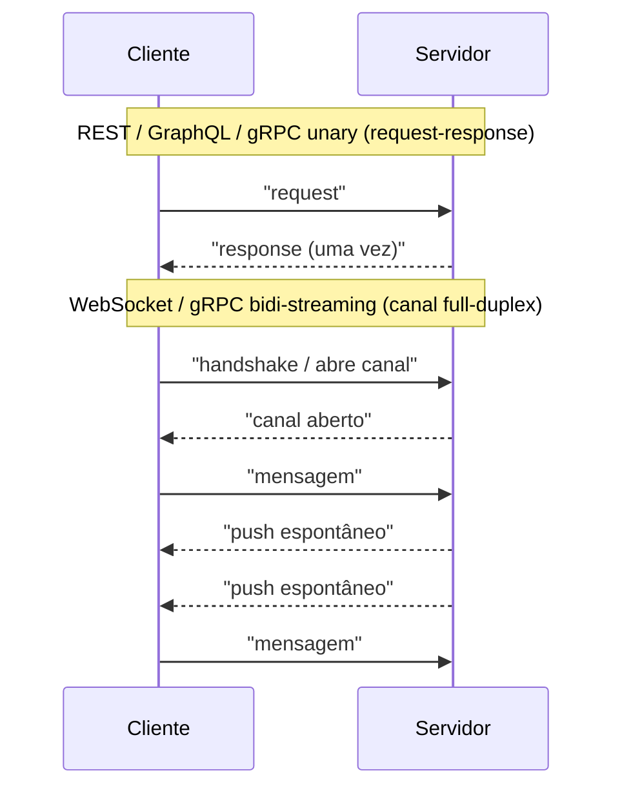

# REST vs GraphQL vs gRPC vs WebSockets: quando usar cada um

> **Bloco:** Redes e protocolos · **Nível:** Intermediário/Avançado · **Tempo de leitura:** ~30 min

## TL;DR

Não existe "melhor protocolo de API" — existe o **estilo de comunicação certo para cada fronteira do sistema**. Os quatro candidatos dominantes resolvem problemas diferentes. **REST** (Representational State Transfer) é o estilo arquitetural de recursos sobre HTTP: maduro, universal, cacheável, ótimo como **API pública** e padrão de mercado. **GraphQL** é uma *query language* tipada sobre um único endpoint: o **cliente declara exatamente os campos que quer** num grafo de dados, resolvendo over-fetching/under-fetching — brilha em **agregação para front-ends ricos** (web/mobile) com necessidades de dados heterogêneas. **gRPC** é um framework RPC binário sobre **HTTP/2 + Protocol Buffers**: contrato forte (`.proto`), código gerado, streaming bidirecional e latência baixíssima — o padrão de fato para **comunicação interna leste-oeste entre microsserviços**. **WebSockets** é um protocolo de **canal full-duplex persistente**: depois do handshake HTTP, cliente e servidor trocam mensagens nos dois sentidos a qualquer momento, sobre uma única conexão TCP — a base de **tempo real bidirecional** (chat, jogos, colaboração, trading). A regra prática que organiza a decisão: **REST/GraphQL na borda (cliente → backend), gRPC no interior (serviço → serviço), WebSockets quando o servidor precisa empurrar dados (push) e o cliente também fala de volta em tempo real**. Eles **coexistem** na mesma plataforma: um BFF GraphQL para o app, REST para parceiros, gRPC entre serviços, WebSocket para o feed ao vivo.

## O problema que resolve

Toda aplicação distribuída precisa que partes diferentes conversem: o navegador com o backend, o app mobile com a API, um microsserviço com outro, o servidor empurrando atualizações para milhares de clientes. Por muito tempo a resposta padrão foi *uma só* — "use REST para tudo". Mas as fronteiras de um sistema têm requisitos **conflitantes**, e forçar um único estilo em todas elas produz atrito.

Considere os tensionamentos concretos que cada estilo nasceu para resolver:

- **Over-fetching e under-fetching (problema de REST para front-ends).** Uma tela de perfil precisa de nome, avatar, últimos 3 pedidos e contagem de seguidores. Com REST clássico, isso vira `GET /user/42` (traz 30 campos que a tela não usa — *over-fetching*), `GET /user/42/orders` e `GET /user/42/followers/count` — três round-trips (*under-fetching* exige múltiplas chamadas). Em mobile, com rede móvel de alta latência, isso dói. GraphQL existe para o cliente pedir, numa só requisição, **exatamente** o grafo que precisa.

- **Custo e acoplamento da comunicação interna (problema de REST/JSON entre serviços).** Entre microsserviços, no tráfego *leste-oeste* (serviço-a-serviço dentro do datacenter), há milhões de chamadas por segundo. Serializar/deserializar JSON e parsear texto HTTP/1.1 é caro em CPU e latência; e o "contrato" via documentação informal é frágil. gRPC existe para dar **contrato forte gerado (`.proto`)**, serialização binária compacta (Protobuf) e multiplexação sobre HTTP/2.

- **A web é pull, mas muita coisa é push (problema do HTTP request/response).** O modelo HTTP é: o cliente pergunta, o servidor responde, fim. Mas notificações, mensagens de chat, cotações, presença ("fulano está digitando") são eventos que o **servidor** quer enviar quando *ele* tem algo novo — não quando o cliente perguntar. Simular isso com polling (perguntar a cada X segundos) é ineficiente e atrasado. WebSockets existe para abrir um **canal persistente bidirecional** onde o servidor empurra na hora.

- **Padronização, cache e alcance (problema que REST resolve bem).** Para uma **API pública** consumida por terceiros desconhecidos, você quer o denominador comum: HTTP puro, verbos e status codes universais, cacheabilidade via infraestrutura HTTP (CDN, proxies), tooling onipresente (curl, Postman), baixa barreira de entrada. É exatamente o que REST entrega.

A pergunta central que este documento ajuda a responder: **"Dada esta fronteira específica do sistema (quem fala com quem, com que padrão de dados e que requisito de latência/tempo real), qual estilo de comunicação minimiza atrito e maximiza as propriedades que importam aqui?"** A resposta quase nunca é "um só para tudo" — é uma **combinação consciente**.

## O que é (definição aprofundada)

### REST (Representational State Transfer)

**REST** é um *estilo arquitetural* (não um protocolo) descrito por Roy Fielding, baseado em recursos identificados por URLs, manipulados por **verbos HTTP** (`GET`, `POST`, `PUT`, `PATCH`, `DELETE`) com **semântica uniforme** e representados tipicamente em JSON. Suas restrições centrais: interface uniforme, statelessness (cada requisição carrega todo o contexto, sem sessão no servidor), cacheabilidade, e — no nível mais alto — **HATEOAS** (hypermedia: a resposta inclui links para as próximas ações possíveis).

O **Richardson Maturity Model** (Leonard Richardson, popularizado por Fowler) organiza a "maturidade REST" em níveis: **nível 0** (HTTP como túnel de RPC, um endpoint), **nível 1** (recursos — múltiplas URLs), **nível 2** (verbos HTTP + status codes com semântica correta — onde vive a maioria das APIs "REST" reais), **nível 3** (HATEOAS — raro na prática). A maior força do REST é a **maturidade e ubiquidade**: é o padrão de mercado, todo dev conhece, toda ferramenta suporta, e ele aproveita toda a infraestrutura HTTP existente (cache, proxies, CDN). Sua fraqueza estrutural: o servidor define a forma do recurso, então o cliente sofre over/under-fetching, e a evolução do contrato é informal.

### GraphQL

**GraphQL** é uma *query language* para APIs **e** um runtime no servidor, open-sourced pelo Facebook em 2015. O servidor expõe um **schema fortemente tipado** (um grafo de tipos e relações) num **único endpoint** (tipicamente `POST /graphql`). O cliente envia uma *query* que **descreve exatamente** os campos desejados, possivelmente atravessando relações, e recebe a resposta **na forma exata pedida**, numa só requisição.

Conceitos centrais: **schema/types** (o contrato), **queries** (leitura), **mutations** (escrita), **subscriptions** (atualizações em tempo real, geralmente sobre WebSocket), e **resolvers** (funções no servidor que buscam cada campo, podendo agregar de várias fontes/serviços). GraphQL resolve over/under-fetching e é **client-driven**: o front-end evolui sem esperar o backend criar endpoints novos. Custos: cacheabilidade HTTP fica difícil (tudo é `POST` num endpoint), surge o **problema N+1** nos resolvers, queries arbitrárias do cliente exigem **limites de complexidade/profundidade** (defesa contra DoS), e a curva de aprendizado/operação é maior. Frequentemente é o coração de um **BFF** (Backend for Frontend).

### gRPC

**gRPC** é um framework **RPC** (Remote Procedure Call) de alta performance, open source (origem Google), onde o cliente chama um método remoto **como se fosse local**. Define-se um **serviço** num arquivo **`.proto`** (Protocol Buffers como IDL — Interface Definition Language), e o `protoc` **gera código** de cliente e servidor em dezenas de linguagens. As mensagens trafegam serializadas em **Protobuf** (binário compacto) sobre **HTTP/2** (multiplexação, streaming, header compression).

Quatro modos de chamada: **unary** (request → response, como uma função normal), **server streaming** (uma request, fluxo de respostas), **client streaming** (fluxo de requests, uma response) e **bidirectional streaming** (ambos os lados enviam fluxos simultâneos, full-duplex). Forças: **contrato forte e versionável**, serialização compacta e rápida (tipicamente bem mais leve/rápido que JSON), suporte nativo a **deadlines/cancelamento** propagados e streaming. Fraquezas: **não roda nativamente no navegador** (precisa de gRPC-Web + proxy, porque o browser não dá acesso fino aos frames HTTP/2), formato binário é menos "inspecionável" que JSON, e o ecossistema de tooling de borda é menor. É o padrão de fato para **comunicação interna entre microsserviços**.

### WebSockets

**WebSocket** (RFC 6455) é um **protocolo** que estabelece um canal de comunicação **full-duplex** (bidirecional simultâneo) e **persistente** sobre uma única conexão TCP. Começa com um **handshake HTTP** (`GET` com `Upgrade: websocket`); se o servidor aceita (`101 Switching Protocols`), a conexão "muda de protocolo" de HTTP para WebSocket e, a partir daí, ambos os lados enviam **frames** de mensagens a qualquer momento, sem o ciclo request/response.

A diferença essencial frente a HTTP: HTTP é **half-duplex e iniciado pelo cliente** (o servidor só fala quando perguntado); WebSocket é **full-duplex** — o servidor empurra (*push*) na hora em que tem algo, e o cliente também fala de volta no mesmo canal. É a base de **chat, jogos multiplayer, edição colaborativa, dashboards ao vivo, trading**. Custos: a conexão é **stateful** (o servidor mantém N conexões abertas — escalar horizontalmente exige sticky sessions ou um backplane de pub/sub), não aproveita cache/semântica HTTP, e exige tratar reconexão, heartbeats e backpressure manualmente.

### Eixos que diferenciam os quatro

- **Direção do fluxo:** REST/GraphQL (query) e gRPC unary são **request/response** (cliente inicia). WebSocket e gRPC bidi-streaming são **full-duplex** (servidor também empurra).
- **Forma do payload:** REST/GraphQL = JSON (texto, legível); gRPC = Protobuf (binário, compacto); WebSocket = agnóstico (texto ou binário, você define o protocolo de mensagens).
- **Quem dita o formato dos dados:** REST = servidor (recurso fixo); GraphQL = **cliente** (query); gRPC = contrato `.proto` (acordado).
- **Onde brilha:** REST = borda pública/cache; GraphQL = agregação para front-end; gRPC = interior microsserviços; WebSocket = tempo real bidirecional.

## Como funciona

Em REST e GraphQL (query), o transporte é HTTP request/response: o cliente abre a chamada, o servidor responde uma vez. gRPC unary é o mesmo padrão lógico, mas sobre HTTP/2 com payload binário; os modos de streaming do gRPC e o WebSocket mantêm a conexão aberta para tráfego contínuo. A diferença de cacheabilidade vem disso: GET REST com URL estável é cacheável por CDN/proxy; um `POST /graphql` ou um stream gRPC, não (por padrão).

### Tabela comparativa: REST × GraphQL × gRPC × WebSockets

| Dimensão | REST | GraphQL | gRPC | WebSockets |
|---|---|---|---|---|
| **O que é** | Estilo arquitetural de recursos | Query language + runtime | Framework RPC binário | Protocolo de canal full-duplex |
| **Transporte** | HTTP/1.1 ou HTTP/2 | HTTP (POST único endpoint) | HTTP/2 | TCP (após handshake HTTP) |
| **Payload** | JSON (texto) | JSON (texto) | Protobuf (binário) | Texto ou binário (livre) |
| **Contrato** | Informal (OpenAPI opcional) | Schema tipado (SDL) | `.proto` (forte, gera código) | Definido por você (ad-hoc) |
| **Direção** | Request/response | Request/response (+ subscriptions) | Unary, server/client/bidi streaming | Full-duplex bidirecional |
| **Quem dita os dados** | Servidor (recurso) | **Cliente** (query) | Contrato acordado | Aplicação |
| **Cacheabilidade HTTP** | Excelente (GET) | Fraca (POST) | Fraca | Não se aplica |
| **Browser nativo** | Sim | Sim | **Não** (precisa gRPC-Web + proxy) | Sim |
| **Latência/throughput** | Médio | Médio | **Muito alto** | Muito baixo (push imediato) |
| **Tempo real / push** | Não (precisa polling/SSE) | Via subscriptions | Via streaming | **Nativo** |
| **Stateful?** | Stateless | Stateless (query) | Conexão HTTP/2 reusável | **Stateful** (conexão viva) |
| **Caso-alvo** | API pública, CRUD, cache | Agregação para front-end (BFF) | Interior microsserviços | Chat, jogos, dashboards ao vivo |
| **Custo principal** | Over/under-fetching | N+1, cache difícil, complexidade | Não roda em browser, binário opaco | Estado de conexão, escala horizontal |

### Camadas e maturidade

REST e GraphQL vivem **sobre** HTTP e, portanto, herdam suas propriedades (status codes, cache, proxies). gRPC vive sobre HTTP/2 mas abstrai o transporte atrás de chamadas de método. WebSocket usa HTTP **só para o handshake** e depois opera num plano próprio. Isso explica trade-offs: o que ganha em proximidade do HTTP (REST) ganha cache e ubiquidade; o que se afasta (gRPC binário, WebSocket persistente) ganha performance/push mas perde a infraestrutura HTTP "de graça".

A escolha também é organizacional: REST tem a **maior maturidade e familiaridade** — se não há motivo forte para outra coisa, REST costuma ser o default seguro para a borda. GraphQL paga seu custo de complexidade quando há **muitos clientes com necessidades de dados diferentes**. gRPC paga quando o **volume interno** e o desejo de **contratos fortes** justificam. WebSocket paga quando o requisito de **push/tempo real bidirecional** é real (não cosmético).

## Diagrama de fluxo

O primeiro diagrama mostra a topologia típica de uma plataforma combinando os quatro estilos por fronteira; o segundo contrasta o ciclo request/response (REST/GraphQL/gRPC unary) com o canal persistente full-duplex do WebSocket (e do gRPC bidi-streaming).

## Exemplo prático / caso real

Considere uma **plataforma de e-commerce brasileira** que vende para consumidores via app e site, integra parceiros (marketplaces, ERPs) e opera dezenas de microsserviços internos. A arquitetura combina os quatro estilos, **um por fronteira**, e essa combinação é a decisão certa — não um sinal de inconsistência.

**Borda do cliente (app/web) → GraphQL.** A tela de produto precisa de nome, preço, fotos, avaliações, estoque na loja mais próxima e recomendações. Com REST seriam 5+ chamadas com over-fetching; com **GraphQL** o app pede num único `POST /graphql` exatamente esse grafo, e o **BFF** resolve agregando de vários serviços internos. O time de mobile evolui a tela sem pedir endpoints novos ao backend a cada mudança. Cuidado tomado: limites de **profundidade e complexidade** de query e *persisted queries* para impedir que um cliente malicioso monte uma query gigante (DoS), além de **DataLoader** para evitar o N+1 nos resolvers.

**Borda de parceiros → REST.** O ERP de um parceiro precisa criar/consultar pedidos. Aqui o requisito é **denominador comum**: contrato estável documentado (OpenAPI), HTTP puro com verbos e status codes universais, fácil de consumir com qualquer linguagem/ferramenta. **REST** é a escolha óbvia — maduro, cacheável onde faz sentido (`GET /products` na CDN), baixa barreira para o parceiro integrar. Forçar GraphQL ou gRPC num parceiro externo só aumentaria o atrito.

**Interior (serviço → serviço) → gRPC.** O serviço de `checkout` chama `pricing`, `inventory` e `orders` milhões de vezes ao dia, tráfego leste-oeste dentro do cluster. Aqui o que importa é **latência baixa, throughput alto e contrato forte**. Adota-se **gRPC**: cada serviço publica seu `.proto`, o código de cliente/servidor é gerado (eliminando contratos informais e drift), o payload Protobuf é compacto, e **deadlines** são propagados nativamente (conectando com resiliência). Como gRPC não roda no browser, ele fica **só no interior** — o BFF traduz GraphQL/REST de borda para gRPC interno.

**Push em tempo real → WebSockets.** O recurso "acompanhe seu pedido ao vivo" e o chat com o vendedor precisam que o **servidor empurre** atualizações (status do pedido mudou, nova mensagem) e o cliente responda na hora. Polling seria atrasado e caro. Usa-se **WebSocket**: o app abre um canal persistente com o serviço de tempo real, que faz push de eventos. Para escalar (milhões de conexões simultâneas em Black Friday), as instâncias de WebSocket compartilham um **backplane de pub/sub** (ex.: Redis) para que um evento publicado por qualquer serviço chegue ao cliente conectado em qualquer instância.

O ponto do caso: a "stack de API" madura é **poliglota por fronteira**. Tentar um estilo único para tudo (só REST, ou só GraphQL) sempre force-fitta alguma fronteira e gera dor — REST entre serviços é lento e frágil de contrato; GraphQL para parceiro externo é atrito; gRPC no browser não funciona sem proxy; WebSocket para um CRUD simples é complexidade gratuita.

## Quando usar / Quando evitar

**REST:** use para **APIs públicas/de parceiros**, CRUD de recursos, quando cacheabilidade HTTP e ubiquidade importam, e como **default sensato** na borda quando não há motivo forte para outra coisa. **Evite** quando o cliente sofre over/under-fetching severo (front-ends ricos com dados heterogêneos — considere GraphQL) ou no tráfego interno de altíssimo volume entre serviços (considere gRPC).

**GraphQL:** use quando há **múltiplos clientes com necessidades de dados diferentes** (web, iOS, Android, parceiros internos), agregação de várias fontes numa só resposta, e desejo de desacoplar a evolução do front-end do backend (BFF). **Evite** para APIs simples de CRUD (overkill), quando cacheabilidade HTTP por CDN é central, ou sem maturidade para tratar complexidade de query, N+1 e segurança (limites de profundidade) — GraphQL mal operado vira um vetor de DoS.

**gRPC:** use no **interior** (serviço ↔ serviço), onde latência/throughput e contrato forte importam, e onde streaming bidirecional ou deadlines propagados são úteis. **Evite** como API direta de **navegador** (precisa gRPC-Web + proxy), em APIs públicas onde a inspeção/familiaridade do JSON importa, ou quando o time não tem maturidade com geração de código e versionamento de `.proto`.

**WebSockets:** use quando o **servidor precisa empurrar dados (push)** e o **cliente também envia em tempo real** — chat, jogos, colaboração, presença, trading. **Evite** quando o fluxo é **só servidor → cliente** (prefira **SSE**, mais simples e sobre HTTP) ou quando atualizações pouco frequentes bastam (polling/long polling). Não use WebSocket para request/response normal — você perde cache, semântica HTTP e ganha complexidade de estado.

## Anti-padrões e armadilhas comuns

- **"REST para tudo, inclusive entre serviços."** JSON/HTTP-1.1 no tráfego leste-oeste de alto volume desperdiça CPU e latência e deixa o contrato frágil. gRPC foi criado para isso. Forçar REST internamente é o anti-padrão mais comum por inércia.
- **Adotar GraphQL para um CRUD simples.** Sem múltiplos clientes heterogêneos, GraphQL adiciona complexidade (schema, resolvers, N+1, segurança de query) sem o benefício. REST resolve melhor o caso simples.
- **GraphQL sem limites de complexidade/profundidade.** Como o cliente monta a query, uma query maliciosamente profunda/recursiva pode derrubar o servidor (DoS). É obrigatório impor limites de profundidade, custo e/ou *persisted queries*.
- **N+1 nos resolvers GraphQL.** Resolver ingênuo que busca cada item relacionado numa query separada explode em N+1 chamadas. Use **DataLoader**/batching.
- **Tentar usar gRPC direto do navegador.** O browser não expõe os frames HTTP/2 necessários; gRPC puro não funciona no front-end. Use **gRPC-Web** com proxy (Envoy) — ou exponha REST/GraphQL na borda e gRPC só no interior.
- **WebSocket para fluxo unidirecional servidor→cliente.** Se o cliente não precisa empurrar mensagens, **SSE** (Server-Sent Events) é mais simples, roda sobre HTTP, reconecta automaticamente e não exige o overhead de estado do WebSocket. WebSocket é para **bidirecional**.
- **Ignorar o estado e a escala do WebSocket.** Conexões persistentes são stateful: escalar horizontalmente exige sticky sessions ou um backplane pub/sub, além de heartbeats (ping/pong) e estratégia de reconexão. Tratar WebSocket como "HTTP que fica aberto" sem isso quebra em produção.
- **Cachear errado em GraphQL.** Esperar que a CDN cacheie GraphQL como cacheia `GET` REST não funciona (tudo é `POST` num endpoint). Cache em GraphQL é em outra camada (persisted queries com GET, cache de resolver, cache normalizado no cliente).
- **Esquecer versionamento de contrato.** Em gRPC, mudar `.proto` sem regras de compatibilidade quebra clientes; em REST/GraphQL, remover campos sem deprecação idem. Trate o contrato como interface pública versionada.

## Relação com outros conceitos

- **API Gateway / BFF (04/08):** o BFF é frequentemente o ponto onde GraphQL/REST de borda se traduz em gRPC interno; o API Gateway faz roteamento, autenticação e rate limiting na borda. A escolha de estilo por fronteira é uma decisão de design do gateway/BFF.
- **HTTP/2 e HTTP/3 (16/03):** gRPC depende de HTTP/2 (multiplexação, streaming); GraphQL e REST também se beneficiam de HTTP/2/3 (menos head-of-line blocking). Entender o transporte explica por que gRPC é eficiente e por que multiplexação importa.
- **Long polling, SSE e WebSockets (16/09):** WebSocket é uma das técnicas de tempo real; SSE e long polling são alternativas que cobrem casos onde o full-duplex não é necessário. A escolha entre elas é o assunto daquele documento.
- **Semântica HTTP e status codes (16/07):** REST depende de usar verbos e status codes corretamente (Richardson nível 2); GraphQL tende a responder 200 mesmo em erro (erros no corpo), o que muda a forma de tratar falhas.
- **Idempotência (04/04):** REST mapeia idempotência em verbos (GET/PUT/DELETE idempotentes, POST não); gRPC e GraphQL mutations precisam de chaves de idempotência explícitas para retry seguro.
- **Backpressure / resiliência (04/10):** gRPC streaming e WebSocket exigem controlar backpressure (produtor mais rápido que consumidor); deadlines do gRPC conectam com timeout/circuit breaker.
- **Zero Trust / segurança (08):** GraphQL exige limites de query (DoS), WebSocket exige autenticação no handshake e por mensagem; gRPC interno costuma usar mTLS — cada estilo tem sua superfície de ataque.

## Pontos para fixar (revisão)

- Não há "melhor protocolo": há o **estilo certo por fronteira**. A regra prática: REST/GraphQL na **borda**, gRPC no **interior**, WebSocket para **push bidirecional**.
- **REST** = recursos sobre HTTP, maduro, cacheável, default da borda pública; sofre over/under-fetching.
- **GraphQL** = cliente declara o grafo de dados num endpoint único; resolve over/under-fetching; custos: N+1, cache difícil, segurança de query.
- **gRPC** = RPC binário sobre HTTP/2 + Protobuf, contrato `.proto` gerado, streaming e deadlines; padrão interno; **não roda no browser** sem gRPC-Web.
- **WebSocket** = canal full-duplex persistente (handshake HTTP → `101`); para tempo real bidirecional; stateful, exige backplane para escalar.
- Se o fluxo é só servidor→cliente, prefira **SSE** a WebSocket (mais simples).
- Os quatro **coexistem** numa plataforma madura — combinação consciente, não inconsistência.

## Referências

- [Introduction to GraphQL — graphql.org](https://graphql.org/learn/introduction/)
- [Queries — graphql.org](https://graphql.org/learn/queries/)
- [Introduction to gRPC — grpc.io](https://grpc.io/docs/what-is-grpc/introduction/)
- [Core concepts, architecture and lifecycle — gRPC](https://grpc.io/docs/what-is-grpc/core-concepts/)
- [The WebSocket API (WebSockets) — MDN Web Docs](https://developer.mozilla.org/en-US/docs/Web/API/WebSockets_API)
- [RFC 6455 — The WebSocket Protocol](https://datatracker.ietf.org/doc/html/rfc6455)
- [Richardson Maturity Model — Martin Fowler](https://martinfowler.com/articles/richardsonMaturityModel.html)
- [When to Use REST vs. gRPC vs. GraphQL — Kong](https://konghq.com/blog/engineering/rest-vs-grpc-vs-graphql)
- [HTTP request methods — MDN Web Docs](https://developer.mozilla.org/en-US/docs/Web/HTTP/Reference/Methods)
