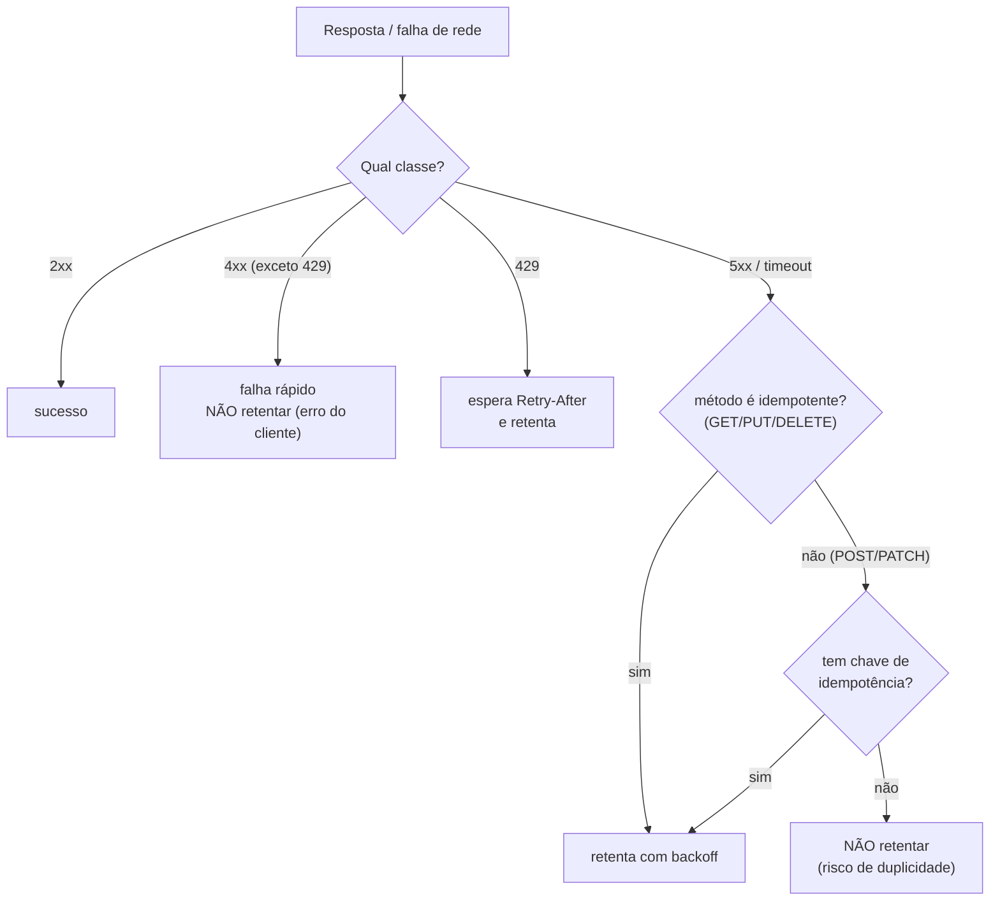
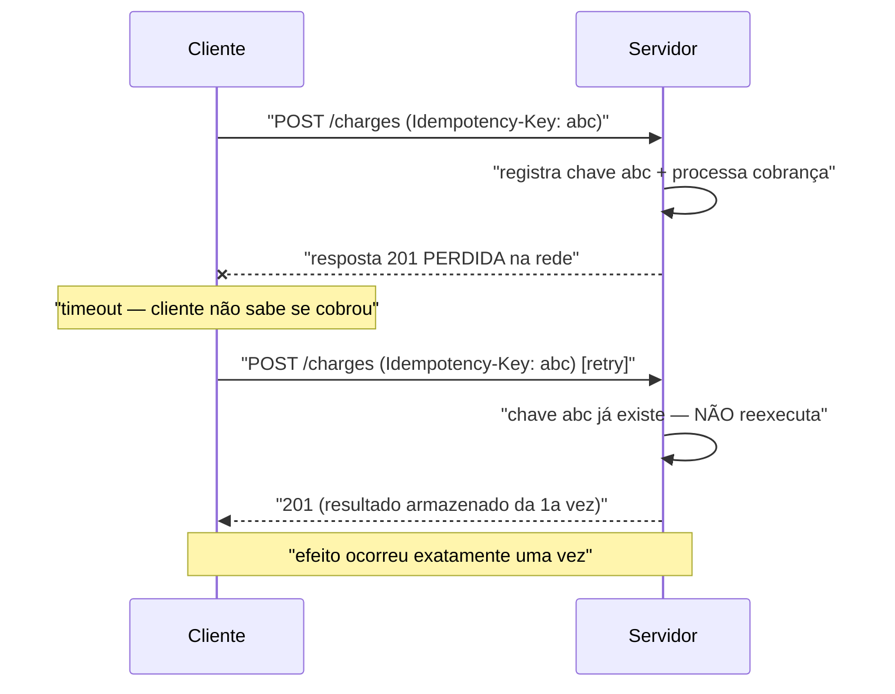

# Semântica HTTP: idempotência dos métodos, safe methods e status codes

> **Bloco:** Redes e protocolos · **Nível:** Intermediário/Avançado · **Tempo de leitura:** ~28 min

## TL;DR

HTTP não é só "transporte de bytes" — é um **protocolo com semântica definida** (RFC 9110), e usar essa semântica corretamente é o que separa uma API robusta de uma frágil. Dois conceitos governam os métodos. **Safe (seguro):** o método é *read-only*, não muda estado observável no servidor — `GET`, `HEAD`, `OPTIONS`, `TRACE`. **Idempotente:** repetir a mesma requisição **N vezes tem o mesmo efeito que uma vez** — `GET`, `HEAD`, `OPTIONS`, `PUT`, `DELETE` são idempotentes; **`POST` e `PATCH` não são** (garantidos). Todo método safe é idempotente, mas nem todo idempotente é safe (`PUT`/`DELETE` mudam estado, mas repetir não piora). Essa distinção é **a base do retry seguro**: o cliente/proxy pode reexecutar `GET`/`PUT`/`DELETE` após falha de rede sem medo de duplicidade, mas reexecutar um `POST` pode criar dois pedidos ou cobrar duas vezes — daí a necessidade de **chaves de idempotência**. Do lado das respostas, os **status codes** comunicam o resultado por classes: **2xx** sucesso, **3xx** redirecionamento, **4xx** erro do **cliente** (a culpa é da requisição: `400`, `401`, `403`, `404`, `409`, `422`, `429`), **5xx** erro do **servidor** (a culpa é do servidor: `500`, `502`, `503`, `504`). A regra de ouro do retry: **4xx não retentar** (determinístico, vai falhar igual), **5xx pode retentar** (frequentemente transitório) — com backoff. Usar o status code certo (não "200 com erro no corpo") é o que permite que clientes, proxies e infraestrutura tomem decisões corretas automaticamente.

## O problema que resolve

Imagine um app de pagamentos que envia `POST /charges` para cobrar R$ 200. A requisição sai, o servidor processa e cobra — mas a **resposta se perde na rede** (timeout, conexão caiu). O cliente não sabe se a cobrança aconteceu. O que ele faz? Se **retentar**, e a primeira cobrança *tinha* funcionado, o cliente é **cobrado duas vezes**. Se *não* retentar, e a primeira *tinha* falhado, a cobrança nunca acontece. Esse dilema — "é seguro repetir esta operação?" — é exatamente o que a **semântica de idempotência** do HTTP existe para responder.

O problema mais amplo: num sistema distribuído, **falhas de rede são inevitáveis** e o retry é a defesa padrão (ver padrões de resiliência). Mas retry cego é perigoso. O cliente, o proxy, a CDN, o navegador — todos precisam saber, **só olhando o método HTTP**, se podem reexecutar uma requisição com segurança. É por isso que o HTTP define propriedades **uniformes** por método: qualquer intermediário sabe que `GET` é safe (pode até pré-buscar), que `PUT` é idempotente (pode retentar), e que `POST` não é (não deve retentar automaticamente). Sem essa semântica padronizada, cada API seria uma caixa-preta e nenhuma automação de retry/cache seria segura.

Do lado das **respostas**, há um problema gêmeo: como o cliente sabe *o que aconteceu* e *o que fazer a seguir*? Uma API que responde **sempre 200** e enfia o erro real no corpo JSON (`{"status":"error"}`) quebra toda a automação: o monitoramento acha que está tudo bem (2xx), o load balancer não tira a instância do ar (não vê 5xx), a CDN cacheia um erro, e o cliente precisa parsear o corpo para saber se houve falha. Os **status codes** existem para que a categoria do resultado seja legível por máquina, de forma uniforme, **antes** de olhar o corpo.

A pergunta central: **"Como projetar uma API para que clientes, proxies e infraestrutura saibam, de forma padronizada e sem ambiguidade, (a) se podem repetir uma requisição com segurança e (b) o que significou a resposta e o que fazer a seguir?"** A resposta está na semântica HTTP — métodos com propriedades safe/idempotente bem definidas, e status codes usados pela classe correta.

## O que é (definição aprofundada)

### Safe (métodos seguros)

Um método é **safe** quando sua semântica é **essencialmente read-only**: o cliente não solicita nem espera nenhuma mudança de estado no servidor ao aplicá-lo. Os métodos safe definidos: **`GET`, `HEAD`, `OPTIONS`, `TRACE`**. "Safe" não significa que o servidor *tecnicamente* não faça nada (ele pode logar, incrementar um contador de acessos) — significa que o cliente não é **responsável** por nenhum efeito colateral. Consequência prática: métodos safe podem ser **pré-buscados** (prefetch), **cacheados** e **retentados livremente** por navegadores, crawlers e proxies, porque "ler de novo" nunca causa dano. Violar isso — usar `GET /deleteAccount?id=5` para apagar algo — é um erro grave: um crawler ou prefetch do navegador pode disparar a ação sem intenção do usuário.

### Idempotente (métodos idempotentes)

Um método é **idempotente** quando o **efeito pretendido no servidor de N requisições idênticas é o mesmo que o de uma única requisição**. Repetir não acumula efeito. Os métodos idempotentes: **`GET`, `HEAD`, `OPTIONS`, `TRACE`** (que também são safe) **mais `PUT` e `DELETE`**. 

- `PUT /users/42` com um corpo que **substitui** o recurso é idempotente: aplicá-lo 3 vezes deixa o recurso no mesmo estado final que aplicá-lo 1 vez. (Note: idempotência é sobre o *estado resultante*, não sobre a resposta — o segundo `DELETE` pode retornar `404` em vez de `204`, mas o **estado** "recurso ausente" é o mesmo.)
- `DELETE /users/42` é idempotente: deletar um recurso já deletado mantém o estado "ausente".

**`POST` e `PATCH` NÃO são garantidamente idempotentes.** `POST /orders` tipicamente **cria um novo recurso a cada chamada** — repetir cria N pedidos. `PATCH` aplica uma modificação parcial que pode não ser idempotente (ex.: `PATCH {"saldo": "+10"}` soma 10 a cada chamada). 

**Relação:** todo método safe é idempotente (se não muda nada, repetir obviamente não muda nada), mas a recíproca é falsa — `PUT`/`DELETE` são idempotentes **e unsafe** (mudam estado, mas repetir não piora). É essa categoria — idempotente-mas-unsafe — que torna o retry de escrita seguro sem chave especial.

### Por que idempotência é a base do retry

Quando uma requisição falha por timeout ou erro de rede, o cliente **não sabe** se o servidor processou ou não. A idempotência resolve a ambiguidade: se o método é idempotente, **retentar é seguro** — se a primeira chegou, a segunda não causa dano; se não chegou, a segunda executa. Por isso clientes HTTP, proxies e service meshes podem retentar `GET`/`PUT`/`DELETE` automaticamente, mas **não** `POST`. Para tornar `POST` retentável com segurança, usa-se uma **chave de idempotência** (Idempotency-Key): o cliente gera um identificador único por operação lógica e o envia no header; o servidor registra a chave na primeira execução e, em retentativas com a mesma chave, **retorna o resultado anterior sem reexecutar** — transformando um `POST` não-idempotente numa operação efetivamente idempotente do ponto de vista do efeito.

### Tabela de propriedades dos métodos

| Método | Safe | Idempotente | Tem corpo de request | Cacheável | Uso típico |
|---|---|---|---|---|---|
| **GET** | Sim | Sim | Não (geralmente) | Sim | Ler recurso |
| **HEAD** | Sim | Sim | Não | Sim | Cabeçalhos sem corpo |
| **OPTIONS** | Sim | Sim | Não | Não | Descobrir capacidades / preflight CORS |
| **PUT** | Não | **Sim** | Sim | Não | Substituir recurso inteiro |
| **DELETE** | Não | **Sim** | Geralmente não | Não | Remover recurso |
| **POST** | Não | **Não** | Sim | Raramente | Criar recurso / ação não-idempotente |
| **PATCH** | Não | **Não** (em geral) | Sim | Não | Modificação parcial |

### Status codes: classes e semântica

Os status codes são números de três dígitos cuja **primeira dígito define a classe**:

- **1xx Informational:** respostas provisórias (`100 Continue`, `101 Switching Protocols` — usado no handshake WebSocket). Raras no dia a dia de API.
- **2xx Success:** a requisição foi recebida, entendida e processada com sucesso. `200 OK`, `201 Created` (recurso criado — use em `POST` que cria), `202 Accepted` (aceito para processamento assíncrono), `204 No Content` (sucesso sem corpo — típico de `DELETE`/`PUT`).
- **3xx Redirection:** ação adicional necessária. `301 Moved Permanently`, `302 Found`, `304 Not Modified` (cache: o recurso não mudou, use a cópia local — central para `GET` condicional/ETag).
- **4xx Client Error:** **a culpa é do cliente** — a requisição está malformada, não autorizada, ou conflita com o estado. **Não adianta retentar igual** (vai falhar do mesmo jeito) sem corrigir a requisição.
- **5xx Server Error:** **a culpa é do servidor** — ele recebeu uma requisição válida mas falhou em processá-la. Frequentemente **transitório** — retentar (com backoff) pode funcionar.

### A linha divisória 4xx vs 5xx (o conceito mais cobrado)

A distinção **4xx vs 5xx** é a mais importante operacionalmente porque governa **três decisões automáticas**:

1. **Retry:** `4xx` → não retentar (determinístico; corrija a requisição). `5xx` → pode retentar com backoff (pode ser transitório). Exceção notável: `429 Too Many Requests` é 4xx mas *pede* retry — respeitando o header `Retry-After`.
2. **Alerta/monitoramento:** uma onda de `5xx` indica **problema no seu serviço** (deve disparar alerta/página). Uma onda de `4xx` indica **clientes mandando requisições erradas** (bug no cliente, ataque, contrato mal entendido) — outra investigação, raramente "acorde o on-call".
3. **Atribuição de culpa em SLO:** `5xx` conta contra a disponibilidade do *seu* serviço; `4xx` (geralmente) não, pois o cliente errou. Retornar `500` para um input inválido do cliente **polui seu SLO** com falhas que não são suas.

### Matriz dos status codes que mais importam em APIs

| Código | Classe | Significado | Retry? | Quando usar |
|---|---|---|---|---|
| **200 OK** | 2xx | Sucesso com corpo | — | Leitura/operação bem-sucedida |
| **201 Created** | 2xx | Recurso criado | — | `POST` que cria recurso (com `Location`) |
| **202 Accepted** | 2xx | Aceito, processamento assíncrono | — | Operação enfileirada |
| **204 No Content** | 2xx | Sucesso sem corpo | — | `DELETE`/`PUT` sem retorno |
| **304 Not Modified** | 3xx | Recurso não mudou (cache) | — | `GET` condicional com ETag/If-None-Match |
| **400 Bad Request** | 4xx | Requisição malformada/sintaxe inválida | **Não** | JSON inválido, parâmetro faltando |
| **401 Unauthorized** | 4xx | Não autenticado (faltou/inválido credencial) | Não (autentique) | Token ausente/expirado |
| **403 Forbidden** | 4xx | Autenticado mas sem permissão | **Não** | Usuário sem acesso ao recurso |
| **404 Not Found** | 4xx | Recurso não existe | **Não** | ID inexistente |
| **405 Method Not Allowed** | 4xx | Método não suportado no recurso | Não | `DELETE` num recurso read-only |
| **409 Conflict** | 4xx | Conflito com o estado atual | Não (resolva) | Versão desatualizada, duplicata, edição concorrente |
| **422 Unprocessable Content** | 4xx | Sintaxe OK mas semântica inválida | **Não** | Validação de negócio falhou |
| **429 Too Many Requests** | 4xx | Rate limit excedido | **Sim** (após `Retry-After`) | Cliente excedeu a cota |
| **500 Internal Server Error** | 5xx | Erro genérico no servidor | **Sim** (backoff) | Exceção não tratada |
| **502 Bad Gateway** | 5xx | Gateway recebeu resposta inválida do upstream | **Sim** | Proxy/LB e backend desalinhados |
| **503 Service Unavailable** | 5xx | Serviço indisponível/sobrecarregado | **Sim** (respeite `Retry-After`) | Manutenção, sobrecarga, load shedding |
| **504 Gateway Timeout** | 5xx | Gateway esperou demais pelo upstream | **Sim** | Timeout entre proxy e backend |

## Como funciona

A semântica é declarativa: o **método** carrega as propriedades safe/idempotente (válidas em qualquer API que respeite o HTTP), e o **status code** classifica o resultado. Clientes e intermediários combinam os dois para automatizar decisões: um proxy pode cachear `GET 200`, retentar `GET`/`PUT` em `503`, e nunca retentar `POST` automaticamente. A robustez vem de todos seguirem o mesmo contrato.

### O fluxo de retry guiado por semântica

Um cliente resiliente decide retentar combinando **método** (idempotente?) e **resposta** (qual classe?):

1. Resposta **2xx** → sucesso, segue em frente.
2. Resposta **4xx** (exceto 429) → erro do cliente, **falha rápido** sem retry (corrigir a requisição é responsabilidade do dev/cliente).
3. Resposta **429** → respeitar `Retry-After`, retentar depois.
4. Resposta **5xx** ou **timeout/erro de rede** → potencialmente transitório:
   - Se o método é **idempotente** (`GET`/`PUT`/`DELETE`) → retentar com backoff é seguro.
   - Se é **`POST`/`PATCH`** → só retentar se houver **chave de idempotência**; senão, não retentar (risco de duplicidade).

Essa árvore de decisão é exatamente o que conecta semântica HTTP com os padrões de resiliência: *retry só para falhas transitórias (5xx, timeout) e operações idempotentes*.

### Idempotência prática: chave de idempotência

O mecanismo que torna `POST` retentável:

1. Cliente gera um UUID único por operação lógica e envia em `Idempotency-Key: <uuid>`.
2. Servidor, ao receber, verifica se já viu essa chave:
   - **Primeira vez:** processa, persiste a chave + o resultado, retorna a resposta.
   - **Repetida (retry):** **não reexecuta** — retorna a resposta armazenada da primeira vez.
3. Resultado: mesmo que o cliente retente várias vezes (porque a resposta se perdeu), o efeito no servidor acontece **exatamente uma vez**.

Isso é como Stripe e gateways de pagamento garantem que um retry de rede não cobra o cliente duas vezes. A chave deve ter TTL e ser escopada por endpoint/usuário.

### 200-com-erro: o anti-padrão de semântica

Uma fonte recorrente de bugs é responder **`200 OK` com o erro no corpo** (`{"success": false, "error": "..."}`). Isso quebra a cadeia de automação:

- O **load balancer/health check** vê 2xx e mantém a instância recebendo tráfego (mesmo quebrada).
- O **monitoramento** não detecta a taxa de erro (tudo parece 2xx).
- A **CDN/proxy** pode cachear o "erro" como se fosse resposta válida.
- O **cliente** é obrigado a parsear o corpo para saber se falhou, em vez de checar o status.

A semântica correta usa o **status code da classe certa** (400/422 para erro de validação do cliente, 500 para falha do servidor), e o corpo serve para *detalhes* do erro — não para *sinalizar* que houve erro. Padrões como **RFC 9457 Problem Details** estruturam o corpo de erro mantendo o status code correto.

## Diagrama de fluxo

O primeiro diagrama mostra a árvore de decisão de retry guiada pela semântica (método idempotente? classe da resposta?); o segundo mostra a sequência de uma chave de idempotência tornando um `POST` seguro contra retry.

## Exemplo prático / caso real

Considere a **API de pedidos e pagamentos de um e-commerce brasileiro**, e como a semântica HTTP correta evita bugs caros.

**Retry seguro de PUT (idempotente por design).** O app atualiza o endereço de entrega via `PUT /orders/789/shipping-address` com o endereço completo no corpo. Na Black Friday, com rede móvel instável, a resposta às vezes se perde. Como `PUT` **substitui** o recurso, ele é **idempotente**: o cliente retenta sem medo — aplicar o mesmo endereço duas vezes resulta no mesmo estado. Nenhuma chave especial é necessária. Esse é o caso ideal: a semântica do método já garante segurança.

**POST de cobrança com chave de idempotência.** A finalização do pedido faz `POST /charges` para autorizar R$ 350 no cartão. `POST` **não** é idempotente — retentar cegamente cobraria duas vezes. A solução: o cliente gera um `Idempotency-Key` único por tentativa de checkout e o envia. Quando a resposta da primeira cobrança se perde por timeout, o cliente retenta com a **mesma chave**; o gateway reconhece a chave, **não reexecuta**, e devolve o resultado original. O cliente é cobrado uma vez só. Esse padrão é exatamente o que conecta semântica HTTP com retry seguro dos padrões de resiliência.

**Status codes corretos guiando o comportamento.** Vários cenários, cada um com o código certo:

- Cartão recusado pelo banco → **`402`/`422`** (ou `409` conforme o desenho) — erro de **negócio do cliente**, classe 4xx, **não retentar** (retentar dá o mesmo "recusado"). Crucialmente, **não** é `500`: o servidor funcionou perfeitamente, foi o cartão que falhou.
- Estoque acabou entre adicionar ao carrinho e finalizar → **`409 Conflict`** — conflito com o estado atual; o cliente precisa **resolver** (escolher outro produto), não retentar.
- Cliente excedeu o rate limit de criação de pedidos (suspeita de bot) → **`429 Too Many Requests`** com `Retry-After: 30` — o cliente legítimo espera e retenta.
- O gateway de pagamento externo deu timeout → **`504 Gateway Timeout`** ou **`503`** — erro de servidor (5xx), **transitório**, o cliente **pode retentar com backoff**.
- Uma exceção não tratada no serviço de pricing → **`500`** — dispara alerta para o on-call, conta contra o SLO.

**O bug que a semântica evitou.** Antes de padronizarem os status codes, o serviço respondia `200 OK` com `{"error": "cartão recusado"}`. Resultado: o dashboard de disponibilidade mostrava 100% de sucesso enquanto milhares de checkouts falhavam; o alerta nunca disparava; e o time de dados contava "cartão recusado" como venda concretizada. Ao migrar para **4xx com Problem Details no corpo**, o monitoramento passou a enxergar a taxa de erro real, os clientes passaram a tratar erros pela classe do status, e a distinção 4xx (erro do comprador) vs 5xx (erro nosso) limpou o SLO — só os 5xx contam contra a disponibilidade do serviço.

## Quando usar / Quando evitar

**Métodos por semântica:**

- Use **`GET`** apenas para leitura (safe) — **nunca** para ações que mudam estado (`GET /delete?id=5` é um bug: crawlers e prefetch disparam a ação).
- Use **`PUT`** para substituir um recurso inteiro de forma idempotente; **`PATCH`** para modificação parcial (lembrando que `PATCH` pode não ser idempotente).
- Use **`POST`** para criação e ações não-idempotentes; se precisar retentá-lo com segurança, **adicione chave de idempotência**.
- Use **`DELETE`** para remoção (idempotente — o segundo delete pode dar 404, mas o estado é o mesmo).

**Status codes:**

- Use **2xx** só para sucesso real; **`201`** ao criar, **`204`** quando não há corpo.
- Use **4xx** quando a culpa é da requisição do cliente, escolhendo o específico (`400` sintaxe, `401`/`403` auth, `404` inexistente, `409` conflito de estado, `422` validação semântica, `429` rate limit).
- Use **5xx** quando a culpa é do servidor — e **evite** usar 5xx para erros de input do cliente (polui o SLO e dispara alertas indevidos).
- **Evite** o anti-padrão "200 com erro no corpo" — quebra automação de retry, cache, health check e monitoramento.

## Anti-padrões e armadilhas comuns

- **`GET` que muda estado.** Usar `GET` para deletar/atualizar viola "safe": prefetch do navegador, crawlers e proxies podem disparar a ação sem intenção. Mutação sempre por `POST`/`PUT`/`PATCH`/`DELETE`.
- **Retentar `POST` sem chave de idempotência.** Duplica pedidos/cobranças. Ou torne a operação idempotente (chave), ou não retente automaticamente.
- **Tratar todo erro como `500`.** Responder 500 para input inválido do cliente polui o SLO de disponibilidade (parece falha sua), dispara alertas indevidos e leva clientes a retentar algo que sempre vai falhar. Erro do cliente é 4xx.
- **"200 OK" com erro no corpo.** Quebra health checks (LB mantém instância quebrada), monitoramento (taxa de erro invisível), cache (cacheia erro) e força o cliente a parsear corpo. Use o status code da classe certa.
- **Confundir `401` e `403`.** `401` = não autenticado (faltou/inválido credencial — refaça login). `403` = autenticado mas sem permissão (não adianta reautenticar). Trocar os dois confunde o cliente.
- **Ignorar `Retry-After` em `429`/`503`.** Retentar imediatamente após um rate limit/sobrecarga agrava o problema (retry storm). Respeite o header.
- **Achar que idempotência é sobre a resposta.** Idempotência é sobre o **estado do servidor**, não sobre o status retornado. `DELETE` repetido pode dar `404` na segunda vez — ainda é idempotente, pois o estado ("ausente") é o mesmo.
- **`PATCH` assumido idempotente.** `PATCH` com operação incremental (`saldo += 10`) **não** é idempotente; retentar soma de novo. Avalie caso a caso; se precisar de retry, garanta idempotência.
- **Usar `200` em vez de `201`/`204`.** Perde semântica útil: `201` sinaliza criação (com `Location`), `204` sinaliza sucesso sem corpo. Não é fatal, mas degrada a clareza do contrato.

## Relação com outros conceitos

- **Idempotência (04/04):** a idempotência dos métodos HTTP é a manifestação, no protocolo, do conceito geral de idempotência; chaves de idempotência são a ponte para operações não-naturalmente-idempotentes.
- **Padrões de resiliência — Retry (04/10):** a regra "retry só para falhas transitórias (5xx/timeout) e operações idempotentes" depende diretamente da semântica safe/idempotente e da classe 4xx vs 5xx.
- **REST vs GraphQL vs gRPC (16/06):** REST depende de usar verbos e status codes corretamente (Richardson nível 2); GraphQL frequentemente responde 200 mesmo em erro (erros no corpo), uma escolha que muda o tratamento de falhas.
- **HTTP/2 e HTTP/3 (16/03):** a semântica (métodos, status, idempotência) é a **mesma** em HTTP/1.1, /2 e /3 — RFC 9110 separou deliberadamente a semântica do transporte. O que muda é a sintaxe de fio, não o significado.
- **Cache e CDN:** safe + cacheável (`GET`) é o que permite cache em CDN/proxy; `304 Not Modified` com ETag é o mecanismo de revalidação. Semântica errada (GET que muda estado) corrompe cache.
- **API Gateway / rate limiting (04/08, 04/10):** `429 Too Many Requests` com `Retry-After` é a interface HTTP do rate limiting; `503` é a do load shedding.
- **Observabilidade (09):** a taxa de 5xx é métrica central de disponibilidade (SLO); separar 4xx (cliente) de 5xx (servidor) é essencial para alertas corretos.

## Pontos para fixar (revisão)

- **Safe** = read-only (`GET`/`HEAD`/`OPTIONS`/`TRACE`); pode prefetch/cachear/retentar livremente.
- **Idempotente** = repetir N vezes = efeito de 1 vez. Idempotentes: safe + **`PUT`** + **`DELETE`**. **`POST` e `PATCH` não** (garantidos).
- Todo safe é idempotente; nem todo idempotente é safe (`PUT`/`DELETE` mudam estado mas repetir não piora).
- Idempotência é sobre o **estado do servidor**, não sobre a resposta (2º `DELETE` pode dar 404 e ainda ser idempotente).
- Para retentar **`POST`** com segurança, use **chave de idempotência** (`Idempotency-Key`).
- **4xx = culpa do cliente** (não retentar, corrigir a requisição). **5xx = culpa do servidor** (pode retentar com backoff, frequentemente transitório).
- Exceção: **`429`** é 4xx mas pede retry após `Retry-After`.
- Status codes a dominar: `200/201/204`, `304`, `400/401/403/404/409/422/429`, `500/502/503/504`.
- **Nunca** responda "200 com erro no corpo" — quebra retry, cache, health check e monitoramento.
- A semântica é **idêntica** em HTTP/1.1, /2 e /3 (RFC 9110 separou semântica de transporte).

## Referências

- [RFC 9110 — HTTP Semantics](https://www.rfc-editor.org/rfc/rfc9110.html)
- [HTTP request methods — MDN Web Docs](https://developer.mozilla.org/en-US/docs/Web/HTTP/Reference/Methods)
- [Idempotent — Glossary — MDN Web Docs](https://developer.mozilla.org/en-US/docs/Glossary/Idempotent)
- [Safe (HTTP Methods) — Glossary — MDN Web Docs](https://developer.mozilla.org/en-US/docs/Glossary/Safe/HTTP)
- [HTTP response status codes — MDN Web Docs](https://developer.mozilla.org/en-US/docs/Web/HTTP/Reference/Status)
- [409 Conflict — MDN Web Docs](https://developer.mozilla.org/en-US/docs/Web/HTTP/Reference/Status/409)
- [429 Too Many Requests — MDN Web Docs](https://developer.mozilla.org/en-US/docs/Web/HTTP/Reference/Status/429)
- [400 Bad Request — MDN Web Docs](https://developer.mozilla.org/en-US/docs/Web/HTTP/Reference/Status/400)
