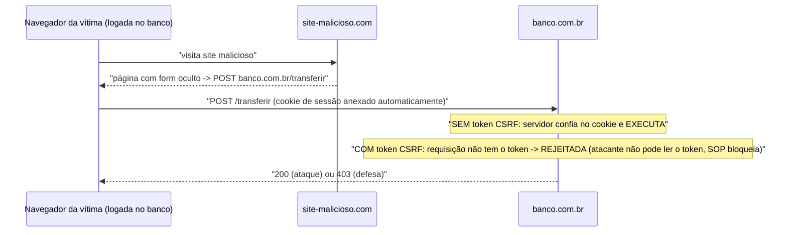
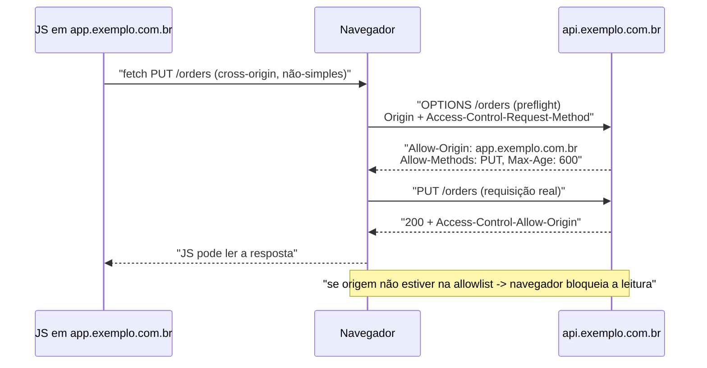

# CORS, CSRF e XSS: entendimento conceitual e mitigação

> **Bloco:** Redes e protocolos · **Nível:** Intermediário/Avançado · **Tempo de leitura:** ~30 min

## TL;DR

Três siglas que vivem perto mas resolvem/atacam coisas diferentes — e confundi-las é o erro mais comum em entrevistas. O fio condutor é a **Same-Origin Policy (SOP)**: por segurança, o navegador isola conteúdo de *origens* diferentes (origem = esquema + host + porta) para que um site malicioso não leia dados de outro. **CORS** (Cross-Origin Resource Sharing) **não é um ataque nem uma defesa contra ataque** — é um **mecanismo controlado de relaxamento** da SOP: permite que um servidor diga ao navegador "estas outras origens podem ler minhas respostas", via headers `Access-Control-Allow-*`, possivelmente precedido de uma requisição **preflight** `OPTIONS`. **CSRF** (Cross-Site Request Forgery) é um **ataque** que abusa do fato de o navegador **enviar cookies automaticamente**: um site malicioso induz o navegador do usuário logado a disparar uma requisição *de escrita* para o seu site, e o cookie de sessão viaja junto — executando uma ação **em nome do usuário sem o consentimento dele**. Mitiga-se com **tokens anti-CSRF** (synchronizer/double-submit), **cookies SameSite** e verificação de origem. **XSS** (Cross-Site Scripting) é um **ataque de injeção** onde o atacante consegue executar **JavaScript dele dentro da sua página** (porque você renderizou input não-tratado do usuário), roubando sessões, tokens e dados — e, criticamente, **XSS derrota qualquer defesa de CSRF**. Mitiga-se com **output encoding/escaping**, **proteções do framework**, **sanitização de HTML** e **Content Security Policy (CSP)**. Regra mental: **CORS controla quem lê suas respostas cross-origin; CSRF abusa de credenciais enviadas automaticamente; XSS executa código do atacante na sua página — e é o mais grave porque quebra as outras defesas.**

## O problema que resolve

A web tem uma tensão fundamental: o navegador **mistura conteúdo de muitas origens** numa mesma sessão (você está logado no banco numa aba e abre um site qualquer noutra), e ao mesmo tempo **envia credenciais (cookies) automaticamente**. Sem regras, isso seria um desastre de segurança: qualquer site poderia ler seu e-mail, disparar transferências no seu banco, roubar sua sessão. As três siglas giram em torno dessa tensão.

A base de tudo é a **Same-Origin Policy**: o navegador permite que uma página interaja livremente com recursos da **mesma origem**, mas **restringe** o acesso a recursos de **outra origem**. "Origem" = a tripla **esquema + host + porta** (`https://app.exemplo.com.br:443`). Mudou qualquer um dos três → outra origem. A SOP impede, por exemplo, que `https://site-malicioso.com` leia, via JavaScript, a resposta de `https://banco.com.br/saldo`. É a pedra angular da segurança no navegador.

Mas a SOP é restritiva demais para o mundo real, e tem brechas:

- **Problema que CORS resolve:** APIs modernas vivem em origens separadas do front-end (`api.exemplo.com.br` vs `app.exemplo.com.br`), e SPAs/apps mobile legitimamente precisam **ler respostas cross-origin**. A SOP bloquearia isso. CORS é o mecanismo que permite ao **servidor autorizar explicitamente** quais origens podem ler suas respostas — relaxamento *controlado*, não desligamento.

- **Problema/brecha que CSRF explora:** a SOP impede que o site malicioso *leia* a resposta de `banco.com.br`, mas **não impede que ele dispare a requisição** — e o navegador, fiel ao seu desenho, **anexa o cookie de sessão automaticamente**. Então um formulário oculto em `site-malicioso.com` que faz `POST https://banco.com.br/transferir` executa com a credencial da vítima, mesmo que o atacante nunca veja a resposta. CSRF abusa dessa "escrita cega autenticada".

- **Problema/brecha que XSS explora:** se o atacante consegue **injetar e executar JavaScript dentro da sua origem** (porque você renderizou input dele sem tratar), esse código roda *como se fosse seu site* — com acesso a cookies (não-HttpOnly), tokens, DOM, e podendo fazer requisições same-origin à vontade. A SOP não protege contra isso, porque o código *está* na origem confiável.

A pergunta central: **"Como permitir o compartilhamento legítimo entre origens (CORS) sem abrir as portas para que um site dispare ações em nome do usuário (CSRF) ou execute código malicioso na sua página (XSS)?"** Entender os três exige separar três planos: **quem pode ler respostas** (CORS), **quem pode disparar escritas autenticadas** (CSRF) e **quem pode executar código na origem** (XSS).

## O que é (definição aprofundada)

### CORS (Cross-Origin Resource Sharing)

**CORS** é um mecanismo baseado em **headers HTTP** que permite a um servidor indicar ao navegador **quais origens (além da própria) têm permissão para acessar suas respostas**. Não é segurança *do servidor* — é uma instrução *para o navegador* relaxar a SOP de forma controlada. Pontos centrais:

- O servidor responde com **`Access-Control-Allow-Origin`** indicando a origem permitida (`https://app.exemplo.com.br`) ou `*` (qualquer — proibido junto de credenciais).
- Para requisições "não-simples" (métodos como `PUT`/`DELETE`, ou headers customizados, ou certos `Content-Type`), o navegador envia primeiro uma **requisição preflight**: um `OPTIONS` com `Access-Control-Request-Method` e `Access-Control-Request-Headers`, perguntando "posso fazer a requisição real?". O servidor responde com `Access-Control-Allow-Methods`, `Access-Control-Allow-Headers` e, se aplicável, `Access-Control-Allow-Credentials: true`. Só então o navegador faz a requisição real.
- O preflight pode ser cacheado por `Access-Control-Max-Age` (evita um OPTIONS antes de cada chamada).

**Conceito-chave frequentemente mal entendido:** CORS *libera* acesso, não o restringe — a SOP já restringe por padrão; CORS é a permissão. E CORS é **aplicado pelo navegador**, não pelo servidor: um cliente que não é navegador (curl, backend, app nativo) ignora CORS completamente. Logo, **CORS não protege sua API contra acesso direto** — ele só governa o que o **JavaScript de uma página web em outra origem** pode ler. Confundir CORS com mecanismo de autorização é um erro grave.

### CSRF (Cross-Site Request Forgery)

**CSRF** é um **ataque** que força o navegador de um usuário autenticado a executar **uma ação indesejada** numa aplicação onde ele está logado. O mecanismo:

1. A vítima está logada em `banco.com.br` (tem cookie de sessão válido).
2. A vítima visita `site-malicioso.com` (ou clica num link/e-mail).
3. Esse site contém código que dispara uma requisição para `banco.com.br` — um formulário auto-submetido, uma ``, etc.
4. O **navegador anexa automaticamente o cookie de sessão** de `banco.com.br` à requisição (porque é assim que cookies funcionam — vão para o domínio deles, independentemente de quem originou a requisição).
5. O servidor vê uma requisição autenticada válida e **executa a ação** — transfere o dinheiro.

O atacante **não precisa ler a resposta** (a SOP impede isso) — ele só precisa que a **ação aconteça**. Por isso CSRF mira operações **que mudam estado** (transferir, alterar senha, deletar). Pré-requisito do ataque: a aplicação confia *apenas* num credencial **enviado automaticamente pelo navegador** (cookie de sessão). É esse automatismo que o CSRF abusa.

### XSS (Cross-Site Scripting)

**XSS** é um **ataque de injeção** onde o atacante insere **JavaScript malicioso que é executado no navegador de outras vítimas, dentro do contexto da origem confiável**. A causa-raiz: a aplicação **renderiza input não-confiável sem tratá-lo**, e o navegador interpreta esse input como **código** em vez de **dado**. Tipos:

- **Stored (persistente):** o payload é **salvo no servidor** (ex.: num campo de comentário, perfil, nome de produto) e servido a todos que veem aquela página. O mais perigoso — atinge muitas vítimas.
- **Reflected (refletido):** o payload vem **na própria requisição** (ex.: parâmetro de busca refletido na página de resultados) e é executado quando a vítima clica num link preparado pelo atacante.
- **DOM-based:** a injeção acontece **no cliente**, quando JavaScript inseguro insere input no DOM (ex.: `innerHTML = location.hash`) sem tratamento — o servidor nem vê o payload.

O que o atacante consegue com XSS: **roubar cookies de sessão** (se não forem HttpOnly), **roubar tokens** (inclusive tokens anti-CSRF), **fazer requisições autenticadas same-origin** em nome da vítima, **alterar o DOM** (phishing, keylogging, defacement). Por isso **XSS é considerado mais grave** que CSRF: uma vez que o atacante executa código na sua origem, ele **derrota qualquer defesa de CSRF** (lê o token e o usa) e contorna a SOP (o código *está* na origem confiável).

### Comparação conceitual

| Aspecto | CORS | CSRF | XSS |
|---|---|---|---|
| **O que é** | Mecanismo (relaxa SOP) | Ataque | Ataque (injeção) |
| **Abusa de quê** | — (não é ataque) | Cookies enviados automaticamente | Input não-tratado renderizado como código |
| **Atacante lê resposta?** | — | **Não** (escrita cega) | **Sim** (código roda na origem) |
| **Alvo** | Permitir leitura cross-origin legítima | Ações de escrita autenticadas | Executar JS na origem confiável |
| **Aplicado/explorado por** | Navegador (cliente web) | Navegador da vítima | Navegador das vítimas |
| **Gravidade** | N/A | Média/Alta | **Alta (derrota CSRF e SOP)** |
| **Defesa principal** | Allowlist de origens, sem `*`+credenciais | Token anti-CSRF + SameSite | Output encoding + CSP + sanitização |

### Mitigações em detalhe

**CORS (configuração correta, não é "defesa contra ataque"):**

- Use uma **allowlist explícita** de origens confiáveis; **nunca** `Access-Control-Allow-Origin: *` em API que usa credenciais (a spec proíbe `*` com `Allow-Credentials: true`, mas refletir a origem cegamente é igualmente perigoso).
- Não reflita o header `Origin` da requisição de volta sem validar contra a allowlist.
- Lembre: CORS não substitui autenticação/autorização — clientes não-navegador o ignoram.

**CSRF:**

- **Synchronizer token pattern:** o servidor gera um token CSRF único por sessão, embute na página, e exige que requisições de escrita o devolvam (em campo de form ou header). O site malicioso **não consegue ler o token** (SOP impede) — então não consegue forjar a requisição. Defesa primária recomendada pela OWASP.
- **Double-submit cookie (idealmente assinado):** o token vai num cookie *e* num header/campo; o servidor exige que coincidam. A versão segura (*signed double-submit*) atrela o token à sessão.
- **Cookies `SameSite`** (`Lax` ou `Strict`): o navegador **não envia** o cookie em requisições cross-site, neutralizando a base do CSRF na maioria dos casos. Hoje é defesa em profundidade essencial (e default em navegadores modernos), mas **não substitui** tokens (subdomínios, `Lax` permitir top-level GET, etc.).
- **Custom header em APIs/AJAX:** exigir um header customizado (ex.: `X-Requested-With`) que só JS same-origin pode setar — uma requisição cross-site simples não consegue adicioná-lo sem disparar preflight CORS.
- **Verificação de origem** (`Origin`/`Referer`) e **Fetch Metadata** (`Sec-Fetch-*`) como camadas adicionais.

**XSS:**

- **Output encoding/escaping contextual:** ao renderizar input do usuário, **escapar** conforme o contexto (HTML: `&` → `&amp;`, `<` → `&lt;`, `>` → `&gt;`, `"` → `&quot;`, `'` → `&#x27;`; e encoding específico para atributo, JS, URL, CSS). É a defesa central — input vira **dado exibido**, não código executado.
- **Proteções do framework:** React, Angular, Vue, templates server-side modernos escapam por padrão. Não burle (ex.: `dangerouslySetInnerHTML`, `v-html`) sem sanitizar.
- **Sanitização de HTML** (quando precisa permitir HTML rico, ex.: editor): use uma biblioteca robusta (DOMPurify) que remove scripts/handlers — nunca regex caseiro.
- **Content Security Policy (CSP):** header que restringe de onde scripts podem ser carregados/executados, bloqueando inline-script e fontes não-autorizadas. É **defesa em profundidade** (mitiga o impacto se a primeira linha falhar), **não** a defesa primária — é fácil configurar errado.
- **Cookies `HttpOnly`:** impedem que JavaScript leia o cookie de sessão, limitando o roubo de sessão via XSS (não impede o XSS, mas reduz o dano).

## Como funciona

CORS opera no navegador comparando a origem da página com os headers que o servidor retorna; se a origem não está autorizada, o navegador **bloqueia o JavaScript de ler a resposta** (a requisição pode até ter chegado ao servidor). CSRF funciona porque o cookie viaja independentemente da origem que disparou a requisição. XSS funciona porque input vira código no contexto da origem confiável. As defesas atacam cada plano: allowlist (CORS), token não-legível cross-origin + SameSite (CSRF), encoding + CSP (XSS).

### O preflight CORS passo a passo

Para uma requisição "não-simples" (ex.: `PUT` com `Authorization` e `Content-Type: application/json`):

1. JS em `https://app.exemplo.com.br` chama `fetch('https://api.exemplo.com.br/orders', {method:'PUT', ...})`.
2. O navegador, antes da requisição real, envia **preflight**: `OPTIONS /orders` com `Origin: https://app.exemplo.com.br`, `Access-Control-Request-Method: PUT`, `Access-Control-Request-Headers: authorization, content-type`.
3. O servidor responde (se autoriza): `Access-Control-Allow-Origin: https://app.exemplo.com.br`, `Access-Control-Allow-Methods: PUT`, `Access-Control-Allow-Headers: authorization, content-type`, `Access-Control-Max-Age: 600`.
4. O navegador, vendo a autorização, envia a **requisição real** (`PUT`). A resposta também precisa do header `Access-Control-Allow-Origin` para o JS poder ler.
5. Se o servidor **não** autoriza (origem ausente da allowlist), o navegador **bloqueia** o JS de ler — gerando o famoso erro de CORS no console.

Note: o preflight **protege** servidores legados que não esperam requisições cross-origin de mutação — é por isso que ele existe.

### Por que o token anti-CSRF funciona

A defesa de CSRF explora a própria SOP. O site malicioso *consegue disparar* a requisição (com cookie), mas **não consegue ler** nada de `banco.com.br` (SOP bloqueia). Como o token CSRF é um valor **imprevisível embutido na página legítima** (que só o JS same-origin pode ler), o atacante **não tem como obtê-lo** para incluir na requisição forjada. Sem o token correto, o servidor rejeita. É a assimetria "pode escrever cego, mas não pode ler" sendo virada a favor da defesa.

### Por que XSS é o mais grave (derrota CSRF)

Se há XSS na página, o JavaScript do atacante roda **dentro da origem confiável** — ele pode simplesmente **ler o token anti-CSRF do DOM** e montar uma requisição válida, derrotando toda a proteção CSRF. Pode ler cookies não-HttpOnly, fazer chamadas autenticadas same-origin, exfiltrar dados. Por isso a OWASP é enfática: **XSS derrota todas as técnicas de mitigação de CSRF**. Eliminar XSS é pré-requisito para que as outras defesas tenham valor.

## Diagrama de fluxo

O primeiro diagrama mostra o fluxo de um ataque CSRF (e onde o token o quebra); o segundo, a negociação de preflight CORS.

## Exemplo prático / caso real

Considere a plataforma de um **banco digital brasileiro**: SPA em `https://app.banco.com.br` consumindo a API em `https://api.banco.com.br`, com sessão por cookie.

**CORS configurado certo.** A SPA e a API estão em **origens diferentes** (subdomínios distintos = origens distintas). Sem CORS, o navegador bloquearia o JS da SPA de ler as respostas da API. A API responde com `Access-Control-Allow-Origin: https://app.banco.com.br` (allowlist explícita, **nunca** `*`) e `Access-Control-Allow-Credentials: true` para que o cookie viaje. O erro que evitaram: numa fase inicial, alguém configurou `Access-Control-Allow-Origin: *` "para parar de ver erro de CORS no console" — o que, numa API autenticada, é perigoso (e a spec nem permite `*` com credenciais). Corrigiram para allowlist validada. Lição: CORS bem configurado é allowlist, e CORS **não** é o que protege a API — autenticação/autorização é (curl ignora CORS).

**CSRF prevenido.** A operação `POST /transferencias` muda estado e é alvo clássico de CSRF. Defesas em camadas: (1) cookie de sessão com **`SameSite=Lax`** — neutraliza a maioria dos vetores cross-site automaticamente; (2) **token anti-CSRF** exigido em todas as escritas — o front-end o lê (same-origin) e envia num header `X-CSRF-Token`; uma página maliciosa não consegue ler esse token (SOP), então não forja a requisição; (3) verificação de `Origin`/`Sec-Fetch-Site`. O ataque que isso bloqueia: um e-mail de phishing com uma página que auto-submete `POST https://api.banco.com.br/transferencias` — o cookie até iria (se não fosse SameSite), mas sem o token a API responde `403`.

**XSS num campo de comentário (stored).** A tela de "avaliações de produto" permite comentários. Um atacante posta como "comentário": ``. Se a aplicação **renderizar isso cru** no HTML, o script roda no navegador de **todos** que abrirem a página — exfiltrando cookies, tokens (inclusive o anti-CSRF!) e fazendo transferências em nome das vítimas. É **stored XSS**, o mais perigoso. As defesas aplicadas: (1) **output encoding** — o comentário é escapado ao renderizar (`<script>` vira `&lt;script&gt;`, exibido como texto, não executado); (2) o framework (React) escapa por padrão, e ninguém usa `dangerouslySetInnerHTML` sem **DOMPurify**; (3) **CSP** restringindo scripts a origens próprias e bloqueando inline-script (defesa em profundidade — se o encoding falhar num canto, o CSP reduz o estrago); (4) cookie de sessão **`HttpOnly`** — mesmo com XSS, o JS não lê o cookie de sessão (reduz o roubo direto). 

**Por que a ordem importa.** O time entendeu que, se o XSS não fosse eliminado, **todas as defesas de CSRF cairiam** — o script do atacante leria o token anti-CSRF do DOM e transferiria à vontade. Por isso tratam XSS como prioridade máxima: é o ataque que **derrota os outros mecanismos**. CORS configurado, SameSite e token CSRF são necessários, mas inúteis se um `<script>` malicioso roda dentro da origem confiável.

## Quando usar / Quando evitar

**CORS:**

- Configure CORS quando front-end e API estão em **origens diferentes** e o JS precisa ler respostas cross-origin. Use **allowlist explícita** de origens.
- **Evite** `Access-Control-Allow-Origin: *` em qualquer API autenticada/com credenciais; **evite** refletir a origem cegamente; **não** trate CORS como mecanismo de segurança da API (clientes não-navegador o ignoram).

**CSRF — defesas:**

- Aplique proteção CSRF em **toda requisição que muda estado** numa app baseada em **cookie de sessão**. Use o que o framework já oferece; combine **token anti-CSRF** + **SameSite** + verificação de origem.
- **Menos crítico** (mas ainda relevante) quando a autenticação é por **token no header `Authorization`** (Bearer) em vez de cookie — pois o navegador não anexa tokens de header automaticamente, removendo a base do CSRF. (Atenção: isso não vale se o token está em cookie.)

**XSS — defesas:**

- **Sempre** trate qualquer input não-confiável que seja renderizado: **output encoding contextual** é obrigatório, em qualquer aplicação. Use as proteções do framework; sanitize HTML rico com biblioteca; adicione CSP e HttpOnly como profundidade.
- **Nunca** confie em input do usuário, **nunca** monte HTML por concatenação de strings com dado do usuário, **nunca** use `innerHTML`/`dangerouslySetInnerHTML`/`v-html` com conteúdo não-sanitizado.

## Anti-padrões e armadilhas comuns

- **Confundir CORS com defesa de segurança.** CORS não protege a API contra acesso — ele só governa o que o JS de uma página web em outra origem pode **ler**. curl, backends e apps nativos ignoram CORS. Autenticação/autorização é a defesa; CORS não substitui.
- **`Access-Control-Allow-Origin: *` em API autenticada.** Anti-padrão clássico (e proibido pela spec junto de credenciais). "Desabilitar CORS" com `*` para "parar o erro no console" abre a porta. Use allowlist.
- **Refletir o header `Origin` sem validar.** Devolver `Access-Control-Allow-Origin: <origin recebido>` cegamente equivale a `*` — qualquer origem é aceita. Valide contra allowlist.
- **Achar que SameSite sozinho resolve CSRF.** SameSite é defesa em profundidade poderosa, mas tem brechas (subdomínios, `Lax` em GET de navegação top-level, navegadores antigos). Combine com token anti-CSRF.
- **Proteger só GET contra CSRF (ou proteger leitura).** CSRF mira **escritas** (mudança de estado). GETs devem ser safe (sem efeito colateral); a proteção CSRF vai nos verbos de escrita.
- **Confiar em input do usuário / não escapar na saída (XSS).** O pecado original do XSS. Todo dado não-confiável renderizado precisa de output encoding contextual. "Validar na entrada" ajuda mas **não substitui** o escaping na saída.
- **Sanitizar XSS com regex/blacklist caseiro.** Filtros caseiros de `<script>` são triviais de burlar (``, encodings, etc.). Use encoding correto e bibliotecas de sanitização testadas (DOMPurify).
- **Tratar CSP como defesa primária de XSS.** CSP é **defesa em profundidade** — fácil de configurar errado e contornável. A defesa primária é output encoding + framework + sanitização; CSP reduz o impacto residual.
- **Ignorar que XSS derrota CSRF.** Investir em token CSRF e SameSite enquanto deixa um XSS aberto é fútil: o script do atacante lê o token e contorna tudo. Elimine XSS primeiro.
- **Cookie de sessão sem HttpOnly/Secure.** Sem `HttpOnly`, um XSS rouba o cookie diretamente; sem `Secure`, ele viaja em HTTP claro. Marque ambos (e SameSite).

## Relação com outros conceitos

- **Same-Origin Policy:** o fundamento dos três temas — CORS a relaxa, CSRF a contorna (escreve sem ler), XSS a torna irrelevante (código roda dentro da origem). Entender SOP é pré-requisito.
- **Semântica HTTP / métodos (16/07):** CSRF mira métodos **de escrita** (não-safe); GETs devem ser safe (sem efeito) justamente para não serem alvo. Preflight CORS dispara para métodos não-simples.
- **REST vs GraphQL vs gRPC (16/06):** GraphQL usa `POST` num endpoint único, o que muda a superfície de CSRF/CORS; APIs com Bearer token (não-cookie) reduzem CSRF.
- **Zero Trust / segurança arquitetural (08):** estas são defesas de **borda/cliente**; complementam (não substituem) autenticação, autorização, mTLS e validação no servidor. Defesa em profundidade.
- **API Gateway / BFF (04/08):** o gateway/BFF é onde frequentemente se centraliza configuração de CORS, headers de segurança (CSP, HSTS) e validação de origem.
- **Gestão de sessão e cookies:** `HttpOnly`, `Secure`, `SameSite` são atributos de cookie que cruzam diretamente com CSRF (SameSite) e XSS (HttpOnly).
- **Observabilidade (09):** picos de `403` por falha de token CSRF ou de erros de CORS no cliente são sinais a monitorar (ataque ou config errada).

## Pontos para fixar (revisão)

- **SOP** (origem = esquema+host+porta) é a base; os três temas giram em torno dela.
- **CORS** **não é defesa nem ataque** — é **relaxamento controlado** da SOP via headers `Access-Control-Allow-*`, aplicado pelo **navegador**. Não protege a API (curl ignora). Use **allowlist**, nunca `*` com credenciais.
- **Preflight** (`OPTIONS`) precede requisições cross-origin não-simples; pode ser cacheado (`Max-Age`).
- **CSRF** = ataque que abusa de **cookies enviados automaticamente** para disparar **escritas autenticadas**; o atacante **não lê** a resposta. Mitiga: **token anti-CSRF** + **SameSite** + verificação de origem.
- **XSS** = injeção que executa **JS do atacante na sua origem** (stored/reflected/DOM-based); rouba sessão/tokens/dados. Mitiga: **output encoding contextual** + framework + sanitização (DOMPurify) + **CSP** (profundidade) + cookies **HttpOnly**.
- **XSS é o mais grave**: derrota qualquer defesa de CSRF (lê o token) e contorna a SOP. Elimine XSS primeiro.
- **Nunca** confie em input do usuário; escape sempre na saída; CSP e validação de entrada são complementos, não substitutos do encoding.

## Referências

- [Cross-Origin Resource Sharing (CORS) — MDN Web Docs](https://developer.mozilla.org/en-US/docs/Web/HTTP/Guides/CORS)
- [Preflight request — Glossary — MDN Web Docs](https://developer.mozilla.org/en-US/docs/Glossary/Preflight_request)
- [Access-Control-Allow-Origin — MDN Web Docs](https://developer.mozilla.org/en-US/docs/Web/HTTP/Reference/Headers/Access-Control-Allow-Origin)
- [Cross-Site Request Forgery Prevention Cheat Sheet — OWASP](https://cheatsheetseries.owasp.org/cheatsheets/Cross-Site_Request_Forgery_Prevention_Cheat_Sheet.html)
- [Cross Site Request Forgery (CSRF) — OWASP Foundation](https://owasp.org/www-community/attacks/csrf)
- [Cross Site Scripting Prevention Cheat Sheet — OWASP](https://cheatsheetseries.owasp.org/cheatsheets/Cross_Site_Scripting_Prevention_Cheat_Sheet.html)
- [DOM based XSS Prevention Cheat Sheet — OWASP](https://cheatsheetseries.owasp.org/cheatsheets/DOM_based_XSS_Prevention_Cheat_Sheet.html)
- [Cross Site Scripting (XSS) — OWASP Foundation](https://owasp.org/www-community/attacks/xss/)
