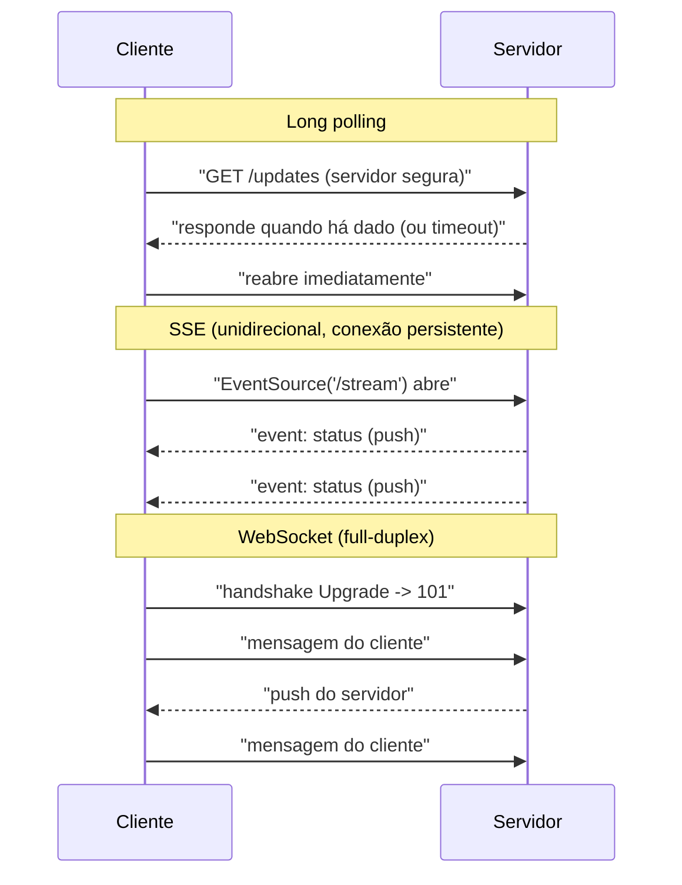
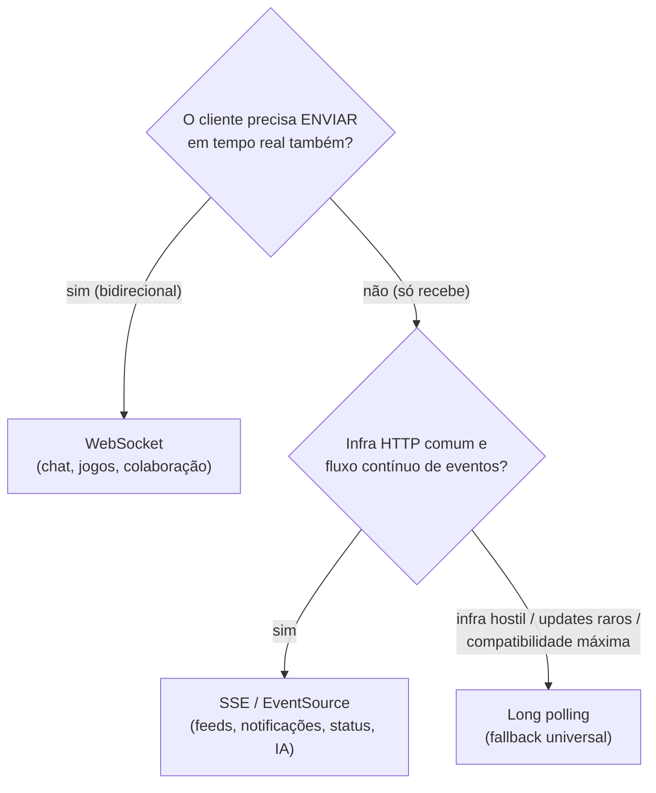

# Long polling, Server-Sent Events e WebSockets: quando usar cada técnica de tempo real

> **Bloco:** Redes e protocolos · **Nível:** Intermediário/Avançado · **Tempo de leitura:** ~28 min

## TL;DR

A web nasceu **pull**: o cliente pergunta, o servidor responde. Mas muita coisa é **push**: o servidor tem algo novo (notificação, mensagem, cotação, status) e quer entregar **na hora**, sem o cliente perguntar. Três técnicas resolvem esse "tempo real" com trade-offs diferentes, e escolher errado custa caro. **Polling/Long polling:** o cliente pergunta repetidamente; no *long polling* o servidor **segura a requisição aberta** até ter dados (ou timeout), reduzindo chamadas vazias. Funciona em qualquer infraestrutura HTTP, mas tem overhead de re-conexão e latência irregular — é o **fallback universal**. **Server-Sent Events (SSE):** um canal **unidirecional** (servidor → cliente) sobre HTTP, via `EventSource`, com **reconexão automática** e formato `text/event-stream`. Simples, roda sobre HTTP/1.1+ e atravessa proxies — ideal quando o cliente **só recebe** (feeds, notificações, progresso, atualizações de status). **WebSockets:** canal **full-duplex** persistente sobre TCP (após handshake HTTP); cliente e servidor falam nos dois sentidos a qualquer momento — necessário quando o cliente também **envia em tempo real** (chat, jogos, colaboração, trading). Regra de decisão: **fluxo só servidor→cliente, pouco frequente ou compatibilidade máxima → long polling; só servidor→cliente, contínuo → SSE; ambos os lados em tempo real → WebSocket.** O erro caro mais comum é usar WebSocket (stateful, complexo de escalar) quando SSE (mais simples, sobre HTTP) bastaria — ou usar polling agressivo quando SSE/WebSocket dariam tempo real de verdade com menos carga.

## O problema que resolve

O modelo HTTP clássico é **request/response iniciado pelo cliente**: o navegador faz `GET /mensagens`, o servidor responde com as mensagens *daquele instante*, e a conexão fecha. Para saber se chegou mensagem nova, o cliente precisa **perguntar de novo**. Mas pense em casos onde a novidade é gerada **no servidor, de forma assíncrona**:

- Um chat: a mensagem do outro usuário chega ao servidor *quando ele a manda* — o seu cliente não tem como saber disso a não ser perguntando.
- Um dashboard de monitoramento: a métrica muda continuamente; você quer ver ao vivo.
- O status de um pedido/entrega: muda quando o sistema processa, não quando você abre a tela.
- Uma cotação de bolsa, o placar de um jogo, "fulano está digitando".

Em todos, o **gatilho** está no servidor, mas o modelo HTTP só deixa o **cliente** iniciar. A solução ingênua — **polling**: o cliente pergunta a cada X segundos (`GET /mensagens` num loop) — tem dois problemas opostos e insolúveis simultaneamente: se o intervalo é **curto**, há muitas requisições vazias (desperdício de CPU, banda, bateria — a maioria retorna "nada novo"); se é **longo**, a latência da entrega é alta (a mensagem pode esperar até o próximo poll). Você troca eficiência por latência sem nunca ter ambas.

A pergunta central: **"Como o servidor entrega dados ao cliente assim que eles existem (push), em tempo real, sem o desperdício do polling e sem complexidade desnecessária — escolhendo a técnica proporcional ao requisito real de direção e frequência do fluxo?"** As três técnicas — long polling, SSE e WebSocket — são pontos diferentes nessa curva de trade-off entre **simplicidade/compatibilidade** e **eficiência/bidirecionalidade**. A arte é escolher a **mais simples que atende o requisito**, não a mais poderosa.

## O que é (definição aprofundada)

### Polling e Long polling

**Polling simples (short polling):** o cliente faz requisições HTTP repetidas em intervalo fixo (`GET /updates` a cada 5s). Cada requisição é independente, completa, e a maioria volta vazia. É trivial de implementar e roda em qualquer lugar, mas é ineficiente (requisições vazias) e a latência é, em média, metade do intervalo.

**Long polling:** uma evolução que reduz o desperdício. O cliente faz a requisição, mas o **servidor não responde imediatamente** — ele **segura a conexão aberta** até que (a) haja um dado novo para enviar, ou (b) um timeout seja atingido (ex.: 30s). Assim que há dado, o servidor responde e a conexão fecha; o cliente **imediatamente abre outra** requisição long poll, e o ciclo continua. Benefício: a latência de entrega cai quase a zero (o servidor responde *no instante* em que tem o dado), e não há requisições vazias frequentes. Custos: para cada mensagem (ou timeout), há o overhead de **fechar e reabrir** a conexão HTTP (handshake, headers); sob alta frequência de mensagens, isso se aproxima do custo de polling; e manter muitas conexões "penduradas" no servidor consome recursos. É a técnica de **maior compatibilidade** — funciona em qualquer infra HTTP, atravessa qualquer proxy — e por isso é o **fallback histórico** (e o que bibliotecas como Socket.IO usam quando WebSocket não está disponível).

### Server-Sent Events (SSE)

**SSE** é um padrão web para o servidor enviar um **fluxo unidirecional** de eventos ao cliente sobre uma **conexão HTTP persistente**. O cliente abre via a API **`EventSource`** (`new EventSource('/stream')`), e o servidor mantém a resposta aberta, com `Content-Type: text/event-stream`, **empurrando** eventos no formato de texto (`data: ...\n\n`, com campos opcionais `event:`, `id:`, `retry:`). Características centrais:

- **Unidirecional:** dados fluem **apenas servidor → cliente**. O cliente não envia mensagens por esse canal (se precisar falar com o servidor, usa uma requisição HTTP normal, separada).
- **Sobre HTTP:** usa HTTP comum (não muda de protocolo), então atravessa proxies, funciona com HTTP/1.1 e melhor ainda com HTTP/2 (que resolve o limite de conexões por host do HTTP/1.1).
- **Reconexão automática nativa:** se a conexão cai, o `EventSource` do navegador **reconecta sozinho** após um intervalo (configurável via `retry:`), e pode retomar de onde parou usando o header `Last-Event-ID` (o servidor reenvia o que faltou). Isso é uma grande vantagem operacional — você não implementa reconexão manualmente.
- **Texto UTF-8:** o formato é texto; para binário, é menos adequado que WebSocket.

SSE é a escolha "simples e suficiente" quando o cliente **só recebe**: notificações, feeds de atividade, progresso de uma tarefa longa, atualizações de status, streaming de tokens de uma resposta de IA, dashboards de leitura.

### WebSockets

**WebSocket** (RFC 6455) estabelece um canal **full-duplex** (bidirecional simultâneo) **persistente** sobre uma única conexão TCP. Inicia com **handshake HTTP** (`GET` com `Upgrade: websocket`); aceito o upgrade (`101 Switching Protocols`), a conexão deixa de ser HTTP e passa a trafegar **frames** WebSocket — e a partir daí **ambos os lados enviam mensagens a qualquer momento**, sem ciclo request/response. Características:

- **Full-duplex:** cliente **e** servidor empurram mensagens independentemente, simultaneamente. É a única das três técnicas onde o **cliente também envia em tempo real** pelo mesmo canal.
- **Baixa latência e overhead:** após o handshake, os frames têm cabeçalho mínimo — ótimo para alta frequência de mensagens pequenas (jogos, trading).
- **Texto ou binário:** suporta ambos nativamente.
- **Stateful:** o servidor mantém a conexão viva por cliente; escalar horizontalmente exige **sticky sessions** ou um **backplane de pub/sub** (Redis, etc.) para rotear mensagens entre instâncias, além de **heartbeats** (ping/pong) para detectar conexões mortas e estratégia de **reconexão** (que você implementa — não é automática como no SSE).

WebSocket é necessário quando o requisito é **bidirecional em tempo real**; usá-lo para fluxo unidirecional é overkill (complexidade de estado sem o benefício do full-duplex).

### Tabela comparativa: Long polling × SSE × WebSocket

| Dimensão | Long polling | SSE (Server-Sent Events) | WebSocket |
|---|---|---|---|
| **Direção** | Servidor → cliente (resposta) | **Servidor → cliente** (unidirecional) | **Full-duplex** (ambos) |
| **Protocolo** | HTTP (requisições repetidas) | HTTP (`text/event-stream`) | TCP (após handshake HTTP → `101`) |
| **API no cliente** | `fetch`/`XHR` em loop | `EventSource` | `WebSocket` |
| **Conexão** | Aberta até resposta, depois reabre | Persistente, uma só | Persistente, uma só |
| **Reconexão** | Manual (reabre a cada ciclo) | **Automática** (nativa, `Last-Event-ID`) | Manual (você implementa) |
| **Payload** | Texto/JSON | Texto UTF-8 | Texto ou binário |
| **Cliente envia em tempo real?** | Não (só pergunta) | **Não** (canal só recebe) | **Sim** |
| **Atravessa proxies/firewalls** | Excelente | Bom (é HTTP) | Bom (mas alguns proxies tropeçam no upgrade) |
| **Overhead** | Alto (reabertura por mensagem) | Baixo | **Muito baixo** (frames mínimos) |
| **Escala horizontal** | Simples (stateless por ciclo) | Moderada (conexões abertas) | **Complexa** (sticky/backplane) |
| **Complexidade** | Baixa | **Baixa** | Alta |
| **Caso-alvo** | Fallback universal, updates raros | Feeds, notificações, status, streaming IA | Chat, jogos, colaboração, trading |

## Como funciona

As três técnicas atacam o mesmo problema (entregar dados gerados no servidor) por caminhos distintos: long polling **simula** push reabrindo a requisição assim que ela responde; SSE mantém **uma resposta HTTP aberta** e escreve eventos nela continuamente; WebSocket **troca de protocolo** para um canal TCP onde frames fluem nos dois sentidos. Quanto mais "tempo real e bidirecional" o requisito, mais à direita da tabela você vai — pagando em complexidade e estado.

### A progressão da curva de trade-off

Pense numa escada de capacidade vs custo:

1. **Polling simples:** mais simples, pior eficiência/latência. Cliente pergunta no relógio.
2. **Long polling:** servidor segura a resposta até ter dado → latência cai, requisições vazias somem; custo: reabertura por mensagem, conexões penduradas. Máxima compatibilidade.
3. **SSE:** uma conexão persistente, servidor empurra eventos; reconexão automática; sobre HTTP. Eficiente para **só receber**; custo: unidirecional, texto.
4. **WebSocket:** canal full-duplex; ambos empurram; mínimo overhead por mensagem; custo: stateful, escala complexa, reconexão manual.

A regra de ouro: **suba a escada só até onde o requisito exige**. Se o cliente só recebe, parar no SSE; subir para WebSocket adiciona complexidade de estado sem benefício. Se precisa de bidirecional, WebSocket. Se a infra é hostil ou o tráfego é raro, long polling como base/fallback.

### O detalhe operacional que decide

- **Reconexão:** SSE reconecta **sozinho** (vantagem enorme — uma rede móvel que oscila não exige código seu). WebSocket exige **você** detectar a queda (heartbeat) e reabrir, reautenticar e ressincronizar estado. Subestimar isso é causa comum de bugs em produção com WebSocket.
- **HTTP/2 e SSE:** sob HTTP/1.1, o navegador limita conexões por host (~6), e cada `EventSource` consome uma — abrir vários SSE estoura o limite. Sob **HTTP/2** (multiplexação), isso deixa de ser problema. É um motivo concreto para SSE casar bem com HTTP/2.
- **Escala do WebSocket:** N conexões vivas significam estado distribuído. Um evento publicado por qualquer serviço precisa achar **em qual instância** o destinatário está conectado — daí o **backplane pub/sub**. Sem isso, WebSocket "funciona na minha máquina" e quebra ao escalar para várias instâncias.
- **Backpressure:** num canal contínuo (SSE/WebSocket), se o servidor produz mais rápido do que o cliente consome, é preciso tratar acúmulo (descartar, agregar, ou sinalizar) — conecta com o conceito de backpressure.

## Diagrama de fluxo

O primeiro diagrama contrasta os três padrões de comunicação numa sequência; o segundo é a árvore de decisão para escolher a técnica.

## Exemplo prático / caso real

Considere uma **plataforma de e-commerce e logística brasileira** com vários recursos de tempo real, cada um exigindo a técnica certa.

**Acompanhamento de pedido ao vivo → SSE.** A tela "rastreie sua entrega" mostra o status mudando: "separando", "saiu para entrega", "a 2 paradas", "entregue". O fluxo é **só servidor → cliente** — o usuário apenas *observa*, não envia nada por esse canal. A escolha certa é **SSE**: o cliente abre um `EventSource('/orders/789/stream')` e recebe os eventos de status conforme o sistema os gera. Benefícios concretos: reconexão **automática** (o app mobile entra e sai de cobertura o tempo todo — o `EventSource` reabre sozinho e retoma via `Last-Event-ID` sem perder eventos) e simplicidade (roda sobre HTTP, atravessa o proxy corporativo, nada de gerenciar estado de conexão full-duplex). Usar WebSocket aqui seria **overkill** — adicionaria complexidade de escala e reconexão manual para um fluxo que é puramente de leitura.

**Chat de atendimento → WebSocket.** O chat entre comprador e vendedor (ou com o suporte) exige que **ambos** os lados enviem mensagens em tempo real, mais indicadores de presença ("digitando...") e confirmação de leitura — tudo **bidirecional e de baixa latência**. Aqui SSE não basta (o cliente precisa **enviar**, não só receber). A escolha é **WebSocket**: canal full-duplex, mensagens pequenas e frequentes com overhead mínimo. Para escalar em horário de pico, as instâncias de WebSocket usam um **backplane Redis pub/sub** — quando o vendedor (conectado à instância A) manda mensagem para o comprador (conectado à instância B), o evento publicado no Redis chega à instância certa. Implementaram **heartbeat** (ping/pong a cada 30s) para derrubar conexões zumbis e lógica de **reconexão** no cliente com re-autenticação e ressincronização do histórico.

**Notificações de promoção → SSE (ou long polling como fallback).** Notificações push dentro do app ("sua wishlist baixou de preço") são **unidirecionais**. SSE resolve. Para navegadores/redes onde SSE tropeça, a biblioteca cai para **long polling** automaticamente — garantindo entrega em qualquer ambiente, ao custo de eficiência.

**Disponibilidade de estoque em página de produto → long polling.** Numa funcionalidade legada que precisa rodar atrás de um proxy corporativo antigo e hostil a conexões persistentes, optaram por **long polling**: o cliente pergunta "mudou o estoque?" e o servidor segura até mudar ou dar timeout de 30s. Não é elegante, mas **funciona em qualquer lugar** — o critério decisivo foi compatibilidade máxima, não eficiência.

**O erro que evitaram.** Numa proposta inicial, alguém quis usar **WebSocket para tudo** — inclusive o rastreamento de pedido (que é só leitura). O time recuou ao perceber o custo: WebSocket teria forçado sticky sessions/backplane, reconexão manual e estado distribuído para um caso onde **SSE** entregava o mesmo resultado com reconexão grátis e sem estado complexo. A lição: **escolha a técnica proporcional ao requisito de direção do fluxo** — bidirecional pede WebSocket; unidirecional contínuo, SSE; e long polling fica como o fallback universal robusto.

## Quando usar / Quando evitar

**Long polling:**

- Use como **fallback universal** (quando SSE/WebSocket não estão disponíveis na infra/cliente), para **updates pouco frequentes**, ou quando **compatibilidade máxima** com proxies/firewalls antigos é o critério decisivo.
- **Evite** para fluxos de **alta frequência** (o overhead de reabrir conexão a cada mensagem aproxima-se do polling e desperdiça recursos) — aí SSE/WebSocket são superiores.

**SSE:**

- Use quando o fluxo é **só servidor → cliente** e contínuo: feeds de atividade, notificações, progresso de tarefa longa, atualizações de status, **streaming de tokens de IA**, dashboards de leitura. Aproveite a **reconexão automática** e a simplicidade de rodar sobre HTTP (melhor com HTTP/2).
- **Evite** quando o cliente precisa **enviar** dados em tempo real pelo mesmo canal (use WebSocket) ou para payload primariamente **binário** (SSE é texto UTF-8).

**WebSocket:**

- Use quando o requisito é **bidirecional em tempo real**: chat, jogos multiplayer, edição colaborativa, presença, trading, qualquer caso onde **cliente e servidor empurram** mensagens com baixa latência.
- **Evite** para fluxos **unidirecionais** (prefira SSE — menos complexidade, reconexão grátis) e para **request/response simples** (use HTTP normal). Considere o custo de **estado/escala** (sticky sessions, backplane, heartbeats, reconexão manual) antes de adotar.

## Anti-padrões e armadilhas comuns

- **WebSocket para fluxo unidirecional.** O anti-padrão mais caro: usar WebSocket (stateful, escala complexa, reconexão manual) quando o cliente só **recebe**. SSE entrega o mesmo com reconexão automática e sem estado complexo. Use WebSocket só quando o cliente também **envia** em tempo real.
- **Polling agressivo onde push resolveria.** Pollar a cada 1-2s "para parecer tempo real" gera carga enorme de requisições vazias e ainda tem latência. Se o requisito é tempo real, use SSE/WebSocket; se não é, pollar devagar.
- **Esquecer a escala stateful do WebSocket.** Funciona com uma instância e quebra com várias: sem **sticky sessions** ou **backplane pub/sub**, um evento não acha em qual instância o cliente está. Planeje isso desde o início.
- **Não implementar heartbeat/reconexão no WebSocket.** Conexões zumbis (TCP que parece vivo mas não está) e quedas de rede sem reconexão derrubam a experiência. WebSocket exige **você** tratar ping/pong e reabertura — não é automático como no SSE.
- **Ignorar o limite de conexões do SSE em HTTP/1.1.** Sob HTTP/1.1, abrir vários `EventSource` estoura o limite de ~6 conexões por host e trava outras requisições. Use **HTTP/2** (multiplexação) ou consolide num único stream.
- **Tentar enviar dados do cliente pelo canal SSE.** SSE é **unidirecional**; o cliente fala com o servidor por requisições HTTP separadas. Esperar bidirecionalidade do SSE é erro conceitual.
- **Ignorar backpressure em canal contínuo.** Se o servidor empurra mais rápido que o cliente consome (SSE/WebSocket), o acúmulo precisa ser tratado (agregar, descartar, sinalizar). Ignorar leva a memória crescente e latência.
- **Não ter fallback.** Ambientes corporativos/redes móveis às vezes bloqueiam WebSocket ou conexões persistentes. Bibliotecas maduras (Socket.IO) caem para long polling — desenhar sem fallback quebra para parte dos usuários.
- **Usar SSE/WebSocket para o que é request/response.** Carregar um formulário ou buscar um recurso não precisa de canal persistente. Tempo real é para **eventos assíncronos gerados no servidor**, não para toda interação.

## Relação com outros conceitos

- **REST vs GraphQL vs gRPC vs WebSockets (16/06):** WebSocket é uma das opções de transporte de tempo real; GraphQL **subscriptions** tipicamente rodam sobre WebSocket; gRPC streaming é uma alternativa para tempo real **interno** entre serviços (não no browser).
- **HTTP/2 e HTTP/3 (16/03):** SSE se beneficia muito de HTTP/2 (multiplexação resolve o limite de conexões por host); o transporte subjacente afeta a viabilidade das técnicas.
- **Semântica HTTP (16/07):** long polling e SSE são HTTP comum (status codes, headers); WebSocket usa HTTP só no handshake (`101 Switching Protocols`) e depois sai do modelo request/response.
- **Backpressure / resiliência (04/10):** canais contínuos exigem controle de backpressure; WebSocket/SSE precisam de reconexão e tratamento de queda, conectando com padrões de resiliência.
- **Mensageria e pub/sub (06):** o backplane que escala WebSocket horizontalmente é tipicamente um pub/sub (Redis, Kafka); tempo real no cliente é frequentemente a ponta de um pipeline de eventos.
- **Segurança (16/08):** WebSocket exige autenticação no handshake e por mensagem; o canal não tem a semântica HTTP de CORS/cookies da mesma forma — tratar auth e origem é responsabilidade explícita.
- **API Gateway / BFF (04/08):** nem todo gateway lida bem com conexões persistentes/upgrade; a topologia de tempo real às vezes precisa de um serviço dedicado fora do caminho HTTP comum.

## Pontos para fixar (revisão)

- A web é **pull**; tempo real é **push**. As três técnicas resolvem push com trade-offs entre simplicidade/compatibilidade e eficiência/bidirecionalidade.
- **Long polling:** cliente pergunta, servidor **segura a resposta** até ter dado ou timeout, depois reabre. Máxima compatibilidade; overhead de reabertura; **fallback universal**.
- **SSE:** canal **unidirecional** (servidor → cliente) sobre HTTP, via `EventSource`, com **reconexão automática** nativa (`Last-Event-ID`). Simples; ideal para o cliente que **só recebe** (feeds, status, streaming de IA). Texto UTF-8.
- **WebSocket:** canal **full-duplex** persistente (handshake HTTP → `101`); ambos empurram em tempo real. Necessário para **bidirecional** (chat, jogos); stateful, escala complexa (sticky/backplane), reconexão manual.
- **Regra de decisão:** cliente também envia em tempo real → **WebSocket**; só recebe, contínuo → **SSE**; raro/infra hostil/compatibilidade → **long polling**.
- **Erro caro mais comum:** WebSocket para fluxo unidirecional (use SSE). Suba a escada de capacidade só até o requisito exigir.
- SSE casa com **HTTP/2** (evita o limite de ~6 conexões por host do HTTP/1.1).
- WebSocket exige planejar **escala stateful**, **heartbeat** e **reconexão** desde o início.

## Referências

- [Using server-sent events — MDN Web Docs](https://developer.mozilla.org/en-US/docs/Web/API/Server-sent_events/Using_server-sent_events)
- [EventSource — Web APIs — MDN Web Docs](https://developer.mozilla.org/en-US/docs/Web/API/EventSource)
- [Server-sent events — Web APIs — MDN Web Docs](https://developer.mozilla.org/en-US/docs/Web/API/Server-sent_events)
- [The WebSocket API (WebSockets) — MDN Web Docs](https://developer.mozilla.org/en-US/docs/Web/API/WebSockets_API)
- [Writing WebSocket servers — MDN Web Docs](https://developer.mozilla.org/en-US/docs/Web/API/WebSockets_API/Writing_WebSocket_servers)
- [RFC 6455 — The WebSocket Protocol](https://datatracker.ietf.org/doc/html/rfc6455)
- [WebSockets vs Server-Sent Events — Ably](https://ably.com/blog/websockets-vs-sse)
