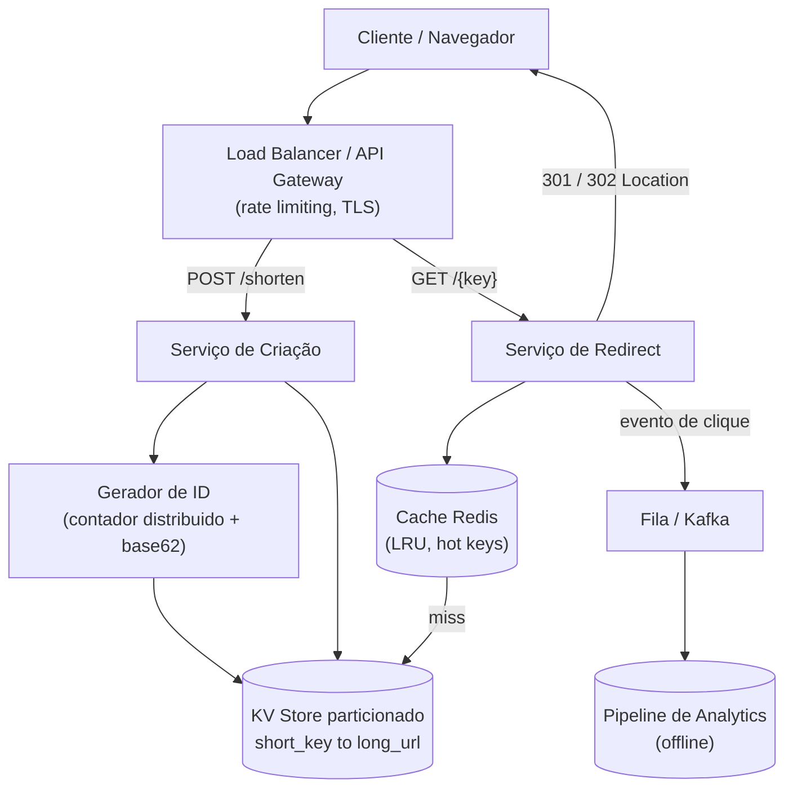

# System Design: Encurtador de URL (tipo bit.ly)

> **Bloco:** System Design (estudos de caso) · **Nível:** Avançado · **Tempo de leitura:** ~28 min

## TL;DR

Um encurtador de URL transforma uma URL longa (`https://exemplo.com/artigos/2026/system-design?utm=...`) num alias curto (`https://bit.ly/3xY9aZ`) e, quando alguém acessa o alias, redireciona para a original. Parece trivial, mas é um estudo de caso clássico porque condensa as decisões centrais de qualquer sistema de larga escala: **geração de IDs únicos sem colisão**, **assimetria leitura/escrita extrema** (redirects são ~100× mais frequentes que criações), **cache agressivo** (o conjunto quente cabe em memória), **redirect 301 vs 302** (cacheável vs rastreável), e **escolha de banco** (chave-valor simples favorece NoSQL/KV store sobre SQL relacional). O coração do design é o mapeamento `short_key → long_url`: como gerar a `short_key` (encoding base62 de um contador/Snowflake ID, ou hash truncado com tratamento de colisão), como armazená-la (KV store particionado por chave), e como servir o redirect em <10ms com cache. A escala-alvo típica (100M criações/dia) cabe confortavelmente em commodity hardware com sharding e CDN — o desafio não é volume bruto de dados, é **latência de leitura previsível** e **unicidade garantida das chaves** sob concorrência. Decisão-chave de entrevista: prefira **base62 de um ID sequencial/distribuído** a hashing, porque elimina colisões por construção; e use **301 cacheável** só se não precisa de analytics por clique (senão 302).

## Requisitos (funcionais e não-funcionais)

**Funcionais:**

- Dado uma URL longa, gerar uma URL curta única.
- Dado uma URL curta, redirecionar para a URL longa original.
- (Opcional) Aliases customizados (`bit.ly/minha-marca`).
- (Opcional) Expiração de links (TTL).
- (Opcional) Analytics: contagem de cliques, geografia, referrer.

**Não-funcionais:**

- **Alta disponibilidade** no caminho de redirect — se o encurtador cai, milhões de links em e-mails, QR codes e posts param de funcionar. É o requisito dominante.
- **Baixa latência** no redirect (p99 < 50ms, idealmente < 10ms via cache/CDN).
- **Unicidade garantida** das chaves curtas — duas URLs longas nunca podem colidir na mesma chave (corromperia redirects).
- **Não-previsibilidade** desejável (chaves não devem ser facilmente enumeráveis, por privacidade/segurança).
- **Escalabilidade horizontal** — adicionar capacidade sem reescrever a arquitetura.
- **Durabilidade** — um link criado não pode ser perdido.

A assimetria leitura/escrita é a observação que orienta todo o resto: o sistema é **read-heavy**. Otimizamos ferozmente o caminho de leitura (redirect) e aceitamos um caminho de escrita (criação) mais caro.

## Estimativas de capacidade (back-of-the-envelope)

Suponha **100 milhões de novas URLs por dia** e razão leitura:escrita de **100:1** (cada link é acessado em média 100 vezes ao longo da vida).

**QPS de escrita (criação):**

```
100M criações/dia ÷ 86.400 s/dia ≈ 1.157 escritas/s (média)
Pico (≈2× a 3× a média)        ≈ 2.300 a 3.500 escritas/s
```

**QPS de leitura (redirect):**

```
100:1 × 1.157 ≈ 115.700 leituras/s (média)
Pico                ≈ 230.000 a 350.000 leituras/s
```

Esse número de leitura é o que justifica cache e CDN — servir 100k+ QPS direto do banco seria caro e arriscado.

**Storage (5 anos de retenção):**

```
100M/dia × 365 dias × 5 anos ≈ 182,5 bilhões de registros
```

Tamanho por registro (estimativa generosa): `short_key` (7 bytes) + `long_url` (~100 bytes médios) + metadados (created_at, user_id, TTL ≈ 30 bytes) ≈ **~140 bytes/registro**, arredondando para **~500 bytes com overhead/índices**.

```
182,5B × 500 bytes ≈ 91 TB (com folga; ~25 TB só os dados crus)
```

São dezenas de TB — não cabe num único nó, exige **sharding**, mas não é "big data" extremo. Particionável em algumas dezenas de nós.

**Espaço de chaves (base62, comprimento 7):**

```
62^7 = ~3,5 trilhões de combinações
```

Com 182,5B URLs em 5 anos, usamos ~5% do espaço de 7 caracteres — folga enorme. Comprimento **7 é suficiente** (62^6 ≈ 56,8B seria justo demais; 62^7 dá margem).

**Banda (leitura):**

```
230.000 redirects/s no pico × ~500 bytes de resposta HTTP ≈ 115 MB/s
```

Modesto — o gargalo é QPS e latência, não banda.

## Modelo de dados e API (alto nível)

**Modelo de dados** (uma tabela/KV simples):

```
url_mapping
  short_key   STRING (PK)      -- ex.: "3xY9aZ" (base62, 7 chars)
  long_url    STRING
  created_at  TIMESTAMP
  user_id     STRING (nullable)
  expires_at  TIMESTAMP (nullable)
```

O acesso primário é **lookup por chave exata** (`short_key`) — não há joins, não há queries por range complexas. Isso favorece um **KV store** (DynamoDB, Cassandra, Redis como cache) sobre um RDBMS, embora um RDBMS particionado também funcione. Analytics, se existir, vai para um **store separado** (event stream → data warehouse), nunca acoplado ao caminho de redirect.

**API (REST):**

```
POST /api/v1/shorten
  body: { "long_url": "https://...", "custom_alias": "opcional", "ttl": "opcional" }
  resp: { "short_url": "https://bit.ly/3xY9aZ" }

GET /{short_key}
  resp: 301/302 Location: https://...  (redirect)
```

O `GET /{short_key}` é o endpoint quente. A criação (`POST`) é rara e pode tolerar mais latência.

## Arquitetura da solução

Os componentes e o porquê de cada um:

- **API Gateway / Load Balancer:** ponto de entrada, distribui carga, faz rate limiting (protege contra abuso de criação em massa e enumeração de chaves) e TLS termination.
- **Serviço de criação (Write path):** recebe a URL longa, valida (URL bem-formada, blocklist de domínios maliciosos/phishing), gera a `short_key` única e persiste o mapeamento. É stateless e escala horizontalmente.
- **Gerador de IDs único:** o componente crítico. Duas estratégias principais (detalhadas em Trade-offs): (a) **contador distribuído + base62 encoding** (ranges pré-alocados por nó via Redis/Zookeeper, ou IDs estilo **Snowflake**), ou (b) **hash da URL truncado** com resolução de colisão. A opção (a) elimina colisões por construção e é a recomendada.
- **Serviço de redirect (Read path):** recebe `short_key`, busca a `long_url` (primeiro no cache, depois no banco) e responde com redirect HTTP. Stateless, replicado, atrás de cache/CDN.
- **Cache (Redis/Memcached):** guarda os mapeamentos quentes (`short_key → long_url`). Como o tráfego segue uma distribuição **power-law** (poucos links concentram a maioria dos acessos — um link viral em milhões de tweets), um cache de poucos GB cobre a esmagadora maioria das leituras. Política **LRU**, padrão **cache-aside**.
- **Banco de dados (KV store particionado):** a fonte da verdade, durável. Particionado por `short_key` (hash da chave → shard). DynamoDB, Cassandra ou MySQL/Postgres com sharding.
- **CDN (opcional, para 301):** se usar redirect 301 (permanente, cacheável), a própria CDN pode cachear o redirect na borda, absorvendo a maior parte do tráfego sem nem tocar a origem.
- **Pipeline de analytics (assíncrono):** o redirect emite um evento (clique) para uma fila/stream (Kafka), processado offline para contagens e dashboards. Desacoplado do caminho crítico para não adicionar latência ao redirect.

**Fluxo de escrita:** cliente → LB → serviço de criação → gerador de ID (base62) → grava no KV store → (popula cache) → retorna `short_url`.

**Fluxo de leitura:** cliente → CDN/LB → serviço de redirect → cache (hit? retorna) → (miss) banco → popula cache → emite evento de analytics async → responde 301/302.

## Diagrama de arquitetura



## Pontos de escala e gargalos

**O que quebra primeiro:** o **banco de dados no caminho de leitura**, se servirmos 100k+ QPS direto dele. Solução: **cache na frente** (Redis), que absorve 90%+ das leituras dado o padrão power-law; e **CDN** para 301s cacheáveis, que absorve a borda.

**Geração de IDs sob concorrência:** um contador único centralizado vira gargalo de escrita e SPOF. Solução: **pré-alocação de ranges** — cada nó de criação pega um bloco de IDs (ex.: 1.000.000 IDs) de um coordenador (Redis `INCRBY`, Zookeeper) e os consome localmente, voltando ao coordenador só ao esgotar. Reduz a contenção em ~1.000.000×. Alternativa sem coordenador: **Snowflake IDs** (timestamp + machine_id + sequence) gerados localmente.

**Sharding do banco:** particione por `hash(short_key)` para distribuir uniformemente. Use **consistent hashing** para que adicionar/remover shards remapeie só uma fração das chaves. O lookup é sempre por chave exata, então o roteamento ao shard é direto.

**Réplicas de leitura:** mesmo com cache, mantenha réplicas read-only do banco para cache misses e tolerância a falha do primário.

**Hot key no cache:** um link extremamente viral pode sobrecarregar o nó de cache que o detém. Solução: **replicar a hot key** em múltiplos nós ou usar cache local (in-process) nos servidores de redirect para os top-N links.

**Caminho de analytics:** nunca grave a contagem de cliques sincronicamente no redirect (cada clique viraria uma escrita no banco quente). Emita um evento assíncrono; agregue offline. Isso desacopla a disponibilidade do analytics da disponibilidade do redirect.

## Trade-offs e decisões-chave

**Geração de chave: encoding de contador vs hashing.**

- **Base62 de ID sequencial/distribuído:** pega um ID numérico único (de um contador distribuído ou Snowflake) e codifica em base62. **Vantagem:** zero colisão por construção, chaves curtas. **Desvantagem:** chaves sequenciais são previsíveis/enumeráveis (mitigável com Snowflake ou ofuscação). É a abordagem recomendada na maioria das entrevistas.
- **Hash (MD5/SHA) truncado:** hasheia a URL longa e pega os primeiros N caracteres. **Vantagem:** mesma URL → mesma chave (deduplicação natural). **Desvantagem:** colisões são inevitáveis ao truncar (precisa detectar e resolver com retry/salt), o que adiciona uma leitura extra por escrita.

**Redirect 301 vs 302.**

- **301 (Moved Permanently):** o navegador/CDN **cacheia** o redirect. Cliques subsequentes nem chegam ao servidor — ótimo para latência e carga, mas **você perde a contagem de cliques** (o navegador pula você).
- **302 (Found, temporário):** não cacheável; toda visita passa pelo servidor — permite **analytics por clique**, ao custo de mais carga. A escolha depende de o produto precisar de analytics. bit.ly usa redirects que permitem rastreamento.

**Banco: KV/NoSQL vs SQL relacional.** O acesso é puro lookup por chave, sem joins nem transações multi-linha complexas — favorece **KV store** (DynamoDB, Cassandra) pela escala horizontal e simplicidade. SQL particionado funciona mas exige sharding manual e oferece garantias que não usamos. A simplicidade do modelo é o argumento decisivo.

**Cache-aside vs write-through.** Cache-aside (popular o cache no miss) é suficiente dado o padrão de acesso; write-through (popular no momento da criação) ajuda só se links são acessados imediatamente após criados (comum em alguns fluxos), e pode ser combinado.

## Erros comuns em entrevista

- **Usar UUID como chave curta.** Um UUID tem 36 caracteres — não é "curto". A chave precisa ser compacta (base62, ~7 chars).
- **Contador único centralizado sem pré-alocação.** Vira gargalo de escrita e SPOF. Esquecer a pré-alocação de ranges ou Snowflake é o erro clássico de ID generation.
- **Ignorar colisões no hashing.** Quem propõe hash truncado e não menciona detecção/resolução de colisão tem uma falha de corretude — duas URLs podem mapear para a mesma chave e corromper redirects.
- **Gravar analytics sincronamente no redirect.** Transforma cada clique numa escrita no banco quente, destruindo a latência e a disponibilidade. Analytics é sempre assíncrono.
- **Não distinguir 301 de 302.** A escolha tem consequência direta em latência (cacheabilidade) vs capacidade de rastrear cliques. Mencionar o trade-off demonstra profundidade.
- **Esquecer a assimetria leitura/escrita.** Otimizar o caminho de escrita quando o sistema é 100:1 read-heavy é otimizar a coisa errada.
- **Subdimensionar o espaço de chaves.** Propor 5-6 caracteres "para economizar" pode esgotar o espaço; mostrar a conta `62^7 ≈ 3,5T` justifica a escolha.
- **Não validar a URL de entrada.** Sem blocklist de phishing/malware, o encurtador vira vetor de ataque (links curtos escondem o destino).

## Relação com outros conceitos

- **Consistent Hashing:** usado para particionar o KV store por `short_key` com remapeamento mínimo ao escalar shards.
- **Cache patterns (cache-aside, LRU):** o caminho de leitura depende de cache para sustentar 100k+ QPS; o padrão power-law do tráfego é o que torna o cache tão eficaz.
- **Sharding:** dezenas de TB de mapeamentos exigem particionamento horizontal por hash da chave.
- **Snowflake / geração de IDs distribuídos:** alternativa ao contador central para gerar IDs únicos sem coordenação.
- **Rate limiter:** protege o endpoint de criação contra abuso em massa e o de redirect contra enumeração de chaves.
- **CDN e cache de borda:** redirects 301 cacheáveis podem ser servidos na borda, descarregando a origem.
- **Message brokers (Kafka):** o pipeline de analytics consome eventos de clique de forma desacoplada do caminho crítico.
- **CAP:** no redirect, preferimos disponibilidade (servir um valor possivelmente levemente desatualizado do cache) sobre consistência forte — um link raramente muda de destino.

## Referências

- [Design A URL Shortener — ByteByteGo (Alex Xu)](https://bytebytego.com/courses/system-design-interview/design-a-url-shortener)
- [Design a URL Shortener Like Bitly — Hello Interview](https://www.hellointerview.com/learn/system-design/problem-breakdowns/bitly)
- [URL Shortening Service (bit.ly, TinyURL) — GeeksforGeeks](https://www.geeksforgeeks.org/system-design/system-design-url-shortening-service/)
- [How to Design a URL Shortener — DesignGurus](https://www.designgurus.io/blog/url-shortening)
- [System Design: URL Shortener — DEV Community (Karan Pratap Singh)](https://dev.to/karanpratapsingh/system-design-url-shortener-10i5)
- [System Design Primer — donnemartin (GitHub)](https://github.com/donnemartin/system-design-primer)
- [Consistent Hashing for System Design Interviews — Hello Interview](https://www.hellointerview.com/learn/system-design/core-concepts/consistent-hashing)
