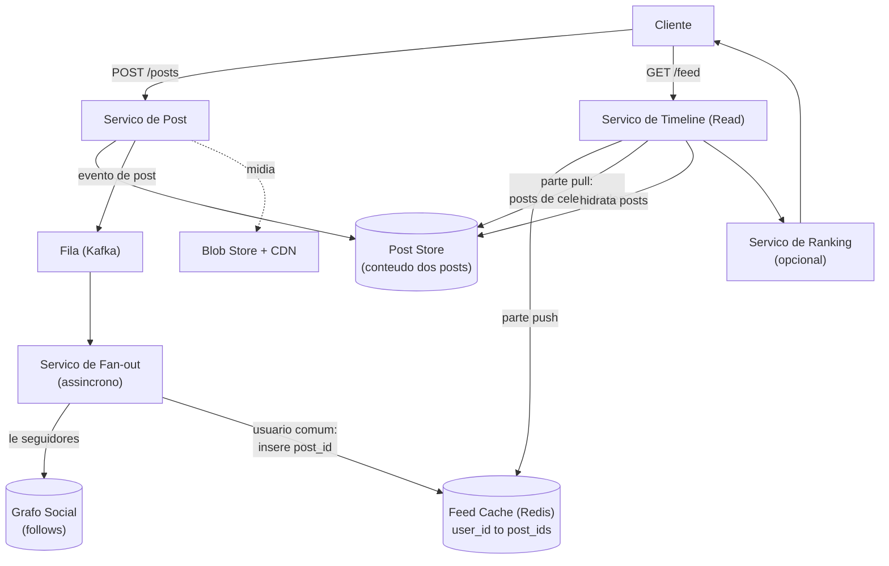

# System Design: Timeline / Feed de Rede Social (Twitter / Instagram)

> **Bloco:** System Design (estudos de caso) · **Nível:** Avançado · **Tempo de leitura:** ~32 min

## TL;DR

A timeline (feed) de uma rede social mostra, a cada usuário, os posts recentes de quem ele segue, ordenados (cronologicamente ou por relevância). O problema central é **onde pagar o custo de montar o feed**: na hora da escrita (post) ou na hora da leitura (abertura do app). **Fan-out on write (push)** pré-computa o feed: quando você posta, o post é "espalhado" (fanned out) para o feed cacheado de cada seguidor — leitura fica barata (só ler uma lista pronta), mas a escrita de um usuário com milhões de seguidores vira milhões de gravações. **Fan-out on read (pull)** não pré-computa nada: ao abrir o app, o sistema busca os posts recentes de todos que você segue e mescla na hora — escrita barata, mas leitura cara e repetida. O **problema da celebridade** (Katy Perry com 80M+ seguidores) quebra o push puro: um único tweet dela tentaria 80M de escritas. A solução de produção é **híbrida**: fan-out on write para usuários comuns (a esmagadora maioria, com poucos seguidores) e fan-out on read para celebridades (seus posts são buscados ao vivo e mesclados no feed pré-computado). A timeline é read-heavy e tolera **eventual consistency** (um post pode demorar segundos a aparecer) — o que abre espaço para cache massivo, processamento assíncrono e o trade-off clássico push/pull. Decisão-chave de entrevista: nunca proponha push puro nem pull puro; reconheça a assimetria de seguidores e defenda o **híbrido com um limiar** (ex.: > 10k–100k seguidores → pull).

## Requisitos (funcionais e não-funcionais)

**Funcionais:**

- Publicar um post (texto, mídia).
- Seguir/deixar de seguir usuários.
- Ver a timeline: posts recentes de quem sigo, ordenados.
- (Opcional) Ranking por relevância (não apenas cronológico).
- (Opcional) Likes, comentários, reposts.

**Não-funcionais:**

- **Baixa latência de leitura** (feed deve carregar em < 200ms) — é a métrica que o usuário sente.
- **Alta disponibilidade** — o feed precisa carregar mesmo sob falhas parciais (degradar é aceitável; ficar fora não).
- **Eventual consistency aceitável** — tolerar que um post leve alguns segundos para aparecer nos feeds. Não há requisito de consistência forte. Isso é o que torna o problema tratável em escala.
- **Escalabilidade** para centenas de milhões de usuários ativos e dezenas de milhares de posts/s.
- **Read-heavy:** muito mais aberturas de feed do que novos posts.

A combinação "read-heavy + eventual consistency OK" é o que habilita pré-computação agressiva e cache — pilar do design.

## Estimativas de capacidade (back-of-the-envelope)

Suponha **200 milhões de DAU** (daily active users), cada um:

- Abre o feed **10 vezes/dia** (leitura).
- Publica **0,2 posts/dia** em média (a maioria consome, poucos produzem).
- Segue em média **300 contas**.

**QPS de leitura (feed):**

```
200M DAU × 10 aberturas/dia = 2 bilhões de leituras/dia
2B ÷ 86.400 s ≈ 23.000 leituras/s (média)
Pico (≈3×)              ≈ 70.000 leituras/s
```

**QPS de escrita (posts):**

```
200M × 0,2 posts/dia = 40M posts/dia
40M ÷ 86.400 ≈ 460 posts/s (média)
Pico (≈3×)         ≈ 1.400 posts/s
```

A assimetria leitura:escrita é ~50:1 — fortemente read-heavy.

**Custo do fan-out on write:** cada post de um usuário com `F` seguidores gera `F` gravações no feed.

```
Usuário comum (300 seguidores):  300 escritas por post — barato.
Celebridade (80M seguidores):    80.000.000 escritas por UM post.
```

É essa última conta que mata o push puro: um único tweet de uma celebridade dispara dezenas de milhões de gravações concorrentes — pico de carga insuportável e atraso de propagação.

**Storage do feed pré-computado (push):** se cada usuário mantém os ~800 IDs de post mais recentes do feed cacheado, e cada entrada é ~ (post_id 8 bytes + author_id 8 bytes + timestamp 8 bytes) ≈ 24 bytes:

```
200M usuários × 800 entradas × 24 bytes ≈ 3,84 TB de feeds cacheados
```

Cabe num cluster de cache (Redis) de poucos TB — viável. Armazenamos **IDs**, não os posts inteiros (hidratação dos posts vem depois, do post store).

**Volume de posts (storage):**

```
40M posts/dia × 365 ≈ 14,6 bilhões de posts/ano
14,6B × ~300 bytes (texto + metadados, mídia à parte em blob store) ≈ ~4,4 TB/ano
```

Mídia (imagens/vídeos) vai para **blob storage + CDN**, não para o banco de posts.

## Modelo de dados e API (alto nível)

**Modelo de dados:**

```
users(user_id PK, name, ...)
posts(post_id PK, author_id, content, media_url, created_at)
follows(follower_id, followee_id)          -- grafo social, indexado dos dois lados
feed_cache(user_id -> lista de post_ids)   -- feed pré-computado (push), em Redis
```

O índice `follows` precisa ser eficiente **nas duas direções**: "quem eu sigo" (para pull) e "quem me segue" (para fan-out on write).

**API:**

```
POST /api/v1/posts          { content, media }              -> cria post + dispara fan-out
GET  /api/v1/feed?cursor=…  -> retorna página da timeline (post_ids hidratados)
POST /api/v1/follow         { followee_id }
```

A paginação usa **cursor** (keyset/seek), não offset, porque o feed é infinito e muda constantemente — offset causaria duplicatas/saltos.

## Arquitetura da solução

- **Serviço de Post:** recebe a publicação, persiste no **post store** (banco de posts) e dispara o **fan-out** (assíncrono, via fila).
- **Post store:** banco durável dos posts (KV/NoSQL particionado por `post_id` ou por `author_id`). Fonte da verdade do conteúdo.
- **Grafo social (follow store):** armazena as relações seguir/seguido. Pode ser um banco de grafo ou tabelas relacionais/NoSQL bem indexadas; precisa responder rápido "quem segue X" (para fan-out) e "quem X segue" (para pull).
- **Serviço de Fan-out (assíncrono):** consome posts de uma fila e, para cada post de usuário comum, insere o `post_id` no `feed_cache` de cada seguidor. É o trabalho pesado, feito offline do caminho do usuário. Para celebridades, **não faz fan-out** (marca o autor como "pull").
- **Feed cache (Redis):** mantém, por usuário, a lista ordenada dos `post_ids` mais recentes do feed (push). É o que torna a leitura barata.
- **Serviço de Timeline (Read):** monta o feed na leitura. Lê a lista pré-computada do `feed_cache` (parte push) **e** busca ao vivo os posts recentes das celebridades que o usuário segue (parte pull), **mescla e ordena** os dois conjuntos, então **hidrata** os `post_ids` (busca conteúdo no post store, com cache).
- **Serviço de Ranking (opcional):** se o feed é por relevância (não cronológico), um serviço de ML reordena os candidatos por score de engajamento previsto.
- **CDN + Blob store:** servem mídia (imagens/vídeos) fora do caminho de dados, perto do usuário.

**Fluxo de escrita (post de usuário comum):** cliente → Serviço de Post → grava no post store → publica evento na fila → Serviço de Fan-out lê seguidores no grafo → insere `post_id` no `feed_cache` de cada um.

**Fluxo de escrita (post de celebridade):** grava no post store; **não** faz fan-out (o post será puxado na leitura dos seguidores).

**Fluxo de leitura:** cliente → Serviço de Timeline → lê `feed_cache` (push) + busca ao vivo posts das celebridades seguidas (pull) → mescla/ordena → hidrata posts (post store + cache) → (ranking opcional) → retorna página.

## Diagrama de arquitetura



## Pontos de escala e gargalos

**O que quebra primeiro: o fan-out de celebridades.** No push puro, um post de quem tem milhões de seguidores dispara milhões de gravações — atrasa a propagação, satura o cluster de cache e cria *hot partitions*. **Solução: o modelo híbrido.** Acima de um limiar de seguidores (ex.: 10k–100k), o usuário é marcado como "pull": seus posts não são espalhados, são buscados ao vivo na leitura dos seguidores. Como há poucas celebridades e cada seguidor faz só uma busca extra (com cache), o custo é amortizado na leitura.

**Hot keys no feed cache:** feeds muito acessados (ou o post viral de uma celebridade) concentram leitura num nó. Solução: replicar a hot key, cache local nos servidores de timeline, e o próprio modelo pull para celebridades (não há um único feed-cache delas).

**Hidratação de posts:** transformar `post_ids` em conteúdo é uma leitura por post. Mitiga-se com **cache de posts** (os posts recentes/populares ficam em Redis) e batching (buscar N posts numa chamada).

**Sharding:**

- **Feed cache** particionado por `user_id` (cada usuário tem seu feed num shard).
- **Post store** por `post_id` ou `author_id`.
- **Grafo social** é o mais delicado: a lista de seguidores de uma celebridade não cabe num nó e é lida intensamente no fan-out — particionar e cachear listas de seguidores grandes.

**Backpressure no fan-out:** picos de posts (evento ao vivo, gol na final) inundam a fila de fan-out. A fila (Kafka) absorve o burst e os workers consomem na taxa que aguentam — o feed simplesmente atrasa alguns segundos (eventual consistency aceitável), sem derrubar o sistema.

**Réplicas e geo-distribuição:** réplicas de leitura do post store e do grafo; feed cache regional perto dos usuários.

## Trade-offs e decisões-chave

**Fan-out on write (push) vs fan-out on read (pull):**

| Dimensão | Push (on write) | Pull (on read) |
|---|---|---|
| Custo de escrita | Alto (F gravações/post) | Baixo (1 gravação) |
| Custo de leitura | Baixo (ler lista pronta) | Alto (buscar+mesclar N seguidos) |
| Latência de leitura | Ótima | Pior |
| Problema da celebridade | Catastrófico (milhões de escritas) | Sem problema |
| Storage | Alto (feed por usuário) | Baixo |
| Frescor para inativos | Desperdiça computação (espalha p/ quem não abre) | Sob demanda |

**A escolha de produção é o híbrido**, porque captura o melhor dos dois: push para a maioria (leitura barata) e pull para celebridades (escrita barata, sem fan-out explosivo). O **limiar** de seguidores que separa os dois é uma decisão de tuning (Twitter historicamente girava em torno de dezenas de milhares).

**Cronológico vs ranqueado.** Feed cronológico é simples (ordenar por timestamp). Feed ranqueado (relevância) precisa de um serviço de ML que reordena candidatos por engajamento previsto — adiciona latência e complexidade, mas é o que plataformas modernas usam. Em entrevista, comece com cronológico e mencione ranking como evolução.

**Armazenar IDs vs posts no feed cache.** Guardar `post_ids` (e hidratar na leitura) economiza ordens de magnitude de storage e mantém os feeds consistentes quando um post é editado/deletado — ao custo de uma hidratação na leitura. Guardar posts inteiros denormalizados é mais rápido de ler mas explode storage e complica updates. **IDs + hidratação com cache** é o padrão.

**Eventual consistency é uma feature, não bug.** Aceitar que um post leve segundos para aparecer permite todo o processamento assíncrono. Forçar consistência forte (todo post visível instantaneamente em todos os feeds) inviabilizaria a escala.

## Erros comuns em entrevista

- **Propor push puro ou pull puro.** Push puro quebra na celebridade; pull puro tem leitura cara e repetida. A resposta sênior é **reconhecer o trade-off e propor o híbrido** com limiar de seguidores.
- **Ignorar o problema da celebridade.** Não mencionar que um usuário com milhões de seguidores quebra o fan-out on write é o erro mais delatador.
- **Fazer fan-out síncrono no caminho do post.** O fan-out tem que ser assíncrono (fila + workers); fazê-lo no request do POST faz a publicação travar até espalhar para todos os seguidores.
- **Armazenar posts inteiros no feed cache.** Explode o storage e complica edição/remoção. Armazene IDs e hidrate.
- **Usar paginação por offset.** Num feed que muda constantemente, offset causa posts duplicados ou pulados. Use cursor/keyset.
- **Esquard mídia no banco de posts.** Imagens/vídeos vão para blob store + CDN, nunca no banco transacional.
- **Não tolerar eventual consistency.** Insistir em consistência forte no feed torna o problema intratável; reconhecer que segundos de atraso são aceitáveis é o que destrava o design.
- **Subestimar o grafo social.** A lista de seguidores de uma celebridade é enorme e lida intensamente — não é um simples `SELECT`.

## Relação com outros conceitos

- **Fan-out on write vs read:** o trade-off push/pull é a essência do problema; ecoa o trade-off geral de "pré-computar vs computar sob demanda".
- **Cache patterns:** o feed pré-computado é um cache; a hidratação de posts usa cache-aside; hot keys exigem replicação de cache.
- **Sharding:** feed cache por `user_id`, post store por `post_id`, grafo social particionado — cada um com sua chave de partição.
- **Message brokers (Kafka):** o fan-out assíncrono e o backpressure dependem de uma fila durável que absorve picos.
- **CAP e eventual consistency:** o feed é AP — prioriza disponibilidade e tolera atraso de propagação sobre consistência forte.
- **CDN e blob storage:** mídia servida na borda, fora do caminho de dados.
- **Consistent hashing:** distribui feed cache e post store por nós com remapeamento mínimo ao escalar.
- **Rate limiter:** protege a API de posts contra spam e o feed contra abuso.

## Referências

- [Design A News Feed System — ByteByteGo (Alex Xu)](https://bytebytego.com/courses/system-design-interview/design-a-news-feed-system)
- [Design Facebook's News Feed — Hello Interview](https://www.hellointerview.com/learn/system-design/problem-breakdowns/fb-news-feed)
- [Design a News Feed System — GitBook (liuzhenglaichn)](https://liuzhenglaichn.gitbook.io/system-design/news-feed/design-a-news-feed-system)
- [Twitter News Feed (Timeline) — GitBook](https://liuzhenglaichn.gitbook.io/system-design/news-feed/twitter-news-feed-timeline)
- [Baseline System Design — Facebook Newsfeed and Fanout (Medium)](https://corgicorporation.medium.com/baseline-system-design-facebook-newsfeed-and-fanout-e95311d52f65)
- [System Design Primer — donnemartin (GitHub)](https://github.com/donnemartin/system-design-primer)
- [Consistent Hashing for System Design Interviews — Hello Interview](https://www.hellointerview.com/learn/system-design/core-concepts/consistent-hashing)
