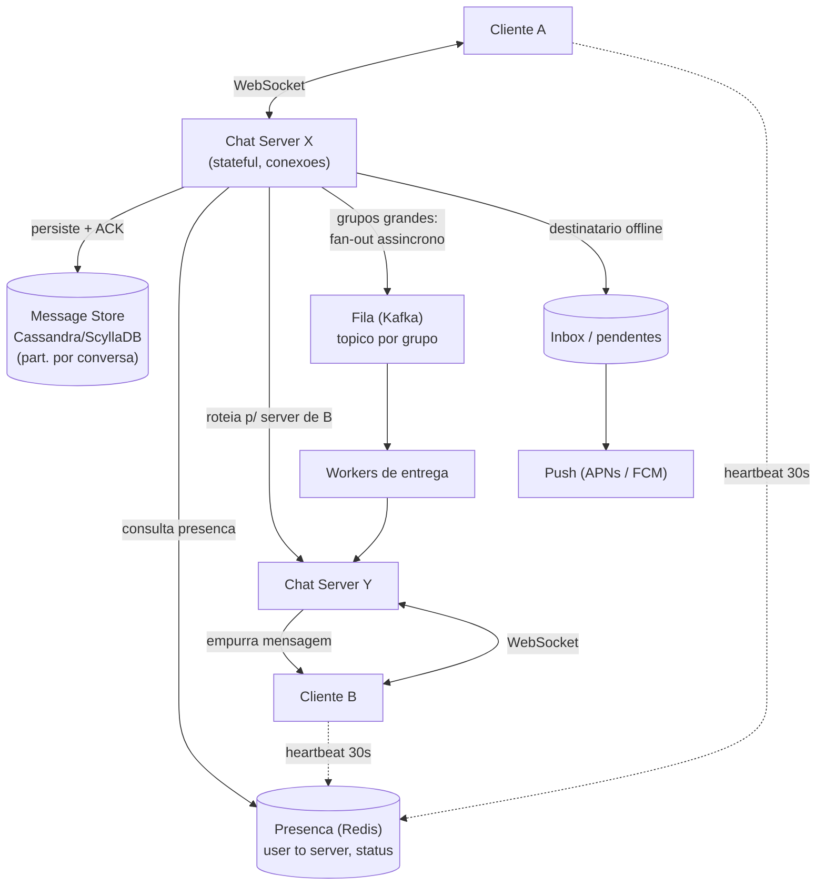

# System Design: Sistema de Chat (WhatsApp / Slack)

> **Bloco:** System Design (estudos de caso) · **Nível:** Avançado · **Tempo de leitura:** ~33 min

## TL;DR

Um sistema de chat entrega mensagens entre usuários em tempo real, mostra quem está online (presença) e garante que as mensagens cheguem na ordem certa, mesmo quando o destinatário está offline. O desafio central não é volume de dados — é manter **milhões de conexões persistentes simultâneas** (WebSocket) e rotear cada mensagem para o servidor que detém a conexão do destinatário. A peça-chave é o **chat server stateful** segurando WebSockets, mais um **mapa de presença** (qual usuário está conectado a qual servidor) num store rápido como Redis. **Entrega:** quando o destinatário está online, empurra-se a mensagem pela conexão dele; quando está offline, persiste-se numa caixa de mensagens e entrega-se quando ele reconecta — sempre com **ACK** em cada salto para garantir at-least-once. **Presença** é mantida por **heartbeats** (o cliente sinaliza "estou vivo" a cada ~30s); ausência de heartbeat marca offline. **Ordenação** não pode depender do relógio de parede (relógios divergem entre servidores) — usa-se **sequência por conversa** (cada conversa tem um contador monotônico) ou IDs estilo Snowflake, e o cliente reordena por esse campo. O armazenamento de mensagens é **write-heavy** e enorme (o Discord guarda trilhões de mensagens), favorecendo **NoSQL wide-column** (Cassandra/ScyllaDB) particionado por conversa. Decisões-chave de entrevista: WebSocket (não polling), presença em Redis com heartbeat, ordenação por sequência lógica (não timestamp), e fan-out de grupos grandes via fila assíncrona.

## Requisitos (funcionais e não-funcionais)

**Funcionais:**

- Mensagens 1:1 em tempo real.
- Mensagens em grupo.
- Indicadores de presença (online/offline/visto por último) e "digitando…".
- Confirmações de entrega (enviado, entregue, lido).
- Persistência: histórico de mensagens, entrega para quem estava offline.
- (Opcional) Mídia (imagens, áudio, arquivos).

**Não-funcionais:**

- **Baixa latência** de entrega (< 100–200ms ponta a ponta para quem está online) — é o que faz o chat parecer "em tempo real".
- **Confiabilidade de entrega:** nenhuma mensagem perdida; entrega eventual mesmo se o destinatário esteve offline por dias.
- **Ordenação consistente** das mensagens dentro de uma conversa.
- **Suporte a conexões persistentes massivas** — milhões de WebSockets simultâneos.
- **Alta disponibilidade** — o app de mensagens é crítico.
- **Eventual consistency entre dispositivos** (multi-device) é aceitável; ordenação dentro da conversa é o que importa.

## Estimativas de capacidade (back-of-the-envelope)

Suponha **500 milhões de DAU**, cada um enviando **40 mensagens/dia**.

**Volume de mensagens:**

```
500M × 40 = 20 bilhões de mensagens/dia
20B ÷ 86.400 s ≈ 231.000 mensagens/s (média)
Pico (≈3×)             ≈ 700.000 mensagens/s
```

**Conexões persistentes simultâneas:** se ~25% dos DAU estão conectados ao mesmo tempo no pico:

```
500M × 25% = 125 milhões de WebSockets simultâneos
```

Um servidor moderno aguenta ~50k–100k conexões WebSocket (limitado por memória e file descriptors). Logo:

```
125M ÷ 65.000 conexões/servidor ≈ ~1.900 chat servers (só para segurar conexões)
```

Esse é o número que define a arquitetura: **muitos chat servers stateful**, com uma camada de roteamento que sabe em qual deles cada usuário está.

**Storage de mensagens:** mensagem média ~ 200 bytes (texto + metadados; mídia à parte).

```
20B/dia × 200 bytes ≈ 4 TB/dia
4 TB × 365 ≈ 1,46 PB/ano
```

São petabytes — exige NoSQL wide-column particionado e horizontalmente escalável. O Discord, por comparação, armazena **trilhões** de mensagens (177 nós Cassandra, depois 72 nós ScyllaDB após migração).

**Presença:** 125M de entradas `user → server` em Redis, cada uma ~ 50 bytes ≈ 6 GB — trivial para um cluster Redis. O custo de presença não é storage, é a **frequência de atualização** (heartbeats e mudanças de status batendo no Redis).

## Modelo de dados e API (alto nível)

**Modelo de dados:**

```
messages
  conversation_id   (partition key)
  message_id        (Snowflake / timestamp-ordered, clustering key)
  sender_id
  content / media_ref
  created_at
  -- particionado por conversation_id; ordenado por message_id dentro da conversa

conversations(conversation_id, type [1:1|group], member_ids, ...)

presence (em Redis)
  user_id -> { server_id, status, last_heartbeat }

inbox / undelivered (por usuário offline)
  user_id -> lista de message_ids não entregues
```

Particionar `messages` por `conversation_id` mantém a conversa inteira coesa num shard, permitindo leitura eficiente do histórico em ordem e ordenação por `message_id` (a *clustering key*).

**API / protocolo:**

- **WebSocket** (persistente) para envio/recebimento em tempo real: `send_message`, `message_received`, `typing`, `presence_update`, `ack`.
- **REST** para operações não-tempo-real: histórico (`GET /conversations/{id}/messages?cursor=…`), criar grupo, upload de mídia.

WebSocket (não HTTP polling) porque é **full-duplex** sobre uma única conexão TCP — o servidor empurra mensagens para o cliente sem o cliente precisar perguntar, essencial para tempo real e presença.

## Arquitetura da solução

- **WebSocket / Connection servers (chat servers, stateful):** mantêm as conexões persistentes com os clientes. Cada cliente conecta a um chat server e fica "preso" a ele enquanto a conexão durar. É a camada que escala horizontalmente para milhões de conexões.
- **Service de presença (Redis):** mapa `user_id → server_id` (em qual chat server o usuário está) + status. Atualizado por **heartbeats**. Permite ao roteador saber para onde mandar uma mensagem destinada a um usuário online.
- **Roteamento / fan-out:** ao receber uma mensagem para o usuário B, consulta a presença: se B está online no chat server X, encaminha a mensagem para X (que a empurra pela conexão de B); se B está offline, persiste na inbox de B. Para grupos, faz fan-out para cada membro.
- **Message store (NoSQL wide-column — Cassandra/ScyllaDB):** persiste todas as mensagens, particionado por `conversation_id`. Fonte da verdade do histórico, write-heavy.
- **Fila / message broker (Kafka):** desacopla recebimento de entrega e absorve picos; usado especialmente para **fan-out de grupos grandes** (publica num tópico por grupo; workers entregam a cada membro assincronamente).
- **API Gateway / Load Balancer:** roteia a conexão WebSocket inicial e as chamadas REST; um **service discovery** ajuda o cliente a achar/reconectar a um chat server.
- **Notification service (push):** quando o destinatário está offline (sem WebSocket), dispara push notification (APNs/FCM) para avisar da mensagem.
- **Blob store + CDN:** mídia.

**Fluxo (1:1, destinatário online):** A envia pela sua WebSocket → chat server de A recebe, persiste no message store, emite ACK para A → consulta presença de B (Redis) → encaminha para o chat server de B → B recebe pela sua WebSocket → B emite ACK de entrega.

**Fluxo (destinatário offline):** mesma persistência → presença diz "offline" → mensagem fica na inbox de B + dispara push notification → quando B reconecta, o chat server de B busca a inbox e entrega as pendentes, em ordem.

## Diagrama de arquitetura



## Pontos de escala e gargalos

**O que quebra primeiro: o número de conexões persistentes.** Cada WebSocket consome memória e um file descriptor; um servidor satura em dezenas de milhares de conexões. **Solução:** muitos chat servers stateful atrás de um balanceador que faz *sticky* da conexão, com presença em Redis para saber onde cada usuário está. Escala-se adicionando chat servers.

**Roteamento entre servidores:** A está no server X, B no server Y — a mensagem precisa saltar de X para Y. O mapa de presença em Redis resolve "onde está B"; a entrega entre servidores pode ser direta (RPC) ou via um **pub/sub** (Redis Pub/Sub, Kafka) ao qual cada server se inscreve.

**Fan-out de grupos grandes:** um grupo de 100k membros não pode ser entregue num loop síncrono. **Solução:** publicar a mensagem num tópico Kafka particionado por `group_id`; **workers consomem e entregam** a cada membro assincronamente, consultando a presença de cada um. Grupos pequenos (< ~200) toleram fan-out direto.

**Hot partition no message store:** uma conversa/grupo extremamente ativo concentra escritas num shard. O particionamento por `conversation_id` distribui conversas entre shards; um grupo único muito ativo pode precisar de sub-particionamento (por janela de tempo, ex.: `conversation_id + bucket`).

**Presença em escala:** milhões de heartbeats/s batendo no Redis. Mitiga-se com **heartbeats relativamente espaçados** (30s), atualização preguiçosa de "visto por último", e sharding do Redis de presença. Status fino demais (a cada segundo) não escala.

**Reconexão em massa:** se um chat server cai, todos os seus clientes reconectam ao mesmo tempo (thundering herd). Mitiga-se com **backoff + jitter** no cliente e capacidade de sobra.

**Multi-device:** o mesmo usuário em telefone + desktop tem múltiplas conexões; a presença vira `user → {device → server}` e a entrega faz fan-out para todos os dispositivos do destinatário, com sincronização de estado lido entre eles.

## Trade-offs e decisões-chave

**WebSocket vs long polling vs SSE.** WebSocket é full-duplex e a escolha padrão para chat (servidor empurra livremente). Long polling funciona como fallback (atrás de proxies que bloqueiam WS) mas é mais pesado. SSE é só servidor→cliente (não serve para envio). **WebSocket é a resposta**, com fallback para long polling.

**Ordenação: timestamp do relógio vs sequência lógica.** Relógios de máquinas diferentes divergem (clock skew) — ordenar mensagens pelo `created_at` de servidores distintos produz ordem errada. **Solução:** uma **sequência monotônica por conversa** (cada conversa tem um contador que incrementa a cada mensagem) ou **Snowflake IDs** (timestamp + machine + sequence, monotônicos e ordenáveis). O cliente reordena pelo `message_id`/sequência, não pelo relógio. Esse é o ponto mais subestimado do problema.

**Semântica de entrega: at-least-once + dedup.** Garantir entrega exige **ACK em cada salto** e reentrega se o ACK não chega — o que pode duplicar mensagens. Resolve-se com **idempotência**: cada mensagem tem um `message_id` único; o destinatário descarta duplicatas. At-least-once + dedup por ID é mais simples e robusto que tentar exactly-once.

**Banco: NoSQL wide-column vs relacional.** Mensagens são write-heavy, em volume de petabytes, com acesso por conversa em ordem temporal — exatamente o sweet spot de **Cassandra/ScyllaDB** (particionamento por conversa, clustering por tempo, escrita rápida). Relacional não escala para esse volume. O Discord migrou de Cassandra para ScyllaDB justamente por latência de cauda (p99) e custo operacional.

**Chat server stateful vs stateless.** As conexões são inerentemente stateful (a WebSocket vive num servidor). Aceita-se o estado nas conexões, mas mantém-se o **estado de roteamento** (presença) externalizado em Redis, para que a queda de um chat server não perca o sistema — só derruba aquelas conexões, que reconectam.

## Erros comuns em entrevista

- **Usar HTTP polling em vez de WebSocket.** Polling tem latência alta e desperdiça recursos; chat é o caso canônico de WebSocket.
- **Ordenar mensagens por timestamp de relógio.** Relógios divergem entre servidores — ordenação por wall-clock está errada. Use sequência lógica por conversa ou Snowflake.
- **Fazer fan-out síncrono em grupos grandes.** Um loop entregando para 100k membros no caminho da mensagem trava tudo; precisa de fila + workers assíncronos.
- **Esquecer o destinatário offline.** Sem inbox de pendentes + push notification, mensagens para quem está offline se perdem. A entrega tem que ser eventual e durável.
- **Ignorar ACKs e idempotência.** Sem ACK por salto, há perda; com reentrega vem duplicata; sem dedup por `message_id`, o usuário vê mensagens repetidas.
- **Manter presença num banco relacional.** Presença é alta frequência de atualização e leitura — pertence a um store em memória (Redis), não a um RDBMS.
- **Escolher banco relacional para as mensagens.** O volume (petabytes, write-heavy) exige NoSQL wide-column.
- **Não dimensionar conexões persistentes.** Tratar o problema como "QPS de mensagens" e ignorar que o gargalo real são os milhões de WebSockets simultâneos.

## Relação com outros conceitos

- **Relógios e ordenação:** clock skew torna o timestamp de parede inadequado; sequências lógicas e Snowflake resolvem ordenação — conecta com relógios lógicos/físicos em sistemas distribuídos.
- **Idempotência e semântica de entrega:** at-least-once + dedup por `message_id` é a base da confiabilidade; conecta com padrões de mensageria.
- **Message brokers (Kafka):** desacoplamento de recebimento/entrega e fan-out de grupos grandes dependem de uma fila durável.
- **Sharding e consistent hashing:** message store particionado por conversa; presença e roteamento distribuídos.
- **Cache patterns:** presença em Redis é um cache de estado de conexão de alta frequência.
- **Padrões de resiliência:** reconexão com backoff + jitter, timeouts em WebSocket, contenção de thundering herd quando um chat server cai.
- **CAP:** chat tolera eventual consistency entre dispositivos, mas exige ordenação por conversa — escolhe disponibilidade sobre consistência global forte.
- **Push notifications:** integra com um sistema de notificações em escala para alcançar destinatários offline.

## Referências

- [Design A Chat System — ByteByteGo (Alex Xu)](https://bytebytego.com/courses/system-design-interview/design-a-chat-system)
- [Design a Messaging App Like WhatsApp — Hello Interview](https://www.hellointerview.com/learn/system-design/problem-breakdowns/whatsapp)
- [How Discord Stores Trillions of Messages — Discord Engineering Blog](https://discord.com/blog/how-discord-stores-trillions-of-messages)
- [WhatsApp System Design Interview — System Design Newsletter (Neo Kim)](https://newsletter.systemdesign.one/p/whatsapp-system-design)
- [Top 10 WebSocket Use Cases in System Design — AlgoMaster](https://blog.algomaster.io/p/websocket-use-cases-system-design)
- [How to Design a Real-Time Chat Application (WhatsApp/Slack) — DesignGurus](https://www.designgurus.io/blog/design-chat-application)
- [System Design Primer — donnemartin (GitHub)](https://github.com/donnemartin/system-design-primer)
