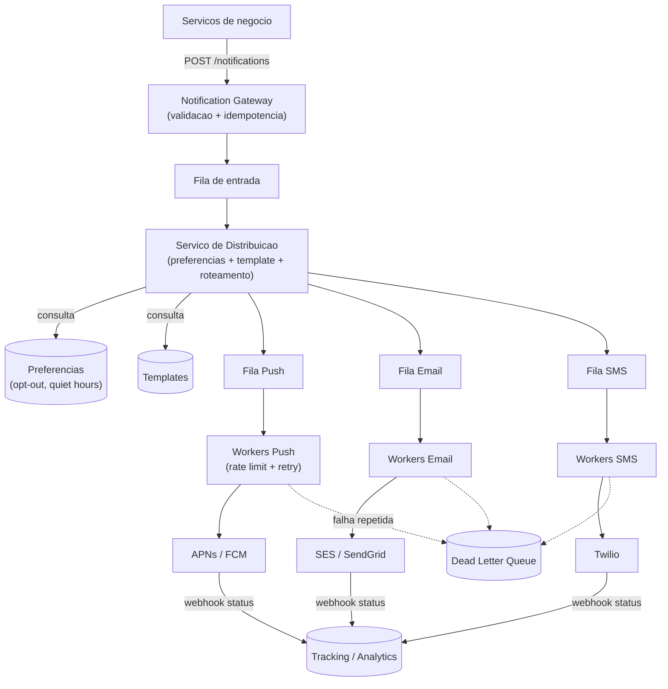

# System Design: Sistema de Notificações em Escala (Push / Email / SMS)

> **Bloco:** System Design (estudos de caso) · **Nível:** Avançado · **Tempo de leitura:** ~30 min

## TL;DR

Um sistema de notificações recebe pedidos de serviços de negócio ("notifique o usuário X sobre Y") e os entrega pelo canal certo — **push** (APNs/FCM), **email** (SendGrid/SES) ou **SMS** (Twilio) — de forma confiável, em escala de dezenas de milhões de mensagens por dia. O design gira em torno de **desacoplar produção de entrega via filas**, com **uma fila e workers dedicados por canal**, porque os canais têm latências, limites de provedor e modos de falha radicalmente diferentes (se o provedor de SMS cai, isso não pode bloquear o push). As decisões centrais são: **entrega assíncrona** (o serviço de negócio não espera a entrega); **retry com backoff exponencial** para falhas transitórias de provedores externos; **deduplicação/idempotência** para não enviar a mesma notificação duas vezes (filas dão at-least-once); **rate limiting em múltiplos níveis** (por usuário contra spam, por canal contra limites do provedor, global contra picos); **gestão de preferências e opt-out** (não enviar o que o usuário desabilitou — requisito legal); e **templates** para montar o conteúdo. O sistema é tolerante a atraso (notificação não é tempo-real estrito) mas intolerante a perda e a duplicata. Decisão-chave de entrevista: isole os canais com filas/workers próprios, trate os provedores externos como dependências falíveis (retry + DLQ + circuit breaker) e nunca acople a entrega ao caminho síncrono do serviço de negócio.

## Requisitos (funcionais e não-funcionais)

**Funcionais:**

- Enviar notificações por **push, email e SMS** (canais extensíveis: in-app, webhook).
- Suportar notificações **disparadas por evento** (transacional: "seu pedido enviou") e **agendadas/em lote** (marketing: "promoção termina hoje").
- **Templates** com personalização (nome, dados do evento).
- **Preferências do usuário** e **opt-out** por canal (não enviar o que foi desabilitado).
- **Rastreamento de status** (enviado, entregue, falhou, aberto).

**Não-funcionais:**

- **Confiabilidade:** não perder notificações; entrega garantida (eventual) para transacionais críticas.
- **Sem duplicatas:** não enviar a mesma notificação duas vezes (experiência ruim; em SMS, custo real).
- **Escalabilidade:** dezenas de milhões de mensagens/dia, com picos (campanhas).
- **Tolerância a atraso:** segundos a minutos é aceitável (não é tempo-real estrito como chat).
- **Isolamento de falhas entre canais:** a queda de um provedor não pode afetar os outros.
- **Conformidade:** respeitar opt-out, limites de frequência, regulações (anti-spam, LGPD/GDPR).

A combinação "confiável + sem duplicata + tolerante a atraso" é exatamente o perfil de um sistema **assíncrono baseado em filas** com semântica at-least-once e dedup.

## Estimativas de capacidade (back-of-the-envelope)

Suponha o volume diário típico de uma plataforma grande:

```
Push:   10.000.000/dia
Email:   5.000.000/dia
SMS:     1.000.000/dia
Total:  16.000.000 notificações/dia
```

**QPS médio:**

```
16M ÷ 86.400 s ≈ 185 notificações/s (média)
```

**QPS de pico:** campanhas concentram envio. Se metade do volume diário sai numa janela de 1 hora (campanha):

```
8M ÷ 3.600 s ≈ 2.220 notificações/s (pico de campanha)
```

Esse contraste média (185/s) × pico (2.220/s, ~12×) é a justificativa central das **filas**: elas absorvem o burst da campanha e os workers consomem na taxa que os provedores aguentam, em vez de derrubar tudo.

**Limites de provedor (rate limits):** provedores externos impõem tetos (ex.: SES com X emails/s por conta; Twilio com Y SMS/s por número). O sistema **não pode** despejar 2.220/s no provedor se ele aceita 500/s — daí o rate limiting por canal e o papel da fila como buffer.

**Storage (logs de notificação, 90 dias):**

```
16M/dia × 90 dias ≈ 1,44 bilhão de registros
× ~500 bytes/registro (destinatário, canal, template, status, timestamps) ≈ ~720 GB
```

Modesto — um banco particionado dá conta. Status/tracking pode ir para um store separado de métricas.

**Custo como métrica:** SMS é caro (centavos por mensagem); 1M SMS/dia × R$0,10 ≈ R$100k/dia. Isso torna **dedup e rate limiting** não só questões de UX, mas de custo direto.

## Modelo de dados e API (alto nível)

**Modelo de dados:**

```
notification_request
  notification_id (PK)     -- idempotency key
  user_id
  channel [push|email|sms]
  template_id
  payload (dados p/ template)
  status [pending|sent|delivered|failed]
  created_at, sent_at

user_preferences
  user_id, channel -> enabled (opt-in/out), quiet_hours, frequency_cap

templates
  template_id, channel, subject, body_template

device_tokens (para push)
  user_id -> [ {device_token, platform} ]
```

A `notification_id` (fornecida pelo cliente ou derivada de `event_id + user_id + channel`) é a **chave de idempotência** que permite descartar duplicatas.

**API:**

```
POST /api/v1/notifications
  body: { notification_id, user_id, channel?, template_id, payload, priority }
  -> 202 Accepted (enfileira; entrega é assíncrona)

GET  /api/v1/notifications/{id}/status
PUT  /api/v1/users/{id}/preferences
```

O `202 Accepted` (não `200 OK`) sinaliza a semântica correta: o pedido foi **aceito para entrega assíncrona**, não entregue ainda.

## Arquitetura da solução

- **Notification Gateway / API:** ponto de entrada. Valida o pedido, aplica idempotência (descarta `notification_id` repetido), e enfileira. Stateless.
- **Serviço de distribuição / roteamento:** decide o(s) canal(is) com base nas **preferências do usuário** (filtra opt-outs, respeita *quiet hours* e *frequency cap*), resolve o **template** com o payload, e roteia a notificação para a **fila do canal** correto.
- **Filas por canal (Kafka/SQS/RabbitMQ):** **uma fila dedicada por canal** (push, email, sms). Isolam falhas — se o provedor de SMS está fora, sua fila acumula sem afetar push/email. Absorvem picos de campanha (buffer).
- **Workers por canal:** consumidores dedicados que pegam mensagens da fila do seu canal e chamam o **provedor externo** correspondente (APNs/FCM para push, SES/SendGrid para email, Twilio para SMS). Aplicam **rate limiting por canal** (respeitam o teto do provedor), **retry com backoff** e enviam para **DLQ** o que falha repetidamente.
- **Provedores externos (3rd party):** APNs/FCM, SES/SendGrid, Twilio. São dependências falíveis — o design os trata com retry, circuit breaker e fallback.
- **Serviço de preferências:** fonte da verdade de opt-in/out, quiet hours, frequency cap. Consultado na roteação.
- **Serviço de templates:** monta o conteúdo final (subject + body) a partir do template + payload.
- **Rate limiter (multinível):** por usuário (anti-spam), por canal (limite do provedor), global (proteção de infra).
- **Tracking / analytics:** consome eventos de status (enviado/entregue/aberto, via webhooks dos provedores) e atualiza o log de notificações + dashboards.

**Fluxo:** serviço de negócio → `POST /notifications` → Gateway (idempotência) → fila de entrada → Serviço de distribuição (preferências → filtra/roteia → template) → fila do canal → worker do canal (rate limit + retry) → provedor externo → entrega → webhook de status → tracking.

## Diagrama de arquitetura



## Pontos de escala e gargalos

**O que quebra primeiro: os provedores externos e seus limites.** Você não controla APNs/SES/Twilio — eles têm rate limits, ficam temporariamente indisponíveis e falham transitoriamente. **Solução:** filas como buffer (absorvem o que o provedor não aceita agora), **rate limiting por canal** (não estourar o teto do provedor), **retry com backoff exponencial + jitter** (falhas transitórias), **circuit breaker** (parar de bater num provedor caído, falhar rápido) e **DLQ** (isolar o que falha repetidamente para inspeção, sem travar a fila).

**Acoplamento entre canais:** uma fila única compartilhada faz a indisponibilidade de um provedor (ex.: SMS lento) **encher a fila e atrasar todos os canais**. **Solução: filas e workers dedicados por canal** — o problema do SMS fica contido na fila de SMS.

**Picos de campanha:** uma campanha de marketing dispara milhões de notificações de uma vez. As filas absorvem; os workers drenam na taxa sustentável. Notificações **transacionais** (críticas, sensíveis a tempo) devem ter **filas/prioridade separadas** das de **marketing** (toleram mais atraso) — senão uma campanha atrasa o "seu código de verificação".

**Deduplicação em escala:** garantir "exatamente uma entrega" sobre filas at-least-once exige dedup. **Solução:** um store de idempotência (Redis com TTL) que registra `notification_id` já processados; o worker checa antes de enviar. Combinado com idempotência do lado do provedor quando disponível.

**Sharding/escala dos workers:** workers são stateless e escalam horizontalmente por canal; o paralelismo é limitado pelo rate limit do provedor, não pela infra — então adicionar workers além do teto do provedor não ajuda (a fila vira o regulador).

**Frequency cap e quiet hours:** consultar preferências por usuário a cada notificação pode sobrecarregar o store de preferências. Mitiga-se com cache das preferências.

## Trade-offs e decisões-chave

**Fila por canal vs fila única.** Fila por canal **isola falhas** (provedor de SMS caído não afeta push) e permite tuning independente (rate limit, paralelismo) ao custo de mais componentes. Fila única é mais simples mas acopla os canais — uma indisponibilidade afeta todos. **Fila por canal é a decisão sênior.**

**At-least-once + dedup vs exactly-once.** Exactly-once de ponta a ponta com provedores externos é praticamente impossível (você não controla a entrega final). **At-least-once + dedup por idempotency key** é o padrão pragmático: garante que não se perde, e a dedup minimiza duplicatas. Aceita-se a possibilidade rara de duplicata em vez de complexidade impossível.

**Push vs poll de status.** O status de entrega vem dos provedores via **webhooks** (push), não por polling — mais eficiente e em tempo quase-real. O sistema expõe endpoints de webhook que os provedores chamam.

**Transacional vs marketing (prioridade).** Separar as duas classes em filas/prioridades distintas é essencial: o "código de verificação" (transacional, urgente, esperado pelo usuário) não pode ficar atrás de 8M de emails de campanha. Misturá-los degrada o que mais importa.

**Construir vs comprar.** A entrega final (push/email/SMS) quase sempre usa **provedores gerenciados** (APNs/FCM são obrigatórios para push; SES/Twilio para email/SMS) — não se reconstrói a infra de carriers. O sistema é a **orquestração** em torno deles (filas, retry, preferências, templates, dedup).

**Onde aplicar rate limiting.** Em múltiplos níveis: **por usuário** (frequency cap, anti-spam — proteção da experiência), **por canal** (respeitar o teto do provedor — proteção da entrega), **global** (proteção da infra sob pico). Cada nível resolve um problema diferente.

## Erros comuns em entrevista

- **Entrega síncrona no caminho do serviço de negócio.** Fazer o serviço esperar a entrega acopla a disponibilidade do negócio à dos provedores externos. Entrega é sempre assíncrona (fila + 202 Accepted).
- **Fila única para todos os canais.** Acopla falhas — a indisponibilidade de um provedor atrasa todos. Use fila por canal.
- **Ignorar deduplicação.** Filas dão at-least-once; sem dedup por idempotency key, o usuário recebe a mesma notificação várias vezes (e, em SMS, você paga por isso).
- **Não tratar os provedores como falíveis.** Esquecer retry com backoff, circuit breaker e DLQ deixa o sistema refém de um provedor que sempre vai falhar de vez em quando.
- **Misturar transacional e marketing.** Sem filas/prioridades separadas, uma campanha atrasa notificações urgentes.
- **Ignorar preferências e opt-out.** Não filtrar quem desabilitou um canal é problema de UX e de conformidade legal (anti-spam, LGPD).
- **Esquecer rate limiting multinível.** Tratar rate limiting como um único limite ignora que há limites distintos por usuário, por canal e globais.
- **Não considerar custo.** SMS custa dinheiro real; dedup e frequency cap têm impacto direto no custo, não só na experiência.

## Relação com outros conceitos

- **Message brokers (Kafka/SQS/RabbitMQ):** o coração do sistema é o desacoplamento via filas, com isolamento por canal e absorção de picos.
- **Idempotência e semântica de entrega:** at-least-once + dedup por idempotency key é o que garante confiabilidade sem duplicatas.
- **Padrões de resiliência:** retry com backoff exponencial + jitter, circuit breaker (provedor caído), DLQ (poison messages), bulkhead (filas por canal isolam falhas) — este sistema é uma aplicação direta do arsenal de resiliência.
- **Rate limiter:** aplicado em múltiplos níveis (por usuário, por canal, global), conectando com token bucket / sliding window.
- **CAP e eventual consistency:** notificações toleram atraso; prioriza-se entrega confiável eventual sobre tempo-real estrito.
- **Cache patterns:** preferências e templates são cacheados para não sobrecarregar seus stores na roteação.
- **Backpressure:** as filas aplicam back-pressure natural quando os provedores não acompanham o ritmo de produção.

## Referências

- [How Does a Typical Push Notification System Work? — ByteByteGo (Alex Xu)](https://bytebytego.com/guides/how-does-a-typical-push-notification-system-work/)
- [Dissecting ByteByteGo's Notification System Design Solution — Medium (Basil A.)](https://basila.medium.com/dissecting-bytebytegos-notification-system-design-solution-7205ccc784cb)
- [System Design Case Study: How to Design Notification System — DesignGurus](https://designgurus.substack.com/p/system-design-case-study-how-to-design-75c)
- [Designing a Notification System: Push, Email, and SMS at Scale — DEV Community](https://dev.to/sgchris/designing-a-notification-system-push-email-and-sms-at-scale-kio)
- [System Design Interview: Notification Service — Tech Wrench (Medium)](https://medium.com/double-pointer/system-design-interview-notification-service-86cb5c266218)
- [Designing a Scalable Notification System: From HLD to LLD — Medium (Anshul Kahar)](https://medium.com/@anshulkahar2211/designing-a-scalable-notification-system-email-sms-push-from-hld-to-lld-reliability-to-d5b883d936d8)
- [System Design Primer — donnemartin (GitHub)](https://github.com/donnemartin/system-design-primer)
