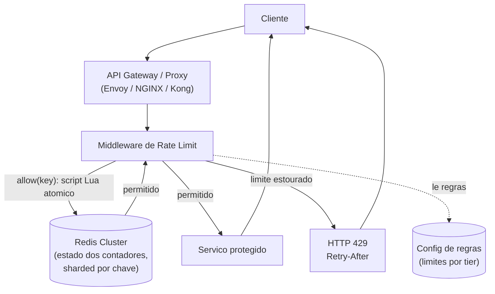
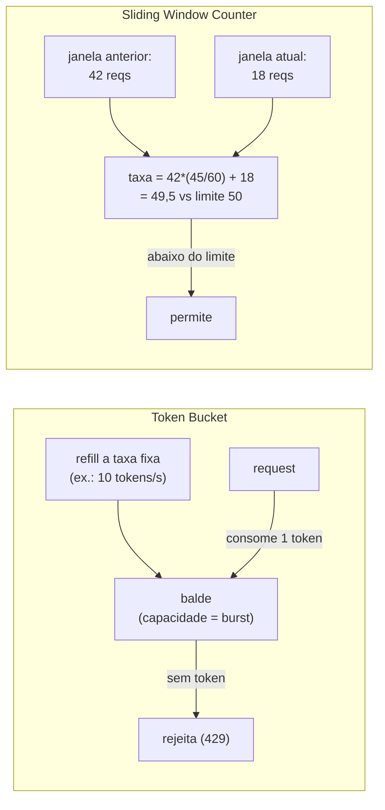

# System Design: Rate Limiter Distribuído

> **Bloco:** System Design (estudos de caso) · **Nível:** Avançado · **Tempo de leitura:** ~31 min

## TL;DR

Um rate limiter limita quantas requisições um cliente (por API key, IP, usuário) pode fazer num intervalo, protegendo o serviço de abuso, sobrecarga e ataques, e impondo quotas contratuais. O cerne do problema não é o algoritmo isolado — é fazê-lo funcionar **corretamente quando o contador é compartilhado entre dezenas de servidores**, sem que requisições concorrentes "gastem em dobro" ou percam contagem. Quatro algoritmos dominam, com trade-offs claros: **token bucket** (balde acumula tokens a taxa fixa; cada request consome um; permite bursts até a capacidade — o mais usado, ex.: AWS, Stripe), **leaky bucket** (saída a taxa constante, suaviza bursts), **fixed window** (conta por janela fixa; simples mas sofre do **boundary burst** — 2× o limite na virada da janela) e **sliding window** (log exato de timestamps, preciso mas caro em memória; ou **sliding window counter**, que aproxima com dois contadores e é o que a Cloudflare usa em escala). No caso distribuído, o estado vive num **Redis centralizado** e a leitura-decisão-escrita precisa ser **atômica** (Lua script / INCR), senão a corrida entre servidores deixa passar mais que o limite. Decisões-chave de entrevista: token bucket para tolerância a burst, sliding window counter para precisão barata, Redis com operação atômica para o estado distribuído, e o que fazer quando o limite estoura (rejeitar com **HTTP 429** + header `Retry-After`).

## Requisitos (funcionais e não-funcionais)

**Funcionais:**

- Limitar requisições por chave (API key, user_id, IP) a N por janela de tempo.
- Suportar múltiplas regras (ex.: 1000/min por API key, 10/s por IP).
- Responder claramente quando o limite estoura: **HTTP 429 Too Many Requests** + header `Retry-After` / `X-RateLimit-Remaining`.
- (Opcional) Diferentes limites por tier de cliente (free vs paid).

**Não-funcionais:**

- **Baixa latência:** o rate limiter está no caminho de toda requisição — não pode adicionar latência significativa (idealmente < 1–2ms).
- **Alta disponibilidade:** se o rate limiter cai, o que acontece? Decisão de design: **fail-open** (deixar passar — prioriza disponibilidade) ou **fail-closed** (bloquear — prioriza proteção). Geralmente fail-open para não derrubar o serviço protegido.
- **Precisão vs custo:** quão exato precisa ser? Precisão perfeita custa memória/latência; aproximações baratas erram um pouco nas bordas.
- **Escalabilidade distribuída:** funcionar corretamente com o contador compartilhado entre muitos servidores.
- **Correção sob concorrência:** requisições simultâneas não podem furar o limite por race condition.

A tensão central é **precisão × custo × latência** sob a restrição de **estado compartilhado distribuído** — é isso que diferencia o rate limiter "de livro" do de produção.

## Estimativas de capacidade (back-of-the-envelope)

Suponha uma API com **1 milhão de requisições/s no pico** (1M QPS), com rate limiting na borda.

**Operações no store de estado:** cada requisição faz pelo menos uma leitura-decisão-escrita atômica no Redis.

```
1M QPS de requisições → ~1M ops/s no Redis (no mínimo)
```

Um nó Redis sustenta ~100k–200k ops/s simples; logo:

```
1M ÷ 150.000 ops/s/nó ≈ ~7 nós Redis (com folga, ~10+ shards)
```

Daí a necessidade de **sharding do Redis** por chave de rate limit, e a importância de a operação ser barata (idealmente uma chamada por request).

**Memória do estado:**

- **Token bucket:** por chave, guarda `{tokens, last_refill_ts}` ≈ 50 bytes. Para 10M de chaves ativas (API keys + IPs):

```
10M × 50 bytes ≈ 500 MB — trivial.
```

- **Sliding window log (preciso):** guarda **um timestamp por requisição** dentro da janela. Para um cliente com limite de 1000/min, são até 1000 timestamps (~8 KB) por chave:

```
10M chaves × 8 KB (pior caso) ≈ 80 GB — caro!
```

Esse contraste (500 MB vs 80 GB) é o argumento concreto contra o sliding window **log** em escala e a favor do **sliding window counter** (que guarda só 2 números por chave, ~16 bytes → ~160 MB).

**Latência adicionada:** uma chamada Redis local (mesma região) ~ 0,5–1ms. Aceitável no caminho da requisição. Por isso o estado fica em memória (Redis), nunca num banco em disco.

## Modelo de dados e API (alto nível)

**Estado por algoritmo (em Redis):**

```
Token bucket:        key -> { tokens: float, last_refill_ts }
Fixed window:        key:window_id -> counter (com TTL)
Sliding window log:  key -> sorted set de timestamps (ZADD/ZREMRANGEBYSCORE)
Sliding window count: key -> { prev_window_count, curr_window_count }
```

A chave (`key`) é a dimensão de limitação: `ratelimit:{api_key}`, `ratelimit:{ip}`, `ratelimit:{user_id}:{endpoint}`.

**Interface (middleware):**

```
allow(key, rule) -> { allowed: bool, remaining: int, retry_after: int }
```

Retorna se a requisição passa, quantas restam na janela, e quando tentar de novo. Na borda, traduz-se para:

```
HTTP 200/2xx        -> permitido
HTTP 429            -> Retry-After: <segundos>, X-RateLimit-Remaining: 0
```

## Arquitetura da solução

- **Middleware / camada de rate limiting:** roda no **API Gateway / reverse proxy** (NGINX, Envoy, Kong) ou como biblioteca no serviço. Intercepta toda requisição antes do processamento.
- **Store de estado (Redis centralizado/clusterizado):** mantém os contadores/buckets. É **centralizado** (compartilhado entre todos os servidores da API) para que o limite seja **global**, não por servidor. Particionado por chave de rate limit.
- **Lógica atômica (Lua script):** a operação "ler contador → decidir → atualizar" roda como um **script Lua no Redis**, executado atomicamente. Isso impede que duas requisições concorrentes leiam o mesmo valor, ambas decidam "ok", e furem o limite (double-spend). Atomicidade é o requisito de correção central.
- **Configuração de regras:** quais limites para quais chaves/tiers, armazenados e cacheados (recarregáveis sem deploy).
- **Resposta de rejeição:** retorna 429 com `Retry-After` para o cliente recuar graciosamente.

**Caminho da requisição:** cliente → API Gateway → middleware de rate limit → executa script Lua no Redis (`allow(key)`) → se permitido, encaminha ao serviço; se não, responde 429 imediatamente.

**Otimização (cache local + sincronização):** para reduzir a latência de ir ao Redis a cada request, alguns sistemas usam um **contador local por servidor** sincronizado periodicamente com o Redis — trocando precisão exata por menos round-trips (a Cloudflare usa uma abordagem de contadores agregados). É um trade-off de precisão vs latência/carga.

## Diagrama de arquitetura





## Pontos de escala e gargalos

**O que quebra primeiro: a correção sob concorrência.** Com o contador compartilhado, duas requisições simultâneas em servidores diferentes podem ambas ler `count = 99` (limite 100), ambas decidirem "ok" e incrementarem — resultando em 101 com ambas passando. **Solução: atomicidade** via Lua script ou `INCR` no Redis (operação read-decide-write indivisível). Sem isso, o limite vaza sob carga — justamente quando importa.

**O Redis como gargalo/SPOF:** todo request bate no Redis. **Solução:** **sharding** por chave de rate limit (a chave `{api_key}` sempre vai para o mesmo shard, mantendo o contador coeso) e **réplicas** para disponibilidade. Se o Redis fica indisponível, a decisão **fail-open vs fail-closed** entra em jogo.

**Latência do round-trip:** ir ao Redis a cada request adiciona ~1ms. Em volumes extremos, mitiga-se com **contadores locais sincronizados** (cada servidor mantém uma fração da quota localmente e sincroniza periodicamente) — menos round-trips, ao custo de precisão (pode-se exceder ligeiramente o limite global na janela de sincronização). É a troca que sistemas de borda como Cloudflare fazem.

**Boundary burst (fixed window):** na janela fixa, um cliente pode mandar N requests no fim de uma janela e N no início da próxima — **2N num intervalo curto** que cruza a fronteira. **Solução:** sliding window (log exato ou counter aproximado) elimina esse artefato.

**Memória do sliding window log:** guardar timestamp por request explode a memória em escala (calculado acima: ~80 GB). **Solução: sliding window counter**, que mantém só dois contadores por chave e aproxima a janela deslizante por interpolação ponderada — precisão "boa o suficiente" a custo mínimo.

**Hot key:** uma API key extremamente ativa concentra ops num shard. Mitiga-se com cache local para essa chave ou sub-particionamento.

## Trade-offs e decisões-chave

**Comparação dos algoritmos:**

| Algoritmo | Permite burst? | Precisão | Memória/chave | Problema |
|---|---|---|---|---|
| **Token bucket** | Sim (até capacidade) | Boa | ~50 bytes | Tuning de capacidade × refill |
| **Leaky bucket** | Não (suaviza) | Boa | ~50 bytes | Não absorve bursts legítimos |
| **Fixed window** | Sim (nas bordas) | Baixa | ~16 bytes | Boundary burst (2× na virada) |
| **Sliding window log** | Não | Exata | até KBs | Memória explode em escala |
| **Sliding window counter** | Parcial | Boa (aproximada) | ~16 bytes | Erro pequeno na aproximação |

- **Token bucket:** o default da indústria (AWS, Stripe). Permite bursts naturais (o cliente acumula "crédito" quando ocioso) mantendo a taxa média. Dois parâmetros: capacidade do balde (tamanho do burst) e taxa de refill (taxa sustentável).
- **Leaky bucket:** processa a taxa constante; ótimo quando o objetivo é **suavizar** o tráfego (proteger um downstream que exige ritmo estável), ruim quando bursts legítimos devem ser tolerados.
- **Sliding window counter:** o sweet spot de **precisão × custo** em escala distribuída — a escolha da Cloudflare. Aproxima a janela deslizante ponderando os contadores das janelas anterior e atual, evitando tanto o boundary burst do fixed window quanto o custo de memória do log.

**Fail-open vs fail-closed.** Se o Redis cai: **fail-open** (deixar passar tudo) prioriza disponibilidade do serviço protegido — risco de sobrecarga momentânea, mas o serviço não cai por causa do limiter. **Fail-closed** (bloquear tudo) prioriza proteção — mas transforma a falha do limiter em indisponibilidade total. **Geralmente fail-open**, salvo onde a proteção é crítica (anti-abuso de pagamento).

**Centralizado vs local-com-sincronização.** Estado centralizado no Redis é preciso (limite global exato) mas adiciona round-trip. Contadores locais sincronizados reduzem latência/carga mas relaxam a precisão (limite pode exceder ligeiramente entre sincronizações). A escolha depende de quão estrito o limite precisa ser.

**Onde rodar.** Na **borda** (API Gateway / CDN) protege contra abuso antes de consumir recursos internos; **por serviço** dá granularidade. Frequentemente ambos, em camadas.

## Erros comuns em entrevista

- **Ignorar a concorrência distribuída.** Descrever o algoritmo num único processo e esquecer que, com o contador compartilhado, requisições concorrentes furam o limite sem **atomicidade** (Lua/INCR). Esse é o ponto que separa o candidato sênior.
- **Esquecer o boundary burst do fixed window.** Propor janela fixa sem mencionar que ela permite 2× o limite na virada da janela demonstra falta de profundidade.
- **Propor sliding window log em escala sem notar o custo de memória.** É preciso, mas guarda timestamp por request — inviável para milhões de chaves. Mencionar o sliding window counter como alternativa barata é o esperado.
- **Não definir o comportamento sob falha do limiter.** Sem decidir fail-open vs fail-closed, o design fica incompleto.
- **Esquecer a resposta correta ao cliente.** Limite estourado deve retornar **429** com `Retry-After` e headers de quota, não um erro genérico — para o cliente recuar graciosamente.
- **Manter o estado num banco em disco.** Rate limiting está no caminho quente; o estado tem que estar em memória (Redis), não num RDBMS.
- **Limite único e global sem dimensões.** Bons rate limiters limitam por múltiplas dimensões (API key, IP, endpoint, tier) — um único limite não cobre os casos reais.
- **Confundir rate limiting com load shedding.** Rate limiting é contratual/preditivo (limite fixo por chave); load shedding é adaptativo (descarta sob estresse real). São complementares.

## Relação com outros conceitos

- **Token bucket / leaky bucket / sliding window:** os algoritmos centrais — token bucket para burst, sliding window counter para precisão barata; conecta diretamente com o padrão de Rate Limiting nos padrões de resiliência.
- **Padrões de resiliência:** rate limiting é uma das defesas do arsenal (com timeout, retry, circuit breaker, bulkhead); aplica back-pressure a montante.
- **Redis e operações atômicas:** a correção distribuída depende de Lua scripts / INCR atômicos — conecta com estruturas de dados em memória e concorrência.
- **Sharding e consistent hashing:** o estado do Redis é particionado por chave de rate limit para escalar além de um nó.
- **CAP:** a decisão fail-open (disponibilidade) vs fail-closed (consistência/proteção) é uma escolha CAP explícita sob partição/falha do store.
- **Load shedding:** complementar ao rate limiting — adaptativo no core, enquanto o rate limiting é contratual na borda.
- **API Gateway:** o lugar natural para rate limiting de borda, antes de consumir recursos internos.

## Referências

- [How we built rate limiting capable of scaling to millions of domains — Cloudflare Blog](https://blog.cloudflare.com/counting-things-a-lot-of-different-things/)
- [Rate Limiter — Redis Docs (use cases)](https://redis.io/docs/latest/develop/use-cases/rate-limiter/)
- [Build 5 Rate Limiters with Redis: Fixed Window, Sliding Window, Token Bucket — Redis Tutorials](https://redis.io/tutorials/howtos/ratelimiting/)
- [Step 5: Design a Rate Limiter — Algorithm and Technique — DEV Community](https://dev.to/zeeshanali0704/step-5-design-a-rate-limiter-algorithm-and-technique-3hbo)
- [Rate Limiter System Design Interview Guide — Mockingly](https://www.mockingly.ai/blog/design-rate-limiter)
- [Implementing Rate Limiting with Redis, Token Bucket, and Sliding Window Log — Medium](https://medium.com/@surya.sh/implementing-rate-limiting-with-redis-token-bucket-and-sliding-window-log-640914c2f453)
- [System Design Primer — donnemartin (GitHub)](https://github.com/donnemartin/system-design-primer)
