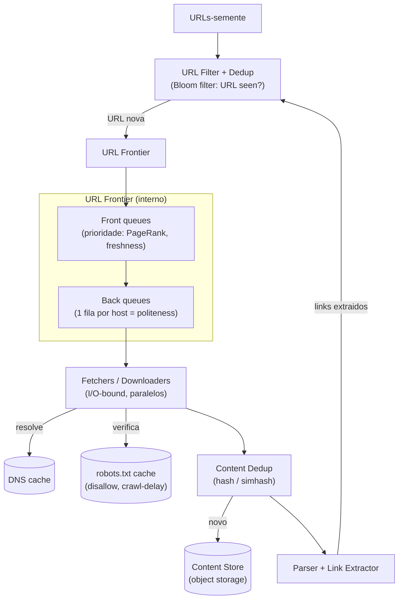

# System Design: Web Crawler Distribuído

> **Bloco:** System Design (estudos de caso) · **Nível:** Avançado · **Tempo de leitura:** ~32 min

## TL;DR

Um web crawler percorre a web automaticamente, baixando páginas a partir de URLs-semente, extraindo links e seguindo-os recursivamente, para construir um índice (busca), treinar modelos ou monitorar conteúdo. O coração do design é a **URL Frontier** — a estrutura que gerencia a fila de URLs a baixar — que precisa simultaneamente garantir **politeness** (não martelar o mesmo servidor: respeitar `robots.txt` e o `crawl-delay`, baixar uma página por vez por host), **prioridade** (páginas importantes/frescas primeiro, via PageRank, tráfego, frequência de atualização) e **freshness** (revisitar páginas que mudam). A travessia é **BFS** (não DFS, que martelaria o mesmo host), com a frontier organizada em filas por host para serializar acessos a cada servidor. **Deduplicação** é central em duas dimensões: não recrawlear a mesma URL (URL seen) e não armazenar conteúdo duplicado (content seen, via hash/checksum) — em ambos os casos um **Bloom filter** economiza memória massivamente ao custo de falsos positivos toleráveis. O sistema é distribuído por **particionamento por host** (cada máquina cuida de um conjunto de domínios — naturalmente ajuda a politeness, pois um site não recebe tráfego de várias máquinas). É I/O-bound (rede), exige **armadilhas anti-spider trap** (loops infinitos, calendários infinitos) e lida com escala de bilhões de páginas. Decisões-chave de entrevista: BFS + frontier com filas por host para politeness; Bloom filter para dedup; particionamento por host; e respeito a `robots.txt`.

## Requisitos (funcionais e não-funcionais)

**Funcionais:**

- Dado um conjunto de URLs-semente, baixar as páginas e extrair links.
- Seguir links recursivamente para descobrir novas páginas.
- Armazenar o conteúdo baixado (para indexação/processamento posterior).
- Respeitar `robots.txt` e políticas de cada site.
- (Opcional) Recrawlear periodicamente para freshness.
- Filtrar tipos de conteúdo (só HTML? imagens? PDFs?).

**Não-funcionais:**

- **Escalabilidade:** bilhões de páginas; precisa rodar em muitas máquinas.
- **Politeness (educação):** não sobrecarregar servidores alvo — limitar a taxa por host, respeitar `crawl-delay`. É requisito ético e prático (sites bloqueiam crawlers abusivos).
- **Robustez:** lidar com HTML malformado, links quebrados, **spider traps** (loops, URLs infinitas), servidores lentos/que não respondem.
- **Freshness:** páginas mudam; o crawl precisa revisitar com frequência proporcional à taxa de mudança.
- **Extensibilidade:** novos tipos de conteúdo, novos extratores.
- **Eficiência:** evitar trabalho redundante (recrawl da mesma URL, armazenar conteúdo duplicado).

A tensão central: **maximizar cobertura/frescor** (baixar muito, rápido) **sob a restrição de politeness** (devagar por host) e **sem desperdício** (dedup). É um problema de I/O em escala massiva com forte componente de coordenação.

## Estimativas de capacidade (back-of-the-envelope)

Suponha a meta de **1 bilhão de páginas/mês**.

**Taxa de download:**

```
1B páginas ÷ (30 dias × 86.400 s) ≈ 1B ÷ 2,59M s ≈ ~386 páginas/s (média)
Pico (≈2×)                                          ≈ ~770 páginas/s
```

**Quantas máquinas?** O crawl é I/O-bound; uma máquina com muitas threads/conexões assíncronas baixa talvez ~100 páginas/s (limitado por banda, latência de rede e politeness). Logo:

```
386 ÷ 100 ≈ ~4 máquinas para a média; ~8 para o pico (com folga, dezenas para resiliência)
```

(Crawlers de escala Google operam ordens de magnitude acima disso, com milhares de máquinas.)

**Storage do conteúdo bruto:** página HTML média comprimida ~ 100 KB (HTML cru ~500 KB, comprime ~5×).

```
1B páginas × 100 KB ≈ 100 TB/mês de conteúdo bruto
```

São dezenas a centenas de TB — vai para **object storage** (S3/HDFS), não para um banco transacional. Conteúdo cru raramente é guardado integralmente para sempre; muitas vezes só o texto extraído + metadados.

**Memória do dedup (URL seen):** para evitar recrawlear, é preciso checar se uma URL já foi vista. Com **1 bilhão de URLs** e uma hash de ~16 bytes por URL num set:

```
1B × 16 bytes ≈ 16 GB só de hashes — caro para manter em RAM por máquina.
```

Um **Bloom filter** com taxa de falso positivo de ~1% precisa de ~9,6 bits por elemento:

```
1B × 9,6 bits ≈ 1,2 GB — uma redução de ~13× vs guardar hashes.
```

Esse é o argumento concreto para o Bloom filter no dedup: cabe em memória onde o set exato não caberia. O custo é falso positivo (raramente pular uma URL nova), aceitável num crawler.

**Banda:**

```
770 páginas/s × 500 KB (HTML cru) ≈ 385 MB/s de download no pico
```

Significativo — banda é um recurso de primeira ordem para um crawler.

## Modelo de dados e API (alto nível)

**Componentes de estado:**

```
URL Frontier
  filas por host (FIFO) -> URLs a baixar, com prioridade e timestamp de earliest-fetch

URL seen (dedup de URLs)
  Bloom filter + store de URLs já enfileiradas/baixadas

content seen (dedup de conteúdo)
  hashes/checksums (ou simhash p/ near-duplicate) do conteúdo já armazenado

robots cache
  host -> regras do robots.txt + crawl-delay (com TTL)

content store (object storage)
  url -> { conteúdo, headers, fetched_at }

DNS cache
  host -> IP (resolução é cara; cachear)
```

Não há "API" externa típica; o crawler é um pipeline interno. A interface conceitual:

```
seed(urls)                          -- injeta URLs-semente
enqueue(url, priority)              -- adiciona à frontier (se não vista)
fetch_next() -> url                 -- frontier entrega a próxima URL respeitando politeness
store(url, content)                 -- persiste o conteúdo
```

## Arquitetura da solução

- **URL Frontier:** o componente central. Gerencia o que baixar e em que ordem. Internamente, separa **priorização** (front queues por prioridade — PageRank, freshness) de **politeness** (back queues, **uma por host**, garantindo que só uma página por vez seja baixada de cada servidor, com o `crawl-delay` respeitado). Essa separação front/back é o design clássico (ByteByteGo / Manning).
- **Fetchers / Downloaders (workers):** pegam URLs da frontier e baixam o conteúdo via HTTP. São I/O-bound e altamente paralelos (muitas conexões assíncronas). Cada worker é associado a um conjunto de hosts (politeness).
- **DNS Resolver (com cache):** resolve hostnames para IPs; a resolução é cara e repetitiva, então é cacheada agressivamente.
- **robots.txt handler:** antes de baixar de um host, busca e cacheia o `robots.txt`; respeita disallow e `crawl-delay`. URLs proibidas são descartadas.
- **Content Parser / Link Extractor:** parseia o HTML baixado, extrai links (e os normaliza), e extrai o conteúdo/texto a indexar.
- **URL filter & dedup (URL seen):** normaliza URLs (remover fragmentos, ordenar query params) e checa no **Bloom filter** se já foi vista; só URLs novas entram na frontier.
- **Content dedup (content seen):** checa o hash do conteúdo baixado contra os já armazenados; descarta duplicatas exatas (e, com simhash, near-duplicates — espelhos, páginas geradas).
- **Content Store (object storage):** persiste o conteúdo baixado (S3/HDFS), particionado.
- **Coordenação / particionamento:** o trabalho é distribuído entre máquinas **por host** (hash do hostname → máquina), de modo que cada site é tratado por uma única máquina — isso simplifica a politeness (um site não recebe tráfego concorrente de várias máquinas) e o gerenciamento de robots/DNS.

**Fluxo:** semente → URL filter (Bloom: nova?) → Frontier (front queue por prioridade → back queue por host) → Fetcher pega respeitando politeness → resolve DNS (cache) → checa robots.txt (cache) → baixa → content dedup (hash) → armazena → Parser extrai links → cada link volta ao URL filter (loop).

## Diagrama de arquitetura



## Pontos de escala e gargalos

**O que quebra primeiro: politeness vs throughput.** Querer baixar rápido (throughput) conflita com não martelar hosts (politeness). A frontier com **back queues por host** resolve: serializa o acesso a cada host (uma página por vez, respeitando `crawl-delay`) enquanto paraleliza **entre hosts** (milhares de hosts baixados simultaneamente). O throughput vem da largura (muitos hosts), não da profundidade num host.

**Particionamento por host:** distribuir URLs entre máquinas por `hash(host)` garante que cada host seja tratado por uma única máquina — sem isso, várias máquinas baateriam o mesmo servidor (viola politeness) e duplicariam DNS/robots. **Consistent hashing** permite adicionar máquinas remapeando poucos hosts.

**Dedup em escala (memória):** o set exato de URLs vistas (1B+ URLs) não cabe em RAM. **Bloom filter** reduz ~13× (calculado acima) ao custo de falsos positivos (raramente pular uma URL nova — aceitável). Para content dedup, **simhash** detecta near-duplicates (espelhos, conteúdo gerado quase-igual).

**Spider traps:** URLs infinitas (calendários `?date=...`, sessões em loop, links auto-referentes) prendem o crawler. Mitigações: **limite de profundidade**, deteç de padrões de URL suspeitos, limite de páginas por host, e a própria dedup.

**Servidores lentos / não-responsivos:** sem **timeout** por fetch, um servidor lento prende um worker indefinidamente. Timeouts agressivos + circuit breaker por host (parar de tentar um host que sempre falha).

**Freshness:** páginas mudam a taxas diferentes (notícias × páginas estáticas). Recrawlear tudo igual desperdiça; recrawlear por **frequência de mudança estimada** (prioridade na frontier) otimiza o frescor por unidade de trabalho.

**Banda e DNS:** banda é recurso de primeira ordem (385 MB/s no pico); DNS é gargalo escondido (resolução cara) — cacheado agressivamente.

## Trade-offs e decisões-chave

**BFS vs DFS.** **BFS é a escolha.** DFS desce fundo num site, **martelando o mesmo host** (viola politeness) e podendo cair em spider traps profundos. BFS explora em largura — naturalmente espalha o trabalho entre hosts e combina com a frontier de filas por host. A prioridade (PageRank/freshness) modula a ordem dentro do BFS.

**Bloom filter vs set exato (dedup).** Bloom filter economiza ~13× de memória (1,2 GB vs 16 GB para 1B URLs) ao custo de **falsos positivos** — raramente reporta "já visto" para uma URL nova, fazendo o crawler pulá-la. Num crawler, perder ocasionalmente uma URL é tolerável; o ganho de memória é decisivo. **Nunca há falso negativo** (nunca recrawleia algo já visto reportado como novo), que é a garantia que importa.

**Conteúdo: armazenar tudo vs só texto extraído.** Guardar o HTML cru de 1B páginas (100 TB/mês) é caro; muitos crawlers guardam só o **texto extraído + metadados** (ordens de magnitude menor) e descartam o HTML após o parsing. A escolha depende do uso (reindexação futura precisa do cru; só busca precisa do texto).

**Recrawl: uniforme vs adaptativo.** Recrawlear tudo na mesma cadência é simples mas desperdiça (páginas estáticas recrawleadas à toa, notícias recrawleadas tarde). **Recrawl adaptativo** (frequência proporcional à taxa de mudança observada) maximiza frescor por unidade de banda — mais complexo, mas é o que crawlers maduros fazem.

**Hash exato vs simhash (content dedup).** Hash exato pega duplicatas idênticas (espelhos byte-a-byte); **simhash** pega near-duplicates (mesma página com anúncios/timestamps diferentes). Simhash captura muito mais duplicação real na web, ao custo de complexidade.

## Erros comuns em entrevista

- **Escolher DFS.** DFS martela o mesmo host (viola politeness) e cai em spider traps. BFS é a resposta, com prioridade modulando a ordem.
- **Ignorar politeness.** Não mencionar `robots.txt`, `crawl-delay` e filas por host é o erro mais grave — um crawler sem politeness é bloqueado e antiético.
- **Dedup com set exato em memória.** Esquecer que 1B+ URLs não cabem num set e não propor Bloom filter mostra falta de noção de escala.
- **Não tratar spider traps.** Sem limite de profundidade / detecção de loops, o crawler trava em URLs infinitas.
- **Particionar por URL em vez de por host.** Particionar por URL faz várias máquinas baterem o mesmo host (viola politeness) e duplica DNS/robots. Particione por host.
- **Esquecer timeouts.** Servidores lentos prendem workers; sem timeout por fetch, o throughput despenca.
- **Armazenar conteúdo num banco relacional.** Conteúdo de páginas (centenas de TB) vai para object storage, não para um RDBMS.
- **Ignorar content dedup.** Sem dedup de conteúdo, espelhos e páginas geradas inflam o storage e o índice com lixo redundante.
- **Tratar o crawler como CPU-bound.** É I/O-bound (rede); o paralelismo vem de muitas conexões concorrentes, não de mais CPU.

## Relação com outros conceitos

- **Bloom filter:** a estrutura-chave do dedup de URLs e conteúdo — economia massiva de memória com falsos positivos toleráveis e zero falsos negativos.
- **BFS / travessia de grafos:** a web é um grafo; o crawl é uma travessia em largura priorizada — conecta com algoritmos de grafos.
- **Consistent hashing e sharding:** particionamento por host entre máquinas com remapeamento mínimo ao escalar.
- **Padrões de resiliência:** timeout por fetch, circuit breaker por host problemático, retry com backoff para falhas transitórias de rede.
- **Object storage:** conteúdo bruto em escala de TB vai para S3/HDFS, não para banco transacional.
- **Sistema de busca:** o crawler é o front-end de coleta de um motor de busca — alimenta a indexação invertida.
- **Cache patterns:** DNS e robots.txt são cacheados agressivamente para não repetir resolução/fetch caros.
- **Rate limiter:** a politeness é, em essência, rate limiting por host (uma página por vez, respeitando crawl-delay).

## Referências

- [Design A Web Crawler — ByteByteGo (Alex Xu)](https://bytebytego.com/courses/system-design-interview/design-a-web-crawler)
- [Design a Web Crawler — Hello Interview](https://www.hellointerview.com/learn/system-design/problem-breakdowns/web-crawler)
- [How to Design a Web Crawler from Scratch — DesignGurus](https://www.designgurus.io/blog/design-web-crawler)
- [Web Crawler System Design — Medium (Dilip Kumar)](https://dilipkumar.medium.com/web-crawler-system-design-b4ac850dfec7)
- [Design a Web Crawler System Design: A Complete Guide — System Design Handbook](https://www.systemdesignhandbook.com/guides/design-a-web-crawler-system-design/)
- [System Design Primer — donnemartin (GitHub)](https://github.com/donnemartin/system-design-primer)
- [Consistent Hashing — GeeksforGeeks (System Design)](https://www.geeksforgeeks.org/system-design/consistent-hashing/)
