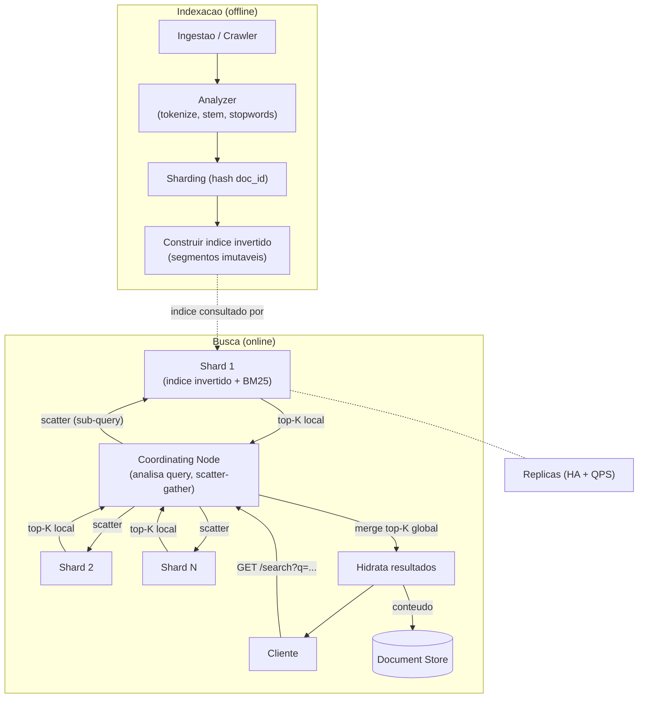

# System Design: Sistema de Busca (tipo Google / Elasticsearch)

> **Bloco:** System Design (estudos de caso) · **Nível:** Avançado · **Tempo de leitura:** ~34 min

## TL;DR

Um sistema de busca recebe uma query textual e retorna, em milissegundos, os documentos mais **relevantes** dentre bilhões, ordenados por um score. A estrutura de dados que torna isso possível é o **índice invertido**: em vez de varrer todos os documentos procurando os termos (caríssimo), pré-computa-se um mapa **termo → lista de documentos que contêm o termo** (posting list). A query então vira interseção/união de posting lists — examinando milhares de candidatos em vez de bilhões de documentos. O pipeline tem dois lados: **indexação** (offline) — crawl/ingestão → análise de texto (tokenização, lowercase, stemming, stopwords) → construção do índice invertido — e **busca** (online) — analisar a query com a mesma análise → buscar posting lists → interseccionar → **ranquear** com **BM25** (ou variantes TF-IDF) → retornar top-K com um min-heap. Em escala, o índice é **shardado** por documento (cada shard tem um pedaço dos docs com seu próprio índice invertido) e cada query faz **scatter-gather**: o coordinating node dispara a query para todos os shards, cada um retorna seu top-K local, e o coordenador funde os resultados (mescla os top-K) e devolve o top-K global. Réplicas dão disponibilidade e QPS de leitura. Para indexação em tempo real, usa-se **arquitetura de dois níveis**: um pequeno buffer em memória para documentos recentes + um índice grande em disco atualizado periodicamente (segmentos imutáveis, à la Lucene). Decisões-chave de entrevista: índice invertido como coração, sharding por documento + scatter-gather, BM25 para ranking, e a separação indexação-offline / busca-online.

## Requisitos (funcionais e não-funcionais)

**Funcionais:**

- Indexar documentos (texto + metadados).
- Dada uma query (palavras-chave), retornar documentos relevantes ordenados por relevância.
- Suportar busca full-text (frases, múltiplos termos, operadores AND/OR).
- (Opcional) Filtros/facetas (por data, categoria), autocomplete, correção ortográfica, busca semântica.
- Paginação dos resultados (top-K, depois próximas páginas).

**Não-funcionais:**

- **Baixa latência de busca:** resultados em < 200ms (idealmente dezenas de ms) mesmo sobre bilhões de documentos.
- **Relevância:** os melhores resultados no topo — qualidade do ranking é a métrica de produto.
- **Escalabilidade:** bilhões de documentos, milhares de queries/s.
- **Freshness:** documentos novos/atualizados aparecem na busca em tempo aceitável (segundos a minutos).
- **Alta disponibilidade:** o índice replicado tolera falha de nós.
- **Read-heavy** (no caminho de busca), com indexação como processo separado de fundo.

A tensão central: **examinar bilhões de documentos em milissegundos**. A resposta é não examinar todos — pré-computar a estrutura (índice invertido) que reduz o espaço de busca a milhares de candidatos, e distribuir o trabalho (sharding + scatter-gather).

## Estimativas de capacidade (back-of-the-envelope)

Suponha **10 bilhões de documentos** indexados e **10.000 queries/s** no pico.

**Eficiência do índice invertido:** uma query de 3 termos sobre 10B documentos não examina 10B — examina a interseção das posting lists desses 3 termos.

```
Para um índice de 1M docs, query de 3 termos: ~1.000 a 10.000 candidatos examinados (não 1M).
Em escala de 10B, com seleção e early-termination: ainda milhares, não bilhões.
```

É essa redução de **bilhões → milhares** que torna a busca viável em milissegundos.

**Tamanho do índice invertido:** depende do vocabulário e do tamanho das posting lists. Regra prática: o índice invertido costuma ser **uma fração do tamanho do corpus** (com compressão de posting lists, delta encoding). Se o corpus de texto é, digamos, 100 TB:

```
Índice invertido ≈ 10–30% do corpus ≈ 10–30 TB (comprimido)
```

Não cabe num nó → **sharding** obrigatório.

**Quantos shards?** Se cada shard guarda confortavelmente, digamos, 50–100M documentos com latência boa:

```
10B docs ÷ 50M docs/shard ≈ ~200 shards
```

Cada query toca todos os shards (scatter-gather), então cada shard processa:

```
10.000 queries/s distribuídas, mas cada query vai a TODOS os shards
→ cada shard vê ~10.000 sub-queries/s — daí a necessidade de réplicas por shard.
```

**Réplicas:** se um shard aguenta ~2.000 sub-queries/s:

```
10.000 ÷ 2.000 ≈ 5 réplicas por shard para o QPS
200 shards × 5 réplicas ≈ ~1.000 nós de índice (ordem de grandeza)
```

**Latência do scatter-gather:** a latência da query é a do **shard mais lento** (espera-se todos responderem). Por isso a cauda (p99) de cada shard importa, e usa-se *hedged requests* / timeouts para não esperar o straggler.

## Modelo de dados e API (alto nível)

**Índice invertido (a estrutura central):**

```
termo "sistema"  -> [ doc3 (tf=2, posições...), doc17 (tf=1), doc88 (tf=5), ... ]
termo "design"   -> [ doc3 (tf=1), doc42 (tf=3), doc88 (tf=2), ... ]
            ^posting list (ordenada por doc_id, com term frequency e posições)
```

Cada **posting** guarda o `doc_id`, o **term frequency** (quantas vezes o termo aparece no doc — para scoring) e, opcionalmente, **posições** (para busca por frase) e payloads. Posting lists são **comprimidas** (delta encoding dos doc_ids ordenados + variable-byte/Frame-of-Reference).

**Document store (separado):** `doc_id → {conteúdo original, metadados}` — para hidratar os resultados (mostrar título/snippet) depois do ranking. O índice invertido aponta para `doc_id`; o conteúdo vem do document store.

**API:**

```
POST /index     { doc_id, content, metadata }      -> indexa (assíncrono)
GET  /search?q=...&from=0&size=10                   -> top-K resultados ordenados
```

## Arquitetura da solução

**Lado da indexação (offline / fundo):**

- **Ingestão / Crawler:** fonte dos documentos (crawler da web, ou stream de documentos de uma aplicação).
- **Analisador de texto (analyzer):** transforma o texto em **tokens** normalizados — tokenização, lowercase, remoção de **stopwords** ("a", "de", "the"), **stemming/lemmatização** ("correndo" → "corr"), sinônimos. A mesma análise é aplicada na indexação **e** na query (crucial: índice e query precisam usar os mesmos tokens).
- **Construtor do índice invertido:** para cada token, adiciona o documento à posting list correspondente. Em sistemas como Lucene/Elasticsearch, escreve **segmentos imutáveis** que são periodicamente fundidos (merge).
- **Distribuidor / sharding:** roteia cada documento ao shard responsável (tipicamente por `hash(doc_id)` — distribui uniformemente).

**Lado da busca (online):**

- **Coordinating node (nó coordenador):** recebe a query do cliente, aplica a análise de texto na query, dispara a sub-query para **todos os shards** (scatter), coleta os top-K locais (gather), **funde** os resultados num top-K global e hidrata com o document store. Não detém dados — só orquestra.
- **Data nodes (shards):** cada um detém uma fatia dos documentos com seu próprio índice invertido. Ao receber a sub-query: busca posting lists dos termos → interseção/união → **scoring com BM25** → retorna seu **top-K local** (via min-heap) ao coordenador.
- **Réplicas:** cada shard tem réplicas (cópias do índice) para disponibilidade e para distribuir o QPS de leitura.
- **Document store:** guarda o conteúdo original para hidratar resultados (título, snippet).
- **Cache de queries:** queries frequentes (cabeça da distribuição) têm resultados cacheados.

**Fluxo de indexação:** documento → analyzer (tokens) → roteia ao shard → adiciona às posting lists do shard (segmento em memória → flush para disco) → (merge de segmentos em background).

**Fluxo de busca:** query → coordinating node → analyzer (mesmos tokens) → scatter para todos os shards → cada shard: posting lists → interseção → BM25 → top-K local → gather no coordenador → merge top-K global → hidrata (document store) → retorna.

## Diagrama de arquitetura



## Pontos de escala e gargalos

**O que quebra primeiro: o índice não cabe num nó.** Bilhões de documentos geram um índice de dezenas de TB. **Solução: sharding por documento** — cada shard tem uma fatia dos docs e seu próprio índice invertido completo (sobre aqueles docs). Toda query precisa visitar todos os shards (porque qualquer doc pode casar), daí o **scatter-gather**.

**Scatter-gather e o straggler:** a latência da query é a do **shard mais lento** — espera-se todos responderem para fundir o top-K. Um shard com GC pause ou disco lento atrasa a query inteira. **Mitigações:** timeouts por shard, *hedged requests* (mandar a sub-query a uma segunda réplica se a primeira demora), e dimensionar para a cauda (p99), não a média.

**QPS de leitura:** cada query bate em todos os shards, multiplicando a carga. **Réplicas** por shard distribuem o QPS e dão disponibilidade. **Cache de queries** absorve a cabeça da distribuição (queries populares repetidas).

**Indexação em tempo real (freshness):** reconstruir o índice inteiro a cada documento novo é inviável. **Solução: arquitetura de dois níveis** — um **buffer em memória** (índice pequeno, atualizado em tempo real para docs recentes) + um **índice grande em disco** (atualizado periodicamente). A query consulta os dois e funde. É o modelo de **segmentos imutáveis** do Lucene/Elasticsearch: novos docs viram pequenos segmentos em memória, periodicamente *flushed* para disco e depois **merged** em segmentos maiores em background. Imutabilidade simplifica concorrência e cache.

**Posting lists longas:** termos comuns (stopwords não removidas, termos populares) têm posting lists com milhões de entradas — interseccioná-las é caro. **Mitigações:** remoção de stopwords, compressão de posting lists (delta encoding), e **skip lists** dentro das posting lists para pular rápido na interseção; **early termination** (parar quando os top-K já estão garantidos).

**Hot shard:** distribuição desigual de docs ou de queries pode sobrecarregar um shard. O roteamento por `hash(doc_id)` distribui os docs uniformemente; réplicas absorvem queries quentes.

**Ranking caro:** scoring sofisticado (machine-learned ranking) é caro por candidato. **Solução: ranking em fases** — uma primeira fase barata (BM25) seleciona poucos milhares de candidatos por shard, e uma segunda fase cara (ML) reordena só esse subconjunto.

## Trade-offs e decisões-chave

**Índice invertido vs varredura.** A escolha fundamental: pré-computar o mapa termo→docs (índice invertido) custa storage e trabalho de indexação, mas torna a busca milhares de vezes mais barata que varrer o corpus. Para qualquer corpus não-trivial, o índice invertido é incontornável.

**Sharding por documento vs por termo.**

- **Por documento (document partitioning):** cada shard tem todos os termos de uma fatia dos docs. **Toda query visita todos os shards** (scatter-gather), mas cada shard é autônomo e o balanceamento é simples. É a abordagem dominante (Elasticsearch).
- **Por termo (term partitioning):** cada shard detém posting lists completas de um subconjunto de termos. Uma query só visita os shards dos seus termos (menos shards por query), mas posting lists de termos populares viram hot shards e a interseção entre shards é complexa. Raramente usado.
- **Document partitioning vence** pela simplicidade e balanceamento; o custo (visitar todos os shards) é mitigado por paralelismo e réplicas.

**BM25 vs TF-IDF.** Ambos pontuam relevância por frequência de termos. **TF-IDF** (term frequency × inverse document frequency) é clássico mas não satura a contribuição de termos muito frequentes. **BM25** (a evolução, default no Elasticsearch e Solr) adiciona **saturação de TF** (o 10º match de um termo conta menos que o 2º) e **normalização por tamanho de documento** (documentos longos não ganham vantagem injusta). BM25 é o padrão moderno.

**Segmentos imutáveis vs índice mutável.** Lucene usa **segmentos imutáveis**: novos docs criam novos segmentos; deletes são marcações (tombstones) aplicadas no merge. Imutabilidade simplifica concorrência (sem locks de escrita no índice ativo), permite cache agressivo e compressão, ao custo de **merges** periódicos (custo de fundo) e deletes não-imediatos. É o trade-off que viabiliza busca de alta concorrência.

**Freshness vs custo de indexação.** Indexar em tempo real (buffer em memória) dá frescor mas adiciona overhead; indexar em lote é eficiente mas atrasa o frescor. A arquitetura de dois níveis equilibra os dois.

## Erros comuns em entrevista

- **Propor varredura/scan em vez de índice invertido.** Varrer bilhões de documentos por query é inviável; o índice invertido é o coração não-negociável.
- **Esquecer que a análise de query e de indexação tem que ser a mesma.** Se a query não passa pelo mesmo stemming/lowercase/stopwords que a indexação, os tokens não casam e a busca falha silenciosamente.
- **Ignorar o sharding e o scatter-gather.** Tratar o índice como monolítico ignora que ele não cabe num nó e que toda query precisa visitar todos os shards.
- **Não mencionar o straggler do scatter-gather.** A latência é a do shard mais lento; sem timeouts/hedged requests, um shard ruim degrada todas as queries.
- **Não falar de ranking (BM25).** Busca não é só "achar docs que contêm os termos" — é **ordenar por relevância**. Omitir o scoring (BM25/TF-IDF) é omitir metade do problema.
- **Ignorar freshness / indexação em tempo real.** Não explicar como docs novos entram no índice (segmentos / dois níveis) deixa o design incompleto.
- **Misturar índice invertido e document store.** O índice aponta para `doc_id`; o conteúdo para exibir (título, snippet) vem do document store separado. Confundi-los infla o índice.
- **Esquecer réplicas.** Sem réplicas, não há disponibilidade nem QPS suficiente, e a queda de um shard tira parte do corpus da busca.

## Relação com outros conceitos

- **Índice invertido:** a estrutura de dados central — mapa termo→docs que reduz a busca de bilhões a milhares de candidatos.
- **Sharding e scatter-gather:** o índice é particionado por documento; toda query faz scatter-gather, com a cauda (p99) dos shards governando a latência.
- **Consistent hashing:** distribui documentos entre shards com remapeamento mínimo ao reescalar.
- **Web crawler:** alimenta a indexação — o crawler coleta, o sistema de busca indexa e serve.
- **Cache patterns:** cache de queries populares (cabeça da distribuição) e cache de segmentos imutáveis em memória.
- **Padrões de resiliência:** timeouts por shard e hedged requests para conter o straggler no scatter-gather; réplicas para disponibilidade.
- **CAP / eventual consistency:** a busca tolera frescor eventual (um doc novo leva segundos a aparecer) — prioriza disponibilidade e latência sobre consistência imediata do índice.
- **MapReduce / processamento em lote:** a construção do índice invertido em escala é um caso clássico de processamento distribuído offline.

## Referências

- [Elasticsearch Deep Dive for System Design Interviews — Hello Interview](https://www.hellointerview.com/learn/system-design/deep-dives/elasticsearch)
- [Search Systems & Inverted Index — Layrs (System Design Interview Guide)](https://layrs.me/course/hld/06-databases/search-systems/)
- [Elasticsearch Under the Hood: The Inverted Index and Fast Search Architecture — Medium](https://medium.com/codetodeploy/elasticsearch-under-the-hood-the-inverted-index-and-fast-search-architecture-1ab917575acc)
- [Google Search System Design: A Complete Guide — System Design Handbook](https://www.systemdesignhandbook.com/guides/google-search-system-design/)
- [Dive into Elasticsearch: Architecture, Indexing, and Search Optimization — Medium](https://medium.com/@mitali209/dive-into-elasticsearch-architecture-indexing-and-search-optimization-9de8e99589a9)
- [How to Rank at Scale: Engineering Search Systems for Millions of Users — DEV Community](https://dev.to/satyam_chourasiya_99ea2e4/how-to-rank-at-scale-engineering-search-systems-for-millions-of-users-gh7)
- [System Design Primer — donnemartin (GitHub)](https://github.com/donnemartin/system-design-primer)
