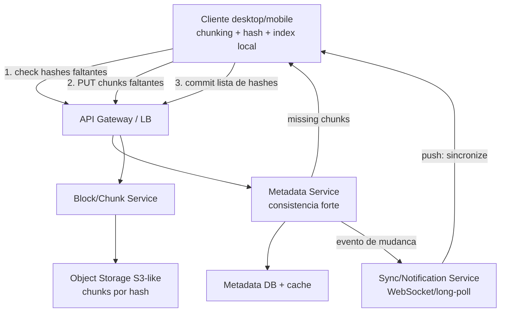
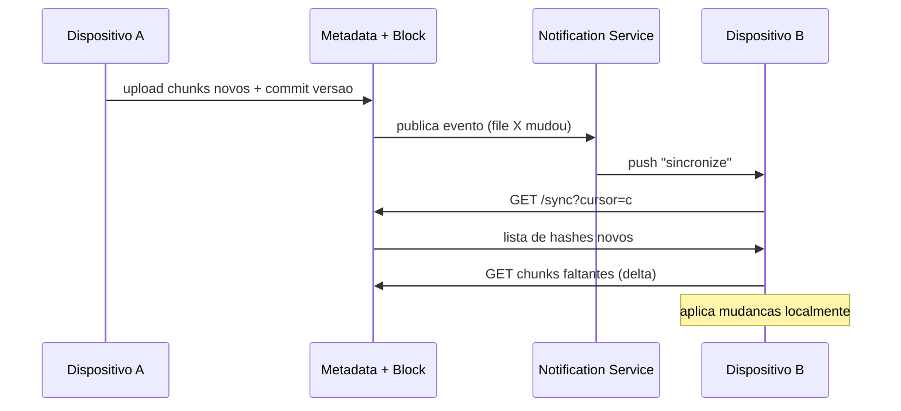

# System Design: Upload e Armazenamento de Arquivos (Dropbox / Google Drive)

> **Bloco:** System Design (estudos de caso) · **Nível:** Avançado · **Tempo de leitura:** ~32 min

## TL;DR

Projetar um serviço de armazenamento e sincronização de arquivos como **Dropbox** ou **Google Drive** é, no fundo, um problema de **mover o mínimo de bytes possível, com durabilidade máxima, mantendo N dispositivos convergentes**. Três técnicas formam o núcleo da solução. **Chunking**: o arquivo é quebrado em blocos de tamanho fixo (tipicamente 4 MB); só os chunks que mudaram são enviados/baixados, e uploads grandes ganham retomada (resume) e paralelismo. **Deduplicação por conteúdo**: cada chunk é identificado pelo hash do seu conteúdo (ex.: SHA-256) — chunks idênticos são armazenados **uma vez** e referenciados muitas vezes, economizando armazenamento e banda (um arquivo que o usuário já tem na nuvem não precisa ser reenviado — o cliente só manda os hashes e o servidor responde "já tenho"). **Sincronização incremental (delta sync)**: o cliente mantém a lista de hashes da última versão sincronizada, recalcula ao detectar mudança, faz o diff contra a lista antiga e transfere apenas os chunks divergentes; um serviço de notificação (long-polling ou WebSocket) avisa os outros dispositivos de que há mudança.

A arquitetura separa **metadados** (árvore de pastas, versões, lista de chunks por arquivo, ACLs) — guardados num banco com consistência forte — do **conteúdo** (os chunks em si) — guardado em **object storage** barato e durável (S3-like, com 11 noves de durabilidade). Os pontos difíceis em entrevista são: **resolução de conflitos** (dois dispositivos editam offline o mesmo arquivo), **consistência de metadados vs eventual de conteúdo**, **o serviço de notificação** que escala para milhões de conexões persistentes, e o **escopo da dedup** (global entre usuários levanta questões de privacidade e segurança; dedup por usuário/conta é mais comum). É um caso que recompensa quem entende dedup por hash, Merkle trees para diff eficiente e a tensão entre economia de banda e complexidade de conflito.

## Requisitos (funcionais e não-funcionais)

**Funcionais:**

- **Upload e download** de arquivos de qualquer tamanho (de KB a dezenas de GB), com **retomada** em caso de falha de rede.
- **Sincronização automática** entre múltiplos dispositivos do mesmo usuário: uma mudança num dispositivo aparece nos outros em segundos.
- **Histórico de versões**: recuperar versões anteriores de um arquivo (ex.: últimos 30 dias).
- **Compartilhamento**: compartilhar arquivo/pasta com outros usuários (somente leitura ou edição), com controle de acesso.
- **Operações offline**: editar offline e reconciliar ao reconectar (com resolução de conflitos).
- **Pastas e estrutura hierárquica** (mover, renomear, deletar — soft delete com lixeira).

**Não-funcionais:**

- **Durabilidade altíssima**: perder o arquivo do usuário é inaceitável. Alvo: 99,999999999% (11 noves) — herdado do object storage.
- **Disponibilidade**: alta (99,9%+), mas a sincronização tolera atraso de segundos (não é tempo real estrito).
- **Eficiência de banda e armazenamento**: minimizar bytes transferidos (delta sync) e armazenados (dedup, compressão).
- **Consistência**: metadados precisam de consistência forte (a árvore de pastas e a lista de chunks não pode "viajar no tempo"); o conteúdo pode ser eventualmente consistente entre réplicas.
- **Escala**: centenas de milhões de usuários, bilhões de arquivos, exabytes de dados.
- **Segurança**: criptografia em repouso e em trânsito; controle de acesso por compartilhamento.

## Estimativas de capacidade (back-of-the-envelope)

Premissas: **500 milhões de usuários registrados**, **100 milhões de ativos diários (DAU)**. Cada usuário tem em média **200 arquivos** e armazena **~10 GB**.

**Armazenamento bruto (antes de dedup):**

- 500M usuários × 10 GB = **5 × 10⁹ GB = 5 exabytes (EB)** brutos.
- Dedup + compressão tipicamente economizam 30–50% em populações reais (muitos arquivos compartilhados/repetidos: PDFs, instaladores, fotos idênticas). Assumindo 40% de economia: **~3 EB efetivos**.
- Com replicação 3× no object storage para durabilidade: **~9 EB de disco físico**.

**Número de chunks:**

- Chunk de 4 MB. Total efetivo 3 EB = 3 × 10⁹ GB = 3 × 10¹² MB. Dividido por 4 MB = **~7,5 × 10¹¹ chunks** (750 bilhões). Cada chunk precisa de uma entrada de metadados (hash, localização, refcount) — ~100 bytes → **~75 TB só de metadados de chunks**.

**Tráfego de upload:**

- Suponha que cada DAU edite/crie arquivos somando **5 MB/dia** de dados *novos* (após delta sync — o grosso já está sincronizado).
- 100M DAU × 5 MB = 5 × 10⁸ MB/dia = **500 TB/dia** de upload.
- Em segundos: 500 TB/dia ÷ 86.400 s ≈ **~5,8 GB/s** de escrita média. Com pico de 3× na hora cheia: **~17 GB/s**.

**Tráfego de download (sync para outros dispositivos):**

- Cada usuário tem em média ~2,5 dispositivos; cada mudança precisa propagar. Download tipicamente **2–3× o upload** → **~15 GB/s** de média, **~45 GB/s** no pico.

**QPS de metadados:**

- Cada operação de sync gera consultas de metadados (listar pasta, comparar hashes, registrar versão). Estime 100M DAU × 50 operações de metadados/dia = 5 × 10⁹/dia ÷ 86.400 ≈ **~58 mil QPS** de média, **~175 mil QPS** no pico. Isso dimensiona o cluster de banco de metadados e o cache.

**Conexões de notificação:**

- Para sync quase-instantâneo, cada dispositivo ativo mantém uma conexão de long-polling/WebSocket. 100M DAU × 2,5 dispositivos = **~250 milhões de conexões persistentes** no pico — o que exige uma frota grande de servidores de notificação (cada um sustenta ~100k–1M conexões ociosas), digamos **~250–2.500 servidores** só para isso.

Conclusão das contas: o gargalo não é CPU, é **I/O de rede, armazenamento durável e o fan-out de notificações**. A dedup e o delta sync existem justamente para cortar os ~5,8 GB/s de upload para uma fração — se enviássemos arquivos inteiros a cada save, o tráfego seria ordens de magnitude maior.

## Modelo de dados e API (alto nível)

**Metadados (banco relacional/distribuído com consistência forte):**

- `users(user_id, email, quota_bytes, used_bytes, ...)`
- `files(file_id, owner_id, name, parent_folder_id, size, latest_version_id, is_deleted, updated_at)`
- `file_versions(version_id, file_id, version_number, chunk_list, created_at)` — `chunk_list` é a lista ordenada de hashes de chunks que compõem aquela versão (o "receituário" do arquivo).
- `chunks(chunk_hash, storage_url, size, refcount)` — tabela de chunks deduplicados; `refcount` controla garbage collection.
- `shares(share_id, file_id, grantee_id, permission)` — controle de acesso.
- `devices(device_id, user_id, last_sync_cursor)` — o cursor é a posição do dispositivo no log de mudanças.

**Conteúdo:** os chunks ficam em **object storage** (chave = hash do chunk).

**API (REST/gRPC):**

```
POST /chunks/check        body: { hashes: [h1, h2, ...] }   → { missing: [h2] }   # dedup: quais chunks faltam
PUT  /chunks/{hash}       body: <bytes do chunk>            → 200                  # upload só dos faltantes
POST /files/{id}/commit   body: { name, chunk_list, base_version } → { version_id } # registra a nova versão
GET  /files/{id}/metadata                                  → { chunk_list, version, ... }
GET  /chunks/{hash}                                        → <bytes>               # download de chunk
GET  /sync?cursor={c}                                      → { changes: [...], next_cursor } # delta sync
POST /shares              body: { file_id, grantee, permission } → { share_id }
```

O fluxo de upload é em **duas fases**: primeiro o cliente pergunta quais chunks faltam (`/chunks/check`), envia só esses, e depois **faz commit** da lista completa de hashes como uma nova versão. Isso desacopla o upload de bytes (idempotente por hash) do registro de metadados (transacional).

## Arquitetura da solução

Componentes principais:

- **Cliente (desktop/mobile)**: faz o chunking local, calcula hashes, mantém um índice local da última versão sincronizada (lista de hashes), detecta mudanças (watcher de filesystem) e roda o algoritmo de delta sync. É a peça mais "esperta" do sistema.
- **API Gateway / Load Balancer**: roteia e autentica.
- **Block/Chunk Service**: recebe e serve chunks; conversa direto com o object storage. É a camada de banda pesada, escalável horizontalmente e stateless.
- **Metadata Service**: dono da árvore de arquivos, versões, lista de chunks e ACLs. Consistência forte. Suporta transações no commit de versão.
- **Object Storage (S3-like)**: guarda os chunks por hash, com replicação e durabilidade de 11 noves. Conteúdo frio migra para tiers mais baratos (Glacier-like).
- **Sync/Notification Service**: mantém conexões persistentes com os dispositivos (long-polling/WebSocket) e empurra eventos de mudança ("o arquivo X mudou, sincronize"). Não envia os dados, só o sinal — o cliente então puxa via delta sync.
- **Metadata DB**: banco com consistência forte (ex.: relacional sharded por `user_id`, ou um datastore distribuído). Cache (Redis) na frente para os metadados quentes.
- **Versioning Service / GC**: gerencia histórico de versões e o garbage collector que remove chunks com `refcount = 0`.

A separação cardinal: **fluxo de metadados** (pequeno, transacional, consistência forte) e **fluxo de conteúdo** (grande, idempotente, eventualmente consistente). O cliente orquestra os dois — pergunta ao Metadata Service o que mudou, troca chunks com o Block Service, e faz commit no Metadata Service.

## Diagrama de arquitetura

O primeiro diagrama mostra os componentes e o fluxo de upload em duas fases; o segundo, o ciclo de sincronização entre dois dispositivos via serviço de notificação.





## Pontos de escala e gargalos

- **Object storage de chunks**: o volume bruto (exabytes) é o maior custo. Dedup global + compressão + tiering (quente em SSD/standard, frio em Glacier) atacam isso. O **garbage collection** de chunks órfãos (`refcount = 0`) precisa ser correto e seguro contra corrida (deletar um chunk que outra versão ainda referencia é catastrófico — use refcount transacional ou mark-and-sweep com graça).
- **Metadata DB**: alto QPS de leitura (listar pastas, comparar hashes). **Sharding por `user_id`** mantém os dados de um usuário co-localizados (a maioria das operações é dentro de uma conta). Cache agressivo de metadados quentes. O commit de versão precisa ser transacional (atomicidade da lista de chunks + refcounts).
- **Notification Service**: 250M conexões persistentes é o gargalo "escondido". Servidores otimizados para muitas conexões ociosas (epoll/event-loop), sharding de conexões por `user_id`, e um barramento de eventos (pub/sub) para rotear mudanças ao servidor que detém a conexão do dispositivo alvo.
- **Hot files / arquivos muito compartilhados**: um arquivo compartilhado com milhares de pessoas gera fan-out de notificação grande a cada mudança — trate como o "celebrity problem" do newsfeed (lote/coalesce de notificações).
- **Upload de arquivos gigantes**: chunking + upload paralelo + retomada por chunk. O cliente reenvia só o chunk que falhou, não o arquivo.
- **Banda do cliente**: delta sync e dedup do lado do cliente ("client-side dedup") evitam reenviar o que a nuvem já tem — o ganho de banda é enorme, mas exige confiança no hash (e cuidado com ataques de "adivinhar conteúdo por timing do dedup").

## Trade-offs e decisões-chave

- **Tamanho do chunk (fixo vs variável)**: chunk fixo (4 MB) é simples, mas sofre do problema de "boundary shift" — inserir um byte no início desloca todos os limites e invalida toda a cadeia de chunks. **Content-defined chunking** (rolling hash, ex.: Rabin fingerprinting) define limites pelo conteúdo, então uma inserção só afeta o chunk local — melhor dedup, mais complexo. Dropbox usa blocos de 4 MB; sistemas de backup (restic, borg) usam chunking variável.
- **Escopo da deduplicação**: **global** (entre todos os usuários) maximiza economia, mas abre brechas de privacidade/segurança (o "ataque de existência": medir se um chunk já existe revela que alguém tem aquele arquivo) e complica criptografia fim-a-fim. **Por usuário/conta** é mais seguro e ainda economiza bastante (o mesmo usuário tem muitas cópias). Decisão arquitetural com peso legal/privacidade.
- **Consistência forte de metadados vs eventual de conteúdo**: a árvore de arquivos e a lista de chunks **precisam** de consistência forte (não pode haver versão "fantasma" ou lista de chunks parcial). O conteúdo (chunks) pode ser eventualmente consistente entre réplicas/regiões, porque é imutável (identificado por hash — nunca muda). Imutabilidade do conteúdo é o que torna a eventual consistência segura aqui.
- **Resolução de conflitos**: quando dois dispositivos editam o mesmo arquivo offline, a estratégia comum é **manter ambos** (criar "arquivo (conflicted copy)") em vez de tentar merge automático arriscado de binários. Para arquivos estruturados (docs colaborativos), entram CRDTs/OT — outro problema. Decida o nível: o Drive/Dropbox clássico usa conflicted copies; Google Docs usa OT.
- **Push (notificação) vs pull (polling periódico)**: push dá sync quase-instantâneo mas custa 250M conexões; pull é simples mas atrasa e desperdiça. O modelo real é híbrido: long-polling/WebSocket para o dispositivo ativo, polling de fallback.

## Erros comuns em entrevista

- **Esquecer a separação metadados/conteúdo.** Tratar tudo num banco só ignora que conteúdo é grande/imutável (object storage) e metadados são pequenos/transacionais (banco forte). É a primeira decisão a verbalizar.
- **Não mencionar chunking nem delta sync.** Propor "upload do arquivo inteiro a cada save" multiplica o tráfego por ordens de magnitude. O ponto do problema é mover o mínimo de bytes.
- **Ignorar resolução de conflitos e operação offline.** O entrevistador quase sempre pergunta "e se dois dispositivos editarem offline?". Ter a resposta (conflicted copy vs merge) pronta diferencia.
- **Dedup global sem mencionar privacidade/segurança.** Propor dedup global como óbvio sem citar o trade-off de privacidade e o ataque de existência mostra falta de profundidade.
- **Esquecer o garbage collection de chunks.** Sem refcount/GC, o armazenamento cresce para sempre com chunks órfãos. Mencionar refcount transacional ou mark-and-sweep.
- **Subestimar o serviço de notificação.** As 250M conexões persistentes são um sistema inteiro por si só — não é um detalhe.
- **Não dimensionar.** Sem as contas (exabytes, GB/s, QPS), a discussão fica vaga. Os números justificam dedup, tiering e sharding.

## Relação com outros conceitos

- **Object Storage e tiering de cache/armazenamento**: chunks frios migram para tiers baratos; metadados quentes ficam em cache (Redis). Conecta com **CDN/caching multicamada** para download de conteúdo popular compartilhado.
- **Consistent Hashing**: distribuição de chunks e de conexões de notificação por nós; rebalanceamento ao adicionar capacidade.
- **Idempotência**: o upload de chunk é naturalmente idempotente (chave = hash do conteúdo — reenviar o mesmo chunk é no-op). O commit de versão usa `base_version` para detectar conflito (compare-and-set).
- **Merkle trees / estruturas probabilísticas**: a lista de hashes por arquivo é uma árvore de hashes; diff eficiente entre versões usa Merkle trees (comparar raízes, descer só onde difere). Relaciona-se com **Bloom filters** para checar rápido "este chunk talvez exista" antes do round-trip.
- **CDC e Outbox**: o evento "arquivo mudou" publicado para o Notification Service é um caso de **Outbox/CDC** — capturar a mudança de metadados de forma confiável e propagar.
- **Stream processing**: o log de mudanças (change feed) por usuário, consumido pelo delta sync via cursor, é um stream — relaciona-se com mensageria/event log.
- **ACID e consistência forte**: o commit de versão (lista de chunks + refcounts + atualização da árvore) é uma transação ACID nos metadados — a parte que não pode ser eventual.

## Referências

- [system-design-primer — donnemartin (GitHub)](https://github.com/donnemartin/system-design-primer)
- [Design A News Feed System / cloud storage — ByteByteGo](https://bytebytego.com/courses/system-design-interview/design-a-news-feed-system)
- [System Design Dropbox/Google Drive — deep dive (Narendra Gowda, Medium)](https://medium.com/@narengowda/system-design-dropbox-or-google-drive-8fd5da0ce55b)
- [Design a Cloud Storage Service — DesignGurus](https://www.designgurus.io/blog/design-cloud-storage-service)
- [Delta Sync & Merkle Trees — System Design Sandbox](https://www.systemdesignsandbox.com/learn/delta-sync)
- [Design Dropbox — GeeksforGeeks](https://www.geeksforgeeks.org/design-dropbox-a-system-design-interview-question/)
- [Design Dropbox System: A Complete Walkthrough — System Design School](https://systemdesignschool.io/problems/dropbox/solution)
