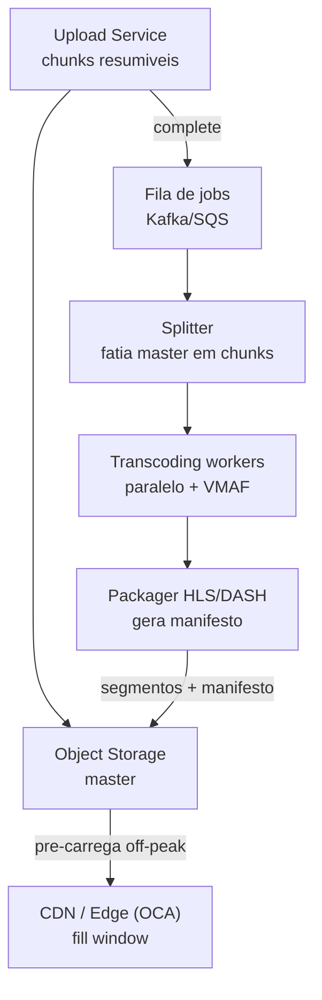
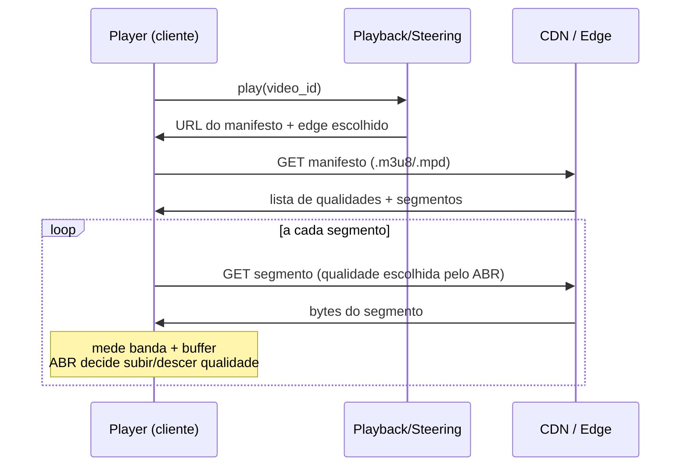

# System Design: Streaming de Vídeo (YouTube / Netflix)

> **Bloco:** System Design (estudos de caso) · **Nível:** Avançado · **Tempo de leitura:** ~33 min

## TL;DR

Streaming de vídeo em escala (YouTube, Netflix) é um problema dominado por **três pilares**: **transcoding** (converter o master pesado em dezenas de versões — a "encoding ladder"), **CDN** (mover os bytes para perto do espectador) e **ABR — Adaptive Bitrate** (o player escolhe dinamicamente a qualidade conforme a banda disponível). O insight central é que o **upload/ingestão é raro e caro, mas o download é massivo e repetido** — então otimiza-se brutalmente para a entrega: pré-processar cada vídeo em muitas resoluções/bitrates, fatiar em **segmentos de 2–10 segundos**, e espalhar esses segmentos em milhares de servidores de borda próximos aos usuários (no caso da Netflix, os **Open Connect Appliances** instalados dentro dos ISPs).

O pipeline de transcoding é assíncrono e paralelo: o master (4K, dezenas de GB) é fatiado em chunks, cada chunk é transcodificado em paralelo por uma frota de workers, gerando ~10 resoluções × múltiplos bitrates × faixas de áudio/legenda — Netflix chega a ~120 streams por título. Os segmentos resultantes são empacotados em **HLS** ou **DASH**, descritos por um **manifesto** (a "playlist" que lista as qualidades e os segmentos disponíveis). No play, o cliente baixa o manifesto, escolhe a faixa inicial pela estimativa de banda, e a cada segmento o **algoritmo ABR** decide subir ou descer de qualidade — privilegiando não dar buffering. Em entrevista, os pontos profundos são: a economia da CDN própria vs terceirizada, o ABR (buffer-based vs throughput-based), o pipeline de transcoding assíncrono com filas, e a separação metadados/conteúdo/recomendação.

## Requisitos (funcionais e não-funcionais)

**Funcionais:**

- **Upload/ingestão** de vídeo (criadores no YouTube; estúdios entregam masters na Netflix).
- **Transcoding** do master em múltiplas resoluções/bitrates e formatos (encoding ladder).
- **Reprodução** com streaming adaptativo (ABR): qualidade ajusta à banda, sem buffering perceptível.
- **Busca e descoberta** (catálogo, busca, recomendação/ranking).
- **Metadados** (título, descrição, thumbnails, contadores de views, legendas).
- **Resumir reprodução** (continuar de onde parou), múltiplos dispositivos.
- (YouTube) comentários, likes, contagem de views; (Netflix) perfis, watch history.

**Não-funcionais:**

- **Baixa latência de início** (time-to-first-frame): play deve começar em < 2 s.
- **Sem buffering** (rebuffering ratio baixíssimo): a métrica de qualidade de experiência (QoE) mais importante.
- **Altíssima disponibilidade e throughput de leitura**: vídeo é dezenas de % do tráfego da internet.
- **Escala global**: entrega geograficamente distribuída (CDN/edge).
- **Eficiência de banda/custo**: bytes entregues são o maior custo — daí CDN própria, codecs eficientes (AV1, HEVC), per-title encoding.
- **Durabilidade** do master e dos assets transcodificados.

## Estimativas de capacidade (back-of-the-envelope)

Premissas (escala tipo YouTube/Netflix): **2 bilhões de usuários**, **300 milhões assistindo por dia**, cada um **5 horas/dia** em média. Upload (YouTube): **500 horas de vídeo por minuto**.

**Tráfego de entrega (o que domina tudo):**

- Bitrate médio de streaming (mix de qualidades, peso para HD): **~5 Mbps** (= 0,625 MB/s).
- 300M usuários × 5 h/dia = 1,5 × 10⁹ horas-usuário/dia. Mas o pico de **concorrência** é o que importa: suponha **100 milhões de streams simultâneos** no horário de pico.
- 100M × 5 Mbps = **5 × 10⁸ Mbps = 500 Tbps = 0,5 Pbps** de saída no pico. É a razão de existir uma CDN dedicada — nenhum data center central entrega meio petabit por segundo; tem de ser na borda, dentro dos ISPs.

**Armazenamento de vídeo (YouTube — upload alto):**

- 500 horas/minuto = 720.000 horas/dia de upload.
- Cada hora de master ~ alguns GB; após transcoding em ~10 qualidades, o conjunto de derivados pode ser **3–5× o master**. Estime ~10 GB armazenados por hora de conteúdo (master + ladder).
- 720.000 h/dia × 10 GB = **7,2 PB/dia** de novo armazenamento. Em um ano: **~2,6 EB/ano** — daí tiering agressivo (conteúdo frio/cauda longa em armazenamento barato).

**Custo de transcoding:**

- 720.000 horas/dia de vídeo a transcodificar. Transcodificar 1 h de vídeo em ~10 perfis consome, digamos, ~2 h de CPU-core no total (paralelizável).
- 720.000 × 2 = 1,44M core-horas/dia ÷ 24 = **~60.000 cores** ocupados continuamente só com transcoding (na prática mais, com pico). Justifica o pipeline assíncrono com filas e autoescala.

**Segmentos:**

- Segmento de 4 s. Uma hora de vídeo = 3.600 s ÷ 4 = **900 segmentos** por qualidade. Com 10 qualidades = **9.000 segmentos/hora de vídeo** — bilhões de pequenos objetos no object storage/CDN.

**Metadados e views:**

- Contagem de views é um problema de **escrita pesada** (cada play incrementa): 100M streams simultâneos, cada um gera eventos de progresso — milhões de writes/s. Solução: agregação assíncrona (não incrementar transacionalmente; bufferizar e somar em lote), contadores aproximados.

Conclusão das contas: o gargalo é **banda de entrega (0,5 Pbps)**, resolvido por CDN/edge; o segundo é **custo de transcoding** (assíncrono, paralelo, com filas e autoescala); o terceiro é **armazenamento** (tiering). A ingestão é desprezível perto da entrega.

## Modelo de dados e API (alto nível)

**Metadados (banco):**

- `videos(video_id, uploader_id, title, description, status, duration, created_at)` — `status`: uploaded → transcoding → ready/failed.
- `renditions(video_id, resolution, bitrate, codec, manifest_url)` — cada perfil da ladder.
- `segments` ficam no object storage/CDN, não no banco (descritos pelo manifesto).
- `views(video_id, count)` — contador agregado assíncronamente.
- `watch_progress(user_id, video_id, position_seconds)` — para "continuar assistindo".

**Conteúdo:** masters e segmentos transcodificados em **object storage**, distribuídos para a **CDN/edge**.

**API:**

```
POST /videos/upload/init     → { upload_id, upload_urls }   # upload resumível em chunks
POST /videos/{id}/complete                                   # dispara o pipeline de transcoding (async)
GET  /videos/{id}/manifest   → HLS .m3u8 / DASH .mpd         # playlist das qualidades + segmentos
GET  /cdn/{segment}          → <bytes do segmento>           # servido pela borda (CDN/OCA)
POST /videos/{id}/progress   body: { position }              # salva watch progress (async)
GET  /feed/recommendations   → [video_id, ...]               # ranking/recomendação
```

O cliente baixa o **manifesto** (que lista as `renditions` e os segmentos de cada uma), escolhe a qualidade inicial, e pede os segmentos diretamente à CDN. O ABR roda **no cliente** — o servidor só publica o manifesto e serve segmentos.

## Arquitetura da solução

**Caminho de ingestão/transcoding (assíncrono):**

- **Upload Service**: recebe o master em chunks (resumível), valida, grava no object storage. Ao completar, publica uma mensagem na fila.
- **Fila de jobs (Kafka/SQS)**: desacopla upload do processamento. Resiliente a picos de upload.
- **Transcoding Pipeline**: workers consomem jobs, **fatiam o master em chunks**, transcodificam cada chunk em paralelo (frota de instâncias, autoescala) em cada perfil da ladder, computam métricas de qualidade (ex.: **VMAF**, da Netflix) para otimizar a ladder por título (**per-title encoding**), e **empacotam** os segmentos em HLS/DASH gerando o manifesto.
- **Object Storage**: masters e segmentos derivados; tiering por popularidade.

**Caminho de entrega (massivo, otimizado):**

- **CDN / Edge (OCA na Netflix)**: servidores de borda dentro/próximos dos ISPs, pré-carregados ("fill window") com o conteúdo popular nas horas de baixa demanda. Servem os segmentos com latência mínima.
- **Steering / Playback Service**: no play, autentica, escolhe o melhor edge (por geografia, carga, saúde da rede) e devolve a URL do manifesto/edge.
- **Player (cliente)**: baixa manifesto, roda o **algoritmo ABR**, pede segmentos, mede banda e buffer, ajusta qualidade segmento a segmento, faz failover para outro edge se o atual degrada.

**Plano de metadados/descoberta:**

- **Metadata Service, Search, Recommendation/Ranking**: catálogo, busca, e o sistema de recomendação (ML) que decide o que mostrar — um subsistema inteiro à parte.

## Diagrama de arquitetura

O primeiro diagrama mostra o pipeline assíncrono de transcoding; o segundo, o caminho de reprodução com ABR e CDN.





## Pontos de escala e gargalos

- **Banda de entrega (o gargalo número 1)**: 0,5 Pbps no pico. Resolvido movendo bytes para a borda — **CDN própria (Open Connect)** com appliances dentro dos ISPs elimina o custo de trânsito e a latência. O conteúdo popular é pré-carregado off-peak; a cauda longa fica em poucos pontos e cai para origem em cache miss.
- **Custo/throughput de transcoding**: assíncrono, paralelo, com filas e autoescala. Fatiar o master permite transcodificar chunks em paralelo (e usar instâncias spot/baratas). Per-title encoding (VMAF) economiza banda entregando o menor bitrate que mantém a qualidade percebida — economia composta sobre exabytes entregues.
- **Armazenamento**: a ladder multiplica o tamanho; tiering por popularidade (quente em SSD/edge, frio em armazenamento barato). Conteúdo nunca assistido pode nem ser pré-gerado (transcoding sob demanda na primeira view, para a cauda longa).
- **Contagem de views / watch progress**: escrita massiva. Não incremente transacionalmente — bufferize eventos, agregue assíncronamente (stream processing), aceite contadores aproximados/eventualmente consistentes.
- **Hot content (vídeo viral)**: pico súbito de demanda num único vídeo. A CDN multicamada absorve (edge → regional → origem); pré-aquecimento de cache para lançamentos previstos (estreia da Netflix).
- **Cache miss / fill**: se o edge não tem o segmento, busca na camada superior. A taxa de cache hit na borda é a métrica de custo-chave; classificar e prever misses (a Netflix publica sobre isso) melhora a eficiência.

## Trade-offs e decisões-chave

- **CDN própria vs terceirizada**: terceirizada (Akamai, CloudFront) é rápida de adotar e elástica; própria (Open Connect) custa CAPEX alto mas, **na escala da Netflix, sai mais barato e dá mais controle** (qualidade, fill, custo de trânsito zero com ISPs). A decisão depende da escala — só faz sentido construir a própria acima de um volume gigante.
- **HLS vs DASH**: HLS (Apple) tem suporte universal em dispositivos Apple; DASH (padrão aberto, codec-agnóstico) é mais flexível. Muitos serviços empacotam em ambos (ou usam CMAF para compartilhar segmentos). Trade-off de compatibilidade vs flexibilidade.
- **ABR: buffer-based vs throughput-based**: o algoritmo throughput-based escolhe a qualidade pela banda estimada (reage rápido, mas oscila); o buffer-based (ex.: BOLA) decide pela ocupação do buffer (mais estável, evita rebuffer). Os players modernos combinam os dois. Trade-off: estabilidade de qualidade vs evitar buffering.
- **Tamanho do segmento**: segmentos curtos (2 s) dão ABR mais responsivo e menor latência de início, mas mais overhead (mais requisições, menos eficiência de compressão). Segmentos longos (10 s) comprimem melhor mas reagem devagar a mudanças de banda. Compromisso típico: 4–6 s.
- **Pré-transcodificar tudo vs sob demanda**: pré-gerar toda a ladder de todo upload é caro para a cauda longa (vídeos que ninguém vê). Transcodificar sob demanda na primeira view economiza, ao custo de latência no primeiro play. YouTube usa abordagens híbridas.
- **Consistência**: metadados e catálogo toleram eventual consistência (um novo vídeo aparecer alguns segundos depois é aceitável). Watch progress e views são eventualmente consistentes por design — priorizam disponibilidade e throughput.

## Erros comuns em entrevista

- **Tratar entrega como request/response normal de um data center.** Sem CDN/edge, é impossível entregar 0,5 Pbps. A primeira coisa a verbalizar é "o download é o gargalo, e a solução é a CDN".
- **Esquecer que transcoding é assíncrono.** Propor transcodificar no caminho de upload síncrono trava tudo. É um pipeline de jobs com fila, paralelo e autoescalado.
- **Não mencionar ABR nem o manifesto.** "Streaming adaptativo" é o coração da experiência; sem manifesto e ABR no cliente, a discussão fica incompleta.
- **Incrementar view count transacionalmente.** Milhões de writes/s num contador relacional é receita de desastre. Agregação assíncrona / contadores aproximados.
- **Ignorar o per-title encoding / codecs.** Não mencionar que a eficiência de codec/bitrate é onde mora a economia composta sobre exabytes entregues.
- **Não dimensionar.** Sem o número de 0,5 Pbps no pico, não se justifica a CDN própria; sem as core-horas, não se justifica o pipeline assíncrono.
- **Confundir os dois caminhos.** Misturar o plano de ingestão/transcoding (raro, pesado por item) com o de entrega (massivo, repetido) — eles têm requisitos opostos e arquiteturas separadas.

## Relação com outros conceitos

- **CDN/caching multicamada**: o coração da entrega — edge → regional → origem, com pré-aquecimento (fill window) e classificação de cache miss. É o exemplo canônico de cache multicamada geográfico.
- **Stream processing**: agregação de views, watch progress e sinais de recomendação são processados como streams (ex.: Kafka + processador) — eventual consistência por design.
- **Mensageria / filas (Outbox)**: o pipeline de transcoding é orquestrado por filas de jobs; o evento "upload completo" dispara o processamento — relaciona-se com Outbox/eventos.
- **Consistent Hashing**: distribuição de segmentos pelos nós da CDN e roteamento de cache.
- **Idempotência**: jobs de transcoding devem ser idempotentes (reprocessar um chunk não pode duplicar/corromper o output) — retomada segura de pipeline.
- **Saga**: o pipeline multi-etapa (validar → fatiar → transcodificar → empacotar → publicar) com compensação em falha parcial assemelha-se a uma saga de processamento.
- **Newsfeed ranking e recomendação**: o subsistema de descoberta da Netflix/YouTube é, ele próprio, um problema de ranking/recomendação — ver o estudo de caso correspondente.

## Referências

- [Netflix Open Connect — visão geral oficial (PDF)](https://openconnect.netflix.com/Open-Connect-Overview.pdf)
- [Netflix | Open Connect (site oficial)](https://openconnect.netflix.com/)
- [Netflix: What Happens When You Press Play? — High Scalability](https://highscalability.com/netflix-what-happens-when-you-press-play/)
- [YouTube Architecture — High Scalability](https://highscalability.com/youtube-architecture/)
- [Driving Content Delivery Efficiency Through Classifying Cache Misses — Netflix TechBlog](https://netflixtechblog.com/driving-content-delivery-efficiency-through-classifying-cache-misses-ffcf08026b6c)
- [How Netflix Video Processing Pipeline Works — Ajit Singh](https://singhajit.com/netflix-video-processing-pipeline/)
- [system-design-primer — donnemartin (GitHub)](https://github.com/donnemartin/system-design-primer)
