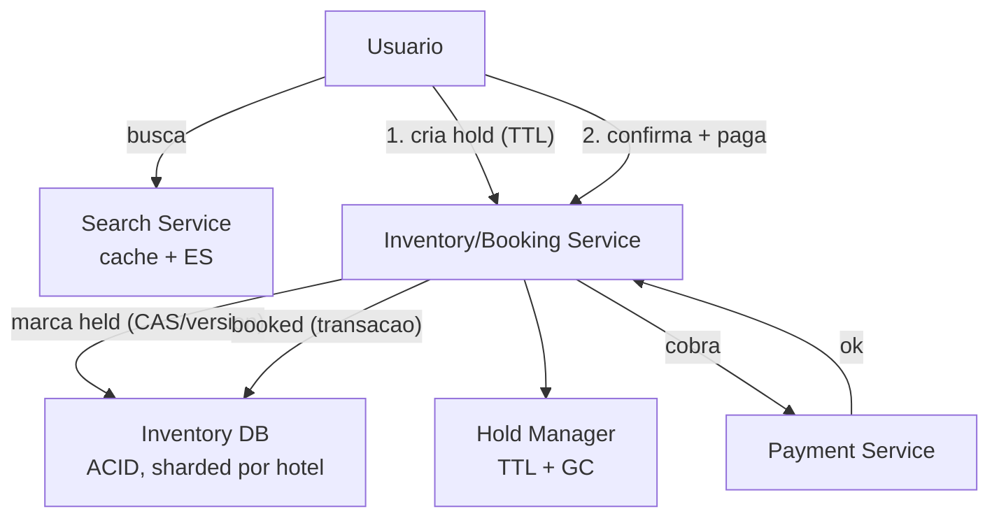
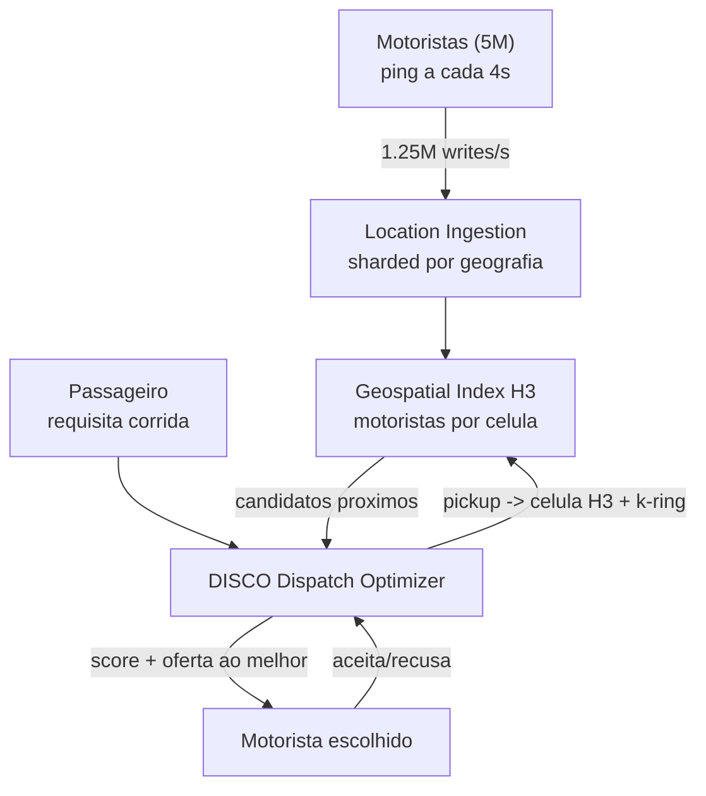

# System Design: Sistema de Reservas (Uber / Hotel Booking)

> **Bloco:** System Design (estudos de caso) · **Nível:** Avançado · **Tempo de leitura:** ~33 min

## TL;DR

Sistemas de reserva têm duas variantes que compartilham o mesmo dilema de fundo — **um recurso escasso não pode ser vendido duas vezes** (não vender o mesmo quarto/assento/motorista para dois clientes) — mas com perfis opostos de tempo. **Hotel/voo booking** é um problema de **concorrência sobre inventário finito**: muitos usuários disputando o mesmo quarto, exigindo reserva atômica, holds temporários e tratamento de overbooking. **Uber/ride-hailing** é um problema de **matching geoespacial em tempo real**: casar oferta (motoristas) e demanda (passageiros) que se movem, minimizando tempo de espera, usando índices espaciais (como o **H3** da Uber) e um otimizador de dispatch (**DISCO**).

No booking de inventário, a armadilha clássica é o **double-booking** sob concorrência: a solução combina **transações ACID**, **holds com expiração** (reservar provisoriamente por N minutos durante o checkout), e controle de concorrência **otimista** (versão/CAS) ou **pessimista** (lock de linha) sobre a unidade de inventário. No matching da Uber, o passageiro é convertido numa célula H3, computa-se o **k-ring** (células vizinhas) para achar motoristas candidatos próximos, e o otimizador pontua e ranqueia candidatos por função multiobjetivo (minimizar espera do passageiro e deslocamento do motorista, maximizar aceitação). Em entrevista, os pontos profundos são: como garantir consistência forte no inventário sem matar o throughput, holds e seu GC, o sharding geográfico do matching, e o trade-off entre consistência (não double-book) e disponibilidade/latência.

## Requisitos (funcionais e não-funcionais)

**Hotel/Booking:**

- **Buscar** disponibilidade (datas, localização, filtros) — leitura pesada.
- **Reservar** atomicamente: garantir que um quarto/assento não seja vendido duas vezes.
- **Hold temporário** durante o checkout (segurar o inventário por ~10 min enquanto o usuário paga).
- **Cancelamento e reembolso**; liberar o inventário.
- **Histórico** de reservas.

**Uber/Matching:**

- **Atualização de localização** de motoristas (alta frequência de writes).
- **Requisição de corrida**: casar passageiro com o melhor motorista próximo.
- **Matching em tempo real** minimizando ETA/espera; lidar com aceitação/recusa do motorista.
- **Tracking** da corrida em tempo real; cálculo de preço (surge).

**Não-funcionais (ambos):**

- **Consistência forte na unidade de venda**: nunca vender o mesmo recurso duas vezes (correção > tudo).
- **Baixa latência**: busca e matching devem responder em centenas de ms.
- **Alta disponibilidade** para busca (leitura); a escrita crítica pode priorizar correção.
- **Escala**: milhões de buscas, picos por eventos (shows, feriados, surge).
- (Uber) **alta taxa de writes** de geolocalização (milhões de pings/min).

## Estimativas de capacidade (back-of-the-envelope)

### Variante Hotel/Booking

Premissas: plataforma global de hotéis, **1 milhão de propriedades**, **50 milhões de quartos-noite de inventário ativo**, **10 milhões de buscas/dia**, **500 mil reservas/dia**.

- **Buscas**: 10M/dia ÷ 86.400 ≈ **~115 QPS** de média, com pico de ~10× (campanhas/feriados) → **~1.150 QPS** de busca. Busca é cacheável (resultados de disponibilidade por região/data).
- **Reservas**: 500k/dia ÷ 86.400 ≈ **~6 QPS** de média, pico ~60 QPS. A escrita transacional é baixa em QPS — o desafio não é volume, é **correção sob concorrência** (muitos buscando o mesmo quarto popular simultaneamente).
- **Razão leitura:escrita** ≈ 20:1 (e na realidade muito maior, pois a maioria das buscas não converte). Otimize leitura com cache; proteja escrita com transação.
- **Holds**: se 5% das buscas viram hold de 10 min, com 1.150 QPS de busca no pico → ~57 holds/s × 600 s = **~34 mil holds ativos** simultâneos a gerenciar (com GC por expiração).

### Variante Uber/Matching

Premissas: **5 milhões de motoristas ativos**, **20 milhões de corridas/dia**, ping de localização a cada **4 s**.

- **Writes de localização**: 5M motoristas × (1 ping / 4 s) = **1,25 milhão de writes/s** de geolocalização. Esse é o gargalo de escrita — exige um datastore espacial otimizado para writes (em memória, sharded por geografia) e não um banco transacional clássico.
- **Requisições de corrida**: 20M/dia ÷ 86.400 ≈ **~230 QPS** de média, pico (rush) ~5–10× → **~1.500–2.300 QPS** de matching.
- **Matching por célula**: convertendo o pickup em célula H3 e buscando num k-ring, o conjunto de candidatos cai de "todos os motoristas da cidade" para **dezenas** — o que torna o scoring viável em poucos ms. Sem índice espacial, seria um scan global a 1.500 QPS, inviável.
- **Conexões em tempo real**: 5M motoristas + passageiros ativos mantêm conexões persistentes (tracking). Frota de servidores de gateway de conexão, sharded por geografia (Ringpop/consistent hash).

Conclusão: no booking, o volume é baixo mas a **concorrência sobre itens quentes** é o problema; na Uber, o problema é o **volume de writes geoespaciais (1,25M/s)** e o **matching de baixa latência** via sharding geográfico.

## Modelo de dados e API (alto nível)

### Hotel/Booking

```
rooms(room_id, hotel_id, type, ...)
inventory(room_id, date, status, version)   -- unidade vendável: quarto x data; status = available/held/booked
holds(hold_id, room_id, date_range, user_id, expires_at)
reservations(reservation_id, user_id, room_id, date_range, status, payment_id)
```

API:

```
GET  /search?location&checkin&checkout      → [quartos disponiveis]
POST /holds   body: {room_id, dates}        → {hold_id, expires_at}   # segura o inventario
POST /reservations  body: {hold_id, payment}→ {reservation_id}        # confirma (transacional)
DELETE /reservations/{id}                    → libera inventario
```

A reserva é em **duas fases**: criar hold (provisório, com TTL) → confirmar reserva (transacional, valida que o hold ainda vale). Isso evita segurar uma transação de banco aberta durante o checkout do usuário (que pode levar minutos).

### Uber/Matching

```
driver_locations(driver_id, h3_cell, lat, lng, status, updated_at)  -- em memoria/datastore espacial
rides(ride_id, rider_id, driver_id, pickup, dropoff, status, fare)
```

API:

```
POST /drivers/location  body: {driver_id, lat, lng}   # alta frequencia (1.25M/s)
POST /rides/request     body: {rider_id, pickup}      → {ride_id, matched_driver}
POST /rides/{id}/accept  (motorista aceita)
GET  /rides/{id}/track  → posicao em tempo real
```

## Arquitetura da solução

### Hotel/Booking

- **Search Service**: leitura pesada e cacheável. Disponibilidade por região/data servida de cache (Redis) e índices de busca (Elasticsearch); aceita leve staleness (a confirmação final revalida).
- **Inventory/Booking Service**: dono da unidade vendável (quarto × data). Confirma reservas com **transação ACID** e controle de concorrência. Cria/expira holds.
- **Inventory DB**: banco relacional com consistência forte, sharded por `hotel_id`/região. A unidade de contenção (a linha `inventory(room_id, date)`) é o ponto de serialização.
- **Hold Manager**: cria holds com `expires_at` e roda GC (libera holds expirados). Pode usar Redis com TTL para os holds quentes.
- **Payment Service**: integra com o gateway; a confirmação só efetiva após pagamento (saga: hold → cobrar → confirmar; compensar liberando hold se o pagamento falha).

### Uber/Matching

- **Location Ingestion**: recebe 1,25M pings/s; atualiza o datastore espacial em memória, sharded por geografia (consistent hashing via Ringpop). Não persiste cada ping num banco transacional.
- **Geospatial Index (H3)**: motoristas indexados por célula H3. Busca de candidatos = k-ring ao redor da célula do pickup.
- **DISCO (Dispatch Optimizer)**: recebe a requisição, computa candidatos via H3, pontua por função multiobjetivo (ETA, deslocamento, aceitação, fairness) e oferta ao melhor motorista; trata recusa oferecendo ao próximo. Suporta planejamento futuro (motorista que vai ficar livre em breve).
- **Ride Service**: estado da corrida (matching → aceita → a caminho → em curso → finalizada); persiste em banco transacional (volume baixo comparado aos pings).
- **Real-time Gateway**: conexões persistentes para tracking (WebSocket), sharded por geografia.

## Diagrama de arquitetura

O primeiro diagrama mostra a reserva em duas fases (hold + confirmação) do booking; o segundo, o matching geoespacial da Uber.





## Pontos de escala e gargalos

### Booking

- **Itens quentes (hot inventory)**: um quarto popular numa data de show vira ponto de contenção. Lock pessimista na linha serializa (seguro, mas limita throughput); CAS otimista (version) falha rápido sob conflito e o cliente retenta — melhor para conflito raro. Para itens muito quentes, considere filas/sorteio.
- **Holds e seu GC**: holds expirados precisam ser liberados pontualmente, senão o inventário fica "preso" indisponível. TTL em Redis + sweep. Cuidado com a corrida hold-expira-durante-confirmação (revalide o hold na transação de confirmação).
- **Leitura de busca**: cacheável e escalável horizontalmente; aceita staleness (o usuário revalida no hold). Não deixe a busca tocar a tabela de contenção a cada query.

### Uber

- **Writes de localização (1,25M/s)**: o maior gargalo. Datastore espacial em memória, sharded por geografia; não persistir cada ping transacionalmente. Ringpop/consistent hashing distribui os shards e tolera falha de nó.
- **Matching de baixa latência**: H3 + k-ring reduz candidatos de milhares para dezenas, viabilizando o scoring em ms. Resolução da célula é um trade-off (célula grande = mais candidatos, célula pequena = pode não achar ninguém em zona esparsa — daí o k-ring crescente).
- **Hot zones (surge)**: aeroporto, show — demanda concentrada numa célula. Surge pricing modula demanda; o matching precisa lidar com escassez local (expandir o raio de busca).

## Trade-offs e decisões-chave

- **Concorrência otimista vs pessimista no inventário**: pessimista (SELECT FOR UPDATE / lock de linha) garante mas serializa e pode causar contenção/deadlock sob carga; otimista (version + CAS, retry) tem mais throughput quando conflitos são raros, mas degrada (muitos retries) sob conflito alto. Escolha pela taxa de conflito esperada do item.
- **Hold temporário vs reserva direta**: o hold desacopla o checkout (lento, com pagamento) da transação de inventário (rápida), evitando segurar locks por minutos. O custo é a complexidade do GC de holds e o risco de inventário temporariamente "preso".
- **Overbooking deliberado (hotel/voo)**: companhias aéreas/hotéis vendem **acima** da capacidade contando com no-shows — uma decisão de negócio que troca risco (ter de realocar/compensar) por maximização de ocupação. O sistema precisa modelar isso explicitamente.
- **Consistência forte vs disponibilidade (CAP)**: na unidade de venda, **escolha consistência** — vender duas vezes é pior que rejeitar uma reserva. A busca, ao contrário, pode ser AP (eventual/stale). Particionar o sistema em "leitura disponível" e "escrita consistente" é a decisão central.
- **Matching: greedy vs batch (Uber)**: casar cada requisição imediatamente com o motorista mais próximo (greedy) é simples mas subótimo globalmente; processar requisições em micro-lotes e otimizar o conjunto (batch matching) melhora o resultado agregado ao custo de latência. DISCO faz planejamento que vai além do greedy.
- **Índice espacial: H3 (hexágonos) vs geohash/quadtree**: H3 (hexagonal hierárquico) tem vizinhança uniforme (todos os 6 vizinhos equidistantes), evitando distorções do geohash retangular — vantagem para k-ring e cálculo de proximidade.

## Erros comuns em entrevista

- **Não tratar o double-booking explicitamente.** É o coração do problema de inventário. Verbalizar a transação atômica / CAS / lock na unidade vendável é obrigatório.
- **Segurar uma transação de banco durante o checkout do usuário.** Locks abertos por minutos enquanto o usuário digita o cartão derrubam o throughput. Use holds com TTL.
- **Esquecer o GC de holds.** Holds que nunca expiram prendem o inventário para sempre. TTL + sweep.
- **Propor scan global de motoristas (Uber).** Sem índice espacial (H3/geohash), buscar o motorista mais próximo é O(N) sobre milhões — inviável a 1.500 QPS. O índice espacial é o ponto central.
- **Persistir cada ping de localização num banco transacional.** 1,25M writes/s num RDBMS é impossível. Datastore em memória sharded por geografia.
- **Misturar leitura (AP, cacheável) com escrita (CP, transacional).** Tratar tudo com a mesma consistência ou mata o throughput de leitura ou arrisca double-book na escrita.
- **Ignorar aceitação/recusa do motorista.** O matching não termina ao escolher o candidato — ele pode recusar; o sistema oferta ao próximo, com timeout.

## Relação com outros conceitos

- **ACID e consistência forte**: a unidade de venda exige transação ACID e serialização; é o exemplo canônico de "escolher C no CAP" para correção financeira/de inventário.
- **Idempotência**: requisição de reserva/corrida deve ser idempotente (cliente retenta sem duplicar reserva) — chave de idempotência na confirmação.
- **Saga**: hold → cobrar pagamento → confirmar reserva, com compensação (liberar hold, estornar) em falha parcial — saga clássica de booking.
- **Consistent Hashing**: sharding dos motoristas/localizações por geografia (Ringpop usa hash ring); rebalanceamento ao escalar.
- **Cache patterns**: busca de disponibilidade servida de cache com staleness aceita, revalidada no hold/confirmação (read-through, TTL).
- **Sistema de pagamentos**: a confirmação integra o gateway de pagamento — ver o estudo de caso de pagamentos (idempotência, consistência forte).
- **Padrões de resiliência**: timeout e retry na oferta ao motorista; circuit breaker no gateway de pagamento; back-pressure no ingestion de localização.

## Referências

- [How Uber Scales Their Real-time Market Platform — High Scalability](https://highscalability.com/how-uber-scales-their-real-time-market-platform/)
- [H3: Uber's Hexagonal Hierarchical Spatial Index — Uber Blog](https://www.uber.com/en-KW/blog/h3/)
- [How Ringpop from Uber Engineering Helps Distribute Your Application — Uber Blog](https://www.uber.com/mx/en/blog/ringpop-open-source-nodejs-library/)
- [Uber Unveils its Realtime Market Platform — InfoQ](https://www.infoq.com/news/2015/03/uber-realtime-market-platform/)
- [system-design-primer — donnemartin (GitHub)](https://github.com/donnemartin/system-design-primer)
- [Design a Payment System: A Complete Guide — System Design Handbook](https://www.systemdesignhandbook.com/guides/design-a-payment-system/)
- [Uber System Design — deep dive (Narendra Gowda, Medium)](https://medium.com/@narengowda/uber-system-design-8b2bc95e2cfe)
