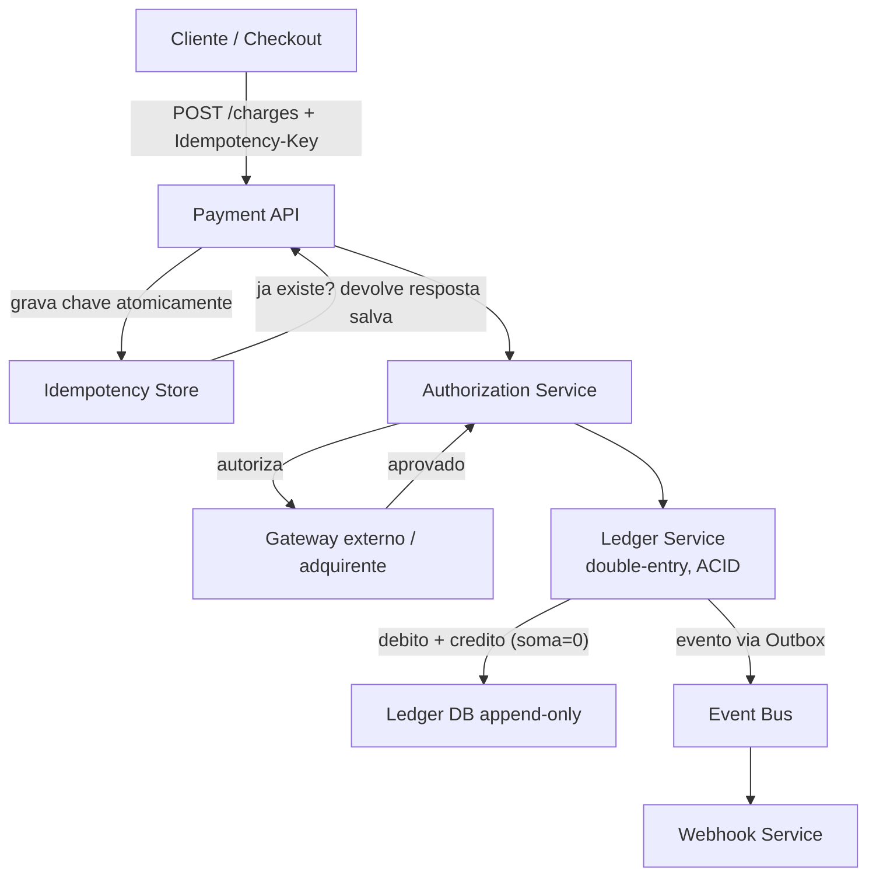
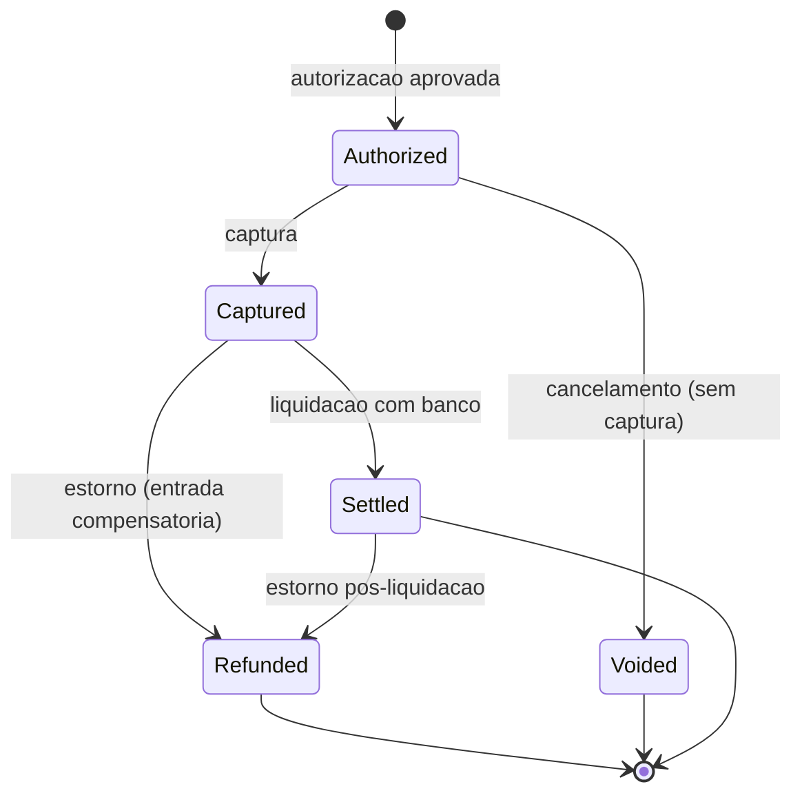
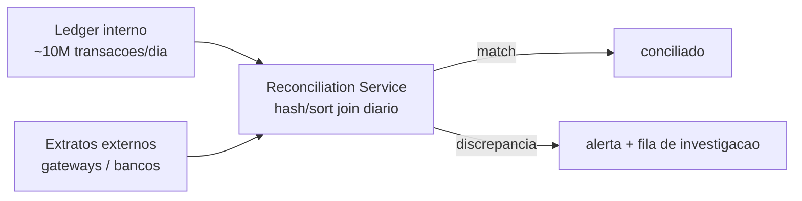

# System Design: Sistema de Pagamentos

> **Bloco:** System Design (estudos de caso) · **Nível:** Avançado · **Tempo de leitura:** ~36 min

## TL;DR

Um sistema de pagamentos é o estudo de caso onde **correção vale mais que disponibilidade**: cobrar o cliente duas vezes, perder uma transação ou mostrar um saldo errado não é um bug que se conserta com um retry silencioso — é um evento regulatório, jurídico e de confiança. Três pilares sustentam a solução. **Idempotência**: toda operação de movimentação de dinheiro carrega uma **chave de idempotência** (gerada pelo cliente); o servidor grava o resultado da primeira execução para aquela chave e, em qualquer reenvio (retry de rede, double-click), **devolve o mesmo resultado** sem executar de novo — é o que torna seguro retentar uma cobrança. **Consistência forte (ledger)**: o estado autoritativo do dinheiro vive num **ledger de partida dobrada** (double-entry), append-only e imutável, onde cada movimento gera duas entradas (um débito e um crédito) que **somam zero**; as escritas precisam ser linearizáveis, porque um saldo incorreto é irrecuperável. **Conciliação (reconciliation)**: como o sistema integra atores externos (gateways, bancos, adquirentes) que podem divergir, há um processo (tipicamente diário) que **casa** os registros internos com os extratos externos e sinaliza discrepâncias antes que virem problema.

A arquitetura separa o **caminho de autorização** (síncrono, baixa latência, fala com o gateway/adquirente) do **ledger** (a fonte da verdade contábil, com consistência forte) e do **processamento assíncrono** (captura, liquidação, conciliação, payout). O CAP aqui é decidido explicitamente a favor de **C**: sob partição, prefere-se pausar/recusar (recuperável) a arriscar inconsistência (irrecuperável). Em entrevista, os pontos profundos são: implementar idempotência atomicamente (sem corrida), o ledger de partida dobrada como invariante (`soma = 0`), a máquina de estados de um pagamento (authorize → capture → settle → refund), o uso de **saga/outbox** para coordenar passos sem 2PC, e o desenho da conciliação.

## Requisitos (funcionais e não-funcionais)

**Funcionais:**

- **Autorizar** um pagamento (verificar fundos/limite junto ao emissor via gateway).
- **Capturar** (efetivar a cobrança autorizada) — pode ser imediata ou posterior.
- **Estornar/reembolsar** (refund total ou parcial).
- **Ledger**: registrar cada movimento de dinheiro de forma auditável e imutável.
- **Saldos e extratos** de cada conta (lojista, cliente, plataforma).
- **Payouts** (repasse aos lojistas) e **liquidação** (settlement) com os bancos.
- **Conciliação** com extratos de gateways/bancos.
- **Webhooks/notificações** de status (pagamento aprovado, falhou, estornado).

**Não-funcionais:**

- **Consistência forte e exatidão**: zero double-charge, zero dinheiro perdido. Correção é o requisito número 1.
- **Idempotência**: toda operação de escrita é segura para retentar.
- **Auditabilidade e imutabilidade**: o ledger é a fonte da verdade; nunca se sobrescreve, só se acrescenta (estorno é uma nova entrada compensatória, não um delete).
- **Durabilidade**: nenhuma transação confirmada pode ser perdida.
- **Disponibilidade alta** no caminho de autorização (mas, sob partição, prioriza correção).
- **Conformidade**: PCI-DSS (dados de cartão), trilha de auditoria, requisitos regulatórios.
- **Latência**: autorização em < 1 s (o usuário espera na tela de checkout).

## Estimativas de capacidade (back-of-the-envelope)

Premissas: gateway de pagamentos de médio-grande porte, **10 milhões de transações/dia**, pico de **Black Friday 5×** a média.

- **Throughput de transações**: 10M/dia ÷ 86.400 ≈ **~115 TPS** de média; pico ~575 TPS. Não é volume gigantesco — o desafio é **correção**, não escala bruta de leitura/escrita.
- **Entradas de ledger**: cada transação gera, ao longo de seu ciclo (autorização, captura, taxa, repasse), múltiplas entradas. Estime **~6 entradas/transação** (débito/crédito de cada movimento). 10M × 6 = **60M entradas/dia** no ledger ÷ 86.400 ≈ **~700 writes/s** de média no ledger. Cada entrada precisa de durabilidade e imutabilidade.
- **Armazenamento do ledger**: 60M entradas/dia × ~300 bytes = **~18 GB/dia**; em um ano, **~6,5 TB/ano**. O ledger é append-only e cresce sem parar — particionamento por tempo e arquivamento (não deleção) são necessários, com retenção de anos por compliance.
- **Chaves de idempotência**: cada transação grava uma chave + resposta. 10M/dia, retidas por 24h (ou mais): **~10M registros vivos** num store rápido (Redis/DynamoDB), ~1 KB cada = ~10 GB. TTL para expirar as antigas.
- **Conciliação**: diariamente, casar ~10M transações internas com os extratos de N gateways/bancos. É um job batch que compara dois conjuntos de ~10M registros — ordenação/hash join, processado fora do caminho crítico.
- **Webhooks**: cada transação dispara ~2–3 notificações (aprovada, capturada, etc.). 25M webhooks/dia, com retry em falha — exige fila durável e idempotência no consumidor.

Conclusão das contas: o volume (115 TPS) é modesto; o que domina o desenho é **garantir que cada uma dessas transações seja exatamente-uma-vez no efeito, auditável e reconciliável** — correção, não throughput.

## Modelo de dados e API (alto nível)

**Ledger de partida dobrada (double-entry), append-only:**

```
accounts(account_id, type, currency, ...)        -- conta do cliente, lojista, plataforma, "external"
ledger_entries(entry_id, transaction_id, account_id, direction, amount, currency, created_at)
                                                  -- direction: DEBIT | CREDIT; imutavel
transactions(transaction_id, idempotency_key, type, status, created_at)
idempotency_keys(key, request_hash, response, status, expires_at)
```

**Invariante central**: para cada `transaction_id`, a soma de todos os créditos é igual à soma de todos os débitos (a soma algébrica é **zero**). Dinheiro não é criado nem destruído — só move entre contas. O saldo de uma conta é a soma de suas entradas (ou um saldo materializado atualizado transacionalmente). Estornar não apaga: cria entradas compensatórias inversas.

**API:**

```
POST /charges
  Idempotency-Key: <uuid-v4>
  body: { amount, currency, source, ... }
  → { charge_id, status }            # idempotente: reenvio devolve o mesmo resultado

POST /charges/{id}/capture           → { status: captured }
POST /charges/{id}/refund  body:{amount} → { refund_id }   # tambem idempotente
GET  /accounts/{id}/balance          → { balance }         # soma do ledger
GET  /accounts/{id}/ledger           → [entradas]          # extrato auditavel
```

A chave de idempotência viaja no **header**; o servidor grava `(key → resultado)` atomicamente. Reenvios com a mesma chave devolvem o resultado salvo — inclusive se a primeira foi um erro 500 (devolve o mesmo 500), para que o cliente não interprete um retry como nova tentativa.

## Arquitetura da solução

- **Payment API / Gateway interno**: recebe a requisição, valida a chave de idempotência (grava atomicamente), e orquestra o fluxo.
- **Idempotency Store**: store rápido e durável (Redis/DynamoDB/Postgres) que mapeia chave → resposta. A gravação da chave e a verificação devem ser **atômicas** (ex.: `INSERT ... ON CONFLICT` / lock) para evitar que dois reenvios concorrentes executem ambos.
- **Authorization Service**: fala com o **gateway externo / adquirente / emissor** (síncrono, baixa latência). É a parte que toca o mundo externo e pode falhar/timeoutar — daí a idempotência ser crucial.
- **Ledger Service**: a **fonte da verdade**. Escreve as entradas double-entry em transação ACID, mantendo o invariante `soma = 0`. Consistência forte/linearizável.
- **Ledger DB**: banco com transações fortes (relacional, ou um datastore append-only/QLDB-like). Particionado por tempo; imutável.
- **Saga/Orchestrator + Outbox**: o ciclo authorize → capture → settle envolve múltiplos serviços e o gateway externo. Coordena-se via **saga** (passos com compensação) em vez de 2PC; eventos são publicados via **Outbox** (gravados na mesma transação do ledger e relayados depois) para garantir consistência entre o ledger e o resto.
- **Reconciliation Service**: job batch que ingere extratos de gateways/bancos e os casa contra o ledger interno, sinalizando discrepâncias (transação no banco mas não no ledger, valores divergentes, etc.).
- **Webhook/Notification Service**: notifica lojistas/clientes de mudanças de status, com retry e idempotência no consumidor.
- **Settlement/Payout Service**: agrega o que é devido a cada lojista e processa repasses em lote.

A separação de planos: **autorização** (síncrona, fala com externo, pode falhar) × **ledger** (fonte da verdade, consistência forte) × **processamento assíncrono** (captura tardia, conciliação, payout, webhooks).

## Diagrama de arquitetura

O primeiro diagrama mostra o fluxo de cobrança com idempotência e ledger; o segundo, a máquina de estados de um pagamento; o terceiro, a conciliação.







## Pontos de escala e gargalos

- **Atomicidade da idempotência**: a verificação-e-gravação da chave precisa ser atômica, senão dois reenvios concorrentes podem ambos passar e executar a cobrança duas vezes — exatamente o que se quer evitar. Use `INSERT ... ON CONFLICT DO NOTHING`, locks ou transações serializáveis. Esse é o ponto mais sutil e mais cobrado.
- **Contenção no ledger / saldo de conta quente**: a conta da plataforma (ou um lojista enorme) recebe muitas entradas concorrentes — vira ponto de contenção na atualização de saldo. Soluções: não materializar saldo (computar pela soma sob demanda, com snapshots periódicos), ou sharding/agregação de contadores, ou serialização por conta.
- **Crescimento do ledger (append-only)**: cresce para sempre (TB/ano). Particionar por tempo, arquivar (nunca deletar — compliance), e usar saldos materializados com checkpoints para não somar bilhões de entradas a cada consulta.
- **Latência de autorização**: o gateway externo é a dependência lenta/instável. Timeout + retry com idempotência + circuit breaker; e a captura tardia (assíncrona) tira da rota crítica o que não precisa ser síncrono.
- **Webhooks com retry**: entrega at-least-once exige idempotência no consumidor (o lojista pode receber a mesma notificação duas vezes). Fila durável + DLQ.
- **Conciliação em escala**: casar dois conjuntos de ~10M registros é um batch pesado, mas fora do caminho crítico — paralelizável, executado em janela de baixa carga.

## Trade-offs e decisões-chave

- **Consistência forte vs disponibilidade (CAP) — decisão a favor de C**: em pagamentos, sob partição, **prefira recusar/pausar** (recuperável: o usuário tenta de novo) a arriscar inconsistência (irrecuperável: saldo errado). É o caso didático de escolher CP. Verbalizar isso explicitamente é o que distingue um bom candidato.
- **Saga vs 2PC (two-phase commit)**: coordenar autorização (externo) + ledger + payout com 2PC é frágil (bloqueia, não escala, o gateway externo não participa de 2PC). A **saga** (passos locais com compensação — ex.: se a captura falha após autorizar, compensa com void) é a abordagem prática. O custo é consistência eventual entre passos e a complexidade das compensações.
- **Outbox para consistência ledger ↔ eventos**: gravar o evento ("pagamento capturado") na **mesma transação** do ledger (tabela outbox) e relayá-lo depois evita o problema de "gravei no ledger mas perdi o evento" (ou vice-versa) — o dual-write. Garante que o que está no ledger e o que foi publicado convergem.
- **Saldo materializado vs computado**: materializar o saldo (atualizar transacionalmente a cada entrada) dá leitura rápida mas cria contenção em contas quentes; computar pela soma das entradas é sempre correto mas caro — o meio-termo são **snapshots periódicos** (saldo até a data X + entradas desde então).
- **Captura imediata vs tardia**: capturar na hora da autorização é simples; capturar depois (ex.: ao enviar o produto) é o modelo de e-commerce e exige reter a autorização e tratar expiração. Trade-off de fluxo de negócio vs complexidade de estado.
- **Estorno como entrada compensatória, não delete**: nunca apagar/editar entradas do ledger. Um estorno é uma **nova** entrada que inverte a anterior, preservando a trilha de auditoria. Imutabilidade é inegociável por compliance.

## Erros comuns em entrevista

- **Idempotência como pensamento tardio.** Sem chave de idempotência, qualquer retry de rede double-charge. Tem de ser o primeiro mecanismo verbalizado, e a atomicidade da gravação da chave é o detalhe que separa quem entende de quem decorou.
- **Não usar ledger de partida dobrada.** Atualizar um campo `balance` diretamente perde auditabilidade e abre brecha para inconsistência. O ledger double-entry com invariante `soma = 0` é o padrão da indústria.
- **Editar/deletar entradas do ledger.** Estorno é entrada compensatória, não delete. Mutabilidade quebra a auditoria e o compliance.
- **Escolher AP no CAP por reflexo.** "Disponibilidade sempre" é errado aqui — pagamentos escolhem C. Não verbalizar isso é falha grave.
- **Tentar 2PC para coordenar tudo.** 2PC com gateway externo não funciona e não escala. Saga + Outbox é a resposta esperada.
- **Esquecer a conciliação.** O sistema fala com atores externos que divergem; sem reconciliation, discrepâncias acumulam silenciosamente. É um requisito de primeira classe.
- **Ignorar idempotência no consumidor de webhooks.** Entrega at-least-once + retry significa duplicatas; o consumidor precisa deduplicar.
- **Não tratar contenção na conta quente.** A conta da plataforma vira gargalo; mencionar snapshots/sharding de saldo mostra profundidade.

## Relação com outros conceitos

- **Idempotência**: o mecanismo central — chave de idempotência, gravação atômica, devolução do resultado salvo. É o pré-requisito de todo retry seguro.
- **ACID e consistência forte**: o ledger exige transações ACID e escritas linearizáveis; é o exemplo definitivo de escolher consistência forte por correção financeira.
- **Saga**: coordenação do ciclo authorize → capture → settle → refund com compensações, sem 2PC.
- **Outbox e CDC**: publicação confiável de eventos de pagamento na mesma transação do ledger; CDC pode alimentar a conciliação e os webhooks a partir do log de mudanças.
- **Padrões de resiliência**: timeout, retry (com idempotência!), circuit breaker no gateway externo; back-pressure na ingestão; DLQ nos webhooks.
- **CAP & consistência**: decisão explícita por CP (consistência sobre disponibilidade) sob partição.
- **Sistema de reservas**: a confirmação de reserva integra o pagamento — o booking é um consumidor do sistema de pagamentos, com a mesma necessidade de idempotência e saga.
- **Cache patterns**: leitura de saldo via snapshot/cache, invalidado/recomputado a partir do ledger — com cuidado para nunca servir saldo stale numa decisão de autorização crítica.

## Referências

- [Designing robust and predictable APIs with idempotency — Stripe Blog](https://stripe.com/blog/idempotency)
- [Idempotent requests — Stripe API Reference](https://docs.stripe.com/api/idempotent_requests)
- [Designing a Payment System — Gergely Orosz (Pragmatic Engineer)](https://newsletter.pragmaticengineer.com/p/designing-a-payment-system)
- [Implementing Stripe-like Idempotency Keys in Postgres — brandur.org](https://brandur.org/idempotency-keys)
- [Building a core banking system with Amazon QLDB — AWS for Industries](https://aws.amazon.com/blogs/industries/building-a-core-banking-system-with-amazon-quantum-ledger-database/)
- [amazon-qldb-double-entry-sample-java — AWS Samples (GitHub)](https://github.com/aws-samples/amazon-qldb-double-entry-sample-java)
- [Design a Payment System: A Complete Guide — System Design Handbook](https://www.systemdesignhandbook.com/guides/design-a-payment-system/)
- [system-design-primer — donnemartin (GitHub)](https://github.com/donnemartin/system-design-primer)
