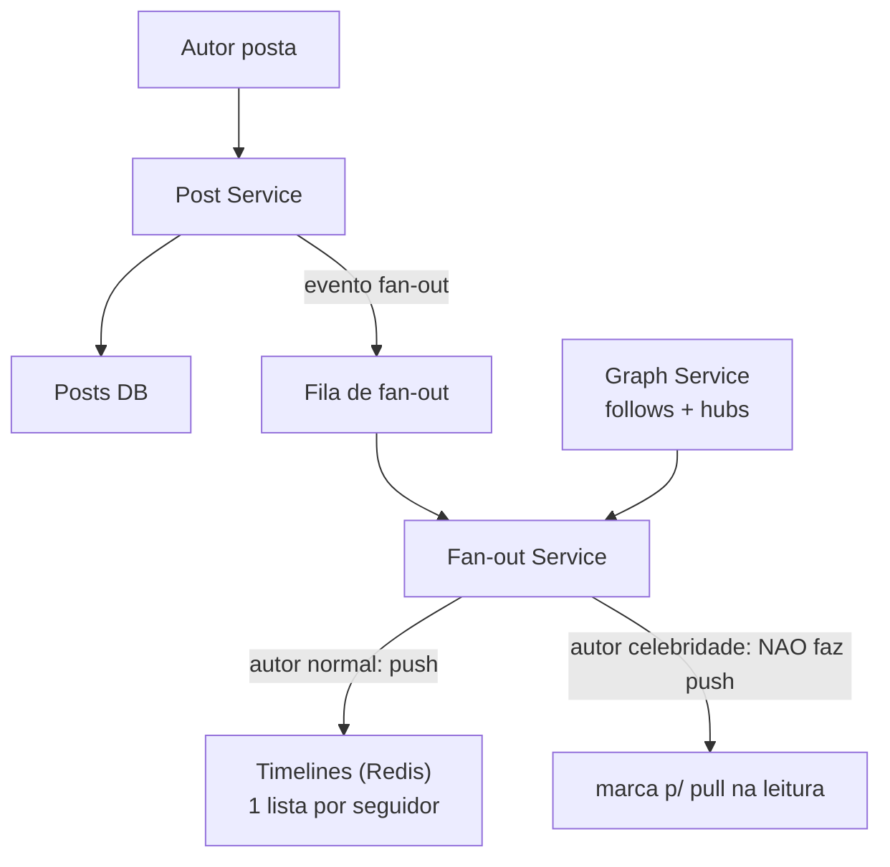
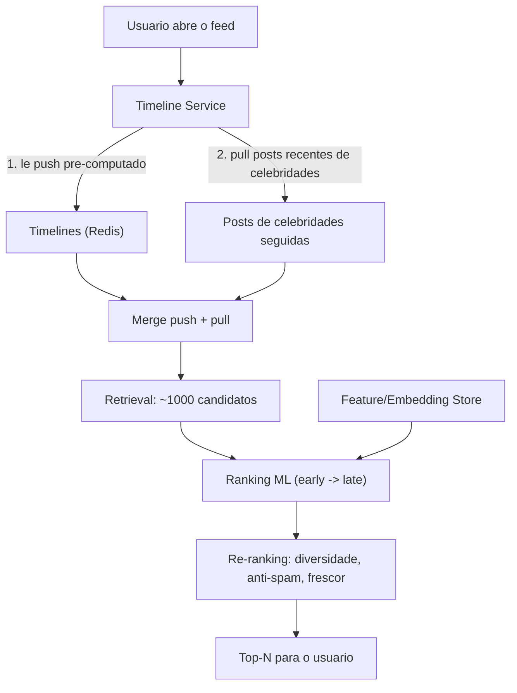

# System Design: Newsfeed — Ranking e Recomendação

> **Bloco:** System Design (estudos de caso) · **Nível:** Avançado · **Tempo de leitura:** ~34 min

## TL;DR

Um newsfeed (Twitter/X, Facebook, Instagram) tem dois problemas entrelaçados. O primeiro é de **distribuição**: quando alguém posta, como entregar isso aos seguidores? A decisão clássica é **fan-out on write (push)** vs **fan-out on read (pull)**. No push, ao postar, o sistema escreve a referência do post na timeline pré-computada de cada seguidor — **leitura barata, escrita cara**; ótimo para os 99% de usuários com poucos seguidores. No pull, a timeline é montada na hora da leitura, buscando os posts de quem o usuário segue — **leitura cara, escrita barata**; melhor para usuários inativos e para o **"celebrity problem"** (uma celebridade com 100M de seguidores faria 100M de escritas por post). A solução real é **híbrida**: push para usuários normais, pull para celebridades, e merge na leitura.

O segundo problema é de **ranking/recomendação**: a timeline moderna não é cronológica — é **ordenada por relevância** por um modelo de ML. O padrão é um **funil**: **retrieval** (recuperar centenas a milhares de candidatos baratos — de quem você segue + recomendados), **ranking** (um modelo pesado re-pontua e ordena os top-N), e **re-ranking** (regras de negócio, diversidade, anti-spam, frescor). Em entrevista, os pontos profundos são: a escolha e o híbrido de fan-out, o tratamento da celebridade, o funil retrieval → rank → re-rank, a infraestrutura de feature/embedding para o ML, e a tensão entre frescor (real-time) e custo de pré-computação.

## Requisitos (funcionais e não-funcionais)

**Funcionais:**

- **Publicar** um post (texto, mídia).
- **Seguir/deixar de seguir** usuários (o grafo social).
- **Gerar a timeline** de um usuário: os posts relevantes de quem ele segue + recomendados.
- **Ranquear** a timeline por relevância (não só cronológico).
- **Interagir** (like, comment, share) — sinais que alimentam o ranking.
- **Frescor**: posts recentes/relevantes aparecem rápido.

**Não-funcionais:**

- **Baixa latência de leitura**: a timeline é a tela inicial; deve carregar em < 200 ms. Leitura é o caminho dominante.
- **Altíssima razão leitura:escrita**: usuários leem muito mais do que postam (centenas:1).
- **Escala**: bilhões de usuários, centenas de milhões de posts/dia, grafo social com hubs (celebridades).
- **Disponibilidade alta**; **eventual consistency aceitável** (um post aparecer alguns segundos depois é tolerável — não é pagamento).
- **Relevância/qualidade**: o ranking impacta diretamente engajamento; é um sistema de ML em produção.

## Estimativas de capacidade (back-of-the-envelope)

Premissas: **2 bilhões de usuários**, **500 milhões DAU**, cada DAU **lê a timeline 10×/dia** e **posta 0,2×/dia** (1 post a cada 5 dias). Seguidores médios: **200**; celebridades: até **100M**.

- **Leituras de timeline**: 500M × 10 = 5 × 10⁹ leituras/dia ÷ 86.400 ≈ **~58 mil QPS** de média, pico ~3× → **~175 mil QPS**. A leitura domina — daí a obsessão por timeline pré-computada (push).
- **Posts (escritas)**: 500M × 0,2 = 100M posts/dia ÷ 86.400 ≈ **~1.150 posts/s** de média, pico ~3.500/s.
- **Fan-out de escritas (push)**: cada post × seguidores médios (200) = 100M × 200 = **2 × 10¹⁰ escritas de fan-out/dia** ÷ 86.400 ≈ **~230 mil escritas/s** na timeline. Esse é o custo do push — alto, mas em escritas baratas (append numa lista por seguidor). Para celebridades, esse número explode (1 post × 100M = 100M escritas) — daí o pull para elas.
- **Custo da celebridade**: se 1.000 celebridades com 50M de seguidores médios postam 5×/dia: 1.000 × 5 × 50M = **2,5 × 10¹¹ escritas/dia** só de celebridades se usássemos push — ~5× o fan-out de todos os usuários normais juntos. Inviável. Por isso pull/merge para elas.
- **Armazenamento de timeline (push)**: cada timeline guarda ~800 referências (IDs de post, ~16 bytes). 500M usuários × 800 × 16 B = **~6,4 TB** de timelines pré-computadas em memória/Redis — caro, mas justifica o cache só dos usuários ativos.
- **Funil de ranking**: retrieval traz ~500–1.000 candidatos; o ranker (modelo) pontua esses ~1.000 por requisição. 175k QPS × 1.000 = **175M inferências/s** no pico — daí ranking em camadas (modelo leve cedo, pesado só no top).

Conclusão: leitura domina (175k QPS), o push pré-computa para baratear a leitura, a celebridade quebra o push (vira pull), e o ranking é um funil para tornar viável pontuar candidatos em escala.

## Modelo de dados e API (alto nível)

```
users(user_id, ...)
follows(follower_id, followee_id)              -- o grafo social (com hubs/celebridades)
posts(post_id, author_id, content, media, created_at)
timelines(user_id, [post_id ordenado])         -- timeline pre-computada (push), em Redis sorted set
interactions(user_id, post_id, type, ts)       -- sinais para o ranking
```

API:

```
POST /posts          body: {content}     → {post_id}   # dispara fan-out (push) p/ seguidores nao-celebridade
GET  /timeline?cursor → [posts ranqueados]              # merge(push pre-computado, pull de celebridades) + ranking
POST /follow         body: {followee}
POST /posts/{id}/like
```

O `GET /timeline` faz: (1) lê a timeline pré-computada (push) do Redis; (2) busca em tempo real os posts recentes das celebridades que o usuário segue (pull); (3) faz o **merge** dos dois; (4) passa pelo **funil de ranking** (retrieval já feito, agora rank + re-rank); (5) devolve os top-N.

## Arquitetura da solução

- **Post Service**: recebe o post, persiste, e publica um evento de fan-out na fila.
- **Fan-out Service**: consome o evento; para autores **não-celebridade**, escreve a referência do post nas timelines (Redis sorted set) de cada seguidor (push). Para **celebridades**, **não** faz fan-out (marca o post; será puxado na leitura).
- **Graph Service**: o grafo social (follows); responde "quem segue X" e "quem X segue". Hubs (celebridades) tratados à parte.
- **Timeline Service (leitura)**: monta a timeline = merge(timeline pré-computada do push + pull dos posts recentes das celebridades seguidas), depois aplica ranking.
- **Ranking/Recommendation Service**: o funil ML:
  - **Retrieval**: candidatos baratos (de quem segue + recomendados via embeddings/similaridade). Reduz o universo a ~centenas/milhares.
  - **Ranking**: modelo (gradient boosting / rede neural) re-pontua candidatos usando features (afinidade autor-leitor, frescor, engajamento previsto). Em camadas: early-stage leve → late-stage pesado.
  - **Re-ranking**: diversidade (não repetir o mesmo autor), anti-spam, frescor, regras de negócio/políticas.
- **Feature Store / Embedding Service**: serve features e embeddings de usuários/posts para o ranking, com baixa latência (online feature store).
- **Cache (Redis)**: timelines quentes e posts populares.
- **Storage**: posts em banco distribuído (Cassandra-like); timelines em Redis (sorted sets).

## Diagrama de arquitetura

O primeiro diagrama mostra o caminho de escrita com fan-out híbrido; o segundo, o caminho de leitura com merge e funil de ranking.





## Pontos de escala e gargalos

- **Fan-out de escrita (push)**: ~230k escritas/s no caso normal. São escritas baratas (append em lista), mas em volume — Redis sorted sets, sharded por `user_id`. O custo é aceitável porque baixa a leitura (a tela mais acessada).
- **Celebrity problem**: o push para 100M seguidores num post é inviável. Solução: **não** fazer push para celebridades; puxar seus posts na leitura e fazer merge. O limiar (ex.: >10k seguidores = celebridade) é um parâmetro de tuning. Posts de celebridades são altamente cacheáveis (todo mundo puxa os mesmos).
- **Armazenamento de timelines**: pré-computar para 2B usuários é caro; só se pré-computa para **usuários ativos** (push lazy: gerar a timeline de inativos sob demanda quando voltam — fan-out on read para eles).
- **Ranking em escala**: pontuar ~1.000 candidatos × 175k QPS exige o funil (modelo leve filtra cedo, pesado só no topo) e feature store de baixa latência. O ranking é o maior consumidor de compute.
- **Frescor vs custo**: timeline pré-computada pode ficar stale; eventos recentes (post agora) precisam aparecer rápido — daí o pull complementar e invalidação. Equilíbrio entre pré-computar (barato na leitura) e tempo real (fresco mas caro).
- **Hot posts (viral)**: um post que viraliza é puxado por milhões — cache agressivo do post e dos seus contadores (likes), que são eventualmente consistentes/aproximados.

## Trade-offs e decisões-chave

- **Push vs pull vs híbrido**: push baixa a latência de leitura (timeline pronta) ao custo de escrita pesada; pull baliza escrita ao custo de leitura cara. O **híbrido** (push para normais, pull para celebridades, merge na leitura) é a resposta canônica — combina o melhor dos dois para a distribuição bimodal de seguidores.
- **Cronológico vs ranqueado por ML**: feed cronológico é simples e previsível; ranqueado maximiza engajamento mas adiciona um sistema de ML inteiro (features, modelos, treino, viés/feedback loop). Quase todas as plataformas grandes ranqueiam — o trade-off é complexidade e questões de qualidade/ética (bolhas, engajamento tóxico).
- **Consistência eventual**: aceitável aqui (um post aparecer 5 s depois não é problema) — escolhe-se disponibilidade/latência sobre consistência (AP). Contadores (likes/views) são aproximados/agregados assíncronamente.
- **Push lazy (só ativos)**: pré-computar timelines de todos os 2B usuários desperdiça memória nos inativos. Pré-computar só ativos e gerar sob demanda para quem volta economiza muito — custo: primeira leitura mais lenta após inatividade.
- **Retrieval: follow-graph vs recomendação**: a timeline mistura quem você segue (retrieval do grafo) com conteúdo recomendado (retrieval por embedding/similaridade — "para você"). O peso entre os dois é decisão de produto e impacta a infra de recomendação.
- **Limiar de celebridade**: o número que separa push de pull (ex.: 10k seguidores) é um trade-off — baixo demais faz muitos usuários virarem pull (leitura cara); alto demais deixa push caro para usuários populares.

## Erros comuns em entrevista

- **Escolher só push ou só pull.** Sem o híbrido, ou a celebridade quebra o push, ou a leitura de todos fica cara. O entrevistador quer ver o tratamento da celebridade.
- **Ignorar o celebrity problem.** É o ponto que mais distingue candidatos. Push para 100M seguidores por post é o erro clássico.
- **Pré-computar timeline de todos.** Desperdiça memória nos inativos; pré-compute só ativos (push lazy).
- **Tratar ranking como "ordena por data".** A timeline moderna é ML; não mencionar o funil retrieval → rank → re-rank ignora metade do problema.
- **Incrementar contadores transacionalmente.** Likes/views são escrita massiva; agregue assíncrono, aceite aproximação.
- **Escolher consistência forte.** Aqui é AP — eventual consistency é aceitável e necessária para a latência/escala. Forçar C é over-engineering.
- **Não dimensionar o fan-out.** Sem os números (230k escritas/s normal, explosão na celebridade), não se justifica o híbrido nem o limiar.

## Relação com outros conceitos

- **Cache patterns / caching multicamada**: timelines pré-computadas em Redis, posts de celebridades altamente cacheáveis, contadores em cache — leitura dominante servida de cache.
- **Stream processing**: fan-out, agregação de contadores (likes/views) e sinais de ranking são processados como streams (Kafka + processador), eventualmente consistentes.
- **Mensageria / filas (Outbox)**: o evento "novo post" dispara o fan-out via fila; Outbox garante que o post persistido e o evento de fan-out convergem.
- **Consistent Hashing**: sharding de timelines e do grafo social por `user_id`.
- **Estruturas probabilísticas**: deduplicação de "já vi este post" (não mostrar repetido) pode usar Bloom filter; contagem de itens populares relaciona-se com count-min sketch / top-K.
- **Streaming de vídeo**: o subsistema de recomendação da Netflix/YouTube é o mesmo problema de ranking/funil aplicado a vídeo.
- **Top-K / heavy hitters**: identificar posts/hashtags em alta (trending) usa as mesmas estruturas do estudo de caso de top-K.

## Referências

- [Design A News Feed System — ByteByteGo](https://bytebytego.com/courses/system-design-interview/design-a-news-feed-system)
- [system-design-primer: Twitter (timeline e busca) — donnemartin (GitHub)](https://github.com/donnemartin/system-design-primer/blob/master/solutions/system_design/twitter/README.md)
- [How to Design a Social Media News Feed — DesignGurus](https://www.designgurus.io/blog/design-social-media-news-feed)
- [News Feed Architecture: Fan-Out on Write vs Read — CalibreOS](https://www.calibreos.com/learn/hld-news-feed)
- [Baseline System Design — Facebook Newsfeed and "Fanout" (Medium)](https://corgicorporation.medium.com/baseline-system-design-facebook-newsfeed-and-fanout-e95311d52f65)
- [System Design Interview Vol.1 Ch.11 — Design a News Feed (Noah Tigner)](https://noahtigner.com/articles/system-design-interview-volume-1-chapter-11/)
