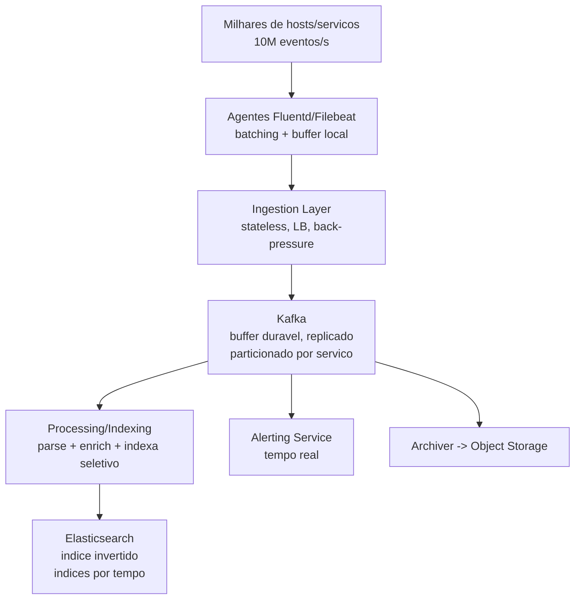
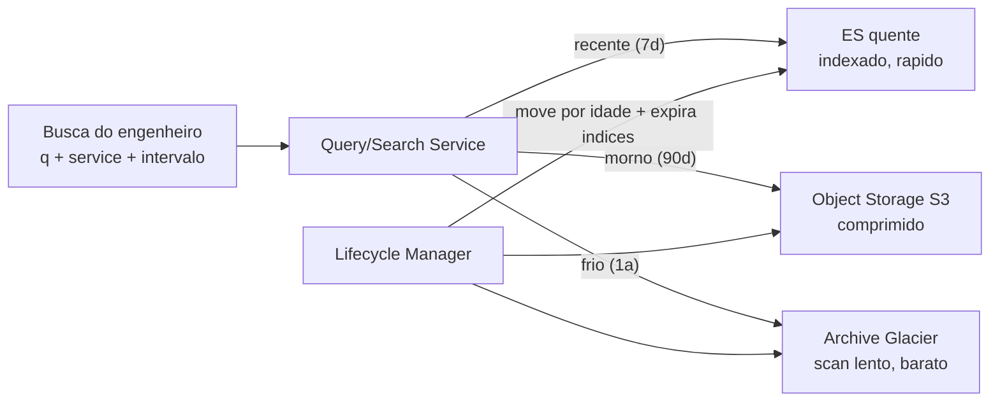

# System Design: Sistema de Logs Distribuído

> **Bloco:** System Design (estudos de caso) · **Nível:** Avançado · **Tempo de leitura:** ~32 min

## TL;DR

Um sistema de logs distribuído (estilo ELK/Splunk/Datadog/Loki) resolve o problema de **ingerir um firehose de eventos de milhares de serviços, torná-los pesquisáveis em segundos, e guardá-los pelo tempo certo sem falir em armazenamento**. O fluxo canônico tem quatro estágios. **Ingestão**: agentes (Fluentd/Filebeat) coletam logs das máquinas e despejam num **buffer durável** — quase sempre **Kafka** — que desacopla a produção (picos imprevisíveis) do processamento e absorve back-pressure. **Processamento/indexação**: consumidores leem do Kafka, parseiam/enriquecem, e gravam num motor de busca com **índice invertido** (Elasticsearch) para busca full-text rápida. **Busca**: consultas full-text e por campos (serviço, nível, timestamp, trace_id) sobre o índice invertido, particionado por tempo. **Retenção/tiering**: logs quentes (recentes) ficam em armazenamento rápido/indexado; frios migram para object storage barato (S3) e depois para arquivo (Glacier), com expiração por política.

O insight de fundo é que logs são **escrita-pesada, append-only, com leitura concentrada nos dados recentes** — e o volume é brutal (TBs/dia). A arquitetura é dominada pela necessidade de: um buffer que não perca dados sob pico (Kafka, com replicação), indexação cara que precisa ser dosada (nem todo campo merece índice), e tiering agressivo porque indexar e guardar tudo para sempre é financeiramente impossível. Em entrevista, os pontos profundos são: por que Kafka como buffer, o índice invertido e seu custo, o sharding por tempo, o trade-off indexar-tudo vs amostrar, e a estratégia de retenção em camadas.

## Requisitos (funcionais e não-funcionais)

**Funcionais:**

- **Ingerir** logs de milhares de serviços/máquinas (estruturados e não).
- **Buscar** por full-text e por campos (serviço, nível, host, timestamp, trace_id).
- **Filtrar por intervalo de tempo** (a dimensão dominante das consultas).
- **Agregar** (contagens, taxas de erro, dashboards, alertas).
- **Reter** por políticas (ex.: 7 dias quente, 90 dias morno, 1 ano arquivado).
- **Correlacionar** com traces/métricas (observabilidade unificada).

**Não-funcionais:**

- **Throughput de ingestão altíssimo**: TBs/dia, com picos (incidentes geram tempestades de logs).
- **Baixa latência de busca** nos dados recentes (segundos).
- **Durabilidade sob pico**: não perder logs quando a ingestão explode (incidente é justamente quando você mais precisa deles).
- **Custo controlado**: indexar e guardar tudo é inviável; tiering e retenção são requisitos de primeira classe.
- **Eventual consistency aceitável**: um log aparecer 1–2 s depois na busca é ok (não é transacional).
- **Escala horizontal** em ingestão, indexação e armazenamento.

## Estimativas de capacidade (back-of-the-envelope)

Premissas: **10.000 serviços/hosts**, cada um gerando **1.000 linhas de log/s** em média, cada linha **~500 bytes**.

- **Taxa de eventos**: 10.000 × 1.000 = **10 milhões de eventos/s**.
- **Volume bruto**: 10M/s × 500 B = **5 GB/s = 18 TB/hora = ~430 TB/dia**. (Com compressão típica de 5–10× no armazenamento, ~50–85 TB/dia em disco — ainda enorme.)
- **Pico de incidente**: durante um incidente, a taxa pode subir 5–10× (loops de erro, retries) → **~50 GB/s**. O buffer (Kafka) precisa absorver isso sem perder dados — daí dimensionar partições e replicação com folga.
- **Kafka**: 5 GB/s de média; com replicação 3× = 15 GB/s de escrita no cluster. Retenção curta no Kafka (ex.: 24–72 h como buffer) = 5 GB/s × 86.400 × 3 dias ≈ **~1,3 PB** de buffer.
- **Armazenamento indexado (quente, 7 dias)**: 430 TB/dia × 7 = ~3 PB brutos; o índice invertido do Elasticsearch adiciona overhead (índice + doc + replica) tipicamente **~1,5–2× o tamanho dos dados** → **~5–6 PB** de disco quente para 7 dias. É caro — daí indexar seletivamente.
- **Tiering (morno + frio)**: 90 dias em object storage comprimido (sem índice, ou índice leve) + 1 ano em arquivo. 430 TB/dia × 90 ≈ 39 PB mornos comprimidos (~5 PB), e o arquivo é ainda mais barato. Sem tiering, guardar 1 ano indexado seria ~150 PB indexados — financeiramente impossível.
- **QPS de busca**: muito menor que a ingestão. Talvez **alguns milhares de buscas/dia** de engenheiros + dashboards/alertas periódicos. A busca é leve em QPS mas pesada por consulta (varre janelas de tempo). O sistema é **write-heavy, read-light**.

Conclusão das contas: o gargalo é a **ingestão (5–50 GB/s)** e o **custo de indexar/armazenar (PBs)**. Kafka absorve o pico; a indexação seletiva e o tiering controlam o custo. A busca é secundária em volume mas define a usabilidade.

## Modelo de dados e API (alto nível)

**Documento de log (no índice):**

```
{ timestamp, service, host, level, message, trace_id, fields..., raw }
```

Indexado por: `timestamp` (sharding e filtro dominante), `service`, `level`, `trace_id` (campos de baixa cardinalidade úteis); `message` recebe índice invertido full-text. Campos de altíssima cardinalidade podem não ser indexados (custo).

**Índices particionados por tempo**: um índice por dia (ou hora) por serviço — `logs-svc-2026-05-29`. Isso permite **deletar/arquivar um índice inteiro** ao expirar (barato) e limitar a busca aos índices do intervalo consultado.

**API:**

```
POST /ingest        body: <batch de eventos>             # dos agentes -> Kafka
GET  /search?q=&service=&level=&from=&to=                → [logs]   # full-text + filtros + intervalo
GET  /aggregate?metric=error_rate&service=&interval=     → [series] # dashboards/alertas
```

O agente nas máquinas (Fluentd/Filebeat) faz coleta, batching e envio ao endpoint de ingestão, que escreve no Kafka. Buscas e agregações vão ao motor de índice.

## Arquitetura da solução

- **Agentes de coleta (Fluentd / Filebeat)**: rodam nas máquinas, leem arquivos/streams de log, fazem batching e enviam. Resilientes (buffer local em disco se a ingestão estiver indisponível).
- **Ingestion Layer**: stateless, horizontalmente escalável, atrás de load balancer; recebe os batches e escreve no Kafka. Aplica back-pressure quando necessário.
- **Kafka (buffer durável)**: o coração da resiliência. Desacopla produção de consumo, absorve picos, replica para durabilidade, e particiona por `service`/host para paralelismo. Permite reprocessar (consumir de novo) e ter múltiplos consumidores (indexação, alertas, arquivamento).
- **Processing / Indexing Service**: consome do Kafka, parseia (extrai campos), enriquece (geo, metadata), e indexa no Elasticsearch. Decide o que indexar (seletivo).
- **Elasticsearch (índice invertido)**: motor de busca distribuído, índices particionados por tempo, sharded e replicado. Serve busca full-text e agregações nos dados quentes.
- **Object Storage (S3) + Archive (Glacier)**: tiers morno e frio. Logs comprimidos, sem índice pesado (ou índice leve), para retenção barata de longo prazo.
- **Query/Search Service**: roteia consultas aos índices/tiers certos (recente → ES; antigo → object storage com scan); agrega.
- **Alerting Service**: consome do Kafka (ou consulta agregações) para disparar alertas em tempo real (ex.: taxa de erro > X).
- **Retention/Lifecycle Manager**: aplica políticas — move índices quentes → mornos → frios → expiração, deletando índices inteiros por tempo.

## Diagrama de arquitetura

O primeiro diagrama mostra o pipeline de ingestão e indexação; o segundo, o tiering de retenção e a busca.





## Pontos de escala e gargalos

- **Ingestão sob pico (incidente)**: justo quando a taxa explode (5–50 GB/s) é quando você mais precisa dos logs. Kafka com partições e replicação suficientes absorve; os agentes têm buffer local de fallback; o ingestion aplica back-pressure em vez de derrubar.
- **Custo da indexação**: o índice invertido é caro (CPU para indexar, disco para o índice, ~1,5–2× os dados). **Não indexar tudo**: indexar campos úteis (serviço, nível, trace_id, full-text da mensagem) e deixar campos de altíssima cardinalidade fora. Alguns sistemas (Loki) indexam **só metadados/labels** e fazem grep no conteúdo — trade-off de custo de índice vs custo de busca.
- **Sharding por tempo**: índices por dia/hora permitem (a) limitar a busca ao intervalo, (b) deletar/arquivar índices inteiros barato ao expirar, (c) balancear escrita no índice corrente. Índice corrente (hoje) é o "hot shard" de escrita.
- **Retenção e tiering**: guardar tudo indexado para sempre é inviável (PBs). Quente (ES, 7d) → morno (S3 comprimido, 90d) → frio (Glacier, 1a) → expira. A busca em tiers frios é lenta (scan) mas raríssima.
- **Hot partition / serviço barulhento**: um serviço com loop de erro pode saturar uma partição. Particionar com cuidado, aplicar rate limit por serviço, e amostragem (sampling) de logs de altíssimo volume.
- **Busca pesada**: uma consulta full-text sem filtro de tempo varre tudo — caro. Forçar/encorajar filtro de intervalo; cachear agregações de dashboards.

## Trade-offs e decisões-chave

- **Kafka como buffer (vs ingestão direta no ES)**: escrever direto no Elasticsearch acopla a ingestão à saúde do índice — um pico ou um ES lento derruba a coleta e perde logs. **Kafka desacopla**: absorve o pico, permite reprocessar, alimenta múltiplos consumidores (indexação, alertas, arquivo). É a decisão arquitetural central. O custo é a operação de um cluster Kafka grande.
- **Indexar tudo vs indexar seletivamente (ES vs Loki)**: indexar tudo dá busca full-text poderosa mas custo de índice altíssimo (ES). Indexar só labels/metadados e fazer grep no conteúdo (Loki) corta drasticamente o custo de armazenamento ao custo de buscas full-text mais lentas. Escolha pelo perfil de uso (quanta busca full-text vs filtro por label).
- **Push vs pull de coleta**: agentes push (Fluentd) enviam ativamente; pull (Prometheus-style) raspa endpoints. Para logs, push é o padrão (logs são gerados, não expostos como métrica).
- **Retenção: quanto e em que tier**: mais retenção indexada = mais custo. A política (7d/90d/1a) equilibra utilidade (depurar incidentes antigos) vs custo. Compliance pode forçar retenção longa (em arquivo barato, não indexado).
- **Consistência eventual**: aceita-se latência de segundos entre o log ser gerado e ficar pesquisável. Forçar busca em tempo real estrito não vale o custo. Logs são best-effort, não transacionais (perder 0,001% num pico extremo é tolerável; a maioria dos sistemas mira em não perder, mas não garante exactly-once).
- **Sampling**: para logs de altíssimo volume e baixo valor (debug verboso), amostrar (guardar 1 em N) corta custo. Mantém-se 100% dos erros/warnings. Trade-off de completude vs custo.

## Erros comuns em entrevista

- **Escrever direto no Elasticsearch sem buffer.** Sem Kafka, um pico de ingestão (justamente durante um incidente) sobrecarrega o ES e perde logs. O buffer durável é a primeira decisão a verbalizar.
- **Indexar todos os campos.** Ignora o custo brutal do índice invertido (PBs). Indexação seletiva é essencial.
- **Esquecer retenção/tiering.** Propor guardar tudo indexado para sempre é financeiramente impossível. Tiering quente/morno/frio é requisito de primeira classe.
- **Não particionar índices por tempo.** Sem sharding temporal, expirar dados antigos vira delete linha-a-linha (caro) em vez de dropar um índice inteiro; e a busca varre tudo.
- **Tratar como read-heavy.** Logs são write-heavy, read-light — otimizar para QPS de leitura é o foco errado; o gargalo é ingestão e custo de armazenamento.
- **Ignorar o serviço barulhento / hot partition.** Um loop de erro pode saturar uma partição; rate limit e sampling por serviço são necessários.
- **Não dimensionar.** Sem os números (5–50 GB/s, PBs), não se justifica Kafka, indexação seletiva nem tiering.

## Relação com outros conceitos

- **Stream processing**: o pipeline ingestão → Kafka → processamento é stream processing puro; alertas em tempo real consomem o stream. Kafka como log distribuído é o exemplo canônico.
- **Mensageria / filas (Kafka)**: Kafka como buffer durável, particionado, com múltiplos consumidores e replay — o coração da resiliência da ingestão.
- **Índice invertido / estruturas de busca**: o Elasticsearch e seu índice invertido são o motor de busca full-text; relaciona-se com estruturas de dados de indexação.
- **Cache patterns / tiering multicamada**: o tiering quente/morno/frio é caching/armazenamento multicamada por idade do dado — exatamente análogo ao tiering de outros estudos de caso.
- **Estruturas probabilísticas**: para "este erro já foi visto?" ou estimar volume por serviço sem contar tudo, usam-se Bloom filters e count-min sketch; identificar os serviços/erros mais barulhentos é um problema de **top-K / heavy hitters**.
- **Observabilidade**: logs são um dos três pilares (logs/métricas/traces); correlação via `trace_id` conecta com tracing distribuído.
- **Back-pressure / resiliência**: a ingestão aplica back-pressure e os agentes têm buffer local — padrões de resiliência aplicados à coleta.

## Referências

- [Designing a Distributed Logging Architecture (Fluentd, Kafka, Logstash, Elasticsearch) — Medium](https://shyampradhan.medium.com/designing-a-distributed-logging-architecture-using-fluentd-kafka-logstash-and-elasticsearch-61defae34e77)
- [Design a Distributed Logging System: A Complete Guide — System Design Handbook](https://www.systemdesignhandbook.com/guides/design-a-distributed-logging-system/)
- [Kafka & Elasticsearch: Ingesting data to Elasticsearch via Kafka — Elastic Search Labs](https://www.elastic.co/search-labs/blog/elasticsearch-apache-kafka-ingest-data)
- [Apache Kafka for log aggregation — Redpanda](https://www.redpanda.com/guides/kafka-use-cases-log-aggregation)
- [System Design Interview: Distributed Log Aggregation System — Medium](https://medium.com/@kuldeeparyadotcom/system-design-interview-designing-a-distributed-log-aggregation-system-725f96180d93)
- [system-design-primer — donnemartin (GitHub)](https://github.com/donnemartin/system-design-primer)
