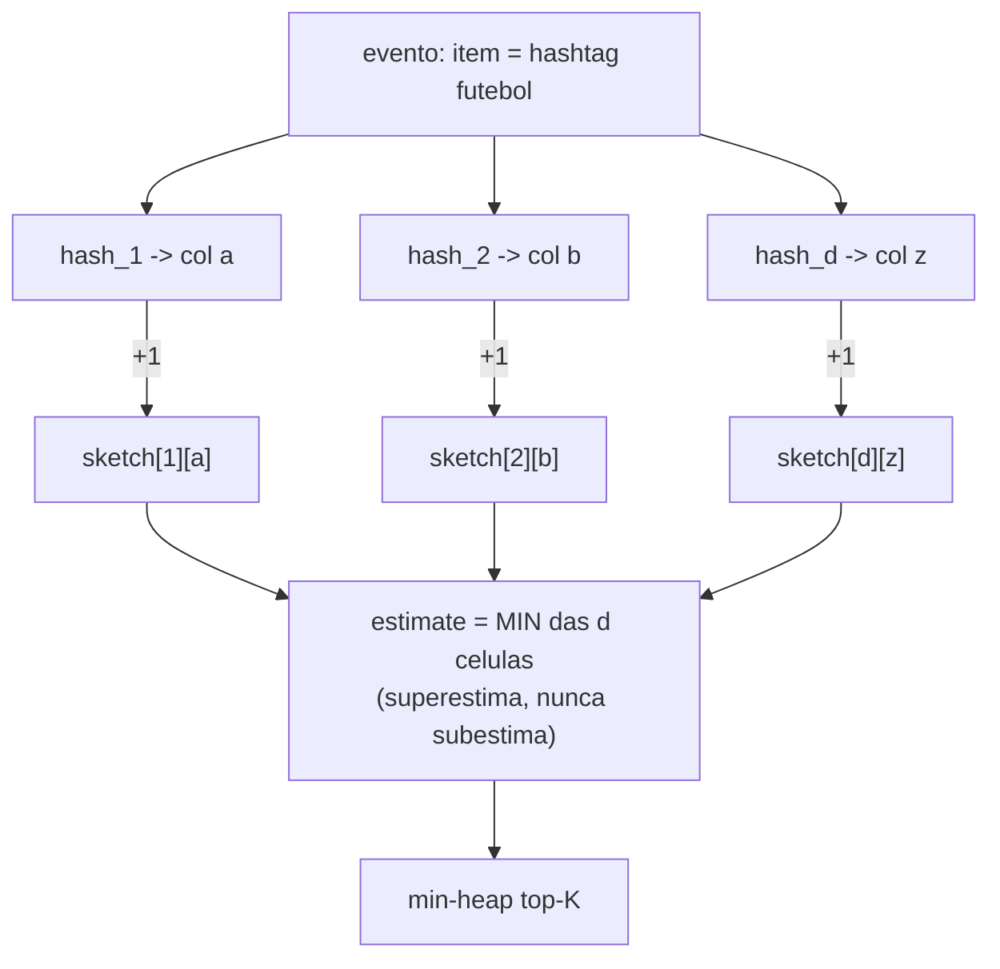
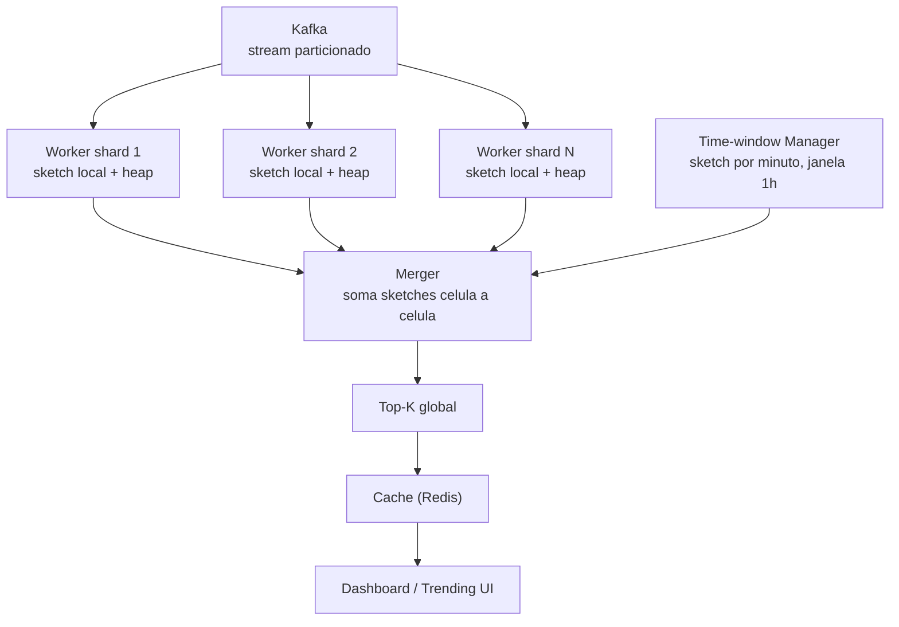

# System Design: Top-K Trending / Heavy Hitters (Count-Min Sketch)

> **Bloco:** System Design (estudos de caso) · **Nível:** Avançado · **Tempo de leitura:** ~31 min

## TL;DR

"Quais são os K itens mais frequentes num stream gigantesco?" — os trending topics do Twitter, os produtos mais vendidos, os IPs que mais batem no servidor (DDoS), as queries de busca mais populares. O problema, chamado **top-K** ou **heavy hitters**, parece trivial (conte tudo, ordene, pegue os K primeiros), mas em escala de bilhões de eventos com **milhões de itens distintos**, contar exatamente cada item exige memória proporcional ao número de chaves distintas — inviável. A solução elegante é trocar **exatidão por espaço sublinear** usando uma estrutura probabilística: o **Count-Min Sketch** (Cormode & Muthukrishnan, 2004).

O Count-Min Sketch é uma matriz de contadores `d × w` com `d` funções de hash independentes. Para **incrementar** a contagem de um item, aplica-se as `d` hashes e incrementa-se uma célula em cada linha. Para **consultar** a frequência estimada, pega-se o **mínimo** das `d` células do item (daí "count-MIN"). Como diferentes itens colidem nas mesmas células, a estimativa **superestima** (nunca subestima) — e o mínimo reduz o erro de colisão. Combinando o sketch (para estimar frequências em espaço fixo) com um **min-heap de tamanho K** (para manter os candidatos mais frequentes), resolve-se top-K num único passe, com erro controlado por parâmetros (`w`, `d`). É o irmão do **Bloom filter** na família de estruturas probabilísticas: troca precisão por espaço, errando só num sentido. Em entrevista, os pontos profundos são: por que contar exato não escala, a mecânica do sketch (overestimate, por que o min), o dimensionamento de `w`/`d` por `ε` e `δ`, a combinação com heap, e a arquitetura distribuída (sketches por shard, mergeáveis, com janelas de tempo).

## Requisitos (funcionais e não-funcionais)

**Funcionais:**

- **Top-K**: retornar os K itens mais frequentes de um stream (ex.: top-10 hashtags da última hora).
- **Frequência estimada** de um item específico (point query).
- **Janelas de tempo**: trending da última hora/dia (não acumulado eterno) — frescor.
- **Atualização em tempo real**: o ranking reflete eventos recentes em segundos.
- **Múltiplas dimensões** (opcional): top-K por região, por categoria.

**Não-funcionais:**

- **Espaço sublinear**: não dá para guardar um contador exato por item distinto (milhões/bilhões).
- **Throughput de ingestão altíssimo**: milhões de eventos/s.
- **Baixa latência de consulta**: o top-K precisa estar disponível em ms (alimenta UI/dashboards).
- **Erro controlado e aceitável**: aproximação é ok para trending (não é contabilidade); o erro é parametrizável.
- **Escala horizontal**: sharding do stream com sketches mergeáveis.
- **Eventual consistency**: o ranking pode ter segundos de atraso.

## Estimativas de capacidade (back-of-the-envelope)

Premissas: stream de **1 milhão de eventos/s** (ex.: tweets/cliques), **100 milhões de itens distintos** possíveis (hashtags, URLs, termos), quer-se **top-100** da última hora com erro de ~0,1%.

**Contagem exata (o que NÃO escala):**

- 100M itens distintos × (16 bytes chave + 8 bytes contador) = **~2,4 GB** só de contadores — e isso por janela, por dimensão. Com janelas deslizantes e múltiplas dimensões (região, categoria), multiplica. Distribuído entre shards, ainda exige um hashmap gigante e o merge é caro. A cauda longa (a maioria dos 100M itens aparece pouquíssimo) desperdiça memória.

**Count-Min Sketch (o que escala):**

- Parâmetros: largura `w = ⌈e/ε⌉`, profundidade `d = ⌈ln(1/δ)⌉`, onde `ε` é o erro relativo e `δ` a probabilidade de exceder o erro.
- Para `ε = 0,001` (erro ~0,1% do total de eventos) e `δ = 0,001` (99,9% de confiança):
  - `w = e/ε = 2,718/0,001 ≈ 2.718` colunas.
  - `d = ln(1/δ) = ln(1000) ≈ 6,9 → 7` linhas.
- Tamanho do sketch: `w × d × 4 bytes` (contador de 32 bits) = 2.718 × 7 × 4 = **~76 KB**. Comparado aos 2,4 GB da contagem exata, é **~30.000× menor** — e o tamanho é **fixo, independente do número de itens distintos**. Esse é o ponto central.
- O custo é o erro: a estimativa de cada item pode superestimar em até `ε × N` (N = total de eventos contados). Para trending (achar os grandes), esse erro é irrelevante — os heavy hitters dominam tanto que o ruído de colisão não muda o ranking.

**Throughput:**

- Cada evento faz `d = 7` hashes + 7 incrementos. 1M eventos/s × 7 = **7M operações/s** — trivial, cabe num único core (e paraleliza por shard).
- Memória do heap top-K: 100 itens × ~24 bytes = ~2,4 KB — desprezível.

**Janelas de tempo:**

- Para "última hora", usa-se uma janela deslizante de sketches (ex.: um sketch por minuto, 60 sketches somados; descarta o mais antigo a cada minuto). 60 × 76 KB = **~4,5 MB** para a janela de 1h — ainda minúsculo.

Conclusão das contas: a contagem exata custa GBs e cresce com o número de itens distintos; o **Count-Min Sketch custa KBs fixos** e troca isso por um erro de superestimação controlável que é irrelevante para encontrar os itens dominantes. É o trade-off espaço × exatidão na sua forma mais pura.

## Modelo de dados e API (alto nível)

**Count-Min Sketch:**

```
sketch[d][w]   -- matriz de contadores; d hashes independentes
heap           -- min-heap de tamanho K com (item, freq_estimada) dos candidatos
```

Operações:

```
add(item):
    for i in 0..d:
        sketch[i][ hash_i(item) % w ] += 1
    f = estimate(item)
    atualiza heap (se f entra no top-K)

estimate(item):
    return min over i of sketch[i][ hash_i(item) % w ]   # MIN reduz erro de colisao

topK():
    return heap ordenado
```

API do serviço:

```
POST /track    body: {item, dimension?}       # incrementa (do stream)
GET  /topk?dimension=&window=1h               → [{item, freq_estimada}, ...]
GET  /frequency?item=                          → freq_estimada (point query)
```

A propriedade chave: `estimate(item) >= freq_real(item)` sempre (superestima, nunca subestima) — porque colisões só adicionam contagens de outros itens; o **min** sobre `d` linhas pega a célula menos contaminada.

## Arquitetura da solução

- **Stream de eventos (Kafka)**: o firehose de cliques/tweets/requisições, particionado.
- **Sharded Counters (workers)**: cada worker consome uma partição e mantém **seu próprio Count-Min Sketch** (mais o heap top-K local). Processamento em tempo real (Flink/Spark Streaming/consumidor custom).
- **Sketch local por shard**: cada shard estima localmente; sketches são **lineares e mergeáveis** — somar célula a célula dois sketches dá o sketch do stream combinado (propriedade essencial para distribuir).
- **Aggregator/Merger**: periodicamente (ou sob consulta), soma os sketches de todos os shards (célula a célula) para obter o sketch global, e recomputa o top-K global a partir dele (e dos heaps locais — o top-K global está contido na união dos top-K locais + candidatos).
- **Time-window Manager**: mantém sketches por janela (ex.: por minuto) e soma a janela desejada; descarta janelas expiradas para frescor (trending da última hora).
- **Query Service / Cache**: serve o top-K pré-computado (atualizado a cada poucos segundos) de um cache (Redis), para latência de ms na UI/dashboard.
- **Fallback exato (opcional)**: para os candidatos do top-K (poucos itens), pode-se manter contagem exata refinada, usando o sketch só para filtrar candidatos — híbrido aproximado/exato.

A separação: o sketch dá **espaço fixo e merge barato** (escala); o heap dá o **top-K**; as janelas dão **frescor**; o cache dá **latência de consulta**.

## Diagrama de arquitetura

O primeiro diagrama mostra a mecânica do sketch (add/estimate); o segundo, a arquitetura distribuída com sketches por shard e merge.





## Pontos de escala e gargalos

- **Espaço fixo independente da cardinalidade**: o maior ganho. O sketch não cresce com o número de itens distintos — é a razão de existir. Contar exato cresce com a cardinalidade e quebra na cauda longa.
- **Merge distribuído barato**: sketches são lineares — somar célula a célula combina shards. Isso permite distribuir o stream livremente e agregar sob demanda, sem mover os dados brutos.
- **Throughput**: `d` hashes + incrementos por evento; trivial e paralelo. O sketch nunca é o gargalo de CPU.
- **Janelas de tempo / frescor**: trending exige descartar o passado. Sketches por janela (por minuto) somados dão a janela deslizante; descartar o sketch expirado é O(1). Sem janelas, o ranking ficaria dominado por itens historicamente grandes, nunca refletindo o "agora".
- **Heap para top-K**: manter os K candidatos exige um heap; o cuidado é que o top-K global está na união dos top-K locais dos shards (mais margem) — não basta pegar o top-K de um shard. O merger reconcilia.
- **Erro vs parâmetros**: aumentar `w` reduz o erro de colisão (mais colunas, menos itens por célula); aumentar `d` reduz a probabilidade de azar (mais chances de uma célula limpa). Dimensione `w`/`d` por `ε`/`δ` conforme a tolerância. Para heavy hitters, o erro é desprezível porque os grandes dominam.

## Trade-offs e decisões-chave

- **Exato vs aproximado (espaço × precisão)**: contagem exata dá precisão perfeita mas custa memória O(itens distintos) — inviável em alta cardinalidade. O sketch dá espaço fixo O(1) ao custo de superestimação controlada. Para trending/heavy hitters, **aproximado é a escolha certa** (achar os grandes, não contar os pequenos com precisão).
- **Count-Min vs Count-Sketch vs alternativas**: Count-Min sempre superestima (erro unilateral, simples); Count-Sketch (Charikar et al.) dá estimativa não-enviesada (pode super ou subestimar) com mais complexidade. Para top-K há também algoritmos determinísticos como **Misra-Gries / Space-Saving** (mantêm um conjunto de contadores monitorados) — frequentemente competitivos ou melhores para top-K puro. Mencionar essas alternativas mostra profundidade.
- **Count-Min Sketch vs Bloom filter**: ambos são probabilísticos com erro unilateral e espaço sublinear. Bloom responde **pertinência** ("o item está no conjunto?") com falsos positivos; Count-Min responde **frequência** ("quantas vezes?") com superestimação. São primos na mesma família — a analogia é didática.
- **Janela deslizante vs decaimento**: janela de sketches por minuto (descarta o velho) dá frescor preciso mas usa mais memória (N sketches); decaimento exponencial (multiplicar contadores por um fator < 1 periodicamente) é mais simples mas o "esquecimento" é difuso. Trade-off de precisão da janela vs simplicidade.
- **Sketch puro vs híbrido com contagem exata dos candidatos**: o sketch filtra candidatos a heavy hitter; manter contagem exata só desses poucos candidatos refina o ranking final. Híbrido = espaço sublinear no geral + precisão nos que importam.
- **Dimensionar para o pior caso vs caso típico**: `w`/`d` podem ser dimensionados generosamente (sketch ainda é KBs) — o custo de errar para mais no tamanho é baixo, então vale folga.

## Erros comuns em entrevista

- **Propor contar tudo num hashmap.** Em alta cardinalidade (milhões de itens), o hashmap explode em memória e o merge distribuído é caro. Verbalizar por que isso não escala é o ponto de partida.
- **Não saber por que é "MIN".** O Count-Min superestima por colisão; o **mínimo** das `d` células pega a menos contaminada, reduzindo o erro. Não entender isso revela uso decorado.
- **Esquecer as janelas de tempo.** Trending é sobre o "agora"; sem janelas, o ranking fica preso no histórico. Sketches por janela somados são a solução.
- **Achar que o sketch sozinho dá o top-K.** O sketch estima frequência de um item dado; para o ranking, precisa de um **heap** que mantém os candidatos — e no caso distribuído, reconciliar os heaps locais.
- **Ignorar a mergeabilidade.** A linearidade do sketch (soma célula a célula) é o que permite distribuir; não mencionar isso perde o ponto de escala.
- **Não dimensionar `w`/`d`.** Sem relacionar `ε`/`δ` a `w = e/ε`, `d = ln(1/δ)` e mostrar que dá KBs, o argumento de espaço fica vago.
- **Não citar alternativas (Space-Saving/Misra-Gries).** Para top-K puro, há algoritmos dedicados frequentemente melhores; conhecê-los mostra repertório.

## Relação com outros conceitos

- **Bloom filter / estruturas probabilísticas**: Count-Min é o primo de frequência do Bloom filter (pertinência) — mesma família, erro unilateral, espaço sublinear. Entender um ajuda a entender o outro.
- **Stream processing**: o problema é processamento de stream por excelência — um único passe, espaço limitado, tempo real (Flink/Spark Streaming + Kafka). Heavy hitters é um problema clássico de data streams.
- **Mensageria / Kafka**: o stream particionado alimenta os workers; cada partição → um sketch local.
- **Consistent Hashing**: as funções de hash do sketch e o sharding do stream pelos workers; distribuição uniforme dos itens nas células.
- **Cache patterns**: o top-K pré-computado servido de cache (Redis) para latência de ms.
- **Newsfeed ranking e recomendação**: trending topics/hashtags em alta usam exatamente essa estrutura; o sinal "este item está bombando" alimenta o ranking do feed.
- **Sistema de logs distribuído**: identificar os serviços/erros/IPs mais barulhentos (heavy hitters) num firehose de logs é o mesmo problema — detectar DDoS, top endpoints, etc.

## Referências

- [An Improved Data Stream Summary: The Count-Min Sketch and its Applications — Cormode & Muthukrishnan (PDF, paper original)](https://dimacs.rutgers.edu/~graham/pubs/papers/cm-full.pdf)
- [An improved data stream summary: the count-min sketch and its applications — Journal of Algorithms (ACM)](https://dl.acm.org/doi/10.1016/j.jalgor.2003.12.001)
- [Count-Min Sketch: The Art and Science of Estimating Stuff — Redis Blog](https://redis.io/blog/count-min-sketch-the-art-and-science-of-estimating-stuff/)
- [Lecture 7: Heavy Hitters — the Count-Min Sketch (Stanford CS368, PDF)](https://cs368-stanford.github.io/spring2022/lectures/lec7.pdf)
- [Top K: Choosing Optimal Count-Min Sketch Parameters — DZone](https://dzone.com/articles/top-k-count-min-sketch-configuration)
- [Count-Min Sketch — Graham Cormode (encyclopedia entry, PDF)](http://dimacs.rutgers.edu/~graham/pubs/papers/cmencyc.pdf)
- [system-design-primer — donnemartin (GitHub)](https://github.com/donnemartin/system-design-primer)
